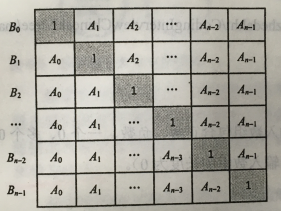

**题目描述**

给定一个数组A[0, 1, …, n-1]，请构建一个数组B[0, 1, …, n-1]，其中B中的元素B[i] =A[0]×A[1]×… ×A[i-1]×A[i+1]×…×A[n-1]。不能使用除法。

**思路分析**



假设B[i]=C[i]*D[i]

C[i] = C[i-1]*A[i-1]，由上往下求

D[i] = D[i+1]*A[i+1]，由下往上求

画图解决！！！

**具体实现：**

```c++
class Solution {
public:
    vector<int> multiply(const vector<int>& A) {
        vector<int> B;
        if(A.size() < 2) return B;
        int temp = 1;
        B.push_back(1);
        for(int i = 1; i < A.size(); i++){
            temp *= A[i - 1];
            B.push_back(temp);
        }
        temp = 1;
        for(int i = A.size() - 2; i >= 0; i--){
            temp *= A[i + 1];
            B[i] *= temp;
        }
        return B;
    }
};
```

