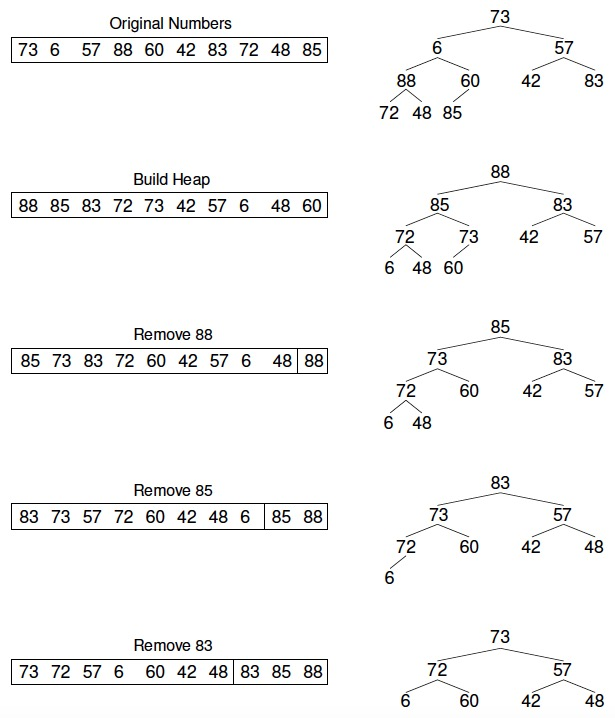

[TOC]

**排序算法分类：**

- 内部排序（在内存中进行排序）
  - 插入排序：直接插入排序   希尔排序
  - 交换排序：冒泡排序   快速排序
  - 选择排序：简单选择排序   堆排序
  - 归并排序
  - 分配排序：桶排序  基数排序
- 外部排序（需要同时访问内存和外存）
  - 多路归并排序

> 稳定性：相同的元素在排序前和排序后的前后位置是否发生改变，没有改变则排序是稳定的，改变则排序是不稳定的 [——八大排序算法的稳定性](https://www.cnblogs.com/codingmylife/archive/2012/10/21/2732980.html)

## 1. 插入排序（稳定）

逐个处理待排序的记录，每个记录与前面已排序的子序列进行比较，将它插入到子序列的正确位置

### **代码**

```c++
template<typename T>
void insertSort(T *arr, int n) {
    for (int i = 1; i < n; ++i) {
        for (int j = i; j > 0 && arr[j] < arr[j - 1]; --j) {
            swap(arr[j], arr[j - 1]);
        }
    }
    return;
}
```

### 性能

- 最佳：升序。时间复杂度为==O(n)==
- 最差：降序。时间复杂度为==O(n^2^)==
- 平均：对于每个元素，前面有一半元素比它大。时间复杂度为==O(n^2^)==
- 空间复杂度：O(1)

> 如果待排序数据已经“基本有序”，使用插入排序可以获得接近O(n)的性能

### 优化

使用复制替代之前的swap操作（每次swap含有3次复制）

```c++
//使用复制替代swap进行优化
template<typename T>
void insertSort1(T *arr, int n) {
    for (int i = 1; i < n; i++){
        T temp = arr[i];
        int j;
        for(j = i; j > 0 && temp < arr[j - 1]; --j){
            arr[j] = arr[j - 1];
        }
        arr[j] = temp;
    }
    return;
}
```

## 2. shell排序（不稳定）

shell排序在不相邻的元素之间比较和交换。利用了插入排序的最佳时间代价特性，它试图将待排序序列变成基本有序的，然后再用插入排序来完成排序工作

在执行每一次循环时，Shell排序把序列分为互不相连的子序列，并使各个子序列中的元素在整个数组中的间距相同，每个子序列用**插入排序**进行排序。每次循环增量是前一次循环的1/2，子序列元素是前一次循环的2倍

最后一轮将是一次“正常的”插入排序（即对包含所有元素的序列进行插入排序）


### 代码

```c++
template<typename T>
void shellSort(T arr[], int n){

    // 计算 increment sequence: 1, 4, 13, 40, 121, 364, 1093...
    int h = 1;
    while( h < n/3 )
        h = 3 * h + 1;

    while( h >= 1 ){

        // h-sort the array
        for( int i = h ; i < n ; i ++ ){

            // 对 arr[i], arr[i-h], arr[i-2*h], arr[i-3*h]... 使用插入排序
            T e = arr[i];
            int j;
            for( j = i ; j >= h && e < arr[j-h] ; j -= h )
                arr[j] = arr[j-h];
            arr[j] = e;
        }

        h /= 3;
    }
}
```

### 性能

选择适当的增量序列，可使shell排序比其它排序方法更有效，一般来说，增量每次除以2时并没有多大效果，而“增量每次除以3”时效果更好

当选择“增量每次除以3”递减时，Shell排序的平均运行时间是O(n^1.5^)，时间复杂度下界为O(nlogn)，最坏时间复杂度为O(n^2^)。shell没有快排快，但比O(n^2^)的时间复杂度算法快很多

空间复杂度：O(1)

## 3. 冒泡排序（稳定）

从数组的底部比较到顶部，比较相邻元素。如果下面的元素更小则交换，否则，上面的元素继续往上比较。这个过程每次使最小元素像个“气泡”似地被推到数组的顶部

### 代码

```C++
template <typename T>
void bubbleSort(T arr[], int n){
    bool swapped;
    do{
        swapped = false;
        for(int i = 1; i < n; i++){
            if(arr[i] < arr[i - 1]){
                swap(arr[i], arr[i - 1]);
                swapped = true;
            }
        }
        n--;
    }while(swapped);
}
```

### 优化

添加变量newn，记录一次循环是否发生了交换，减少不必要的遍历，可以提前结束，常数级的提升

```c++
template<typename T>
void bubbleSort( T arr[] , int n){

    int newn; // 使用newn进行优化

    do{
        newn = 0;
        for( int i = 1 ; i < n ; i ++ )
            if( arr[i-1] > arr[i] ){
                swap( arr[i-1] , arr[i] );

                // 记录最后一次的交换位置,在此之后的元素在下一轮扫描中均不考虑
                newn = i;
            }
        n = newn;
    }while(newn > 0);
}
```

### 性能

冒泡排序是一种相对较慢的排序，没有较好的最佳情况执行时间。通常情况下时间复杂度都是O(n^2^)

空间复杂度：O(1)

## 4. 快速排序（不稳定）

基于分治的策略

首先选择一个轴值，小于轴值的元素被放在数组中轴值左侧，大于轴值的元素被放在数组中轴值右侧，这称为数组的一个分割(partition)。快速排序再对轴值左右子数组分别进行类似的操作

选择轴值有多种方法。最简单的方法是使用首或尾元素。但是，如果输入的数组是正序或者逆序时，会将所有元素分到轴值的一边。较好的方法是随机选取轴值

### 代码

```c++
// 对arr[l...r]部分进行partition操作
// 返回p, 使得arr[l...p-1] < arr[p] ; arr[p+1...r] > arr[p]
template <typename T>
int __partition(T arr[], int l, int r){

    T v = arr[l];

    int j = l; // arr[l+1...j] < v ; arr[j+1...i) > v
    for( int i = l + 1 ; i <= r ; i ++ )
        if( arr[i] < v ){
            j ++;
            swap( arr[j] , arr[i] );
        }

    swap( arr[l] , arr[j]);

    return j;
}

// 对arr[l...r]部分进行快速排序
template <typename T>
void __quickSort(T arr[], int l, int r){

    if( l >= r )
        return;

    int p = __partition(arr, l, r);
    __quickSort(arr, l, p-1 );
    __quickSort(arr, p+1, r);
}

template <typename T>
void quickSort(T arr[], int n){

    __quickSort(arr, 0, n-1);
}
```

### 优化1：随机化partition的数字，数组较小时，可使用插入排序

1. 最明显的改进之处是轴值的选取，如果轴值选取合适，每次处理可以将元素较均匀的划分到轴值两侧

2. 当n很小时，快速排序会很慢。因此当子数组小于某个长度时，什么也不要做。此时数组已经基本有序，最后调用一次插入排序完成最后处理

```c++
// 对arr[l...r]部分进行partition操作
// 返回p, 使得arr[l...p-1] < arr[p] ; arr[p+1...r] > arr[p]
template <typename T>
int _partition(T arr[], int l, int r){

    // 随机在arr[l...r]的范围中, 选择一个数值作为标定点pivot
    swap( arr[l] , arr[rand()%(r-l+1)+l] );

    T v = arr[l];
    int j = l;
    for( int i = l + 1 ; i <= r ; i ++ )
        if( arr[i] < v ){
            j ++;
            swap( arr[j] , arr[i] );
        }

    swap( arr[l] , arr[j]);

    return j;
}

// 对arr[l...r]部分进行快速排序
template <typename T>
void _quickSort(T arr[], int l, int r){

    // 对于小规模数组, 使用插入排序进行优化
    if( r - l <= 15 ){
        insertionSort(arr,l,r);
        return;
    }

    int p = _partition(arr, l, r);
    _quickSort(arr, l, p-1 );
    _quickSort(arr, p+1, r);
}

template <typename T>
void quickSort(T arr[], int n){

    srand(time(NULL));
    _quickSort(arr, 0, n-1);
}
```

### 优化2：使用双路partition（借助双指针）

```c++
// 对arr[l...r]部分进行partition操作
// 返回p, 使得arr[l...p-1] < arr[p] ; arr[p+1...r] > arr[p]
template <typename T>
int _partition(T arr[], int l, int r){

    // 随机在arr[l...r]的范围中, 选择一个数值作为标定点pivot
    swap( arr[l] , arr[rand()%(r-l+1)+l] );

    T v = arr[l];
    int j = l;
    for( int i = l + 1 ; i <= r ; i ++ )
        if( arr[i] < v ){
            j ++;
            swap( arr[j] , arr[i] );
        }

    swap( arr[l] , arr[j]);

    return j;
}

// 双路快速排序的partition
// 返回p, 使得arr[l...p-1] <= arr[p] ; arr[p+1...r] >= arr[p]
// 双路快排处理的元素正好等于arr[p]的时候要注意，详见下面的注释：）
template <typename T>
int _partition2(T arr[], int l, int r){

    // 随机在arr[l...r]的范围中, 选择一个数值作为标定点pivot
    swap( arr[l] , arr[rand()%(r-l+1)+l] );
    T v = arr[l];

    // arr[l+1...i) <= v; arr(j...r] >= v
    int i = l+1, j = r;
    while( true ){
        // 注意这里的边界, arr[i] < v, 不能是arr[i] <= v
        // 思考一下为什么?
        while( i <= r && arr[i] < v )
            i ++;

        // 注意这里的边界, arr[j] > v, 不能是arr[j] >= v
        // 思考一下为什么?
        while( j >= l+1 && arr[j] > v )
            j --;

        // 对于上面的两个边界的设定, 有的同学在课程的问答区有很好的回答:)
        // 大家可以参考: http://coding.imooc.com/learn/questiondetail/4920.html

        if( i > j )
            break;

        swap( arr[i] , arr[j] );
        i ++;
        j --;
    }

    swap( arr[l] , arr[j]);

    return j;
}

// 对arr[l...r]部分进行快速排序
template <typename T>
void _quickSort(T arr[], int l, int r){

    // 对于小规模数组, 使用插入排序进行优化
    if( r - l <= 15 ){
        insertionSort(arr,l,r);
        return;
    }

    // 调用双路快速排序的partition
    int p = _partition2(arr, l, r);
    _quickSort(arr, l, p-1 );
    _quickSort(arr, p+1, r);
}

template <typename T>
void quickSort(T arr[], int n){

    srand(time(NULL));
    _quickSort(arr, 0, n-1);
}
```

### 优化3：三路排序

```c++
// 递归的三路快速排序算法
template <typename T>
void __quickSort3Ways(T arr[], int l, int r){

    // 对于小规模数组, 使用插入排序进行优化
    if( r - l <= 15 ){
        insertionSort(arr,l,r);
        return;
    }

    // 随机在arr[l...r]的范围中, 选择一个数值作为标定点pivot
    swap( arr[l], arr[rand()%(r-l+1)+l ] );

    T v = arr[l];

    int lt = l;     // arr[l+1...lt] < v
    int gt = r + 1; // arr[gt...r] > v
    int i = l+1;    // arr[lt+1...i) == v
    while( i < gt ){
        if( arr[i] < v ){
            swap( arr[i], arr[lt+1]);
            i ++;
            lt ++;
        }
        //此时不对i进行操作
        else if( arr[i] > v ){
            swap( arr[i], arr[gt-1]);
            gt --;
        }
        else{ // arr[i] == v
            i ++;
        }
    }

    swap( arr[l] , arr[lt] );

    __quickSort3Ways(arr, l, lt-1);
    __quickSort3Ways(arr, gt, r);
}

template <typename T>
void quickSort3Ways(T arr[], int n){

    srand(time(NULL));
    __quickSort3Ways( arr, 0, n-1);
}
```

### 性能

1. 对于包含重复大量元素的数组，三路快排具有巨大的优势，对于一般数组和近乎有序的数组，三路快排不是最优的
2. 最好情况：时间复杂度：O(nlogn)，空间复杂度：O(logn)
3. 最坏情况：时间复杂度：O(n^2^)，空间复杂度：O(n)
4. 平均情况：时间复杂度：O(nlogn)，空间复杂度：O(logn)

> 快速排序平均情况下运行时间与其最佳情况下的运行时间很接近，而不是接近其最坏情况下的运行时间。**快速排序是所有内部排序算法中平均性能最优的排序算法**

## 5. 选择排序 (不稳定)

第i次“选择”数组中第i小的记录，并将该记录放到数组的第i个位置。换句话说，每次从未排序的序列中找到最小元素，放到未排序数组的最前面

### 代码

```c++
void selectionSort(int arr[], int n){

    for(int i = 0 ; i < n ; i ++){
        // 寻找[i, n)区间里的最小值
        int minIndex = i;
        for( int j = i + 1 ; j < n ; j ++ )
            if( arr[j] < arr[minIndex] )
                minIndex = j;

        swap( arr[i] , arr[minIndex] );
    }

}
```

### 性能

时间复杂度：不管数组是否有序，在从未排序的序列中查找最小元素时，**都需要遍历完最小序列**，所以时间复杂度为O(n^2^)

空间复杂度：O(1)

稳定性：不稳定

### 优化

每次内层除了找出一个最小值，同时找出一个最大值（初始为数组结尾）。将最小值与每次处理的初始位置的元素交换，将最大值与每次处理的末尾位置的元素交换。这样一次循环可以将数组规模减小2，相比于原有的方案（减小1）会更快

```c++
// 在每一轮中, 可以同时找到当前未处理元素的最大值和最小值
template<typename T>
void selectionSort(T arr[], int n){

    int left = 0, right = n - 1;
    while(left < right){
        int minIndex = left;
        int maxIndex = right;

        // 在每一轮查找时, 要保证arr[minIndex] <= arr[maxIndex]
        if(arr[minIndex] > arr[maxIndex])
            swap(arr[minIndex], arr[maxIndex]);

        for(int i = left + 1 ; i < right; i ++)
            if(arr[i] < arr[minIndex])
                minIndex = i;
            else if(arr[i] > arr[maxIndex])
                maxIndex = i;

        swap(arr[left], arr[minIndex]);
        swap(arr[right], arr[maxIndex]);

        left ++;
        right --;
    }

    return;
}
```

## 6. 堆排序（不稳定）

堆排序首先根据数组构建最大堆，然后每次“删除”堆顶元素（将堆顶元素移至末尾）。最后得到的序列就是从小到大排序的序列



### 代码

这里直接使用C++ STL中堆的构建与删除函数

```c++
template <class Elem>
void heapsort(Elem A[],int n)
{
    Elem mval;
    int end = n;
    make_heap(A,A + end);
    for(int i = 0;i < n;i++){
        pop_heap(A,A + end);
        end--;
    }
}
```

如果不能使用现成的库函数：

```c++
/********************************************
 * 向堆中插入元素
 *  hole：新元素所在的位置
 ********************************************/
template <class value>
void _push_heap(vector<value> &arr,int hole){
    value v = arr[hole];//取出新元素，从而产生一个空洞
    int parent = (hole - 1) / 2;
    //建最大堆，如果建最小堆换成 arr[parent] > value
    while(hole > 0 && arr[parent] < v){
        arr[hole] = arr[parent];
        hole = parent;
        parent = (hole - 1) / 2;
    }
    arr[hole] = v;
}

/********************************************
 * 删除堆顶元素
 ********************************************/
template <class value>
void _pop_heap(vector<value> &arr,int sz)
{
    value v = arr[sz - 1];
    arr[sz - 1] = arr[0];
    --sz;
    int hole = 0;
    int child = 2 * (hole + 1); //右孩子
    while(child < sz){
        if(arr[child] < arr[child - 1])
            --child;
        arr[hole] = arr[child];
        hole = child;
        child = 2 * (hole + 1);
    }
    if(child == sz){
        arr[hole] = arr[child - 1];
        hole = child - 1;
    }
    arr[hole] = v;
    _push_heap(arr,hole);
}

/********************************************
 * 建堆
 *  sz：删除堆顶元素后的大小
 *  v： 被堆顶元素占据的位置原来的元素的值
 ********************************************/
template <class value>
void _make_heap(vector<value> &arr)
{
    int sz = arr.size();
    int parent = (sz - 2) / 2;
    while(parent >= 0){
        int hole = parent;
        int child = 2 * (hole + 1); //右孩子
        value v = arr[hole];
        while(child < sz){
            if(arr[child] < arr[child - 1])
                --child;
            arr[hole] = arr[child];
            hole = child;
            child = 2 * (hole + 1);
        }
        if(child == sz){
            arr[hole] = arr[child - 1];
            hole = child - 1;
        }
        arr[hole] = v;
        _push_heap(arr,hole);
        --parent;
    }
}

template <class value>
void heap_sort(vector<value> &arr)
{
    _make_heap(arr);
    for(int sz = arr.size();sz > 1;sz--)
        _pop_heap(arr,sz);
}
```

### 性能

根据已有数组构建堆需要O(n)的时间复杂度，每次删除堆顶元素需要O(logn)的时间复杂度，所以总的时间开销为，O(n+nlogn)，平均时间复杂度为O(nlogn)，**性能不如归并排序和快速排序，但适合于动态数据的维护**

>注意根据已有元素建堆是很快的，如果希望找到数组中第k大的元素，可以用O(n+klogn)的时间，如果k很小，时间开销接近O(n)
