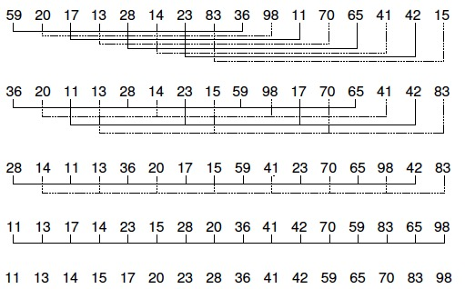
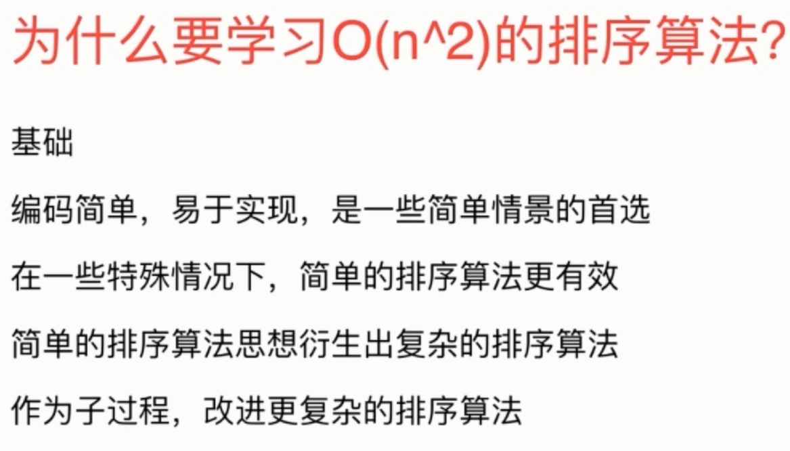

[TOC]

**排序算法分类：**

- 内部排序（在内存中进行排序）
  - 插入排序：直接插入排序   希尔排序
  - 交换排序：冒泡排序   快速排序
  - 选择排序：简单选择排序   堆排序
  - 归并排序
  - 分配排序：桶排序  基数排序
- 外部排序（需要同时访问内存和外存）
  - 多路归并排序

## 1. 插入排序（稳定）

逐个处理待排序的记录，每个记录与前面已排序的子序列进行比较，将它插入到子序列的正确位置

### **代码**

```c++
template<typename T>
void insertSort(T *arr, int n) {
    for (int i = 1; i < n; ++i) {
        for (int j = i; j > 0 && arr[j] < arr[j - 1]; --j) {
            swap(arr[j], arr[j - 1]);
        }
    }
    return;
}
```

### 性能

- 最佳：升序。时间复杂度为==O(n)==
- 最差：降序。时间复杂度为==O(n^2^)==
- 平均：对于每个元素，前面有一半元素比它大。时间复杂度为==O(n^2^)==

> 如果待排序数据已经“基本有序”，使用插入排序可以获得接近O(n)的性能

### 优化

使用复制替代之前的swap操作（每次swap含有3次复制）

```c++
//使用复制替代swap进行优化
template<typename T>
void insertSort1(T *arr, int n) {
    for (int i = 1; i < n; i++){
        T temp = arr[i];
        int j;
        for(j = i; j > 0 && temp < arr[j - 1]; --j){
            arr[j] = arr[j - 1];
        }
        arr[j] = temp;
    }
    return;
}
```

## 2. shell排序

shell排序在不相邻的元素之间比较和交换。利用了插入排序的最佳时间代价特性，它试图将待排序序列变成基本有序的，然后再用插入排序来完成排序工作

在执行每一次循环时，Shell排序把序列分为互不相连的子序列，并使各个子序列中的元素在整个数组中的间距相同，每个子序列用**插入排序**进行排序。每次循环增量是前一次循环的1/2，子序列元素是前一次循环的2倍

最后一轮将是一次“正常的”插入排序（即对包含所有元素的序列进行插入排序）




# 1. O（n^2）的排序算法



### 冒泡排序

### 选择排序

每种情况下几乎都为O（n^2）的时间复杂度.

### 希尔排序

时间复杂度：跟增量序列有关，一般为O(n^1.3)，最坏时间复杂度为O(n^2)，最好时间复杂度为O(nlogn)

## 2. O(nlogn)的排序算法

### 归并排序（要求稳定算法时，常用）

递归实现；迭代实现

### 快速排序（最常用）

### 堆排序

性能不如归并排序和快速排序，但适合于动态数据的维护

## 3. 时间复杂度，空间复杂度，稳定性