[TOC]

# 1. 时间复杂度

- 最坏时间复杂度
- 最好时间复杂度
- 平均时间复杂度
- 均摊时间复杂度
- 复杂度震荡（解决方案Lazy）

# 2.  数组

## 基本操作

- 二次封装，添加，查询，修改，包含，搜索，删除元素
- 支持泛型
- 动态数组（实现resize） 

> 代码参考：https://github.com/houpengfei88/Play-with-Data-Structures/blob/master/02-Arrays/07-Dynamic-Array/Array.h

# 3. 栈与队列

## 栈

- 第一种方案：基于动态数组

  - 应用案例：括号匹配

- 第二种方案：基于链表

  > 代码参考链接：https://github.com/houpengfei88/Play-with-Data-Structures/blob/master/04-Linked-List/06-Implement-Stack-in-LinkedList/LinkedListStack.h

## 队列

- 第一种方案：基于动态数组 （dequeue()出队函数时间复杂度为O(n)）

- 第二种方案：基于链表

  > 代码参考链接：https://github.com/houpengfei88/Play-with-Data-Structures/blob/master/04-Linked-List/07-Implement-Queue-in-LinkedList/LinkedListQueue.h

- 循环队列

  - 队列为空：front == tail

  - 队列为满：（tail + 1）% capacity == front

  - Size:（tail + capacity - front) % capacity

  - resize函数实现

    ```c++
    void resize(int newCapacity){
        //tail同时为标志位，多占用一个数据，故需要加1
        T *newData = new T[newCapacity + 1];
        for (int i = 0; i < getSize(); ++i){
            newData[i + front] = data[front];
        }
        data = newData;
        //tail本身是没有具体数据的，所以其为getSize（）
        tail = getSize();
        front = 0;
        capacity = newCapacity;
    }
    ```

    

  > 代码参考：https://github.com/houpengfei88/Play-with-Data-Structures/blob/master/03-Stacks-and-Queues/06-Loop-Queue/LoopQueue.h
  >
  > 用于性能测试的样例：https://github.com/houpengfei88/Play-with-Data-Structures/blob/master/03-Stacks-and-Queues/08-Queues-Comparison/main.cpp

# 4. 链表

- 空白头结点，保证书写算法时逻辑上的一致性，如插入头结点和在中间插入节点
- 链表是一种天然适合递归的结构

# 5. 二分搜索树

- 优点：

  1. 高效

     不仅可查找数据；还可高效地插入，删除数据-动态维护数据

     可以方便地回答很多数据之间 的关系问题：

     - min, max, floor, ceil, rank, select

- 天然递归的结构

## TODO

- 深度优先遍历（前序、中序、后序）(**TODO**)

  ```c++
  //非递归实现
  #include <iostream>
  #include <vector>
  #include <stack>
  #include <cassert>
  
  using namesapce std;
  
  //定义node
  struct TreeNode{
      int val;
      TreeNode *left;
      TreeNode *right;
      TreeNode(int x): val(x), left(NULL), right(NULL){}
  };
  
  class Solution{
      //前序遍历
      vector<int> preorderTraversal(TreeNode* root){
          
      }
  }
  ```

- 广度优先遍历（层序）

- 删除节点（递归方法）：

  ```c++
  Node* remove(Node* node, Key key){
      if (node == NULL)
          return node;
      
      if (key < node){
          node->left = remove(node->left, key);
          return node;
      }
      else if (key > node){
          node->right = remove(node->right, key);
          return node;
      }
      else{
          //待删除节点左子树为空的情况
          if(node->left == NULL){
              Node* rightNode = node->right;
              delete node;
              count--;
              return rightNode;
          } 
          //待删除节点右子树为空的情况
          if(node->right == NULL){
              Node* leftNode = node->left;
              delete node;
              count--;
              return leftNode;
          }
          //左右字数均不为空的情况
          Node* successor = new Node(minimum(node->right));
          successor->left = node->left;
          successor->right = removeMin(node->right);
          delete node;
          count--;
          return successor;
      }  
  }
  ```

# 6. 优先队列与堆

## 优先队列

- 普通队列：先进先出；后进后出

- 优先队列：出队顺序与入队顺序无关；和优先级有关（一种上一层封装）

- 实现方式：堆

- 经典问题：

  - 在1000000个元素中选出前100名？即在N个元素中选出前M个元素 ？
    1. 排序？NlogN
    2. 优先队列？NlogM

  

## 堆

- 是**平衡二叉树**
- 二叉堆
  - 一种完全二叉树
  - 堆中某个节点的值总是不大于其父节点的值（最大堆，相应的可以定义最小堆）
  - 用数组存储二叉堆
  	- 从下标1开始，0空出
  		- parent(i) = i/2
  		- left child(i) = i*2
  		- right child(i) = i*2+1
  	- 从下标0开始
  		- parent(i) = (i-1)/2
  		- left child(i) = i*2+1
  		- right child(i) = i*2+2

-基本操作：
	1. 添加元素：上浮shift up
	2. 取出元素：下沉元素shift down

```C++
T findMax(){
	if(data->isEmpty){
        throw Empty;
    }
    return data->get(0);
}

T extractMax(){
    T ret = findMax();
    //交换最大值与最后一个元素
    data->swap(0, data->getSize() - 1);
    //删除最后一个元素
    data->removeLast();
    
    shiftDown(0);
    
    return ret;
}

void shiftDOwn(int k){
    while(leftChild(k) < data->getSize()){
        int j = leftChild(k);
        //判断右节点是否不满足
        if(j + 1 < data.getSize() && data->get(j + 1) > data->get(k)){
            j++;
        }
        //判断左节点是否不满足
        if(data->get(k) >= data->get(j)){
            break;
        }
        data->swap(k, j);
        k = j;
    }
}
```

3. 替换元素：replace（直接将要换入元素直接放到顶层）
4. 将任意数组整理成堆的形状：heapify
   - 如何定位最后一个**非叶子节点**？转换为最后一个节点的父节点
   - 思路：从最后一个非叶子节点开始遍历到0，分别进行shiftDown操作。
     - 时间复杂度：O（n），若一个个进行插入，将是O（nlogn）

# 7. 线段树（区间树）

- 更新：更新区间中一个元素或一个区间的值 O（log（n））

- 查询一个区间[i, j]的最大值，最小值或者区间数字和 O（log（n））

- 应用场景：适用于同时具有更新和查询需求的应用

- 是**平衡二叉树**

- 数组表示

  - 需要**4n**的大小的静态空间，不考虑添加元素，即区间大小确定，当n=**2^k**时，一颗满二叉树，此时只需要**2n**大小的空间
  - 当不考虑区间等分时，平衡空间利用情况，n的各种情况均只需要**2n**大小的空间
  - 创建线段树

  ```c++
  //创建函数对象，使线段树不局限于一种功能
  std::function<T(T, T)> function;
  
  //核心：使用递归的思路，获得子树的值，从而获得父节点的值
  void buildSegmentTree(int treeIndex, int l, int r){
      if(l == r){
          tree[treeIndex] = data[l];
          return;
      }
      int leftIndex = leftChild(treeIndex);
      int rightIndex = rightChild(treeIndex);
      int mid = l + (r - l) / 2;
      
      buildSegmentTree(leftIndex, l, mid);
      buildSegmentTree(rightIndex, mid + 1, r);
      
      tree[treeIndex] = function(tree[leftTreeIndex], tree[rightTreeIndex]);
      
  }
  ```

  - 查询操作

  ```c++
  //核心：使用递归实现
  T query(int treeIndex, int l, int r, int queryL, int queryR) {       
      //递归终止条件
      if (l == queryL && r == queryR) {    
          return tree[treeIndex];        
      }
      
      int mid = l + (r - l) / 2;    
      int leftTreeIndex = leftChild(treeIndex);    
      int rightTreeIndex = rightChild(treeIndex);   
      
      if (queryL >= mid + 1)     
          return query(rightTreeIndex, mid + 1, r, queryL, queryR);       
      } else if (queryR <= mid) {  
          return query(leftTreeIndex, l, mid, queryL, queryR);        
      }    
  
      T leftResult = query(leftTreeIndex, l, mid, queryL, mid);
      T rightResult = query(rightTreeIndex, mid + 1, r, mid + 1, queryR);
      return function(leftResult, rightResult);    
  }
  ```

  - 在使用线段树时，需要自己敲出构建，查询线段树的代码
  - 典型例题Leetcode307：[区域和查询](https://www.bilibili.com/video/av15683671?from=search&seid=14170984308276291420)

# 8. 字符串

- 字符串定义

  ```c++
  typedef struct {
      char *ch;
      int length;
  }SString;
  ```

## 模式匹配

  - ### **BF算法**

    1. 从S的第一个字符开始，与T的第一个字符比较，相等，继续，否则转向下一步

       。。。

    2. 如果T比较完毕，则返回T在S中的第一个字符出现的位置

    3. 如果S比较完毕，则返回0，T在S中未出现

  - ### **RK算法**

    - 对每个子串分别求哈希值，然后拿子串的哈希值和模式串的哈希值进行比较，减少比较时间。所以理想情况下，时间复杂度为O（n），跟BF算法相比，效率提升很多。取决于哈希算法的设计方法，如果存在冲突的情况下，时间复杂度会退化。极端情况下，退化为O（n * m ）。

- ### **BM（Boyer-Moore）算法**：文本编辑器中的查找功能是如何实现的？

  - BM算法包含两部分，分别是坏字符规则和好后缀规则

  - 坏字符规则

    - 按照模式串下标从大到小进行匹配

    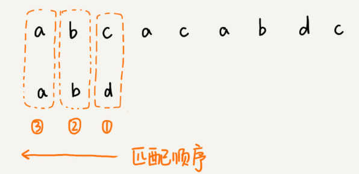

    - 当发现某个字符没法匹配的时候，把这个没有办法进行匹配的字符称作坏字符（主串中的字符）
    - 当发生不匹配时，把坏字符对应的模式串中的字符下标记做si。如果坏字符在模式串中存在，把这个坏字符在模式串中的下标记作xi，不存在，记作-1。那模式串往后移动位数就等于si-xi（这里的下标均指字符在模式串中的下标），若坏字符在多处出现，在计算xi时，选择最靠后的那个，不会让字符串滑动过多，导致原本可能匹配的情况被略过。

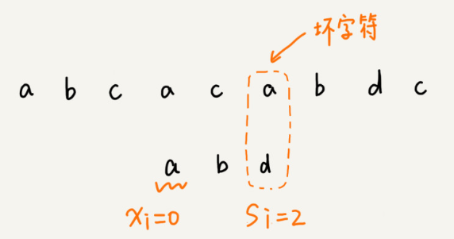

​				- 利用坏字符规则，最好情况下的时间复杂度非常低，是O（n / m）。但是单纯使用坏字符规则是不够的，由于si - xi计算出的移动位数可能是负数，此时，不但不会向后滑动模式串，还有可能后退，所以还需要好后缀规则。

​        - 好后缀规则

​				把已经匹配好的bc叫作好后缀，记做{u}。拿它在模式串中查找，找到了另一个与{u}相匹配的子串{u1}，将模式串滑动到子串{u1}与主串中{u}对齐的位置 

​				如果在模式串中找不到另一个等于{u}的子串，就直接将模式串，滑动到主串中{u}的后面，因为之前的任何一次往后滑动，都没有匹配主串中{u}的情况，但该种情况下可能错过模式串可以和主串匹配的情况

​				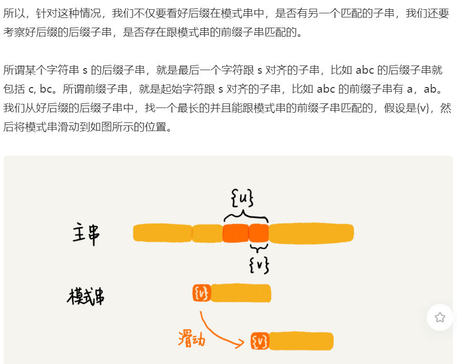

​	- 两种规则如何选择？

​		- 分别计算好后缀和坏字符可以往后滑动的位数，然后取两个数中最大的，作为模式串往后滑动的位数，此时可以避免根据坏字符规则，计算得到的往后滑动的位数，有可能是负数的情况。

​    - 代码书写？

  1.   坏字符规则，借助散列表，将模式串中的每个字符及其下标存在散列表中，这样就可以快速找到模式串的位置下标了

  2.   好后缀的处理规则：

       - 在模式串中，查找跟好后缀匹配的另一个子串；
       - 在好后缀的后缀子串中，查找最长的，能跟模式串前缀子串匹配的后缀子串

       处理规则：在模式串和主串正式匹配之前，通过预处理模式串，预先计算好每个后缀子串，对应的另一份可匹配子串的位置。

       - 需要两个数组，suffix数组，下标为K，表示后缀子串的长度，下标对应的数值是，在模式串中跟好后缀{u}相匹配的子串{u*}的起始下标值。

       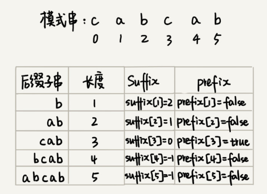

       - bool类型的prefix数组，记录模式串的后缀子串是否能匹配模式串的前缀子串
       - 如何求两个数组？

       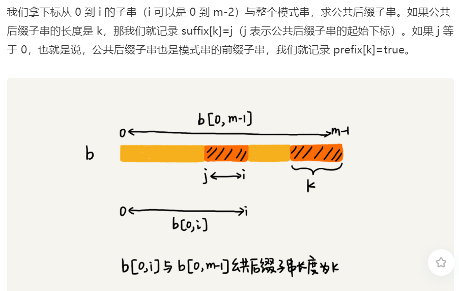

       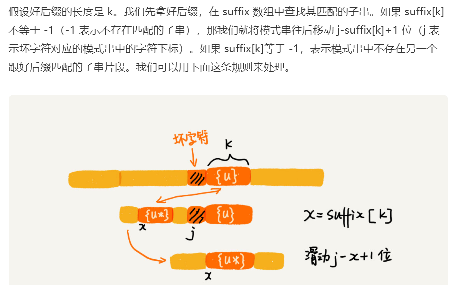

       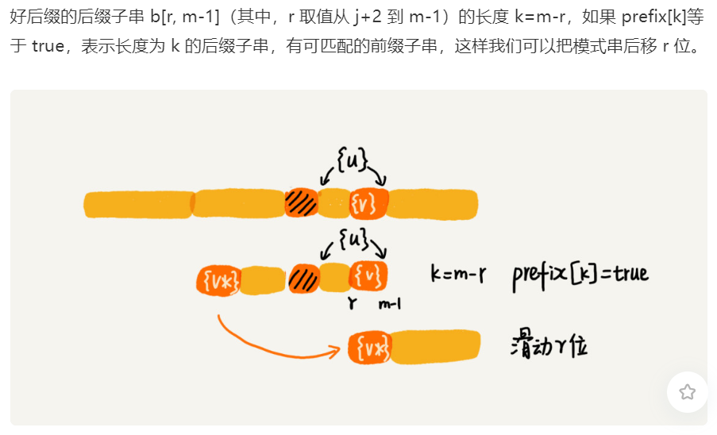

       - 如果两条规则都没有找到可以匹配好后缀及其后缀子串的子串，就将整个模式串后移m位。

  3.   性能分析

         1.   内存消耗：额外的3个数组，bc与字符集大小有关，suffix和prefix和模式串的长度有关
         2.   当处理的==字符集很大时==，bc对内存消耗很多。由于好后缀和坏字符规则独立，对内存要求苛刻时，可以只使用好后缀规则，效率可能降低。
         3.   最坏情况下，时间复杂度达到O(3n)
       
  4.   总结

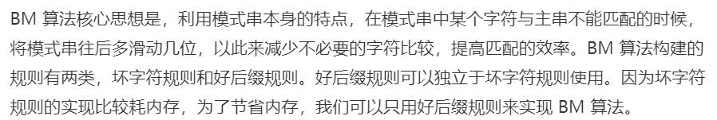

  - ### **KMP算法**

    - ==前缀==：从先向后取若干字符，==后缀==：从后向前取若干字符，前缀后缀==不能取字符串本身==

    - T中当前j指向字符前面的所有字符为T‘，只需要比较==T’的前缀和后缀==

    - next[j]表示j需要回退的位置，T‘=“t1t2t3...tj-1"，则：

      next[j] =  0,   j = 1

      ​				lmax + 1，T’的相等前缀和后缀的最大长度为lmax

      ​				1，没有相等的前缀和后缀

    - 如何求next[j]，动态规划

      - 已知next[j] = k，则对于next[j + 1]?
      1. tk = tj：next[j + 1] = k + 1，即相等的前缀和后缀的长度多1
        2. tk != tj，又开始了这两个串的模式匹配，回退找next[k] = k'的位置，比较tk'是否与tj是否相等
           1. 相等，则next[j + 1] = k' + 1
           2. 继续寻找，直到next[1] = 0停止

    ```c++
    void get_next(SString T, int next[]){
        int j = 1, k = 0;
        next[1] = 0;
        while(j < T[0]){//T[0]保存字符串的长度
            if(k == 0 || T[k] == T[j]){
                next[++j] = ++k;
            }
            else{
                k = next[k];
          }
        }
    }
    ```

    - KMP算法实现

      ```C++
      int Index_KMP(SString S, SSting T, int pos, int next[]){
          //利用模式串T的next函数求T在主串S中的pos个字符之后的位置
          //其中，T非空，1<=pos<=S[0],S[0]为字符串的长度
          int i = pos, j = 1;
          while(i <= S[0] && j <= T[0]){
              if(j == 0 || S[i] == T[j]){
                  ++i;
                  ++j;
              }
              else{
                  j = next[j];
              }
          }
          if(j > T[0]){ //匹配成功
              return i - T[0];
          }
          else{
    		return 0;  
              }
    }
      ```
      
    - KMP与BF算法的复杂度比较

      - 设S，T的长度分别为n，m，KMP算法的特点是：==i不回退==，当S[i] != T[j]时，j回退到next[j]，重新开始。最坏情况，扫描整个S串，时间复杂度为O（n），next[]复杂度为O（m），总得时间复杂度为O（m + n）
      
      - BF算法的最坏时间复杂度为O(m x n)，但在实际应用中，BF算法时间复杂度一般为O（m + n），只有在主串和子串有很多部分匹配时，KMP才更优越。
      
      - KMP算法改进：
      
        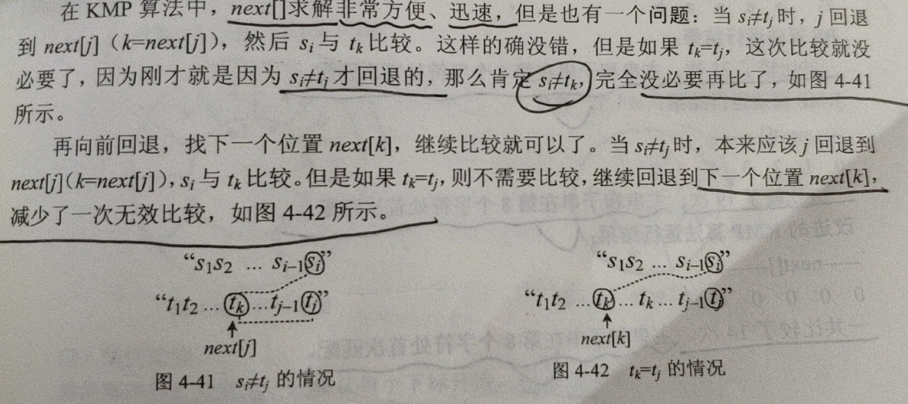


```c++
void get_next2(SString T, int next[]){
    int j = 1, k = 0;
    next[1] = 0;
    while(j < T[0]){
        if(k == 0 || T[j] == T[k]){
            ++k;
            ++j;
            if(T[j] == T[k]){
                next[j] = next[k];
            }
            else{
                next[j] = k;
            }
        }
        else{
            k = next[k];
        }
    }
}

//只是进行常数意义上的改进，没有降阶，时间复杂度仍为O(m + n)
```

## Trie (字典树 前缀树)

树形结构，专门用于处理字符串匹配函数的数据结构，用于解决在一组字符串集合汇总快速查找某个字符串的问题，如搜索引擎的搜索关键词提示功能。

- 专门为处理字符串设计

  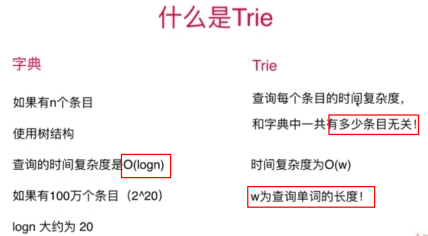

- 添加操作

  ```c++
  //节点定义
  class Node{
  public:
  	bool isWord;
      map<char, Node> next;
      
      Node(bool isWord){
          this->isWord = isWord;
      }
      
      Node(): isWord(false), next(){}
  };
  
  //添加操作
  void add(string word){
      Node* cur = root;
      for(int i = 0; i < word.size(); ++i){
          char c = word.at(i);
          if(cur->next.find(c) == cut->next.end()){
              cur->next.insert(pair<char, Node>(c, Node()))
          }
          //find()函数返回的是一个指针，next是一个对象
          cur = &cur->next.find(c)->second;
      }
      
      if(!cur->isWord){
          cur->isWord = true;
          size++; 
  }
  ```
  
- 查询操作

  ```c++
  bool contains(string word){
      Node *cur == root;
      for(int i = 0; i < word.size(); ++i){
          char c = word.at(i);
          if(cur->next.find(c) == cur->next.end()){
              return false;
          }
          //cur是一个指针，取地址操作
          //find()函数返回的是一个指针
          cur = &cur->next.find(c)->second;
      }
      return cur->isWord;
  }
  ```

- 前缀搜索（前缀树）

  ```c++
  bool startWith(string prefix){
      NOde *cur == root;
      for(int i = 0; i < word.size(); ++i){
          char c = word.at(i);
          if(cur->next.find(c) == cur->next.end()){
              return false;
          }
          //cur是一个指针，取地址操作
          //find()函数返回的是一个指针
          cur = &cur->next.find(c)->second;
      }
      return true;
  }
  ```


- 删除操作

   

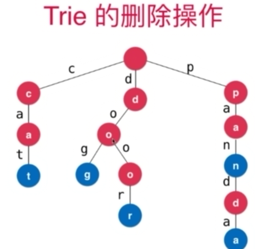

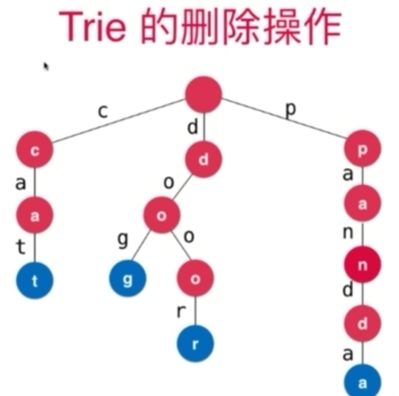

- 最大的问题：
  
  - 占有空间大（每个节点有多个数据，节点数据远远大于1字节），用的是一种空间换时间的思路
  
  - 解决方法：
    1. 压缩字典树：维护成本较高
    2. 三分搜索树：节省空间，牺牲时间
- Trie与散列表，红黑树的比较
  - 字符串的匹配问题就是数据查找的问题，Trie对处理的字符串有严苛的要求
    1. 字符串中包含的字符集不能太大，字符集太大，存储空间就会浪费很多，即便能够优化，也要付出牺牲查询，插入效率等代价
    2. 要求字符串的前缀重合比较多，不然空间消耗会变大很多
    3. 如果用Trie树解决问题，要从零实现，工程上将简单问题复杂化
    4. 指针串起来的数据块是不连续的，而Trie中用到指针，对缓存并不友好，性能有折扣
  - 针对在一组字符串中查找字符串的问题，倾向于散列表或红黑树，不需要自己实现。
  - Trie不适合精确匹配查找，更适合散列表和红黑树解决，Trie适合查找前缀匹配的字符串。
- 总结：

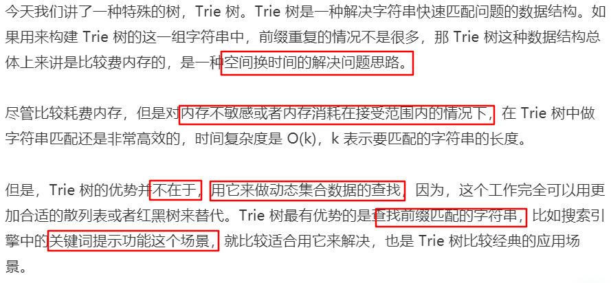

> 示例代码链接：https://github.com/houpengfei88/Play-with-Data-Structures/tree/master/10-Trie/04-Prefix-in-Trie

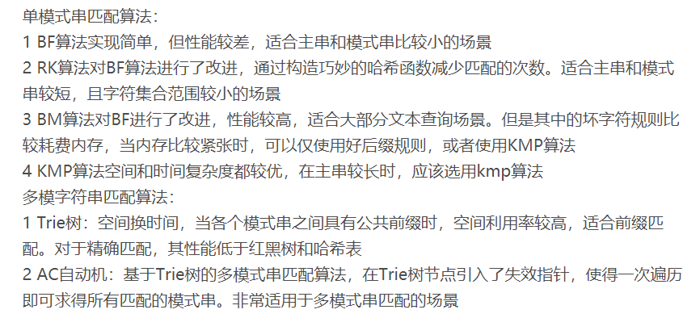

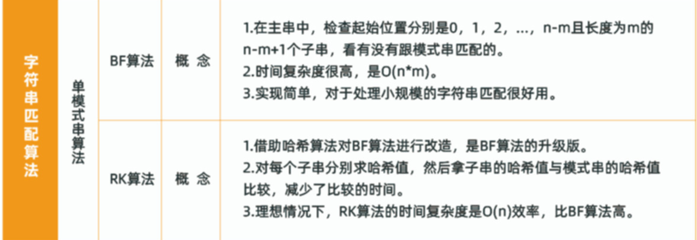

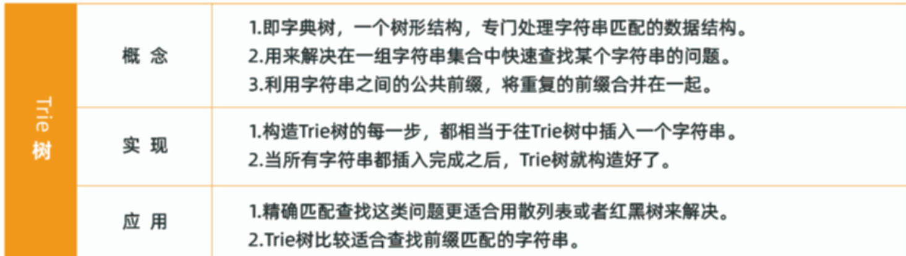


# 9.并查集

- 通常用于解决**连接**问题和**路径**问题

- **实现方式1**（基于数组实现）：

  - 查找find()时间很快，O(1)
  - 合并unionElements()慢，O(n)

- **实现方式2**（常规解决方式）

  - 使用节点的思想，进行union时，指向根节点，防止高度过高，同样可以利用数组进行实现，时间复杂度跟树的高度相关

  - 基于**方式2**方法的优化

    1. 基于size的优化（优化union）

       分别记录两个集合的大小，将集合较小的根节点指向集合较大的根节点

    2. 基于rank的优化（rank[i]表示根节点为i的树的高度）（优化union）

       可以处理比较极端的情况，最常用

    3. 路径压缩（优化find）
    
       - 在查找过程中，减少树的高度
    
        	 1. 节点的父亲指向节点父亲的父亲
    
        2. 所有节点都指向根节点（使用递归）
    
             理论上更好，但由于递归增加的额外开销，可能没有方式1好。
       
       - 由于路径压缩的实现，rank可能不在表示层数，我们也不需要维护rank的语义，它只是作为一个比较的标准
       
         
    
  - 时间复杂度（近乎O(1)级别的，查询和合并操作均是这样）

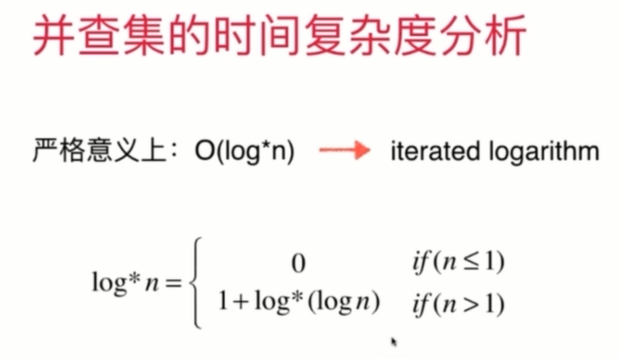

> 示例代码链接：https://github.com/liuyubobobo/Play-with-Algorithms/tree/master/06-Union-Find/Course%20Code%20(C%2B%2B)


# 10. AVL树

- 对于任意一个节点，左子树和柚子树的高度差不超过1

- 标注每个节点的高度，计算平衡因子（高度差）
- 为防止旋转操作代码出错，可编写代码确定是否为二分搜索树和考察树的平衡性进行确定：
  - 是否为二分搜索树：二分搜索树的中序遍历结果是顺序排列的

- 旋转操作：
  1. 右旋转（左-左）

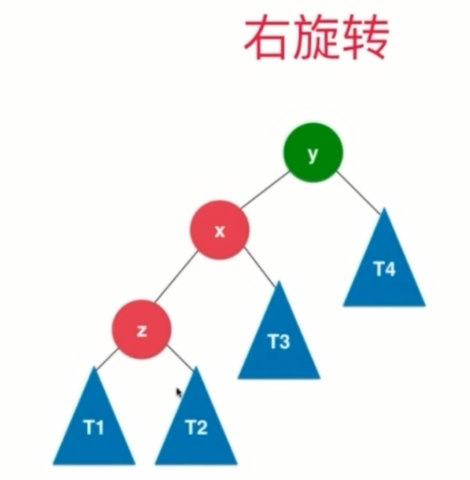


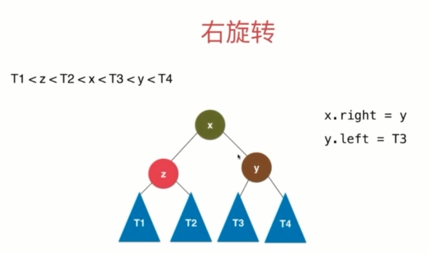


  2. 左旋转（右-右）

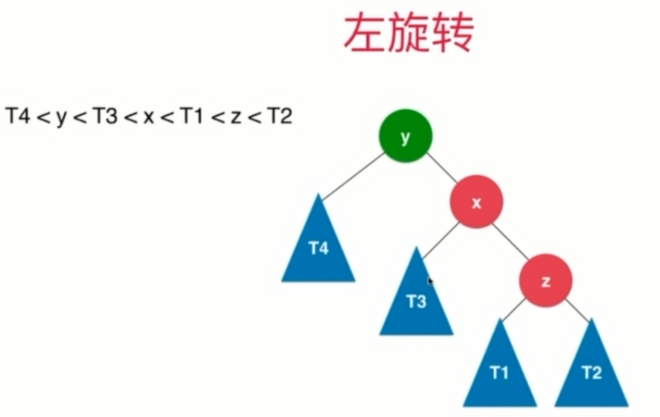

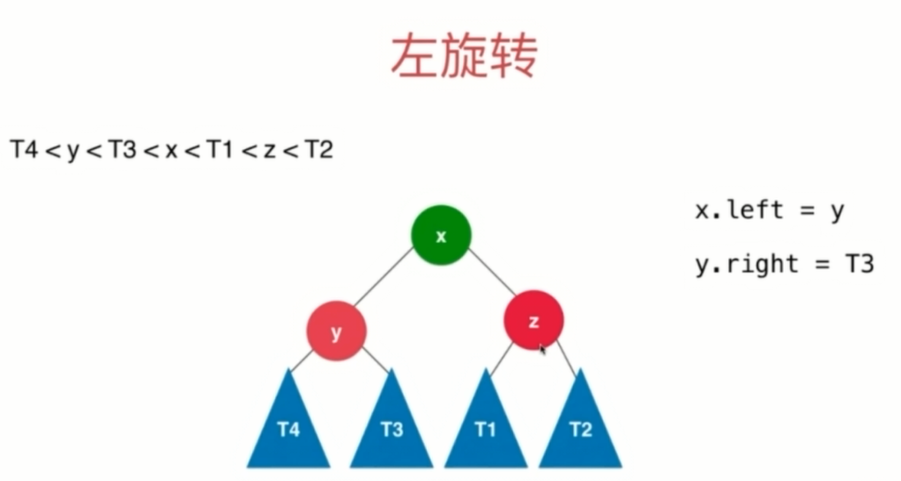

```c++
//右旋转
Node* rightRotate(Node *y){
    Node *x = y->left;
    Node *tmp = x->right;
    
    x->right = y;
    y->left = tmp;
    
    y->height = max(getHeight(y->left), getHeight(y->right)) + 1;
    x->height = max(getHeight(x->left), getHeight(x->right)) + 1;
    
    return x;
}
//左旋转
Node* leftRotate(Node *y){
    Node *x = y->right;
    Node *tmp = x->left;
    
    x->left = y;
    y->right = tmp;
    
        y->height = max(getHeight(y->left), getHeight(y->right)) + 1;
    x->height = max(getHeight(x->left), getHeight(x->right)) + 1;
    
    return x;
}
```

3. LR(左-右)


4. RL（右-左）

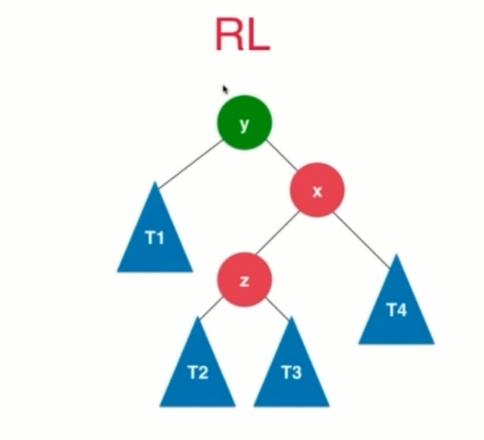

- 删除操作

> 参考代码：https://github.com/houpengfei88/Play-with-Data-Structures/blob/master/12-AVL-Tree/07-Remove-Elements-in-AVL-Tree/AVLTree.h

# 11. 红黑树

- 一种二叉搜索树

- 红黑树与2-3树的等价性

  - 2-3树

    

    - 是一种绝对平衡的树，左右子树的高度绝对平等
    - 等价性

    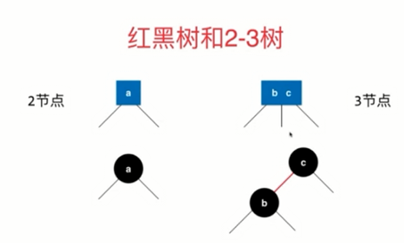

    

      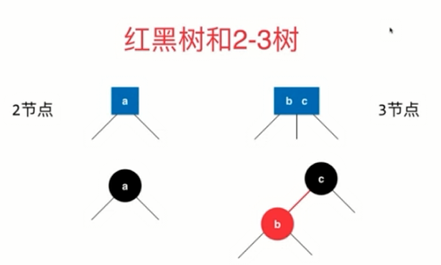  


- 定义：

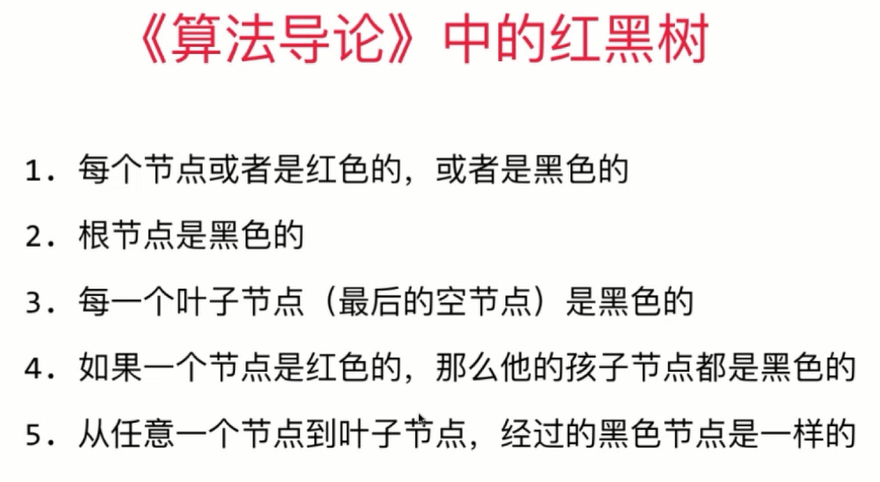

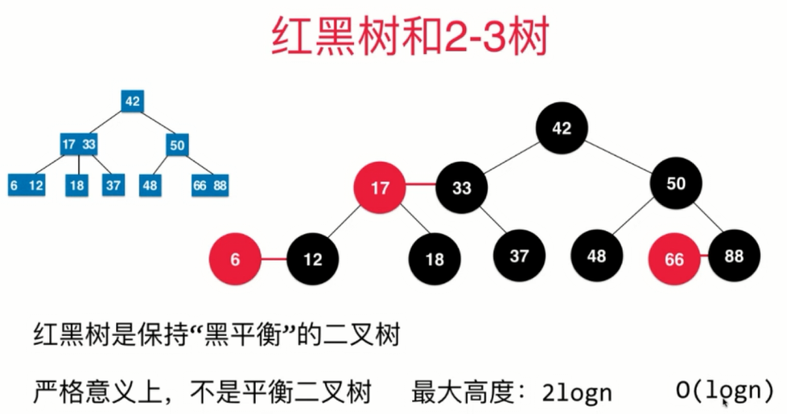

- 添加操作：
`前提：`
	`1. 模拟2-3树的添加过程；`
	`2. 添加元素的节点起先均为红色；`
	`3. 向上融合的节点的元素均为红色。`

  - 保持根节点的元素为黑色

  - 2节点添加节点：
  
    - 添加元素到左边（直接添加）
    
    

    - 添加元素到右边（左旋转）

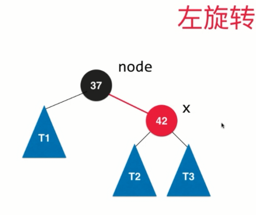

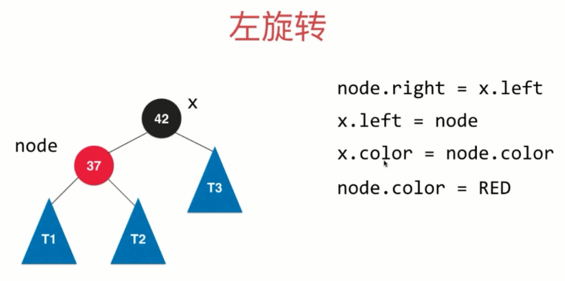

      1. AVL树的左旋转
      2. x的颜色变为node的颜色
      3. node的颜色为红色

  - 3节点添加节点：
- 情形一：（3节点右边添加节点）

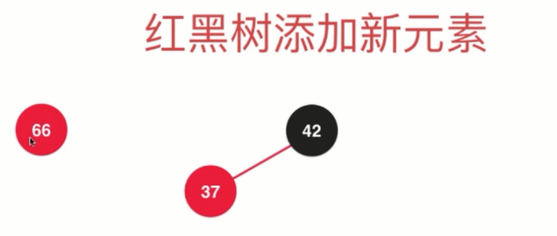

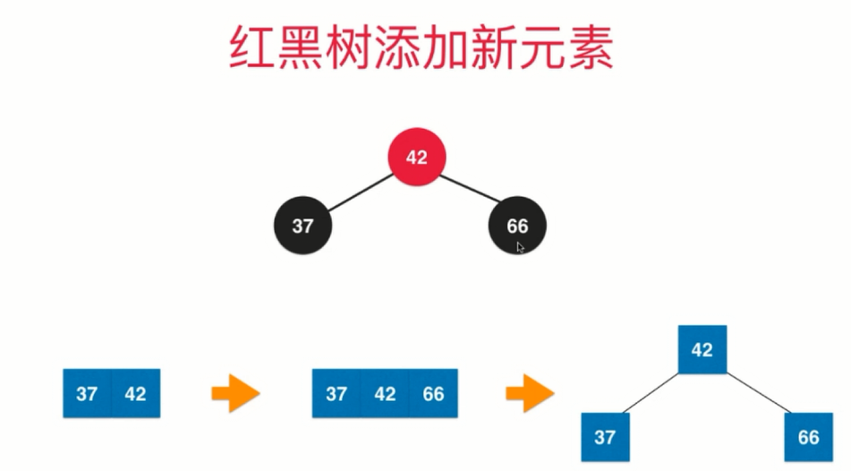

 					`进行颜色反转`

​	- 情形二：（3节点左边添加节点）(右旋转)


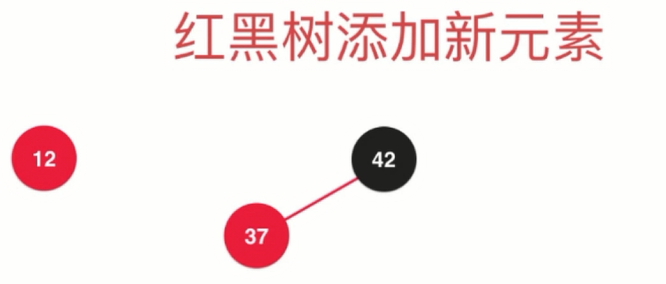

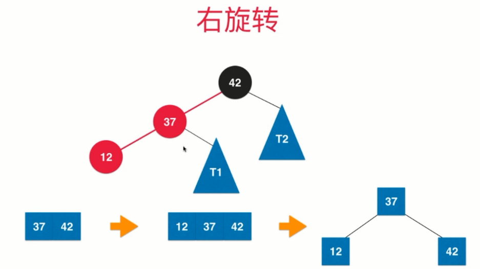

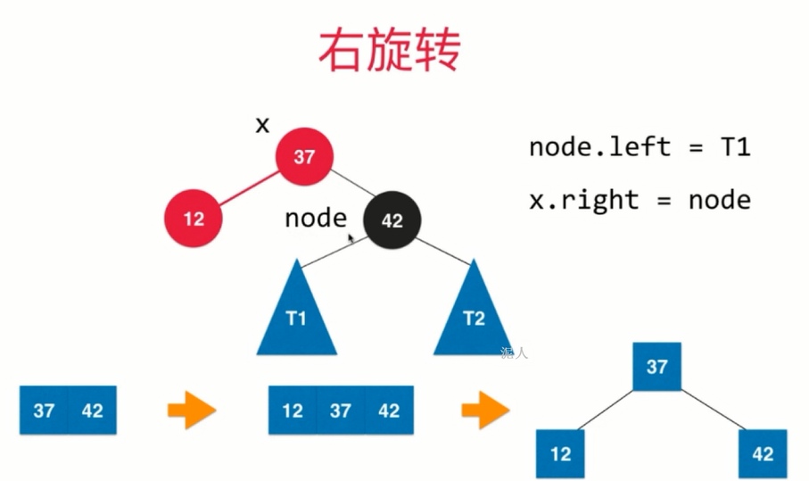

​			

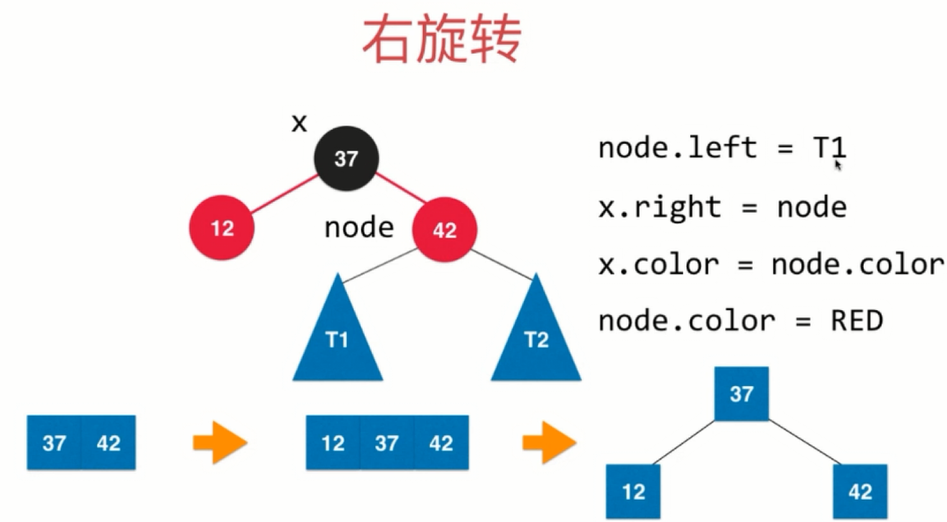

​				`1.右旋转`

​				`2. 37保持原有42元素的颜色一致`

​				`3. 42变为红色，表示3个节点是融合在一起的`

​				`4. 颜色反转` 

​		- 情形三：（3节点中间节点添加节点）

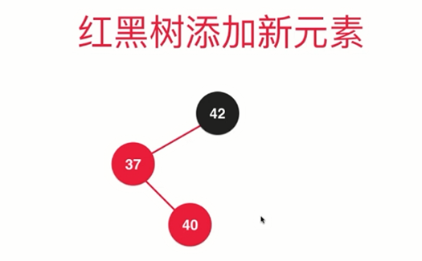

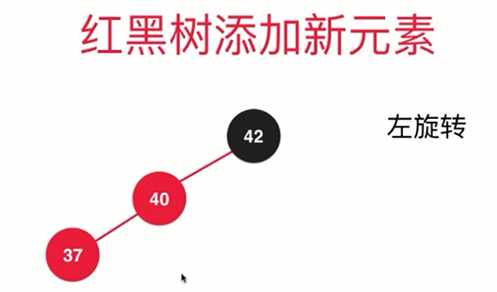

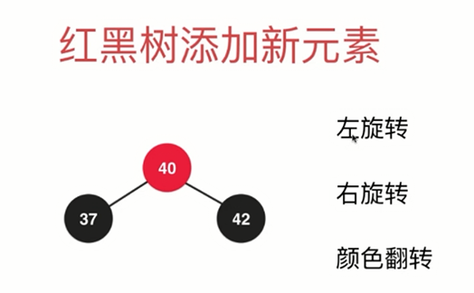


​				`1.基于37元素进行左旋转`

​				`2. 按照3节点左节点添加节点的情形进行处理`		

- 代码思路：

  - 从最复杂的情况进行考虑

  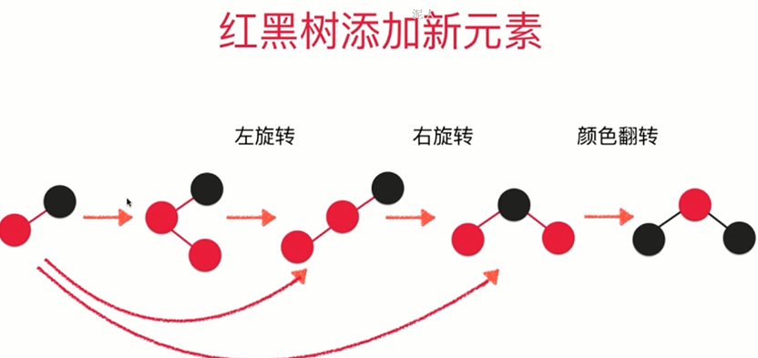

- 红黑树对``添加``和``删除``操作较AVL树有优势，但``查询``操作并没有优势

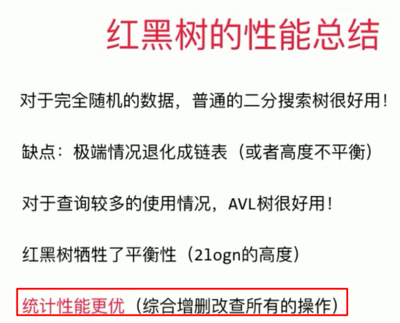

# 12. 哈希表

- 哈希函数 -- 键转索引

  - 键哈希函数得到的索引分布越均匀越好

  1. 整数：

     通用做法：取模（模一个素数，使结果分布均匀）

  2. 浮点型

     转成整型，在按照整数处理

  3. 字符串

     如通过26进制转成整型，26可根据情况进行更改

      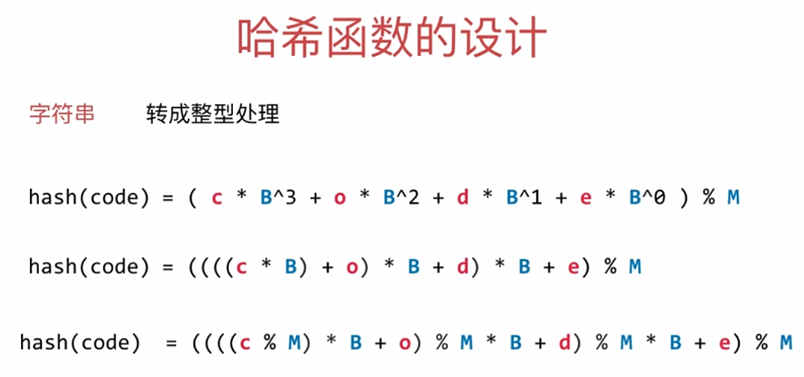

  4. 复合类型

     转成整型处理，类似于字符串的进行处理

  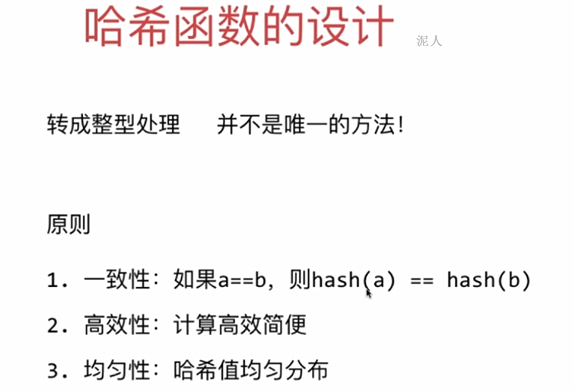

  

- 哈希表 -- 解决哈希冲突

  1. 链地址法，时间复杂度O（1）

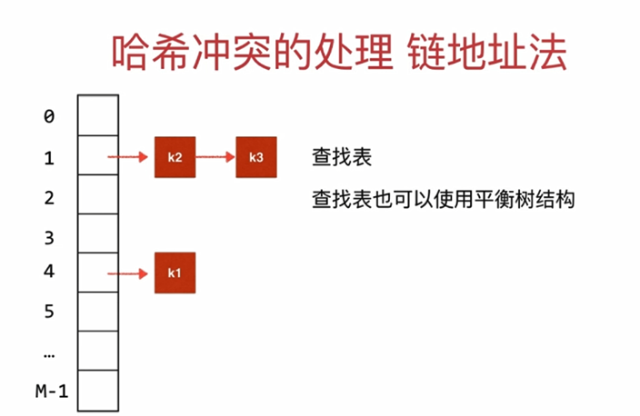

 2.  开放地址法

     指标：负载率，一般当负载率达到50%时，就需要扩容，时间复杂度O（1）

     - 线性探测
     - 平方探测

     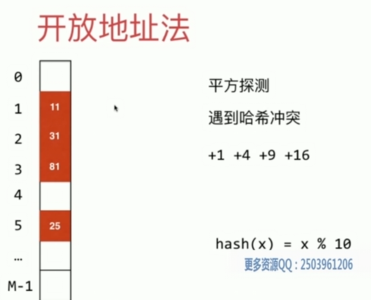

     - 二次哈希

     

     3. 再哈希法

     

- 复杂度分析：（加入动态处理之前）

 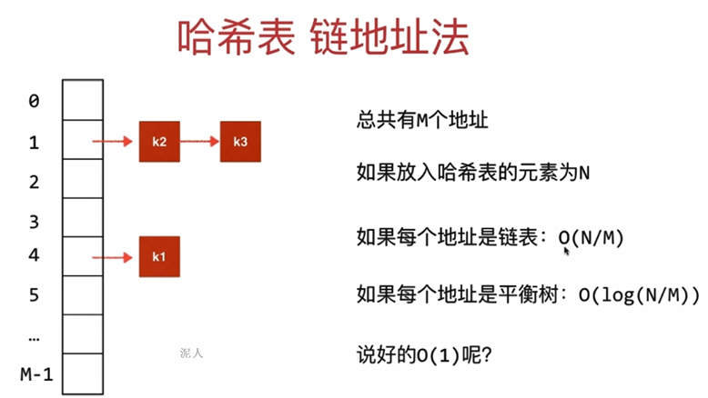

- 动态空间扩容与缩容：

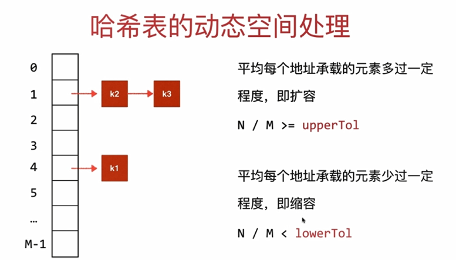

​	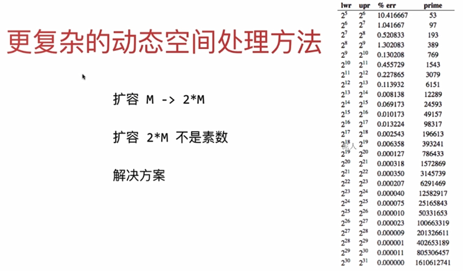

​	根据素数表，来解决扩容之后不是素数的问题。


- 复杂度分析（加入动态处理之后）

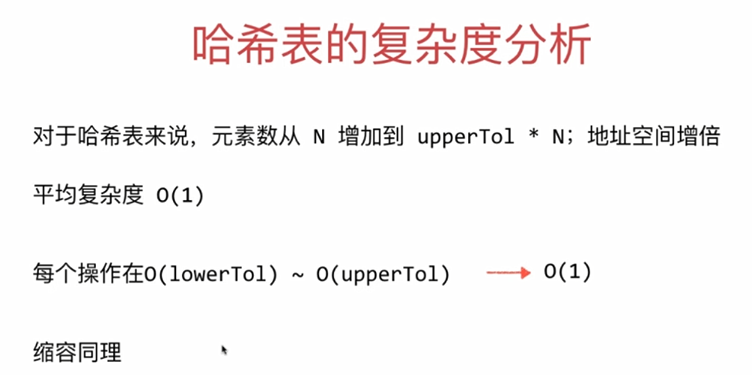

​		`指在均摊复杂度分析中，其为O（1）的水平`

- 缺点

​      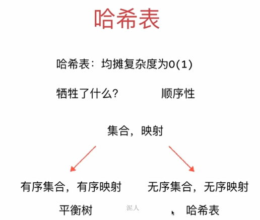  

​                                                                                                                                                                                                                                                                                                                                                                                 

> 参考：
>
> 1. [刘宇波 《玩转数据结构 从入门到进阶》](https://github.com/houpengfei88/Play-with-Data-Structures)
> 2. [刘宇波 《算法与数据结构》](https://github.com/liuyubobobo/Play-with-Algorithms)
> 3. 刘宇波 《玩转算法面试》

# 13. 图

- 分类：
  - 有权图和无权图
  - 有向图和无向图
- 简单图（不含有自环边和平行边）

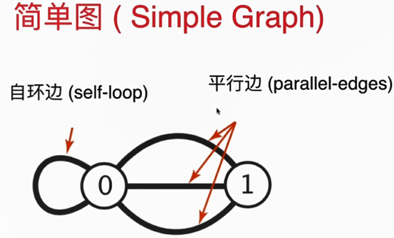

- 表示：
  - 邻接矩阵（适合稠密图）
    - 无向图（对称）
    - 有向图（不对称）
  - 邻接表（适合稀疏图）
    - 无向图
    - 有向图
  
- 遍历
  - 深度优先遍历DFS   
  - 广度优先遍历BFS
    - 求出了无权图的最短路径
  
- 带权图
  - 最小生成树
    - 带权无向图
    - 连通图 
    - 切分定理：给定==任意切分==，横切边中权值最小的边必然属于最小生成树

    1. Prim算法

       1. Lazy Prim（使用最小堆）
          
          - 时间复杂度：O(ElogE)，堆的大小最大是边的大小
       2. 优化：使用IndexMinHeap
          
          - 时间复杂度：O(ElogV)，堆的大小最大是顶点的大小
          
    
    2. Kruskal算法（O(ElogE)）
    
       将边的权值进行排序，之后只要加入当前最小生成树的边不形成环，则其就属于最小生成树中的边。
    
       	1. 使用UnionFind判断是否形成环
    
  - 最短路径问题（无向图，有向图）
    
    - 广度优先遍历     
    
    - 单源最短路径问题（松弛操作）
    
      - dijkstra算法（图中不能有副权边）
    
        - 复杂度：O（ElogV），最小索引堆
    
      - 处理负权边，拥有负权环的图，不具有最短路径
    
        - Bellman-Ford
    
        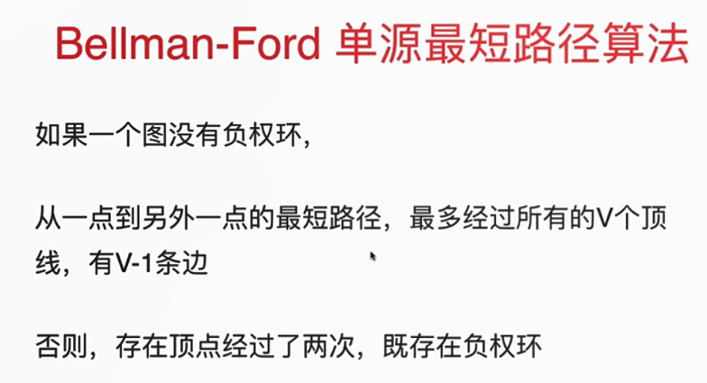