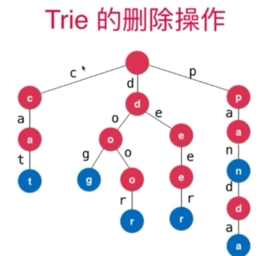

[TOC]

# 1. 时间复杂度

- 最坏时间复杂度
- 最好时间复杂度
- 平均时间复杂度
- 均摊时间复杂度
- 复杂度震荡（解决方案Lazy）

# 2.  数组

## 基本操作

- 二次封装，添加，查询，修改，包含，搜索，删除元素
- 支持泛型
- 动态数组（实现resize） 

> 代码参考：https://github.com/houpengfei88/Play-with-Data-Structures/blob/master/02-Arrays/07-Dynamic-Array/Array.h

# 3. 栈与队列

## 栈

- 第一种方案：基于动态数组

  - 应用案例：括号匹配

- 第二种方案：基于链表

  > 代码参考链接：https://github.com/houpengfei88/Play-with-Data-Structures/blob/master/04-Linked-List/06-Implement-Stack-in-LinkedList/LinkedListStack.h

## 队列

- 第一种方案：基于动态数组 （dequeue()出队函数时间复杂度为O(n)）

- 第二种方案：基于链表

  > 代码参考链接：https://github.com/houpengfei88/Play-with-Data-Structures/blob/master/04-Linked-List/07-Implement-Queue-in-LinkedList/LinkedListQueue.h

- 循环队列

  - 队列为空：front == tail

  - 队列为满：（tail + 1）% capacity == front

  - Size:（tail + capacity - front) % capacity

  - resize函数实现

    ```c++
    void resize(int newCapacity){
        //tail同时为标志位，多占用一个数据，故需要加1
        T *newData = new T[newCapacity + 1];
        for (int i = 0; i < getSize(); ++i){
            newData[i + front] = data[front];
        }
        data = newData;
        //tail本身是没有具体数据的，所以其为getSize（）
        tail = getSize();
        front = 0;
        capacity = newCapacity;
    }
    ```

    

  > 代码参考：https://github.com/houpengfei88/Play-with-Data-Structures/blob/master/03-Stacks-and-Queues/06-Loop-Queue/LoopQueue.h
  >
  > 用于性能测试的样例：https://github.com/houpengfei88/Play-with-Data-Structures/blob/master/03-Stacks-and-Queues/08-Queues-Comparison/main.cpp

# 4. 链表

- 空白头结点，保证书写算法时逻辑上的一致性，如插入头结点和在中间插入节点
- 链表是一种天然适合递归的结构

# 5. 二分搜索树

- 优点：

  1. 高效

     不仅可查找数据；还可高效地插入，删除数据-动态维护数据

     可以方便地回答很多数据之间 的关系问题：

     - min, max, floor, ceil, rank, select

- 天然递归的结构

## TODO

- 深度优先遍历（前序、中序、后序）(**TODO**)

  ```c++
  //非递归实现
  #include <iostream>
  #include <vector>
  #include <stack>
  #include <cassert>
  
  using namesapce std;
  
  //定义node
  struct TreeNode{
      int val;
      TreeNode *left;
      TreeNode *right;
      TreeNode(int x): val(x), left(NULL), right(NULL){}
  };
  
  class Solution{
      //前序遍历
      vector<int> preorderTraversal(TreeNode* root){
          
      }
  }
  ```

- 广度优先遍历（层序）

- 删除节点（递归方法）：

  ```c++
  Node* remove(Node* node, Key key){
      if (node == NULL)
          return node;
      
      if (key < node){
          node->left = remove(node->left, key);
          return node;
      }
      else if (key > node){
          node->right = remove(node->right, key);
          return node;
      }
      else{
          //待删除节点左子树为空的情况
          if(node->left == NULL){
              Node* rightNode = node->right;
              delete node;
              count--;
              return rightNode;
          } 
          //待删除节点右子树为空的情况
          if(node->right == NULL){
              Node* leftNode = node->left;
              delete node;
              count--;
              return leftNode;
          }
          //左右字数均不为空的情况
          Node* successor = new Node(minimum(node->right));
          successor->left = node->left;
          successor->right = removeMin(node->right);
          delete node;
          count--;
          return successor;
      }  
  }
  ```

# 6. 优先队列与堆

## 优先队列

- 普通队列：先进先出；后进后出

- 优先队列：出队顺序与入队顺序无关；和优先级有关（一种上一层封装）

- 实现方式：堆

- 经典问题：

  - 在1000000个元素中选出前100名？即在N个元素中选出前M个元素 ？
    1. 排序？NlogN
    2. 优先队列？NlogM

  

## 堆

- 是**平衡二叉树**
- 二叉堆
  - 一种完全二叉树
  - 堆中某个节点的值总是不大于其父节点的值（最大堆，相应的可以定义最小堆）
  - 用数组存储二叉堆
  	- 从下标1开始，0空出
  		- parent(i) = i/2
  		- left child(i) = i*2
  		- right child(i) = i*2+1
  	- 从下标0开始
  		- parent(i) = (i-1)/2
  		- left child(i) = i*2+1
  		- right child(i) = i*2+2

-基本操作：
	1. 添加元素：上浮shift up
	2. 取出元素：下沉元素shift down

```C++
T findMax(){
	if(data->isEmpty){
        throw Empty;
    }
    return data->get(0);
}

T extractMax(){
    T ret = findMax();
    //交换最大值与最后一个元素
    data->swap(0, data->getSize() - 1);
    //删除最后一个元素
    data->removeLast();
    
    shiftDown(0);
    
    return ret;
}

void shiftDOwn(int k){
    while(leftChild(k) < data->getSize()){
        int j = leftChild(k);
        //判断右节点是否不满足
        if(j + 1 < data.getSize() && data->get(j + 1) > data->get(k)){
            j++;
        }
        //判断左节点是否不满足
        if(data->get(k) >= data->get(j)){
            break;
        }
        data->swap(k, j);
        k = j;
    }
}
```

3. 替换元素：replace（直接将要换入元素直接放到顶层）
4. 将任意数组整理成堆的形状：heapify
   - 如何定位最后一个**非叶子节点**？转换为最后一个节点的父节点
   - 思路：从最后一个非叶子节点开始遍历到0，分别进行shiftDown操作。
     - 时间复杂度：O（n），若一个个进行插入，将是O（nlogn）

# 7. 线段树（区间树）

- 更新：更新区间中一个元素或一个区间的值 O（log（n））

- 查询一个区间[i, j]的最大值，最小值或者区间数字和 O（log（n））

- 应用场景：适用于同时具有更新和查询需求的应用

- 是**平衡二叉树**

- 数组表示

  - 需要**4n**的大小的静态空间，不考虑添加元素，即区间大小确定，当n=**2^k**时，一颗满二叉树，此时只需要**2n**大小的空间
  - 当不考虑区间等分时，平衡空间利用情况，n的各种情况均只需要**2n**大小的空间
  - 创建线段树

  ```c++
  //创建函数对象，使线段树不局限于一种功能
  std::function<T(T, T)> function;
  
  //核心：使用递归的思路，获得子树的值，从而获得父节点的值
  void buildSegmentTree(int treeIndex, int l, int r){
      if(l == r){
          tree[treeIndex] = data[l];
          return;
      }
      int leftIndex = leftChild(treeIndex);
      int rightIndex = rightChild(treeIndex);
      int mid = l + (r - l) / 2;
      
      buildSegmentTree(leftIndex, l, mid);
      buildSegmentTree(rightIndex, mid + 1, r);
      
      tree[treeIndex] = function(tree[leftTreeIndex], tree[rightTreeIndex]);
      
  }
  ```

  - 查询操作

  ```c++
  //核心：使用递归实现
  T query(int treeIndex, int l, int r, int queryL, int queryR) {       
      //递归终止条件
      if (l == queryL && r == queryR) {    
          return tree[treeIndex];        
      }
      
      int mid = l + (r - l) / 2;    
      int leftTreeIndex = leftChild(treeIndex);    
      int rightTreeIndex = rightChild(treeIndex);   
      
      if (queryL >= mid + 1)     
          return query(rightTreeIndex, mid + 1, r, queryL, queryR);       
      } else if (queryR <= mid) {  
          return query(leftTreeIndex, l, mid, queryL, queryR);        
      }    
  
      T leftResult = query(leftTreeIndex, l, mid, queryL, mid);
      T rightResult = query(rightTreeIndex, mid + 1, r, mid + 1, queryR);
      return function(leftResult, rightResult);    
  }
  ```

  - 在使用线段树时，需要自己敲出构建，查询线段树的代码
  - 典型例题Leetcode307：[区域和查询](https://www.bilibili.com/video/av15683671?from=search&seid=14170984308276291420)

# 8. 字符串

## Trie (字典树 前缀树)

- 专门为处理字符串设计

  

- 添加操作

  ```c++
  //节点定义
  class Node{
  public:
  	bool isWord;
      map<char, Node> next;
      
      Node(bool isWord){
          this->isWord = isWord;
      }
      
      Node(): isWord(false), next(){}
  };
  
  //添加操作
  void add(string word){
      Node* cur = root;
      for(int i = 0; i < word.size(); ++i){
          char c = word.at(i);
          if(cur->next.find(c) == cut->next.end()){
              cur->next.insert(pair<char, Node>(c, Node()))
          }
          //find()函数返回的是一个指针，next是一个对象
          cur = &cur->next.find(c)->second;
      }
      
      if(!cur->isWord){
          cur->isWord = true;
          size++;
      }
  }
  ```

- 查询操作

  ```c++
  bool contains(string word){
      NOde *cur == root;
      for(int i = 0; i < word.size(); ++i){
          char c = word.at(i);
          if(cur->next.find(c) == cur->next.end()){
              return false;
          }
          //cur是一个指针，取地址操作
          //find()函数返回的是一个指针
          cur = &cur->next.find(c)->second;
      }
      return cur->isWord;
  }
  ```

- 前缀搜索（前缀树）

  ```c++
  bool startWith(string prefix){
      NOde *cur == root;
      for(int i = 0; i < word.size(); ++i){
          char c = word.at(i);
          if(cur->next.find(c) == cur->next.end()){
              return false;
          }
          //cur是一个指针，取地址操作
          //find()函数返回的是一个指针
          cur = &cur->next.find(c)->second;
      }
      return true;
  }
  ```


- 删除操作

  


- 最大的问题：
  
  - 占有空间大（每个节点有多个数据）
  
  - 解决方法：
    1. 压缩字典树：维护成本较高
    2. 三分搜索树：节省空间，牺牲时间

> 示例代码链接：https://github.com/houpengfei88/Play-with-Data-Structures/tree/master/10-Trie/04-Prefix-in-Trie


# 9.并查集

- 通常用于解决**连接**问题和**路径**问题

- **实现方式1**（基于数组实现）：

  - 查找find()时间很快，O(1)
  - 合并unionElements()慢，O(n)

- **实现方式2**（常规解决方式）

  - 使用节点的思想，进行union时，指向根节点，防止高度过高，同样可以利用数组进行实现，时间复杂度跟树的高度相关

  - 基于**方式2**方法的优化

    1. 基于size的优化（优化union）

       分别记录两个集合的大小，将集合较小的根节点指向集合较大的根节点

    2. 基于rank的优化（rank[i]表示根节点为i的树的高度）（优化union）

       可以处理比较极端的情况，最常用

    3. 路径压缩（优化find）
    
       - 在查找过程中，减少树的高度
    
        	 1. 节点的父亲指向节点父亲的父亲
    
        2. 所有节点都指向根节点（使用递归）
    
             理论上更好，但由于递归增加的额外开销，可能没有方式1好。
       
       - 由于路径压缩的实现，rank可能不在表示层数，我们也不需要维护rank的语义，它只是作为一个比较的标准
       
         
    
  - 时间复杂度（近乎O(1)级别的，查询和合并操作均是这样）


> 示例代码链接：https://github.com/liuyubobobo/Play-with-Algorithms/tree/master/06-Union-Find/Course%20Code%20(C%2B%2B)


# 10. AVL树

- 对于任意一个节点，左子树和柚子树的高度差不超过1

- 标注每个节点的高度，计算平衡因子（高度差）
- 为防止旋转操作代码出错，可编写代码确定是否为二分搜索树和考察树的平衡性进行确定：
  - 是否为二分搜索树：二分搜索树的中序遍历结果是顺序排列的

- 旋转操作：
  1. 右旋转（左-左）


  2. 左旋转（右-右）


```c++
//右旋转
Node* rightRotate(Node *y){
    Node *x = y->left;
    Node *tmp = x->right;
    
    x->right = y;
    y->left = tmp;
    
    y->height = max(getHeight(y->left), getHeight(y->right)) + 1;
    x->height = max(getHeight(x->left), getHeight(x->right)) + 1;
    
    return x;
}
//左旋转
Node* leftRotate(Node *y){
    Node *x = y->right;
    Node *tmp = x->left;
    
    x->left = y;
    y->right = tmp;
    
        y->height = max(getHeight(y->left), getHeight(y->right)) + 1;
    x->height = max(getHeight(x->left), getHeight(x->right)) + 1;
    
    return x;
}
```

3. LR(左-右)


4. RL（右-左）


- 删除操作

> 参考代码：https://github.com/houpengfei88/Play-with-Data-Structures/blob/master/12-AVL-Tree/07-Remove-Elements-in-AVL-Tree/AVLTree.h


> 参考：
>
> 1. [刘宇波 《玩转数据结构 从入门到进阶》](https://github.com/houpengfei88/Play-with-Data-Structures)
> 2. [刘宇波 《算法与数据结构》](https://github.com/liuyubobobo/Play-with-Algorithms)
> 3. 刘宇波 《玩转算法面试》