[TOC]


# 1. 时间复杂度

- 最坏时间复杂度
- 最好时间复杂度
- 平均时间复杂度
- 均摊时间复杂度
- 复杂度震荡（解决方案Lazy）

# 2.  数组

## 基本操作

- 二次封装，添加，查询，修改，包含，搜索，删除元素
- 支持泛型
- 动态数组（实现resize） 

> 代码参考：https://github.com/houpengfei88/Play-with-Data-Structures/blob/master/02-Arrays/07-Dynamic-Array/Array.h

# 3. 栈与队列

## 栈

- 第一种方案：基于动态数组

  - 应用案例：括号匹配

- 第二种方案：基于链表

  > 代码参考链接：https://github.com/houpengfei88/Play-with-Data-Structures/blob/master/04-Linked-List/06-Implement-Stack-in-LinkedList/LinkedListStack.h

## 队列

- 第一种方案：基于动态数组 （dequeue()出队函数时间复杂度为O(n)）

- 第二种方案：基于链表

  > 代码参考链接：https://github.com/houpengfei88/Play-with-Data-Structures/blob/master/04-Linked-List/07-Implement-Queue-in-LinkedList/LinkedListQueue.h

- 循环队列

  - 队列为空：front == tail

  - 队列为满：（tail + 1）% capacity == front

  - Size:（tail + capacity - front) % capacity

  - resize函数实现

    ```c++
    void resize(int newCapacity){
        //tail同时为标志位，多占用一个数据，故需要加1
        T *newData = new T[newCapacity + 1];
        for (int i = 0; i < getSize(); ++i){
            newData[i + front] = data[front];
        }
        data = newData;
        //tail本身是没有具体数据的，所以其为getSize（）
        tail = getSize();
        front = 0;
        capacity = newCapacity;
    }
    ```

    

  > 代码参考：https://github.com/houpengfei88/Play-with-Data-Structures/blob/master/03-Stacks-and-Queues/06-Loop-Queue/LoopQueue.h
  >
  > 用于性能测试的样例：https://github.com/houpengfei88/Play-with-Data-Structures/blob/master/03-Stacks-and-Queues/08-Queues-Comparison/main.cpp

# 4. 链表

- 空白头结点，保证书写算法时逻辑上的一致性，如插入头结点和在中间插入节点
- 链表是一种天然适合递归的结构

# 5. 二分搜索树

- 优点：

  1. 高效

     不仅可查找数据；还可高效地插入，删除数据-动态维护数据

     可以方便地回答很多数据之间 的关系问题：

     - min, max, floor, ceil, rank, select

- 天然递归的结构

  - **满二叉树**（下图左）：除叶子节点外的所有分支节点都含有2个非空子节点的二叉树
  - **完全二叉树**（下图右）：除了最后一层，其余层都是“满”的，这样的二叉树是完全二叉树

  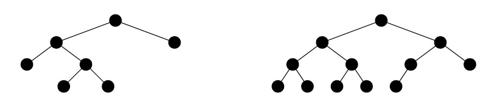

- 二叉树定理

  - 任意二叉树度数为2节点的个数等于叶节点个数减1

    当只有1个节点时，度为0。每派生出1度，就会多出1个节点。派生出的度和派生出的节点数一定相等。那么就得出了总度数和节点总数的关系：

    `节点总数 = 总度数 + 1`

    设度数为2的节点数为`X2`，度数为1的节点数为`X1`，度数为0的节点数为`X0`。可以得出如下关系式：

    `X2 + X1 + X0 = 2X2 + X1 + 1`，推出 `X2 = X0 - 1`

  - 满二叉树定理：非空满二叉树的叶节点数等于其分支节点数加1

    如果已知前一个结论，那么这个定理显然成立。

  - 一颗非空二叉树空子树的数目等于其节点数目加1

    考虑只有1个根节点的二叉树：它有2个空子树，1个节点，因此结论成立。从这里开始考虑，每产生1个节点。空子树便会先减1然后加2。就和上面结论中每多出1个分支节点，叶子节点的变化一样。因此在原来结论的基础上，由于空子树和节点等量增长。所以结论成立


- 深度优先遍历（前序、中序、后序）

  ```c++
  //非递归实现
  #include <iostream>
  #include <vector>
  #include <stack>
  #include <cassert>
  
  using namesapce std;
  
  //定义node
  struct TreeNode{
      int val;
      TreeNode *left;
      TreeNode *right;
      TreeNode(int x): val(x), left(NULL), right(NULL){}
  };
  
  //递归版
  //前序遍历
  void preorderTraversalRecursion(TreeNode *node)
  {
      if(!node) return;
      cout << node->val << " ";//操作当前节点
      preorderTraversalRecursion(node->left);
      preorderTraversalRecursion(node->right);
  }
  
  //中序遍历
  void inorderTraversalRecursion(TreeNode *node)
  {
      if(!node) return;
      inorderTraversalRecursion(node->left);
      cout << node->val << " ";//操作当前节点
      inorderTraversalRecursion(node->right);
  }
  
  //后序遍历
  void postorderTraversalRecursion(TreeNode *node)
  {
      if(!node) return;
      postorderTraversalRecursion(node->left);
      postorderTraversalRecursion(node->right);
      cout << node->val << " ";//操作当前节点
  }
  
  //迭代版
  //前序遍历
  void preorderTraversalIteration(TreeNode *root){
      stack<TreeNode*> st;
      if(root){
      	st.push(root);        
      }
      
      while(!st.empty()){
          TreeNode *nd = st.top();
          st.pop();
          
          cout << nd->val << " "; //操作当前点
          
          if(nd->right){
         		st.push(nd->right);            
          }
  		if(nd->left){
              st.push(nd->left);
          }
      }
  }
  //中序遍历
  void inorderTraversalIteration(TreeNode *root){
      stack<TreeNode*> st;
      TreeNode *cur = root;
      while(cur || !st.empty()){
          if(cur){
              st.push(cur);
              cur = cur->left;
          }
          else{
              cur = st.top();
              st.pop();
              cout << cur->val << " "; //操作当前点
              cur = cur->right;
          }
      }
  }
  //后序遍历
  void postorderTraversalIteration(TreeNode *root)
  {
      stack<TreeNode*> st;
      TreeNode *pre;
  
      if(root)
          st.push(root);
  
      while(!st.empty()){
          TreeNode *nd = st.top();
          /*
           * 出栈条件：
           * 对于叶子节点：直接弹出
           * 对于非叶子节点：如果已经遍历过其左子节点或右子节点，则弹出
           */
          if((!nd->left && !nd->right) || (pre && (nd->left == pre || nd->right == pre))){
              st.pop();
              cout << nd->val <<" ";//操作当前节点
              pre = nd;
          }
          else{//说明是一个非叶子节点，并且还未访问其左右孩子
              if(nd->right)
                  st.push(nd->right);
              if(nd->left)
                  st.push(nd->left);
          }
      }
  }
  ```

  > 对于后序遍历，由于其访问序列为：左->右->根。因此还有一种方法，可以按类似前序遍历的方式：根->右->左，然后对得到的结果反序

- 广度优先遍历（层序）

```c++
/*
struct TreeNode {
    int val;
    struct TreeNode *left;
    struct TreeNode *right;
    TreeNode(int x) :
            val(x), left(NULL), right(NULL) {
    }
};*/
class Solution {
public:
    vector<int> PrintFromTopToBottom(TreeNode* root) {
        vector<int> res;
        if(!root)
            return res;
        
        deque<TreeNode*> q;
        q.push_back(root);
        
        TreeNode *curr;
        while(!q.empty()){
            curr = q.front();
            res.push_back(curr->val);
            q.pop_front();
            
            if(curr->left)
                q.push_back(curr->left);
            if(curr->right)
                q.push_back(curr->right);
        }
        
        return res;
    }
};
```


- 删除节点（递归方法）：

  ```c++
  Node* remove(Node* node, Key key){
      if (node == NULL)
          return node;
      
      if (key < node){
          node->left = remove(node->left, key);
          return node;
      }
      else if (key > node){
          node->right = remove(node->right, key);
          return node;
      }
      else{
          //待删除节点左子树为空的情况
          if(node->left == NULL){
              Node* rightNode = node->right;
              delete node;
              count--;
              return rightNode;
          } 
          //待删除节点右子树为空的情况
          if(node->right == NULL){
              Node* leftNode = node->left;
              delete node;
              count--;
              return leftNode;
          }
          //左右子树均不为空的情况
          Node* successor = new Node(minimum(node->right));
          successor->left = node->left;
          successor->right = removeMin(node->right);
          delete node;
          count--;
          return successor;
      }  
  }
  ```

# 6. AVL树

- 对于任意一个节点，左子树和柚子树的高度差不超过1

- 标注每个节点的高度，计算平衡因子（高度差）
- 为防止旋转操作代码出错，可编写代码确定是否为二分搜索树和考察树的平衡性进行确定：
  - 是否为二分搜索树：二分搜索树的中序遍历结果是顺序排列的

- 旋转操作：
  1. 右旋转（左-左）


    2. 左旋转（右-右）


```c++
//右旋转
Node* rightRotate(Node *y){
    Node *x = y->left;
    Node *tmp = x->right;
    
    x->right = y;
    y->left = tmp;
    
    y->height = max(getHeight(y->left), getHeight(y->right)) + 1;
    x->height = max(getHeight(x->left), getHeight(x->right)) + 1;
    
    return x;
}
//左旋转
Node* leftRotate(Node *y){
    Node *x = y->right;
    Node *tmp = x->left;
    
    x->left = y;
    y->right = tmp;
    
        y->height = max(getHeight(y->left), getHeight(y->right)) + 1;
    x->height = max(getHeight(x->left), getHeight(x->right)) + 1;
    
    return x;
}
```

3. LR(左-右)

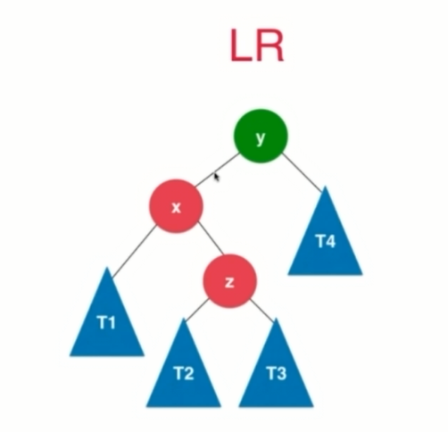

4. RL（右-左）


- 删除操作

> 参考代码：https://github.com/houpengfei88/Play-with-Data-Structures/blob/master/12-AVL-Tree/07-Remove-Elements-in-AVL-Tree/AVLTree.h

# 7. 红黑树 && B树

- 一种二叉搜索树

- 红黑树与2-3树的等价性

  - 2-3树

    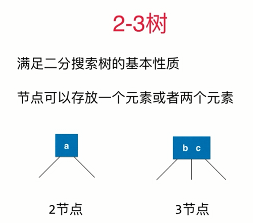

    - 是一种绝对平衡的树，左右子树的高度绝对平等
    - 等价性

    

    

        


- 定义：


- 添加操作：
  `前提：`
  `1. 模拟2-3树的添加过程；`
  `2. 添加元素的节点起先均为红色；`
  `3. 向上融合的节点的元素均为红色。`

  - 保持根节点的元素为黑色

  - 2节点添加节点：

    - 添加元素到左边（直接添加）

    

    - 添加元素到右边（左旋转）


      1. AVL树的左旋转
      2. x的颜色变为node的颜色
      3. node的颜色为红色

  - 3节点添加节点：
- 情形一：（3节点右边添加节点）


 					`进行颜色反转`

​	- 情形二：（3节点左边添加节点）(右旋转)


​			


​				`1.右旋转`

​				`2. 37保持原有42元素的颜色一致`

​				`3. 42变为红色，表示3个节点是融合在一起的`

​				**`4. 颜色反转`** 

​		- 情形三：（3节点中间节点添加节点）


​				`1.基于37元素进行左旋转`

​				`2. 按照3节点左节点添加节点的情形进行处理`		

- 代码思路：

  - 从最复杂的情况进行考虑

  

- 红黑树对``添加``和``删除``操作较AVL树有优势，但``查询``操作并没有优势


# 7. 线段树（区间树）

- 更新：更新区间中一个元素或一个区间的值 O（log（n））

- 查询一个区间[i, j]的最大值，最小值或者区间数字和 O（log（n））

- 应用场景：适用于同时具有更新和查询需求的应用

- 是**平衡二叉树**

- 数组表示

  - 需要**4n**的大小的静态空间，不考虑添加元素，即区间大小确定，当n=**2^k**时，一颗满二叉树，此时只需要**2n**大小的空间
  - 当不考虑区间等分时，平衡空间利用情况，n的各种情况均只需要**2n**大小的空间
  - 创建线段树

  ```c++
  //创建函数对象，使线段树不局限于一种功能
  std::function<T(T, T)> function;
  
  //核心：使用递归的思路，获得子树的值，从而获得父节点的值
  void buildSegmentTree(int treeIndex, int l, int r){
      if(l == r){
          tree[treeIndex] = data[l];
          return;
      }
      int leftIndex = leftChild(treeIndex);
      int rightIndex = rightChild(treeIndex);
      int mid = l + (r - l) / 2;
      
      buildSegmentTree(leftIndex, l, mid);
      buildSegmentTree(rightIndex, mid + 1, r);
      
      tree[treeIndex] = function(tree[leftTreeIndex], tree[rightTreeIndex]);
      
  }
  ```

  - 查询操作

  ```c++
  //核心：使用递归实现
  T query(int treeIndex, int l, int r, int queryL, int queryR) {       
      //递归终止条件
      if (l == queryL && r == queryR) {    
          return tree[treeIndex];        
      }
      
      int mid = l + (r - l) / 2;    
      int leftTreeIndex = leftChild(treeIndex);    
      int rightTreeIndex = rightChild(treeIndex);   
      
      if (queryL >= mid + 1)     
          return query(rightTreeIndex, mid + 1, r, queryL, queryR);       
      } else if (queryR <= mid) {  
          return query(leftTreeIndex, l, mid, queryL, queryR);        
      }    
  
      T leftResult = query(leftTreeIndex, l, mid, queryL, mid);
      T rightResult = query(rightTreeIndex, mid + 1, r, mid + 1, queryR);
      return function(leftResult, rightResult);    
  }
  ```

  - 在使用线段树时，需要自己敲出构建，查询线段树的代码
  - 典型例题Leetcode307：[区域和查询](

# 8. 优先队列与堆

## 8.1 优先队列

- 普通队列：先进先出；后进后出
- 优先队列：出队顺序与入队顺序无关；和优先级有关（一种上一层封装）
- 实现方式：堆

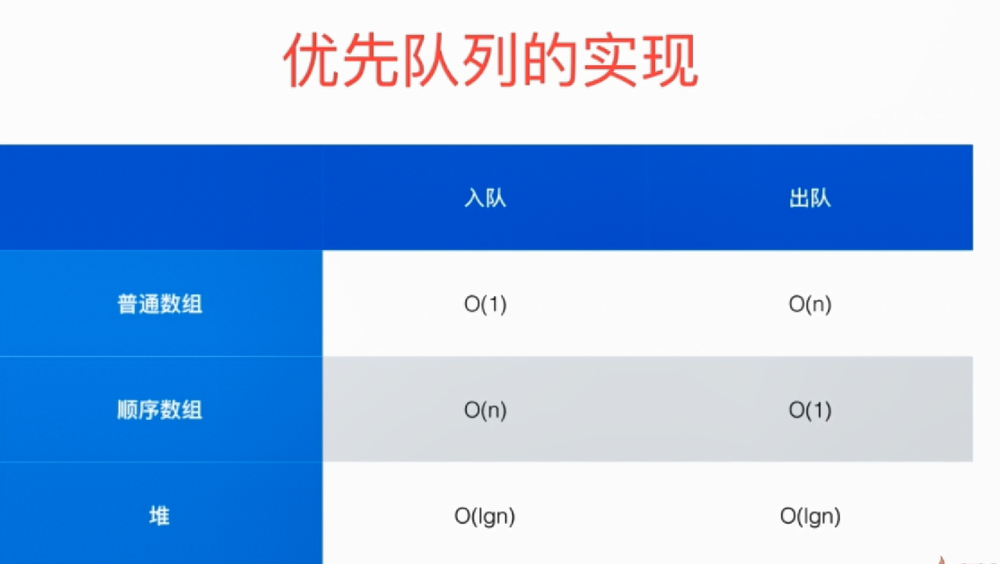

- 经典问题：

  - 在1000000个元素中选出前100名？即在N个元素中选出前M个元素 ？
    1. 排序？NlogN
    2. 优先队列？NlogM

  

## 8.2 堆

- 是**平衡二叉树**
- 二叉堆
  - 一种完全二叉树
  - 堆中某个节点的值总是 不大于其父节点的值（最大堆，相应的可以定义最小堆）
  - 用数组存储二叉堆
  	- 从下标1开始，0空出
  		- parent(i) = i/2
  		- left child(i) = i*2
  		- right child(i) = i*2+1
  	- 从下标0开始，使用该种方法
  		- parent(i) = (i-1)/2
  		- left child(i) = i*2+1
  		- right child(i) = i*2+2

-基本操作：（起点从0开始）

- 添加元素(insert)：上浮shift up

  1. 将元素添加到数组末尾；（相当于叶节点接入堆中）

  2. 和父节点进行比较，如果大于父节点(以最大堆为例)，则与父节点交换，一直比较交换到根节点

  ```c++
  /********************************************
   * 向堆中插入元素
   *  hole：新元素所在的位置
   ********************************************/
   template <class value>
   void __push_heap(vector<value> &arr, int hole){
       //取出新元素，产生一个空洞
       value v = arr[hole];
       int parent = (hole - 1) / 2;
       //建立最大堆，如果建成最小堆换成arr[parent] > value
       while(hole > 0 && arr[parent] < v){
           arr[hole] = arr[parent];
           hole = parent;
           parent = (hole - 1) / 2;
       }
       arr[hole] = v;     
   }
  ```

  

- 取出元素(extractMax)： 下沉元素shift down

  删除实际上是将堆顶元素移入数组末尾，并不是真的删除。删除节点时，进行下列操作：

  1. 保存数组末尾元素(存入临时变量`v`)，将堆顶元素存入数组末尾
  2. 将原来堆顶元素的两个子节点中较大的一个移入堆顶(以最大堆为例)，填补空缺，此时产生新的空缺，继续此步骤，直到空缺为一个叶子节点
  3. 将`v`中存储的值移到空缺叶子节点的位置
  4. 对上一步中的新叶子节点完成向上比较交换操作

  ```c++
  /********************************************
   * 删除堆顶元素
   ********************************************/
  template <class value>
  void _pop_heap(vector<value> &arr,int sz)
  {
      value v = arr[sz - 1];
      arr[sz - 1] = arr[0];
      --sz;
      int hole = 0;
      int child = 2 * (hole + 1); //右孩子
      while(child < sz){
          if(arr[child] < arr[child - 1])
              --child;
          arr[hole] = arr[child];
          hole = child;
          child = 2 * (hole + 1);
      }
      if(child == sz){
          arr[hole] = arr[child - 1];
          hole = child - 1;
      }
      arr[hole] = v;
      _push_heap(arr,hole);
  }
  ```

  

- 替换元素：replace（直接将要换入元素直接放到顶层）


- 将任意数组整理成堆的形状：heapify

  * **堆的大小固定(且所有元素已知)**：按“序号从大到小”的顺序遍历所有非叶子节点，将这些节点与左右子节点较大者(以最大堆为例)交换，执行siftdown一直到叶子节点，因此，每遍历到一个节点时，其左子树和右子树都已经是最大堆，只需对当前节点执行siftdown操作
  * **堆的大小未知(如数据流)**：可以通过插入操作来构建堆

  ```c++
  /********************************************
   * 建堆
   *  sz：删除堆顶元素后的大小
   *  v： 被堆顶元素占据的位置原来的元素的值
   ********************************************/
  template <class value>
  void _make_heap(vector<value> &arr)
  {
      int sz = arr.size();
      int parent = (sz - 2) / 2;
      while(parent >= 0){
          int hole = parent;
          int child = 2 * (hole + 1); //右孩子
          value v = arr[hole];
          while(child < sz){
              if(arr[child] < arr[child - 1])
                  --child;
              arr[hole] = arr[child];
              hole = child;
              child = 2 * (hole + 1);
          }
          if(child == sz){
              arr[hole] = arr[child - 1];
              hole = child - 1;
          }
          arr[hole] = v;
          _push_heap(arr,hole);
          --parent;
      }
  }
  ```

  

- 如何定位最后一个**非叶子节点**？==转换为最后一个节点的父节点==

- 思路：从最后一个非叶子节点开始遍历到0，分别进行shiftDown操作。

  - 时间复杂度：O（n），若一个个进行插入，将是O（nlogn）

  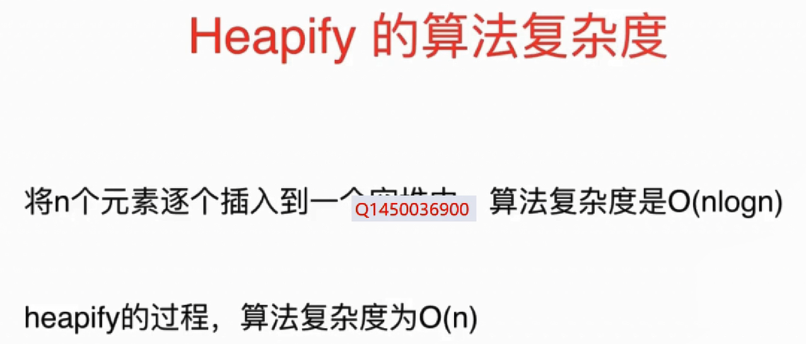

### 复杂度

* **插入节点**：时间复杂度为O(logn)
* **删除堆顶**：时间复杂度为O(logn)
* **建堆**：
  - **堆的大小固定(且所有元素已知)**：每个siftdown操作的最大代价是节点被向下移动到树底的层数。在任意一棵完全二叉树中，大约有一半的节点是叶节点，因此不需要向下移动。四分之一的节点在叶节点的上一层，这样的节点最多只需要移动一层。每向上一层，节点的数目就为前一层的一半，而子树高度加1，因此移动层数加一。**时间复杂度为O(n)**
  - **堆的大小未知(如数据流)**：由于插入节点的时间代价为O(logn)，对于n个元素，每个执行一次插入操作，所以**时间复杂度为O(nlogn)**

# 9. 字符串

- 字符串定义

  ```c++
  typedef struct {
      char *ch;
      int length;
  }SString;
  ```

## 9.1 模式匹配

  - ### 1. **BF算法**

    1. 从S的第一个字符开始，与T的第一个字符比较，相等，继续，否则转向下一步

       。。。

    2. 如果T比较完毕，则返回T在S中的第一个字符出现的位置

    3. 如果S比较完毕，则返回0，T在S中未出现

  - ### 2. **RK算法**

    - 对每个子串分别求哈希值，然后拿子串的哈希值和模式串的哈希值进行比较，减少比较时间。所以理想情况下，时间复杂度为O（n），跟BF算法相比，效率提升很多。取决于哈希算法的设计方法，如果存在冲突的情况下，时间复杂度会退化。极端情况下，退化为O（n * m ）。

- ### 3. **BM（Boyer-Moore）算法**：文本编辑器中的查找功能是如何实现的？

  - BM算法包含两部分，分别是坏字符规则和好后缀规则

  - 坏字符规则

    - 按照模式串下标从大到小进行匹配

    

    - 当发现某个字符没法匹配的时候，把这个没有办法进行匹配的字符称作坏字符（主串中的字符）
    - 当发生不匹配时，把坏字符对应的模式串中的字符下标记做si。如果坏字符在模式串中存在，把这个坏字符在模式串中的下标记作xi，不存在，记作-1。那模式串往后移动位数就等于si-xi（这里的下标均指字符在模式串中的下标），若坏字符在多处出现，在计算xi时，选择最靠后的那个，不会让字符串滑动过多，导致原本可能匹配的情况被略过。


​				- 利用坏字符规则，最好情况下的时间复杂度非常低，是O（n / m）。但是单纯使用坏字符规则是不够的，由于si - xi计算出的移动位数可能是负数，此时，不但不会向后滑动模式串，还有可能后退，所以还需要好后缀规则。

​        - 好后缀规则

​				把已经匹配好的bc叫作好后缀，记做{u}。拿它在模式串中查找，找到了另一个与{u}相匹配的子串{u1}，将模式串滑动到子串{u1}与主串中{u}对齐的位置 

​				如果在模式串中找不到另一个等于{u}的子串，就直接将模式串，滑动到主串中{u}的后面，因为之前的任何一次往后滑动，都没有匹配主串中{u}的情况，但该种情况下可能错过模式串可以和主串匹配的情况

​				

​	- 两种规则如何选择？

​		- 分别计算好后缀和坏字符可以往后滑动的位数，然后取两个数中最大的，作为模式串往后滑动的位数，此时可以避免根据坏字符规则，计算得到的往后滑动的位数，有可能是负数的情况。

​    - 代码书写？

  1.   坏字符规则，借助散列表，将模式串中的每个字符及其下标存在散列表中，这样就可以快速找到模式串的位置下标了

  2.   好后缀的处理规则：

       - 在模式串中，查找跟好后缀匹配的另一个子串；
       - 在好后缀的后缀子串中，查找最长的，能跟模式串前缀子串匹配的后缀子串

       处理规则：在模式串和主串正式匹配之前，通过预处理模式串，预先计算好每个后缀子串，对应的另一份可匹配子串的位置。

       - 需要两个数组，suffix数组，下标为K，表示后缀子串的长度，下标对应的数值是，在模式串中跟好后缀{u}相匹配的子串{u*}的起始下标值。

       

       - bool类型的prefix数组，记录模式串的后缀子串是否能匹配模式串的前缀子串
       - 如何求两个数组？

       

       

       

       - 如果两条规则都没有找到可以匹配好后缀及其后缀子串的子串，就将整个模式串后移m位。

  3.   性能分析

         1.   内存消耗：额外的3个数组，bc与字符集大小有关，suffix和prefix和模式串的长度有关
         2.   当处理的==字符集很大时==，bc对内存消耗很多。由于好后缀和坏字符规则独立，对内存要求苛刻时，可以只使用好后缀规则，效率可能降低。
         3.   最坏情况下，时间复杂度达到O(3n)
       
  4.   总结


  - ### 4. **KMP算法**

    - ==前缀==：从先向后取若干字符，==后缀==：从后向前取若干字符，前缀后缀==不能取字符串本身==

    - T中当前j指向字符前面的所有字符为T‘，只需要比较==T’的前缀和后缀==

    - next[j]表示j需要回退的位置，T‘=“t1t2t3...tj-1"，则：

      next[j] =  0,   j = 1

      ​				lmax + 1，T’的相等前缀和后缀的最大长度为lmax

      ​				1，没有相等的前缀和后缀

    - 如何求next[j]，动态规划

      - 已知next[j] = k，则对于next[j + 1]?
      1. tk = tj：next[j + 1] = k + 1，即相等的前缀和后缀的长度多1
        2. tk != tj，又开始了这两个串的模式匹配，回退找next[k] = k'的位置，比较tk'是否与tj是否相等
           1. 相等，则next[j + 1] = k' + 1
           2. 继续寻找，直到next[1] = 0停止

    ```c++
    void getNext(char *p, int *next){
        next[0] = -1;
        int i = 0, j = -1;
        while( i < strlen(p) - 1 ){
            if(j == -1 || p[i] == p[j]){
                i++;
                j++;
                next[i] = j;
            }
            else{
                j = next[j];
            }
        }
}
    ```

    - KMP算法实现
    
      ```C++
      int kmp(char *t, char *p, int *next){
          if(!t || !p) return 0;
          int i = 0, j = 0;
          //重点：strlen返回为size_t
          while(i < strlen(t) && j < (int)strlen(p)){
              if(j == -1 || t[i] == p[j]){
                  i++;
                  j++;
              }
              else{
                  j = next[j];
              }
          }
          if(j == strlen(p))
              return i - j;
          else
              return -1;
    	}
      ```
    
    - KMP与BF算法的复杂度比较

      - 设S，T的长度分别为n，m，KMP算法的特点是：==i不回退==，当S[i] != T[j]时，j回退到next[j]，重新开始。最坏情况，扫描整个S串，时间复杂度为O（n），next[]复杂度为O（m），总得时间复杂度为O（m + n）
      
      - BF算法的最坏时间复杂度为O(m x n)，但在实际应用中，BF算法时间复杂度一般为O（m + n），只有在主串和子串有很多部分匹配时，KMP才更优越。
      
      - KMP算法改进：
      
        


```c++
void get_next2(SString T, int next[]){
    int j = 1, k = 0;
    next[1] = 0;
    while(j < T[0]){
        if(k == 0 || T[j] == T[k]){
            ++k;
            ++j;
            if(T[j] == T[k]){
                next[j] = next[k];
            }
            else{
                next[j] = k;
            }
        }
        else{
            k = next[k];
        }
    }
}

//只是进行常数意义上的改进，没有降阶，时间复杂度仍为O(m + n)
```

## 9.2 Trie (字典树 前缀树)

树形结构，专门用于处理字符串匹配函数的数据结构，用于解决在一组字符串集合汇总快速查找某个字符串的问题，如搜索引擎的搜索关键词提示功能。

- 专门为处理字符串设计

  

- 添加操作

  ```c++
  //节点定义
  class Node{
  public:
  	bool isWord;
      map<char, Node> next;
      
      Node(bool isWord){
          this->isWord = isWord;
      }
      
      Node(): isWord(false), next(){}
  };
  
  //添加操作
  void add(string word){
      Node* cur = root;
      for(int i = 0; i < word.size(); ++i){
          char c = word.at(i);
          if(cur->next.find(c) == cut->next.end()){
              cur->next.insert(pair<char, Node>(c, Node()))
          }
          //find()函数返回的是一个指针，next是一个对象
          cur = &cur->next.find(c)->second;
      }
      
      if(!cur->isWord){
          cur->isWord = true;
          size++; 
  }
  ```
  
- 查询操作

  ```c++
  bool contains(string word){
      Node *cur == root;
      for(int i = 0; i < word.size(); ++i){
          char c = word.at(i);
          if(cur->next.find(c) == cur->next.end()){
              return false;
          }
          //cur是一个指针，取地址操作
          //find()函数返回的是一个指针
          cur = &cur->next.find(c)->second;
      }
      return cur->isWord;
  }
  ```

- 前缀搜索（前缀树）

  ```c++
  bool startWith(string prefix){
      Node *cur == root;
      for(int i = 0; i < word.size(); ++i){
          char c = word.at(i);
          if(cur->next.find(c) == cur->next.end()){
              return false;
          }
          //cur是一个指针，取地址操作
          //find()函数返回的是一个指针
          cur = &cur->next.find(c)->second;
      }
      return true;
  }
  ```


- 删除操作

   


- 最大的问题：
  
  - 占有空间大（每个节点有多个数据，节点数据远远大于1字节），用的是一种空间换时间的思路
  
  - 解决方法：
    1. 压缩字典树：维护成本较高
    2. 三分搜索树：节省空间，牺牲时间
- Trie与散列表，红黑树的比较
  - 字符串的匹配问题就是数据查找的问题，Trie对处理的字符串有严苛的要求
    1. 字符串中包含的字符集不能太大，字符集太大，存储空间就会浪费很多，即便能够优化，也要付出牺牲查询，插入效率等代价
    2. 要求字符串的前缀重合比较多，不然空间消耗会变大很多
    3. 如果用Trie树解决问题，要从零实现，工程上将简单问题复杂化
    4. 指针串起来的数据块是不连续的，而Trie中用到指针，对缓存并不友好，性能有折扣
  - 针对在一组字符串中查找字符串的问题，倾向于散列表或红黑树，不需要自己实现。
  - Trie不适合精确匹配查找，更适合散列表和红黑树解决，Trie适合查找前缀匹配的字符串。
- 总结：


> 示例代码链接：https://github.com/houpengfei88/Play-with-Data-Structures/tree/master/10-Trie/04-Prefix-in-Trie


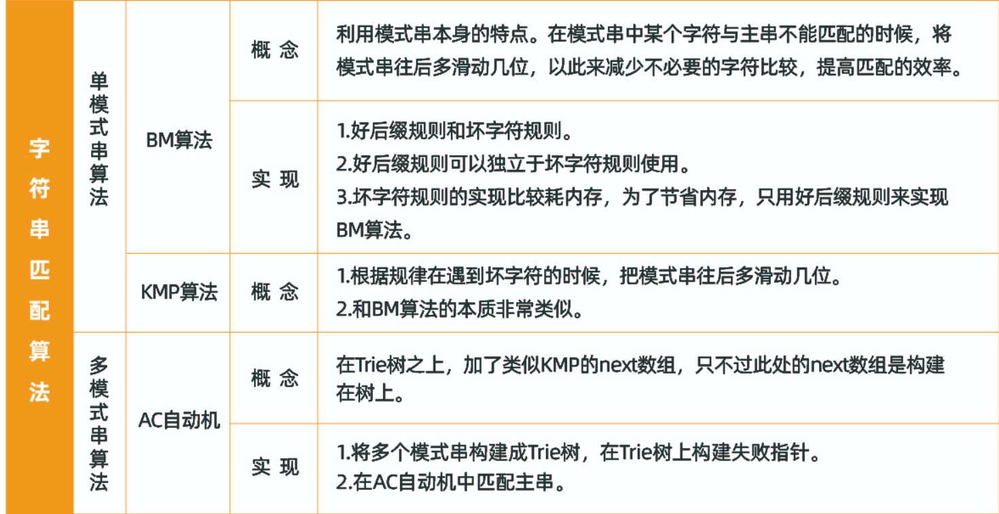

# 11. 哈希表

- 哈希函数 -- 键转索引

  - 键哈希函数得到的索引分布越均匀越好

  1. 整数：

     通用做法：取模（模一个素数，使结果分布均匀）

  2. 浮点型

     转成整型，在按照整数处理

  3. 字符串

     如通过26进制转成整型，26可根据情况进行更改

      

  4. 复合类型

     转成整型处理，类似于字符串的进行处理

  

  

- 哈希表 -- 解决哈希冲突

  1. 链地址法，时间复杂度O（1）


 2.  开放地址法

     指标：负载率，一般当负载率达到50%时，就需要扩容，时间复杂度O（1）

     - 线性探测
     - 平方探测

     

     - 二次哈希

     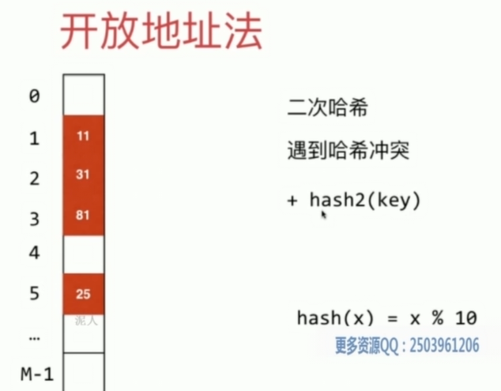

     3. 再哈希法

     

- 复杂度分析：（加入动态处理之前）

 

- 动态空间扩容与缩容：


​	

​	根据素数表，来解决扩容之后不是素数的问题。


- 复杂度分析（加入动态处理之后）


​		`指在均摊复杂度分析中，其为O（1）的水平`

- 缺点

​        

​                                                                                                                                                                                                                                                                                                                                                                                 

# 12. 图

## 12.1 分类

- 有权图和无权图
- 有向图和无向图

## 12.2 几个基本概念

- 邻接与关联
  - 邻接：指顶点与顶点之间的关系
  - 关联：指边与顶点之间的关系
- 顶点的度
  - 顶点的度指与该顶点相关联的边的数目
  - 握手定理：度数之和等于边数的两倍
- 路径、路径长度、距离
  - 路径：接续的边的顶点构成的序列
  - 路径长度：路径上边或弧的数目
  - 距离：从顶点到另一顶点的最短路径长度
- 路径、简单路径
  - 回路：第一个顶点和最后一个顶点相同的路径。
  - 简单路径：除路径起点和终点可以相同外，其余顶点均不相同的路径
- 连通图和连通分量
  - 连通图：图中任意两个顶点都是连通的
  - 连通分量：无向图G的最大连通子图称为G的连通分量。极大连通子图：该子图是G的连通子图，如果再加入一个顶点，该子图不连通
- 强连通图、强连通分量（对于有向图定义）
- 生成树
  - 极小连通子图：该子图删除任何一条边，该子图不再连通
  - 生成树：包含无向图G所有顶点的极小连通子图，只有连通图才有生成树
- 简单图（不含有自环边和平行边）


## 12.3 表示

- 邻接矩阵（适合稠密图）
  - 无向图（对称）
  - 有向图（不对称）
  - 数据结构定义
  
  ```c++
  #define MaxVnum 100  //顶点数最大值
  typedef char VexType;  //顶点的数据类型，根据需要定义
  typedef int EdgeType;  //边上权值的数据类型，若不带权值的图，则为0或1
  typedef struct{
    VexType Vex[MaxVnum];
    EdgeType Edge[MaxVnum][MaxVnum];
    int vexnum,edgenum; //顶点数，边数
  }AMGragh;
  ```
  
  **优点：**
  
  	1. 快速判断两个顶点之间是否有边，时间复杂度为O(1)
   	2. 方便计算各个顶点的度，时间复杂度为O(n)
  
  **缺点：**
  
  1. 不便于增删顶点。增删顶点时，需要改变邻接矩阵的大小，效率较低
  2. 不便于访问所有邻接点。访问第i个顶点的所有邻接点，需要访问第i行的所有元素，时间复杂度为O(n)
  3. 空间复杂度高，空间复杂度为O(n^2)
  
- 邻接表（适合稀疏图）

  链式存储方法，邻接表包括两个部分，**顶点**和**邻接点**。顶点包括顶点信息和指向第一个邻接点的指针。邻接点包括邻接点的存储下标和指向下一个邻接点的指针

  - 无向图
    - 如何添加边？按照**头插法**（逆序）将其放入到链表中
  - 有向图
    - 邻接表（出边）
    - 逆邻接表（入边）
  - 数据结构的定义

  ```c++
  //定义邻接点类型
  typedef struct AdjNode {
      int v;
      //指向下一个邻接点
      struct AdjNode *next; 
  } AdjNode;
  //定义顶点信息
  typedef struct VexNode {
      VexType data;
      AdjNode *first;
  } VexNode;
  //图的邻接表结构体定义
  #define MaxVnum 100
  typedef struct {
      VexNode Vex[MaxVnum]; //顶点表
      int vexnum, edgenum; 
  } ALGraph;
  ```

  1. 更新节点表
  2. 创建邻接点，头插法插入
     - 优点
       1. 便于增删邻接点
       2. 便于访问所有邻接点。访问所有邻接点的时间复杂度为O(n + e)
       3. 空间复杂度低
     - 缺点
       1. 不便于判定两顶点之间是否有边，要确定，需要遍历该节点后面的邻接链表
       2. 不便于计算各顶点的度

- 十字链表（有向图的另一种存储方式）

  - 结合邻接表和逆邻接表的优点，可以快速访问入弧和出弧
  - 包含两个部分，顶点节点和弧节点。顶点节点包含顶点信息和两个指针（分别指向第一个入弧和第一个出弧），弧节点包括两个数据域（弧尾，弧头）和两个指针域（分别指向同弧尾和同弧头的弧）

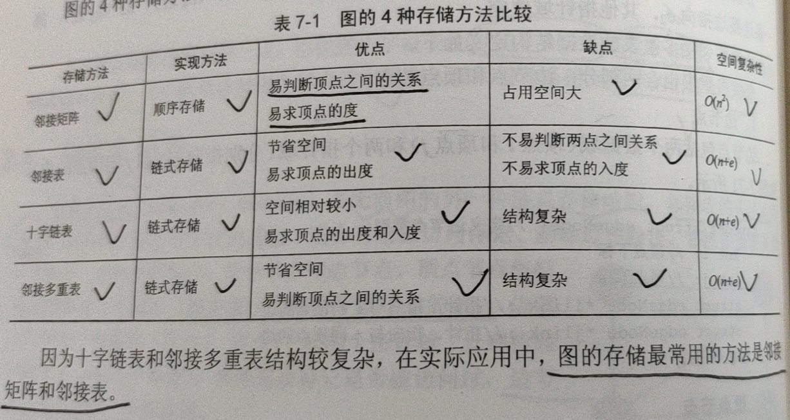

## 12.4 遍历

- 深度优先遍历DFS   （回溯算法：https://labuladong.gitbook.io/algo/di-ling-zhang-bi-du-xi-lie/hui-su-suan-fa-xiang-jie-xiu-ding-ban）

  - 思想：后被访问的节点，其邻接点先被访问，借助栈来实现

  - 分为递归和非递归解法，描述方式过程，但遍历过程是一样的

    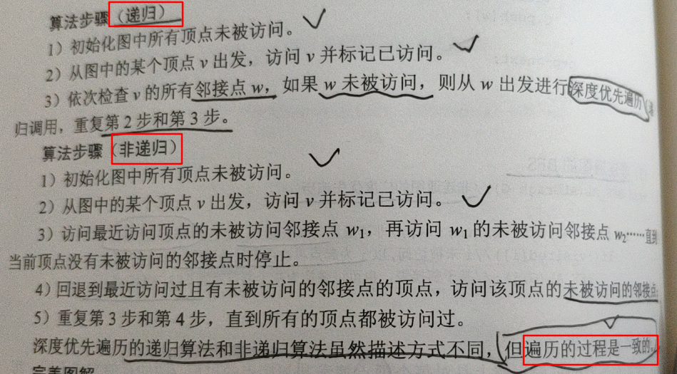

  ```c++
  //基于邻接矩阵的DFS
  #define MaxVnum 100  //顶点数最大值
  bool visited[MaxVnum];  //访问标志数组，其初值为"false"
  typedef char VexType;  //顶点的数据类型，根据需要定义
  typedef int EdgeType;  //边上权值的数据类型，若不带权值的图，则为0或1
  typedef struct{
  	VexType Vex[MaxVnum];
  	EdgeType Edge[MaxVnum][MaxVnum];
  	int vexnum,edgenum; //顶点数，边数
  }AMGragh;
  //递归实现
  void DFS_AM(AMGragh G,int v)//基于邻接矩阵的深度优先遍历
  {
      int w;
      cout<<G.Vex[v]<<"\t";
      visited[v]=true;
      for(w=0;w<G.vexnum;w++)//依次检查v的所有邻接点
  		if(G.Edge[v][w]&&!visited[w])//v、w邻接而且w未被访问
  			DFS_AM(G,w);//从w顶点开始递归深度优先遍历
  }
  ```

  ```c++
  //基于邻接表的实现
  const int MaxVnum=100;//顶点数最大值
  bool visited[MaxVnum];  //访问标志数组，其初值为"false"
  typedef char VexType;//顶点的数据类型为字符型
  
  typedef struct AdjNode{ //定义邻接点类型
  	int v; //邻接点下标
  	struct AdjNode *next; //指向下一个邻接点
  }AdjNode;
  
  typedef struct VexNode{ //定义顶点类型
  	VexType data; // VexType为顶点的数据类型，根据需要定义
  	AdjNode *first; //指向第一个邻接点
  }VexNode;
  
  typedef struct{//定义邻接表类型
      VexNode  Vex[MaxVnum];
      int vexnum,edgenum; //顶点数，边数
  }ALGragh;
  
  //递归实现
  void DFS_AL(ALGragh G,int v)//基于邻接表的深度优先遍历
  {
      int w;
      AdjNode *p;
      cout<<G.Vex[v].data<<"\t";
      visited[v]=true;
      p=G.Vex[v].first;
      while(p)//依次检查v的所有邻接点
      {
  		w=p->v;//w为v的邻接点
  		if(!visited[w])//w未被访问
  			DFS_AL(G,w);//从w出发，递归深度优先遍历
  		p=p->next;
      }
  }
  ```

  - 复杂度分析

  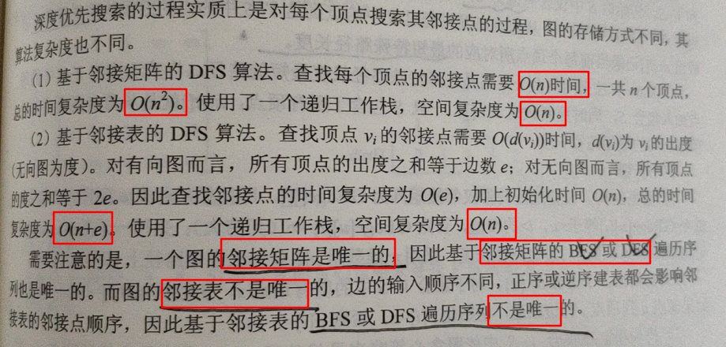

- 广度优先遍历BFS**（经典框架：https://labuladong.gitbook.io/algo/di-ling-zhang-bi-du-xi-lie/bfs-kuang-jia）**

  - 思想：先被访问的节点，其邻接点先被访问，借助队列实现
  - 广度优先遍历经过的点及边，称为广度优先生成树，简称BFS树

  ```c++
  //基于邻接矩阵的BFS
  #define MaxVnum 100  //顶点数最大值
  bool visited[MaxVnum];  //访问标志数组，其初值为"false"
  typedef char VexType;  //顶点的数据类型，根据需要定义
  typedef int EdgeType;  //边上权值的数据类型，若不带权值的图，则为0或1
  typedef struct{
  	VexType Vex[MaxVnum];
  	EdgeType Edge[MaxVnum][MaxVnum];
  	int vexnum,edgenum; //顶点数，边数
  }AMGragh;
  
  void BFS_AM(AMGraph G, int v) //基于邻接矩阵的广度优先遍历
  {
      int u, w;
      queue<int> Q; //创建一个普通队列，里面存放int类型
      cout << G.Vex[v] << "\t" ;
      visited[v] = true;
      Q.push(v); //源点v入队
      while(!Q.empty()) //如果队列不空
      {
          u = Q.front(); //取出队头元素
          Q.pop(); //出队
          for(w = 0; w < G.vexnum; w++){
              if(G.Edge[u][w] && !visited[w]) //u，w邻接而且未被访问
              {
                  cout << G.Vex[w] << "\t" ;
                  visited[w] = true;
                  Q.push(w);
          }
      }
  }
  ```

  ```c++
  //基于邻接表的BFS
  const int MaxVnum=100;//顶点数最大值
  bool visited[MaxVnum];//访问标志数组，其初值为"false"
  typedef char VexType;//顶点的数据类型为字符型
  
  typedef struct AdjNode{ //定义邻接点类型
  	int v; //邻接点下标
  	struct AdjNode *next; //指向下一个邻接点
  }AdjNode;
  
  typedef struct VexNode{ //定义顶点类型
  	VexType data; // VexType为顶点的数据类型，根据需要定义
  	AdjNode *first; //指向第一个邻接点
  }VexNode;
  
  typedef struct{//定义邻接表类型
  	VexNode  Vex[MaxVnum];
      int vexnum,edgenum; //顶点数，边数
  }ALGragh;
  
  void BFS_AL(ALGragh G,int v)//基于邻接表的广度优先遍历
  {
      int u,w;
      AdjNode *p;
      queue<int>Q; //创建一个普通队列(先进先出)，里面存放int类型
      cout<<G.Vex[v].data<<"\t";
      visited[v]=true;
      Q.push(v); //源点v入队
      while(!Q.empty()) //如果队列不空
      {
          u=Q.front();//取出队头元素赋值给u
          Q.pop(); //队头元素出队
          p=G.Vex[u].first;
          while(p)//依次检查u的所有邻接点
          {
              w=p->v;//w为u的邻接点
              if(!visited[w])//w未被访问
              {
                 cout<<G.Vex[w].data<<"\t";
                 visited[w]=true;
                 Q.push(w);
              }
              p=p->next;
          }
      }
  }
  ```

  - 求出了无权图的最短路径
  - 复杂度分析

  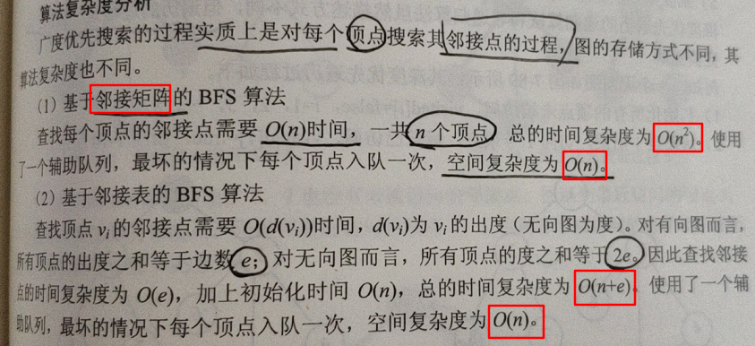

## 12.5 最小生成树

- 带权无向图
- 连通图 
- 切分定理（集合避圈法）：给定==任意切分==，横切边中权值最小的边必然属于最小生成树

1. Prim算法

   - 算法步骤：

     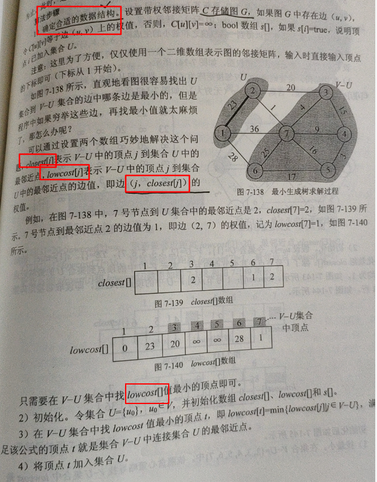

     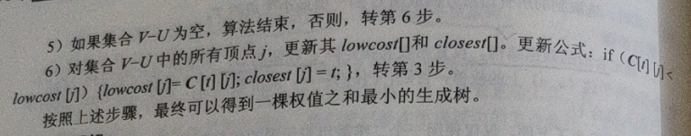

     - 具体实现

     ```c++
     #include<iostream>
     using namespace std;
     
     const int INF=0x3fffffff;
     const int N=100;
     bool s[N];
     int c[N][N],closest[N],lowcost[N];
     void Prim(int n, int u0, int c[N][N])
     {    //顶点个数n、开始顶点u0、带权邻接矩阵C[n][n]
         //如果s[i]=true,说明顶点i已加入最小生成树
         //的顶点集合U；否则顶点i属于集合V-U
         //将最后的相关的最小权值传递到数组lowcost
         s[u0]=true; //初始时，集合中U只有一个元素，即顶点u0
         int i,j;
         for(i=1;i<=n;i++)
         {
             if(i!=u0)
             {
                 lowcost[i]=c[u0][i];
                 closest[i]=u0;
                 s[i]=false;
             }
             else
                 lowcost[i]=0;
         }
         for(i=1;i<=n;i++) //在集合中V-u中寻找距离集合U最近的顶点t
         {
             int temp=INF;
             int t=u0;
             for(j=1;j<=n;j++)
             {
                 if((!s[j])&&(lowcost[j]<temp))
                 {
                     t=j;
                     temp=lowcost[j];
                 }
             }
             if(t==u0)
                 break;       //找不到t，跳出循环
             s[t]=true;     //否则，讲t加入集合U
             for(j=1;j<=n;j++) //更新lowcost和closest
             {
                 if((!s[j])&&(c[t][j]<lowcost[j]))
                 {
                     lowcost[j]=c[t][j];
                     closest[j]=t;
                 }
             }
         }
     }
     ```

   - 复杂度：

     - 时间复杂度： O(n^2^)
       - 优化：
         - Lazy Prim（使用最小堆）
           - 时间复杂度：O(ElogE)，堆的大小最大是边的大小

     - 空间复杂度：O(n^2^)

2. Kruskal算法（O(ElogE)）==暂时不考虑==

   将边的权值进行排序，之后只要加入当前最小生成树的边不形成环，则其就属于最小生成树中的边。

   使用集合避圈法，边的两点不能属于一个集合

   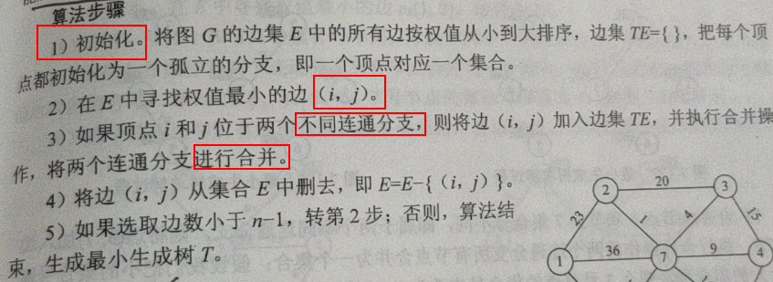

   - 具体实现：

   ```c++
   #include<iostream>
   #include<algorithm>
   using namespace std;
   const int N=100;
   int nodeset[N];
   int n, m;
   struct Edge{
       int u;
       int v;
       int w;
   }e[N*N];
   bool comp(Edge x, Edge y){
       return x.w<y.w;
   }
   void Init(int n)
   {
       for(int i=1;i<=n;i++)
           nodeset[i]=i;
   }
   int Merge(int a, int b)
   {
       int p=nodeset[a];
       int q=nodeset[b];
       if(p==q) return 0;
       for(int i=1;i<=n;i++)//检查所有结点，把集合号是q的改为p
       {
         if(nodeset[i]==q)
           nodeset[i]=p;//a的集合号赋值给b集合号
       }
       return 1;
   }
   int Kruskal(int n)
   {
       int ans=0;
       for(int i=0;i<m;i++)
           if(Merge(e[i].u,e[i].v))
           {
               ans+=e[i].w;
               n--;
               if(n==1)
                   return ans;
           }
       return 0;
   }
   int main()
   {
       cout<<"输入结点数n和边数m:"<<endl;
       cin>>n>>m;
       Init(n);
       cout<<"输入结点数u,v和边值w:"<<endl;
       for(int i=1;i<=m;i++)
           cin>>e[i].u>>e[i].v>>e[i].w;
       //注意排序算法的使用
       sort(e,e+m,comp);
       int ans=Kruskal(n);
       cout<<"最小的花费是："<<ans<<endl;
       return 0;
   }
   ```

   

## 12.6 最短路径问题（无向图，有向图）

- 广度优先遍历  （无权图）   

- 单源最短路径问题（松弛操作，带权图）

  - dijkstra算法（图中不能有负权边）

    - 算法思路：使用贪心算法

      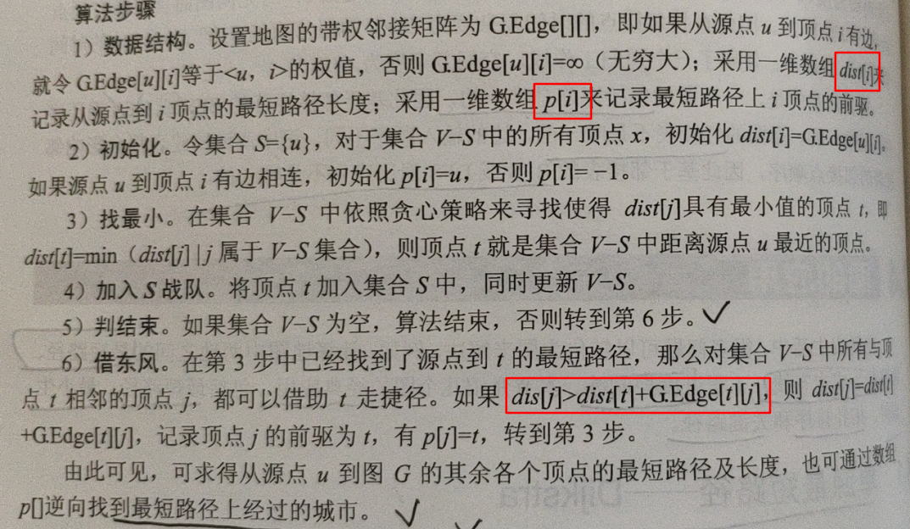

      - 具体实现

      ```c++
      #include<iostream>
      #include<cstring>
      #include<stack>
      using namespace std;
      const int MaxVnum = 100; // 城市的个数可修改
      const int INF = 1e7; // 无穷大10000000
      int dist[MaxVnum],p[MaxVnum];//最短距离和前驱数组
      bool flag[MaxVnum]; //如果s[i]等于true，说明顶点i已经加入到集合S;否则顶点i属于集合V-S
      
      typedef string VexType;  //顶点的数据类型，根据需要定义
      typedef int EdgeType;  //边上权值的数据类型，若不带权值的图，则为0或1
      typedef struct{
      	VexType Vex[MaxVnum];
      	EdgeType Edge[MaxVnum][MaxVnum];
      	int vexnum,edgenum; //顶点数，边数
      }AMGragh;
      
      void Dijkstra(AMGragh G,int u)
      {
      	for(int i=0;i<G.vexnum;i++)
      	{
      		dist[i]=G.Edge[u][i]; //初始化源点u到其他各个顶点的最短路径长度
      		flag[i]=false;
      		if(dist[i]==INF)
      			p[i]=-1; //源点u到该顶点的路径长度为无穷大，说明顶点i与源点u不相邻
      		else
      			p[i]=u; //说明顶点i与源点u相邻，设置顶点i的前驱p[i]=u
          }
          dist[u]=0;
          flag[u]=true;   //初始时，集合S中只有一个元素：源点u
          for(int i=0;i<G.vexnum;i++)
          {
              int temp=INF,t=u;
              for(int j=0;j<G.vexnum;j++) //在集合V-S中寻找距离源点u最近的顶点t
      			if(!flag[j]&&dist[j]<temp)
      			{
      				t=j;
      				temp=dist[j];
      			}
              if(t==u) return ; //找不到t，跳出循环
              flag[t]=true;  //否则，将t加入集合
              for(int j=0;j<G.vexnum;j++)//更新与t相邻接的顶点到源点u的距离
      			if(!flag[j]&&G.Edge[t][j]<INF)
      				if(dist[j]>(dist[t]+G.Edge[t][j]))
      				{
      					dist[j]=dist[t]+G.Edge[t][j];
      					p[j]=t;
      				}
             }
      }
      ```

    - 复杂度：

      - 时间复杂度：O(n ^2^)
      - 空间复杂度：O(n)
      - 算法优化：
        - 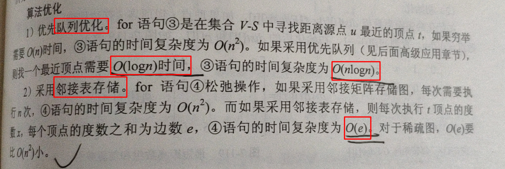

  - 处理负权边，拥有负权环的图，不具有最短路径

  - 各顶点之间的最短路径--Floyd

    - 可求解任意两点之间的最短路径，又称插点法
    - 具体算法步骤：

    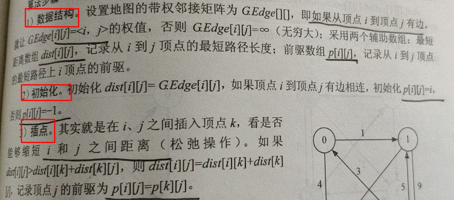

    - 具体实现：

    ```c++
    #include<iostream>
    #include<cstring>
    #include<windows.h>
    using namespace std;
    
    #define MaxVnum 100  //顶点数最大值
    const int INF=1e7; // 无穷大10000000
    
    typedef string VexType;  //顶点的数据类型，根据需要定义
    typedef int EdgeType;  //边上权值的数据类型，若不带权值的图，则为0或1
    typedef struct{
    	VexType Vex[MaxVnum];
    	EdgeType Edge[MaxVnum][MaxVnum];
    	int vexnum,edgenum; //顶点数，边数
    }AMGragh;
    
    int dist[MaxVnum][MaxVnum],p[MaxVnum][MaxVnum];
    
    void Floyd(AMGragh G) //用Floyd算法求有向网G中各对顶点i和j之间的最短路径
    {
       	int i,j,k;
        for(i=0;i<G.vexnum;i++)          		//各对结点之间初始已知路径及距离
          for(j=0;j<G.vexnum;j++)
          {
              dist[i][j]=G.Edge[i][j];
              if(dist[i][j]<INF && i!=j)
    			p[i][j]=i;  	//如果i和j之间有弧，则将j的前驱置为i
              else p[i][j]=-1;  //如果i和j之间无弧，则将j的前驱置为-1
          }
    	for(k=0;k<G.vexnum; k++)
    		for(i=0;i<G.vexnum; i++)
    			for(j=0;j<G.vexnum; j++)
    				if(dist[i][k]+dist[k][j]<dist[i][j])//从i经k到j的一条路径更短
                    {
    					dist[i][j]=dist[i][k]+dist[k][j]; //更新dist[i][j]
    					p[i][j]=p[k][j];       //更改j的前驱为k
    				}
    }
    ```

    - 复杂度：

      - 时间复杂度：O(n^3^)
      - 空间复杂度：采用两个辅助数组，空间复杂度为O(n^2^)

      虽然时间复杂度较高，但代码简单，对于中等输入规模来说，仍然相当有效，可用于处理负权值的图，但不允许包含负权环

## 12.7 [拓扑排序](https://blog.csdn.net/qq_24028753/article/details/77692447)

- 一个无环的有向图称为**有向无环图**，如果AOV网都在拓扑排序序列中，则AOV网必定无环

- 拓扑排序是指：将AOV网中的顶点排成一个线性序列，该序列必须满足：若从顶点i到顶点j有一条路径，则该序列中顶点i一定在顶点j之前

- 拓扑排序的结果并不是唯一的

- 基本思想：

  1. 选择一个无前驱的顶点并输出
  2. 从图中删除该顶点和该顶点的所有发出边
  3. 重复1和2，直到不存在无前驱的顶点
  4. 如果输出顶点数小于AOV网中的顶点数，则说明网中有环，否则输出的序列为拓扑序列


https://github.com/arkingc/note/blob/master/%E6%95%B0%E6%8D%AE%E7%BB%93%E6%9E%84%E4%B8%8E%E7%AE%97%E6%B3%95/%E5%9B%BE.md#%E6%8B%93%E6%89%91%E6%8E%92%E5%BA%8F

- - 时间复杂度

    O(n + e)

  - 空间复杂度

    O(n)

# 13.并查集

- 通常用于解决**连接**问题和**路径**问题

- **实现方式1**（基于数组实现）：

  - 查找find()时间很快，O(1)
  - 合并unionElements()慢，O(n)

- **实现方式2**（常规解决方式）

  - 使用节点的思想，进行union时，指向根节点，防止高度过高，同样可以利用数组进行实现，时间复杂度跟树的高度相关

  - 基于**方式2**方法的优化

    1. 基于size的优化（优化union）

       分别记录两个集合的大小，将集合较小的根节点指向集合较大的根节点

    2. 基于rank的优化（rank[i]表示根节点为i的树的高度）（优化union）

       可以处理比较极端的情况，最常用

    3. 路径压缩（优化find）

       - 在查找过程中，减少树的高度

          1.  节点的父亲指向节点父亲的父亲

        2. 所有节点都指向根节点（使用递归）

           理论上更好，但由于递归增加的额外开销，可能没有方式1好。

       - 由于路径压缩的实现，rank可能不在表示层数，我们也不需要维护rank的语义，它只是作为一个比较的标准

         

  - 时间复杂度（近乎O(1)级别的，查询和合并操作均是这样）


> 示例代码链接：https://github.com/liuyubobobo/Play-with-Algorithms/tree/master/06-Union-Find/Course%20Code%20(C%2B%2B)

参考：

1. [刘宇波 《玩转数据结构 从入门到进阶》](https://github.com/houpengfei88/Play-with-Data-Structures)
2. [刘宇波 《算法与数据结构》](https://github.com/liuyubobobo/Play-with-Algorithms)
3. 刘宇波 《玩转算法面试》
4. [数据结构与算法之美](https://time.geekbang.org/column/article/70537?utm_term=pc_interstitial_232)