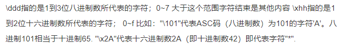
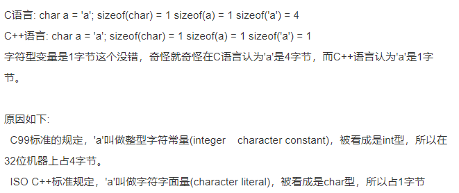
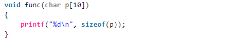
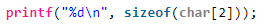

[TOC]

# 1. 题目

## 1.1 一级标题

**重要的名词**

==重要的概念==

>  补充内容

[引用链接]:www.baidu.com


## 基础概念

### C++语言特点 / 编程的5种范式

- C++具有强大的抽象能力，融合着5种编程范式，即`面向过程、基于对象、面向对象、泛型和函数式`

1. 面向过程

   一组函数的顺序执行

2. 基于对象

   采用对象封装技术，将数据和操作捆绑在一起，但并没有使用继承、多态等面向对象技术进行软件设计

   一个 object-based（OB）设计可能会比一个对等的 OO 设计速度更快更紧凑。速度快是因为所有的函数调用操作都在编译时期解析完成，对象建构起来时不需要设置 virtual 机制；空间紧凑是因为每一个 class object 不需要负担传统上为了支持 virtual 机制而需要的额外负荷。但是，由于没有继承、多态机制，失去了部分弹性。

3. 面向对象

   面向对象程序设计的核心思想是数据抽象（封装）、继承和多态（动态绑定）

   * 数据抽象：把客观事物封装成抽象的类，同时将类的接口和实现分离。（优点：可以隐藏实现细节，使得代码模块化）
   * 继承：定义相似的类型，并对其相似关系建模。（优点：可以扩展已存在的代码模块）
   * 多态：一定程度上忽略相似类型的区别，以统一的方式使用它们的对象。

   面向对象设计的 5 大原则（SOLID）：

   - SRP(The Single Responsibility Principle) 单一职责原则：一个类应该有且只有一个去改变它的理由，这意味着一个类应该只有一项工作。
   - OCP(The Open Closed Principle) 开放封闭原则：对象或实体应该对扩展开放，对修改封闭，这就意味着一个类应该无需修改类本身但却容易扩展。
   - LSP(The Liskov Substitution Principle) 里氏替换原则：每一个子类或派生类应该可以替换它们的基类或父类。
   - ISP(The Interface Segregation Principle) 接口隔离原则：不应强迫客户端实现一个它用不上的接口，或是说客户端不应该被迫依赖它们不使用的方法。
   - DIP(The Dependency Inversion Principle) 依赖倒置原则：实体必须依靠抽象而不是具体实现。它表示高层次的模块不应该依赖于低层次的模块，它们都应该依赖于抽象。

4. 泛型

   泛型编程的核心活动是抽象：将一个特定于某些类型的算法中那些类型无关的共性抽象出来，比如，在STL的概念体系里面，管你是一个数组还是一个链表，反正都是一个区间，这就是一层抽象。管你是一个内建函数还是一个自定义类，反正都是一个Callable（可调用）的对象（在C++里面通过仿函数来表示），这就是一层抽象。泛型编程的过程就是一个不断将这些抽象提升出来的过程，最终的目的是形成一个最大程度上通用的算法或类。

   相对于基于**多态的面向对象抽象**而言，使用模版更加高效。因为面向对象的多态引入了间接调用，需要在**运行期**查找真正调用的函数，而模板可以直接利用**编译器的类型信息**，避免了间接调用。

5. 函数式编程

   函数式编程的主要思想是把运算过程尽量写成一系列嵌套的函数调用，每一个函数调用不依赖于外部的数据，而且也不改变外部数据的值，而是返回一个新的值。

   函数式编程具有五个鲜明的特点:

   1. 函数是`第一等公民`。所谓"第一等公民"（first class），指的是函数与其他数据类型一样，处于平等地位，可以赋值给其他变量，也可以作为参数，传入另一个函数，或者作为别的函数的返回值。
   2. 只用`表达式`，不用`语句`。表达式（expression）是一个单纯的运算过程，总是有返回值；语句（statement）是执行某种操作，没有返回值。函数式编程要求，只使用表达式，不使用语句。也就是说，每一步都是单纯的运算，而且都有返回值。
   3. 没有`副作用`。函数式编程强调没有"副作用"，意味着函数要保持独立，所有功能就是返回一个新的值，没有其他行为（最典型的情况，就是修改全局变量的值）。
   4. 不修改`参数`。函数参数是不可变的。
   5. `引用透明`（Referential transparency）。函数的运行不依赖于外部变量，只依赖于输入的参数，任何时候只要参数相同，引用函数所得到的返回值总是相同的。

### 声明还是定义？

- 变量声明用来引入标识符，并对它的类型（对象、函数等）进行说明，有了声明语句，**编译器**就可以理解对该标识符的**引用**，可以重复声明一个变量；
- 变量定义用来为变量分配存储空间，还可为变量指定初始值。可以将定义看做是对声明的变量进行实例化，**链接器**需要根据定义来找到变量具体对应的值，变量必须有且仅有一个定义。
- 重复定义会导致链接器不知道哪一个是需要的，编译器会报错：**redefinition of**。变量缺少定义链接器会因为**symbol(s) not found**链接失败。

### 左值还是右值？

- 左值与右值这两概念是从 c 中传承而来的，在 c 中，左值指的是既能够出现在等号左边也能出现在等号右边的变量(或表达式)，右值指的则是只能出现在等号右边的变量(或表达式)。
- 在 C 语言中，通常来说有名字的变量就是左值(如上面例子中的 a, b)，而由运算操作(加减乘除，函数调用返回值等)所产生的中间结果(没有名字)就是右值，如上的 3 + 4， a + b 等。可以认为**左值就是在程序中能够寻址的东西，右值就是没法取到它的地址的东西**。
- 如上概念到了 c++ 中，就变得稍有不同。具体来说，在 c++ 中，`每一个表达式或者是一个左值，或者是一个右值`，相应的，该表达式也就被称作“左值表达式"，"右值表达式"。对于内置的基本数据类型来说(primitive types)，左值右值的概念和 c 没有太多不同，不同的地方在于自定义的类型:
  - 对于内置的类型，右值是不可被修改的(non-modifiable)，也不可被 const, volatile 所修饰；
  - 对于自定义的类型(user-defined types)，右值却允许通过它的成员函数进行修改。
- C++ 中自定义类型允许有成员函数，而通过右值调用成员函数是被允许的，但成员函数有可能不是 const 类型，因此通过调用右值的成员函数，也就可能会修改了该右值。此外，**右值只能被 const 类型的 reference 所指向**，当一个右值被 const reference 指向时，它的生命周期就被延长了。

### 引用

编译器一般将引用实现为`const指针`，即指向位置不可变的指针，也就是说引用实际上与一般的指针同样占用内存，不过我们没有办法获得这个指针的地址。

当大型对象被传递给函数时，使用引用参数可使参数传递效率得到提高，因为引用并不产生对象的副本，也就是参数传递时，对象无须复制。有时甚至有的类类型（包括 IO 类型在内）根本不支持拷贝操作，只能用引用传递。

> 参考：1. https://github.com/selfboot/CS_Offer/tree/master/C++

### sizeof运算符

sizeof 运算符返回`一条表达式或者一个类型名字所占的字节数`，sizeof 运算符满足右结合律，所得的值是一个 size_t 类型的常量表达式。sizeof 运算符的运算对象有两种形式：

1. sizeof *(type)*
2. sizeof *expr*

第二种形式中，返回的是表达式结果类型的大小（注意**，sizeof 并不实际计算其运算对象的值**）。

在 sizeof 的运算对象中解引用一个无效指针仍然是一种安全的行为，因为指针实际上并没有被真正使用，sizeof ==并不需要真的解引用指针也能知道它所指对象的类型==。这是一件可以在程序运行前==（`编译时`）==完成的事情，所以，==sizeof(*p)==直接就被==具体数字==给取代了，在==运行时==也就==不会==有了解引用这个表达式。

```c++
int i = 10;
printf("%d\n",i);                           // 10
// sizeof 并不计算 i++
printf("%d\n",sizeof(i++));                 // 4
printf("%d\n",i);                           // 10
```

sizeof 运算符的结果部分地依赖于其作用的类型：

* 对 char 或者类型为 char 的表达式执行 sizeof 运算，结果得 1；
* 对引用类型执行 sizeof 运算得到==被引用对象==所占空间的大小，但其实引用在内存空间会占用==4个字节的大小==；
* 对指针执行 sizeof 运算得到==指针本身==所占空间的大小；
* 对解引用指针执行 sizeof 运算得到指针指向的对象所占空间的大小，==指针不需要有效==；
* 对数组执行 sizeof 运算得到==整个数组所占空间==的大小，等同于对数组中==所有的元素==各执行一次 sizeof 运算并将所得结果==求和==。（sizeof ==不会把数组转换成指针==来处理，可以用数组的==大小除以单个元素的大小==得到数组中元素的个数）。
* 对 string 对象或 vector 对象执行 sizeof 运算==只返回该类型固定部分的大小（**24**）==，==不会计算对象占用了多少空间==；
* 对于 ==enum 类型==的变量，它保存的==枚举对象本身==并不是真的变量，它们只是类型安全的 #define，用来以可读的方式保存一串数字而已。编译器一般是用 ==int 类型的来保存一个 enum==，所以==sizeof 结果为 4==。

此外求==类的大小时==遵循下面规则（只统计与==类的实例==有关的，只与类型相关的不统计）：

1. 类的非静态成员数据的类型大小之和，也就是说==静态成员数据不作考虑==。
2. 普通成员函数与==sizeof无关==，调用普通成员函数只需要知道函数的地址即可，而这些地址只与类型相关，与类型的实例无关。
3. 虚函数由于要维护在虚函数表，所以要==占据一个指针大小==
4. 类的总大小也遵守类似 struct ==字节对齐==的调整规则
5. 空类的==大小为 1==（空类型的实例中不包含任何信息，但是声明空类的实例时，必须在内存中占有一定的空间，否则无法使用这些实例。占有空间数由==编译器决定，一般是1==）。

> 注意：
>
> 1. **以\0开头表示八进制数，如\065，但是\128只会区分12，strlen()是遇\0停止，不包含\0**
>
> 
>
> 2. **字符**
>
> 
>
> 3. **数组**
>
> 
>
> 退化成指针，所以为4
>
> 
>
> 审清题目，大小为2的char数组
>
> 4. **对于typedef与define 的区别：**
>
> https://www.cnblogs.com/kerwinshaw/archive/2009/02/02/1382428.html
>
> https://www.zhihu.com/question/29798061
>
> typedef是有作用域的，define是全局的
>
> ［[枚举类型，typedef 函数指针](http://www.nowcoder.com/questionTerminal/07684925aaaf4885ad574b2a2debe930)］  

