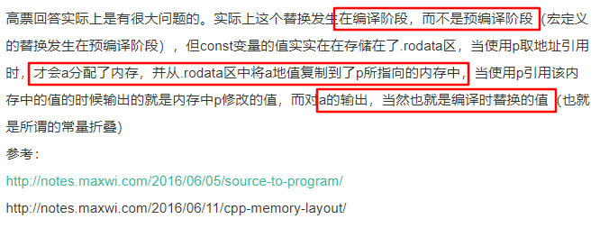

[TOC]

# 1. 基础概念

## 1.1 C++语言特点 / 编程的5种范式

- C++具有强大的抽象能力，融合着5种编程范式，即`面向过程、基于对象、面向对象、泛型和函数式`

1. 面向过程

   一组函数的顺序执行

2. 基于对象

   采用对象封装技术，将数据和操作捆绑在一起，但并没有使用继承、多态等面向对象技术进行软件设计

   一个 object-based（OB）设计可能会比一个对等的 OO 设计速度更快更紧凑。速度快是因为所有的函数调用操作都在编译时期解析完成，对象建构起来时不需要设置 virtual 机制；空间紧凑是因为每一个 class object 不需要负担传统上为了支持 virtual 机制而需要的额外负荷。但是，由于没有继承、多态机制，失去了部分弹性。

3. 面向对象

   面向对象程序设计的核心思想是数据抽象（封装）、继承和多态（动态绑定）

   * 数据抽象：把客观事物封装成抽象的类，同时将类的接口和实现分离。（优点：可以隐藏实现细节，使得代码模块化）
   * 继承：定义相似的类型，并对其相似关系建模。（优点：可以扩展已存在的代码模块）
   * 多态：一定程度上忽略相似类型的区别，以统一的方式使用它们的对象。

   面向对象设计的 5 大原则（SOLID）：

   - SRP(The Single Responsibility Principle) 单一职责原则：一个类应该有且只有一个去改变它的理由，这意味着一个类应该只有一项工作。
   - OCP(The Open Closed Principle) 开放封闭原则：对象或实体应该对扩展开放，对修改封闭，这就意味着一个类应该无需修改类本身但却容易扩展。
   - LSP(The Liskov Substitution Principle) 里氏替换原则：每一个子类或派生类应该可以替换它们的基类或父类。
   - ISP(The Interface Segregation Principle) 接口隔离原则：不应强迫客户端实现一个它用不上的接口，或是说客户端不应该被迫依赖它们不使用的方法。
   - DIP(The Dependency Inversion Principle) 依赖倒置原则：实体必须依靠抽象而不是具体实现。它表示高层次的模块不应该依赖于低层次的模块，它们都应该依赖于抽象。

4. 泛型

   泛型编程的核心活动是抽象：将一个特定于某些类型的算法中那些类型无关的共性抽象出来，比如，在STL的概念体系里面，管你是一个数组还是一个链表，反正都是一个区间，这就是一层抽象。管你是一个内建函数还是一个自定义类，反正都是一个Callable（可调用）的对象（在C++里面通过仿函数来表示），这就是一层抽象。泛型编程的过程就是一个不断将这些抽象提升出来的过程，最终的目的是形成一个最大程度上通用的算法或类。

   相对于基于**多态的面向对象抽象**而言，使用模版更加高效。因为面向对象的多态引入了间接调用，需要在**运行期**查找真正调用的函数，而模板可以直接利用**编译器的类型信息**，避免了间接调用。

5. 函数式编程

   函数式编程的主要思想是把运算过程尽量写成一系列嵌套的函数调用，每一个函数调用不依赖于外部的数据，而且也不改变外部数据的值，而是返回一个新的值。

   函数式编程具有五个鲜明的特点:

   1. 函数是`第一等公民`。所谓"第一等公民"（first class），指的是函数与其他数据类型一样，处于平等地位，可以赋值给其他变量，也可以作为参数，传入另一个函数，或者作为别的函数的返回值。
   2. 只用`表达式`，不用`语句`。表达式（expression）是一个单纯的运算过程，总是有返回值；语句（statement）是执行某种操作，没有返回值。函数式编程要求，只使用表达式，不使用语句。也就是说，每一步都是单纯的运算，而且都有返回值。
   3. 没有`副作用`。函数式编程强调没有"副作用"，意味着函数要保持独立，所有功能就是返回一个新的值，没有其他行为（最典型的情况，就是修改全局变量的值）。
   4. 不修改`参数`。函数参数是不可变的。
   5. `引用透明`（Referential transparency）。函数的运行不依赖于外部变量，只依赖于输入的参数，任何时候只要参数相同，引用函数所得到的返回值总是相同的。

## 1.2 声明还是定义？

- 变量声明用来引入标识符，并对它的类型（对象、函数等）进行说明，有了声明语句，**编译器**就可以理解对该标识符的**引用**，可以重复声明一个变量；
- 变量定义用来为变量分配存储空间，还可为变量指定初始值。可以将定义看做是对声明的变量进行实例化，**链接器**需要根据定义来找到变量具体对应的值，变量必须有且仅有一个定义。
- 重复定义会导致链接器不知道哪一个是需要的，编译器会报错：**redefinition of**。变量缺少定义链接器会因为**symbol(s) not found**链接失败。

## 1.3 左值还是右值？

- 左值与右值这两概念是从 c 中传承而来的，在 c 中，左值指的是既能够出现在等号左边也能出现在等号右边的变量(或表达式)，右值指的则是只能出现在等号右边的变量(或表达式)。
- 在 C 语言中，通常来说有名字的变量就是左值(如上面例子中的 a, b)，而由运算操作(加减乘除，函数调用返回值等)所产生的中间结果(没有名字)就是右值，如上的 3 + 4， a + b 等。可以认为**左值就是在程序中能够寻址的东西，右值就是没法取到它的地址的东西**。
- 如上概念到了 c++ 中，就变得稍有不同。具体来说，在 c++ 中，`每一个表达式或者是一个左值，或者是一个右值`，相应的，该表达式也就被称作“左值表达式"，"右值表达式"。对于内置的基本数据类型来说(primitive types)，左值右值的概念和 c 没有太多不同，不同的地方在于自定义的类型:
  - 对于内置的类型，右值是不可被修改的(non-modifiable)，也不可被 const, volatile 所修饰；
  - 对于自定义的类型(user-defined types)，右值却允许通过它的成员函数进行修改。
- C++ 中自定义类型允许有成员函数，而通过右值调用成员函数是被允许的，但成员函数有可能不是 const 类型，因此通过调用右值的成员函数，也就可能会修改了该右值。此外，**右值只能被 const 类型的 reference 所指向**，当一个右值被 const reference 指向时，它的生命周期就被延长了。

## 1.4 引用

编译器一般将引用实现为`const指针`，即指向位置不可变的指针，也就是说引用实际上与一般的指针同样占用内存，不过我们没有办法获得这个指针的地址。

当大型对象被传递给函数时，使用引用参数可使参数传递效率得到提高，因为引用并不产生对象的副本，也就是参数传递时，对象无须复制。有时甚至有的类类型（包括 IO 类型在内）根本不支持拷贝操作，只能用引用传递。

> 参考：1. https://github.com/selfboot/CS_Offer/tree/master/C++

## 1.5 sizeof运算符

sizeof 运算符返回`一条表达式或者一个类型名字所占的字节数`，sizeof 运算符满足右结合律，所得的值是一个 size_t 类型的常量表达式。sizeof 运算符的运算对象有两种形式：

1. sizeof *(type)*
2. sizeof *expr*

第二种形式中，返回的是表达式结果类型的大小（注意**，sizeof 并不实际计算其运算对象的值**）。

在 sizeof 的运算对象中解引用一个无效指针仍然是一种安全的行为，因为指针实际上并没有被真正使用，sizeof ==并不需要真的解引用指针也能知道它所指对象的类型==。这是一件可以在程序运行前==（`编译时`）==完成的事情，所以，==sizeof(*p)==直接就被==具体数字==给取代了，在==运行时==也就==不会==有了解引用这个表达式。

```c++
int i = 10;
printf("%d\n",i);                           // 10
// sizeof 并不计算 i++
printf("%d\n",sizeof(i++));                 // 4
printf("%d\n",i);                           // 10
```

sizeof 运算符的结果部分地依赖于其作用的类型：

* 对 char 或者类型为 char 的表达式执行 sizeof 运算，结果得 1；
* 对引用类型执行 sizeof 运算得到==被引用对象==所占空间的大小，但其实引用在内存空间会占用==4个字节的大小==；
* 对指针执行 sizeof 运算得到==指针本身==所占空间的大小；
* 对解引用指针执行 sizeof 运算得到指针指向的对象所占空间的大小，==指针不需要有效==；
* 对数组执行 sizeof 运算得到==整个数组所占空间==的大小，等同于对数组中==所有的元素==各执行一次 sizeof 运算并将所得结果==求和==。（sizeof ==不会把数组转换成指针==来处理，可以用数组的==大小除以单个元素的大小==得到数组中元素的个数）。
* 对 string 对象或 vector 对象执行 sizeof 运算==只返回该类型固定部分的大小（**24**）==，==不会计算对象占用了多少空间==；
* 对于 ==enum 类型==的变量，它保存的==枚举对象本身==并不是真的变量，它们只是类型安全的 #define，用来以可读的方式保存一串数字而已。编译器一般是用 ==int 类型的来保存一个 enum==，所以==sizeof 结果为 4==。

此外求==类的大小时==遵循下面规则（只统计与==类的实例==有关的，只与类型相关的不统计）：

1. 类的非静态成员数据的类型大小之和，也就是说==静态成员数据不作考虑==。
2. 普通成员函数与==sizeof无关==，调用普通成员函数只需要知道函数的地址即可，而这些地址只与类型相关，与类型的实例无关。
3. 虚函数由于要维护在虚函数表，所以要==占据一个指针大小==
4. 类的总大小也遵守类似 struct ==字节对齐==的调整规则
5. 空类的==大小为 1==（空类型的实例中不包含任何信息，但是声明空类的实例时，必须在内存中占有一定的空间，否则无法使用这些实例。占有空间数由==编译器决定，一般是1==）。

> 注意：
>
> 1. **以\0开头表示八进制数，如\065，但是\128只会区分12，strlen()是遇\0停止，不包含\0**
>
> 
>
> 2. **字符**
>
> 
>
> 3. **数组**
>
> 
>
> 退化成指针，所以为4
>
> 
>
> 审清题目，大小为2的char数组
>
> 4. **对于typedef与define 的区别：**
>
> https://www.cnblogs.com/kerwinshaw/archive/2009/02/02/1382428.html
>
> https://www.zhihu.com/question/29798061
>
> typedef是有作用域的，define是全局的
>
> ［[枚举类型，typedef 函数指针](http://www.nowcoder.com/questionTerminal/07684925aaaf4885ad574b2a2debe930)］  

## 1.6 内存对齐

许多实际的计算机系统对基本类型数据在内存中存放的位置有限制，它们会要求这些数据的首地址的值是某个数k（通常它为4或8）的倍数，这就是所谓的**`内存对齐**`。

每个特定平台上的编译器都有自己的默认**“对齐系数”**（32位机一般为==4==，64位机一般为==8==）。我们可以通过预编译命令==#pragma pack(k)==，k=1,2,4,8,16来改变这个系数，其中k就是需要指定的“对齐系数”；也可以使用==#pragma pack()==取消自定义字节对齐方式。

==struct 或者 union 成员==对齐规则如下：

1. 第一个数据成员放在offset为0的地方，每个成员按照对齐系数和自身占用字节数中，二者比较小的那个进行对齐；
2. 在数据成员完成各自对齐以后，struct或者union本身也要进行对齐，对齐将按照对齐系数和struct或者union中最大数据成员长度中比较小的那个进行；

先局部成员对齐，然后再全局对齐。此外，值得注意的是，**enum 内部是 int 实现的，所以大小为 4。用 typedef 声明指针时，并不为指针分配空间**。

［[结构体中 : 的含义](http://www.nowcoder.com/questionTerminal/f4e20747a2dd4649bac0c028daa234f4)］   ==重要，默认小端模式，从右往左放==

## 1.7 联合体、CPU字节序

**`联合体`：**在C/C++程序的编写中，当多个基本数据类型或复合数据结构要占用同一内存块时，就要用到联合体。联合体变量所占内存长度是各成员中最长的成员占的内存长度。union所有成员都从==低地址开始存放。==

**`Little endian`** 和 **`Big endian`** 是CPU 存放数据的两种不同顺序。对于整型、长整型等数据类型，==Big endian 认为第一个字节是最高位字节==（按照从低地址到高地址的顺序存放数据的高位字节到低位字节）；而==Little endian 则相反，它认为第一个字节是最低位字节==（按照从低地址到高地址的顺序存放数据的低位字节到高位字节）。

例如，假设从内存地址0x0000开始有以下数据：0x12 0x34 0xab 0xcd。如果我们去读取一个地址为 0x0000 的四个字节变量，若字节序为big-endian，则读出结果为0x1234abcd；若字节序位little-endian，则读出结果为 0xcdab3412。

一般来说，x86系列CPU 都是==little-endian 的字节序==，PowerPC通常是==Big endian==，还有的CPU 能通过跳线来设置CPU 工作于Little endian 还是Big endian 模式。

我们可以利用 union 的存储特点，写一个简单的程序来判定当前 CPU 的字节序

```c++
#include <iostream>
using namespace std;

bool checkCPU(){
    //如果是小端字节序，则return true，否则，return false
    union Test{
        int m;
        char c;
    } t;
   	t.m = 1;
    return (t.c == 1);
}

int main(){
    cout << (checkCPU() ? "Little endian" : "Big endian") << endl;
    
    //一个测试用例
    union Demo
    {
        char a[4];
        short b;
    };
    Demo d;
    d.a[0]=256;         // 0,    0000 0000
    d.a[1]=255;         // -1,    1111 1111
    d.a[2]=254;         // -2,    1111 1110
    d.a[3]=253;         // -3,    1111 1101

    /* short是2字节（a[0]和a[1]），
     * 由于80X86是小端模式，即数据的低位保存在内存的低地址中，而数据的高位保存在内存的高地址中
     * 在本例中，a[0]中存放的是b的低位，a[1]中存放的是b的高位，
     * 即b的二进制补码表示是：1111 1111 0000 0000，表示-256
     */
    cout << d.b << endl;

    return 0;
}
```

［[大小端，网络发送](http://www.nowcoder.com/questionTerminal/d7c1ff50fab44443b61903eccd791f1d)］ 

［[溢出，大小端](http://www.nowcoder.com/questionTerminal/c7298be0b2ce42698b80987631cf8fca)］  

## 1.8 类型转换

**类型转换**就是将给定类型的表达式转换为另一种类型。C++中的转型可分为两种：隐式类型转换和显式类型转换。

隐式类型转换是C中的遗留物，在C++中并不推荐使用（C++有专门的转型操作符，见下文的显式转型）。将某种类型的对象拷贝到另一种不同类型的对象中时就会发生隐式转型。比如异型赋值，返回值（函数声明的返回值与代码块实际返回值不同的情况下），按值传递异型参数等情况均会发生隐式类型转换。

```c++
short a = 128;
int b;
b = a;
```

short 类型的对象被赋值给 int 型的对象，这是C++语言内建支持的标准转换。隐式类型转换是件麻烦事，它们很可能导致错误或非预期的函数被调用（参看ME 条款5）。

因此应该尽量避免隐式类型转换，为此 C++ 提供了显式类型转换关键字：static_cast, const_cast, dynamic_cast 以及 reinterpret_cast。

**static_cast **

static_cast 很像 C 语言中的旧式类型转换。可以用于以下场景：

* 用于在存有继承关系的类之间的指针或引用的转换（即可将基类转换为子类，也可将子类转换为基类），把派生类的指针或引用转换成基类时是安全的；把基类指针或引用转换成派生类表示时，由于没有类型检查，所以是不安全的。
* 用于基本数据类型之间的转换，如把int转换成char，把int转换成enum。
* 把任何类型的表达式转换成void类型。
* 还能将 non-const 对象转换为 const对象（注意：反之则不行，那是const_cast的职责）。

如下示例：

```c++
class CBase {};
class CDerived: public CBase {};

double d = 3.14159265;
int i = static_cast<int>(d);

CBase *base = new CBase;
CDerived *derived = static_cast<CDerived *>(base);
```

==**static_cast 转换时并不进行运行时安全检查，所以是非安全的，很容易出问题。**==因此 C++ 引入 dynamic_cast 来处理==安全转型==。

 **dynamic_cast**

dynamic_cast 主要用来在继承体系中的**安全向下转型**。它能安全地将指向基类的指针转型为指向子类的指针或引用，并获知转型动作成功是否。

**dynamic_cast 只能用在指针和引用类型的转换中**，它是唯一进行运行期(runtime)检查的类型转换符，它的主要目的就是保证转换后的类型是一个完整类型(Complete type）。dynamic_cast在转换指针类型时，如果结果不是一个Complete Type, 它会返回NULL; dynamic_cast在转换引用类型时，如果结果不是一个Complete Type，它会抛出bad_cast的异常。dynamic_cast 会动用运行时信息（RTTI）来进行类型安全检查，因此 dynamic_cast 存在一定的效率损失。

```c++
class CBase { };
class CDerived: public CBase { };

int main(){
    CBase b;
    CBase* pb;
    CDerived d;
    CDerived* pd;
    pb = dynamic_cast<CBase*>(&d);     // ok: derived-to-base
    pd = dynamic_cast<CDerived*>(&b);  // error: base-to-derived
}
```

上面的代码最后一行会出错（error: 'CBase' is not polymorphic），==**因为dynamic_cast 只有在基类带有虚函数的情况下才允许将基类转换为子类**==。

```c++
class CBase
{
    virtual void dummy() { }
};

class CDerived : public CBase {
    int a;
};

int main()
{
    CBase *pba = new CDerived;
    CBase *pbb = new CBase;
    CDerived *pd1, *pd2;
    pd1 = dynamic_cast<CDerived *>(pba);
    pd2 = dynamic_cast<CDerived *>(pbb);
}
```

上面代码中的 pd1 不为 null,而 pd2 为 null。

**const_cast**

这个转换操作会操纵传递对象的const属性，或者设置或者移除该属性。

```c++
class C{}; 
const C* a = new C; 
C *b = const_cast(a);
```

**reinterpret_cast**

一个指针转化为其他类型的指针时，不做类型检测，操作结果是一个指针指向另一个指针的值的二进制拷贝；

```c++
class A{}; 
class B{}; 
A* a = new A;
B* b = reinterpret_cast(a);
```

reinterpret_cast 用来执行低级转型，如将执行一个 int 的指针强转为 int。其转换结果与编译平台息息相关，不具有可移植性，因此在一般的代码中不常见到它。

reinterpret_cast 常用的一个用途是转换函数指针类型，即可以将一种类型的函数指针转换为另一种类型的函数指针，但这种转换可能会导致不正确的结果。总之，reinterpret_cast 只用于底层代码，一般我们都用不到它，如果你的代码中使用到这种转型，务必明白自己在干什么。

C++中的reinterpret_cast主要是将数据从一种类型的转换为另一种类型。所谓“通常为操作数的位模式提供较低层的重新解释”也就是说将数据以**二进制**存在形式的重新解释。

［[虚函数继承类型转换](http://www.nowcoder.com/questionTerminal/5e5bb7214788436cb966e67305a8041e)］

## 1.9 If 判断语句

零值的比较

`bool`：根据布尔类型的语义，零值为“假”（记为FALSE），任何非零值都是“真”（记为TRUE）

    if (flag)  
    if (!flag)  

int 型变量：

    if (n == 0)  
    if (n != 0)  

float 型变量：浮点型变量并不精确，所以不可将float变量用“==”或“！=”与数字比较，应该设法转化成“>=”或“<=”形式。
    

    const float EPSINON = 0.00001;  
    if ((x>=-EPSINON) && (x<=EPSINON)) // EPSINON 是允许的误差（即精度） 

指针变量：

    if (p == NULL)  
    if (p != NULL)

以下是一些不良的风格：

    if (p == 0)        // 容易让人误解p是整型变量  
    if ( n )              // 会让人误解 n 是布尔变量 
    if (x == 0.0)   // 错误的写法

不良风格很多都能通过编译，但是语句并不能很好的表达与零值进行比较的逻辑依据。

［[相等判断语句](http://www.nowcoder.com/questionTerminal/230d0664d5104b73b4c9b4fa51c5e735)］

##  1.10逗号运算符

C++ 提供一种特殊的运算符，逗号运算符，它的优先级别最低。

    表达式1，表达式2，表达式3，...... ，表达式n

逗号表达式的特点：

1. 逗号表达式的运算过程为：从左往右逐个计算表达式。
2. 逗号表达式作为一个整体，它的值为==最后一个表达式（也即表达式n）的值==。
3. 逗号运算符的优先级别在==所有运算符中最低==。

（3+5，6+8）的值是14，（`a=3*5,a*4`）的值是60，原因在于赋值运算优先级高于逗号表达式。

下列程序的结果为

    int x,y,z;
    x=y=1;
    z=x++,y++,++y;
    printf("%d,%d,%d\n",x,y,z); // 2,3,1
    
    int a,b;
    b=(a=1,a+1,a++);
    printf("%d,%d\n",a,b)；// 2,1

［[逗号表达式的值](http://www.nowcoder.com/questionTerminal/5971372060a24eac874d43b830864189)］

# 2. 关键字

关键字(keyword)又称保留字，是整个语言范围内预先保留的标识符。每个C++关键字都有特殊的含义。经过预处理后，关键字从预处理记号(preprocessing-token)中区别出来，剩下的标识符作为记号(token)，用于声明对象、函数、类型、命名空间等。

## 2.1 const

欲阻止一个变量被改变，可以使用const关键字。在定义该const变量时，通常需要对它进行初始化，因为以后就没有机会再去改变它了。

const只是在==`编译期的保护`==，编译期会检查const变量有没有被修改，如果有代码尝试修改一个const变量，编译器就会报错。但是由于const修饰的既然是变量，就有存储空间，我们可以通过==地址修改空间==里的值，这样还是可以改变的，也就是说const在一定程度上在编译期间使该变量变成了一个常量，然而它并没有实现保证该变量在==运行期间内存中的值不被修改==。

更多特点如下：

1. const 的引用，对常量的引用不能用作修改它绑定的对象，但是由于对象本身可能是非常量，所以允许通过其他途径改变值。
2. 对指针来说，可以指定指针本身为常量（const pointer, `常量指针`），也可以指定指针所指的对象为常量（pointer to const, `指向常量的指针`），或二者同时指定为const；
3. 在一个函数声明中，const可以修饰形参，表明它是一个输入参数，在函数内部不能改变其值；
4. 对于类的成员函数，有时候必须指定其返回值为==const类型==，以使得其返回值==不为“左值”==（返回值是引用类型时，是可以作为左值使用的，一般用于操作符重载）。
5. 对于类的成员函数，可以用const关键字来说明这个函数是 "只读(read-only)"函数，不会修改任何数据成员。为了声明一个const成员函数，把const关键字放在函数括号的后面。

［[改变 const 变量的值](http://www.nowcoder.com/questionTerminal/36f828664d2d4d14a1428ae49f701f23)］常量折叠现象（发生在==编译期==）

> 

const 可以分为 `顶层const` 和 `底层const`，顶层const可以表示任意的对象是常量，这一点对任何数据类型都适用，如算术类型、类指针等。底层 const 则与指针或者引用等复合类型的基本类型部分有关。比较特别的是，指针既可以是顶层 const 又可以是底层 const。

```c++
int i=0;
const int ci = 42;  // 不能改变 ci 的值，是顶层 const;
int* const p1 = &i; // 不能改变 p1 的值，是顶层 const;
const int *p2 = &ci;// 允许改变 p2 的值，是底层 const;
const int *const p3 = p2;// 前一个const底层，后一个顶层
const int &r = ci;  // 用于声明引用的都是 底层 const
```

在执行==对象的拷贝动作==时，常量是顶层const 时不受影响。拷贝执行操作并不会改变被拷贝对象的值，因此拷入和拷出的对象是否是常量都没什么影响。另一方面，==**底层 const 的限制不能忽视**==，当执行拷贝操作时，拷入和拷出的对象必须具有==相同的底层 const 资格==，或者两个对象的数据类型必须能够转换。一般来说，**非常量可以转换为常量**，反之则不行，如下：

```c++
int tmp = 88;           // 顶层 const
const int * pp = &tmp;  // 底层const
// int *p = pp;         // pp 包含底层 const 的定义, 而 p 没有
```

上面例子中如果允许*p = pp，那么就可以通过 p 改变 pp 所指对象的值，这样 pp 就失去了底层 const 的约束。

## 2.2 static

《C和指针》中说static有两层含义：`指明存储属性；改变链接属性`。（1）全局变量（包括函数）加上static关键字后，链接属性变为internal，也就是将他们限定在了本作用域内；（2）局部变量加上static关键字后，存储属性变为静态存储，不存储在栈区，下一次将保持上一次的尾值。

C 面向过程程序设计中的static：

1. **静态局部变量**。在函数体内，一个被声明为静态的变量在这一函数被调用过程中维持上一次的值不变，即只初始化一次（该变量存放在.bss 或者 .data 区，而不是栈区）。
2. **静态全局变量**。在模块内（但在函数体外），一个被声明为静态的变量可以被模块内函数访问，但不能被模块外访问。（注：模块可以理解为文件）。这样其它文件中可以定义相同名字的变量，不会发生冲突。
3. **静态全局函数**。在模块内，一个被声明为静态的函数只可被这一模块内的其它函数调用。那就是，这个函数被限制在声明它的模块的本地范围内使用。

关于静态局部变量的存放位置，下面是一个不错的解释：

> Where your statics go depends on if they are 0 initialized or not. 0 initialized static data goes in .BSS (Block Started by Symbol), non 0 initialized data goes in .DATA 

关于静态全局变量和静态全局函数，下面是不错的解释：

> The whole and entire purpose of static is to declare that a variable is private to the source file that it is declared in. Thus, it is doing precisely its job in preventing a connection from an extern.  It is not visible to externs in other files, and you can have many different files that all declare static TYPE blah;, and they are all different.

简单来说，对于static 的全局变量，它对链接器不可以见，所以这个变量只能在当前文件中使用。下面是一个简单的例子，分别在两个文件里面都定义了全局变量num，结果会导致重复定义：

    $ cat test_1.cpp
    int num = 5;
    $ cat test_2.cpp
    #include <stdio.h>
    
    int num = 2;
    
    int main(void) {
        printf("num = %d\n", num);
        return 0;
    }
    $ g++ test_1.cpp test_2.cpp -o test_2.o
    duplicate symbol _num in: 
    ...
    clang: error: linker command failed with exit code 1 (use -v to see invocation)

将其中任意一个（当然，两个全部改也可以） num 改为 static 全局变量，则没有问题。

C++面向对象程序设计中的static：

* **静态成员变量：**在类中的static成员变量意味着它为该类的所有实例所共享，也就是说当某个类的实例修改了该静态成员变量，其修改值为该类的其它所有实例所见；
* **静态成员函数：**在类中的static成员函数属于整个类所拥有，这个函数==不接收this指针==，因而==只能访问类的static成员变量==(当然，可以通过==传递一个对象来访问其成员==)。

在类成员的声明之前加上关键字 static 使得成员与类本身直接相关，而不是与类的各个对象保持关联。和其他成员一样，静态成员可以是 public 或 private 的，静态数据成员的类型可以是常量、引用、指针、类类型等。类的静态成员存在于任何对象之外，==对象中不包含任何与静态数据成员有关的数据==。

## 2.3 extern

简单来说，extern可以置于==变量或者函数前==，以标示变量或者函数的==定义在别的地方==。

extern 可以用于==`提前引用声明`==：如果全局变量不在文件的开头定义，其生命周期只限于定义处到文件结尾。如果在变量定义之前的函数想引用该全局变量，则应该在引用之前用关键字extern对该变量作外部变量声明，如下：

    extern int global;
    void show(){
        cout << global << "\n";
    }
    
    int global = 10;
    int main(){
        show();
        return 0;
    }

一个更加一般和常见的用法是在==多文件的程序中声明外部变量==。如果一个程序包含两个文件，在两个文件中都要用到同一个外部变量num，不能在两个文件中各自定义一个外部变量num（变量==只能被定义一次==）。正确的做法是：在任一个文件中==定义外部变量num==，而在另一文件中用==extern对num作外部变量声明==。

    $ cat test_1.cpp
    int num = 5;
    $ cat test_2.cpp
    #include <stdio.h>
    
    extern int num;
    
    int main(void) {
        printf("num = %d\n", num);
        return 0;
    }
    $ g++ test_1.cpp test_2.cpp -o test_2.o
    $ ./test_2.o
    num = 5

背后的工作机制如下：编译系统在遇到 extern int num 时，了解到num是一个在别处定义的全局变量，它==先在本文件中找全局变量num==，如果有，则将其作用域扩展到本行开始；如果本文件中无此全局变量，则==在程序链接时==从其他文件中找全局变量num，如果有，则把==在另一文件中定义的外部变量num的作用域扩展到本文件==，然后在本文件中可以合法地引用该外部变量num。

在大型项目中，如果有许多个文件要用到共同的全局变量可以==将其放置在一个专门的头文件中==，然后在其中==一个源文件定义变量==，在==其他的源文件中使用该变量==。

## 2.4 extern "C"

`函数名修饰机制`

作为一种面向对象的语言，C++支持==函数重载==，而过程式语言C则不支持。函数被C++编译后在==symbol库==中的名字与C语言的==不同==，假设某个函数的原型为：    

    void foo(int x, int y);   

该函数被C编译器编译后在symbol库中的名字为_foo，而C++编译器则会产生像_foo_int_int之类的名字。_foo_int_int这样的名字包含了函数名和函数参数数量及类型信息，C++就是==靠这种机制来实现函数重载的==。   

为了实现C和C++的混合编程，C++提供了C连接交换指定符号==`extern "C"`来解决名字匹配问题==，函数声明前加上extern "C"后，则编译器就会按照==C语言的方式将该函数编译为_foo==，这样C语言中就可以调用C++的函数了。

extern "C"用法如下：

    extern "C"{
        int func(int);
        int var;
    }

C++编译器会将在extern "C" 的大括号内部的代码当作==C语言代码处理==。所以很明显，上面的代码中，C++的名称修饰机制将不会起作用。它声明了一个C的函数func，定义了一个整型全局变量var。

## 2.5 volatile

volatile 关键字是一种==类型修饰符==，用它声明的类型变量表示==**编译器对访问该变量的代码就不再进行优化，从而可以提供对特殊地址的稳定访问**==。
    
volatile 指出==变量是随时可能发生变化的，每次使用的时候必须从它所在的内存地址中读取==，即使它前面的指令刚刚从该处读取过数据，而且读取的数据立刻被保存。而优化做法是，由于编译器发现两次读数据之间程序没有对变量进行过操作，它会自动使用上次读的数据。这样一来，如果是一个寄存器变量或者一个`端口数据`就会出错（它们的值由程序直接控制之外的过程控制），所以说volatile可以保证对==特殊地址的稳定访问==。

volatile 关键字==不能保证全局变量多线程安全==，因为 volatile 仅仅是告诫 compiler 不要对这个变量作优化，每次都要==从 memory 取数值，而不是从register==。

## 2.6 inline

内联机制用于==优化规模较小、流程直接、频繁调用的函数==，因为调用函数一般比求等价表达式的值要慢一些。在大多数机器上，一次函数调用包括：==调用前保存寄存器并在返回时恢复，可能需要拷贝实参等==。

inline函数背后的整体观念就是，将对此函数的每一个调用都以函数本体替换之。这通常是在==编译时期==完成的，但是需要注意的是**inline只是对编译器发出的==一个请求==，编译器可以选择忽略这个请求**。inline 可以是显式，也可以隐式，class ==内部定义的函数被隐式的声明为 inline== 。

inline函数可以调用又不至于导致函数调用的开销，但是仍有一些弊端。比如==导致代码膨胀==，进而造成额外的换页行为，降低指令高速缓存装置的命中率，以及伴随而来的效率损失。

此外，有时候编译器虽然愿意 inlining 某个函数，但还可能为该函数生成一个函数本体。比如如果程序要取某个 inline 函数的地址，编译器必须为此==函数生成一个本体==，比如虚函数和递归函数。

**内联函数的==定义最好是放在头文件中==**，这样每一个包含该头文件的源文件均可以在==编译期==将调用该内联函数的代码展开。如果仅仅在头文件中声明内联函数，而在一个源文件中定义该函数，那么只有定义它的那个源文件可以在编译期展开内联函数。（这和模版类，函数模版的定义放在头文件中是基于同样的原理。）

[inline 函数的观点](http://www.nowcoder.com/questionTerminal/0cd6af2fd4374df597b49e09302b1a5a)  

## 2.7 typedef

C++中，可以给一个合法的类型起一个别名

用以下句子：

```C++
typedef existing_type new_type_name;
```

其中 existing_type 可以是简单的基本类型，也可以是混合类型（比如 int *[]），new_type_name 是这个类型的一个标识符。如下例子：

```C++
typedef unsigned int WORD;
typedef char * pChar;
typedef char field [50];   // 合法的
```

c++ 11 中也可以使用关键字 using 来进行类型别名的声明，上面类型别名也可用下面语句来进行声明（它们在语义上是对等的）：

```C++
using WORD = unsigned int;
using pChar = char *;
using field = char [50]; 
```

当定义一个函数指针时，typedef 用法稍微不同，

```C++
// pFun 为函数 int(int, char * ) 的指针
typedef int (* pFun )(int, char* );
using pFun = int(*)(int, char *); 
```

此外，要注意 typedef 并不同于 define 那样做简单的文本替换，而是**类型别名**，看下面的两个例子。

```C++
typedef int *pt;    	  
const pt a;     // a 是常量指针(pt是指针，前面加 const，说明是const pointer)
int * const a;  // 等同于上一句  
pt c, d;        // cd 都是 int * 类型的
```

## 2.8 register

一般情况下，变量的值是存放在内存中的。当程序中用到哪一个变量的值时，由控制器发出指令将内存中该变量的值送到CPU中的运算器。经过运算器进行运算，如果需要存储，再从运算器将数据送到内存存放。

为提高执行效率，C++允许将局部变量的值放在CPU中的寄存器中，需要用时直接从寄存器取出参加运算，不必再到内存中去存取。这种变量叫做寄存器变量，用关键字register作声明。

```C++
int fac(int n)
{
   register int i,f=1; //定义i和f是寄存器变量
   for(i=1;i<=n;i++) f=f*i;
   return f;
}
```

定义f和i是存放在寄存器的局部变量，如果n的值大，则能节约许多执行时间。不过要注意在程序中**定义寄存器变量对编译系统只是==建议性(而不是强制性)的==**。此外，现在的优化编译系统能够识别使用频繁的变量，==自动地==将这些变量放在寄存器中。

## 2.9 explicit

> The [explicit specifier](http://en.cppreference.com/w/cpp/language/explicit) specifies that a constructor or **conversion function** (since C++11) doesn't allow **implicit conversions** or **copy-initialization**. 

复制初始化（[copy initialization](http://en.cppreference.com/w/cpp/language/copy_initialization)）是指用一个对象来初始化另一个对象。主要分下面六种情况：

* T object = other;  用`=操作符`声明一个非引用对象。
* T object = {other};  C++ 11 中的列表初始化。
* f(other);  向函数按照值传递传参数。
* return other;   函数返回一个值。
* throw object; catch (T object); throw 或者 catch 一个意外值。
* T array[N] = {other}; 

有时候在需要类型 T2 的地方，我们给了类型 T1，并且没有显式地进行类型转换。这时候可能就用到了**隐式类型转换**（[Implicit conversions](http://en.cppreference.com/w/cpp/language/implicit_conversion)），编译器在背后默默地将==T1 转换为 T2==（编译器背着程序员做了太多的事情）。

关键字的使用详情可以参考下面：

```c++
struct A
{
    A(int) { }      // converting constructor
    A(int, int) { } // converting constructor (C++11)
    operator bool() const { return true; }
};

struct B
{
    explicit B(int) { }
    explicit B(int, int) { }
    explicit operator bool() const { return true; }
};

int main()
{
    A a1 = 1;      // OK: copy-initialization selects A::A(int)
    A a2(2);       // OK: direct-initialization selects A::A(int)
    A a3 {4, 5};   // OK: direct-list-initialization selects A::A(int, int)
    A a4 = {4, 5}; // OK: copy-list-initialization selects A::A(int, int)
    A a5 = (A)1;   // OK: explicit cast performs static_cast
    if (a1) cout << "true" << endl; // OK: A::operator bool()
    bool na1 = a1; // OK: copy-initialization selects A::operator bool()
    bool na2 = static_cast<bool>(a1); // OK: static_cast performs direct-initialization

//  B b1 = 1;      // error: copy-initialization does not consider B::B(int)
    B b2(2);       // OK: direct-initialization selects B::B(int)
    B b3 {4, 5};   // OK: direct-list-initialization selects B::B(int, int)
//  B b4 = {4, 5}; // error: copy-list-initialization does not consider B::B(int,int)
    B b5 = (B)1;   // OK: explicit cast performs static_cast
    if (b5) cout << "true" << endl; // OK: B::operator bool()
//  bool nb1 = b2; // error: copy-initialization does not consider B::operator bool()
    bool nb2 = static_cast<bool>(b2); // OK: static_cast performs direct-initialization
}
```

## 2.10 final

C++ 11 中引入了final关键字，用来==阻止类的进一步派生和虚函数的进一步重载==。

> Specifies that a virtual function cannot be overridden in a derived class or that a class cannot be inherited from.

看一个简单的例子：

```c++
struct Base
{
    virtual void foo();
};
 
struct A : Base
{
    virtual void foo() final; // A::foo is final
    void bar() final; // Error: non-virtual function cannot be final
};
 
struct B final : A // struct B is final
{
    void foo(); // Error: foo cannot be overridden as it's final in A
};
 
struct C : B // Error: B is final
{
};
```

## 2.11 override

一个派生类可以覆盖在基类中声明的虚函数，这是面向对象设计的基础。然而这么简单的操作也会出错，关于覆盖虚函数的两个常见错误如下： 

* ==`无意中覆盖`==：派生类不小心实现了一个和基类名字和参数列表相同的虚函数。
* ==`签名不匹配`==：本来要覆盖基类的虚函数，结果导致产生了一个新的函数。

使用 override 可以避免这两个问题。因为 override 明确告诉编译器该函数==覆盖了基类中的虚函数==，任何违反了这一语义的实现编译器都将显式地给出错误提示。

> In a member function declaration or definition, override ensures that the function is virtual and is overriding a virtual function from the base class. The program is ill-formed (a compile-time error is generated) if this is not true.

看一个简单的例子：

```c++
struct A
{
    virtual void foo();
    void bar();
};
 
struct B : A
{
    void foo() const override; // Error: B::foo does not override A::foo
                               // (signature mismatch)
    void foo() override; // OK: B::foo overrides A::foo
    void bar() override; // Error: A::bar is not virtual
};
```

编译器实现 override 的方法很简单，如下：

> The override special identifier means that the compiler will check the base class(es) to see if there is a virtual function with this exact signature. And if there is not, the compiler will error out.

不过注意 override 和 final 一样，==不是C++保留字==：

> Note that neither override nor final are language keywords. They are technically identifiers; they only gain special meaning when used in those specific contexts. In any other location, they can be valid identifiers.

## 2.12 new 操作符

new和delete对堆中的内存进行申请和释放，而且这两个操作符是不能被重载的。要实现不同的内存分配行为，需要重载operator new，而不是new和delete。

看如下代码：

    class foo{};
    foo* pfoo = new foo;

这里的new实际上是执行如下3个过程：

1. 调用operator new分配内存；
2. 调用构造函数生成类对象；
3. 返回相应指针。

operator new 就像 operator+ 一样，是可以重载的，但是不能在全局对原型为void operator new(size_t size)这个原型进行重载，一般只能在类中进行重载。

如果类中没有重载operator new，那么调用的就是全局的::operator new来完成堆的分配。同理，operator new[]、operator delete、operator delete[]也是可以重载的。

new 操作符分配内存需要在堆中查找足够大的剩余空间，这个操作速度是很慢的，而且有可能出现无法分配内存的异常（空间不够）。

# 3. 类和对象

## 3.1 构造／析构／赋值运算

当我们定义一个空类时，C++ 编译器会默认为它合成 `默认构造函数，copy构造函数，赋值操作符和一个析构函数`。因此，如果我们写下：

    class Empty(){};

这就好像写下这样的代码：

    class Empty {
    public:
        Empty() { ... }
        Empty(const Empty& rhs) { ... }
        ~Empty() { ... }
        Empty& operator=(const Empty& rhs) { ... }
    };

不过要注意以下几点：

1. 只有==在被编译器需要的时候，它们才会被`编译器`创建==，被合成出来的默认构造函数只==执行编译器所需的行动==。（详细见 ==《深度探索 C++ 对象模型》 第2章==）；
2. 这些函数都是==public==的；
3. 这些函数都是==inline==的（即函数定义在类的定义中）
4. 如果显式地声明了其中一个函数，那么编译器将不再生成默认的函数。特别需要注意的是**自定义的拷贝构造函数不仅会覆盖默认的拷贝构造函数，也会覆盖默认的构造函数**。
5. 对于拷贝构造函数和赋值操作符来说，编译器创建的版本只是单纯地将来源对象的每一个 non-static 数据成员拷贝到目标对象中。
6. 赋值操作符函数的行为与拷贝构造函数的行为基本是相同的，但是编译器生成赋值操作符函数是有条件的，如果会产生无法完成的操作，编译器将拒绝产生这一函数。
7. 编译器生成的==拷贝构造函数和赋值操作符==都执行==`浅拷贝操作`==。当类里面有指针时，最好根据需要写执行==深拷贝操作的拷贝构造函数和赋值操作符函数==。

另外，还存在两种默认的函数：就是取地址运算符和取地址运算符的const版本，这两个函数在《Effective C++》中没有提及。

    Empty* operator&() { ... }
    const Empty* operator&() const { ... }

所以即使定义一个空类，下面的代码也是可以运行的：

    Empty a;
    const Empty *b = &a;
    printf("%p\n", &a);     //调用取地址运算符
    printf("%p\n", b);      //调用const取地址运算符

［[声明对象的坑](http://www.nowcoder.com/questionTerminal/95581302aa714466bc766bc51b5524fc)］

## 3.2 赋值还是构造

在面向对象程序设计中，对象间互相拷贝是经常进行的操作，那么调用的到底是拷贝构造函数还是赋值操作符呢？有一个简单的判定规则：

* 左值对象已经存在的话调用的是赋值操作符，
* 左值对象在当前语句第一个出现，那么调用拷贝构造函数。

还要注意函数形参不是引用时，会调用对象的拷贝构造函数，生成一个临时的形参对象，到函数结尾，会自动销毁。函数返回非引用对象时，也会调用拷贝构造函数创建一个对象返回。

［[拷贝构造还是赋值](http://www.nowcoder.com/questionTerminal/cf1a3145d1b946c1861c9d10b8629665)］

## 3.3 构造函数与析构函数

派生类构造函数调用顺序如下：

1. 基类构造函数。如果有多个基类，则构造函数的调用顺序是基类在==类派生表中出现的顺序==。
2. 若派生类中包含对象成员，还要进行==对象成员初始化==。如果有多个成员类对象则构造函数的调用顺序是对象在==类中被声明的顺序==。
3. 派生类构造函数。

析构函数正好和构造函数相反。

关于异常抛出问题：

1. ==不建议在构造函数中抛出异常==。构造函数抛出异常时，析构函数将不会被执行，==需要手动的去释放内存==；
2. **析构函数不应该抛出异常**。当析构函数中会有一些可能发生异常时，那么就必须要把这种可能发生的异常完全封装在析构函数内部，==决不能让它抛出函数之外==。因为**如果对象抛出异常了，异常处理模块为了维护系统对象数据的一致性，避免资源泄露，有必要调用析构函数释放资源**，这时如果析构过程又出现异常，那么谁来保证新对象的资源释放呢？前面的异常还没处理完又来了新的异常，这样可能会陷入无限的递归嵌套中。所以，从析构函数抛出异常，C++运行时系统会处于无法决断的境遇，因此C++语言担保，当处于这一点时，会调用 terminate()来杀死进程。

［[构造函数中调用虚函数](http://www.nowcoder.com/questionTerminal/adb540e6222b401eb294b093b9fc6f0e)］  
［[构造函数调用次数](http://www.nowcoder.com/questionTerminal/bf70aadeb78949c2a61b1b561a0ee784)］  
［[析构的顺序](http://www.nowcoder.com/questionTerminal/ad46fe08266341b694d2ab8a78aa071f)］  
［[析构函数调用delete](http://www.nowcoder.com/questionTerminal/2dc097fd196343f88d7efde6e9447f91)］  

## 3.4 禁止对象产生在堆（栈）中

一般情况下，编写一个类，是可以在栈或者堆分配空间。但有些时候，你想编写一个只能在栈或者只能在堆上面分配空间的类。例如说在嵌入式系统中工作，为了保证不发生内存泄漏，最好保证没有任何一个类型的对象可以从 heap 中分配出来。

在C++中，类的对象建立分为两种，一种是静态建立，如A a；另一种是动态建立，如 A* ptr=new A；这两种方式是有区别的。

1. 静态建立类对象：是由编译器为对象在==栈空间中分配内存==，是通过直接移动栈顶指针，挪出适当的空间，然后在这片内存空间上==调用构造函数==形成一个栈对象。使用这种方法，==直接调用类的构造函数==。
2. 动态建立类对象，是使用new运算符将对象建立在堆空间中。这个过程分为两步，第一步是执行==operator new()函数==，在堆空间中搜索合适的内存并进行分配；第二步是==调用构造函数构造对象==，初始化这片内存空间。这种方法，==间接调用类的构造函数==。

### 禁止对象建立在栈上

考虑当对象建立在栈上面时，由编译器分配内存空间，调用==构造函数==来构造栈对象。当对象使用完后，编译器会调用析构函数来释放栈对象所占的空间，==编译器==管理了对象的整个生命周期。`如果编译器无法调用类的析构函数，情况会是怎样的呢？`比如，类的析构函数是私有的，编译器无法调用析构函数来释放内存。所以，编译器在为类对象分配栈空间时，会先检查类的析构函数的访问性，`如果类的析构函数是私有的，则==编译器不会在栈空间上为类对象分配内存==`。

> 只能在堆上分配类对象，就是不能静态建立类对象，可以通过将类的析构函数设为 private 来达到目的。

如下面的类 A：

    class A
    {
    public:
        A(){}
        void destory(){delete this;}
    private:
        ~A(){}
    };  

如果使用A a;来建立对象，编译报错，提示析构函数无法访问。但是可以使用new 操作符来建立对象，构造函数是公有的，可以直接调用。此外，类中==必须提供一个destory函数，来进行内存空间的释放==。堆对象使用完成后，必须调用destory函数。

但是上面方法有以下缺点：

1. ==`无法解决继承问题`==。如果A作为其它类的基类，则析构函数通常要设为virtual，然后在子类重写，以实现多态。因此析构函数不能设为private。
2. ==`类的使用方法不统一`==，使用new建立对象，却使用destory函数释放对象，而不是使用delete。（使用delete会报错，因为delete对象的指针，会调用对象的析构函数，而析构函数类外不可访问）

还好C++提供了第三种访问控制，protected。将析构函数设为protected可以有效解决继承问题，使得类外无法访问protected成员，子类则可以访问。

为了统一类的使用方式（不要 new 和 destroy 搭配），可以将构造函数设为protected，然后提供一个public的static函数来完成构造，这样不使用new，而是使用一个函数来构造，使用一个函数来析构。代码如下：

    class A
    {
    protected:
        A(){}
        ~A(){}
    public:
        static A* create()
        {
            return new A();
        }
        void destory()
        {
            delete this;
        }
    };

这样，可以像下面这样在堆上创建、销毁对象：

    A *a = A::create();
    a->destory();

### 禁止对象产生在堆上

只有使用 new 运算符，对象才会建立在堆上，因此，只要禁用new运算符就可以实现类对象只能建立在栈上。虽然不能影响new运算符的能力（因为是C++语言内建的），但是可以利用一个事实：new运算符总是先调用 operator new，而后者我们是可以自行声明重写的。因此，==`将operator new()设为私有即可禁止对象被new在堆上`==。

```c++
class A
{
private:
    void* operator new(size_t t){}     // 注意函数的第一个参数和返回值都是固定的
    void operator delete(void* ptr){}  // 重载了new就需要重载delete
public:
    A(){}
    ~A(){}
};
```

［[只能new创建对象](http://www.nowcoder.com/questionTerminal/9ca9a4991164463b90b6ba0fef227030)］

### 构造函数初始值列表

定义变量时习惯对其初始化，而非先声明、再赋值。

```c++
string foo = "Hello";   // 定义并初始化
string bar;             // 默认初始化为空 string 对象
bar = "Hello";          // 为 bar 赋一个新值
```

就对象的数据成员来说，如果没有在构造函数的初始化列表中显式地初始化成员，则该成员在构造函数之前执行默认初始化，在构造函数中进行的是赋值操作。**但是如果成员是 const 或者引用的时候，或者成员属于某种类类型且该类没有定义默认构造函数**时，`必须`进行初始化。

```c++
class ConstRef{
public:
    // 正确, 使用构造函数初始化列表显式地初始化引用和 const 成员.
    ConstRef(int num):const_i(num), ref_j(num){}
    /*
    ConstRef(int num){
        const_i = num;  // 错误,不能给 const 赋值
        ref_j = num;    // 错误, ref_j 没有初始化
    }
    */
private:
    const int const_a = 0;
    const int const_i;
    int &ref_j;
};
```

**构造函数初始值列表只说明用于初始化非静态成员的值**，而不限定初始化的具体执行顺序。成员的初始化顺序与它们`在类定义中的出现顺序一致`，第一个成员先被初始化，然后第二个，以此类推。如果一个成员是用另一个成员来初始化的，那么两个成员的初始化顺序就很关键了！（可能的话，**尽量避免使用某些成员初始化其他成员**）。

［[初始化顺序](http://www.nowcoder.com/questionTerminal/fb01e2436c6d453abbbf9801f794165b)］  
［[类定义static与const](http://www.nowcoder.com/questionTerminal/5ab084ff358e43f392833dbcd2963872)］  
［[必须通过构造函数初始化列表的变量](http://www.nowcoder.com/questionTerminal/da5c9884bc824b72a345c8fdfb53b79b)］  

## 3.5 数据成员与成员函数

### 数据成员

类的成员变量（数据成员）和普通变量一样，也有数据类型和名称，占用固定长度的内存空间，一般有以下几种成员变量：

* 普通变量：可以在构造函数中进行赋值，也可以在构造函数的初始化列表中进行初始化。
* 静态变量（static）：属于类所有，而不属于类的对象，因此不管类被实例化了多少个对象，该变量都只有一个。
* 常量变量（const）：需要进行类内进行初始化，可以在定义时初始化，或者在构造函数的初始化列表中进行。
* 引用型变量：和const变量类似，需要在类内进行初始化。
* static const integral 变量：对于既是const又是static 而且还是整形变量，可以直接在类的定义中初始化。short可以，但float的不可以哦。（short可以，但float的不可以）

static const integral 变量的示例如下：

```c++
class A{
public:
    static const int a=1;
    static const int b;
    // non-const static data member must be initialized out of line
    // static int c = 3;
    static int d;
    static const float e;
    // static const float f=1;
};

const int A::b = 2;
int A::d = 4;
const float A::e = 5;
```

特别注意的是在继承的时候，允许子类存在与父类同名的成员变量，但是并不覆盖父类的成员变量，他们==同时存在==。 

［[派生类重复定义基类数据成员](http://www.nowcoder.com/questionTerminal/ade233b99dfc4f03aba0335f9f2a3f35)］  

### 类的静态成员

在类成员的声明之前加上关键字 static 使得成员与类本身直接相关，而不是与类的各个对象保持关联。和其他成员一样，静态成员可以是 public 或 private 的，静态数据成员的类型可以是常量、引用、指针、类类型等。类的静态成员存在于任何对象之外，对象中不包含任何与静态数据成员有关的数据。

类的静态数据成员不属于类的任何一个对象，所以它们==不是在创建类的对象时被定义的==，也就是说不是由类的构造函数初始化的（==**不能用构造函数初始化静态数据成员**==）。通常情况下，类的静态成员不应该在类的内部初始化，==必须在类的`外部定义和初始化`每个静态成员==。一种例外情况是，为静态数据成员提供 ==const 整数类型的类内初始值==。**不过即使是 static const ==也不能用构造函数初始化列表==来进行初始化**，这是因为：

1. static属于类，它在未实例化的时候就已经存在了，而构造函数的初始化列表，只有在实例化的时候才执行。
2. static成员==不属于对象==。我们在调用构造函数==自然是创建对象==，一个跟对象没直接关系的成员要它做什么呢。

类似的，静态成员函数==也不与任何对象绑定在一起==，==不包含 this 指针==。`静态成员函数不能声明为 const 的（本来就不会去改变对象的值，所以没有必要定义为const），而且不能在 static 函数体内使用 this 指针`。既可以在类的内部定义静态成员函数，也可以在外部定义静态成员函数。在类的外部定义静态成员函数时，不能重复关键字 static。

虽然类的静态成员不属于类的某个对象，但我们仍可以使用类的对象、引用或者指针来访问静态成员。

静态成员可以应用于某些普通成员不能应用的场景：

1. 静态数据成员可以是不完全类型，甚至可以是它所属的类类型。而非静态数据成员则受到限制，==只能声明成它所属类的指针或引用==；
2. 可以使用静态数据成员作为默认实参。普通数据成员不能作为默认实参，因为它的值本身属于对象的一部分。

### 成员函数

成员函数也可以被重载，只要满足重载的要求，即==`同一个作用域内`的几个`函数名字相同`但`形参列表`不同==，成员函数的 virtual 关键字可有可无。

［[const函数的操作](http://www.nowcoder.com/questionTerminal/09ec766d373a43769603963664e231e7)］  

`函数隐藏`是指派生类的函数屏蔽了与其同名的基类函数，规则如下：

1. 如果派生类的函数与基类的函数同名，但是**参数不同**。此时，==不论有无 virtual 关键字，基类的函数将被隐藏==（注意别与重载混淆）。
2. 如果派生类的函数与基类的函数同名，并且参数也相同，但是基类函数==没有 virtual 关键字（否则是覆盖）==。此时，基类的函数被隐藏（注意别与覆盖混淆）

当然，派生类还可以`覆盖`基类函数，以实现多态。这三种情况的执行可以总结为以下：

* 重载：==看参数==。
* 隐藏：==用什么就调用什么==。
* 覆盖：==调用派生类==。

**C++中成员函数能否同时用static和const进行修饰？**

不行！这是因为C++编译器在实现const的成员函数的时候为了确保该函数不能修改类的中参数的值，==会在函数中添加一个隐式的参数`const this*`==。但当一个成员为static的时候，==该函数是没有this指针的==，也就是说此时const的用法和static是冲突的。

更详细的解释如下：在定义一个类对象的时候，实际上只给该对象的==非静态的数据成员分配内存空间==（假设没有虚函数），而该类的静态成员数据以及该类的函数都在编译的时候分配到一个公共的空间里，所有，在定义一个对象并调用类对象的函数的时候，函数根本不知道到底是哪个对象调用了他，怎么解决这个问题呢？ 

C++利用传递this指针的方式来实现，调用一个类对象里的函数的时候，将把这个对象的指针传递给他，以便函数对该对象的数据进行操作，对于一个定义为const的函数，传递的是==const的this指针==，说明==不能更改对象的属性==，而对static成员的函数不传递this指针，所以不能用const来修饰static的成员函数了！ 

从对象模型上来说，类的非static成员函数在==编译的时候都会扩展加上一个this参数==，const的成员函数被要求不能修改this所指向的这个对象；而static函数编译的时候并不扩充加上this参数，自然无所谓const。 

如果在编写const成员函数时，不慎**修改了数据成员，或调用了其他非const成员函数，编译器就会报错**。如果想在const函数中改变某个成员变量的值，那么可以将==该变量声明为 mutable 类型==。

此外，要注意**const函数与同名的非const函数是重载函数**，类的const对象只能调用const函数，非const对象可以调用const函数和非const成员函数。

## 3.6 继承

继承是类的重要特性。通过继承联系在一起的类构成一种层次关系，通常在层次关系的根部有一个基类，其他类则直接或者间接地从基类继承而来，这些继承得到的类称为派生类。基类负责定义在层次关系中所有类公同拥有的成员，而每个派生类定义各自特有的成员。

**派生类可以继承定义在基类中的成员，但是派生类的成员函数不一定有权访问从基类继承而来的成员**，访问权限受下面因素影响。

* 继承方式；
* 基类成员的访问权限(即public/private/protected)。

继承有三种方式，即公有(Public)继承、私有(Private)继承、保护(Protected)继承。（私有成员不能被继承）

* 公有继承就是将基类的公有成员变为自己的公有成员，基类的保护成员变为自己的保护成员。
* 保护继承是将基类的公有成员和保护成员变成自己的保护成员。
* 私有继承是将基类的公有成员和保护成员变成自己的私有成员。

一个派生类对象包含有多个组成部分：一个含有派生类自己定义的（非静态）成员的子对象，以及一个与该派生类继承的基类对应的子对象，如果有多个基类，那么对应的子对象有多个（C++ ==没有明确规定派生类的对象在内存中怎样分布==）。==继承中的父类的私有变量==是在子类中存在的，不能访问是==编译器的行为==，可以通过==指针操作内存来访问==的。

因为在派生类对象中含有与其基类对应的组成部分，所以可以把派生类的对象当成基类对象来使用，而且也可以将基类的指针或引用绑定到派生类对象中基类部分上。这种转换通常称为== `派生类到基类的（derived-to-base）` 类型转换==。**派生类向基类的转换是否可访问由使用该转换的代码决定，同时派生类的派生访问说明符也会有影响。**

如果基类定义了一个`静态成员`，则在整个继承体系中只存在该成员的唯一定义。==不论从基类派生出来多少个派生类==，对于每个静态成员来说都只存在唯一的实例。

［[派生类存储，隐式转换](http://www.nowcoder.com/questionTerminal/c85f9e15e6a4410a930581ae12b9a341)］  (==注意 指针 步长 的问题==)
［[子类继承父类所有对象](http://www.nowcoder.com/questionTerminal/ff91c410e28745e8ae01537d8a888283)］  

### 虚拟继承

虚拟继承是多重继承中特有的概念，虚拟基类是为解决多重继承而出现的。如:类D继承自类B1、B2，而类B1、B2都继承自类A，因此在类D中两次出现类A中的变量和函数。为了节省内存空间，可以将B1、B2对A的继承定义为虚拟继承，而A就成了虚拟基类。实现的代码如下：

```c++
class A
class B1:public virtual A;
class B2:public virtual A;
class D:public B1,public B2;
```

虚拟继承在一般的应用中很少用到，所以也往往被忽视，这也主要是因为在C++中，多重继承是不推荐的，也并不常用，而一旦离开了多重继承，虚拟继承就完全失去了存在的必要因为这样==只会降低效率和占用更多的空间==。

由于有了==间接性和共享性==两个特征，所以决定了虚继承体系下的对象在访问时必然会在时间和空间上与一般情况有较大不同。

* 时间：在通过继承类对象访问虚基类对象中的成员（包括数据成员和函数成员）时，都必须通过==某种间接引用==来完成，这样会增加引用==寻址时间==（就和虚函数一样），其实就是调整this指针以指向==虚基类对象==，只不过这个调整是运行时间接完成的。
* 空间：由于共享所以不必要在对象内存中保存多份虚基类子对象的拷贝，这样较之多继承节省空间。虚拟继承与普通继承不同的是，虚拟继承可以防止出现diamond继承时，一个派生类中同时出现了两个基类的子对象。也就是说，为了保证这一点，在虚拟继承情况下，基类子对象的布局是不同于普通继承的。因此，它==需要多出一个指向基类子对象的指针==。

## 3.7 多态

C++ 中，基类必须将它的两种成员函数区分开来：一种是基类希望其派生类进行覆盖的函数，另一种是基类希望派生类直接继承而不要改变的函数。对于前者，基类通常将其定义为`虚函数（virtual）`。当我们使用指针或引用调用虚函数时，该引用将被动态绑定。根据引用或指针所绑定的对象不同，该调用可能执行基类的版本，也可执行某个派生类的版本。（成员函数如果没有被声明为虚函数，则其==解析过程发生在编译时而非运行时==）

### 虚函数

基类通过在其成员函数的声明语句之前加上 virtual 关键字使得该函数执行动态绑定，**任何==构造函数之外的非静态函数==都可以是虚函数**。如果基类把一个函数声明为虚函数，则该函数在派生类中==隐式地也是虚函数==（**派生类可以不重写虚函数，必须重写纯虚函数**）。［C++ primer P528］

C++中的虚函数的作用主要是实现==多态机制==。关于多态，简而言之就是用父类型的指针指向其子类的实例，然后通过父类的指针调用子类的成员函数。这种技术可以让父类的指针有“多种形态”，这是一种泛型技术。

虚函数（Virtual Function）是通过一张虚函数表（Virtual Table）来实现的。每个包含有虚函数的类有一个虚表，在有虚函数的类的实例中保存了虚表的指针，所以，当我们用父类的指针来操作一个子类的时候，这张虚函数表像一个地图一样，指明了实际所应该调用的函数。

C++的编译器保证虚函数表的指针存在于==对象实例中最前面的位置==（这是为了保证取到==虚函数表的有最高的性能==）。对于多继承来说，情况稍微有点复杂，先来看下面的例子：

```c++
class ClassA {
public:
    virtual ~ ClassA() { };

    virtual void FunctionA() { };
};

class ClassB {
public:
    virtual void FunctionB() { };
};

class ClassC : public ClassA, public ClassB {
public:
};

ClassC aObject;
ClassA *pA = &aObject;
ClassB *pB = &aObject;
ClassC *pC = &aObject;
```

pA，pB 和 pC 大小一样吗？要回到这个问题，需要知道多重继承中内存的布局，详细内容可以参考陈皓的[文章](http://blog.csdn.net/haoel/article/details/3081328/)，简单来说，是因为：

> 多重继承时，以==声明顺序在内存中存储A/B的空间（即虚表+数据）==，再==存储C的数据==；C中重新实现的虚函数会在A/B的虚表中取代原有的虚表项，C中新加的寻函数会加在A中虚表的最后。

### ==构造与析构==

为了能够正确的调用对象的==析构函数==，一般要求具有层次结构的==顶级类定义其析构函数为虚函数==。因为**在delete一个抽象类指针时候，必须要==通过虚函数找到真正的析构函数==**。如下所示是正确的用法：

```c++
class Base
{
public:
    Base(){             cout << "Create Base..." << endl;}
    virtual ~Base(){    cout << "Delete Base..." <<endl;}
};

class Derived: public Base
{
public:
    Derived(){  cout << "Create Derived..." << endl;}
    ~Derived(){ cout << "Delete Derived..." <<endl;}
};

void foo()
{
    Base *pb;
    pb = new Derived;
    delete pb;
//    Create Base...
//    Create Derived...
//    Delete Derived...
//    Delete Base...
}
```

如果析构函数不加virtual，delete pb 将会导致未定义行为，对大多数编译器来说，只会执行Base的析构函数，而不是真正的Derived析构函数。这是因为如果不是virtual函数，调用哪个函数依赖于==指向指针的静态类型==，这里来说就是 Base。

**析构函数可以是==纯虚的==，但纯虚析构函数必须==有定义体==，因为析构函数的调用是在子类中隐含的**，如下示例：

```c++
class Base
{
public:
    Base(){}
    // virtual ~Base();     // Link Error if we define a derived child object.
    virtual ~Base()=0;
};
Base::~Base() { }   // Link Error if we define a derived child object, but with no function body.

class Derived: public Base
{
};
int main(){
    Derived d;
    return 0;
}
```

### 更多

**虚函数要么==必须有定义==，要么必须声明为一个==纯虚函数==。**

> A virtual function declared in a class shall be defined, or declared pure (10.4) in that class, or both; but no diagnostic is required (3.2).  
> -- C++03 Standard: 10.3 Virtual functions [class.virtual]

这是因为定义派生类对象时，链接器需要知道虚函数表中基类的==虚函数指针==，如果虚函数没有定义，就找不到该指针。如下示例：

```c++
class Base
{
public:
    virtual void test();
};

class Derived: public Base
{
};
int main(){
    Derived d;      // 链接错误，如果没有该定义语句，则不会链接出错。
    return 0;
}
```

而对于纯虚函数来说，由于==不能生成纯虚函数的对象==，所以==不需要知道纯虚函数==的定义。不过这里有一个例外，前面有提起过如果将==析构函数声明为纯虚函数==，那么==必须提供定义（可以为空函数体）==，因为派生类的析构函数==隐含了对基类析构函数的调用==，所以链接器==必须要能够找到函数地址==。

此外，要知道常见的不能声明为虚函数的有：普通函数（非成员函数）；==静态成员==函数；==内联成员==函数；==构造==函数；==友元==函数。分别如下：

1. 为什么C++不支持普通函数为虚函数？

   普通函数（非成员函数）只能被==overload，不能被override==，声明为虚函数也没有什么意思，因此编译器会==在编译时绑定函数==。

2. 为什么C++不支持构造函数为虚函数？

   构造函数一般是用来初始化对象，只有在一个==对象生成之后==，才能发挥多态的作用，如果将构造函数声明为virtual函数，则表现为在对象==还没有生成的情况下就使用了多态机制==，因而是行不通的

3. 为什么C++不支持内联成员函数为虚函数？

   内联函数就是==为了在代码中直接展开==，减少函数调用花费的代价，虚函数是为了在继承后对象能够准确的执行自己的动作，这是不可能统一的。（再说了，inline函数在==编译时被展开==，虚函数在==运行时才能动态的邦定函数==）

4. 为什么C++不支持静态成员函数为虚函数？

   这也很简单，静态成员函数对于每个类来说只有一份代码，所有的对象都共享这一份代码，也没有动态邦定的必要性。

5. 为什么C++不支持友元函数为虚函数？

   C++不支持友元函数的继承，对于没有继承特性的函数没有虚函数的说法。

［[虚函数地址分配](http://www.nowcoder.com/questionTerminal/d50dbed9a0f44e8092f86927cb7c259f)］  
［[虚函数表被置为0](http://www.nowcoder.com/questionTerminal/97c2bf56369845528a109bec8cfb3556)］  
［[缺省参数是静态绑定的](http://www.nowcoder.com/questionTerminal/e4d5fe27a85d43548171f32b3bc8501a)］  

## 3.8 抽象类

为了方便使用多态特性，常常需要在基类中定义虚拟函数。但是在很多情况下，基类本身生成对象是不合情理的。例如，动物作为一个基类可以派生出老虎、孔雀等子类，但动物本身生成对象明显不合常理。

为了解决上述问题，引入了`纯虚函数`的概念，将函数定义为纯虚函数，则编译器要求在==派生类中必须予以重载以实现多态性==。同时含有纯虚拟函数的类称为==抽象类==，它==不能生成对象==，这样就很好地解决了上述两个问题。

纯虚函数是在基类中声明的==虚函数==，它在==基类中没有定义==，但要求任何派生类都要定义自己的实现方法。在基类中实现纯虚函数的方法是在函数原型后==加“=0”==，比如：

​    virtual ReturnType Function()= 0;

`抽象类`是一种特殊的类，它是为了==抽象和设计的目的而建立的==，它处于继承层次结构的较上层。抽象类是==不能定义对象的==，在实际中为了强调一个类是==抽象类==，可将该类的构造函数==说明为保护的访问控制权限==，这样就无法静态或者 new 创建该类的栈或者堆对象。

抽象类只能作为==基类来使用==，其纯虚函数的实现由派生类给出。**如果派生类没有重新定义纯虚函数，而派生类只是继承基类的纯虚函数，则这个==派生类仍然还是一个抽象类==。**如果派生类中给出了基类纯虚函数的实现，则该派生类就不再是抽象类了，它是一个可以建立对象的具体类了。

抽象类的规定如下：

1. 抽象类只能用作其他类的基类，不能建立抽象类对象（==构造函数设为 protect==）。
2. 抽象类==不能用作参数类型、函数返回类型或显式转换的类型==。
3. 可以定义指向抽象类的==指针和引用==，此指针可以指向它的派生类，进而实现多态性。

［[抽象类对象指针](https://www.nowcoder.com/questionTerminal/306811e56957419181789af6787e3d54)］  

##  3.9友元

友元关系是单向的，不是对称，不能传递。关于传递性，有人比喻：父亲的朋友不一定是儿子的朋友。那关于对称性，是不是：他把她当朋友，她却不把他当朋友？

［[友元特征](http://www.nowcoder.com/questionTerminal/f1491d455d28443e9c1a0c01ddb9d6ab)］  
［[友元访问类所有成员?](http://www.nowcoder.com/questionTerminal/97701500d7064ecfa8c97ee4292c0433)］  