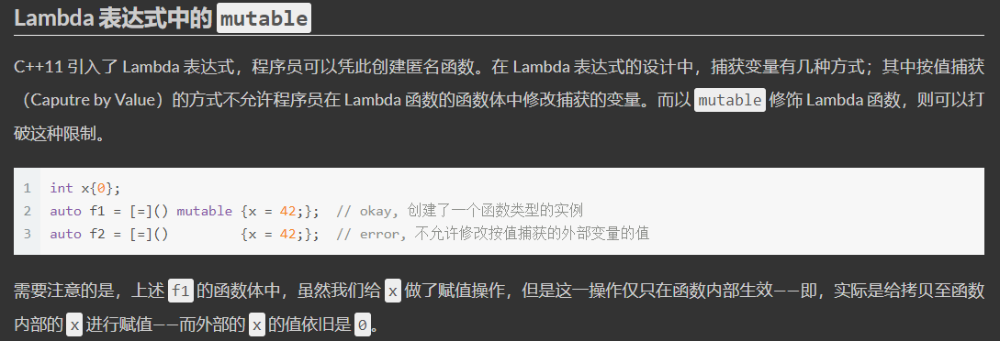

[TOC]

# 1. 基础概念

## 1.1 C++语言特点 / 编程的5种范式

- C++具有强大的抽象能力，融合着5种编程范式，即`面向过程、基于对象、面向对象、泛型和函数式`

1. 面向过程

   一组函数的顺序执行

2. 基于对象

   采用对象封装技术，将数据和操作捆绑在一起，但并没有使用继承、多态等面向对象技术进行软件设计

   一个 object-based（OB）设计可能会比一个对等的 OO 设计速度更快更紧凑。速度快是因为所有的函数调用操作都在编译时期解析完成，对象建构起来时不需要设置 virtual 机制；空间紧凑是因为每一个 class object 不需要负担传统上为了支持 virtual 机制而需要的额外负荷。但是，由于没有继承、多态机制，失去了部分弹性。

3. 面向对象

   面向对象程序设计的核心思想是数据抽象（封装）、继承和多态（动态绑定）

   * 数据抽象：把客观事物封装成抽象的类，同时将类的接口和实现分离。（优点：可以隐藏实现细节，使得代码模块化）
   * 继承：定义相似的类型，并对其相似关系建模。（优点：可以扩展已存在的代码模块）
   * 多态：一定程度上忽略相似类型的区别，以统一的方式使用它们的对象。

   面向对象设计的 5 大原则（SOLID）：

   - SRP(The Single Responsibility Principle) 单一职责原则：一个类应该有且只有一个去改变它的理由，这意味着一个类应该只有一项工作。
   - OCP(The Open Closed Principle) 开放封闭原则：对象或实体应该对扩展开放，对修改封闭，这就意味着一个类应该无需修改类本身但却容易扩展。
   - LSP(The Liskov Substitution Principle) 里氏替换原则：每一个子类或派生类应该可以替换它们的基类或父类。
   - ISP(The Interface Segregation Principle) 接口隔离原则：不应强迫客户端实现一个它用不上的接口，或是说客户端不应该被迫依赖它们不使用的方法。
   - DIP(The Dependency Inversion Principle) 依赖倒置原则：实体必须依靠抽象而不是具体实现。它表示高层次的模块不应该依赖于低层次的模块，它们都应该依赖于抽象。

4. 泛型

   泛型编程的核心活动是抽象：将一个特定于某些类型的算法中那些类型无关的共性抽象出来，比如，在STL的概念体系里面，管你是一个数组还是一个链表，反正都是一个区间，这就是一层抽象。管你是一个内建函数还是一个自定义类，反正都是一个Callable（可调用）的对象（在C++里面通过仿函数来表示），这就是一层抽象。泛型编程的过程就是一个不断将这些抽象提升出来的过程，最终的目的是形成一个最大程度上通用的算法或类。

   相对于基于**多态的面向对象抽象**而言，使用模版更加高效。因为面向对象的多态引入了间接调用，需要在**运行期**查找真正调用的函数，而模板可以直接利用**编译器的类型信息**，避免了间接调用。

5. 函数式编程

   函数式编程的主要思想是把运算过程尽量写成一系列嵌套的函数调用，每一个函数调用不依赖于外部的数据，而且也不改变外部数据的值，而是返回一个新的值。

   函数式编程具有五个鲜明的特点:

   1. 函数是`第一等公民`。所谓"第一等公民"（first class），指的是函数与其他数据类型一样，处于平等地位，可以赋值给其他变量，也可以作为参数，传入另一个函数，或者作为别的函数的返回值。
   2. 只用`表达式`，不用`语句`。表达式（expression）是一个单纯的运算过程，总是有返回值；语句（statement）是执行某种操作，没有返回值。函数式编程要求，只使用表达式，不使用语句。也就是说，每一步都是单纯的运算，而且都有返回值。
   3. 没有`副作用`。函数式编程强调没有"副作用"，意味着函数要保持独立，所有功能就是返回一个新的值，没有其他行为（最典型的情况，就是修改全局变量的值）。
   4. 不修改`参数`。函数参数是不可变的。
   5. `引用透明`（Referential transparency）。函数的运行不依赖于外部变量，只依赖于输入的参数，任何时候只要参数相同，引用函数所得到的返回值总是相同的。

## 1.2 声明还是定义？

- 变量声明用来引入标识符，并对它的类型（对象、函数等）进行说明，有了声明语句，**编译器**就可以理解对该标识符的**引用**，可以重复声明一个变量；
- 变量定义用来为变量分配存储空间，还可为变量指定初始值。可以将定义看做是对声明的变量进行实例化，**链接器**需要根据定义来找到变量具体对应的值，变量必须有且仅有一个定义。
- 重复定义会导致链接器不知道哪一个是需要的，编译器会报错：**redefinition of**。变量缺少定义链接器会因为**symbol(s) not found**链接失败。

## 1.3 左值还是右值？

- 左值与右值这两概念是从 c 中传承而来的，在 c 中，左值指的是既能够出现在等号左边也能出现在等号右边的变量(或表达式)，右值指的则是只能出现在等号右边的变量(或表达式)。
- 在 C 语言中，通常来说有名字的变量就是左值(如上面例子中的 a, b)，而由运算操作(加减乘除，函数调用返回值等)所产生的中间结果(没有名字)就是右值，如上的 3 + 4， a + b 等。可以认为**左值就是在程序中能够寻址的东西，右值就是没法取到它的地址的东西**。
- 如上概念到了 c++ 中，就变得稍有不同。具体来说，在 c++ 中，`每一个表达式或者是一个左值，或者是一个右值`，相应的，该表达式也就被称作“左值表达式"，"右值表达式"。对于内置的基本数据类型来说(primitive types)，左值右值的概念和 c 没有太多不同，不同的地方在于自定义的类型:
  - 对于内置的类型，右值是不可被修改的(non-modifiable)，也不可被 const, volatile 所修饰；
  - 对于自定义的类型(user-defined types)，右值却允许通过它的成员函数进行修改。
- C++ 中自定义类型允许有成员函数，而通过右值调用成员函数是被允许的，但成员函数有可能不是 const 类型，因此通过调用右值的成员函数，也就可能会修改了该右值。此外，**右值只能被 const 类型的 reference 所指向**，当一个右值被 const reference 指向时，它的生命周期就被延长了。

## 1.4 引用

编译器一般将引用实现为`const指针`，即指向位置不可变的指针，也就是说引用实际上与一般的指针同样占用内存，不过我们没有办法获得这个指针的地址。

当大型对象被传递给函数时，使用引用参数可使参数传递效率得到提高，因为引用并不产生对象的副本，也就是参数传递时，对象无须复制。有时甚至有的类类型（包括 IO 类型在内）根本不支持拷贝操作，只能用引用传递。

> 参考：1. https://github.com/selfboot/CS_Offer/tree/master/C++

## 1.5 sizeof运算符

sizeof 运算符返回`一条表达式或者一个类型名字所占的字节数`，sizeof 运算符满足右结合律，所得的值是一个 size_t 类型的常量表达式。sizeof 运算符的运算对象有两种形式：

1. sizeof *(type)*
2. sizeof *expr*

第二种形式中，返回的是表达式结果类型的大小（注意**，sizeof 并不实际计算其运算对象的值**）。

在 sizeof 的运算对象中解引用一个无效指针仍然是一种安全的行为，因为指针实际上并没有被真正使用，sizeof ==并不需要真的解引用指针也能知道它所指对象的类型==。这是一件可以在程序运行前==（`编译时`）==完成的事情，所以，==sizeof(*p)==直接就被==具体数字==给取代了，在==运行时==也就==不会==有了解引用这个表达式。

```c++
int i = 10;
printf("%d\n",i);                           // 10
// sizeof 并不计算 i++
printf("%d\n",sizeof(i++));                 // 4
printf("%d\n",i);                           // 10
```

sizeof 运算符的结果部分地依赖于其作用的类型：

* 对 char 或者类型为 char 的表达式执行 sizeof 运算，结果得 1；
* 对引用类型执行 sizeof 运算得到==被引用对象==所占空间的大小，但其实引用在内存空间会占用==4个字节的大小==；
* 对指针执行 sizeof 运算得到==指针本身==所占空间的大小；
* 对解引用指针执行 sizeof 运算得到指针指向的对象所占空间的大小，==指针不需要有效==；
* 对数组执行 sizeof 运算得到==整个数组所占空间==的大小，等同于对数组中==所有的元素==各执行一次 sizeof 运算并将所得结果==求和==。（sizeof ==不会把数组转换成指针==来处理，可以用数组的==大小除以单个元素的大小==得到数组中元素的个数）。
* 对 string 对象或 vector 对象执行 sizeof 运算==只返回该类型固定部分的大小（**24**）==，==不会计算对象占用了多少空间==；
* 对于 ==enum 类型==的变量，它保存的==枚举对象本身==并不是真的变量，它们只是类型安全的 #define，用来以可读的方式保存一串数字而已。编译器一般是用 ==int 类型的来保存一个 enum==，所以==sizeof 结果为 4==。

此外求==类的大小时==遵循下面规则（只统计与==类的实例==有关的，只与类型相关的不统计）：

1. 类的非静态成员数据的类型大小之和，也就是说==静态成员数据不作考虑==。
2. 普通成员函数与==sizeof无关==，调用普通成员函数只需要知道函数的地址即可，而这些地址只与类型相关，与类型的实例无关。
3. 虚函数由于要维护在虚函数表，所以要==占据一个指针大小==
4. 类的总大小也遵守类似 struct ==字节对齐==的调整规则
5. 空类的==大小为 1==（空类型的实例中不包含任何信息，但是声明空类的实例时，必须在内存中占有一定的空间，否则无法使用这些实例。占有空间数由==编译器决定，一般是1==）。

> 注意：
>
> 1. **以\0开头表示八进制数，如\065，但是\128只会区分12，strlen()是遇\0停止，不包含\0**
>
> 
>
> 2. **字符**
>
> 
>
> 3. **数组**
>
> 
>
> 退化成指针，所以为4
>
> 
>
> 审清题目，大小为2的char数组
>
> 4. **对于typedef与define 的区别：**
>
> https://www.cnblogs.com/kerwinshaw/archive/2009/02/02/1382428.html
>
> https://www.zhihu.com/question/29798061
>
> typedef是有作用域的，define是全局的
>
> ［[枚举类型，typedef 函数指针](http://www.nowcoder.com/questionTerminal/07684925aaaf4885ad574b2a2debe930)］  

## 1.6 内存对齐

许多实际的计算机系统对基本类型数据在内存中存放的位置有限制，它们会要求这些数据的首地址的值是某个数k（通常它为4或8）的倍数，这就是所谓的**`内存对齐**`。

每个特定平台上的编译器都有自己的默认**“对齐系数”**（32位机一般为==4==，64位机一般为==8==）。我们可以通过预编译命令==#pragma pack(k)==，k=1,2,4,8,16来改变这个系数，其中k就是需要指定的“对齐系数”；也可以使用==#pragma pack()==取消自定义字节对齐方式。

==struct 或者 union 成员==对齐规则如下：

1. 第一个数据成员放在offset为0的地方，每个成员按照对齐系数和自身占用字节数中，二者比较小的那个进行对齐；
2. 在数据成员完成各自对齐以后，struct或者union本身也要进行对齐，对齐将按照对齐系数和struct或者union中最大数据成员长度中比较小的那个进行；

先局部成员对齐，然后再全局对齐。此外，值得注意的是，**enum 内部是 int 实现的，所以大小为 4。用 typedef 声明指针时，并不为指针分配空间**。

［[结构体中 : 的含义](http://www.nowcoder.com/questionTerminal/f4e20747a2dd4649bac0c028daa234f4)］   ==重要，默认小端模式，从右往左放==

## 1.7 联合体、CPU字节序

**`联合体`：**在C/C++程序的编写中，当多个基本数据类型或复合数据结构要占用同一内存块时，就要用到联合体。联合体变量所占内存长度是各成员中最长的成员占的内存长度。union所有成员都从==低地址开始存放。==

**`Little endian`** 和 **`Big endian`** 是CPU 存放数据的两种不同顺序。对于整型、长整型等数据类型，==Big endian 认为第一个字节是最高位字节==（按照从低地址到高地址的顺序存放数据的高位字节到低位字节）；而==Little endian 则相反，它认为第一个字节是最低位字节==（按照从低地址到高地址的顺序存放数据的低位字节到高位字节）。

例如，假设从内存地址0x0000开始有以下数据：0x12 0x34 0xab 0xcd。如果我们去读取一个地址为 0x0000 的四个字节变量，若字节序为big-endian，则读出结果为0x1234abcd；若字节序位little-endian，则读出结果为 0xcdab3412。

一般来说，x86系列CPU 都是==little-endian 的字节序==，PowerPC通常是==Big endian==，还有的CPU 能通过跳线来设置CPU 工作于Little endian 还是Big endian 模式。

我们可以利用 union 的存储特点，写一个简单的程序来判定当前 CPU 的字节序

```c++
#include <iostream>
using namespace std;

bool checkCPU(){
    //如果是小端字节序，则return true，否则，return false
    union Test{
        int m;
        char c;
    } t;
   	t.m = 1;
    return (t.c == 1);
}

int main(){
    cout << (checkCPU() ? "Little endian" : "Big endian") << endl;
    
    //一个测试用例
    union Demo
    {
        char a[4];
        short b;
    };
    Demo d;
    d.a[0]=256;         // 0,    0000 0000
    d.a[1]=255;         // -1,    1111 1111
    d.a[2]=254;         // -2,    1111 1110
    d.a[3]=253;         // -3,    1111 1101

    /* short是2字节（a[0]和a[1]），
     * 由于80X86是小端模式，即数据的低位保存在内存的低地址中，而数据的高位保存在内存的高地址中
     * 在本例中，a[0]中存放的是b的低位，a[1]中存放的是b的高位，
     * 即b的二进制补码表示是：1111 1111 0000 0000，表示-256
     */
    cout << d.b << endl;

    return 0;
}
```

［[大小端，网络发送](http://www.nowcoder.com/questionTerminal/d7c1ff50fab44443b61903eccd791f1d)］ 

［[溢出，大小端](http://www.nowcoder.com/questionTerminal/c7298be0b2ce42698b80987631cf8fca)］  

## 1.8 类型转换

**类型转换**就是将给定类型的表达式转换为另一种类型。C++中的转型可分为两种：隐式类型转换和显式类型转换。

隐式类型转换是C中的遗留物，在C++中并不推荐使用（C++有专门的转型操作符，见下文的显式转型）。将某种类型的对象拷贝到另一种不同类型的对象中时就会发生隐式转型。比如异型赋值，返回值（函数声明的返回值与代码块实际返回值不同的情况下），按值传递异型参数等情况均会发生隐式类型转换。

```c++
short a = 128;
int b;
b = a;
```

short 类型的对象被赋值给 int 型的对象，这是C++语言内建支持的标准转换。隐式类型转换是件麻烦事，它们很可能导致错误或非预期的函数被调用（参看ME 条款5）。

因此应该尽量避免隐式类型转换，为此 C++ 提供了显式类型转换关键字：static_cast, const_cast, dynamic_cast 以及 reinterpret_cast。

**static_cast **

static_cast 很像 C 语言中的旧式类型转换。可以用于以下场景：

* 用于在存有继承关系的类之间的指针或引用的转换（即可将基类转换为子类，也可将子类转换为基类），把派生类的指针或引用转换成基类时是安全的；把基类指针或引用转换成派生类表示时，由于没有类型检查，所以是不安全的。
* 用于基本数据类型之间的转换，如把int转换成char，把int转换成enum。
* 把任何类型的表达式转换成void类型。
* 还能将 non-const 对象转换为 const对象（注意：反之则不行，那是const_cast的职责）。

如下示例：

```c++
class CBase {};
class CDerived: public CBase {};

double d = 3.14159265;
int i = static_cast<int>(d);

CBase *base = new CBase;
CDerived *derived = static_cast<CDerived *>(base);
```

==**static_cast 转换时并不进行运行时安全检查，所以是非安全的，很容易出问题。**==因此 C++ 引入 dynamic_cast 来处理==安全转型==。

 **dynamic_cast**

dynamic_cast 主要用来在继承体系中的**安全向下转型**。它能安全地将指向基类的指针转型为指向子类的指针或引用，并获知转型动作成功是否。

**dynamic_cast 只能用在指针和引用类型的转换中**，它是唯一进行运行期(runtime)检查的类型转换符，它的主要目的就是保证转换后的类型是一个完整类型(Complete type）。dynamic_cast在转换指针类型时，如果结果不是一个Complete Type, 它会返回NULL; dynamic_cast在转换引用类型时，如果结果不是一个Complete Type，它会抛出bad_cast的异常。dynamic_cast 会动用运行时信息 [RTTI](https://blog.csdn.net/ljianhui/article/details/46487951])来进行类型安全检查，因此 dynamic_cast 存在一定的效率损失。

```c++
class CBase { };
class CDerived: public CBase { };

int main(){
    CBase b;
    CBase* pb;
    CDerived d;
    CDerived* pd;
    pb = dynamic_cast<CBase*>(&d);     // ok: derived-to-base
    pd = dynamic_cast<CDerived*>(&b);  // error: base-to-derived
}
```

上面的代码最后一行会出错（error: 'CBase' is not polymorphic），==**因为dynamic_cast 只有在基类带有虚函数的情况下才允许将基类转换为子类**==。

```c++
class CBase
{
    virtual void dummy() { }
};

class CDerived : public CBase {
    int a;
};

int main()
{
    CBase *pba = new CDerived;
    CBase *pbb = new CBase;
    CDerived *pd1, *pd2;
    pd1 = dynamic_cast<CDerived *>(pba);
    pd2 = dynamic_cast<CDerived *>(pbb);
}
```

上面代码中的 pd1 不为 null,而 pd2 为 null。

**const_cast**

这个转换操作会操纵传递对象的const属性，或者设置或者移除该属性。

```c++
class C{}; 
const C* a = new C; 
C *b = const_cast(a);
```

**reinterpret_cast**

一个指针转化为其他类型的指针时，不做类型检测，操作结果是一个指针指向另一个指针的值的二进制拷贝；

```c++
class A{}; 
class B{}; 
A* a = new A;
B* b = reinterpret_cast(a);
```

reinterpret_cast 用来执行低级转型，如将执行一个 int 的指针强转为 int。其转换结果与编译平台息息相关，不具有可移植性，因此在一般的代码中不常见到它。

reinterpret_cast 常用的一个用途是转换函数指针类型，即可以将一种类型的函数指针转换为另一种类型的函数指针，但这种转换可能会导致不正确的结果。总之，reinterpret_cast 只用于底层代码，一般我们都用不到它，如果你的代码中使用到这种转型，务必明白自己在干什么。

C++中的reinterpret_cast主要是将数据从一种类型的转换为另一种类型。所谓“通常为操作数的位模式提供较低层的重新解释”也就是说将数据以**二进制**存在形式的重新解释。

［[虚函数继承类型转换](http://www.nowcoder.com/questionTerminal/5e5bb7214788436cb966e67305a8041e)］

## 1.9 If 判断语句

零值的比较

`bool`：根据布尔类型的语义，零值为“假”（记为FALSE），任何非零值都是“真”（记为TRUE）

    if (flag)  
    if (!flag)  

int 型变量：

    if (n == 0)  
    if (n != 0)  

float 型变量：浮点型变量并不精确，所以不可将float变量用“==”或“！=”与数字比较，应该设法转化成“>=”或“<=”形式。
    

    const float EPSINON = 0.00001;  
    if ((x>=-EPSINON) && (x<=EPSINON)) // EPSINON 是允许的误差（即精度） 

指针变量：

    if (p == NULL)  
    if (p != NULL)

以下是一些不良的风格：

    if (p == 0)        // 容易让人误解p是整型变量  
    if ( n )              // 会让人误解 n 是布尔变量 
    if (x == 0.0)   // 错误的写法

不良风格很多都能通过编译，但是语句并不能很好的表达与零值进行比较的逻辑依据。

［[相等判断语句](http://www.nowcoder.com/questionTerminal/230d0664d5104b73b4c9b4fa51c5e735)］

##  1.10逗号运算符

C++ 提供一种特殊的运算符，逗号运算符，它的优先级别最低。

    表达式1，表达式2，表达式3，...... ，表达式n

逗号表达式的特点：

1. 逗号表达式的运算过程为：从左往右逐个计算表达式。
2. 逗号表达式作为一个整体，它的值为==最后一个表达式（也即表达式n）的值==。
3. 逗号运算符的优先级别在==所有运算符中最低==。

（3+5，6+8）的值是14，（`a=3*5,a*4`）的值是60，原因在于赋值运算优先级高于逗号表达式。

下列程序的结果为

    int x,y,z;
    x=y=1;
    z=x++,y++,++y;
    printf("%d,%d,%d\n",x,y,z); // 2,3,1
    
    int a,b;
    b=(a=1,a+1,a++);
    printf("%d,%d\n",a,b)；// 2,1

［[逗号表达式的值](http://www.nowcoder.com/questionTerminal/5971372060a24eac874d43b830864189)］

# 2. 关键字

关键字(keyword)又称保留字，是整个语言范围内预先保留的标识符。每个C++关键字都有特殊的含义。经过预处理后，关键字从预处理记号(preprocessing-token)中区别出来，剩下的标识符作为记号(token)，用于声明对象、函数、类型、命名空间等。

## 2.1 const

欲阻止一个变量被改变，可以使用const关键字。在定义该const变量时，通常需要对它进行初始化，因为以后就没有机会再去改变它了。

const只是在==`编译期的保护`==，编译期会检查const变量有没有被修改，如果有代码尝试修改一个const变量，编译器就会报错。但是由于const修饰的既然是变量，就有存储空间，我们可以通过==地址修改空间==里的值，这样还是可以改变的，也就是说const在一定程度上在编译期间使该变量变成了一个常量，然而它并没有实现保证该变量在==运行期间内存中的值不被修改==。

更多特点如下：

1. const 的引用，对常量的引用不能用作修改它绑定的对象，但是由于对象本身可能是非常量，所以允许通过其他途径改变值。
2. 对指针来说，可以指定指针本身为常量（const pointer, `常量指针`），也可以指定指针所指的对象为常量（pointer to const, `指向常量的指针`），或二者同时指定为const；
3. 在一个函数声明中，const可以修饰形参，表明它是一个输入参数，在函数内部不能改变其值；
4. 对于类的成员函数，有时候必须指定其返回值为==const类型==，以使得其返回值==不为“左值”==（返回值是引用类型时，是可以作为左值使用的，一般用于操作符重载）。
5. 对于类的成员函数，可以用const关键字来说明这个函数是 "只读(read-only)"函数，不会修改任何数据成员。为了声明一个const成员函数，把const关键字放在函数括号的后面。

［[改变 const 变量的值](http://www.nowcoder.com/questionTerminal/36f828664d2d4d14a1428ae49f701f23)］常量折叠现象（发生在==编译期==）

> 

const 可以分为 `顶层const` 和 `底层const`，顶层const可以表示任意的对象是常量，这一点对任何数据类型都适用，如算术类型、类指针等。底层 const 则与指针或者引用等复合类型的基本类型部分有关。比较特别的是，指针既可以是顶层 const 又可以是底层 const。

```c++
int i=0;
const int ci = 42;  // 不能改变 ci 的值，是顶层 const;
int* const p1 = &i; // 不能改变 p1 的值，是顶层 const;
const int *p2 = &ci;// 允许改变 p2 的值，是底层 const;
const int *const p3 = p2;// 前一个const底层，后一个顶层
const int &r = ci;  // 用于声明引用的都是 底层 const
```

在执行==对象的拷贝动作==时，常量是顶层const 时不受影响。拷贝执行操作并不会改变被拷贝对象的值，因此拷入和拷出的对象是否是常量都没什么影响。另一方面，==**底层 const 的限制不能忽视**==，当执行拷贝操作时，拷入和拷出的对象必须具有==相同的底层 const 资格==，或者两个对象的数据类型必须能够转换。一般来说，**非常量可以转换为常量**，反之则不行，如下：

```c++
int tmp = 88;           // 顶层 const
const int * pp = &tmp;  // 底层const
// int *p = pp;         // pp 包含底层 const 的定义, 而 p 没有
```

上面例子中如果允许*p = pp，那么就可以通过 p 改变 pp 所指对象的值，这样 pp 就失去了底层 const 的约束。

## 2.2 static

《C和指针》中说static有两层含义：`指明存储属性；改变链接属性`。（1）全局变量（包括函数）加上static关键字后，链接属性变为internal，也就是将他们限定在了本作用域内；（2）局部变量加上static关键字后，存储属性变为静态存储，不存储在栈区，下一次将保持上一次的尾值。

C 面向过程程序设计中的static：

1. **静态局部变量**。在函数体内，一个被声明为静态的变量在这一函数被调用过程中维持上一次的值不变，即只初始化一次（该变量存放在.bss 或者 .data 区，而不是栈区）。
2. **静态全局变量**。在模块内（但在函数体外），一个被声明为静态的变量可以被模块内函数访问，但不能被模块外访问。（注：模块可以理解为文件）。这样其它文件中可以定义相同名字的变量，不会发生冲突。
3. **静态全局函数**。在模块内，一个被声明为静态的函数只可被这一模块内的其它函数调用。那就是，这个函数被限制在声明它的模块的本地范围内使用。

关于静态局部变量的存放位置，下面是一个不错的解释：

> Where your statics go depends on if they are 0 initialized or not. 0 initialized static data goes in .BSS (Block Started by Symbol), non 0 initialized data goes in .DATA 

关于静态全局变量和静态全局函数，下面是不错的解释：

> The whole and entire purpose of static is to declare that a variable is private to the source file that it is declared in. Thus, it is doing precisely its job in preventing a connection from an extern.  It is not visible to externs in other files, and you can have many different files that all declare static TYPE blah;, and they are all different.

简单来说，对于static 的全局变量，它对链接器不可以见，所以这个变量只能在当前文件中使用。下面是一个简单的例子，分别在两个文件里面都定义了全局变量num，结果会导致重复定义：

    $ cat test_1.cpp
    int num = 5;
    $ cat test_2.cpp
    #include <stdio.h>
    
    int num = 2;
    
    int main(void) {
        printf("num = %d\n", num);
        return 0;
    }
    $ g++ test_1.cpp test_2.cpp -o test_2.o
    duplicate symbol _num in: 
    ...
    clang: error: linker command failed with exit code 1 (use -v to see invocation)

将其中任意一个（当然，两个全部改也可以） num 改为 static 全局变量，则没有问题。

C++面向对象程序设计中的static：

* **静态成员变量：**在类中的static成员变量意味着它为该类的所有实例所共享，也就是说当某个类的实例修改了该静态成员变量，其修改值为该类的其它所有实例所见；
* **静态成员函数：**在类中的static成员函数属于整个类所拥有，这个函数==不接收this指针==，因而==只能访问类的static成员变量==(当然，可以通过==传递一个对象来访问其成员==)。

在类成员的声明之前加上关键字 static 使得成员与类本身直接相关，而不是与类的各个对象保持关联。和其他成员一样，静态成员可以是 public 或 private 的，静态数据成员的类型可以是常量、引用、指针、类类型等。类的静态成员存在于任何对象之外，==对象中不包含任何与静态数据成员有关的数据==。

## 2.3 extern

简单来说，extern可以置于==变量或者函数前==，以标示变量或者函数的==定义在别的地方==。

extern 可以用于==`提前引用声明`==：如果全局变量不在文件的开头定义，其生命周期只限于定义处到文件结尾。如果在变量定义之前的函数想引用该全局变量，则应该在引用之前用关键字extern对该变量作外部变量声明，如下：

    extern int global;
    void show(){
        cout << global << "\n";
    }
    
    int global = 10;
    int main(){
        show();
        return 0;
    }

一个更加一般和常见的用法是在==多文件的程序中声明外部变量==。如果一个程序包含两个文件，在两个文件中都要用到同一个外部变量num，不能在两个文件中各自定义一个外部变量num（变量==只能被定义一次==）。正确的做法是：在任一个文件中==定义外部变量num==，而在另一文件中用==extern对num作外部变量声明==。

    $ cat test_1.cpp
    int num = 5;
    $ cat test_2.cpp
    #include <stdio.h>
    
    extern int num;
    
    int main(void) {
        printf("num = %d\n", num);
        return 0;
    }
    $ g++ test_1.cpp test_2.cpp -o test_2.o
    $ ./test_2.o
    num = 5

背后的工作机制如下：编译系统在遇到 extern int num 时，了解到num是一个在别处定义的全局变量，它==先在本文件中找全局变量num==，如果有，则将其作用域扩展到本行开始；如果本文件中无此全局变量，则==在程序链接时==从其他文件中找全局变量num，如果有，则把==在另一文件中定义的外部变量num的作用域扩展到本文件==，然后在本文件中可以合法地引用该外部变量num。

在大型项目中，如果有许多个文件要用到共同的全局变量可以==将其放置在一个专门的头文件中==，然后在其中==一个源文件定义变量==，在==其他的源文件中使用该变量==。

## 2.4 extern "C"

`函数名修饰机制`

作为一种面向对象的语言，C++支持==函数重载==，而过程式语言C则不支持。函数被C++编译后在==symbol库==中的名字与C语言的==不同==，假设某个函数的原型为：    

    void foo(int x, int y);   

该函数被C编译器编译后在symbol库中的名字为_foo，而C++编译器则会产生像_foo_int_int之类的名字。_foo_int_int这样的名字包含了函数名和函数参数数量及类型信息，C++就是==靠这种机制来实现函数重载的==。   

为了实现C和C++的混合编程，C++提供了C连接交换指定符号==`extern "C"`来解决名字匹配问题==，函数声明前加上extern "C"后，则编译器就会按照==C语言的方式将该函数编译为_foo==，这样C语言中就可以调用C++的函数了。

extern "C"用法如下：

    extern "C"{
        int func(int);
        int var;
    }

C++编译器会将在extern "C" 的大括号内部的代码当作==C语言代码处理==。所以很明显，上面的代码中，C++的名称修饰机制将不会起作用。它声明了一个C的函数func，定义了一个整型全局变量var。

## 2.5 volatile

volatile 关键字是一种==类型修饰符==，用它声明的类型变量表示==**编译器对访问该变量的代码就不再进行优化，从而可以提供对特殊地址的稳定访问**==。
    
volatile 指出==变量是随时可能发生变化的，每次使用的时候必须从它所在的内存地址中读取==，即使它前面的指令刚刚从该处读取过数据，而且读取的数据立刻被保存。而优化做法是，由于编译器发现两次读数据之间程序没有对变量进行过操作，它会自动使用上次读的数据。这样一来，如果是一个寄存器变量或者一个`端口数据`就会出错（它们的值由程序直接控制之外的过程控制），所以说volatile可以保证对==特殊地址的稳定访问==。

volatile 关键字==不能保证全局变量多线程安全==，因为 volatile 仅仅是告诫 compiler 不要对这个变量作优化，每次都要==从 memory 取数值，而不是从register==。

## 2.6 inline

内联机制用于==优化规模较小、流程直接、频繁调用的函数==，因为调用函数一般比求等价表达式的值要慢一些。在大多数机器上，一次函数调用包括：==调用前保存寄存器并在返回时恢复，可能需要拷贝实参等==。

inline函数背后的整体观念就是，将对此函数的每一个调用都以函数本体替换之。这通常是在==编译时期==完成的，但是需要注意的是**inline只是对编译器发出的==一个请求==，编译器可以选择忽略这个请求**。inline 可以是显式，也可以隐式，class ==内部定义的函数被隐式的声明为 inline== 。

inline函数可以调用又不至于导致函数调用的开销，但是仍有一些弊端。比如==导致代码膨胀==，进而造成额外的换页行为，降低指令高速缓存装置的命中率，以及伴随而来的效率损失。

此外，有时候编译器虽然愿意 inlining 某个函数，但还可能为该函数生成一个函数本体。比如如果程序要取某个 inline 函数的地址，编译器必须为此==函数生成一个本体==，比如虚函数和递归函数。

**内联函数的==定义最好是放在头文件中==**，这样每一个包含该头文件的源文件均可以在==编译期==将调用该内联函数的代码展开。如果仅仅在头文件中声明内联函数，而在一个源文件中定义该函数，那么只有定义它的那个源文件可以在编译期展开内联函数。（这和模版类，函数模版的定义放在头文件中是基于同样的原理。）

[inline 函数的观点](http://www.nowcoder.com/questionTerminal/0cd6af2fd4374df597b49e09302b1a5a)  

## 2.7 typedef

C++中，可以给一个合法的类型起一个别名

用以下句子：

```C++
typedef existing_type new_type_name;
```

其中 existing_type 可以是简单的基本类型，也可以是混合类型（比如 int *[]），new_type_name 是这个类型的一个标识符。如下例子：

```C++
typedef unsigned int WORD;
typedef char * pChar;
typedef char field [50];   // 合法的
```

c++ 11 中也可以使用关键字 using 来进行类型别名的声明，上面类型别名也可用下面语句来进行声明（它们在语义上是对等的）：

```C++
using WORD = unsigned int;
using pChar = char *;
using field = char [50]; 
```

当定义一个函数指针时，typedef 用法稍微不同，

```C++
// pFun 为函数 int(int, char * ) 的指针
typedef int (* pFun )(int, char* );
using pFun = int(*)(int, char *); 
```

此外，要注意 typedef 并不同于 define 那样做简单的文本替换，而是**类型别名**，看下面的两个例子。

```C++
typedef int *pt;    	  
const pt a;     // a 是常量指针(pt是指针，前面加 const，说明是const pointer)
int * const a;  // 等同于上一句  
pt c, d;        // cd 都是 int * 类型的
```

## 2.8 register

一般情况下，变量的值是存放在内存中的。当程序中用到哪一个变量的值时，由控制器发出指令将内存中该变量的值送到CPU中的运算器。经过运算器进行运算，如果需要存储，再从运算器将数据送到内存存放。

为提高执行效率，C++允许将局部变量的值放在CPU中的寄存器中，需要用时直接从寄存器取出参加运算，不必再到内存中去存取。这种变量叫做寄存器变量，用关键字register作声明。

```C++
int fac(int n)
{
   register int i,f=1; //定义i和f是寄存器变量
   for(i=1;i<=n;i++) f=f*i;
   return f;
}
```

定义f和i是存放在寄存器的局部变量，如果n的值大，则能节约许多执行时间。不过要注意在程序中**定义寄存器变量对编译系统只是==建议性(而不是强制性)的==**。此外，现在的优化编译系统能够识别使用频繁的变量，==自动地==将这些变量放在寄存器中。

## 2.9 explicit

> The [explicit specifier](http://en.cppreference.com/w/cpp/language/explicit) specifies that a constructor or **conversion function** (since C++11) doesn't allow **implicit conversions** or **copy-initialization**. 

复制初始化（[copy initialization](http://en.cppreference.com/w/cpp/language/copy_initialization)）是指用一个对象来初始化另一个对象。主要分下面六种情况：

* T object = other;  用`=操作符`声明一个非引用对象。
* T object = {other};  C++ 11 中的列表初始化。
* f(other);  向函数按照值传递传参数。
* return other;   函数返回一个值。
* throw object; catch (T object); throw 或者 catch 一个意外值。
* T array[N] = {other}; 

有时候在需要类型 T2 的地方，我们给了类型 T1，并且没有显式地进行类型转换。这时候可能就用到了**隐式类型转换**（[Implicit conversions](http://en.cppreference.com/w/cpp/language/implicit_conversion)），编译器在背后默默地将==T1 转换为 T2==（编译器背着程序员做了太多的事情）。

关键字的使用详情可以参考下面：

```c++
struct A
{
    A(int) { }      // converting constructor
    A(int, int) { } // converting constructor (C++11)
    operator bool() const { return true; }
};

struct B
{
    explicit B(int) { }
    explicit B(int, int) { }
    explicit operator bool() const { return true; }
};

int main()
{
    A a1 = 1;      // OK: copy-initialization selects A::A(int)
    A a2(2);       // OK: direct-initialization selects A::A(int)
    A a3 {4, 5};   // OK: direct-list-initialization selects A::A(int, int)
    A a4 = {4, 5}; // OK: copy-list-initialization selects A::A(int, int)
    A a5 = (A)1;   // OK: explicit cast performs static_cast
    if (a1) cout << "true" << endl; // OK: A::operator bool()
    bool na1 = a1; // OK: copy-initialization selects A::operator bool()
    bool na2 = static_cast<bool>(a1); // OK: static_cast performs direct-initialization

//  B b1 = 1;      // error: copy-initialization does not consider B::B(int)
    B b2(2);       // OK: direct-initialization selects B::B(int)
    B b3 {4, 5};   // OK: direct-list-initialization selects B::B(int, int)
//  B b4 = {4, 5}; // error: copy-list-initialization does not consider B::B(int,int)
    B b5 = (B)1;   // OK: explicit cast performs static_cast
    if (b5) cout << "true" << endl; // OK: B::operator bool()
//  bool nb1 = b2; // error: copy-initialization does not consider B::operator bool()
    bool nb2 = static_cast<bool>(b2); // OK: static_cast performs direct-initialization
}
```

## 2.10 final

C++ 11 中引入了final关键字，用来==阻止类的进一步派生和虚函数的进一步重载==。

> Specifies that a virtual function cannot be overridden in a derived class or that a class cannot be inherited from.

看一个简单的例子：

```c++
struct Base
{
    virtual void foo();
};
 
struct A : Base
{
    virtual void foo() final; // A::foo is final
    void bar() final; // Error: non-virtual function cannot be final
};
 
struct B final : A // struct B is final
{
    void foo(); // Error: foo cannot be overridden as it's final in A
};
 
struct C : B // Error: B is final
{
};
```

## 2.11 override

一个派生类可以覆盖在基类中声明的虚函数，这是面向对象设计的基础。然而这么简单的操作也会出错，关于覆盖虚函数的两个常见错误如下： 

* ==`无意中覆盖`==：派生类不小心实现了一个和基类名字和参数列表相同的虚函数。
* ==`签名不匹配`==：本来要覆盖基类的虚函数，结果导致产生了一个新的函数。

使用 override 可以避免这两个问题。因为 override 明确告诉编译器该函数==覆盖了基类中的虚函数==，任何违反了这一语义的实现编译器都将显式地给出错误提示。

> In a member function declaration or definition, override ensures that the function is virtual and is overriding a virtual function from the base class. The program is ill-formed (a compile-time error is generated) if this is not true.

看一个简单的例子：

```c++
struct A
{
    virtual void foo();
    void bar();
};
 
struct B : A
{
    void foo() const override; // Error: B::foo does not override A::foo
                               // (signature mismatch)
    void foo() override; // OK: B::foo overrides A::foo
    void bar() override; // Error: A::bar is not virtual
};
```

编译器实现 override 的方法很简单，如下：

> The override special identifier means that the compiler will check the base class(es) to see if there is a virtual function with this exact signature. And if there is not, the compiler will error out.

不过注意 override 和 final 一样，==不是C++保留字==：

> Note that neither override nor final are language keywords. They are technically identifiers; they only gain special meaning when used in those specific contexts. In any other location, they can be valid identifiers.

## 2.12 new 操作符

new和delete对堆中的内存进行申请和释放，而且这两个操作符是不能被重载的。要实现不同的内存分配行为，需要重载operator new，而不是new和delete。

看如下代码：

    class foo{};
    foo* pfoo = new foo;

这里的new实际上是执行如下3个过程：

1. 调用operator new分配内存；
2. 调用构造函数生成类对象；
3. 返回相应指针。

operator new 就像 operator + 一样，是可以重载的，但是不能在全局对原型为void operator new(size_t size)这个原型进行重载，一般只能在类中进行重载。

如果类中没有重载operator new，那么调用的就是全局的::operator new来完成堆的分配。同理，operator new[]、operator delete、operator delete[]也是可以重载的。

new 操作符分配内存需要在堆中查找足够大的剩余空间，这个操作速度是很慢的，而且有可能出现无法分配内存的异常（空间不够）。

# 3. 类和对象

## 3.1 构造／析构／赋值运算

当我们定义一个空类时，C++ 编译器会默认为它合成 `默认构造函数，copy构造函数，赋值操作符和一个析构函数`。因此，如果我们写下：

    class Empty(){};

这就好像写下这样的代码：

```C++
class Empty {
public:
    Empty() { ... }
    Empty(const Empty& rhs) { ... }
    ~Empty() { ... }
    Empty& operator=(const Empty& rhs) { ... }
};
```

不过要注意以下几点：

1. 只有==在被编译器需要的时候，它们才会被`编译器`创建==，被合成出来的默认构造函数只==执行编译器所需的行动==。（详细见 ==《深度探索 C++ 对象模型》 第2章==）；
2. 这些函数都是==public==的；
3. 这些函数都是==inline==的（即函数定义在类的定义中）
4. 如果显式地声明了其中一个函数，那么编译器将不再生成默认的函数。特别需要注意的是**自定义的拷贝构造函数不仅会覆盖默认的拷贝构造函数，也会覆盖默认的构造函数**。
5. 对于拷贝构造函数和赋值操作符来说，编译器创建的版本只是单纯地将源对象的每一个 non-static 数据成员拷贝到目标对象中。
6. 赋值操作符函数的行为与拷贝构造函数的行为基本是相同的，但是编译器生成赋值操作符函数是有条件的，如果会产生无法完成的操作，编译器将拒绝产生这一函数。
7. 编译器生成的==拷贝构造函数和赋值操作符==都执行==`浅拷贝操作`==。当类里面有指针时，最好根据需要写执行==深拷贝操作的拷贝构造函数和赋值操作符函数==。

另外，还存在两种默认的函数：就是取地址运算符和取地址运算符的const版本，这两个函数在《Effective C++》中没有提及。

    Empty* operator&() { ... }
    const Empty* operator&() const { ... }

所以即使定义一个空类，下面的代码也是可以运行的：

    Empty a;
    const Empty *b = &a;
    printf("%p\n", &a);     //调用取地址运算符
    printf("%p\n", b);      //调用const取地址运算符

［[声明对象的坑](http://www.nowcoder.com/questionTerminal/95581302aa714466bc766bc51b5524fc)］

## 3.2 赋值还是构造

在面向对象程序设计中，对象间互相拷贝是经常进行的操作，那么调用的到底是拷贝构造函数还是赋值操作符呢？有一个简单的判定规则：

* 左值对象已经存在的话调用的是赋值操作符，
* 左值对象在当前语句第一个出现，那么调用拷贝构造函数。

还要注意函数形参不是引用时，会调用对象的拷贝构造函数，生成一个临时的形参对象，到函数结尾，会自动销毁。函数返回非引用对象时，也会**调用拷贝构造函数创建一个对象返回，该对象是一个额外的参数，引用类型**。

［[拷贝构造还是赋值](http://www.nowcoder.com/questionTerminal/cf1a3145d1b946c1861c9d10b8629665)］

## 3.3 构造函数与析构函数

派生类构造函数调用顺序如下：

1. 基类构造函数。如果有多个基类，则构造函数的调用顺序是基类在==类派生表中出现的顺序==。
2. 若派生类中包含对象成员，还要进行==对象成员初始化==。如果有多个成员类对象则构造函数的调用顺序是对象在==类中被声明的顺序==。
3. 派生类构造函数。

析构函数正好和构造函数相反。

关于异常抛出问题：

1. ==不建议在构造函数中抛出异常==。构造函数抛出异常时，析构函数将不会被执行，==需要手动的去释放内存==；
2. **析构函数不应该抛出异常**。当析构函数中会有一些可能发生异常时，那么就必须要把这种可能发生的异常完全封装在析构函数内部，==决不能让它抛出函数之外==。因为**如果对象抛出异常了，异常处理模块为了维护系统对象数据的一致性，避免资源泄露，有必要调用析构函数释放资源**，这时如果析构过程又出现异常，那么谁来保证新对象的资源释放呢？前面的异常还没处理完又来了新的异常，这样可能会陷入无限的递归嵌套中。所以，从析构函数抛出异常，C++运行时系统会处于无法决断的境遇，因此C++语言担保，当处于这一点时，会调用 terminate()来杀死进程。

［[构造函数中调用虚函数](http://www.nowcoder.com/questionTerminal/adb540e6222b401eb294b093b9fc6f0e)］  
［[构造函数调用次数](http://www.nowcoder.com/questionTerminal/bf70aadeb78949c2a61b1b561a0ee784)］  
［[析构的顺序](http://www.nowcoder.com/questionTerminal/ad46fe08266341b694d2ab8a78aa071f)］  
［[析构函数调用delete](http://www.nowcoder.com/questionTerminal/2dc097fd196343f88d7efde6e9447f91)］  

## 3.4 禁止对象产生在堆（栈）中

一般情况下，编写一个类，是可以在栈或者堆分配空间。但有些时候，你想编写一个只能在栈或者只能在堆上面分配空间的类。例如说在嵌入式系统中工作，为了保证不发生内存泄漏，最好保证没有任何一个类型的对象可以从 heap 中分配出来。

在C++中，类的对象建立分为两种，一种是静态建立，如A a；另一种是动态建立，如 A* ptr=new A；这两种方式是有区别的。

1. 静态建立类对象：是由编译器为对象在==栈空间中分配内存==，是通过直接移动栈顶指针，挪出适当的空间，然后在这片内存空间上==调用构造函数==形成一个栈对象。使用这种方法，==直接调用类的构造函数==。
2. 动态建立类对象，是使用new运算符将对象建立在堆空间中。这个过程分为两步，第一步是执行==operator new()函数==，在堆空间中搜索合适的内存并进行分配；第二步是==调用构造函数构造对象==，初始化这片内存空间。这种方法，==间接调用类的构造函数==。

### 禁止对象建立在栈上

考虑当对象建立在栈上面时，由编译器分配内存空间，调用==构造函数==来构造栈对象。当对象使用完后，编译器会调用析构函数来释放栈对象所占的空间，==编译器==管理了对象的整个生命周期。`如果编译器无法调用类的析构函数，情况会是怎样的呢？`比如，类的析构函数是私有的，编译器无法调用析构函数来释放内存。所以，编译器在为类对象分配栈空间时，会先检查类的析构函数的访问性，`如果类的析构函数是私有的，则==编译器不会在栈空间上为类对象分配内存==`。

> 只能在堆上分配类对象，就是不能静态建立类对象，可以通过将类的析构函数设为 private 来达到目的。

如下面的类 A：

    class A
    {
    	public:
        	A(){}
        	void destory(){delete this;}
    	private:
        	~A(){}
    };  

如果使用A a; 来建立对象，编译报错，提示析构函数无法访问。但是可以使用new 操作符来建立对象，构造函数是公有的，可以直接调用。此外，类中==必须提供一个destory函数，来进行内存空间的释放==。堆对象使用完成后，必须调用destory函数。

但是上面方法有以下缺点：

1. ==`无法解决继承问题`==。如果A作为其它类的基类，则析构函数通常要设为virtual，然后在子类重写，以实现多态。因此析构函数不能设为private。
2. ==`类的使用方法不统一`==，使用new建立对象，却使用destory函数释放对象，而不是使用delete。（使用delete会报错，因为delete对象的指针，会调用对象的析构函数，而析构函数类外不可访问）

还好C++提供了第三种访问控制，protected。将析构函数设为protected可以有效解决继承问题，使得类外无法访问protected成员，子类则可以访问。

为了统一类的使用方式（不要 new 和 destroy 搭配），可以将构造函数设为protected，然后提供一个public的static函数来完成构造，这样不使用new，而是使用一个函数来构造，使用一个函数来析构。代码如下：

    class A
    {
    protected:
        A(){}
        ~A(){}
    public:
        static A* create()
        {
            return new A();
        }
        void destory()
        {
            delete this;
        }
    };

这样，可以像下面这样在堆上创建、销毁对象：

    A *a = A::create();
    a->destory();

### 禁止对象产生在堆上

只有使用 new 运算符，对象才会建立在堆上，因此，只要禁用new运算符就可以实现类对象只能建立在栈上。虽然不能影响new运算符的能力（因为是C++语言内建的），但是可以利用一个事实：new运算符总是先调用 operator new，而后者我们是可以自行声明重写的。因此，==`将operator new()设为私有即可禁止对象被new在堆上`==。

```c++
class A
{
private:
    void* operator new(size_t t){}     // 注意函数的第一个参数和返回值都是固定的
    void operator delete(void* ptr){}  // 重载了new就需要重载delete
public:
    A(){}
    ~A(){}
};
```

［[只能new创建对象](http://www.nowcoder.com/questionTerminal/9ca9a4991164463b90b6ba0fef227030)］

### 构造函数初始值列表

定义变量时习惯对其初始化，而非先声明、再赋值。

```c++
string foo = "Hello";   // 定义并初始化
string bar;             // 默认初始化为空 string 对象
bar = "Hello";          // 为 bar 赋一个新值
```

就对象的数据成员来说，如果没有在构造函数的初始化列表中显式地初始化成员，则该成员在构造函数之前执行默认初始化，在构造函数中进行的是赋值操作。**但是如果成员是 const 或者引用的时候，或者成员属于某种类类型且该类没有定义默认构造函数**时，`必须`进行初始化。

```c++
class ConstRef{
public:
    // 正确, 使用构造函数初始化列表显式地初始化引用和 const 成员.
    ConstRef(int num):const_i(num), ref_j(num){}
    /*
    ConstRef(int num){
        const_i = num;  // 错误,不能给 const 赋值
        ref_j = num;    // 错误, ref_j 没有初始化
    }
    */
private:
    const int const_a = 0;
    const int const_i;
    int &ref_j;
};
```

**构造函数初始值列表只说明用于初始化非静态成员的值**，而不限定初始化的具体执行顺序。成员的初始化顺序与它们`在类定义中的出现顺序一致`，第一个成员先被初始化，然后第二个，以此类推。如果一个成员是用另一个成员来初始化的，那么两个成员的初始化顺序就很关键了！（可能的话，**尽量避免使用某些成员初始化其他成员**）。

［[初始化顺序](http://www.nowcoder.com/questionTerminal/fb01e2436c6d453abbbf9801f794165b)］  
［[类定义static与const](http://www.nowcoder.com/questionTerminal/5ab084ff358e43f392833dbcd2963872)］  
［[必须通过构造函数初始化列表的变量](http://www.nowcoder.com/questionTerminal/da5c9884bc824b72a345c8fdfb53b79b)］  

## 3.5 数据成员与成员函数

### 数据成员

类的成员变量（数据成员）和普通变量一样，也有数据类型和名称，占用固定长度的内存空间，一般有以下几种成员变量：

* 普通变量：可以在构造函数中进行赋值，也可以在构造函数的初始化列表中进行初始化。
* 静态变量（static）：属于类所有，而不属于类的对象，因此不管类被实例化了多少个对象，该变量都只有一个。
* 常量变量（const）：需要进行类内进行初始化，可以在定义时初始化，或者在构造函数的初始化列表中进行。
* 引用型变量：和const变量类似，需要在类内进行初始化。
* static const integral 变量：对于既是const又是static 而且还是整形变量，可以直接在类的定义中初始化。short可以，但float的不可以哦。（short可以，但float的不可以）

static const integral 变量的示例如下：

```c++
class A{
public:
    static const int a=1;
    static const int b;
    // non-const static data member must be initialized out of line
    // static int c = 3;
    static int d;
    static const float e;
    // static const float f=1;
};

const int A::b = 2;
int A::d = 4;
const float A::e = 5;
```

特别注意的是在继承的时候，允许子类存在与父类同名的成员变量，但子类会隐藏父类的该成员变量，但是并不覆盖父类的成员变量，他们==同时存在==。 

［[派生类重复定义基类数据成员](http://www.nowcoder.com/questionTerminal/ade233b99dfc4f03aba0335f9f2a3f35)］  

### 类的静态成员

在类成员的声明之前加上关键字 static 使得成员与类本身直接相关，而不是与类的各个对象保持关联。和其他成员一样，静态成员可以是 public 或 private 的，静态数据成员的类型可以是常量、引用、指针、类类型等。类的静态成员存在于任何对象之外，对象中不包含任何与静态数据成员有关的数据。

类的静态数据成员不属于类的任何一个对象，所以它们==不是在创建类的对象时被定义的==，也就是说不是由类的构造函数初始化的（==**不能用构造函数初始化静态数据成员**==）。通常情况下，类的静态成员不应该在类的内部初始化，==必须在类的`外部定义和初始化`每个静态成员==。一种例外情况是，为静态数据成员提供 ==const 整数类型的类内初始值==。**不过即使是 static const ==也不能用构造函数初始化列表==来进行初始化**，这是因为：

1. static属于类，它在未实例化的时候就已经存在了，而构造函数的初始化列表，只有在实例化的时候才执行。
2. static成员==不属于对象==。我们在调用构造函数==自然是创建对象==，一个跟对象没直接关系的成员要它做什么呢。

类似的，静态成员函数==也不与任何对象绑定在一起==，==不包含 this 指针==。`静态成员函数不能声明为 const 的（本来就不会去改变对象的值，所以没有必要定义为const），而且不能在 static 函数体内使用 this 指针`。既可以在类的内部定义静态成员函数，也可以在外部定义静态成员函数。在类的外部定义静态成员函数时，不能重复关键字 static。

虽然类的静态成员不属于类的某个对象，但我们仍可以使用类的对象、引用或者指针来访问静态成员。

静态成员可以应用于某些普通成员不能应用的场景：

1. 静态数据成员可以是==不完全类型==，甚至可以是它所属的类类型。而非静态数据成员则受到限制，==只能声明成它所属类的指针或引用==；
2. 可以使用==静态数据成员==作为默认实参。普通数据成员不能作为默认实参，因为它的值本身属于对象的一部分。

### 成员函数

成员函数也可以被重载，只要满足重载的要求，即==`同一个作用域内`的几个`函数名字相同`但`形参列表`不同==，成员函数的 virtual 关键字可有可无。

［[const函数的操作](http://www.nowcoder.com/questionTerminal/09ec766d373a43769603963664e231e7)］  

`函数隐藏`是指派生类的函数屏蔽了与其同名的基类函数，规则如下：

1. 如果派生类的函数与基类的函数同名，但是**参数不同**。此时，==不论有无 virtual 关键字，基类的函数将被隐藏==（注意别与重载混淆）。
2. 如果派生类的函数与基类的函数同名，并且参数也相同，但是基类函数==没有 virtual 关键字（否则是覆盖）==。此时，基类的函数被隐藏（注意别与覆盖混淆）

当然，派生类还可以`覆盖`基类函数，以实现多态。这三种情况的执行可以总结为以下：

* 重载：==看参数==。
* 隐藏：==用什么就调用什么==。
* 覆盖：==调用派生类==。

**C++中成员函数能否同时用static和const进行修饰？**

不行！这是因为C++编译器在实现const的成员函数的时候为了确保该函数不能修改类的中参数的值，==会在函数中添加一个隐式的参数`const this*`==。但当一个成员为static的时候，==该函数是没有this指针的==，也就是说此时const的用法和static是冲突的。

更详细的解释如下：在定义一个类对象的时候，实际上只给该对象的==非静态的数据成员分配内存空间==（假设没有虚函数），而该类的静态成员数据以及该类的函数都在编译的时候分配到一个公共的空间里，所有，在定义一个对象并调用类对象的函数的时候，函数根本不知道到底是哪个对象调用了他，怎么解决这个问题呢？ 

C++利用传递this指针的方式来实现，调用一个类对象里的函数的时候，将把这个对象的指针传递给他，以便函数对该对象的数据进行操作，对于一个定义为const的函数，传递的是==const的this指针==，说明==不能更改对象的属性==，而对static成员的函数不传递this指针，所以不能用const来修饰static的成员函数了！ 

从对象模型上来说，类的非static成员函数在==编译的时候都会扩展加上一个this参数==，const的成员函数被要求不能修改this所指向的这个对象；而static函数编译的时候并不扩充加上this参数，自然无所谓const。 

如果在编写const成员函数时，不慎**修改了数据成员，或调用了其他非const成员函数，编译器就会报错**。如果想在const函数中改变某个成员变量的值，那么可以将==该变量声明为 mutable 类型==。

此外，要注意**const函数与同名的非const函数是重载函数**，类的const对象只能调用const函数，非const对象可以调用const函数和非const成员函数。

## 3.6 继承

继承是类的重要特性。通过继承联系在一起的类构成一种层次关系，通常在层次关系的根部有一个基类，其他类则直接或者间接地从基类继承而来，这些继承得到的类称为派生类。基类负责定义在层次关系中所有类共同拥有的成员，而每个派生类定义各自特有的成员。

**派生类可以继承定义在基类中的成员，但是派生类的成员函数不一定有权访问从基类继承而来的成员**，访问权限受下面因素影响。

* 继承方式；
* 基类成员的访问权限(即public/private/protected)。

继承有三种方式，即公有(Public)继承、私有(Private)继承、保护(Protected)继承。（**私有成员不能被继承**）

* 公有继承就是将基类的公有成员变为自己的公有成员，基类的保护成员变为自己的保护成员。
* 保护继承是将基类的公有成员和保护成员变成自己的保护成员。
* 私有继承是将基类的公有成员和保护成员变成自己的私有成员。

一个派生类对象包含有多个组成部分：一个含有派生类自己定义的（非静态）成员的子对象，以及一个与该派生类继承的基类对应的子对象，如果有多个基类，那么对应的子对象有多个（C++ ==没有明确规定派生类的对象在内存中怎样分布==）。==继承中的父类的私有变量==是在子类中存在的，不能访问是==编译器的行为==，可以通过==指针操作内存来访问==的。

因为在派生类对象中含有与其基类对应的组成部分，所以可以把派生类的对象当成基类对象来使用，而且也可以将基类的指针或引用绑定到派生类对象中基类部分上。这种转换通常称为== `派生类到基类的（derived-to-base）` 类型转换==。**派生类向基类的转换是否可访问由使用该转换的代码决定，同时派生类的派生访问说明符也会有影响。**

如果基类定义了一个`静态成员`，则在整个继承体系中只存在该成员的唯一定义。==不论从基类派生出来多少个派生类==，对于每个静态成员来说都只存在唯一的实例。

［[派生类存储，隐式转换](http://www.nowcoder.com/questionTerminal/c85f9e15e6a4410a930581ae12b9a341)］  (==注意 指针 步长 的问题==)
［[子类继承父类所有对象](http://www.nowcoder.com/questionTerminal/ff91c410e28745e8ae01537d8a888283)］  

### 虚拟继承

虚拟继承是多重继承中特有的概念，虚拟基类是为解决多重继承而出现的。如:类D继承自类B1、B2，而类B1、B2都继承自类A，因此在类D中两次出现类A中的变量和函数。为了节省内存空间，可以将B1、B2对A的继承定义为虚拟继承，而A就成了虚拟基类。实现的代码如下：

```c++
class A
class B1:public virtual A;
class B2:public virtual A;
class D:public B1,public B2;
```

虚拟继承在一般的应用中很少用到，所以也往往被忽视，这也主要是因为在C++中，多重继承是不推荐的，也并不常用，而一旦离开了多重继承，虚拟继承就完全失去了存在的必要因为这样==只会降低效率和占用更多的空间==。

由于有了==间接性和共享性==两个特征，所以决定了虚继承体系下的对象在访问时必然会在时间和空间上与一般情况有较大不同。

* 时间：在通过继承类对象访问虚基类对象中的成员（包括数据成员和函数成员）时，都必须通过==某种间接引用==来完成，这样会增加引用==寻址时间==（就和虚函数一样），其实就是调整this指针以指向==虚基类对象==，只不过这个调整是运行时间接完成的。
* 空间：由于共享所以不必要在对象内存中保存多份虚基类子对象的拷贝，这样较之多继承节省空间。虚拟继承与普通继承不同的是，虚拟继承可以防止出现diamond继承时，一个派生类中同时出现了两个基类的子对象。也就是说，为了保证这一点，在虚拟继承情况下，基类子对象的布局是不同于普通继承的。因此，它==需要多出一个指向基类子对象的指针==。

## 3.7 多态

C++ 中，基类必须将它的两种成员函数区分开来：一种是基类希望其派生类进行覆盖的函数，另一种是基类希望派生类直接继承而不要改变的函数。对于前者，基类通常将其定义为`虚函数（virtual）`。当我们使用指针或引用调用虚函数时，该引用将被动态绑定。根据引用或指针所绑定的对象不同，该调用可能执行基类的版本，也可执行某个派生类的版本。（成员函数如果没有被声明为虚函数，则其==解析过程发生在编译时而非运行时==）

### 虚函数

基类通过在其成员函数的声明语句之前加上 virtual 关键字使得该函数执行动态绑定，**任何==构造函数之外的非静态函数==都可以是虚函数**。如果基类把一个函数声明为虚函数，则该函数在派生类中==隐式地也是虚函数==（**派生类可以不重写虚函数，必须重写纯虚函数**）。［C++ primer P528］

C++中的虚函数的作用主要是实现==多态机制==。关于多态，简而言之就是用父类型的指针指向其子类的实例，然后通过父类的指针调用子类的成员函数。这种技术可以让父类的指针有“多种形态”，这是一种泛型技术。

虚函数（Virtual Function）是通过一张虚函数表（Virtual Table）来实现的。每个包含有虚函数的类有一个虚表，在有虚函数的类的实例中保存了虚表的指针，所以，当我们用父类的指针来操作一个子类的时候，这张虚函数表像一个地图一样，指明了实际所应该调用的函数。

C++的编译器保证虚函数表的指针存在于==对象实例中最前面的位置==（这是为了保证取到==虚函数表的有最高的性能==）。对于多继承来说，情况稍微有点复杂，先来看下面的例子：

```c++
class ClassA {
public:
    virtual ~ ClassA() { };

    virtual void FunctionA() { };
};

class ClassB {
public:
    virtual void FunctionB() { };
};

class ClassC : public ClassA, public ClassB {
public:
};

ClassC aObject;
ClassA *pA = &aObject;
ClassB *pB = &aObject;
ClassC *pC = &aObject;
```

pA，pB 和 pC 大小一样吗？要回到这个问题，需要知道多重继承中内存的布局，详细内容可以参考陈皓的[文章](http://blog.csdn.net/haoel/article/details/3081328/)，简单来说，是因为：

> 多重继承时，以==声明顺序在内存中存储A/B的空间（即虚表+数据）==，再==存储C的数据==；C中重新实现的虚函数会在A/B的虚表中取代原有的虚表项，C中新加的寻函数会加在A中虚表的最后。

### ==构造与析构==

为了能够正确的调用对象的==析构函数==，一般要求具有层次结构的==顶级类定义其析构函数为虚函数==。因为**在delete一个抽象类指针时候，必须要==通过虚函数找到真正的析构函数==**。如下所示是正确的用法：

```c++
class Base
{
public:
    Base(){             cout << "Create Base..." << endl;}
    virtual ~Base(){    cout << "Delete Base..." <<endl;}
};

class Derived: public Base
{
public:
    Derived(){  cout << "Create Derived..." << endl;}
    ~Derived(){ cout << "Delete Derived..." <<endl;}
};

void foo()
{
    Base *pb;
    pb = new Derived;
    delete pb;
//    Create Base...
//    Create Derived...
//    Delete Derived...
//    Delete Base...
}
```

如果析构函数不加virtual，delete pb 将会导致未定义行为，对大多数编译器来说，只会执行Base的析构函数，而不是真正的Derived析构函数。这是因为如果不是virtual函数，调用哪个函数依赖于==指向指针的静态类型==，这里来说就是 Base。

**析构函数可以是==纯虚的==，但纯虚析构函数必须==有定义体==，因为析构函数的调用是在子类中隐含的**，如下示例：

```c++
class Base
{
public:
    Base(){}
    // virtual ~Base();     // Link Error if we define a derived child object.
    virtual ~Base()=0;
};
Base::~Base() { }   // Link Error if we define a derived child object, but with no function body.

class Derived: public Base
{
};
int main(){
    Derived d;
    return 0;
}
```

### 更多

**虚函数要么==必须有定义==，要么必须声明为一个==纯虚函数==。**

> A virtual function declared in a class shall be defined, or declared pure (10.4) in that class, or both; but no diagnostic is required (3.2).  
> -- C++03 Standard: 10.3 Virtual functions [class.virtual]

这是因为定义派生类对象时，链接器需要知道虚函数表中基类的==虚函数指针==，如果虚函数没有定义，就找不到该指针。如下示例：

```c++
class Base
{
public:
    virtual void test();
};

class Derived: public Base
{
};
int main(){
    Derived d;      // 链接错误，如果没有该定义语句，则不会链接出错。
    return 0;
}
```

而对于纯虚函数来说，由于==不能生成纯虚函数的对象==，所以==不需要知道纯虚函数==的定义。不过这里有一个例外，前面有提起过如果将==析构函数声明为纯虚函数==，那么==必须提供定义（可以为空函数体）==，因为派生类的析构函数==隐含了对基类析构函数的调用==，所以链接器==必须要能够找到函数地址==。

此外，要知道常见的不能声明为虚函数的有：普通函数（非成员函数）；==静态成员==函数；==内联成员==函数；==构造==函数；==友元==函数。分别如下：

1. 为什么C++不支持普通函数为虚函数？

   普通函数（非成员函数）只能被==overload，不能被override==，声明为虚函数也没有什么意思，因此编译器会==在编译时绑定函数==。

2. 为什么C++不支持构造函数为虚函数？

   构造函数一般是用来初始化对象，只有在一个==对象生成之后==，才能发挥多态的作用，如果将构造函数声明为virtual函数，则表现为在对象==还没有生成的情况下就使用了多态机制==，因而是行不通的

3. 为什么C++不支持内联成员函数为虚函数？

   内联函数就是==为了在代码中直接展开==，减少函数调用花费的代价，虚函数是为了在继承后对象能够准确的执行自己的动作，这是不可能统一的。（再说了，inline函数在==编译时被展开==，虚函数在==运行时才能动态的邦定函数==）

4. 为什么C++不支持静态成员函数为虚函数？

   这也很简单，静态成员函数对于每个类来说只有一份代码，所有的对象都共享这一份代码，也没有动态邦定的必要性。

5. 为什么C++不支持友元函数为虚函数？

   C++不支持友元函数的继承，对于没有继承特性的函数没有虚函数的说法。

［[虚函数地址分配](http://www.nowcoder.com/questionTerminal/d50dbed9a0f44e8092f86927cb7c259f)］  
［[虚函数表被置为0](http://www.nowcoder.com/questionTerminal/97c2bf56369845528a109bec8cfb3556)］  
［[缺省参数是静态绑定的](http://www.nowcoder.com/questionTerminal/e4d5fe27a85d43548171f32b3bc8501a)］  

## 3.8 抽象类

为了方便使用多态特性，常常需要在基类中定义虚拟函数。但是在很多情况下，基类本身生成对象是不合情理的。例如，动物作为一个基类可以派生出老虎、孔雀等子类，但动物本身生成对象明显不合常理。

为了解决上述问题，引入了`纯虚函数`的概念，将函数定义为纯虚函数，则编译器要求在==派生类中必须予以重载以实现多态性==。同时含有纯虚拟函数的类称为==抽象类==，它==不能生成对象==，这样就很好地解决了上述两个问题。

纯虚函数是在基类中声明的==虚函数==，它在==基类中没有定义==，但要求任何派生类都要定义自己的实现方法。在基类中实现纯虚函数的方法是在函数原型后==加“=0”==，比如：

​    virtual ReturnType Function()= 0;

`抽象类`是一种特殊的类，它是为了==抽象和设计的目的而建立的==，它处于继承层次结构的较上层。抽象类是==不能定义对象的==，在实际中为了强调一个类是==抽象类==，可将该类的构造函数==说明为保护的访问控制权限==，这样就无法静态或者 new 创建该类的栈或者堆对象。

抽象类只能作为==基类来使用==，其纯虚函数的实现由派生类给出。**如果派生类没有重新定义纯虚函数，而派生类只是继承基类的纯虚函数，则这个==派生类仍然还是一个抽象类==。**如果派生类中给出了基类纯虚函数的实现，则该派生类就不再是抽象类了，它是一个可以建立对象的具体类了。

抽象类的规定如下：

1. 抽象类只能用作其他类的基类，不能建立抽象类对象（==构造函数设为 protect==）。
2. 抽象类==不能用作参数类型、函数返回类型或显式转换的类型==。
3. 可以定义指向抽象类的==指针和引用==，此指针可以指向它的派生类，进而实现多态性。

［[抽象类对象指针](https://www.nowcoder.com/questionTerminal/306811e56957419181789af6787e3d54)］  

##  3.9友元

友元关系是单向的，不是对称，不能传递。关于传递性，有人比喻：父亲的朋友不一定是儿子的朋友。那关于对称性，是不是：他把她当朋友，她却不把他当朋友？

［[友元特征](http://www.nowcoder.com/questionTerminal/f1491d455d28443e9c1a0c01ddb9d6ab)］  
［[友元访问类所有成员?](http://www.nowcoder.com/questionTerminal/97701500d7064ecfa8c97ee4292c0433)］  

# 4. 数组

数组名指代一种数据结构。

    char str[10];
    cout << sizeof(str) << endl; // 输出 10

此外，数组名可以转换为指向其指代实体的指针，而且是一个==常量指针==，不能作自增、自减等操作；

```C++
int nums[] = {1,2,3,4};
*nums = 2;
nums++; // cannot increment value of type 'int [4]'
```

再来看另一个例子：

```C++
int a[5]={1,2,3,4,5};
int *ptr=(int *)(&a+1);
printf("%d",*(ptr-1));
```

这里 &a+1 并不是数组的首地址a+1，因为 &a 是指向数组的指针，其类型为int(* )[5]。而指针加1要根据指针类型加上一定的值，不同类型的指针+1之后增加的大小不同，a是长度为5的int数组指针，所以要加5 * sizeof(int)，所以ptr指向的位置是a+5。但是ptr与（&a+1）类型是不一样的，所以ptr-1只会减去sizeof(int*)。

## 4.1 数组形参

数组作为==形参==时，会退化为指针，这是因为数组的两个性质：

1. ==不允许拷贝数组==（无法以值传递的方式使用数组参数）；
2. 使用==数组时会将其转换为指针==。

所以给函数传递指针时，实际上传递的是指向==数组首元素==的指针。

```C++
// 尽管形式不同，但是这三个 print 函数是等价的
void print(const int*);
void print(const int[]);   
void print(const int[10]); // 纬度表示期望数组含有多少元素，实际并不一定
```

［[数组合法参数](http://www.nowcoder.com/questionTerminal/e2ac8bddb9e5434a92511320221c8513)］

# 5. 指针

如果在程序中定义了一个变量，在编译时就给这个变量分配内存单元。系统根据程序中定义的变量类型，分配一定长度的空间。在程序中一般是通过变量名来对内存单元进行存取操作的。程序经过编译以后已经将变量名转换为变量的地址，对变量值的存取都是通过地址进行的。这种按变量地址存取变量值的方式称为`直接存取`方式，或直接访问方式。

此外可以采用另一种称为`间接存取(间接访问)`的方式。可以在程序中定义这样一种特殊的变量，它是专门用来存放地址的。我们称专门用来存放另一变量地址(即指针)的变量为`指针变量`。指针变量的值(即指针变量中存放的值)是地址(即指针)。

利用指针变量可以表示各种数据结构；能很方便地使用数组和字符串；并能像汇编语言一样处理内存地址，从而编出精练而高效的程序，可以说指针极大地丰富了C/C++的功能。

为了说清楚什么是指针，必须弄清楚数据在内存中是如何存储的，又是如何读取的。

如果在程序中定义了一个变量，在编译时就给这个变量分配内存单元。系统根据程序中定义的变量类型，分配一定长度的空间。例如，C++编译系统一般为整型变量分配4个字节，为单精度浮点型变量分配4个字节，为字符型变量分配1个字节。内存区的每一个字节有一个编号，就是所谓的“地址”，如下图：

![][1]

在程序中一般是通过变量名来对内存单元进行存取操作的。其实程序经过编译以后已经将变量名转换为变量的地址，对变量值的存取都是通过地址进行的。这种按变量地址存取变量值的方式称为`直接存取`方式，或直接访问方式。

还可以采用另一种称为`间接存取(间接访问)`的方式。可以在程序中定义这样一种特殊的变量，它是专门用来存放地址的。

下图是直接访问和间接访问的示意图。

![][2]

为了将数值3送到变量中，可以有两种方法：

1. 直接将数3送到整型变量i所标识的单元中，如a。
2. 将3送到指针变量i_pointer所指向的单元(这就是变量i所标识的单元)中，如b。

所谓指向，就是通过地址来体现的。由于通过地址能找到所需的变量单元，因此可以说，地址指向该变量单元。因此将地址形象化地称为“指针”，一个变量的地址称为该变量的指针。

## 5.1 指针变量

**如果有一个变量是专门用来存放另一变量地址(即指针)的，则它称为指针变量。指针变量的值(即指针变量中存放的值)是地址(即指针)。**

指针变量是一种特殊的变量，用它来指向另一个变量。为了表示指针变量和它所指向的变量之间的联系，在C++中用`*`符号（解引用符号）表示指向。例如，i_pointer是一个指针变量，而`*i_pointer`表示i_pointer所指向的变量。

C++ 规定所有变量在使用前必须先定义，即指定其类型，在`编译`时按变量类型分配存储空间。对指针变量来说，必须将它定义为指针类型，在32位机器上，指针类型占4个字节（因为存放的是 32 位的地址值）。

定义指针变量时，必须说明指针变量的`基类型`，用来指定该指针变量可以指向的变量的类型。下面例子中int 指明指针变量指向整型数据，而不是指向浮点型数据。

    int *pointer_1;      //定义指针变量 pointer_1

此外，要使一个指针变量指向另一个变量，只需要把被指向的变量的地址赋给指针变量即可。

    pointer_1=&i;  //将变量i的地址存放到指针变量pointer_1中，& 为取地址运算符。

关于 *（解引用） 和 &（取地址）运算符，假设已执行了 `pointer_1=&a` 语句：

1. &*pointer_1与&a相同，即变量a的地址。（因为 & 和 * 两个运算符的优先级别相同，但按==自右至左方向==结合）
2. *&a 和 *pointer_1 的作用是一样的，它们等价于变量a

指针变量可以有空值，即该指针变量不指向任何变量，可以这样表示 `p=NULL`; 实际上NULL代表整数0，也就是使p指向地址为0的单元，这样可以使指针不指向任何有效的单元。看下面的程序：

```c++
int* p = 0;
// int* p = 1;  
// error: cannot initialize a variable of type 'int *' with an rvalue of type 'int'
```

这里 pint指针指向 0 地址处，如果改为 int *p=1，则会报错。

### 5.1.1 指针运算

C++规定，一个指针变量加/减一个整数是将该指针变量的原值(是一个地址)和它指向的变量所占用的内存单元字节数相加或相减。如 `p+i` 代表这样的地址计算：p+i*d，d为p所指向的变量单元所占用的字节数。这样才能保证p+i指向p下面的第i个元素。

```c++
int* p = 0;
p += 6;
cout << p << endl; // 24
```

`两个指针变量可以相减`：如果两个指针变量指向同一个数组的元素，则两个指针变量值之差是两个指针之间的元素个数。假如p1指向 a[0]，p2指向a[4]，则p2-p1=(a+4)-(a)=4-0=4，但==p1+p2==并无实际意义。

`两个指针变量比较`：若两个指针指向同一个数组的元素，==则可以进行比较==。指向前面的元素的指针变量小于指向后面元素的指针变量。

`“野指针”`不是NULL指针，是==指向“垃圾”内存的指针==。“野指针”的成因主要有三种：

1. ==指针变量没有被初始化==。指针变量刚被创建时不会自动成为NULL指针，它的缺省值是随机的，它会乱指一气。所以，指针变量在创建的同时应当被初始化，要么将指针设置为NULL，要么让它指向合法的内存。
2. 指针p被free或者delete之后，==没有置为NULL==，让人误以为p是个合法的指针。
3. 指针操作==超越了变量的作用域范围==。

### 5.2 指向指针的指针

指针变量也是变量，因此我们可以定义指向指针变量的指针变量，简称指向指针的指针。

如果在一个指针变量中存放一个目标变量的地址，这就是`单级间址`，见下图a。指向指针的指针用的是`二级间址`方法，见下图b。从理论上说，间址方法可以延伸到更多的级，见下图c，但实际上在程序中很少有超过二级间址的。

![][3]

如下例子：

```C++
int num = 10;
int *ptr = &num;
int **pptr = &ptr;
cout << **pptr;         // 10
int ***ppptr = &pptr;
cout << ***ppptr;       // 10
```

### 5.3 指针与引用

指针与引用区别如下：

1. 指针是一个变量，只不过这个变量存储的是一个地址，指向内存的一个存储单元；而引用只不过是变量的一个别名而已。
2. 指针的值可以为空，也可能指向一个不确定的内存空间，但是引用的值不能为空，并且引用在定义的时候必须初始化为特定对象；
3. 指针的值在初始化后可以改变，即指向其它的存储单元，而引用在进行初始化后就不可以改变引用对象了；
4. 指针可以有多级，但是引用只能是一级；
5. sizeof引用得到的是所指向的变量(对象)的大小，而sizeof指针得到的是指针本身的大小；

### 5.4 指针和const

指向常量的指针（`pointer to const`）不能用于改变其所指对象的值，要想存放常量对象的地址，只能使用指向常量的指针。

```c++
const int *a = 3;
int const *a = 3;
int const* a = 3;
```

指针本身是对象，因此可以把指针本身定为常量。常量指针（`const pointer`）必须初始化，而且一旦初始化完成，则它的值（也就是存放在指针中的那个地址）就不能再改变了。

```c++
int errNumb = 0;
int *const curErr = &errNumb;
```

也可以定义一个指向常量的常量指针（const pointer to const）。

    const double pi=3.14;
    const double * const pip = &pi;

为了判断const到底对谁起作用（即谁是const的），可以用以下简单规则：**const只对它左边的东西起作用，当const本身就是最左边的修饰符时，它才会对右边的东西起作用**。有时候，情况可能会比较复杂，比如：

```c++
const char * const * pp; 
pp++;       // OK
(*pp)++;    // Error
**pp = 'c'; // Error
```

怎么去理解呢？先从一级指针说起吧： 

* const char p: 限定变量p为只读。这样如p=2这样的赋值操作就是错误的。 
* const char \*p: p为一个指向char类型的指针，const只限定p指向的对象为只读。这样，p=&a或  p++等操作都是合法的，但如\*p=4这样的操作就错了，因为企图改写这个已经被限定为只读属性的对象。 
* char \*const p: 限定此指针为只读，这样p=&a或p++等操作都是不合法的。而\*p=3这样的操作合法，因为并没有限定其最终对象为只读。 
* const char \*const p: 两者皆限定为只读，不能改写。 

有了以上的对比，再来看二级指针问题：

* const char \*\*p：p为一个指向指针的指针，const限定其最终对象为只读，显然这最终对象也是为char类型的变量。故像\*\*p=3这样的赋值是错误的，而像`*p=？，p++`这样的操作合法。 
* const char \* const \*p：限定最终对象和p指向的指针为只读。这样 `*p=?`的操作也是错的。 
* const char * const * const p：全部限定为只读，都不可以改写。

## 5.2 指针和数组

通常情况下，使用取地址符来获取指向某个对象的指针，取地址符可以用于任何对象。数组的元素也是对象，对数组使用下标运算符得到该数组指定位置的元素。因此，像其他对象一样，对数组的元素使用取地址符就能得到指向该元素的指针：

```C++
string nums[] = {"one", "two", "threee"};
string *p = &nums[0];
string *p2 = nums;       // 等价于 p2 = &nums[0]
```

一维数组：

    a[i]=*(a+i)
    a <=> &a[0],  a+1 <=> &a[1]
    *a <=> a[0],  *(a+1) <=> a[1]  

二维数组：

    a[0] <=>&a[0][0]  a[1] <=> &a[1][0]  a[1]+1 <=> &a[1][1]
    *a[0] <=>a[0][0]  *a[1]<=>a[1][0]    *(a[1]+1 )<=>a[1][1]

大多数表达式中，使用数组类型的对象名称其实就是使用一个指向该数组首元素的指针（编译器会做这种转换）。但是要注意数组对象名称是一个`常量指针`，==不能对其进行赋值、++ 等操作==。

    int ia[] = {0, 1, 2, 3, 4, 5};
    auto ia2(ia); // ia2 是一个整形指针，指向 ia 的第一个元素
    ia++; // 错误！常量指针不能进行 ++ 操作

关于指针数组和数组指针：

* `指针数组`(array of pointers)：即用于存储指针的数组，也就是数组元素都是指针
* `数组指针`(a pointer to an array)：即指向数组的指针

还要注意的是他们用法的区别，下面举例说明。

```C++
int* (a[4]);         // 指针数组：数组a中的元素都为int型指针
int* a[4];           // 指针数组：和上面是一样的，因为[]优先级高于*。
int (*a)[4];         // 数组指针：指向数组a的指针
```

### 5.2.1 复杂例子分析

下面看一个比较复杂的例子，来理解指针数组和指向指针的指针：

```C++
char *c[] = { "ENTER", "NEW", "POINT", "FIRST" };
char **cp[] = {c+3, c+2, c+1, c};
char ***cpp = cp;

printf("%s", **++cpp);
printf("%s", *--*++cpp+3);
printf("%s", *cpp[-2]+3);
printf("%s\n", cpp[-1][-1]+1);
```

首先理清楚c, cp, cpp 之间的指向关系。

![][4]

然后用以下规则可以清晰知道指针之间的转换关系：

1. *和 ++ 是属于同一个优先级的，它的结合方式是右结合。所以 *++cpp 等价于 *(++cpp)
2. [] 运算符与解引用 * 可以相互转换：c[i]=*(c+i)
3. 一个指针变量加/减一个整数是将该指针变量的原值(是一个地址)和它指向的变量所占用的内存单元字节数相加或相减。

所以可以得到下面的指针指向图：

![][5]

［[多级指针引用](http://www.nowcoder.com/questionTerminal/2fd94d94ccca407dbc82e705c1f1ecbc)］  

## 5.3 函数指针

函数指针指向的`是函数而非对象`，和其他指针一样，函数指针指向某种特定类型。函数的类型由它的返回类型和形参类型共同决定，与函数名无关。例如

```C++
// 比较两个 string 对象的长度
bool lengthCompare(const string&, const string&);
```

该函数的类型是 `bool (const string&, const string&)`，要声明一个可以指向函数的指针，只需要用指针替换函数名即可。

```C++
bool (*pf) (const string&, const string&); // 未初始化
```

从声明的名字开始观察，pf前面有 *，因此pf是指针，右侧是形参列表，表示 pf 指向的是函数，再观察左侧，发现函数的返回类型是 bool。

当我们把函数名作为一个值使用时，该函数自动地转换为指针。

```C++
pf = lengthCompare; // pf 指向名为 lengthCompare 的函数
pf = &lengthCompare; // 等价的赋值语句：取地址符是可选的
```

还可以直接使用指向函数的指针调用该函数，无需提前解引用指针：

```C++
bool b1 = pf("hello", "goodbye"); // 调用lengthCompare 函数
bool b2 = (*pf)("hello", "goodbye"); // 等价的调用
bool b1 = lengthCompare("hello", "goodbye"); // 等价
```

指向不同函数类型的指针间不存在转换规则，但是可以为函数指针赋一个 nullptr 或者值为 0 的整型常量表达式。

### 5.3.1 函数指针形参

和数组类似，虽然==不能定义函数类型的形参==，但是==形参可以是指向函数的指针==，此时，形参看起来是函数类型，实际上却是当成指针使用。

```C++
void useBigger(const string &s1, const string &s2, bool pf(const string &, const string &));
void useBigger(const string &s1, const string &s2, bool (*pf)(const string &, const string &)); // 等价的声明
```

可以把函数作为实参使用，此时它会`自动转换为指针`：

```C++
useBigger(s1, s2, lengthCompare);
```

直接使用函数指针类型显得冗长而繁琐，类型别名和 `decltype` 可以让我们简化使用函数指针的代码。

```C++
// Func 和 Func2 是函数类型
typedef bool Func(const string&, const string&);
typedef decltype(lengthCompare) Func2;
   
// FuncP 和 FuncP2 是指向函数的指针
typedef bool (*FuncP)(const string&, const string&);
typedef decltype(lengthCompare) *FuncP2;

void useBigger(const string&, const string&, Func);
void useBigger(const string&, const string&, Func);
// 使用类型别名
```

### 5.3.2 返回指向函数的指针

和数组类似，虽然不能直接返回一个函数，但是能返回指向函数类型的指针。这里，==`必须把返回类型写成指针形式`==，编译器==不会自动地将函数返回类型当成对应的指针类型==来处理。

要声明一个返回函数指针的函数，最简单的方法是使用类型别名：

```C++
using F = int(int *, int) // F 是函数类型，不是指针
using PF = int(*)(int *, int) // PF 是函数指针
PF f1(int);     // 正确，f1 返回指向函数的指针
F f1(int);      // 错误，f1 不能返回一个函数
F *f1(int);     // 正确，显式指定返回类型是指向函数的指针
```

当然也可以使用下面的方式直接声明 f1:

    int (*f1(int))(int *, int);

按照`由内向外`的顺序阅读这条声明语句。看到 f1 有 形参列表，所以 f1 是个函数；f1 前面有*, 所以 f1 返回一个指针；进一步观察，指针的类型本身也包含形参列表，因此指针指向函数，该函数的返回类型是 int。

［[指针传递](http://www.nowcoder.com/questionTerminal/960f8047a9ee4a6f8227768f3bc2734d)］

### 5.3.3 重载函数的指针

如果定义了指向重载函数的指针，指针类型必须与重载函数中的某一个精确匹配。

```C++
void ff(int *);
void ff(unsigned int);

void (*pf1)(unsigned int) = ff; // pf1 指向 ff(unsigned)
void (*pf2)(int) = ff; // 错误，没有任何一个 ff 与该形参列表匹配
double (*pf3)(int *) = ff; // 错误，ff 和 pf3 的返回类型不匹配
```

## 5.4 类成员函数指针

具体看下面例子：

```C++
#include <iostream>
using namespace std;

class Container{
public:
    void fun(){
        cout << "member func" << endl;
    }
    static void static_fun(){
        cout << "Static func" << endl;
    };
};

int main()
{
    void (Container::*f)(); //指明是普通成员函数的指针
    f = &Container::fun;
    Container c;
    (c.*f)();

    void (*s_f)();         //指明是静态成员函数的指针
    s_f = &Container::static_fun;
    s_f();
    return 0;
}
```

由于C、C++没有自动内存回收机制，关于内存的操作的安全性依赖于程序员的自觉。程序员每次new出来的内存块都需要自己使用delete进行释放，复杂的流程可能会导致忘记释放内存而造成内存泄漏。

此外，当有多个指针指向同一个对象时，如果某个指针delete了该对象，对这个指针来说明确了它所指的对象被释放掉了，所以不会再对所指对象进行操作，但是对于剩下的其他指针来说还指向已经被删除的对象。于是悬垂指针就形成了，再次访问已经释放的内存空间，可能会导致程序崩溃。

## 5.5 普通指针的问题

利用指针变量可以表示各种数据结构；能很方便地使用数组和字符串；并能像汇编语言一样处理内存地址，从而编出精练而高效的程序，可以说指针极大地丰富了C/C++的功能。

但是由于C、C++没有自动内存回收机制，关于内存的操作的安全性依赖于程序员的自觉。程序员每次new出来的内存块都需要自己使用delete进行释放，复杂的流程可能会导致忘记释放内存而造成==`内存泄漏`==。

此外，当有多个指针指向同一个对象时，如果某个指针delete了该对象，对这个指针来说明确了它所指的对象被释放掉了，所以不会再对所指对象进行操作，但是对于剩下的其他指针来说还指向已经被删除的对象。于是悬垂指针就形成了，再次访问已经释放的内存空间，可能会==导致程序崩溃==。来看下面的代码：

```c++
int * ptr1 = new int (1);
int * ptr2 = ptr1;
int * ptr3 = ptr2;
  
cout << *ptr1 << endl;
cout << *ptr2 << endl;
cout << *ptr3 << endl;
    
delete ptr1;
    
cout << *ptr2 << endl;
```

输出ptr2时可能并不是期待的1，因为1已经被删除了。这个过程是这样的：

![][1]
![][2]
![][3]

从图可以看出，错误的产生来自于ptr1的"无知"：它并不知道还有其他指针共享着它指向的对象。如果有个办法让ptr1知道，除了它自己外还有两个指针指向基础对象，而它不应该删除基础对象，那么悬垂指针的问题就得以解决了。如下图：

![][4]
![][5]

那么何时才可以删除基础对象呢？当然是只有一个指针指向基础对象的时候，这时通过该指针就可以把基础对象删除了。如何让指针知道还有其他指针的存在呢，加入`引用计数`即可。

## 5.6 智能指针

为了避免普通指针可能带来的各种问题，C++标准库中引入了智能指针，先来看下面的这段程序：

```c++
#include <iostream>
#include <memory>
using namespace std;

int main()
{
    unique_ptr<int> up1(new int(10)); // 不能复制的unique_ptr
    // unique_ptr<int> up2 = up1; // 这样是错的
    cout<<*up1<<endl;

    unique_ptr<int> up3 = move(up1); // 现在up3是数据唯一的unique_ptr智能指针
    cout<<*up3<<endl;
    // cout<<*up1<<endl; // 运行时错误

    up3.reset(); // 显式释放内存
    up1.reset(); // 即使up1没有拥有任何内存，但是这样调用也没有问题
    // cout<<*up3<<endl; // 已经释放掉up3了，这样会运行时错误

    shared_ptr<int> sp1(new int(20));
    shared_ptr<int> sp2 = sp1; // 这是完全可以的，增加引用计数

    cout<<*sp1<<endl;
    cout<<*sp2<<endl;

    sp1.reset(); // 减少引用计数
    cout<<*sp2<<endl;

    return 0;
}
```

C++11 中主要提供了unique_ptr、shared_ptr和weak_ptr这三个智能指针来自动回收堆分配的对象。

### 5.6.1 unique_ptr

C++11中的unique_ptr是auto_ptr的替代品，它与auto_ptr一样拥有==唯一拥有权==的特性，与auto_ptr不一样的是，unique_ptr是==没有复制构造函数==的，这就防止了一些“悄悄地”丢失所有权的问题发生，如果需要将所有权进行转移，可以这样操作：

```c++
unique_ptr<int> up3 = move(up1); // 现在up3是数据唯一的unique_ptr智能指针
// 或者
unique_ptr<int> up4(move(up1));
```

只有在使用者显示的调用std::move之后，才会发生所有权的转移，这样就让使用者知道自己在干什么。再来一段代码，看看将unique_ptr作为函数参数和返回值的使用情况：

```c++
#include <iostream>
#include <memory>
using namespace std;

unique_ptr<int> Func(unique_ptr<int> a)
{
    cout<<*a<<endl;
    return a;
}

int main()
{
    unique_ptr<int> up1(new int(10));

    up1 = Func(move(up1));
    cout<<*up1<<endl;

    return 0;
}
```

由于在unique_ptr中是没有复制构造函数的，所以在直接传参时，进行值传递时，建立临时变量时，就会出错了，所以需要显示的调用move，转移所有权；而函数的返回值已经进行了move操作，而不用显示的进行调用。

### 5.6.2 shared_ptr

shared_ptr名如其名，它允许多个该智能指针共享地“拥有”同一堆分配对象的内存；由于它的资源是可以共用的，所以也就可以透过operator=等方法，来分享shared_ptr所使用的资源。

由于shared_ptr内部实现上使用的是`引用计数`这种方法，所以一旦一个shared_ptr指针放弃了“所有权”，其它的shared_ptr对对象的引用并不会发生变化；只有在引用计数归零的时候，shared_ptr才会真正的释放所占有的堆内存空间的。

下面是一段简单的使用示例：[gist](https://gist.github.com/xuelangZF/eaf00ecca8a1053a6da5ca85018cc839)。

shared_ptr 指向数组


在默认情况下，shared_ptr将调用delete进行内存的释放；当分配内存时使用new[]时，我们需要对应的调用delete[]来释放内存；为了能正确的使用shared_ptr指向一个数组，我们==需要定制一个删除函数==，例如：

```c++
#include <iostream>
#include <memory>
using namespace std;

class A
{
public:
    A() { cout<<"constructor"<<endl; }
    ~A() { cout<<"destructor"<<endl; }
};

int main()
{
    shared_ptr<A> arrayObj(new A[5], [](A *p){delete[] p;});
    // shared_ptr<A> arrayObj(new A[5]);
    return 0;
}
```

如果确实需要共享地托管一个对象，使用unique_ptr也许会更简单一些，比如：

```c++
#include <iostream>
#include <memory>
using namespace std;

class A
{
public:
    A() { cout<<"constructor"<<endl; }
    ~A() { cout<<"destructor"<<endl; }
};

int main()
{
    unique_ptr<A[]> arrayObj(new A[5]);
    return 0;
}
```

#### 5.6.2.1 环形引用


对于使用引用计数实现的智能指针，总是避免不了这个问题的。如果出现类似下面的代码，那就出现了环形引用的问题了。

```c++
class Parent
{
public:
    shared_ptr<Child> child;
};

class Child
{
public:
    shared_ptr<Parent> parent;
};

shared_ptr<Parent> pA(new Parent);
shared_ptr<Child> pB(new Child);
pA->child = pB;
pB->parent = pA;
```

要解决环形引用的问题，没有特别好的办法，一般都是在可能出现环形引用的地方使用weak_ptr来代替shared_ptr。

### 5.6.3[weak_ptr](http://en.cppreference.com/w/cpp/memory/weak_ptr)

weak_ptr一般和shared_ptr配合使用，它可以指向shared_ptr所指向的对象，但是却不增加对象的引用计数。这样就有可能出现weak_ptr所指向的对象实际上已经被释放了的情况。因此，weak_ptr有一个lock函数，尝试取回一个指向对象的shared_ptr。

> std::weak_ptr is a smart pointer that holds a non-owning ("weak") reference to an object that is managed by std::shared_ptr. It must be converted to std::shared_ptr in order to access the referenced object.

下面是一个简单的例子：

```c++
#include <iostream>
#include <memory>

std::weak_ptr<int> gw;
void f() {
    if (auto spt = gw.lock()) { // Has to be copied into a shared_ptr before usage
        std::cout << *spt << "\n";
    }
    else {
        std::cout << "gw is expired\n";
    }
}

int main() {
    {
        auto sp = std::make_shared<int>(42);
        gw = sp;
        f();
    }
    f();
}
```

这里的 lock() 用来取得 weak_ptr 对应的 shared_ptr。

> Creates a new std::shared_ptr that shares ownership of the managed object. If there is no managed object, i.e. *this is empty, then the returned shared_ptr also is empty.

## 5.7 智能指针实现

智能指针(smart pointer)是存储指向动态分配（堆）对象指针的类，用于生存期控制，能够确保自动正确的销毁动态分配的对象，防止内存泄露。

### 5.7.1 引用计数

智能指针的一种通用实现技术是使用`引用计数(reference count)`。引用计数是这样一个技巧，它允许有多个相同值的对象共享这个值的实现。引用计数的使用常有两个目的：

* **简化跟踪堆中的对象的过程**。一旦一个对象通过调用new被分配出来，记录谁拥有这个对象是很重要的，因为其所有者要负责对它进行delete。但是对象所有者可以有多个，且所有权能够被传递，这就使得内存跟踪变得困难。引用计数可以跟踪对象所有权，并能够自动销毁对象，可以说引用计数是个简单的垃圾回收体系。
* **节省内存，提高程序运行效率**。如何很多对象有相同的值，为这多个相同的值存储多个副本是很浪费空间的，所以最好做法是让所有对象都共享同一个值的实现。C++标准库中string类采取一种==称为“写时复制”的技术==，使得只有当字符串被修改的时候才创建各自的拷贝，否则可能（标准库允许使用但没强制要求）采用==引用计数==技术来管理共享对象的多个对象。

### 5.7.2 具体实现

```C++
#include <iostream>
#include <memory>

template<typename T>
class SmartPtr
{
pivate:
	T* _ptr;
	size_t* _count;
public:
	SmartPtr(T* ptr=nullptr):_ptr(ptr)
	{
		if(_ptr)
		{
			_count=new size_t(1);
		}
		else
		{
			_count=new size_t(0);
		}
	}

	~SmartPtr()
	{
		(*this->_count)--;
		if(*this->_count==0)
		{
			delete this->_ptr;
			delete this->_count;
		}
	}

	SmartPtr(const SmartPtr& ptr)     //拷贝构造
	{
		if(this!=&ptr)
		{
			this->_ptr=ptr._ptr;
			this->_count=ptr._count;
			(*this->_count)++;
		}
	}

	SmartPtr& operator=(const SmartPtr& ptr)     //赋值运算符重载
	{
		if(this->_ptr==ptr._ptr)
		{
			return *this;
		}
		if(this->_ptr)
		{
			(*this->_count)--;
			if(this->_count==0)
			{
				delete this->_ptr;
				delete this->_count;
			}
		}
		this->_ptr=ptr._ptr;
		this->_count=ptr._count;
		(*this->_count)++;
		return *this;
	}

	T& operator*()
	{
		assert(this->_ptr==nullptr);
		return *(this->_ptr);
	}

	T* operator->()
	{
		assert(this->_ptr==nullptr);
		return this->_ptr;
	}

	size_t use_count()
	{
		return *this->count;
	}
};

int main(){
    SmartPtr<int> sp(new int(10));
    SmartPtr<int> sp2(sp);
    SmartPtr<int> sp3 (new int(20));
    sp2 = sp3;
    std::cout << sp.use_count() << std::endl;
    std::cout << sp3.use_count() << std::endl;
}
```

# 6. 函数

函数是一组一起执行一个任务的语句，函数还有很多叫法，比如方法、子例程或程序，等等。每个 C++ 程序都至少有一个函数，即主函数 main() ，所有简单的程序都可以定义其他额外的函数。

函数声明告诉编译器函数的名称、返回类型和参数，函数定义提供了函数的实际主体。C++ 标准库提供了大量可以调用的内置函数，例如，函数 strcat() 用来连接两个字符串，函数 memcpy() 用来复制内存到另一个位置。

## 6.1 函数定义

C++ 中的函数定义的一般形式如下：

    return_type function_name( parameter list )
    {
       body of the function
    }

在 C++ 中，函数由一个函数头和一个函数主体组成。下面列出一个函数的所有组成部分：

* 返回类型：一个函数可以返回一个值。return_type 是函数返回的值的数据类型。有些函数执行所需的操作而不返回值，在这种情况下，return_type 是关键字 void。
* 函数名称：这是函数的实际名称，函数名和参数列表一起构成了函数签名。
* 参数：参数就像是占位符。当函数被调用时，您向参数传递一个值，这个值被称为实际参数。参数列表包括函数参数的类型、顺序、数量。参数是可选的，也就是说，函数可能不包含参数。
* 函数主体：函数主体包含一组定义函数执行任务的语句。

创建 C++ 函数时，会定义函数做什么，然后通过调用函数来完成已定义的任务。当程序调用函数时，程序控制权会转移给被调用的函数。被调用的函数执行已定义的任务，当函数的返回语句被执行时，或到达函数的结束括号时，会把程序控制权交还给主程序。调用函数时，传递所需参数，如果函数返回一个值，则可以存储返回值。

### 6.2.1 函数参数

如果函数要使用参数，则必须声明接受参数值的变量。这些变量称为函数的`形式参数`。形式参数就像函数内的其他局部变量，在进入函数时被创建，退出函数时被销毁。当调用函数时，有两种向函数传递参数的方式：

* `传值调用`：该方法把参数的实际值复制给函数的形式参数，在这种情况下，修改函数内的形式参数对实际参数没有影响。注意，这里如果传的是指针，那么会把参数的地址复制给形式参数。在函数内，该地址用于访问调用中要用到的实际参数。这意味着，修改形式参数会影响实际参数。
* `引用调用`：该方法把参数的引用复制给形式参数。在函数内，该引用用于访问调用中要用到的实际参数。这意味着，修改形式参数会影响实际参数。

默认情况下，C++ 使用传值调用来传递参数。一般来说，这意味着函数内的代码不能改变用于调用函数的参数。

定义一个函数后，可以为参数列表中后边的每一个参数指定默认值。当调用函数时，如果实际参数的值留空，则使用这个默认值。如果指定了值，则会忽略默认值，使用传递的值。

### 6.2.2 函数返回值

一般说来，函数中是可以==进行局部变量的返回的==，但是要注意了，这里所谓的局部变量的返回很有内涵，什么样的值才可以进行返回而不出错？

其实使用局部变量时只要遵守一句话即可：==`函数不能返回指向栈内存的指针`！==

这是因为`局部变量`的作用域是函数内部，函数一旦执行结束，栈上的局部变量会进行销毁，内存得到释放。因此，如果函数返回的是该局部变量的==值拷贝==，这是没有问题的。但是如果返回的是局部变量的地址，那么返回的只是该局部变量指针的拷贝，而随着函数运行结束，该拷贝指针所指向的栈内存已经被释放，==那么指向一个未知区域就会导致调用的错误==。

具体看下面的例子：

    #include <iostream>
    using namespace std;
    
    int* test_1(){
        int d = 2;
        int c = d;
        // return &d;
        return &c;
    }
    
    int* test_2(){
        int d[] = {1,2};
        return d;
    }
    
    int* test_3(){
        int d[] = {1,2};
        int *t = d;
        return t;
    }
    
    char* test_4()
    {
        char str[]="HelloJacky";
        return str;
    }
    
    char* test_5()
    {
        char* str=(char*)"HelloJacky";
        return str;
    }
    
    int* test_6(){
        int a = 1;
        int *b = &a;
        return b;
    }
    
    int main(void)
    {
        int *p = 0;
        cout << *test_1() << endl;
        cout << *test_2() << endl;
        cout << *test_3() << endl;
        cout << *test_4() << endl;
        cout << *test_5() << endl;
        cout << *test_6() << endl;
    }

编译器会给出下面的提示：

![][1]

## 6.2 函数重载

如果`同一个作用域内`的几个`函数名字相同`但`形参列表`不同，称之为重载函数（main函数不能重载）。对于重载函数来说，它们应该在形参数量或形参类型上有所不同。**不允许两个函数除了返回类型外其它所有的要素都相同**。

一个==拥有顶层 const 的形参无法和另一个没有顶层 const 的形参区分开来==：

    int getnum(int);
    int getnum(const int);    // 重复声明
    
    int getpos(int *);
    int getpos(int * const);  // 重复声明

如果形参是某种类型的引用或者指针，则通过其指向的是常量对象还是非常量对象可以实现函数重载，此时 const 是底层的：

```C++
int getnum(int &);
int getnum(const int &);  // 新函数，作用于常量引用

int getpos(int *);
int getpos(const int *);  // 新函数，作用于指向常量的指针
```

［[C++ 重载函数原型](http://www.nowcoder.com/questionTerminal/dcb7cdf4d47747faa3be0d14d3b886e2)］   
［[重载函数调用错误的](http://www.nowcoder.com/questionTerminal/a4311c49cc3843249e6b36e05b55edd4)］

## 6.3  常用库函数

### memcpy

memcpy是c和c++使用的内存拷贝函数，从源src所指的内存地址的起始位置开始拷贝**n个字节**到目标dest所指的内存地址的起始位置中，函数返回指向dest的指针。函数原型如下：

    // #include <cstring>
    // #include <string.h> 
    void *memcpy(void *dest, const void *src, size_t n);

要注意下面两个问题：

1. src和dest所指的内存区域可能重叠，并==不能够确保src所在重叠区域在拷贝之前不被覆盖==。而使用 `memmove` 可以用来[处理重叠区域](https://www.jianshu.com/p/9c3784d8d8ad)。
2. 如果目标区域dest本身已有数据，执行memcpy后，将覆盖原有数据（最多覆盖n）。

strcpy和memcpy主要有以下3方面的区别。

1. 复制的内容不同。strcpy只能复制字符串，而memcpy可以复制任意内容，例如字符数组、整型、结构体、类等。
2. 复制的方法不同。strcpy不需要指定长度，它遇到==被复制字符的串结束符"\0"才结束==，所以容易溢出。memcpy则是根据其==第3个参数决定复制的长度==。
3. 用途不同。通常在复制字符串时用strcpy，而需要复制其他类型数据时则一般用memcpy。

例子(把一个char组成的字符串循环右移n位，n小于字符串长度)

```C++
const int MAX_LEN = 100;

void LoopMove (char *pStr, int steps )
{
    int n = strlen( pStr ) - steps;
    char tmp[MAX_LEN];

    memcpy(tmp, pStr + n, steps );
    memmove(pStr + steps, pStr, n );    // 防治内存区域重叠
    memcpy(pStr, tmp, steps );
}

int main(){
    char temp[] = "abcdefg";
    LoopMove(temp, 2);
    printf("%s", temp);
}
```

［[memmove 实现方式](http://www.nowcoder.com/questionTerminal/32859fcd17ab47468a2899935829f3de)］

### memset

memset 将s所指向的某一块内存中的前n个`字节`的内容全部设置为ch指定的ASCII值，第一个值为指定的内存地址，块的大小由第三个参数指定，这个函数通常为新申请的内存做初始化工作，其返回值为指向s的指针。是对较大的结构体或数组进行`清零`操作（memset(&Address, 0, sizeof(Address))）的一种最快方法.
    

```C++
// #include <cstring>
// #include <string.h>
void *memset(void *s, int ch, size_t n);
```

**用 memset 对非字符型数组赋非零的初值是不可取的**！如下例子：

    int a[5];
    // memset(a,1,5*sizeof(int));
    memset(a,1,sizeof(a));
    
    for(int i=0;i<5;i++)
        cout<<a[i];
    // 1684300916843009168430091684300916843009

这是因为memset对a指向的内存的20个字节进行赋值，每个都用数1去填充，转为二进制后，1就是00000001，占一个字节。一个int元素是4字节，合一起是0000 0001,0000 0001,0000 0001,0000 0001，转化成十六进制就是0x01010101，就等于16843009，就完成了对一个int元素的赋值了。

## 6.4 高危库函数

C 中大多数缓冲区溢出问题可以直接追溯到标准 C 库。最有害的罪魁祸首是不进行自变量检查的、有问题的字符串操作（strcpy、strcat、sprintf 和 gets）。

**永远不要使用 gets()**

最新的编译器会提醒：warning: this program uses gets(), which is unsafe.  这是因为gets函数从标准输入读入用户输入的一行文本，它在遇到 ==EOF 字符或换行字符之前==，不会停止读入文本。也就是gets() 根本==不执行边界检查==。因此，使用 gets() 总是有可能使任何缓冲区溢出。作为一个替代方法，可以使用方法 `fgets(buf, size, stdin)`，它可以做与 gets() 所做的同样的事情，但它接受用来限制读入字符数目的大小参数，因此，提供了一种防止缓冲区溢出的方法。

    #define BUFSIZE 10
    
    int main(){
        char buf[BUFSIZE];
        // gets(buf);
        fgets(buf, BUFSIZE, stdin);
    }

如果有可能，避免使用下面的函数：

* strcpy，strcat
* printf，sprintf, fprintf, ...
* scanf，sscanf, fscanf, ...

**strcpy()函数**

strcpy()函数将源字符串复制到目的缓冲区，但是没有指定要复制字符的具体数目。复制字符的数目直接取决于源字符串中的数目，如果源字符串碰巧来自用户输入，且没有专门限制其大小，则有可能会陷入大的麻烦中！

如果知道目的地缓冲区的大小，可以添加明确的检查。或者使用 `strncpy() 函数`：

    strncpy(dest, src, dst_size-1);
    dst[dst_size-1] = '\0'; /* Always do this to be safe! */

如果 src 比 dst 大，则该函数不会抛出一个错误；当达到最大尺寸时，它只是停止复制字符，注意上面dst_size-1。

strcat()函数非常类似于 strcpy()，除了它将一个字符串合并到缓冲区末尾。它也有一个类似的、更安全的替代方法 `strncat()`。如果可能，使用 strncat() 而不要使用 strcat()。

# 7. 模板

C++中模版（Templates）的最初发展动机很直接，让我们得以建立`类型安全(type-safe)`的容器，如vector, list 和 map。模板的思想其实很简单：`参数化类型`。换句话说，把一个原本特定于某个类型的算法或类当中的类型信息抽掉，抽出来做成模板参数T。

相对于==基于多态的面向对象抽象==而言，使用模版更加高效。因为面向对象的多态引入了==间接调用==，需要在运行期查找真正调用的函数，而模板可以直接利用==编译器的类型信息==，做到==编译期多态==，避免了间接调用。

C++ 中主要有==函数模板与类模板==，标准函数库提供的许多有用的函数大多结合了==模板的概念==，如STL以及iostream。C++ 模版机制自身是一部完整的图灵机，它可以用来计算任何可计算的值。

模板是C++支持参数化多态的工具，使用模板可以使用户为类或者函数声明一种一般模式，使得类中的某些数据成员或者成员函数的参数、返回值取得任意类型。

通常有两种形式：函数模板和类模板；

* 函数模板针对仅参数类型不同的函数；
* 类模板针对仅数据成员和成员函数类型不同的类。

使用模板的目的就是能够让`程序员编写与类型无关的代码`。比如编写了一个交换两个整型int 类型的swap函数，这个函数就只能实现int 型，对double，字符这些类型无法实现，要实现这些类型的交换就要重新编写另一个swap函数。使用模板的目的就是要让这程序的实现与类型无关，比如一个swap模板函数，即可以实现int 型，又可以实现double型的交换。

注意：**模板的==声明或定义==只能在==全局，命名空间或类范围==内进行。**即不能在局部范围，函数内进行，比如不能在main函数中声明或定义一个模板。

## 7.1 函数模板

函数模板(Templates)使得我们可以生成通用的函数，这些函数能够接受任意数据类型的参数，可返回任意类型的值，而不需要对所有可能的数据类型进行函数重载。它们的原型定义可以是下面两种中的任何一个：

```c++
template <class identifier> function_declaration;
template <typename identifier> function_declaration;
```

其中template和class是关键字，class可以用typename代替，在这里typename和class没区别，<>括号中的参数叫模板形参，模板形参和函数形参很相像，模板形参不能为空。

一旦声明了模板函数就可以用模板函数的形参名来声明类中的成员变量和成员函数，也即在该函数中使用内置类型的地方都可以使用模板形参名。比如 max 的模板函数形式为：

```c++
template <class T>

T max (const T &a, const T &b) { 
    return (a>b?a:b); 
}
```

当调用该模板函数时类型T就会被调用时的类型所代替，一旦编译器确定了实际的模板实参类型就会实例化函数模板。以上面 max 函数为例，当我们用 max(1, 2) 调用时，这时模板函数 max 中的形参T就会被int所代替，编译器会生成一个int版本的函数 `int max(const int &a, const int &b)`。而当a和b是都double类型时，又会生成 double 版本的函数。

```c++
std::cout << max(1, 2) << std::endl;    // 2
// No matching function for call to 'max'.
// std::cout << max(1, "2") << std::endl;
```

## 7.2 类模板

我们也可以定义类模板（class templates），使得一个类可以有基于通用类型的成员，而不需要在类生成的时候==定义具体的数据类型==。
类模板的原型如下：

```c++
template<class 形参名，class 形参名，…>
class 类名
{
    ... 
};
```

类模板和函数模板都是以 template 开始后接模板形参列表组成，模板形参不能为空，一旦声明了类模板就可以用类模板的形参名声明类中的成员变量和成员函数，即可以在类中使用内置类型的地方都可以使用模板形参名来声明。还要注意下面几点：

* 如果在全局域中声明了与模板参数同名的变量，则该==变量被隐藏掉==。
* 模板参数名不能被当作==类模板定义中类成员==的名字。
* 同一个模板参数名在模板参数表中只能出现一次。
* 在不同的类模板或声明中，模板参数名可以被重复使用。

下面是一个类模板的例子：

```c++
template<class T>
class A{
public: 
    T a;
    T b; 
    T hy(T c, T &d);
};
```

对于上面的模板类A，使用类模板创建对象的方法为 A\<int\> m; 这样的话类A中凡是用到模板形参的地方都会被int 所代替。当类模板有两个模板形参时创建对象的方法为A\<int, double\> m；类型之间用逗号隔开。

**对于类模板，模板形参的类型必须在类名后的尖括号中明确指定**。如果用 `A<2> m;` 这种方法创建模版对象，则会遇到编译错误：error C2079: 'a' uses undefined class 'A\<int\>'），这是因为**类模板形参不存在实参推演的问题**。也就是说不能把整型值2推演为int 型传递给模板形参，要把类模板形参调置为int 型必须这样指定A\<int\> m。

### 7.2.1 成员函数

类模板的**成员函数可以在类模板的定义中定义(这样就是 inline函数)，也可以在类模板定义之外定义**。要注意的是类模板成员函数本身也是一个模板，类模板被实例化时它并不自动被实例化，只有当==它被调用或取地址，才被实例化==。

在类模板外部定义成员函数的方法为：

```c++
template<模板形参列表> 函数返回类型 类名<模板形参名>::函数名(参数列表){函数体}
```

比如有两个模板形参T1，T2的类A中含有一个void h()函数，则定义该函数的语法为：

```c++
template<class T1,class T2>
void A<T1,T2>::h(){
}
```

`当在类外面定义类的成员时template后面的模板形参应与要定义的类的模板形参一致`。

## 7.3 模板编译

当编译器遇到一个模板定义时，并不生成代码。只有当我们实例化出模版的一个特定版本时，编译器才会生成代码。

**模板的声明和实现是否一定要在同一个头文件中？**

要知道，我们在调用一个函数时，编译器只需要掌握函数的声明。类似的，当**我们使用一个类类型的对象时，类定义必须是可用的，但成员函数的定义不必已经出现**。因此，可以将**类定义和成员函数声明**放在头文件（.h）中，而普通函数和类的成员函数的定义放在源文件中（.cpp）。

这样就可以把源文件编译成目标文件打包成库，然后把库和头文件给客户使用。对客户来说，可以使用相应的功能，但是看不到源文件。这样可以很好地保护商业利益，此外如果想要更改实现的话，可以重新编译自己的库，客户不需要为此更改代码。

==但是在使用模板时，这种习惯性做法将变得不再有用==。因为**为了生成一个实例化版本，编译器必须要掌握函数模板或类模板成员函数的定义**。因此，与非模版代码不同，模板的头文件通常既==包括声明也包括定义==。一般做法就是将模板的==声明和定义都放置在同一个.h文件中==，这就是为什么所有的STL头文件都包含模板定义。

详细来解释的话，主要从这[三个方面](https://isocpp.org/wiki/faq/templates#templates-defn-vs-decl)来理解：

1. A template is not a class or a function. A template is a “pattern” that the compiler uses to generate a family of classes or functions.
2. In order for the compiler to generate the code, it must see both the template definition (not just declaration) and the specific types/whatever used to “fill in” the template. For example, if you’re trying to use a Foo<int>, the compiler must see both the Foo template and the fact that you’re trying to make a specific Foo<int>.
3. Your compiler probably doesn’t remember the details of one .cpp file while it is compiling another .cpp file. It could, but most do not and if you are reading this FAQ, it almost definitely does not. BTW this is called the “`separate compilation model`.”

下面看一个例子，假设一个模板类 Foo 的声明如下：

```c++
template<typename T>
class Foo {
public:
  Foo();
  void someMethod(T x);
private:
  T x;
};
```

成员函数的定义如下：

```c++
template<typename T>
Foo<T>::Foo()
{
  // ...
}
template<typename T>
void Foo<T>::someMethod(T x)
{
  // ...
}
```

现在假设在 `Bar.cpp` 中使用 `Foo<int>`:

```c++
// Bar.cpp
void blah_blah_blah()
{
  // ...
  Foo<int> f;
  f.someMethod(5);
  // ...
}
```

如果我们将Foo 的构造函数以及someMethod成员函数的定义放在Foo.cpp中，编译时会出现链接错误。这是因为编译器在编译 Foo.cpp 时知道了模版的定义代码，在编译 Bar.cpp 时候，知道了 Foo<int>的实例化，但是没法同时掌握模版定义和参数实例化，这样也就无法生成具体的类代码。

为了解决这个问题，通常我们会把模板的声明和定义放在==一个头文件中==（建议这样做），不过也可以分别放在头文件和源文件中，下面就是一个示例：

* [foo.h](C:\Users\Administrator\Desktop\知识点\1. 书籍知识总结\（总结）CS_Offer-master\CS_Offer-master\Coding\C++_Template_foo.h)：函数模版声明，模版类的定义；
* [foo.cpp](C:\Users\Administrator\Desktop\知识点\1. 书籍知识总结\（总结）CS_Offer-master\CS_Offer-master\Coding\C++_Template_foo.cpp)：函数模版定义，模板成员函数的定义；
* [main.cpp](C:\Users\Administrator\Desktop\知识点\1. 书籍知识总结\（总结）CS_Offer-master\CS_Offer-master\Coding\C++_Template_main.cpp)：使用函数模版和模版类。

这里在模版类的实现文件中放置具体的`模版实例化`，就可以生成具体的实例化对象了。

## 7.4 隐式接口和编译期多态

在面向对象编程世界中，总是以显式接口（explicit interfaces）和运行期多态（runtime polymorphism）解决问题。Template 以及泛型编程的世界，与面向对象有根本的不同，这里显式接口和运行期多态依然存在，不过重要性低很多。反而`隐式接口`（implicit interfaces）和`编译期多态`（compile-time polymorphism）重要很多。

下面以一个函数模版的例子来看看什么是隐式接口和编译期多态：

```c++
template <typename T>
void doProcessing(T &w){
    if(w.size() > 10 && w != someType){
        T temp(w);
        temp.normalize();
        temp.swap(w);
    }
}
```

这里 w 必须支持哪一种接口，是由template 中执行于 w 身上的操作来决定。上面例子看来 w 的类型 T 必须支持 size, normalize 和 swap 成员函数、copy构造函数，不等比较操作符。这一组表达式便是 T 必须支持的一组隐式接口，它们**就像面向对象中 class 对象身上的显式接口一样真实，都是在编译期完成检查**。

此外，凡是涉及 w 的任何函数调用，例如 operator> 和 operator !=，都有可能造成template 实例化。以不同的 template 参数实例化函数模版，**将会导致调用不同的函数，这就是所谓的编译期多态。**简单来说，编译期多态和运行期多态的差异类似于**哪一个重载函数被调用（编译期）和哪一个虚函数该被绑定（运行期）**。

## 7.5 模板的全特化与偏特化

有时候，对于特定的类型，可以更好地实现模版中的功能，因此需要提供一个专门的实现。以 swap 函数为例，典型实现如下：

```c++
namespace std{
    template <typename T>
    void swap(T &a, T &b){
        T temp(a);
        a = b;
        b = temp;
    }
}
```

只要类型 T 支持拷贝构造函数和拷贝赋值，缺省的 swap 实现代码就会完成置换操作。但是对某些类型来说，这些复制动作无一必要，比如对于`以指针指向一个对象，内含真正数据`的类型（所谓的 pimpl手法），如下例子：

```c++
class WidgetImpl{
    // 针对 Widget 数据而设计的 class
};

class Widget{
private:
    WidgetImpl* pImpl;
};
```

这时候我们可以令 Widget 声明一个名为 swap 的 public 成员函数做真正的置换工作，然后将 **std::swap **特化，令它调用该成员函数：

```c++
class Widget{
public:
    void swap(Widget &other){
        using std::swap;
        swap(pImpl, other.pImpl);
    }

private:
    WidgetImpl* pImpl;
};

// 全特化版的 std::swap 函数
// 全特化的模板参数列表应当是空的，并且应当给出”模板实参”列表：
namespace std{
    template <>
    void swap<Widget>(Widget &a, Widget &b){
        a.swap(b);
    }
}
```

这里的特化为`全特化`，也就是说限定死模板实现的具体类型，函数模板和类模板都支持全特化。模板的特化必须在同一命名空间下进行，上面例子中 Widget 的swap特化实现必须在 std 命名空间下。在模板实例化时会优先匹配“模板参数”最相符的那个特化版本。下面看一个类模板的全特化：

```c++
template <class T1, class T2>
class A{
    T1 data1;
    T2 data2;
};
// 全特化类模板
template <>
class A<int, double>{
    int data1;
    double data2;
};
```

### 偏特化

类模板还允许`偏特化`，也就是说如果类模板有多个类型，那么只限定其中的一部分。类似于全特化，偏特化也是为了给自定义一个参数集合的模板，但偏特化后的模板需要进一步的实例化才能形成确定的签名。

偏特化也是以template来声明的，需要给出剩余的模板形参和必要的模板实参。例如：

```c++
template <class T2>
class A<int, T2>{
    ...
};
```

==**函数模板是不允许偏特化的**==，下面的声明会编译错：

```c++
template <class T1, class T2>
void f(){}

template <class T2>
void f<int, T2>(){}
```

这是因为函数允许重载，我们可以声明另一个函数模板即可替代偏特化的需要：

```c++
template <class T2>
void f(){}              // 注意：这里没有"模板实参"
```

多数情况下函数模板重载就可以完成函数偏特化的需要，一个例外便是std命名空间。std是一个特殊的命名空间，用户**可以特化其中的模板，但不允许添加模板**（其实任何内容都是禁止添加的）。

# 8.  内存管理

内存管理是C++最令人切齿痛恨的问题，也是C++最有争议的问题，C++高手从中获得了更好的性能，更大的自由，C++菜鸟的收获则是一遍一遍的检查代码和对C++的痛恨，但内存管理在C++中无处不在，内存泄漏几乎在每个C++程序中都会发生。

new/delete，malloc/free 是常用的内存分配、回收函数，不过使用起来还是有很大差别的。缓冲区是一块可读写的连续的计算机内存区域，高级语言定义的变量、数组、结构体等在运行时可以说都是保存在缓冲区内的。在C/C++语言中，通常使用`字符数组`和`malloc/new`内存分配函数来分配缓冲区。使用这些缓冲区时，理想的情况是程序检查数据长度，不允许输入超过缓冲区长度的字符。但是绝大多数程序并不会保证数据长度总是与所分配的缓冲区空间相匹配，这就会导致`缓冲区溢出`问题。

内存泄漏指由于疏忽或错误造成程序未能释放已经不再使用的内存的情况。内存泄漏并非指内存在物理上的消失，而是应用程序分配某段内存后，由于设计错误，导致在释放该段内存之前就失去了对该段内存的控制，从而造成了内存的浪费。

内存泄漏的原因可以概括为：调用了malloc/new等内存申请的操作，但缺少了对应的free/delete，总之就是，malloc/new比free/delete的数量多。实际项目中检测内存泄漏通常会十分繁琐，所以有许多工具帮助我们检测内存泄漏，比如 [mtrace](http://en.wikipedia.org/wiki/Mtrace)，[valgrind](http://valgrind.org)。

在C/C++中，进程地址空间分成5个区：

1. **正文(text)段 （代码段）**：正文段是用来存放可执行文件的操作指令，也就是说是它是可执行程序在内存中的镜像。代码段需要防止在运行时被非法修改，所以只准许**读取操作**，而不允许写入口处（修改）操作——它是不可写的。
2. **DATA段（数据段）**：初始化数据段包含程序中明确地赋初值的变量，例如初始化后的全局变量和静态局部变量。
3. **BSS段（未初始化数据段）**：BSS段包含了程序中未初始化的全局变量，程序开始执行前，内核将此段中的数据初始化为0或者空指针。
4. **堆（heap）**：堆是用于存放进程运行中被动态分配的内存段，它的大小并不固定，可动态扩张或缩减。当进程调用malloc等函数分配内存时，新分配的内存就被动态添加到堆上（堆被扩张）；当利用free等函数释放内存时，被释放的内存从堆中被剔除（堆被缩减）
5. **栈**：栈是用户存放程序临时创建的局部变量，也就是说我们函数括弧“{}”中定义的变量（但不包括static声明的变量，static意味着在数据段中存放变量）。除此以外，在函数被调用时，其参数也会被压入发起调用的进程栈中，并且待到调用结束后，函数的返回值也会被存放回栈中。由于栈的后进先出特点，所以栈特别方便用来保存/恢复调用现场。从这个意义上讲，我们可以把堆栈看成一个寄存、交换临时数据的内存区。

下图显示了这些段的一种典型安排方式：

![][1]

看下面例子：

    void f() { 
        int* p=new int[5]; 
    }

在栈内存中存放了一个指向一块堆内存的指针p。程序首先确定在堆中分配内存的大小，然后调用operator new分配内存，然后返回这块内存的首地址，放入栈中指针 p。

## 8.1 内存分配回收

有时候需要一次为很多对象分配/释放内存，为此 C++ 提供了 new/delete 操作符。为了让 new 分配一个对象数组，需要在类型名后跟一对方括号，在其中指明要分配的对象的数目。

    int *pia = new int[10];
    typedef int arrT[10];   // arrT 表示 10 个int的数组类型 
    int *p = new arrT;      // 分配一个 10 个 int 的数组，p指向第一个int。编译器执行时和第一句完全一样

虽然通常称new T[] 分配的内存为**动态数组**，但当我们用new分配一个数组时，并未得到一个`数组类型的对象`，而是得到一个相应元素类型的**指针**。由于分配的内存并不是一个数组类型，因此不能对动态数组调用 begin 或 end，也不能用范围 for 语句来处理动态数组中的元素，sizeof 的结果也和真正的数组类型的对象不同。

默认情况下，**new 分配的对象**，不管是单个分配的还是数组中的，都是默认初始化的。不过也可以对数组中的元素进行**值初始化**，方法是在大小之后跟**一对括号**。

    int *pia = new int[10];
    int *pia2 = new int[10](0);

使用new操作符来分配对象内存时会经历三个步骤：

1. 调用operator new 函数（对于数组是operator new[]）分配一块足够大的，原始的，**未命名的内存空间**以便存储特定类型的对象。
2. 编译器运行**相应的构造函数以构造对象**，并为其传入初值。
3. 对象构造完成后，返回一个指向该对象的指针。

当我们使用一条 delete 表达式删除一个动态分配的对象时：

    delete sp;          // 销毁 *sp, 然后释放 sp 指向的内存空间
    delete [] arr;      // 销毁数组中的元素，然后释放对应的内存空间

实际上执行了两步操作：

1. 对 sp 所指的对象或者 arr 所指的数组中的元素**执行对应的析构函数**。
2. 编译器调用标准库**operator delete(或operator delete[])**函数释放内存空间。

数组中的元素按逆序销毁，即最后一个元素首先被销毁，然后是倒数第二个，依次类推。当释放一个指向数组的指针时，空方括号对是必需的：它指示编译器此指针指向一个对象数组的第一个元素。**如果在 delete 一个指向数组的指针时忽略了方括号，或者在 delete 一个指向单一对象的指针时使用了方括号，其行为是未定义的。**

［[内存管理错误代码](http://www.nowcoder.com/questionTerminal/84598a88502c499d995db941c5fb62a2)］  
［[delete 内存泄漏](http://www.nowcoder.com/questionTerminal/9fb652d48bee45bcb47771b2e3c6f690)］  

### 8.1.1 malloc 和 free 操作

`void *malloc(long NumBytes)` 分配 NumBytes 个字节，并返回了指向这块内存的首指针。如果分配失败，则返回一个空指针（NULL）。分配失败的原因有多种，比如说空间不足就是一种。malloc() 是从堆里面分配空间，也就是说函数返回的指针是指向堆里面的一块内存。操作系统中有一个**记录空闲内存地址的链表**。当操作系统收到程序的申请时，就会遍历该链表，然后就寻找**第一个空间大于所申请空间的堆结点**，然后就将该结点从空闲结点链表中删除，并将该结点的空间分配给程序。

malloc()分配的存储空间比所要求的要稍大一些，额外的空间用来**记录管理信息——分配块的长度**，**分配块是否已经可用（free 掉）**。用结构体来记录管理信息，如下：

    struct mem_control_block { 
        int is_available;    //该块是否可用；
        int size;            //该块可用空间的大小 
    };

`void free(void *FirstByte)` 将之前用malloc分配的空间还给程序或者是操作系统，也就是释放了这块内存，让它重新得到自由。free()释放的是`指针指向的内存`！指针并没有被释放，指针仍然指向原来的存储空间。指针是一个变量，只有程序结束时才被销毁。释放了内存空间后，原来指向这块空间的指针还是存在！只不过现在指针指向的内容是未定义的，因此，释放内存后**最好把指针指向NULL，防止后面不小心又解引用该指针了。**

free()函数非常简单，只有一个参数，只要把指向申请空间的指针传递给free()即可。这是因为 free 是根据结构体 **mem_control_block** 的信息来释放malloc()申请的空间。

    void free(void *ptr)
    {
        struct mem_control_block *free;
        free = ptr - sizeof(struct mem_control_block);
        free->is_available = 1;
        return;
    }

malloc 的一个具体使用例子在 [gist](https://gist.github.com/xuelangZF/573b1da0fbe0e7c6a568bd9530456766) 上。

### 8.1.2 new 和 malloc 的对比

1. new/delete是C++**操作符**，malloc/free是C/C++**函数**。
2. 使用new操作符申请内存分配时无须指定内存块的大小，编译器会根据类型信息自行计算，而malloc则需要显式地指出所需内存的大小。
3. new/delete会调用对象的构造函数/析构函数以完成对象的构造/析构，而malloc**只负责分配空间**。
4. new 操作符内存分配成功时，返回的是对象类型的指针，**类型严格与对象匹配，无须进行类型转换**，故new是符合**类型安全性的操作符**。而malloc内存分配成功则是返回void * ，需要通过**强制类型转换将 void* 指针转换成我们需要的类型**。
5. 效率上：**malloc的效率高一点，因为只分配了空间**。
6. operator new /operator delete 可以**被重载**，而 malloc/free **并不允许重载**。

### 8.1.3 常见的内存错误

常见内存错误以及解决办法:

* 内存分配未成功，却使用了它。（在使用内存之前检查指针是否为NULL。如果指针p是函数的参数，那么在函数的入口处用`assert(p!=NULL)`进行检查。如果是用malloc或new来申请内存，应该用`if(p==NULL)`或`if(p!=NULL)`进行防错处理。）
* 内存分配虽然成功，但是尚未初始化就引用它。（无论用何种方式创建数组，**都应该初始化**）
* 内存分配成功并且已经初始化，但操作**越过了内存的边界**。例如在使用数组时经常发生下标“多1”或者“少1”的操作。特别是在for循环语句中，循环次数很容易搞错，导致**数组操作越界**。
* 忘记了释放内存，**造成内存泄露**。动态内存的申请与释放必须配对，程序中malloc与free的使用次数一定要相同，否则肯定有错误（new/delete）。
* 释放了内存却**继续使用它**。

## 8.2 缓冲区溢出

缓冲区是一块可读写的连续的计算机内存区域，高级语言定义的变量、数组、结构体等在运行时可以说都是保存在缓冲区内的。除了代码段和受操作系统保护的数据区域，其他的内存区域都可以作为`缓冲区`，因此缓冲区溢出的位置可能在**.Data 和 .BSS段**，也可能在**堆、栈段**。

* .Data段和.BSS段存储了用户程序的全局变量，静态变量等；
* 栈空间存储了用户程序的**`函数栈帧`（包括参数、局部数据等）**，用来实现**函数调用机制**。
* 堆空间存储了**程序运行时动态申请的内存数据**等。

在C/C++语言中，通常使用`字符数组`和`malloc/new`内存分配函数来分配缓冲区。使用这些缓冲区时，理想的情况是程序检查数据长度，不允许输入超过缓冲区长度的字符。但是绝大多数程序并不会保证数据长度总是与所分配的缓冲区空间相匹配，这就会导致`缓冲区溢出`问题。

### 8.2.1 函数栈帧

栈的主要功能是实现函数的调用，在介绍栈溢出原理之前，需要弄清函数调用时栈空间发生了怎样的变化。每次函数调用时，系统会把函数的==返回地址==（函数调用指令后紧跟指令的地址），一些关键的==寄存器值保存在栈内==，函数的实际参数和局部变量（包括数据、结构体、对象等）也会保存在栈内。这些数据统称为`函数调用的栈帧`，而且每次函数调用都会==有个独立的栈帧==，这也为递归函数的实现提供了可能。

![][2]

如图所示，定义了一个简单的函数function，它接受一个整形参数，做一次乘法操作并返回。当调用function(0)时，arg参数记录了值0入栈，并将call function指令下一条指令的地址0x00bd16f0保存到栈内，然后跳转到function函数内部执行。每个函数定义都会有函数头和函数尾代码，如图绿框表示。因为函数内需要用ebp寄存器保存函数栈帧基址，因此先保存ebp原来的值到栈内，然后将栈指针esp内容保存到ebp。函数返回前需要做相反的操作——将esp指针恢复，并弹出ebp。

之所以会有缓冲区溢出的可能，主要是因为**栈空间内保存了函数的返回地址**。该地址保存了函数调用结束后后续执行的指令的位置，对于计算机安全来说，该信息是很敏感的。如果有人恶意修改了这个返回地址，并使该返回地址指向了一个新的代码位置，程序便能从其它位置继续执行。也就是说攻击者可以利用缓冲区溢出来窜改进程运行时栈，从而改变程序正常流向，轻则导致程序崩溃，重则系统特权被窃取。

### 8.2.2 溢出原理

从根本上讲，在程序将数据读入或复制到缓冲区中的任何时候，它需要在复制之前检查是否有足够的空间。遗憾的是，C 和 C++ 附带的大量危险函数（或普遍使用的库）无法做到这点。程序对这些函数的任何使用都是一个警告信号，因为除非慎重地使用它们，否则它们就会成为程序缺陷。

比如在使用不安全的strcpy库函数时，系统会盲目地将data的全部数据拷贝到buffer指向的内存区域。buffer的长度是有限的，一旦data的数据长度超过BUF_LEN，便会产生缓冲区溢出。如下图所示：

![溢出示例][3]

由于栈是低地址方向增长的，因此局部数组buffer的指针在缓冲区的下方。当把data的数据拷贝到buffer内时，超过缓冲区区域的高地址部分数据会“淹没”原本的其他栈帧数据，根据淹没数据的内容不同，可能会有产生以下情况：

1. 淹没了**其他的局部变量**。如果被淹没的局部变量是条件变量，那么可能会改变函数原本的执行流程。这种方式可以用于破解简单的软件验证。
2. 淹没了**ebp的值**。修改了函数执行结束后要**恢复的栈指针**，将会导致**栈帧失去平衡**。
3. 淹没了**返回地址**。这是栈溢出原理的核心所在，通过淹没的方式修改函数的返回地址，使程序代码**执行“意外”的流程**！
4. 淹没**参数变量**。修改函数的参数变量也可能改变当前函数的执行结果和流程。
5. 淹没**上级函数的栈帧**，情况与上述4点类似，只不过影响的是上级函数的执行。当然这里的前提是保证函数能正常返回，即函数地址不能被随意修改。

如果在data本身的数据内就保存了一系列的指令的二进制代码，一旦栈溢出修改了函数的返回地址，并将该地址指向这段二进制代码的真实位置，那么就完成了基本的溢出攻击行为。

## 8.3 内存泄漏

内存泄漏指由于疏忽或错误造成程序未能释放已经不再使用的内存的情况。内存泄漏并非指内存在物理上的消失，而是应用程序分配某段内存后，由于设计错误，导致在释放该段内存之前就失去了对该段内存的控制，从而造成了内存的浪费。

内存泄漏是最难发现的常见错误之一，因为除非用完内存或调用malloc失败，否则都不会导致任何问题。实际上，使用C/C++这类**没有垃圾回收机制的语言时**，很多时间都花在处理如何正确释放内存上。如果程序运行时间足够长，如后台进程运行在服务器上，只要服务器不宕机就一直运行，一个小小的失误也会对程序造成重大的影响，如造成某些关键服务失败。

C++中的内存泄露一般指`堆中的内存泄露`。堆内存是我们手动malloc/realloc/new申请的，程序不会自动回收，需要调用free或delete手动释放，否则就会造成内存泄露。内存泄露常见的原因大概有以下几种：

1. **“无主”内存**：申请内存后，指针指向内存的起始地址，若丢失或修改这个指针，那么申请的内存将丢失且没法释放。
2. **异常分支导致资源未释放**：程序正常执行没有问题，但是如果遇到异常，正常执行的顺序或分支会被打断，得不到执行。所以在**异常处理的代码**中，要**确保系统资源的释放**。
3. **类的析构函数为非虚函数**：析构函数为虚函数，利用多态来调用指针指向对象的析构函数，而不是基类的析构函数。

下面来看一个简单的内存泄漏示例代码：

```c++
void f(void) {
    int *x = (int *)malloc(5 * sizeof(int));
    int *y = new int[5];
    // free(x);
    // delete []y;
    // x = NULL;
    // y = NULL;
}                    // problem here: memory leak -- x, y not freed

int main(void) {
    f();
    return 0;
}
```

### 8.3.1 内存泄漏检测

内存泄露检测的关键在于**记录分配内存和释放内存的操作**，**看看能不能匹配**。**跟踪每一块内存的声明周期**，例如：每当申请一块内存后，把指向它的指针加入到List中，当释放时，再把对应的指针从List中删除，到程序最后检查List就可以知道有没有内存泄露了。

在一般的linux发行版中，有一个自带的工具可以很方便的替你完成这些事，这个工具就是mtrace。mtrace为内存分配、释放函数（malloc, realloc, memalign, free）安装hook函数，这些hook函数记录内存申请和释放的trace信息。 

不过还有一款强大的检测工具 Valgrind，它是运行在Linux上一套基于仿真技术的程序调试和分析工具，包含一个内核——一个软件合成的CPU，和一系列的小工具，每个工具都可以完成一项任务──调试，分析，或测试等，其中Memcheck 工具可以用来方便的检测内存泄漏。

可以用下面命令检测程序是否发生内存泄漏：

```Bash
$ valgrind --leak-check=yes ./demo.o
```

对于下面的程序来说

```c++
#include <iostream>
using namespace std;

struct Node {
    int val;
    Node *next;
};


Node* still_reachable;
Node* possible_lost;

void show(){
    Node *tmp = new Node;   // definitely_lost
    tmp->next = new Node;   // indirectly_lost
}

int main()
{
    show();
    still_reachable = new Node;
    possible_lost = new Node[2] + 1;
}
```

一共有四种类型的内存泄漏（关于这四种泄漏类型的详细内容，参考  [Memory leak detection](http://valgrind.org/docs/manual/mc-manual.html#mc-manual.leaks)）：

```Bash
==45310== LEAK SUMMARY:
==45310==    definitely lost: 16 bytes in 1 blocks
==45310==    indirectly lost: 16 bytes in 1 blocks
==45310==      possibly lost: 2,096 bytes in 2 blocks
==45310==    still reachable: 16 bytes in 1 blocks
==45310==         suppressed: 20,125 bytes in 189 blocks
==45310== Reachable blocks (those to which a pointer was found) are not shown.
```

# 9. C++ 11 新特性

C++11 曾经被叫做 C++0x，是对目前C++语言的扩展和修正，C++11不仅包含核心语言的新机能，而且扩展了C++的标准程序库（STL）。C++11包括大量的新特性：包括lambda表达式，类型推导关键字auto、decltype，和模板的大量改进。

C++11修复大量缺陷和降低代码拖沓，比如lambda表达式的支持将使代码更简洁。新的标准库同时也会包含新的特性，包括对多线程的支持和优化智能指针，后者将给那些还没用类似boost::shared_ptr的人提供更简单的内存管理方法。

## 9.1  类型推导 auto

编译时常常需要把表达式的值赋值给变量，这就要求在声明变量时清楚的知道表达式的类型，然后做到这点并非容易，有时甚至根本做不到。为了解决这个问题，C++ 11 新标准引入了 auto 类型说明符。用它就能让编译器替我们去分析表达式所属的类型。比如，你可以这样写：

```c++
auto x=0;       //x has type int because 0 is int
auto c='a';     //char
auto d=0.5;     //double
auto national_debt=14400000000000LL;    //long long
```

编译器在编译阶段就可以推导出x的类型是int，c的类型是 char。当然，这不是一个证明auto有用的一个漂亮的例子，当使用模板特别是STL时auto很好用，比如：STL中的容器的迭代子类型。

```c++
vector<int>::const_iterator ci = vi.begin();
auto ci = vi.begin();
```

使用auto必需一个==初始化值==，编译器可以通过这个初始化值推导出类型。因为auto是来简化模板类引入的代码难读的问题，如上面的示例，iteration这种类型就最适合用auto的。但是，我们不应该把其滥用。比如下面的代码的可读性就降低了。因为，我不知道ProcessData返回什么？int? bool? 还是对象？或是别的什么？这让后面的程序不知道怎么做。

```c++
auto obj = ProcessData(someVariables);
```

再来看下面的例子：

```c++
const int a=12;
auto b = a;
b= 3;
cout << b << endl;      // 3
```

这是因为**编译器推断出来的 auto 类型有时候和初始值的类型并不完全一样，编译器会适当地改变结果类型使其更符合初始化规则**。首先，使用引用时，编译器以引用对象的类型作为 auto 的类型；其次 **auto 一般会忽略顶层 const，同时底层const则会保留下来**（这就可以解释上面的结果）。如果希望推断出的 auto 是一个顶层 const，需要明确指出：

```c++
const int a=12;
const auto b = a;
```

此外，还可以将引用的类型设置为 auto，这时引用的初始化规则仍然适用，也即不能为非常量引用绑定字面值。注意，设置一个类型为 auto 的引用时，**初始值中的顶层常量属性仍然保留**。

```c++
const int ci=10;        // 顶层常量属性
auto &g = ci;
// auto &h = 42;        // Error, 不能为非常量引用绑定字面值
const auto &j = 42;     // 正确: 可以为常量引用绑定字面值
```

## 9.2 区间迭代

下面迭代器的例子是C++11提供的一种处理迭代的更好方法，有些人叫做区间迭代（基本上所有的现代语言都支持），下面例子足够证明这种语法是多么优雅：

```c++
vector<int> vec;
vec.push_back(10);
vec.push_back(20);
    
for (int &i: vec)
{
   cout<<i;
}
```

你需要做的就是给出一个变量和要迭代的区间。但是如果你想迭代一个map怎么办？你怎么设置map中值的类型？你知道vector值的类型是int，但map的值类型是pair，通过.first和.second给你提供键和值。但是用auto，你根本无需关心确切类型，你可以简单的写成：

```c++
for (auto address_entry: address_book)
{
   cout<<address_entry.first<<" "<address_entry.second<<endl;
}
```

假如想修改你正在迭代的容器的值，或者你想避免拷贝大对象，你可以用引用的变量遍历。比如，下面的迭代对一个整形vector中每个元素的值加1。

```c++
vector<int> vec;
vec.push_back(1);
vec.push_back(2);
    
for (int& i: vec)
{
   i++; // increments the value in the vector
}
```

## 9.3 自动化推导 decltype

decltype是auto的反面兄弟。auto让你声明了一个指定类型的变量，decltype让你从一个变量（或表达式）中得到类型。

```c++
int x = 3;
decltype(x) y = x; // 相当于 auto y = x;
```

可以对基本上任何类型使用decltype，包括函数的返回值。decltype用于获取一个表达式的类型，而==不对表达式进行求值==（类似于sizeof）。decltyp(e)规则如下：

1.	如果表达式e是一个变量，那么就是这个变量的类型。
2.	如果表达式e是一个函数，那么就是这个函数返回值的类型。
3.	如果不符合1和2，如果e是左值，类型为T，那么decltype(e)是T&；如果是右值，则是T。

## 9.4 统一的初始化语法

在引入C++11之前，只有数组能使用初始化列表，其他容器想要使用初始化列表，只能用以下方法：

```c++
int arr[3] = {1, 2, 3}
vector<int> v(arr, arr + 3);
```

在C++11中，我们可以使用以下语法来进行替换：

```c++
int arr[3]{1, 2, 3};
vector<int> iv{1, 2, 3};
string str{"Hello World"};
```

## 9.5 nullptr

nullptr是为了解决原来C++中NULL的二义性问题而引进的一种新的类型，因为NULL实际上代表的是0。具体看下面程序：

```c++
#include<iostream>
#include <cassert>
    
using namespace std;
    
void F(int a){
   cout<< "Call int: " << a <<endl;
}
    
void F(int *p){
   cout << "Call *p: " << p  << endl;
}
    
int main(){
    
   int *p = nullptr;
   int *q = NULL;
   bool equal = ( p == q ); // equal的值为true，说明p和q都是空指针
   cout << equal << endl;
   // int a = nullptr;      // 编译失败，nullptr不能转型为int
   F(0);                    // 在C++98中编译失败，有二义性；在C++11中调用F（int）
   F(nullptr);
    
   return 0;
}
```

## 9.6 lambda 匿名函数

Lambda 表达式用来创建匿名函数，算得上是 C++ 11 新增特性中最激动人心的一个。举个例子，标准 C++ 库中有一个常用算法的库，其中提供了很多算法函数，比如 sort() 和 find()。这些函数通常需要提供一个“谓词函数 predicate function”。所谓谓词函数，就是进行一个操作用的临时函数。比如 find() 需要一个谓词，用于查找元素满足的条件；能够满足谓词函数的元素才会被查找出来。这样的谓词函数，使用临时的匿名函数，既可以减少函数数量，又会让代码变得清晰易读。

在 C++ 11 中，lambda 表达式（通常称为 "lambda"）是一种在被调用的位置或作为参数传递给函数的位置定义匿名函数对象的简便方法。Lambda 通常用于封装传递给算法或异步方法的少量代码行。下面代码展示了作为第三个参数传递给 std::sort() 函数的简单lambda：

```C++
#include <algorithm>
#include <cmath>

void abssort(float* x, unsigned n) {
    std::sort(x, x + n,
        // Lambda expression begins
        [](float a, float b) {
            return (std::abs(a) < std::abs(b));
        } // end of lambda expression
    );
}
```

### 9.6.1 lambda 语法

简单来说，Lambda函数也就是一个函数，它的语法定义如下：

```C++
[capture](parameters) mutable ->return-type{statement}
```

如下图所示：

![][1]

具体解释如下：

1.	`[capture]：捕捉列表`。捕捉列表总是出现在Lambda函数的开始处，实际上，[]是Lambda引出符。编译器根据该引出符判断接下来的代码是否是Lambda函数。捕捉列表能够捕捉上下文中的变量以供Lambda函数使用;
2.	`(parameters)：参数列表`。与普通函数的参数列表一致。如果不需要参数传递，则可以连同括号“()”一起省略;
3.	`mutable：mutable修饰符`。默认情况下，Lambda函数总是一个const函数，mutable可以取消其常量性。在使用该修饰符时，参数列表不可省略（即使参数为空）;



1.	`->return-type：返回类型`。用追踪返回类型形式声明函数的返回类型。我们可以在不需要返回值的时候也可以连同符号”->”一起省略。此外，在返回类型明确的情况下，也可以省略该部分，让编译器对返回类型进行推导;
2.	`{statement}：函数体`。内容与普通函数一样，不过除了可以使用参数之外，还可以使用所有捕获的变量。

与普通函数最大的区别是，除了可以使用参数以外，Lambda函数还可以通过捕获列表访问一些上下文中的数据。具体地，捕捉列表描述了上下文中哪些数据可以被Lambda使用，以及使用方式（以==值传递的方式或引用传递的方式==）。语法上，在“[]”包括起来的是捕捉列表，捕捉列表由多个捕捉项组成，并以==逗号分隔==。捕捉列表有以下几种形式：

1.	[var]表示值传递方式捕捉变量var；
2.	[=]表示值传递方式捕捉所有父作用域的变量（包括this）；
3.	[&var]表示引用传递捕捉变量var；
4.	[&]表示引用传递方式捕捉所有父作用域的变量（包括this）；
5.	[this]表示值传递方式捕捉当前的this指针。

上面提到了一个父作用域，也就是包含Lambda函数的语句块，说通俗点就是包含Lambda的“{}”代码块。上面的捕捉列表还可以进行组合，例如：

1.	[=,&a,&b]表示以引用传递的方式捕捉变量a和b，以值传递方式捕捉其它所有变量;
2.	[&,a,this]表示以值传递的方式捕捉变量a和this，引用传递方式捕捉其它所有变量。不过值得注意的是，**捕捉列表不允许变量重复传递**。下面一些例子就是典型的重复，会导致编译时期的错误。例如：
   *	[=,a]这里已经以值传递方式捕捉了所有变量，但是重复捕捉a了，会报错的;
   *	[&,&this]这里&已经以引用传递方式捕捉了所有变量，再捕捉this也是一种重复。

### 9.6.2 Lambda的使用

首先回顾下C++ STL库中的仿函数对象，相对于普通函数来说，仿函数可以==拥有初始化状态==，而这些初始化状态是在声明仿函数对象时，通过参数指定的，一般都是保存在仿函数对象的==私有变量==中。在C++中，对于要求具有状态的函数，我们一般都是使用==仿函数来实现==，比如以下代码：

```C++
#include<iostream>
using namespace std;
 
typedef enum
{
    add = 0,
    sub,
    mul,
    divi
}type;

class Calc
{
    public:
        Calc(int x, int y):m_x(x), m_y(y){}
 
        int operator()(type i)
        {
            switch (i)
            {
                case add:
                    return m_x + m_y;
                case sub:
                    return m_x - m_y;
                case mul:
                    return m_x * m_y;
                case divi:
                    return m_x / m_y;
            }
        }
 
    private:
        int m_x;
        int m_y;
};

int main()
{
    Calc addObj(10, 20);
    cout<<addObj(add)<<endl; // 发现C++11中，enum类型的使用也变了，更“强”了                                                                                                                                              
    return 0;
}
```

现在我们有了Lambda这个利器，那是不是可以重写上面的实现呢？看代码：

```C++
#include<iostream>
using namespace std;
      
typedef enum
{     
    add = 0,
    sub,
    mul,
    divi
}type;
      
int main()
{     
    int a = 10;
    int b = 20;
      
    auto func = [=](type i)->int {
        switch (i)
        {
            case add:
                return a + b;
            case sub:
                return a - b;
            case mul:
                return a * b;
            case divi:
                return a / b;
        }
    };
      
    cout<<func(add)<<endl;
}
```

### 9.6.3 一些陷阱

先看以下一段代码：

```C++
#include<iostream>         
using namespace std;       
                           
int main()                 
{                          
    int j = 10;            
    auto by_val_lambda = [=]{ return j + 1; };
    auto by_ref_lambda = [&]{ return j + 1; };
    cout<<"by_val_lambda: "<<by_val_lambda()<<endl;     // 11
    cout<<"by_ref_lambda: "<<by_ref_lambda()<<endl;     // 11
                           
    ++j;                   
    cout<<"by_val_lambda: "<<by_val_lambda()<<endl;     // 11
    cout<<"by_ref_lambda: "<<by_ref_lambda()<<endl;     // 12
                           
    return 0;              
}
```

在by_val_lambda中，**j 被视为一个常量，一旦初始化后不会再改变（可以认为之后只是一个跟父作用域中j同名的常量），而在by_ref_lambda中，j仍然在使用父作用域中的值**。所以，在使用Lambda函数的时候，如果需要捕捉的值成为Lambda函数的常量，我们通常会使用按值传递的方式捕捉；相反的，如果需要捕捉的值成成为Lambda函数运行时的变量，则应该采用按引用方式进行捕捉。

再来看一段代码：

```c++
#include<iostream>
using namespace std;

int main()
{
    int val = 0;
    // auto const_val_lambda = [=](){ val = 3; }; wrong!!!
    // If a lambda is marked mutable (e.g. []() mutable { }) it is allowed to mutate the values that have been captured by value.
    auto mutable_val_lambda = [=]() mutable{ val = 3; };
    mutable_val_lambda();
    cout<<val<<endl; // 0

    auto const_ref_lambda = [&]() { val = 4; };
    const_ref_lambda();
    cout<<val<<endl; // 4

    auto mutable_ref_lambda = [&]() mutable{ val = 5; };
    mutable_ref_lambda();
    cout<<val<<endl; // 5

    return 0;
}
```

这段代码主要是用来理解Lambda表达式中的mutable关键字的。默认情况下，Lambda函数总是一个const函数，这意味着我们**不能改变按照值传递方式捕捉的变量**（可以改变引用方式捕捉的变量）。不过我们可以用 mutable 取消其常量性，这样就可以在函数体中改变变量的值。

再来看一个简单的例子：

```c++
int i = 0;
int* p = &i;
auto l = [=]{ ++*p; };
l();
std::cout << i << std::endl;  // outputs 1
```

内部实现相当于下面的代码：

```
struct lambda {
    int* p;
    lambda(int* p_) : p(p_) {}
    void operator()() const { ++*p; }
};
```

可以看到 operator()() 是常量成员函数，相当于声明了 p 是常量指针，如下：

```c++
int* const p;
```

因此不允许我们更改指针 p 的值，不过我们仍然可以更改 p 指向的值(*p)。对按照引用捕获值来说，我们的引用本身是 “const” 的（要注意引用本来就不能再指向其他对象了），但是可以改变引用指向的值。

## 9.7 智能指针

c++的内存管理是让很多人头疼的事，当我们写一个new语句时，一般就会立即把delete语句直接也写了，但是我们不能避免程序还未执行到delete时就跳转了或者在函数中没有执行到最后的delete语句就返回了，如果我们不在每一个可能跳转或者返回的语句前释放资源，就会造成内存泄露。使用智能指针可以很大程度上的避免这个问题，因为智能指针就是一个类，当超出了类的作用域时，类会自动调用析构函数，析构函数会自动释放资源。

现在能使用的，带引用计数，并且能自动释放内存的智能指针包括以下几种：

* ==unique_ptr==: 如果内存资源的所有权不需要共享，就应当使用这个（它没有拷贝构造函数），但是它可以转让给另一个unique_ptr（存在==move构造函数==）。
* ==shared_ptr==: 如果内存资源需要共享，那么使用这个（所以叫这个名字）。
* ==weak_ptr==: 持有被shared_ptr所管理对象的引用，但是不会改变引用计数值。它被用来打破依赖`循环`。

另一方面，auto_ptr已经被废弃，不会再使用了。


### 9.7.1 普通指针的问题

利用指针变量可以表示各种数据结构；能很方便地使用数组和字符串；并能像汇编语言一样处理内存地址，从而编出精练而高效的程序，可以说指针极大地丰富了C/C++的功能。

但是由于C、C++没有自动内存回收机制，关于内存的操作的安全性依赖于程序员的自觉。程序员每次new出来的内存块都需要自己使用delete进行释放，复杂的流程可能会导致忘记释放内存而造成`内存泄漏`。

此外，当有多个指针指向同一个对象时，如果某个指针delete了该对象，对这个指针来说明确了它所指的对象被释放掉了，所以不会再对所指对象进行操作，但是对于剩下的其他指针来说还指向已经被删除的对象。于是==悬垂指针==就形成了，再次访问已经释放的内存空间，可能会导致程序崩溃。来看下面的代码：

```c++
int * ptr1 = new int (1);
int * ptr2 = ptr1;
int * ptr3 = ptr2;
  
cout << *ptr1 << endl;
cout << *ptr2 << endl;
cout << *ptr3 << endl;
    
delete ptr1;
    
cout << *ptr2 << endl;
```

输出ptr2时可能并不是期待的1，因为1已经被删除了。这个过程是这样的：

![][1]
![][2]
![][3]

从图可以看出，错误的产生来自于ptr1的"无知"：它并不知道还有其他指针共享着它指向的对象。如果有个办法让ptr1知道，除了它自己外还有两个指针指向基础对象，而它不应该删除基础对象，那么悬垂指针的问题就得以解决了。如下图：

![][4]
![][5]

那么何时才可以删除基础对象呢？当然是只有一个指针指向基础对象的时候，这时通过该指针就可以把基础对象删除了。如何让指针知道还有其他指针的存在呢，加入`引用计数`即可。

### 9.7.2 智能指针

为了避免普通指针可能带来的各种问题，C++标准库中引入了智能指针，先来看下面的这段程序：

```c++
#include <iostream>
#include <memory>
using namespace std;

int main()
{
    unique_ptr<int> up1(new int(10)); // 不能复制的unique_ptr
    // unique_ptr<int> up2 = up1; // 这样是错的
    cout<<*up1<<endl;

    unique_ptr<int> up3 = move(up1); // 现在up3是数据唯一的unique_ptr智能指针
    cout<<*up3<<endl;
    // cout<<*up1<<endl; // 运行时错误

    up3.reset(); // 显式释放内存
    up1.reset(); // 即使up1没有拥有任何内存，但是这样调用也没有问题
    // cout<<*up3<<endl; // 已经释放掉up3了，这样会运行时错误

    shared_ptr<int> sp1(new int(20));
    shared_ptr<int> sp2 = sp1; // 这是完全可以的，增加引用计数

    cout<<*sp1<<endl;
    cout<<*sp2<<endl;

    sp1.reset(); // 减少引用计数
    cout<<*sp2<<endl;

    return 0;
}
```

C++11 中主要提供了unique_ptr、shared_ptr和weak_ptr这三个智能指针来自动回收堆分配的对象。

### 9.7.3 unique_ptr

C++11中的unique_ptr是auto_ptr的替代品，它与auto_ptr一样==拥有唯一拥有权==的特性，与auto_ptr不一样的是，unique_ptr是==没有复制构造函数==的，这就==防止了一些“悄悄地”丢失所有权==的问题发生，如果需要将所有权进行转移，可以这样操作：

```c++
unique_ptr<int> up3 = move(up1); // 现在up3是数据唯一的unique_ptr智能指针
// 或者
unique_ptr<int> up4(move(up1));
```

只有在使用者显示的调用std::move之后，才会发生所有权的转移，这样就让使用者知道自己在干什么。再来一段代码，看看将unique_ptr作为函数参数和返回值的使用情况：

```c++
#include <iostream>
#include <memory>
using namespace std;

unique_ptr<int> Func(unique_ptr<int> a)
{
    cout<<*a<<endl;
    return a;
}

int main()
{
    unique_ptr<int> up1(new int(10));

    up1 = Func(move(up1));
    cout<<*up1<<endl;

    return 0;
}
```

由于在unique_ptr中是没有复制构造函数的，所以在直接传参时，进行值传递时，建立==临时变量时，就会出错了，所以需要显示的调用move，转移所有权==；而函数的返回值已经进行了==move操作==，而不用显示的进行调用。

### 9.7.4 shared_ptr

shared_ptr名如其名，它允许多个该智能指针共享地“拥有”同一堆分配对象的内存；由于它的资源是可以共用的，所以也就可以透过operator=等方法，来分享shared_ptr所使用的资源。

由于shared_ptr内部实现上使用的是`引用计数`这种方法，所以一旦一个shared_ptr指针放弃了“所有权”，其它的shared_ptr对对象的引用并不会发生变化；只有在引用计数归零的时候，shared_ptr才会真正的释放所占有的堆内存空间的。

#### shared_ptr 指向数组


在默认情况下，shared_ptr将调用delete进行内存的释放；当分配内存时使用new[]时，我们需要对应的调用delete[]来释放内存；为了能正确的使用shared_ptr指向一个数组，我们需要==定制一个删除函数==，例如：

```c++
#include <iostream>
#include <memory>
using namespace std;

class A
{
public:
    A() { cout<<"constructor"<<endl; }
    ~A() { cout<<"destructor"<<endl; }
};

int main()
{
    shared_ptr<A> arrayObj(new A[5], [](A *p){delete[] p;});
    // shared_ptr<A> arrayObj(new A[5]);
    return 0;
}
```

如果确实需要共享地托管一个对象，使用unique_ptr也许会更简单一些，比如：

```c++
#include <iostream>
#include <memory>
using namespace std;

class A
{
public:
    A() { cout<<"constructor"<<endl; }
    ~A() { cout<<"destructor"<<endl; }
};

int main()
{
    unique_ptr<A[]> arrayObj(new A[5]);
    return 0;
}
```

#### 环形引用


对于使用引用计数实现的智能指针，总是避免不了这个问题的。如果出现类似下面的代码，那就出现了环形引用的问题了。

```c++
class Parent
{
public:
    shared_ptr<Child> child;
};

class Child
{
public:
    shared_ptr<Parent> parent;
};

shared_ptr<Parent> pA(new Parent);
shared_ptr<Child> pB(new Child);
pA->child = pB;
pB->parent = pA;
```

要解决环形引用的问题，没有特别好的办法，一般都是在可能出现环形引用的地方使用**weak_ptr**来代替shared_ptr。

### 9.7.5 [weak_ptr](http://en.cppreference.com/w/cpp/memory/weak_ptr)

weak_ptr一般和shared_ptr配合使用，它可以指向shared_ptr所指向的对象，但是却不增加对象的引用计数。这样就有可能出现weak_ptr所指向的对象实际上已经被释放了的情况。因此，weak_ptr有一个lock函数，尝试取回一个指向对象的shared_ptr。

> std::weak_ptr is a smart pointer that holds a non-owning ("weak") reference to an object that is managed by std::shared_ptr. It must be converted to std::shared_ptr in order to access the referenced object.

下面是一个简单的例子：

```c++
#include <iostream>
#include <memory>

std::weak_ptr<int> gw;
void f() {
    if (auto spt = gw.lock()) { // Has to be copied into a shared_ptr before usage
        std::cout << *spt << "\n";
    }
    else {
        std::cout << "gw is expired\n";
    }
}

int main() {
    {
        auto sp = std::make_shared<int>(42);
        gw = sp;
        f();
    }
    f();
}
```

这里的 lock() 用来取得 weak_ptr 对应的 shared_ptr。

> Creates a new std::shared_ptr that shares ownership of the managed object. If there is no managed object, i.e. *this is empty, then the returned shared_ptr also is empty.

### 9.7.6 智能指针实现

智能指针(smart pointer)是存储指向动态分配（堆）对象指针的类，用于生存期控制，能够确保自动正确的销毁动态分配的对象，防止内存泄露。

#### 引用计数

智能指针的一种通用实现技术是使用`引用计数(reference count)`。引用计数是这样一个技巧，它允许有多个相同值的对象共享这个值的实现。引用计数的使用常有两个目的：

* **简化跟踪堆中的对象的过程**。一旦一个对象通过调用new被分配出来，记录谁拥有这个对象是很重要的，因为其所有者要负责对它进行delete。但是对象所有者可以有多个，且所有权能够被传递，这就使得内存跟踪变得困难。引用计数可以跟踪对象所有权，并能够自动销毁对象，可以说引用计数是个简单的垃圾回收体系。
* **节省内存，提高程序运行效率**。如果很多对象有相同的值，为这多个相同的值存储多个副本是很浪费空间的，所以最好做法是让所有对象都共享同一个值的实现。C++标准库中string类采取一种称为==“写时复制”==的技术，使得只有当==字符串被修改的时候才创建各自的拷贝==，否则可能（标准库允许使用但没强制要求）采用==引用计数技术==来管理共享对象的多个对象。

#### 具体实现

智能指针将一个计数器与类指向的对象相关联，引用计数跟踪共有多少个类对象共享同一指针。它的具体做法如下：

1. 当创建类的新对象时，初始化指针，并将引用计数设置为1

2. 当对象作为另一个对象的副本时，复制构造函数复制副本指针，并增加与指针相应的引用计数（加1）

3. 使用赋值操作符对一个对象进行赋值时，处理复杂一点：先使左操作数的指针的引用计数减1（为何减1：因为指针已经指向别的地方），如果减1后引用计数为0，则释放指针所指对象内存。然后增加右操作数所指对象的引用计数（为何增加：因为此时做操作数指向对象即右操作数指向对象）。

4. 析构函数：调用析构函数时，析构函数先使引用计数减1，如果减至0则delete对象。

```c++
//
// Created by Yan Liupeng on 2020/7/10.
//
#include <iostream>
#include <cassert>
#include <memory>

template <typename T>
class SmartPointer{
private:
    T *_ptr;
    size_t *_count;
public:
    //构造函数
    SmartPointer(T* ptr): _ptr(ptr){
        if(ptr){
           _count = new size_t(1);
        }
        else{
           _count = new size_t(0);
        }
    }
    //复制构造函数
    SmartPointer(const SmartPointer &ptr){
        if(this != &ptr){
            this->_ptr = ptr._ptr;
            this->_count = ptr._count;
            (*this->_count)++;
        }
    }
    //赋值函数
    SmartPointer& operator=(const SmartPointer &ptr){
        if(this->_ptr == ptr._ptr){
            return *this;
        }
        if(this->_ptr){
            (*this->_count)--;
            if(*this->_count == 0){
                delete this->_ptr;
                delete this->_count;
            }
        }
        this->_ptr = ptr._ptr;
        this->_count = ptr._count;
        (*this->_count)++;
        return *this;
    }
    //重载运算符*
    T& operator*(){
        return *this->_ptr;
    }
    //重载运算符->
    T* operator->(){
        assert(this->_ptr == nullptr);
        return this->_ptr;
    }
    //析构函数
    ~SmartPointer(){
        (*this->_count)--;
        if(*this->_count == 0){
            delete this->_ptr;
            delete this->_count;
        }
    }
    //计数函数
    size_t use_count(){
        return *this->_count;
    }
};

int main(){
    SmartPointer<int> sp(new int(10));
    SmartPointer<int> sp2(sp);
    SmartPointer<int> sp3(new int());
    sp2 = sp3;
    std::cout << sp.use_count() << std::endl;
    std::cout << sp3.use_count() << std::endl;
    return 0;
}
```

# 10. 其他

## 10.1 手写代码

### 10.1.1 strcpy

C语言标准库函数strcpy，把从src地址开始直到'\0'结束符为止（包括 '\0'）的字符串复制到以dest开始的地址空间。其原型为：

```c++
char* strcpy(char *destination, const char *source);
```

具体实现：

```C++
char* strcpy (char * destination, const char * source ){
    if(destination==NULL || source==NULL){
        return NULL;
    }
    char *des = destination;
    while ((*destination++=*source++) != '\0');
    return des;
}
```

这里对于出现异常的情况 ANSI-C99标准并未定义，故由实现者决定返回值，通常为NULL。要注意以下几个方面：

* 检查指针的有效性（用 NULL 检查）；
* strcpy已经把src的内容复制到dest，但是为了实现==**级联操作**==，还需要 char *类型的返回值。

使用 strcpy 的例子如下：

```c++     
const char *a = "1234";
char b[5], c[5];        // 长度为5，最后一个保存 \0
strcpy(c, strcpy(b, a));
printf("b: %s\nc: %s\n", b, c);     // 级联操作

char *d = (char *)malloc(5);
strcpy(d, a);
```

### 10.1.2 strncpy

不过由于 strcpy 在复制 src 内容时并不检查是否超过了 dest 缓冲区的大小，因此存在缓冲区溢出的安全隐患。所以，推荐使用 `strncpy 函数`来代替所有需要使用 strcpy 的地方，其原型如下：

```c++
char* strncpy(char *destination, const char *source, size_t num);
```

调用函数时必须指定缓冲区大小，如果复制 n（<num）个source中的字符后遇到 '\0'，那么用 '\0' 填充dest中剩余的空间，如果source中字符大于等于num，会复制num个字符，并==不会在 dest 最后隐式的添加 '\0'==，也就是不能将 dest 看作一个C风格字符串（==否则可能会导致缓冲区溢出==）。注意，这里destination 和 source 不能有重叠部分。

strncpy 的不错的实现如下：

```c++
char* strnpy(char *destination, char *source, int num){
    if(destination == NULL || source == NULL){
        return NULL;
    }
    int  i = 0;
    char *ret = destination;
    while(i++ < len && (*destination++ = *source++) != '\0');
    while(i++ < len) *destination++ = '\0';
    return ret;
}
```

**如何确保dest的有效性？**

我们的版本中可以判断 dest 非空，但是对于一个没有初始化的指针，strcpy 还是是会出问题的（C++库中的strcpy也会出问题），这里需要调用者来保证这点。

### 10.1.3 指针重叠 memcpy

考虑如果 dest 和 src 重合的话，情况会怎么样呢？

```c++
char s[10]="hello";
strcpy(s, s+1);
printf("%s \n", s);     // 返回ello，

char ss[10]="hello";
strcpy(ss+1, ss);
printf("%s \n", ss);    // 应返回hhello，但实际会报错
```

第二种情况中，src 未处理的部分已经被dst给覆盖了，也就是说 `src<=dst<=src+strlen(src)`。

其实标准库中实现了一个 void* 类型的memcpy，实现复制 n 个字节的功能，原型如下：

```c++
void memcpy(void *destination, const void *source, size_t num);
```

### 10.1.4 String 类

类的构造函数，赋值函数，析构函数

```c++
/*
* @Author: xuezaigds@gmail.com
* @Last Modified time: 2016-03-01 15:44:17
*/

#include <iostream>
#include <vector>
#include <cstring>

class String
{
public:
    String(const char *str=NULL);//普通构造函数
    String(const String &str);//拷贝构造函数
    String & operator =(const String &str);//赋值函数
    ~String();//析构函数
private:
    char* m_data;//用于保存字符串
};

//普通构造函数
String::String(const char *str)
{
    if (str==NULL)
    {
        m_data=new char[1]; //对空字符串自动申请存放结束标志'\0'的空间
        if (m_data==NULL)
        {//内存是否申请成功
            std::cout<<"申请内存失败！"<<std::endl;
            exit(1);
        }
        m_data[0]='\0';
    }
    else
    {
        int length=strlen(str);
        m_data=new char[length+1];
        if (m_data==NULL)
        {//内存是否申请成功
            std::cout<<"申请内存失败！"<<std::endl;
            exit(1);
        }
        strcpy(m_data, str);
    }
}

//拷贝构造函数
String::String(const String &str)
{ //输入参数为const型
    int length=strlen(str.m_data);
    m_data=new char[length+1];
    if (m_data==NULL)
    {//内存是否申请成功
        std::cout<<"申请内存失败！"<<std::endl;
        exit(1);
    }
    strcpy(m_data, str.m_data);
}

// 赋值函数，异常安全的赋值函数 https://harttle.land/2015/08/27/effective-cpp-29.html
// 创建临时变量，接着将临时变量的 m_pData 和实例自身的做交换
// 临时变量是一个局部栈变量，会自行回收。
String& String::operator =(const String &str)
{
    if(this != &str){   //检查自赋值
        String tmp(str);

        char* data = tmp.m_data;
        tmp.m_data = m_data;
        m_data = data;
    }
    return *this;
}

//析构函数
String::~String()
{
    delete [] m_data;
}

void foo(String x)
{
}

void bar(const String& x)
{
}

String baz()
{
    String ret("world");
    return ret;
}

int main()
{
    String s0;
    String s1("hello");
    String s2(s0);
    String s3 = s1;
    s2 = s1;

    foo(s1);
    bar(s1);
    foo("temporary");
    bar("temporary");
    String s4 = baz();

    std::vector<String> svec;
    svec.push_back(s0);
    svec.push_back(s1);
    svec.push_back(baz());
    svec.push_back("good job");
}
```

### 10.1.5 atoi

实现一个 atoi，将字符串转换为整数。[官网文档](http://www.cplusplus.com/reference/cstdlib/atoi/)对 atoi 有规定，注意几个测试用例：

* 不规则输入，但是有效 -3924xbfc。
* 无效格式：++1
* 溢出数据：2147483648

**具体实现见leetcode**

### 10.1.6 查看文件大小

可以有两种方法：

1. 标准的C的文件操作函数（不支持超过2G的文件读取）；
2. 调用stat函数获取文件信息。

代码如下：

```c++
#include <iostream>
#include <sys/stat.h>
using namespace std;

unsigned long get_file_size(const char *filename)
{
    unsigned long size;
    FILE* fp = fopen(filename, "rb");
    if(fp == NULL){
        printf("ERROR: Open file %s failed.\n", filename);
        return 0;
    }
    fseek(fp, SEEK_SET, SEEK_END);
    size = ftell(fp);
    fclose(fp);
    return size;
}

unsigned long get_file_size2(const char *filename){
    struct stat buf;
    if(stat(filename, &buf) < 0){
        return 0;
    }
    return (unsigned long)buf.st_size;
}

int main(){
    const char* path = "C++_GetFileSize.cpp";
    cout << "Size of file: " << path << " is \n";
    cout << get_file_size(path) << endl;
    cout << get_file_size_2(path) << endl;
}
```

### 10.1.7 strlen

```c++
size_t strlen(char *str){
    const char *s;
    for(s = str; *s; ++s){
    }
    return s - str;
}
```

## 10.2 C++ 编译器工作原理

简单地说，一个编译器就是一个程序，它可以阅读以某一种语言（源语言）编写的程序，并把该程序翻译成一个等价的、用另一种语言（目标语言）编写的程序。

C/C++编译系统将一个程序转化为可执行程序的过程包含：

* 预处理(preprocessing)：根据已放置的文件中的预处理指令来修改源文件的内容。
* 编译(compilation)：通过词法分析和语法分析，在确认所有指令都是符合语法规则之后，将其翻译成等价的中间代码表示或汇编代码。
* 汇编(assembly)：把汇编语言代码翻译成目标机器指令的过程。
* 链接(linking)：找到所有用到的函数所在的目标文件，并把它们链接在一起合成为可执行文件(executable file)。

整个过程如下图所示：

![编译链接过程][1]

### 预处理

预处理器是在程序源文件被编译之前根据预处理指令对程序源文件进行处理的程序。**预处理器指令以#号开头标识，末尾不包含分号**。预处理命令不是C/C++语言本身的组成部分，不能直接对它们进行编译和链接。C/C++语言的一个重要功能是可以使用预处理指令和具有预处理的功能。C/C++提供的预处理功能主要有**文件包含、宏替换、条件编译**等。

#### 头文件包含

头文件是一种文本文件，使用文本编辑器将代码编写好之后，以扩展名.h(.hpp)保存就行了。头文件中一般放一些重复使用的代码，例如函数声明、变量声明、常数定义、宏的定义等等。当使用预处理指令`#include`引用头文件时，相当于将头文件中所有内容，复制到include处。

那么编译器在哪里找到include的头文件呢？这就涉及到了 include 的搜索机制。

首先 include 有两种形式（[What is the difference between #include <filename> and #include “filename”?](https://stackoverflow.com/questions/21593/what-is-the-difference-between-include-filename-and-include-filename)）：

```c++
#include <xxx.h>    // 直接到系统目录中去找某些头文件。
#include "xxx.h"    // 先到源文件所在文件夹去找，然后再到系统目录中去找某些头文件。
```

尖括号形式表示被包含的文件在某些系统目录中。双引号形式中可以指出文件路径和文件名，如果在双引号中没有给出绝对路径，则默认为用户当前目录中的文件，此时系统首先在**用户当前目录**中寻找要包含的文件，若找不到再在系统目录中查找。如果双引号中给出绝对路径，则按照路径查找。这里的系统目录，一般是：

```c++
/usr/include
/usr/local/include
/usr/lib/gcc-lib/i386-linux/2.95.2/include
```

最后一行是gcc程序的库文件地址，各个用户的系统上可能不一样。对于gcc来说，还可以用环境变量C_INCLUDE_PATH (对应C头文件)，CPLUS_INCLUDE_PATH (对应C++头文件)，CPATH(对应C,C++头文件)的值来指定头文件搜索目录。（[How to add a default include path for gcc in linux?](https://stackoverflow.com/questions/558803/how-to-add-a-default-include-path-for-gcc-in-linux)）

此外，使用 gcc 时，可以用 `-I directory`来指定头文件搜索路径，如果指定路径有多个时，则按照指定路径的顺序搜索头文件。

对于用户自己编写的头文件，宜用双引号形式。对于系统提供的头文件，既可以用尖括号形式，也可以用双引号形式，它们都能找到被包含的文件，但显然用尖括号形式更直截了当，效率更高。

#### 宏替换

`宏定义`：一般用一个短的名字代表一个长的代码序列。宏定义包括无参数宏定义和带参数宏定义两类。宏名和宏参数所代表的代码序列可以是任何意义的内容，如类型、常量、变量、操作符、表达式、语句、函数、代码块等。

宏定义在源文件中必须单独另起一行，换行符是宏定义的结束标志，因此宏定义以换行结束，不需要分号等符号作分隔符。如果一个宏定义中代码序列太长，一行不够时，可采用续行的方法。续行是在键入回车符之前先键入符号\，注意回车要紧接在符号\之后，中间不能插入其它符号，当然代码序列最后一行结束时不能有\。

预处理器在处理宏定义时，会对宏进行展开（即`宏替换`）。宏替换首先将源文件中在宏定义随后所有出现的宏名均用其所代表的代码序列替换之，如果是带参数宏则接着将代码序列中的宏形参名替换为宏实参名。宏替换只作代码字符序列的替换工作，不作任何语法的检查，也不作任何的中间计算，一切其它操作都要在替换完后才能进行。如果宏定义不当，错误要到预处理之后的编译阶段才能发现。

#### 条件编译

一般情况下，在进行编译时对源程序中的每一行都要编译，但是有时希望程序中某一部分内容只在满足一定条件时才进行编译，如果不满足这个条件，就不编译这部分内容，这就是`条件编译`。

条件编译主要是进行编译时进行有选择的挑选，注释掉一些指定的代码，以达到多个版本控制、防止对文件重复包含的功能。if, #ifndef, #ifdef, #else, #elif, #endif是比较常见条件编译预处理指令，可根据表达式的值或某个特定宏是否被定义来确定编译条件。

此外，还有 #pragma 指令，它的作用是设定编译器的状态或指示编译器完成一些特定的动作。

### 编译

编译过程的第一个步骤称为词法分析（lexical analysis）或扫描（scanning），词法分析器读入组成源程序的字符流，并且将它们组织成有意义的词素的序列，对于每个词素，词法分析器产生一个词法单元（token），传给下一个步骤：语法分析。

语法分析（syntax analysis）或解析（parsing）是编译的第二个步骤，使用词法单元来创建树形的中间表示，该中间表示给出了词法分析产生的词法单元流的语法结构。一个常用的表示方法是语法树（syntax tree），树中每个内部结点表示一个运算，而该结点的子结点表示该运算的分量。

接下来是语义分析（semantic analyzer），使用语法树和符号表中的信息来检测源程序是否和语言定义的语义一致。

在源程序的语法分析和语义分析之后，生成一个**明确的低级的或者类机器语言的中间表示**。接下来一般会有一个机器无关的代码优化步骤，试图改进中间代码，以便生成更好的目标代码。

### 汇编

对于被翻译系统处理的每一个C/C++语言源程序，都将最终经过这一处理而得到相应的目标文件。目标文件中所存放的也就是与源程序等效的目标机器语言代码。目标文件由段组成，通常一个目标文件中至少有两个段：代码段和数据段。

* 代码段：该段中所包含的主要是程序的指令。该段一般是可读和可执行的，但一般却不可写。
* 数据段：主要存放程序中要用到的各种全局变量或静态的数据。一般数据段都是可读，可写，可执行的。

### 链接

链接程序的主要工作就是将有关的目标文件彼此相连接，也即将在一个文件中引用的符号同该符号在另外一个文件中的定义连接起来，使得所有的这些目标文件成为一个能够按操作系统装入执行的统一整体。主要有静态链接和动态链接两种方式：

* `静态链接`：在链接阶段，会将汇编生成的目标文件.o与引用到的库一起链接打包到可执行文件中，程序运行的时候不再需要静态库文件。
* `动态链接`：把调用的函数所在文件模块（DLL）和调用函数在文件中的位置等信息链接进目标程序，程序运行的时候再从DLL中寻找相应函数代码，因此需要相应DLL文件的支持。  

这里的库是写好的现有的，成熟的，可以复用的代码。现实中每个程序都要依赖很多基础的底层库，不可能每个人的代码都从零开始，因此库的存在意义非同寻常。本质上来说库是一种可执行代码的二进制形式，可以被操作系统载入内存执行。库有两种：静态库（.a、.lib）和动态库（.so、.dll），所谓静态、动态是指链接方式的不同。**要注意静态链接库中不能再包含其他的动态链接库或者静态库，而在动态链接库中还可以再包含其他的动态或静态链接库。**

#### 静态库

静态链接库与动态链接库都是**共享代码**的方式。静态库可以简单看成是一组目标文件（.o/.obj文件）的集合，即很多目标文件经过压缩打包后形成的一个文件。静态库特点总结：

* 静态库对函数库的**链接**是放在编译时期完成的，运行时不会再进行链接。
* 程序在运行时与函数库再无瓜葛，移植方便。
* 浪费空间和资源，因为所有相关的目标文件与牵涉到的函数库被链接合成一个可执行文件。
* 静态库对程序的更新、部署和发布也会带来麻烦。如果静态库更新了，所有使用它的应用程序都需要重新编译、发布给用户。

Linux创建静态库过程如下（大一点的项目会编写makefile文件来生成静态库，输入多个命令太麻烦了）：

1. 将代码文件编译成目标文件.o；
2. 通过ar工具将目标文件打包成.a静态库文件；

整个过程如下图：

![静态库生成过程][2]

Linux下使用`ar`命令将目标文件压缩到一起创建静态库，并且对其进行编号和索引，以便于查找和检索。静态库命名一般是"libxxx.a"：lib为前缀，中间是静态库名，扩展名为`.a`。此外，还可以使用ar查看其中的目标文件，如下：

```shell
$ ar -crv lib add.a binbuf.c.o base64.c.o add.o
$ ar -t libadd.a
    add.o
    base64.c.o
    binbuf.c.o
```

#### 动态库

静态库已经达到代码复用的目的，并且容易使用和理解，那为什么还需要动态库呢？因为静态库有着以下的缺点：

1. 空间浪费。静态库在内存中可能存在多份拷贝，因为每一个使用了静态库的可执行文件都单独需要在内存中放一份静态库。
2. 静态库对程序的更新、部署和发布会带来麻烦。如果静态库liba.q 更新了，所有使用它的应用程序都需要重新编译、发布给用户（对于玩家来说，可能是一个很小的改动，却导致整个程序重新下载，全量更新）。

动态库在程序编译时并不会被链接到目标代码中，而是在程序运行是才被载入。不同的应用程序如果调用相同的库，那么在内存里只需要有一份该共享库的实例，规避了空间浪费问题。动态库在程序运行时才被载入，也解决了静态库对程序的更新、部署和发布带来的麻烦。用户只需要更新动态库即可，增量更新。

动态库特点总结：

* 动态库把对库函数的链接载入推迟到程序运行的时期。
* 可以实现进程之间的资源共享。（因此动态库也称为**共享库**）
* 将一些程序升级变得简单。
* 甚至可以真正做到链接载入完全由程序员在程序代码中控制（显示调用）。

Linux 下动态链接库的名字形式为 `libxxx.so.*`，前缀是lib，名字是xxx，后缀名为“.so.*”。与创建静态库不同的是，不需要打包工具（ar、lib.exe），直接使用编译器即可创建动态库。简单示例如下：

```shell
$ g++ -fPIC -shared -o libdynmath.so DynamicMath.cpp
```

Linux下可以用nm命令查看动态库包含的目标文件，此外还可以用 ldd 命令来查看一个可执行文件需要哪些动态库。

#### 库文件的查找路径

要想使用库文件，必须在链接时告诉编译器，库文件的名字是什么？在哪里找到库文件？以静态还是动态的方式链接库文件？

在生成静态库和动态库时提到过，库名字必须是libxxx.a或者libxxx.so.x的形式。当使用gcc编译链接时，必须用`-lxxx` 说明用到的动态库或静态库的名字。此外，还需要使用`-Ldir`来指明库的查找路径。默认情况下使用动态方式链接，这要求路径中存在相应的.so动态库文件，如果不存在，则寻找相应的.a静态库文件。也可以在编译时向gcc传入`-static`选项，指定使用静态方式链接。

对于共享库来说，除了在链接时指明库的路径，在运行前也必须知道动态库的位置。可以通过下面三种方法在运行前来告诉可执行文件搜索动态库的位置：

* 将动态库的路径添加到名为 LD_LIBRARY_PATH 的环境变量；
* 把库拷贝到 /usr/lib 和 /lib目录下；
* 修改`/etc/ld.so.conf`文件，把动态库所在的路径加到文件末尾，并执行`sudo ldconfig`刷新。这样，加入的目录下的所有库文件对于可执行程序都是可见的；

### 示例程序

下面是一个保存在文件 helloworld.cpp 中一个简单的 C++ 程序的代码：

    /* helloworld.cpp */
    #include <iostream>
    int main(int argc,char *argv[])
    {
        std::cout << "hello, world" << std::endl;
        return 0;
    }

用下面命令编译：

    $ g++ helloworld.cpp

编译器 g++ 通过检查命令行中指定的文件的后缀名可识别其为 C++ 源代码文件。编译器默认的动作：编译源代码文件生成对象文件(object file)，链接对象文件和 libstd c++ 库中的函数得到可执行程序，然后删除对象文件。由于命令行中未指定可执行程序的文件名，编译器采用默认的 a.out。

### 预处理

选项 -E 使 g++ 将源代码用编译预处理器处理后不再执行其他动作。下面的命令预处理源码文件 helloworld.cpp，并将结果保存在 .ii 文件中：

    ➜  ~  g++ -E helloworld.cpp -o helloworld.ii
    ➜  ~  ls | grep helloworld
    helloworld.cpp
    helloworld.ii
    ➜  ~  wc -l helloworld.ii
       38126 helloworld.ii

helloworld.cpp 的源代码，仅仅有六行，而且该程序除了显示一行文字外什么都不做，但是，预处理后的版本将超过3万行。这主要是因为头文件 iostream 被包含进来，而且它又包含了其他的头文件，除此之外，还有若干个处理输入和输出的类的定义。

### 编译

选项 -S 指示编译器将程序编译成汇编代码，输出汇编语言代码而后结束。下面的命令将由 C++ 源码文件生成汇编语言文件 helloworld.s，生成的汇编语言依赖于编译器的目标平台。

    g++ -S helloworld.cpp

### 汇编

选项 -c 用来告诉编译器将汇编代码（.s文件，或者直接对源代码）转换为目标文件，但不要执行链接。输出结果为对象文件，文件默认名与源码文件名相同，只是将其后缀变为 .o。

    ➜  ~  g++ -c helloworld.s
    ➜  ~  ls |grep helloworld.o
    helloworld.o

### 链接

加载相应的库，执行链接操作，将对象文件（.o，也可以直接将原文件）转化成可执行程序。

    ➜  ~  g++ helloworld.o -o helloworld.o
    ➜  ~  ./helloworld.o
    hello, world

### 相关命令介绍

#### ldconfig

ldconfig命令的用途主要是在默认搜寻目录`/lib`，`/usr/lib`以及动态库配置文件`/etc/ld.so.conf`内所列的目录下，搜索出可共享的动态链接库（格式如`lib*.so*`），进而创建出动态装入程序(ld.so)所需的缓存文件。缓存文件默认为`/etc/ld.so.cache`，此文件保存已排好序的动态链接库名字列表。

ldconfig通常在系统启动时运行，当用户安装了一个新的动态链接库时，就需要手工运行这个命令。

需要注意的地方： 

1. 往/lib和/usr/lib里面加东西，是不用修改/etc/ld.so.conf的，但是完了之后要用ldconfig重新生成cache，不然这个library会找不到。 
2. 往上面两个目录以外加东西的时候，一定要修改/etc/ld.so.conf，然后再调用ldconfig，不然也会找不到。 
3. 如果想在这两个目录以外放lib，但是又不想在/etc/ld.so.conf中加东西（或者是没有权限加东西），需要将路径添加到环境变量`LD_LIBRARY_PATH`中。一般来讲这只是一种临时的解决方案，在没有权限或临时需要的时候使用。 
4. ldconfig做的这些东西与运行程序时有关，跟编译一点关系都没有，编译的时候还是需要加-L。


# 11. STL

C++ STL（标准模板库）是一套功能强大的 C++ 模板类，提供了通用的模板类和函数，这些模板类和函数可以实现多种流行和常用的算法和数据结构，如向量、链表、队列、栈。

STL的一个重要特点是`数据结构和算法的分离`。尽管这是个简单的概念，但这种分离确实使得STL变得非常通用。例如，由于STL的sort()函数是完全通用的，你可以用它来操作几乎任何数据集合，包括链表，容器和数组。

STL另一个重要特性是它**不是面向对象**的。为了具有足够通用性，STL主要依赖于模板而不是封装，继承和虚函数（多态性）——OOP的三个要素。你在STL中找不到任何明显的类继承关系。

程序要使用 STL 时，应包含（#include）适当的标准头文件。对大部分容器来说，标准头文件的名称和容器名一致，且不需扩展名。比如说，如果你要用vector，只要在程序最开头添加下面这行代码：

    #include <vector>

容器类型（还有算法、运算符和所有 STL也一样）并不是定义在全局命名空间，而是定义在一个叫“std”的特殊命名空间里。在包含完所有头文件之后，还应该引入std::vector名字空间。

## 11.1 六大组件

STL 提供了六大组件，彼此可以组合套用：

* 容器（containers）：各种数据结构，如 vector，list，deque，set，map等。从实现的角度来看，容器是一种 class template。
* 算法（algorithms）：各种常用算法，提供了执行各种操作的方式，包括对容器内容执行初始化、排序、搜索和转换等操作，比如 sort，search，copy，erase。从实现的角度来看，STL算法是一种 function template。
* 迭代器（iterators）：迭代器用于遍历对象集合的元素，扮演容器与算法之间的胶合剂，是所谓的`泛型指针`，共有5种类型，以及其他衍生变化。从实现角度来看，迭代器是一种将 operator*，operator->，operator++，operator--等指针操作予以重载的 class template。所有的STL容器附带有自己专属的迭代器，因为只有容器设计者才知道如何遍历自己的元素。
* 仿函数（functors）：行为类似函数，可作为算法的某种策略。从实现角度来看，仿函数是一种重载了 operator() 的 class 或者 class template。
* 配接器（Adaptor）：一种用来修饰容器或者仿函数或迭代器接口的东西。例如 STL 提供的queue 和 stack，就是一种空间配接器，因为它们的底部完全借助于 deque。
* 配置器（allocator）：负责空间的配置与管理。从实现的角度来看，配置器是一个实现了动态配置空间、空间管理、空间释放的 class template。

## 11.2 容器

一个容器就是一些特定类型对象的集合。STL 中容器分为两大类，序列式容器和关联式容器。

`序列式容器（sequential container）`为程序员提供了控制元素存储和访问顺序的能力。这种顺序不依赖于元素的值，而是与元素加入容器时的位置相对应。

除了序列式容器容器外，标准库还定义了三个序列式容器适配器：stack、queue和priority_queue。`适配器`是标准库中的一个通用概念，容器、迭代器和函数都有适配器。本质上，一个适配器是一种机制，能使某种事物的行为看起来像另外一种事物一样。

和序列式容器对应的是`关联容器（associative-container）`，关联容器中的元素是按关键字来保存和访问的。关联容器支持高效的关键字查找和访问，STL有两个主要的关联容器：map 和 set。

> 容器，置物之所也。

研究数据的特定排列方式，以利于搜寻或者排序或其他特殊目的，这一专门学科称为数据结构。几乎可以说，任何特定的数据结构都是为了实现某种特定的算法。

众所周知，常用的数据结构不外乎数组(array)、链表(list)、树(tree)、栈(stack)、队列(queue)、散列表(hash table)、集合(set)、映射(map)等等。根据数据在容器中的排列特性，这些数据结构分为序列式和关联式两种。STL容器即是将运用最广的一些数据结构实现出来。

![][2]

### 11.2 .1序列式容器

`序列式容器（sequential container）`：其中的元素都可序（ordered），但未必有序（sorted）。C++语言本身提供了一个序列式容器 array，STL 另外提供了 vector，list，deque，stack，queue，priority-queue等序列式容器。其中 stack、queue 只是由 deque 改头换面而成，技术上归为一种配接器（adapter）。`适配器`是标准库中的一个通用概念，容器、迭代器和函数都有适配器。本质上，一个适配器是一种机制，能使某种事物的行为看起来像另外一种事物一样。

#### [vector](http://www.cplusplus.com/reference/vector/vector/)

> Vectors are sequence containers representing arrays that can change in size.

Vector 是一个拥有扩展功能的数组，我们可以创建任何类型的 vector，通过 vector 创建二维数组，最简单的方式就是创建一个存储 vector 元素的 vector。

    int N＝5, M＝10;
    vector<vector<int>> Matrix(N, vector<int>(M, -1));

我们创建了一个 N * M 的矩阵，**并用 -1 填充所有位置上的值**。再看下面的例子：

    vector<int> v(10, 0);
    int elements_count = v.size();
    bool is_nonempty_ok = !v.empty();

这里 V 包含了10 个 int 整数，初始化为0。Vector 最常使用的特性就是获取容器`size`，有两点要注意：首先，**size() 函数返回的值是无符号的，这点有时会引起一些问题**。其次，如果你想知道容器是否为空，把 size() 返回值和0比较不是一个好的做法。**最好使用 empty() 函数**，因为不是所有容器都能在常量时间内返回自己的大小，而且你绝不应该为了确定链表中至少包含一个节点元素就对一条双链表中的所有元素计数。

另一个 vector 中经常使用的函数是 `push_back`。Push_back 函数永远向 **vector 尾部**添加一个元素，容器长度加 1。当需要调整 vector 的大小时，使用 resize() 函数。如果在使用了 resize() 后又用了 push_back()，那新添加的元素就会位于新分配内存的后面，而不是被放入新分配的内存当中。

    v.resize(15);
    for(int i = 1; i < 5; i++) {
        v.push_back(i*2);
        //把元素写入下标值[15..20), not [10..15)
    }

此外，`erase()函数`从指定容器删除指定位置的元素或某段范围内的元素，如果是删除指定位置的元素时，返回值是一个迭代器，指向删除元素下一个元素；如果是删除某范围内的元素时：返回值也表示一个迭代器，指向最后一个删除元素的下一个元素。下面例子中删除 vector 中指定的某个元素值（删除一个元素后导致后面所有的元素会向前移动一个位置）：

```c++
std::vector<int> array = {1,2,6,6,7,8};
for (std::vector<int>::iterator itor = array.begin(); itor != array.end(); itor++)
{
   if (*itor == 6) {
       array.erase(itor);
       itor--;
   }
}
for(auto n: array) std::cout << n << ", ";
// 1,2,7,8
```

vector 提供了许多元素操作方法，不详细说明，下面简单列出常使用的：

* insert()：在指定的迭代器位置前面插入新的元素或者一组元素，返回指向新插入元素（如果是一组元素的话，返回第一个）的迭代器；
* clear()：清空 vector，使其包含 0 个元素，成为空容器。
* capacity()：返容器占用的内存空间，注意和v.size()的区别（空间的分配和size的关系）；
* pop_back()：删除尾部的数据，size -= 1；
* c.at(index)：传回索引为index的数据，如果index越界，抛出out_of_range异常。
* c.front()：返回第一个数据，在空的 vector 上调用该操作会导致未定义行为。
* c.back()：传回最后一个数据，在空的 vector 上调用该操作会导致未定义行为。

很多时候大量删除数据，或者通过使用reserver()，结果vector占有的空间远远大于实际的需要，这时候需要压缩vector到它的实际大小。在 C++11 中已经提供了`shrink_to_fit()`函数实现vector的压缩。

    std::vector<int> v(1000,1);              // v.capacity()=1000
    v.erase(v.begin(), v.begin()+v.size()/2);// v.capacity()=1000
    v.shrink_to_fit();                       // v.capacity()=500

（空间增长策略*：按照容器现在容量的一倍进行增长。vector容器分配的是一块连续的内存空间，每次容器的增长，并不是在原有连续的内存空间后再进行简单的叠加，而是重新申请一块更大的新内存，并把现有容器中的元素逐个复制过去，然后销毁旧的内存。这时原有指向旧内存空间的迭代器已经失效，所以当操作容器时，迭代器要及时更新。*）

#### [list](http://www.cplusplus.com/reference/list/list/)

> Lists are sequence containers that allow constant time insert and erase operations anywhere within the sequence, and iteration in both directions.

相较于 vector 的连续线性空间，list 显得复杂许多，它的好处是每次插入或者删除一个元素，就配置或者释放一个元素空间。因此 list 对于空间的运用有绝对的精准，一点也不浪费。而且对于任何位置的元素插入或元素移除，list 永远是常数时间。

STL list 实现是一个双向链表（SGI list是环状双向链表），迭代器具备前移、后移的能力，所以 list 提供的是 **Bidirectional Iterators**。list 有个重要的性质：`插入操作和接合操作都不会造成原有的 list 迭代器失效`。这在 vector 是不成立的，因为 vector 的插入操作可能造成记忆体重新配置，导致原有的迭代器全部失效。

![][3]

和 vector 一样，list 也提供了 push_back, pop_back方法，此外由于是双向链表，还可以从头部插入或者删除数据：push_front, push_front。还提供了和 vector 功能相同的front，back，insert，erase，clear 函数。来看几个简单的例子：

```c++
std::list<int> mylist;

mylist.push_back(33);
mylist.push_back(22);
mylist.push_front(11);

mylist.front() -= mylist.back();
mylist.insert(mylist.begin(), 0);
mylist.erase(--mylist.end());

for(auto n: mylist) std::cout << n << " ";  // 0 -11 33 
```

由于 list 数据结构的特殊，也提供了一些 vector 没有的操作，如下：

* splice：将某个连续范围的元素从一个list迁移（transfer）到另一个（或者同一个）list的某个定点。
* remove：删除list中指定值的元素，和 erase 不同，这里是根据值而不是位置去删除。
* merge：合并两个有序链表并使之有序。
* sort：针对 list 的特定排序算法，默认的算法库中的sort需要**随机访问迭代器**，list并不能提供。

下面看简单的例子：

```c++
std::list<std::string> mylist;
mylist.push_back ("one");
mylist.push_back ("two");
mylist.push_back ("three");
mylist.remove("two");

mylist.sort();
for(auto n: mylist) std::cout << n << " ";  // one three

return 0;
```

#### [deque](http://www.cplusplus.com/reference/deque/deque/)

> deque (usually pronounced like "deck") is an irregular acronym of double-ended queue. Double-ended queues are sequence containers with dynamic sizes that can be expanded or contracted on both ends (either its front or its back).

vector 是单向开口的连续线性空间，deque 则是一种双向开口的连续线性空间。所谓双向开口，意思是可以在头尾两端分别做元素的插入和删除工作，如下图所示：

![][4]

deque 和 vector 的差异在于：

* deque 允许常数时间内对起头端进行元素的插入或移除操作
* deque 没有所谓的容量（capacity）概念，因为它是动态地以分段连续空间组合而成，随时可以增加一段新的空间并链接起来。

虽然 deque 也提供了 RandomAccessIterator，但是它的迭代器并不是普通指针，复杂度大很多。因此除非必要，应该尽可能使用 vector 而非 deque。对 deque 进行排序操作，为了提高效率，可以先将 deque 完整复制到一个 vector 中，将 vector 排序后（利用 STL sort），再复制回 deque。下面看一个简单的例子：

```c++
std::deque<int> mydeque;

// set some initial values:
for (int i=1; i<6; i++) mydeque.push_back(i);   // 1 2 3 4 5
std::deque<int>::iterator it = mydeque.begin();
++it;
it = mydeque.insert (it,10);
mydeque.erase(--mydeque.end());
for(auto n: mydeque) std::cout << n << " ";     // 1 10 2 3 4
```

#### 适配器

#### [stack](http://www.cplusplus.com/reference/stack/stack/)

> Stacks are a type of container adaptor, specifically designed to operate in a LIFO context (last-in first-out), where elements are inserted and extracted only from one end of the container.

stack 是一种先进后出的数据结构，SGI STL以 deque 作为缺省情况下的 stack 底部结构。它主要支持下面的操作：

* empty：判断栈是否为空
* size：取得栈的大小
* top：取得栈顶元素
* push：入栈操作
* pop：出栈操作

stack 所有元素的进出都必须符合“先进后出”的条件，只有 stack 顶端的元素，才有机会被外界取用。因此 **stack 不提供走访功能，不提供迭代器**。简单的使用例子如下：

```c++
std::stack<int> mystack;
for (int i=0; i<5; ++i) mystack.push(i);
std::cout << "Popping out elements...";
while (!mystack.empty())
{
   std::cout << ' ' << mystack.top();
   mystack.pop();
}
std::cout << '\n';
// Popping out elements... 4 3 2 1 0
return 0;
```

#### [queue](http://www.cplusplus.com/reference/queue/queue/)

> queues are a type of container adaptor, specifically designed to operate in a FIFO context (first-in first-out), where elements are inserted into one end of the container and extracted from the other.

queue 是一种先进先出（FIFO）的数据结构，允许从最底部加入元素，同时取得最顶部元素。SGI STL以 deque 作为缺省情况下的 queue 底部结构。它主要支持下面的操作：

* empty：判断队列是否为空
* size：取得队列的大小
* front：取得队列头部元素
* back：取得队列尾部元素
* push：队列尾部插入元素
* pop：从队列头部取出元素

和 stack 一样， **queue 不提供走访功能，不提供迭代器**。简单的使用例子如下：

```c++
std::queue<int> myqueue;
for (int i=0; i<5; ++i) myqueue.push(i);
std::cout << "Popping out elements...";
while (!myqueue.empty())
{
   std::cout << ' ' << myqueue.front();
   myqueue.pop();
}
std::cout << '\n';
// Popping out elements... 0 1 2 3 4
return 0;
```

#### [priority_queue](http://www.cplusplus.com/reference/queue/priority_queue/)

> Priority queues are a type of container adaptors, specifically designed such that its first element is always the greatest of the elements it contains, according to some strict weak ordering criterion.

优先队列（priority queue）允许用户以任何次序将任何元素推入容器内，但取出时一定是从优先权最高的元素开始取。优先队列具有权值观念，其内的元素并非依照被推入的次序排列，而是自动依照元素的权值排列，权值最高者排在最前面。

优先队列完全以底部容器为根据，加上 heap 处理规则，具有`修改某物接口，形成另一种风貌`的性质，因此是配接器。优先队列中的所有元素，进出都有一定的规则，只有queue顶部的元素（权值最高者），才有机会被外界取用。因此并不提供遍历功能，也不提供迭代器。

优先队列的构造函数和其他序列式容器的略有不同，因为需要指定底层容器的类型和优先级比较的仿函数。C++11 中一共有5大种构造函数，下面列出其中一种：

```c++
template <class InputIterator>
priority_queue (InputIterator first, InputIterator last,
                const Compare& comp, const Container& ctnr);
```

下面是具体的构造示例：

```c++
int myints[]= {10,60,50,20};

std::priority_queue<int> first;
std::priority_queue<int> second (myints,myints+4);
std::priority_queue<int, std::vector<int>, std::greater<int>> third (myints,myints+4);
```

### 11.2.2 关联容器

`关联式容器（associative-container）`：观念上类似关联式数据库，每个元素都有一个键值（key）和一个实值（value）。当元素被插入到关联式容器中时，容器内部结构便依照其键值大小，以某种特定规则将这个元素放置于适当位置。标准的 STL 关联式容器分为map（映射表）和 set（集合）两大类，以及衍生体 multiset（多键集合）和多键映射表（multimap），底层均为 RB-Tree（红黑树完成）。

* map中的元素是一些关键字-值对（key-value）对：关键字起到索引的作用，值则表示与索引相关联的数据。
* set中每个元素只包含一个关键字，set支持高效的关键字查询操作——检查一个给定关键字是否在 set 中。

标准库提供了8个关联容器，体现在三个不同的维度：

1. 或者是一个 map，或者是一个 set；
2. 允许关键字重复，或者不允许；
3. 按照顺序保存元素，或者无序保存。

具体情况如下表：

![][1]

#### 定义关联容器

定义 map 必须指明关键字类型和值类型，而定义一个set时，只需要指明关键字类型。

    map <string, size_t> word_count; // 空容器
    set <string> exclude = {"the", "but", "and"}; // 列表初始化
    map <string, string> authors = { {"Joyce", "James"},
                                    {"Austen", "Jane"} };

**对于有序容器，关键字类型必须定义元素比较的方法**。默认情况下，标准库使用关键字类型的 `< 运算符` 来比较两个关键字。

无序容器使用关键字类型的 == 运算符来比较元素，它们还使用一个hash<key_type>类型的对象来生成每个元素的哈希值。标准库为内置类型定义了 hash 模板，还为一些标准库类型，如 string 定义了hash。但是我们**不能直接定义关键字类型为自定义类类型的无序容器。因为不能直接使用哈希模板**，必须提供我们自己的 hash 模板版本。

#### pair类型

标准库类型 pair 是用来生成特定类型的模板，创建一个 pair 时必须提供两个类型名，pair的数据成员将具有对应的类型。

    pair<string, string> anon{"James", "Joyce"};
    pair<string, vector<int>> line;

与其他标准库类型不同，pair的数据成员是 public 的，两个成员分别命名为 first 和 second，使用普通的成员访问符来访问它们。

    cout << anon.first << anon.second;

#### 关联容器操作

关联容器的类型有如下三个：

| 类型        | 解释                                                         |
| ----------- | ------------------------------------------------------------ |
| key_type    | 对应容器类型的关键字类型                                     |
| mapped_type | map 关键字关联的类型                                         |
| value_type  | 对于 set，与 key_type 相同，对于map，为 `pair<const key_type, mapped_type>` |

解引用关联容器迭代器时，得到一个类型为容器的 value_type 的值的引用。对于map而言，value_type 是一个 pair 类型，其 first 成员保存 `const 的关键字`，second 成员保存值。

    map<int, string> test{ {1, "1"} };
    auto iter = test.begin();
    cout << iter->first << ", " << iter->second << endl;
    // iter->first = 2;         // 关键字类型是 const 的
    iter -> second = "2";
    cout << iter->first << ", " << iter->second << endl;

与不能改变 map 的关键字一样，一个 **set 中的关键字也是 const 的，可以用一个 set 迭代器来读元素的值，但不能修改**（因为 set 元素值就是其键值，关系到 set 元素的排列规则，如果任意改变set元素值，会破坏set组织）。

**通常不对关联容器使用泛型算法**，因为关键字是 const 这一特性意味着不能将关联容器传递给修改或者重排容器元素的算法（这类算法往往需要向元素写入值）。关联容器可用于只读取元素的算法。

#### 添加元素

关联容器的 insert 成员向容器添加一个元素或一个元素的范围。insert 有两个版本，分别接受一对迭代器，或者是一个初始化器列表。注意，由于map 和 set 包含不重复的关键字，因此插入一个已经存在的元素对容器没有任何影响。

    vector <int> ivec = {4,3,2,1,1,2,3,4};
    set<int> set2;
    set2.insert(ivec.cbegin(), ivec.cend());
    // set2 = {1, 2, 3, 4} 有四个元素

对 map 进行 insert 操作时，必须记住元素类型是 pair，一般在insert 参数列表中创建一个 pair：

    map<string, int> word_count;
    word_count.insert({"or", 1});
    word_count.insert(make_pair("the", 1));
    word_count.insert(pair<string, int>("and", 1));
    word_count.insert(map<string, int>::value_type("text", 1));

insert 返回的值依赖于容器类型和参数，对于不包含重复关键字的容器，添加单一元素的 insert返回一个 pair。pair 的 **first 成员是一个迭代器，指向插入妥当的新元素或指向插入失败点（键值重复）的旧元素**，second 成员是一个 bool 值，指出元素是插入成功（返回1）还是已经存在于容器中（没有插入，因此返回0）。

    map<string, int> word_count;
    word_count.insert({"or", 1});
    auto ret = word_count.insert(make_pair("or", 1));
    if(!ret.second){
        ret.first->second += 1;
    }
    // {"or", 2}

我们要知道这里 ret 的类型为：

    pair<map<string, int>::iterator, bool> 

对允许重复关键字的容器，接受单个元素的 insert 操作返回一个指向新元素的迭代器，这里无需返回一个 bool值，因为 insert 操作总是向这类容器中加入一个新元素。

#### 删除元素

关联容器定义了三个版本的 erase，与序列式容器一样，可以通过传递给 erase 一个迭代器删除一个元素或者一个迭代器对删除一个元素范围。这两个版本和序列式容器的操作类似，指定的元素被删除，返回 void。

此外，关联容器提供额外的 erase 操作，接受一个 key_type 参数，此版本删除所有匹配给定关键字的元素（如果存在的话），返回实际删除的元素的数量。对于保存不重复关键字的容器，erase返回值总是0或者1。

#### map 的下标操作

map 和 unordered_map 容器提供了下标运算符和一个对应的at函数。set类型不支持下标，因为set中没有与关键字相关联的值。也不能对 multimap 或 unordered_multimap 进行下标操作，因为这些容器中可能有多个值与一个关键字相关联。

如果关键字不在 map 中，会为它创建一个元素并插入到 map 中，关联值将进行值初始化。由于下标运算符可能插入一个新元素，我们只可以对非 const 的map使用下标操作。

    map<string, int> word_count;
    word_count["test"];
    word_count["give"] = 1;
    // word_count: { {give, 1},{test, 0} }

上面最后一句执行的操作如下：

1. 在 word_count 中搜索关键字为 give 的元素，未找到；
2. 将一个新的`关键字-值`对插入到 word_count 中，关键字是一个 const string，保存 give，值进行初始化为0；
3. 提取出新插入的元素，并将值 1 赋予它。

对一个 map 进行下标操作时，会获得一个 mapped_type 对象。

#### 访问元素

关联容器提供多种查找一个指定元素的方法，如果只关心一个特定元素是否已在容器中， find 是最佳选择。

| 操作             | 含义                                                         |
| ---------------- | ------------------------------------------------------------ |
| c.find(k)        | 返回一个迭代器，指向第一个关键字为 k 的元素，若 k 不在容器中，则返回尾后迭代器 |
| c.count(k)       | 返回关键字等于k的元素的数量，对于不允许重复关键字的容器，返回值永远是0或1 |
| c.lower_bound(k) | 返回一个迭代器，指向第一个关键字不小于 k 的元素              |
| c.upper_bound(k) | 返回一个迭代器，指向第一个关键字大于 k 的元素                |
| c.equal_range(k) | 返回一个迭代器 pair，表示关键字等于 k 的元素的范围。若 k 不存在，pair 的两个成员均等于 c.end() |

在一个不允许重复关键字的关联容器中查找一个元素是一件很简单的事情，元素要么在容器中，要么不在。但对于允许重复关键字的容器来说，过程更为复杂：容器中可能有很多元素具有给定的关键字。如果一个 multimap 或 multiset 中有多个元素具有给定关键字，则这些元素在容器中会`相邻存储`。

    multimap<string, int> authors{ {"Alain", 1}, {"Alain", 2}, {"Alain", 3} };
    string search_item("Alain");
    auto iter = authors.find(search_item);
    auto entries = authors.count(search_item);
    while(entries){
        cout << iter->second << endl;
        iter++;
        entries--;
    }

此外，可以用 lower_bound 和 upper_bound 来解决此类问题。 

    for(auto beg = authors.lower_bound(search_item), end = authors.upper_bound(search_item);
        beg != end; beg++){
        cout << beg->second << endl;
    }

## 11.3 迭代器

迭代器提供对一个容器中的对象的访问方法，并且定义了容器中对象的范围。迭代器就如同一个指针。事实上，C++的指针也是一种迭代器。但是，迭代器不仅仅是指针，因此你不能认为他们一定具有地址值。例如，一个数组索引，也可以认为是一种迭代器。

迭代器有各种不同的创建方法。程序可能把迭代器作为一个变量创建。一个STL容器类可能为了使用一个特定类型的数据而创建一个迭代器。作为指针，必须能够使用*操作符类获取数据。还可以使用其他数学操作符如++操作符用来递增迭代器，以访问容器中的下一个对象。如果迭代器到达了容器中的最后一个元素的后面，则迭代器变成past-the-end值。使用一个past-the-end值得指针来访问对象是非法的，就好像使用NULL或为初始化的指针一样。

对于STL数据结构和算法，可以使用五种迭代器。下面简要说明了这五种类型：

* Input iterators 提供对数据的只读访问
* Output iterators 提供对数据的只写访问
* Forward iterators 提供读写操作，并能向前推进迭代器
* Bidirectional iterators提供读写操作，并能向前和向后操作
* Random access iterators提供读写操作，并能在数据中随机移动

迭代器（iterator）是一种抽象的设计概念，《Design Patterns》中对迭代器的定义如下：

> 提供一种方法，使之能够依序巡访某个聚合物（容器）所含的各个元素，而又无需暴露该聚合物的内部表示方式。

STL 的中心思想在于将数据容器（Containers）和算法（Algorithm）分开，彼此独立设计，最后以一帖胶着剂将它们撮合在一起。

和指针不同，迭代器提供了许多更强大的功能。它们不仅能操作任何类型的容器，还能执行范围检查并分析容器的使用。当然，迭代器的最大优势就是极大地增加了代码重用性：基于迭代器写的算法在大部分的容器上都能使用，而且，自己写的容器要是提供了迭代器，就能作为参数传给各种各样的标准函数。

### 11.3.1 迭代器类型

根据移动特性与可以施行的操作，迭代器被分为五类：

* 输入迭代器（Input iterators）：提供对数据的只读访问
* 输出迭代器（Output iterators）：提供对数据的只写访问
* 前推迭代器（Forward iterators）：提供读写操作
* 双向迭代器（Bidirectional iterators）：提供读写操作，并能向前和向后操作
* 随机访问迭代器（Random access iterators）：提供读写操作，并能在数据中随机移动，包括 p+n, p-n, p[n], p1-p2, p1<p2等。

尽管各种不同的STL实现细节方面有所不同，还是可以将上面的迭代器想象为一种类继承关系。从某个意义上说，下图中下面的迭代器继承自上面的迭代器。由于这种继承关系，可以将一个Forward迭代器作为一个output或input迭代器使用。同样，如果一个算法要求一个bidirectional 迭代器，那么只能使用该种类型和随机访问迭代器。

![][1]

#### [输入迭代器](http://www.cplusplus.com/reference/iterator/InputIterator/)

> Input iterators are iterators that can be used in sequential input operations, where each value pointed by the iterator is read only once and then the iterator is incremented.

就像其名字所说的，输入迭代器就像输入流一样。每个容器都需要根据自己的内部实现来提供相应的迭代器类型，不过所有的输入迭代器必须支持下面的操作：

| 操作                                                         | 表达式               |
| ------------------------------------------------------------ | -------------------- |
| 支持拷贝构造和拷贝赋值，可以正常地析构。                     | b(a); b = a;         |
| 支持用 = 和 != 操作符对两个迭代器进行比较                    | a == b; a != b;      |
| 有效的话（if in a dereferenceable state）可以解引用为一个`右值 (rvalue)` | *a; a->m;            |
| 有效的话可以进行递增运算，递增后继续有效或者为一个 `past-the-end` 迭代器。递增后前一个迭代器不用处于有效状态。 | ++a; (void)a++; *a++ |
| 迭代器是左值，并且可以交换                                   | swap(a,b)            |

**使用 Input Iterators 的算法每次执行只能对容器遍历一次。**下面看一下find()模板函数的定义（在find算法中，如果first和last指向不同的容器，该算法可能陷入死循环）：

```c++
template<class InputIterator, class T>  
InputIterator find (InputIterator first, InputIterator last, const T& val)
{
  while (first!=last) {
    if (*first==val) return first;
    ++first;
  }
  return last;
}
```

#### [输出迭代器](http://www.cplusplus.com/reference/iterator/OutputIterator/)

> Output iterators are iterators that can be used in sequential output operations, where each element pointed by the iterator is written a value only once and then the iterator is incremented.

它和输入迭代器的区别在于解引用后得到的是一个左值，并且只能被解引用到赋值表达式的左边，一旦解引用一次，就不能再次进行解引用。

```c++
*a = t
*a++ = t
```

输出迭代器缺省只写，通常用于将数据从一个位置拷贝到另一个位置。由于输出迭代器无法读取对象，因此不能在任何搜索和其他算法中使用它。下面看一下copy()模板函数的定义：

```c++
template<class InputIterator, class OutputIterator>
OutputIterator copy (InputIterator first, InputIterator last, OutputIterator result)
{
  while (first!=last) {
    *result = *first;
    ++result; ++first;
  }
  return result;
}
```

#### [前推迭代器](http://www.cplusplus.com/reference/iterator/ForwardIterator/)

> Forward iterators are iterators that can be used to access the sequence of elements in a range in the direction that goes from its beginning towards its end.

前推迭代器有点像输入迭代器和输出迭代器的结合，既可以读取值，又可以对其赋值。解引用一个迭代器后，该迭代器不会失效，因此算法中可以多次读取迭代器或者对迭代器进行赋值。

```c++
*a
a->m
*a = t
```

下面看下replace()模版函数的定义（replace 将[first, last)范围内的所有值为old_value的对象替换为new_value）

```c++
template <class ForwardIterator, class T>
void replace (ForwardIterator first, ForwardIterator last,
                const T& old_value, const T& new_value)
{
  while (first!=last) {
    // 既可以解引用读取值，又可以给其赋值。
    if (*first == old_value) *first=new_value;
    ++first;
  }
}
```

#### [双向迭代器](http://www.cplusplus.com/reference/iterator/BidirectionalIterator/)

> Bidirectional iterators are iterators that can be used to access the sequence of elements in a range in both directions (towards the end and towards the beginning).

双向迭代器在前推迭代器的基础上，增加了迭代器的后退功能：

```c++
--a
a--
*a--
```

下面看下reverse()对容器进行逆向排序，该算法要求两个双向迭代器作为参数:

```c++
template <class BidirectionalIterator>
void reverse (BidirectionalIterator first, BidirectionalIterator last)
{
  while ((first!=last)&&(first!=--last)) {
    std::iter_swap (first,last);
    ++first;
  }
}
```

#### [随机访问迭代器](http://www.cplusplus.com/reference/iterator/RandomAccessIterator/)

> Random-access iterators are iterators that can be used to access elements at an arbitrary offset position relative to the element they point to, offering the same functionality as pointers.

随机访问迭代器是在双向迭代器的基础上，允许以任意顺序访问数据，并且可以使用关系操作符进行比较，支持下面的迭代器操作，其中n为相应容器的 difference 类型。

```c++
a + n
n + a
a - n
a - b
a < b
a > b
a <= b
a >= b
a += n
a -= n
a[n]
```

下面看下 random_shuffle() 函数（该随机打乱原先的顺序，要求两个随机迭代器作为参数）：

```c++
template <class RandomAccessIterator, class RandomNumberGenerator>
void random_shuffle (RandomAccessIterator first, RandomAccessIterator last,
                       RandomNumberGenerator& gen)
{
  iterator_traits<RandomAccessIterator>::difference_type i, n;
  n = (last-first);
  for (i=n-1; i>0; --i) {
    swap (first[i],first[gen(i+1)]);
  }
}
```

### 迭代器失效分析

向容器中添加元素和从容器中删除元素的操作可能会使指向容器元素的迭代器失效，一个**失效的迭代器将不再表示任何元素**，使用失效的迭代器是一种严重的程序设计错误，很可能引起与使用未初始化指针一样的问题。

### 插入操作

对于序列式容器：

* vector：如果存储空间没有重新分配（扩大存储空间），则指向插入位置之前的元素的迭代器仍有效，但指向插入位置之后元素的迭代器将会失效。如果存储空间被重新分配，则指向容器的迭代器全部失效。
* deque：插入到除首尾位置之外的任何位置都会导致迭代器失效。如果在首尾位置添加元素，指向存在的元素的迭代器不会失效。
* list：指向容器的迭代器（包括尾后迭代器和首前迭代器）仍有效。
* forward_list：指向容器的迭代器（包括尾后迭代器和首前迭代器）仍有效。

对于关联容器：

* [multi]{set,map}：迭代器不受影响，因为底层实现是红黑树；
* unordered_[multi]{set,map}：如果插入操作不导致扩大存储空间，进而重新 hash，那么迭代器不受影响，否则所有的迭代器失效。

### 删除操作

当我们从一个容器中删除元素后，指向被删除元素的迭代器会失效，毕竟这个元素已经被销毁了，对于指向其它元素的迭代器来说，具体如下。

对于序列式容器：

* vector：指向被删元素之前元素的迭代器仍然有效。
* deque：如果在首尾之外的任何位置删除元素，那么指向被删除元素外的其它元素的迭代器也会失效。如果删除 deque 的尾元素，则尾后迭代器也会失效，但其它迭代器不受影响，如果删除首元素，都不受影响。
* list：指向容器其他位置的迭代器（包括尾后迭代器和首前迭代器）仍有效。
* forward_list：指向容器其他位置的迭代器（包括尾后迭代器和首前迭代器）仍有效。

对于关联容器：

* [multi]{set,map}：迭代器不受影响，因为底层实现是红黑树；
* unordered_[multi]{set,map}：不受影响

对于容器适配器 stack，queue，priority_queue 来说，它们的迭代器取决于底层实现的容器。

由于向迭代器添加元素和从迭代器删除元素的代码可能会使迭代器失效，因此必须保证每次改变容器的操作之后都正确地`重新定位迭代器`。

### 循环中改变

添加／删除容器中元素的循环程序必须考虑迭代器可能失效的问题，程序必须保证每个循环步都更新迭代器。insert 和 erase 操作返回的都是迭代器，可以方便我们更新。下面是一个简单的例子：

```c++
// 删除偶数元素, 复制每个奇数元素
vector<int> vi = {0, 1, 2, 3, 4, 5, 6, 7, 8, 9};
auto iter = vi.begin();
while(iter != vi.end()){
    if(*iter % 2){
        iter = vi.insert(iter, *iter);
        iter += 2;              // 跳过当前元素和插入到它前面的元素
    }
    else{
        iter = vi.erase(iter);  // 删除偶数元素
    }
}
```

这里 erase 返回的迭代器指向序列中下一个元素，insert 在给定位置之前插入新的元素，然后返回指向新插入元素的迭代器。

**！！！ 不要保存 end 返回的迭代器**

**每当添加删除vector的元素后，或者在 deque 中首元素之外任何位置添加/删除元素后，**原来 end 返回的迭代器总是会失效。因此添加或删除元素的**循环程序必须反复调用 end**。（通常 C++ 标准库的实现中 end() 操作都很快，部分就是因为这个原因）

## 11.4 算法

STL通过函数模板提供了很多作用于容器的通用算法，例如查找、插入、删除、排序等，这些算法均需要引入头文件<algorithm>。

所有的 STL 算法都作用在由迭代器 [first, last) 所标示出来的区间上，可以分为两大类：

* 质变算法（mutating algorithms）：运算过程中会更改区间内迭代器所指的元素内容，如分割（partition）、删除（remove）等算法
* 非质变算法（nonmutating algorithms）：运算过程中不会更改区间内迭代器所指的元素内容，如匹配（search），计数（count）等算法

所有泛型算法的前两个参数都是一对迭代器，通常称为first和last，用以标示算法的操作区间。注意，将无效的迭代器传给某个算法，虽然是一种错误，但不保证能够在编译期间被捕捉出来。

算法，即以有限的步骤，解决数学或逻辑上的问题。STL提供了大量操作容器的算法，包括赫赫有名的排序，查找，排列组合算法以及用于数据移动、复制、删除、比较、组合、运算等的算法。这些算法都是采用函数模板来实现的。

STL 中的算法独立于其所处理的数据结构之外，不受数据结构的羁绊。这是因为 STL 将操作对象的型别加以抽象化，把操作对象的标示法和区间目标的移动行为抽象化，于是整个算法就可以在一个抽象层面工作了。整个过程称为算法的泛型化，简称`泛化`。

所有泛型算法的前两个参数都是一对迭代器（iterators），通常称为 first 和 last，用以标示算法的操作区间。STL 习惯采用前闭后开区间表示法，写成[first, last)。不过有一个必要条件就是，必须能够经由 increment（累加）操作符的反复运用，从first到达last。编译器本身无法强求这一点，需要程序员去保证。如果无法确定这点，将导致未可预期的结果。

每一个 STL 算法的声明，都必须表现出它所需要的最低程度的迭代器类型，例如 find() 需要一个 InputIterator ，这是它的最低要求，但是它也可以接受更高类型的迭代器，如 ForwardIterator, BidirectionalIterator 或者 RandomAccessIterator。但是如果给 find 传递一个 OutputIterator，将会出错。此外，将无效的迭代器传递给某个算法，虽然是一种错误，但是不保证编译器就会被捕捉出来。

我们还要知道许多 STL 算法并不只支持一个版本，这一类算法的某个版本采用缺省运算行为，另一个版本提供额外参数，接受外界传入的一个仿函数（functor），以便采用其他策略。

STL算法部分主要由头文`<algorithm>, <numeric>, <functional>`组成。要使用 STL中的算法函数必须包含头文件\<algorithm\>，对于数值算法须包含\<numeric\>，\<functional\>中则定义了一些模板类，用来声明函数对象。

### 11.4.1 常用 STL 算法

STL 涵盖了太多日常可能需要重复使用的算法，这里介绍其中比较常用的一些：

* sort
* lower_bound(upper_bound, binary_search, equal_range)
* reverse
* swap

#### [sort](http://www.cplusplus.com/reference/algorithm/sort/)

> Sorts the elements in the range [first,last) into ascending order.  The elements are compared using operator< for the first version, and comp for the second.

sort 是我们用的最多的一个算法，它接受两个 **RandomAccessIterators**（随机存取迭代器），然后将区间内所有元素以递增方式由大到小重新排列。它的仿函数版本，允许自定义排序标准。**关联式容器自动排序**，序列式容器中 **stack，queue，priority-queue** 都是有特定的出入口，因此也**不需要 sort**。list 的迭代器属于 **BidirectionalIterators**，因此**不能用 sort**，剩下的 vector 和 deque 比较适合用sort。

```c++
template <class RandomAccessIterator>
void sort (RandomAccessIterator first, RandomAccessIterator last);

template <class RandomAccessIterator, class Compare>
void sort (RandomAccessIterator first, RandomAccessIterator last, Compare comp);
```

一定要注意第二个参数是一个仿函数对象，直接用仿函数类是不可以的。下面是一个简单的示例：

```c++
int myints[] = {32,71,12,45,26,80,53,33};
std::vector<int> myvector (myints, myints+8);               // 32 71 12 45 26 80 53 33

// using default comparison (operator <):
std::sort (myvector.begin(), myvector.begin()+4);           //(12 32 45 71)26 80 53 33
// using function as comp
std::sort (myvector.begin()+4, myvector.end(), myfunction); // 12 32 45 71(26 33 53 80)
// print out content:
// using object as comp
std::sort (myvector.begin(), myvector.end(), myobject);     //(12 26 32 33 45 53 71 80)
```

#### [lower_bound](http://www.cplusplus.com/reference/algorithm/lower_bound/)

> Returns an iterator pointing to the first element in the range [first,last) which does not compare less than val.

这是二分查找的一种版本，试图在已经排序的[first, last)中寻找元素 value。它返回一个迭代器，指向第一个`不小于value`的元素。如果 value 大于 [first, last)内的任何一个元素，则返回 last。该函数接受两个版本，版本一采用 operator < 进行比较，版本二采用仿函数 comp，完整的声明如下：

```c++
template <class ForwardIterator, class T>
ForwardIterator lower_bound (ForwardIterator first, ForwardIterator last,
                            const T& val);

template <class ForwardIterator, class T, class Compare>
ForwardIterator lower_bound (ForwardIterator first, ForwardIterator last,
                            const T& val, Compare comp);
```

此外，还有一个和该函数十分类似的 [upper_bound](http://www.cplusplus.com/reference/algorithm/upper_bound/)，返回的迭代器指向区间内**第一个大于 value 的元素**。

具体使用例子如下：

```c++
#include <iostream>     // std::cout
#include <algorithm>    // std::lower_bound, std::upper_bound, std::sort
#include <vector>       // std::vector

int main () {
    int myints[] = {10,20,30,30,20,10,10,20};
    std::vector<int> v(myints,myints+8);           // 10 20 30 30 20 10 10 20
    std::sort(v.begin(), v.end());                 // 10 10 10 20 20 20 30 30

    std::vector<int>::iterator low,up;
    low=std::lower_bound (v.begin(), v.end(), 20); //          ^
    up= std::upper_bound (v.begin(), v.end(), 20); //                   ^

    std::cout << "lower_bound at position " << (low- v.begin()) << '\n';
    std::cout << "upper_bound at position " << (up - v.begin()) << '\n';

    return 0;
}
// lower_bound at position 3
// upper_bound at position 6
```

此外，还有一些用到二分查找的其他算法，比如 binary_search 用来检查指定值是否存在于排序后的序列中，equal_range 返回排序后的序列中值等于value的下标范围。

## 11.5 高效、安全使用 STL

都是STL，可能写出来的效率相差几倍，所以要掌握写出高效 STL 代码的技巧。

### 建立指针的容器

当对象很大时，**建立指针的容器**而不是对象的容器，主要基于下面两个原因：

1. STL基于拷贝的方式的来工作，任何需要放入STL中的元素，都会被复制；这也好理解，STL工作的`容器是在堆内开辟的一块新空间`，而我们自己的变量一般存放在函数栈或另一块堆空间中。如果复制的对象很大，由复制带来的性能代价也不小；对于大**对象的操作，使用指针来代替对象能消除这方面的代价**；
2. 只涉及到指针拷贝操作，没有**额外类的构造函数和赋值构造函数的调用**。

下面例子：

        vector <BigObj> vt1;
        vt1.push_back(myBigObj);
        vector <BigObj* > vt2;
        vt2.push_back(new BigObj());

不过要注意：

1. 容器销毁前需要**自行销毁指针所指向的对象**；否则就造成了内存泄漏；
2. 使用排序等算法时，需要**构造基于对象的比较函数**，如果使用默认的比较函数，其结果是基于指针大小的比较，而不是对象的比较；

### 用区间成员函数

尽量用区间成员函数代替单元素操作，使用区间成员函数有以下好处：

1. 更少的函数调用
2. 更少的元素移动
3. 更少的内存分配

例：将v2后半部的元素赋值给v1：

    for (vector<Widget>::const_iterator ci = v2.begin() + v2.size() / 2;
         ci != v2.end();
         ++ci)
        v1.push_back(*ci);
    // 使用区间成员函数assign()
    v1.assign(v2.begin() + v2.size() / 2, v2.end());

### 避免 vector 频繁内存分配

新增元素空间不够时，vector会进行如下操作：

1. 分配当前空间的两倍空间；
2. 将当前元素拷贝到新的空间中；
3. 释放之前的空间；
4. 将新值放入新空间指定位置；

**如果预先知道空间的大小，预先分配空间（使用 reserve，或者定义 vector 时指明大小）避免了重新分配空间和复制的代价**；注：reserve()只是修改了容量，并非大小，向vector中增加元素还是需要通过push_back加入；

### 关联容器还是有序 vector

对一些阶段性的操作：做一系列插入、完成之后，后续操作都是查询。使用vector有以下优势：

1. 因为可以对vector排序，关联容器带来的有序优势丧失；
2. 使用二分法查找的前提下，查询算法对连续的内存空间的访问要快于离散的空间；

### 仿函数还是函数指针

在仿函数（functor, 函数对象）的方式中，**内联有效**，而作为函数指针时，一般编译器都不会对函数指针指向的函数进行内联；即使指定了inline；

    inline bool doubleGreater(double d1, double d2)
    {
        return d1 > d2;
    }
    vector<double> v;
    sort(v.begin(), v.end(), doubleGreater);

这个调用不是真的把doubleGreater传给sort，它传了一个doubleGreater的指针。更好的方式是使用仿函数：

    struct myclass {
        inline bool operator() (int i, int j) {
            return (i<j);
        }
    } myobject;
    
    sort(v.begin(), v.end(), myobject);

### 其它小条款

1. 用empty() 代替size()来检查是否为空。对于list，size()会遍历每一个元素来确定大小，时间复杂度 o(n)，线性时间；而empty总是保证常数时间；
2. 尽量用成员函数代替同名的算法。基于效率考虑，成员函数知道自己这个容器和其他容器有哪些特有属性，能够利用到这些特性；而通用算法不可以；此外对于关联容器，成员函数find基于等价搜索，而通用算法find基于相等来搜索；可能导致结果不一样；

​       

