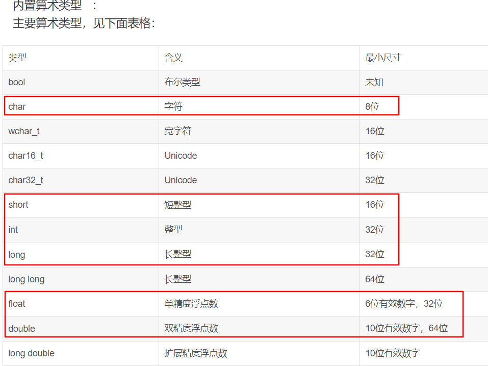

[TOC]

# 1. 题目

## 1.1 一级标题

**重要的名词**

==重要的概念==

>  补充内容

[引用链接]:www.baidu.com



# 1. 基础概念

## 1.1 C++语言特点 / 编程的5种范式

- C++具有强大的抽象能力，融合着5种编程范式，即`面向过程、基于对象、面向对象、泛型和函数式`

1. 面向过程

   一组函数的顺序执行

2. 基于对象

   采用对象封装技术，将数据和操作捆绑在一起，但并没有使用继承、多态等面向对象技术进行软件设计

   一个 object-based（OB）设计可能会比一个对等的 OO 设计速度更快更紧凑。速度快是因为所有的函数调用操作都在编译时期解析完成，对象建构起来时不需要设置 virtual 机制；空间紧凑是因为每一个 class object 不需要负担传统上为了支持 virtual 机制而需要的额外负荷。但是，由于没有继承、多态机制，失去了部分弹性。

3. 面向对象

   面向对象程序设计的核心思想是数据抽象（封装）、继承和多态（动态绑定）

   * 数据抽象：把客观事物封装成抽象的类，同时将类的接口和实现分离。（优点：可以隐藏实现细节，使得代码模块化）
   * 继承：定义相似的类型，并对其相似关系建模。（优点：可以扩展已存在的代码模块）
   * 多态：一定程度上忽略相似类型的区别，以统一的方式使用它们的对象。

   面向对象设计的 5 大原则（SOLID）：

   - SRP(The Single Responsibility Principle) 单一职责原则：一个类应该有且只有一个去改变它的理由，这意味着一个类应该只有一项工作。
   - OCP(The Open Closed Principle) 开放封闭原则：对象或实体应该对扩展开放，对修改封闭，这就意味着一个类应该无需修改类本身但却容易扩展。
   - LSP(The Liskov Substitution Principle) 里氏替换原则：每一个子类或派生类应该可以替换它们的基类或父类。
   - ISP(The Interface Segregation Principle) 接口隔离原则：不应强迫客户端实现一个它用不上的接口，或是说客户端不应该被迫依赖它们不使用的方法。
   - DIP(The Dependency Inversion Principle) 依赖倒置原则：实体必须依靠抽象而不是具体实现。它表示高层次的模块不应该依赖于低层次的模块，它们都应该依赖于抽象。

4. 泛型

   泛型编程的核心活动是抽象：将一个特定于某些类型的算法中那些类型无关的共性抽象出来，比如，在STL的概念体系里面，管你是一个数组还是一个链表，反正都是一个区间，这就是一层抽象。管你是一个内建函数还是一个自定义类，反正都是一个Callable（可调用）的对象（在C++里面通过仿函数来表示），这就是一层抽象。泛型编程的过程就是一个不断将这些抽象提升出来的过程，最终的目的是形成一个最大程度上通用的算法或类。

   相对于基于**多态的面向对象抽象**而言，使用模版更加高效。因为面向对象的多态引入了间接调用，需要在**运行期**查找真正调用的函数，而模板可以直接利用**编译器的类型信息**，避免了间接调用。

5. 函数式编程

   函数式编程的主要思想是把运算过程尽量写成一系列嵌套的函数调用，每一个函数调用不依赖于外部的数据，而且也不改变外部数据的值，而是返回一个新的值。

   函数式编程具有五个鲜明的特点:

   1. 函数是`第一等公民`。所谓"第一等公民"（first class），指的是函数与其他数据类型一样，处于平等地位，可以赋值给其他变量，也可以作为参数，传入另一个函数，或者作为别的函数的返回值。
   2. 只用`表达式`，不用`语句`。表达式（expression）是一个单纯的运算过程，总是有返回值；语句（statement）是执行某种操作，没有返回值。函数式编程要求，只使用表达式，不使用语句。也就是说，每一步都是单纯的运算，而且都有返回值。
   3. 没有`副作用`。函数式编程强调没有"副作用"，意味着函数要保持独立，所有功能就是返回一个新的值，没有其他行为（最典型的情况，就是修改全局变量的值）。
   4. 不修改`参数`。函数参数是不可变的。
   5. `引用透明`（Referential transparency）。函数的运行不依赖于外部变量，只依赖于输入的参数，任何时候只要参数相同，引用函数所得到的返回值总是相同的。

## 1.2 声明还是定义？

- 变量声明用来引入标识符，并对它的类型（对象、函数等）进行说明，有了声明语句，**编译器**就可以理解对该标识符的**引用**，可以重复声明一个变量；
- 变量定义用来为变量分配存储空间，还可为变量指定初始值。可以将定义看做是对声明的变量进行实例化，**链接器**需要根据定义来找到变量具体对应的值，变量必须有且仅有一个定义。
- 重复定义会导致链接器不知道哪一个是需要的，编译器会报错：**redefinition of**。变量缺少定义链接器会因为**symbol(s) not found**链接失败。

## 1.3 左值还是右值？

- 左值与右值这两概念是从 c 中传承而来的，在 c 中，左值指的是既能够出现在等号左边也能出现在等号右边的变量(或表达式)，右值指的则是只能出现在等号右边的变量(或表达式)。
- 在 C 语言中，通常来说有名字的变量就是左值(如上面例子中的 a, b)，而由运算操作(加减乘除，函数调用返回值等)所产生的中间结果(没有名字)就是右值，如上的 3 + 4， a + b 等。可以认为**左值就是在程序中能够寻址的东西，右值就是没法取到它的地址的东西**。
- 如上概念到了 c++ 中，就变得稍有不同。具体来说，在 c++ 中，`每一个表达式或者是一个左值，或者是一个右值`，相应的，该表达式也就被称作“左值表达式"，"右值表达式"。对于内置的基本数据类型来说(primitive types)，左值右值的概念和 c 没有太多不同，不同的地方在于自定义的类型:
  - 对于内置的类型，右值是不可被修改的(non-modifiable)，也不可被 const, volatile 所修饰；
  - 对于自定义的类型(user-defined types)，右值却允许通过它的成员函数进行修改。
- C++ 中自定义类型允许有成员函数，而通过右值调用成员函数是被允许的，但成员函数有可能不是 const 类型，因此通过调用右值的成员函数，也就可能会修改了该右值。此外，**右值只能被 const 类型的 reference 所指向**，当一个右值被 const reference 指向时，它的生命周期就被延长了。

## 1.4 引用

编译器一般将引用实现为`const指针`，即指向位置不可变的指针，也就是说引用实际上与一般的指针同样占用内存，不过我们没有办法获得这个指针的地址。

当大型对象被传递给函数时，使用引用参数可使参数传递效率得到提高，因为引用并不产生对象的副本，也就是参数传递时，对象无须复制。有时甚至有的类类型（包括 IO 类型在内）根本不支持拷贝操作，只能用引用传递。

> 参考：1. https://github.com/selfboot/CS_Offer/tree/master/C++

## 1.5 sizeof运算符

sizeof 运算符返回`一条表达式或者一个类型名字所占的字节数`，sizeof 运算符满足右结合律，所得的值是一个 size_t 类型的常量表达式。sizeof 运算符的运算对象有两种形式：

1. sizeof *(type)*
2. sizeof *expr*

第二种形式中，返回的是表达式结果类型的大小（注意**，sizeof 并不实际计算其运算对象的值**）。

在 sizeof 的运算对象中解引用一个无效指针仍然是一种安全的行为，因为指针实际上并没有被真正使用，sizeof ==并不需要真的解引用指针也能知道它所指对象的类型==。这是一件可以在程序运行前==（`编译时`）==完成的事情，所以，==sizeof(*p)==直接就被==具体数字==给取代了，在==运行时==也就==不会==有了解引用这个表达式。

```c++
int i = 10;
printf("%d\n",i);                           // 10
// sizeof 并不计算 i++
printf("%d\n",sizeof(i++));                 // 4
printf("%d\n",i);                           // 10
```

sizeof 运算符的结果部分地依赖于其作用的类型：

* 对 char 或者类型为 char 的表达式执行 sizeof 运算，结果得 1；
* 对引用类型执行 sizeof 运算得到==被引用对象==所占空间的大小，但其实引用在内存空间会占用==4个字节的大小==；
* 对指针执行 sizeof 运算得到==指针本身==所占空间的大小；
* 对解引用指针执行 sizeof 运算得到指针指向的对象所占空间的大小，==指针不需要有效==；
* 对数组执行 sizeof 运算得到==整个数组所占空间==的大小，等同于对数组中==所有的元素==各执行一次 sizeof 运算并将所得结果==求和==。（sizeof ==不会把数组转换成指针==来处理，可以用数组的==大小除以单个元素的大小==得到数组中元素的个数）。
* 对 string 对象或 vector 对象执行 sizeof 运算==只返回该类型固定部分的大小（**24**）==，==不会计算对象占用了多少空间==；
* 对于 ==enum 类型==的变量，它保存的==枚举对象本身==并不是真的变量，它们只是类型安全的 #define，用来以可读的方式保存一串数字而已。编译器一般是用 ==int 类型的来保存一个 enum==，所以==sizeof 结果为 4==。

此外求==类的大小时==遵循下面规则（只统计与==类的实例==有关的，只与类型相关的不统计）：

1. 类的非静态成员数据的类型大小之和，也就是说==静态成员数据不作考虑==。
2. 普通成员函数与==sizeof无关==，调用普通成员函数只需要知道函数的地址即可，而这些地址只与类型相关，与类型的实例无关。
3. 虚函数由于要维护在虚函数表，所以要==占据一个指针大小==
4. 类的总大小也遵守类似 struct ==字节对齐==的调整规则
5. 空类的==大小为 1==（空类型的实例中不包含任何信息，但是声明空类的实例时，必须在内存中占有一定的空间，否则无法使用这些实例。占有空间数由==编译器决定，一般是1==）。

> 注意：
>
> 1. **以\0开头表示八进制数，如\065，但是\128只会区分12，strlen()是遇\0停止，不包含\0**
>
> 
>
> 2. **字符**
>
> 
>
> 3. **数组**
>
> 
>
> 退化成指针，所以为4
>
> 
>
> 审清题目，大小为2的char数组
>
> 4. **对于typedef与define 的区别：**
>
> https://www.cnblogs.com/kerwinshaw/archive/2009/02/02/1382428.html
>
> https://www.zhihu.com/question/29798061
>
> typedef是有作用域的，define是全局的
>
> ［[枚举类型，typedef 函数指针](http://www.nowcoder.com/questionTerminal/07684925aaaf4885ad574b2a2debe930)］  

## 1.6 内存对齐

许多实际的计算机系统对基本类型数据在内存中存放的位置有限制，它们会要求这些数据的首地址的值是某个数k（通常它为4或8）的倍数，这就是所谓的**`内存对齐**`。

每个特定平台上的编译器都有自己的默认**“对齐系数”**（32位机一般为==4==，64位机一般为==8==）。我们可以通过预编译命令==#pragma pack(k)==，k=1,2,4,8,16来改变这个系数，其中k就是需要指定的“对齐系数”；也可以使用==#pragma pack()==取消自定义字节对齐方式。

==struct 或者 union 成员==对齐规则如下：

1. 第一个数据成员放在offset为0的地方，每个成员按照对齐系数和自身占用字节数中，二者比较小的那个进行对齐；
2. 在数据成员完成各自对齐以后，struct或者union本身也要进行对齐，对齐将按照对齐系数和struct或者union中最大数据成员长度中比较小的那个进行；

先局部成员对齐，然后再全局对齐。此外，值得注意的是，**enum 内部是 int 实现的，所以大小为 4。用 typedef 声明指针时，并不为指针分配空间**。

［[结构体中 : 的含义](http://www.nowcoder.com/questionTerminal/f4e20747a2dd4649bac0c028daa234f4)］   == 重要，默认小端模式，从右往左放==

## 1.7 联合体、CPU字节序

**`联合体`：**在C/C++程序的编写中，当多个基本数据类型或复合数据结构要占用同一内存块时，就要用到联合体。联合体变量所占内存长度是各成员中最长的成员占的内存长度。union所有成员都从==低地址开始存放。==

**`Little endian`** 和 **`Big endian`** 是CPU 存放数据的两种不同顺序。对于整型、长整型等数据类型，==Big endian 认为第一个字节是最高位字节==（按照从低地址到高地址的顺序存放数据的高位字节到低位字节）；而==Little endian 则相反，它认为第一个字节是最低位字节==（按照从低地址到高地址的顺序存放数据的低位字节到高位字节）。

例如，假设从内存地址0x0000开始有以下数据：0x12 0x34 0xab 0xcd。如果我们去读取一个地址为 0x0000 的四个字节变量，若字节序为big-endian，则读出结果为0x1234abcd；若字节序位little-endian，则读出结果为 0xcdab3412。

一般来说，x86系列CPU 都是==little-endian 的字节序==，PowerPC通常是==Big endian==，还有的CPU 能通过跳线来设置CPU 工作于Little endian 还是Big endian 模式。

我们可以利用 union 的存储特点，写一个简单的程序来判定当前 CPU 的字节序

```c++
#include <iostream>
using namespace std;

bool checkCPU(){
    //如果是小端字节序，则return true，否则，return false
    union Test{
        int m;
        char c;
    } t;
   	t.m = 1;
    return (t.c == 1);
}

int main(){
    cout << (checkCPU() ? "Little endian" : "Big endian") << endl;
    
    //一个测试用例
    union Demo
    {
        char a[4];
        short b;
    };
    Demo d;
    d.a[0]=256;         // 0,    0000 0000
    d.a[1]=255;         // -1,    1111 1111
    d.a[2]=254;         // -2,    1111 1110
    d.a[3]=253;         // -3,    1111 1101

    /* short是2字节（a[0]和a[1]），
     * 由于80X86是小端模式，即数据的低位保存在内存的低地址中，而数据的高位保存在内存的高地址中
     * 在本例中，a[0]中存放的是b的低位，a[1]中存放的是b的高位，
     * 即b的二进制补码表示是：1111 1111 0000 0000，表示-256
     */
    cout << d.b << endl;

    return 0;
}
```

［[大小端，网络发送](http://www.nowcoder.com/questionTerminal/d7c1ff50fab44443b61903eccd791f1d)］ 

［[溢出，大小端](http://www.nowcoder.com/questionTerminal/c7298be0b2ce42698b80987631cf8fca)］  

## 1.8 类型转换

**类型转换**就是将给定类型的表达式转换为另一种类型。C++中的转型可分为两种：隐式类型转换和显式类型转换。

隐式类型转换是C中的遗留物，在C++中并不推荐使用（C++有专门的转型操作符，见下文的显式转型）。将某种类型的对象拷贝到另一种不同类型的对象中时就会发生隐式转型。比如异型赋值，返回值（函数声明的返回值与代码块实际返回值不同的情况下），按值传递异型参数等情况均会发生隐式类型转换。

```c++
short a = 128;
int b;
b = a;
```

short 类型的对象被赋值给 int 型的对象，这是C++语言内建支持的标准转换。隐式类型转换是件麻烦事，它们很可能导致错误或非预期的函数被调用（参看ME 条款5）。

因此应该尽量避免隐式类型转换，为此 C++ 提供了显式类型转换关键字：static_cast, const_cast, dynamic_cast 以及 reinterpret_cast。

**static_cast **

static_cast 很像 C 语言中的旧式类型转换。可以用于以下场景：

* 用于在存有继承关系的类之间的指针或引用的转换（即可将基类转换为子类，也可将子类转换为基类），把派生类的指针或引用转换成基类时是安全的；把基类指针或引用转换成派生类表示时，由于没有类型检查，所以是不安全的。
* 用于基本数据类型之间的转换，如把int转换成char，把int转换成enum。
* 把任何类型的表达式转换成void类型。
* 还能将 non-const 对象转换为 const对象（注意：反之则不行，那是const_cast的职责）。

如下示例：

```c++
class CBase {};
class CDerived: public CBase {};

double d = 3.14159265;
int i = static_cast<int>(d);

CBase *base = new CBase;
CDerived *derived = static_cast<CDerived *>(base);
```

==**static_cast 转换时并不进行运行时安全检查，所以是非安全的，很容易出问题。**==因此 C++ 引入 dynamic_cast 来处理==安全转型==。

 **dynamic_cast**

dynamic_cast 主要用来在继承体系中的**安全向下转型**。它能安全地将指向基类的指针转型为指向子类的指针或引用，并获知转型动作成功是否。

**dynamic_cast 只能用在指针和引用类型的转换中**，它是唯一进行运行期(runtime)检查的类型转换符，它的主要目的就是保证转换后的类型是一个完整类型(Complete type）。dynamic_cast在转换指针类型时，如果结果不是一个Complete Type, 它会返回NULL; dynamic_cast在转换引用类型时，如果结果不是一个Complete Type，它会抛出bad_cast的异常。dynamic_cast 会动用运行时信息（RTTI）来进行类型安全检查，因此 dynamic_cast 存在一定的效率损失。

```c++
class CBase { };
class CDerived: public CBase { };

int main(){
    CBase b;
    CBase* pb;
    CDerived d;
    CDerived* pd;
    pb = dynamic_cast<CBase*>(&d);     // ok: derived-to-base
    pd = dynamic_cast<CDerived*>(&b);  // error: base-to-derived
}
```

上面的代码最后一行会出错（error: 'CBase' is not polymorphic），==**因为dynamic_cast 只有在基类带有虚函数的情况下才允许将基类转换为子类**==。

```c++
class CBase
{
    virtual void dummy() { }
};

class CDerived : public CBase {
    int a;
};

int main()
{
    CBase *pba = new CDerived;
    CBase *pbb = new CBase;
    CDerived *pd1, *pd2;
    pd1 = dynamic_cast<CDerived *>(pba);
    pd2 = dynamic_cast<CDerived *>(pbb);
}
```

上面代码中的 pd1 不为 null,而 pd2 为 null。

**const_cast**

这个转换操作会操纵传递对象的const属性，或者设置或者移除该属性。

```c++
class C{}; 
const C* a = new C; 
C *b = const_cast(a);
```

**reinterpret_cast**

一个指针转化为其他类型的指针时，不做类型检测，操作结果是一个指针指向另一个指针的值的二进制拷贝；

```c++
class A{}; 
class B{}; 
A* a = new A;
B* b = reinterpret_cast(a);
```

reinterpret_cast 用来执行低级转型，如将执行一个 int 的指针强转为 int。其转换结果与编译平台息息相关，不具有可移植性，因此在一般的代码中不常见到它。

reinterpret_cast 常用的一个用途是转换函数指针类型，即可以将一种类型的函数指针转换为另一种类型的函数指针，但这种转换可能会导致不正确的结果。总之，reinterpret_cast 只用于底层代码，一般我们都用不到它，如果你的代码中使用到这种转型，务必明白自己在干什么。

C++中的reinterpret_cast主要是将数据从一种类型的转换为另一种类型。所谓“通常为操作数的位模式提供较低层的重新解释”也就是说将数据以**二进制**存在形式的重新解释。

［[虚函数继承类型转换](http://www.nowcoder.com/questionTerminal/5e5bb7214788436cb966e67305a8041e)］

## 1.9 If 判断语句

零值的比较

`bool`：根据布尔类型的语义，零值为“假”（记为FALSE），任何非零值都是“真”（记为TRUE）

    if (flag)  
    if (!flag)  

int 型变量：

    if (n == 0)  
    if (n != 0)  

float 型变量：浮点型变量并不精确，所以不可将float变量用“==”或“！=”与数字比较，应该设法转化成“>=”或“<=”形式。
    

    const float EPSINON = 0.00001;  
    if ((x>=-EPSINON) && (x<=EPSINON)) // EPSINON 是允许的误差（即精度） 

指针变量：

    if (p == NULL)  
    if (p != NULL)

以下是一些不良的风格：

    if (p == 0)        // 容易让人误解p是整型变量  
    if ( n )              // 会让人误解 n 是布尔变量 
    if (x == 0.0)   // 错误的写法

不良风格很多都能通过编译，但是语句并不能很好的表达与零值进行比较的逻辑依据。

［[相等判断语句](http://www.nowcoder.com/questionTerminal/230d0664d5104b73b4c9b4fa51c5e735)］

##  1.10逗号运算符

C++ 提供一种特殊的运算符，逗号运算符，它的优先级别最低。

    表达式1，表达式2，表达式3，...... ，表达式n

逗号表达式的特点：

1. 逗号表达式的运算过程为：从左往右逐个计算表达式。
2. 逗号表达式作为一个整体，它的值为==最后一个表达式（也即表达式n）的值==。
3. 逗号运算符的优先级别在==所有运算符中最低==。

（3+5，6+8）的值是14，（`a=3*5,a*4`）的值是60，原因在于赋值运算优先级高于逗号表达式。

下列程序的结果为

    int x,y,z;
    x=y=1;
    z=x++,y++,++y;
    printf("%d,%d,%d\n",x,y,z); // 2,3,1
    
    int a,b;
    b=(a=1,a+1,a++);
    printf("%d,%d\n",a,b)；// 2,1

［[逗号表达式的值](http://www.nowcoder.com/questionTerminal/5971372060a24eac874d43b830864189)］

# 2. 关键字

关键字(keyword)又称保留字，是整个语言范围内预先保留的标识符。每个C++关键字都有特殊的含义。经过预处理后，关键字从预处理记号(preprocessing-token)中区别出来，剩下的标识符作为记号(token)，用于声明对象、函数、类型、命名空间等。

## 2.1 const

欲阻止一个变量被改变，可以使用const关键字。在定义该const变量时，通常需要对它进行初始化，因为以后就没有机会再去改变它了。

const只是在==`编译期的保护`==，编译期会检查const变量有没有被修改，如果有代码尝试修改一个const变量，编译器就会报错。但是由于const修饰的既然是变量，就有存储空间，我们可以通过==地址修改空间==里的值，这样还是可以改变的，也就是说const在一定程度上在编译期间使该变量变成了一个常量，然而它并没有实现保证该变量在==运行期间内存中的值不被修改==。

更多特点如下：

1. const 的引用，对常量的引用不能用作修改它绑定的对象，但是由于对象本身可能是非常量，所以允许通过其他途径改变值。
2. 对指针来说，可以指定指针本身为常量（const pointer, `常量指针`），也可以指定指针所指的对象为常量（pointer to const, `指向常量的指针`），或二者同时指定为const；
3. 在一个函数声明中，const可以修饰形参，表明它是一个输入参数，在函数内部不能改变其值；
4. 对于类的成员函数，有时候必须指定其返回值为==const类型==，以使得其返回值==不为“左值”==（返回值是引用类型时，是可以作为左值使用的，一般用于操作符重载）。
5. 对于类的成员函数，可以用const关键字来说明这个函数是 "只读(read-only)"函数，不会修改任何数据成员。为了声明一个const成员函数，把const关键字放在函数括号的后面。

［[改变 const 变量的值](http://www.nowcoder.com/questionTerminal/36f828664d2d4d14a1428ae49f701f23)］常量折叠现象（发生在==编译期==）

> 

const 可以分为 `顶层const` 和 `底层const`，顶层const可以表示任意的对象是常量，这一点对任何数据类型都适用，如算术类型、类指针等。底层 const 则与指针或者引用等复合类型的基本类型部分有关。比较特别的是，指针既可以是顶层 const 又可以是底层 const。

```c++
int i=0;
const int ci = 42;  // 不能改变 ci 的值，是顶层 const;
int* const p1 = &i; // 不能改变 p1 的值，是顶层 const;
const int *p2 = &ci;// 允许改变 p2 的值，是底层 const;
const int *const p3 = p2;// 前一个const底层，后一个顶层
const int &r = ci;  // 用于声明引用的都是 底层 const
```

在执行==对象的拷贝动作==时，常量是顶层const 时不受影响。拷贝执行操作并不会改变被拷贝对象的值，因此拷入和拷出的对象是否是常量都没什么影响。另一方面，==**底层 const 的限制不能忽视**==，当执行拷贝操作时，拷入和拷出的对象必须具有==相同的底层 const 资格==，或者两个对象的数据类型必须能够转换。一般来说，**非常量可以转换为常量**，反之则不行，如下：

```c++
int tmp = 88;           // 顶层 const
const int * pp = &tmp;  // 底层const
// int *p = pp;         // pp 包含底层 const 的定义, 而 p 没有
```

上面例子中如果允许*p = pp，那么就可以通过 p 改变 pp 所指对象的值，这样 pp 就失去了底层 const 的约束。

## 2.2 static

《C和指针》中说static有两层含义：`指明存储属性；改变链接属性`。（1）全局变量（包括函数）加上static关键字后，链接属性变为internal，也就是将他们限定在了本作用域内；（2）局部变量加上static关键字后，存储属性变为静态存储，不存储在栈区，下一次将保持上一次的尾值。

C 面向过程程序设计中的static：

1. **静态局部变量**。在函数体内，一个被声明为静态的变量在这一函数被调用过程中维持上一次的值不变，即只初始化一次（该变量存放在.bss 或者 .data 区，而不是栈区）。
2. **静态全局变量**。在模块内（但在函数体外），一个被声明为静态的变量可以被模块内函数访问，但不能被模块外访问。（注：模块可以理解为文件）。这样其它文件中可以定义相同名字的变量，不会发生冲突。
3. **静态全局函数**。在模块内，一个被声明为静态的函数只可被这一模块内的其它函数调用。那就是，这个函数被限制在声明它的模块的本地范围内使用。

关于静态局部变量的存放位置，下面是一个不错的解释：

> Where your statics go depends on if they are 0 initialized or not. 0 initialized static data goes in .BSS (Block Started by Symbol), non 0 initialized data goes in .DATA 

关于静态全局变量和静态全局函数，下面是不错的解释：

> The whole and entire purpose of static is to declare that a variable is private to the source file that it is declared in. Thus, it is doing precisely its job in preventing a connection from an extern.  It is not visible to externs in other files, and you can have many different files that all declare static TYPE blah;, and they are all different.

简单来说，对于static 的全局变量，它对链接器不可以见，所以这个变量只能在当前文件中使用。下面是一个简单的例子，分别在两个文件里面都定义了全局变量num，结果会导致重复定义：

    $ cat test_1.cpp
    int num = 5;
    $ cat test_2.cpp
    #include <stdio.h>
    
    int num = 2;
    
    int main(void) {
        printf("num = %d\n", num);
        return 0;
    }
    $ g++ test_1.cpp test_2.cpp -o test_2.o
    duplicate symbol _num in: 
    ...
    clang: error: linker command failed with exit code 1 (use -v to see invocation)

将其中任意一个（当然，两个全部改也可以） num 改为 static 全局变量，则没有问题。

C++面向对象程序设计中的static：

* **静态成员变量：**在类中的static成员变量意味着它为该类的所有实例所共享，也就是说当某个类的实例修改了该静态成员变量，其修改值为该类的其它所有实例所见；
* **静态成员函数：**在类中的static成员函数属于整个类所拥有，这个函数==不接收this指针==，因而==只能访问类的static成员变量==(当然，可以通过==传递一个对象来访问其成员==)。

在类成员的声明之前加上关键字 static 使得成员与类本身直接相关，而不是与类的各个对象保持关联。和其他成员一样，静态成员可以是 public 或 private 的，静态数据成员的类型可以是常量、引用、指针、类类型等。类的静态成员存在于任何对象之外，==对象中不包含任何与静态数据成员有关的数据==。

## 2.3 extern

简单来说，extern可以置于==变量或者函数前==，以标示变量或者函数的==定义在别的地方==。

extern 可以用于==`提前引用声明`==：如果全局变量不在文件的开头定义，其生命周期只限于定义处到文件结尾。如果在变量定义之前的函数想引用该全局变量，则应该在引用之前用关键字extern对该变量作外部变量声明，如下：

    extern int global;
    void show(){
        cout << global << "\n";
    }
    
    int global = 10;
    int main(){
        show();
        return 0;
    }

一个更加一般和常见的用法是在==多文件的程序中声明外部变量==。如果一个程序包含两个文件，在两个文件中都要用到同一个外部变量num，不能在两个文件中各自定义一个外部变量num（变量==只能被定义一次==）。正确的做法是：在任一个文件中==定义外部变量num==，而在另一文件中用==extern对num作外部变量声明==。

    $ cat test_1.cpp
    int num = 5;
    $ cat test_2.cpp
    #include <stdio.h>
    
    extern int num;
    
    int main(void) {
        printf("num = %d\n", num);
        return 0;
    }
    $ g++ test_1.cpp test_2.cpp -o test_2.o
    $ ./test_2.o
    num = 5

背后的工作机制如下：编译系统在遇到 extern int num 时，了解到num是一个在别处定义的全局变量，它==先在本文件中找全局变量num==，如果有，则将其作用域扩展到本行开始；如果本文件中无此全局变量，则==在程序链接时==从其他文件中找全局变量num，如果有，则把==在另一文件中定义的外部变量num的作用域扩展到本文件==，然后在本文件中可以合法地引用该外部变量num。

在大型项目中，如果有许多个文件要用到共同的全局变量可以==将其放置在一个专门的头文件中==，然后在其中==一个源文件定义变量==，在==其他的源文件中使用该变量==。

## 2.4 extern "C"

`函数名修饰机制`

作为一种面向对象的语言，C++支持==函数重载==，而过程式语言C则不支持。函数被C++编译后在==symbol库==中的名字与C语言的==不同==，假设某个函数的原型为：    

    void foo(int x, int y);   

该函数被C编译器编译后在symbol库中的名字为_foo，而C++编译器则会产生像_foo_int_int之类的名字。_foo_int_int这样的名字包含了函数名和函数参数数量及类型信息，C++就是==靠这种机制来实现函数重载的==。   

为了实现C和C++的混合编程，C++提供了C连接交换指定符号==`extern "C"`来解决名字匹配问题==，函数声明前加上extern "C"后，则编译器就会按照==C语言的方式将该函数编译为_foo==，这样C语言中就可以调用C++的函数了。

extern "C"用法如下：

    extern "C"{
        int func(int);
        int var;
    }

C++编译器会将在extern "C" 的大括号内部的代码当作==C语言代码处理==。所以很明显，上面的代码中，C++的名称修饰机制将不会起作用。它声明了一个C的函数func，定义了一个整型全局变量var。

## 2.5 volatile

volatile 关键字是一种==类型修饰符==，用它声明的类型变量表示==**编译器对访问该变量的代码就不再进行优化，从而可以提供对特殊地址的稳定访问**==。
    
volatile 指出==变量是随时可能发生变化的，每次使用的时候必须从它所在的内存地址中读取==，即使它前面的指令刚刚从该处读取过数据，而且读取的数据立刻被保存。而优化做法是，由于编译器发现两次读数据之间程序没有对变量进行过操作，它会自动使用上次读的数据。这样一来，如果是一个寄存器变量或者一个`端口数据`就会出错（它们的值由程序直接控制之外的过程控制），所以说volatile可以保证对==特殊地址的稳定访问==。

volatile 关键字==不能保证全局变量多线程安全==，因为 volatile 仅仅是告诫 compiler 不要对这个变量作优化，每次都要==从 memory 取数值，而不是从register==。

## 2.6 inline

内联机制用于==优化规模较小、流程直接、频繁调用的函数==，因为调用函数一般比求等价表达式的值要慢一些。在大多数机器上，一次函数调用包括：==调用前保存寄存器并在返回时恢复，可能需要拷贝实参等==。

inline函数背后的整体观念就是，将对此函数的每一个调用都以函数本体替换之。这通常是在==编译时期==完成的，但是需要注意的是**inline只是对编译器发出的==一个请求==，编译器可以选择忽略这个请求**。inline 可以是显式，也可以隐式，class ==内部定义的函数被隐式的声明为 inline== 。

inline函数可以调用又不至于导致函数调用的开销，但是仍有一些弊端。比如==导致代码膨胀==，进而造成额外的换页行为，降低指令高速缓存装置的命中率，以及伴随而来的效率损失。

此外，有时候编译器虽然愿意 inlining 某个函数，但还可能为该函数生成一个函数本体。比如如果程序要取某个 inline 函数的地址，编译器必须为此==函数生成一个本体==，比如虚函数和递归函数。

**内联函数的==定义最好是放在头文件中==**，这样每一个包含该头文件的源文件均可以在==编译期==将调用该内联函数的代码展开。如果仅仅在头文件中声明内联函数，而在一个源文件中定义该函数，那么只有定义它的那个源文件可以在编译期展开内联函数。（这和模版类，函数模版的定义放在头文件中是基于同样的原理。）

[inline 函数的观点](http://www.nowcoder.com/questionTerminal/0cd6af2fd4374df597b49e09302b1a5a)  