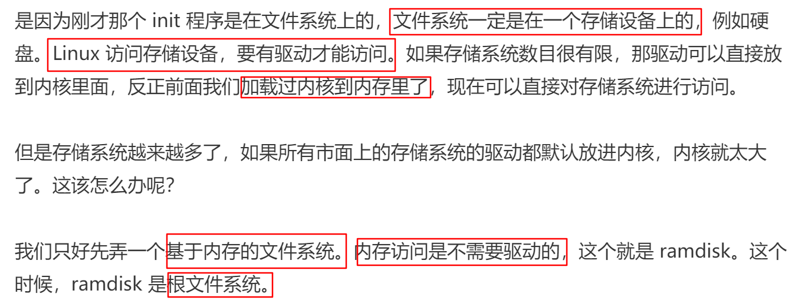
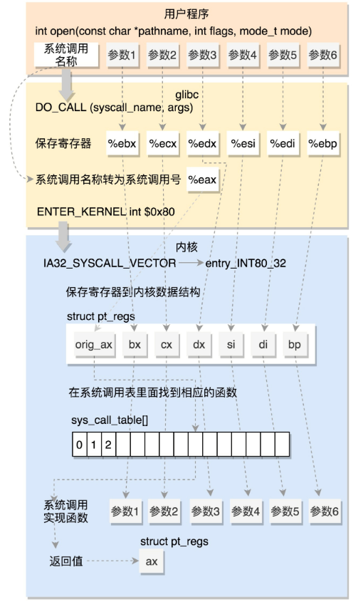
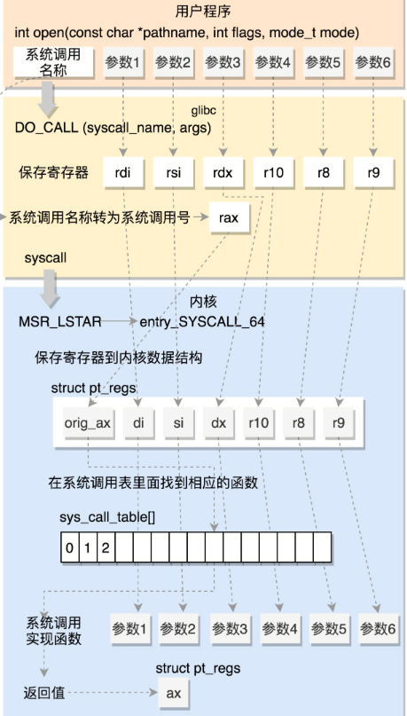
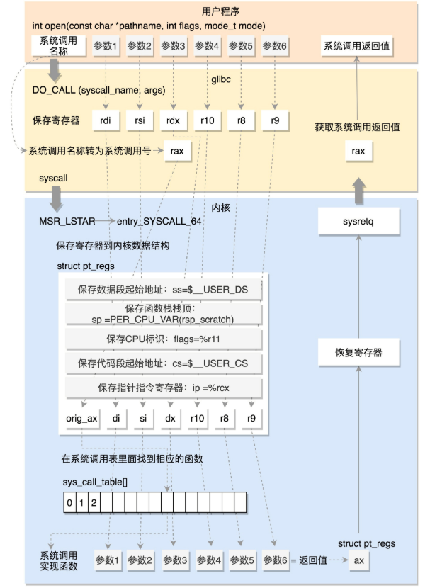
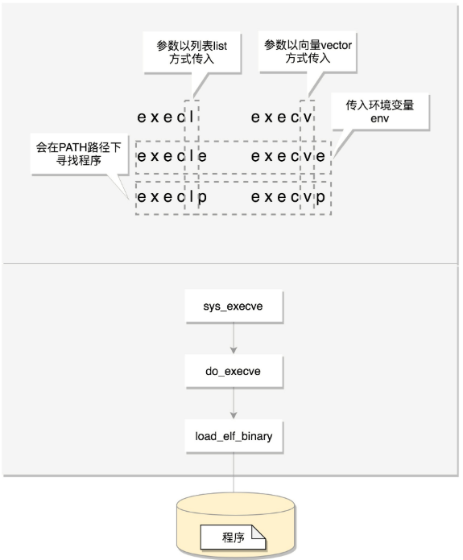
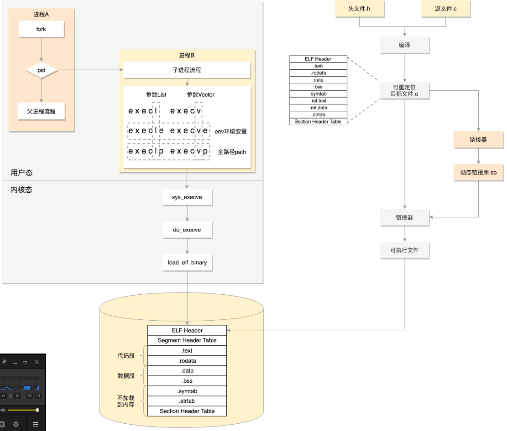
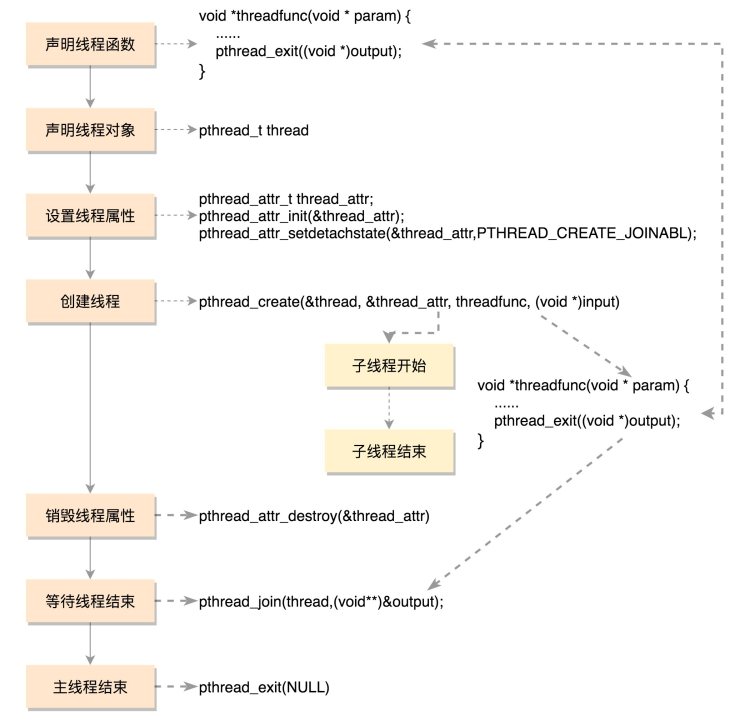

# 1. 系统初始化

## ==背景介绍==

- **程序运行流程**


- **CPU架构（32位）**

  - 控制单元：

    - IP寄存器（指令指针寄存器）：指向代码段中的下一条指令的位置

    - 段寄存器：

      - CS：代码段寄存器：代码在内存中的位置
      - DS：数据段寄存器：数据在内存中的位置
      - SS：栈寄存器

      


- **实模式与虚模式**
  - 实模式：寻址1M，每个段最多64位
  - 保护模式：对于32位系统，能够寻址4G

## ==启动==

- BIOS时期
  - 执行在ROM上存储的BIOS初始化程序
    - x86系统中，1M空间最上面的0xF0000到0xFFFFF这64K映射给ROM，系统加电时，将CS设置为0xFFFF，IP设置为0x0000，第一条指令指向0xFFFF0，正是ROM的范围内，BIOS开始初始化
      - 检查系统硬件
      - 建立中断向量表和中断服务程序，如使用键盘和鼠标，显示结果等


- bootloader时期

  - 读取启动盘，一般在第一个扇区，占512字节，以0xAA55结束（MBR，主引导记录/扇区），加载boot.img从硬盘加载到内存的0x7c00来运行
  - 之后boot.img用于加载一些重要扇区，第一个就是core.img，boot.img将控制权交给diskboot.img，其任务就是将core.img的其他部分加载进来
  - 在解压缩lzma_decompress.img之前，调用real_to_prot，切换到保护模式，这样能在更大的寻址空间里面加载更多的东西

  

- 从实模式切换到保护模式

  - 启动分段

    - 在内存中建立段描述符表，将寄存器面的段寄存器变为段选择子，指向某个段描述符，就能实现不同进程的切换了
    - 启动分页
    - 打开Gate A20，第21根地址线控制线
    - 解压缩kernel.img，跳转到kernel.img进行运行
      - 其对应startup.S以及一堆C文件，在startup.S调用grub_main，这是grub_kernel的主函数，之后解析配置信息
      - 最后调用 grub_command_execute (“normal”, 0, 0)，选择操作系统的列表，加载参数进行解析，完全通过，才会真正的启动内核

    

## ==内核启动==

- 内核启动从start_kernel()开始，在init/main.c文件中，start_kernel相当于内核的main函数

  1. 创始进程，set_task_stack_end_magic(&init_task)，系统创建的**0号进程**，唯一一个**没有通过fork或者kernel_thread**产生的进程，是进程表中的第一个，==初始化进程列表==

  2. **trap_init()**，里面设置了很多中断门，==用于处理各种中断==

  3.  **mm_init()**，==用于初始化内存管理模块==

  4. **sched_init()**，==用来初始化调度模块==

  5. **vfs_caches_init()**，会用来==初始化基于内存的文件系统rootfs==。为了兼容各种各样的文件系统，需要将相关数据结构和操作抽象出来，形成一个抽象层对上提供统一的接口，这个抽象层就是VFS，**虚拟文件系统**

  6. 最后，调用==**rest_init()**，用来做其它方面的初始化==。

     1. 用kernel_thread(kernel_init, NULL, CLONE_FS)创建第二个进程，就是==**1号进程**==，将运行一个用户进程，==（用户态所有进程的祖先）==

        - 从内核态到用户态

          - 通过do_execve(内核系统调用的实现，用于运行一个执行文件)来运行ramdisk的“init”文件来实现的

            - 具体来说，先调用load_elf_binary，加载elf的可执行文件，最后调用start_thread

            

            因为缺少了用户态到内核态的过程，所以需要上述过程，最后的iret用于从系统调用返回，恢复寄存器，刚好使用之前保存的用户态寄存器内容

          > ramdisk的作用
          >
          > 
          >
          > 开始运行ramdisk上的/init、等它运行完之后，已经在用户态了。/init这个程序会根据存储系统的类型加载驱动，有了驱动就可以设置真正的根文件系统，之后ramdisk上的/init会启动文件系统上的init

          - 之后进行各种系统的初始化

  


  > **补充知识**
  >
  > x86提供分层的权限机制，把区域分成了四个Ring，越往里权限越高
  >
  > 能够访问关键资源的代码放在*Ring0*，称为**内核态**
  >
  > 普通程序代码放在*Ring3*，称为**用户态**

##### 


> 用户态到内核态的切换：用户态 - 系统调用 - 保存寄存器 - 内核态执行系统调用 - 恢复寄存器 - 返回用户态，然后继续进行

  2.   rest_init第二件事就是==创建**2号进程**==

         1.   再一次利用kernel_thread创建**进程**，thread可以翻译为**线程**，这里创建的函数为**kthreadd**，==负责所有内核态的线程的调度与管理==，是内核态所有线程的祖先

              > 为什么这里是创建进程，函数名确实线程？
              >
              > 从内核态来讲，无论进程还是线程，都可统称为任务，使用相同的数据结构，平放在同一个链表

              

# 2. 系统调用

## glibc对系统调用的封装

Linux提供glibc这个中介，其将系统调用封装成更加友好的接口。

==以open函数为例进行讲解==（在用户态进程里面调用open函数）

```c++
int open(const char *pathname, int flags, mode_t mode)
```

- 文件**syscalls.list**：列着所有glibc的函数对应的系统调用

- 脚本 **make-syscall.sh**：根据配置文件，对每个封装好的系统调用生成一个文件，定义一些宏

- 文件 **syscall-template.S**：使用定义的宏，定义系统调用的调用方法，里面的任意一个系统调用，都会调用**DO_CALL**，其是一个宏，32位和64位定义不同

>  **32位系统调用**（通过80软中断进行）
>
>  
>
>  在系统调用之后，在 entry_INT80_32 之后，紧接着调用的是 INTERRUPT_RETURN，我们能够找到它的定义，也就是 iret。iret 指令将原来用户态保存的现场恢复回来，包含代码段、指令指针寄存器等。这时候用户态进程恢复执行。

> **64位系统调用**（不适用中断，而改用syscall指令，同时传递参数的寄存器也发生改变）
>
> syscall指令还使用了一种特殊的寄存器，称为**特殊模块寄存器（MSR）**，这种寄存器是CPU为了完成某些特殊控制功能为目的的寄存器，其中就有系统调用。
>
> 
>
> 此时，但会用户态的指令变成了sysretq

**最后都要用到系统调用表**


> 配合用户态和内核态的切换，64位示意图如下：
>
> 

# 3. 进程

## 用系统调用创建进程

## 进行编译：程序的二进制格式

Linux的二级制程序：**ELF格式**


## 运行程序为进程

通过exec系统调用最终调用load_elf_binary，将程序加载的内存



### 进程树


## 进程创建的完整过程



# 4. 线程（查看11 线程）

## 线程创建

