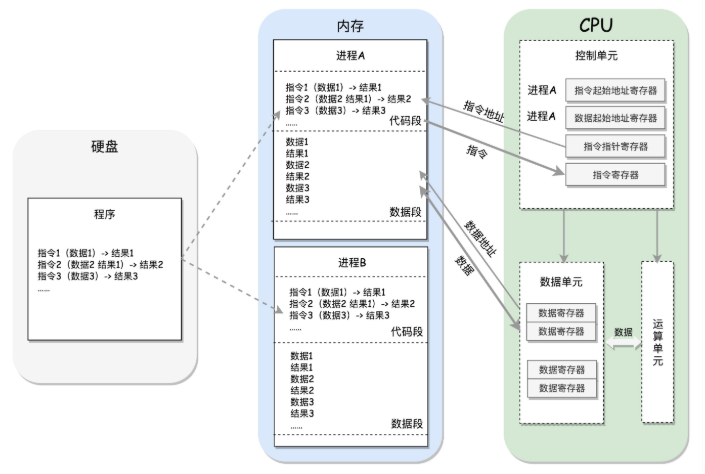
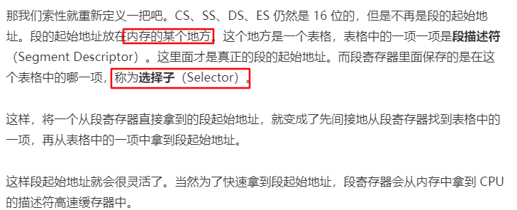
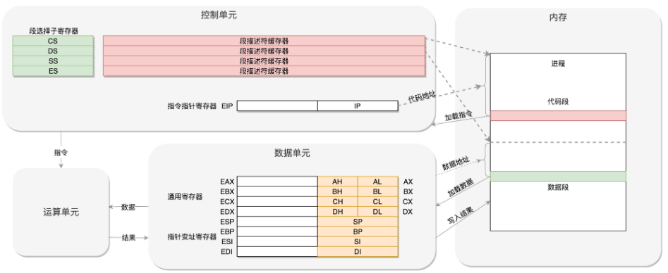
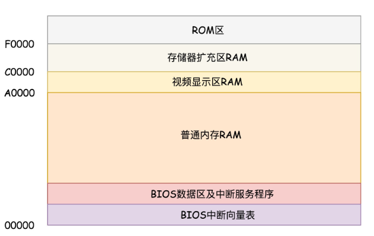
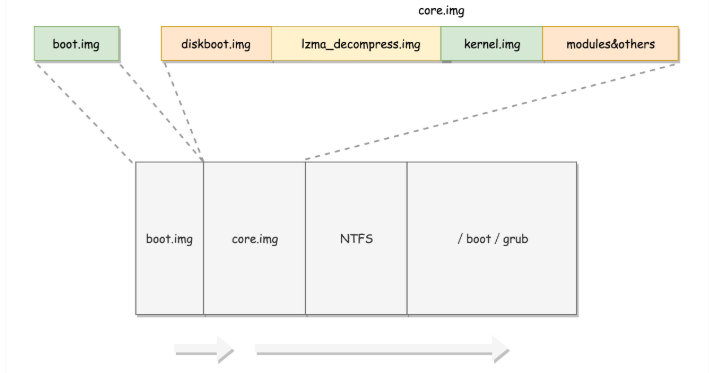

# 系统初始化

==背景介绍==

- **程序运行流程**

- **CPU架构（32位）**

  - 数据单元：

    - IP寄存器（指令指针寄存器）：指向代码段中的下一条指令的位置

    - 段寄存器：

      - CS：代码段寄存器：代码在内存中的位置
      - DS：数据段寄存器：数据在内存中的位置
      - SS：栈寄存器

      

- **实模式与虚模式**
  - 实模式：寻址1M，每个段最多64位
  - 保护模式：对于32位系统，能够寻址4G

==启动==

- BIOS时期
  - 执行在ROM上存储的BIOS初始化程序
    - x86系统中，1M空间最上面的0xF0000到0xFFFFF这64K映射给ROM，系统加电时，将CS设置为0xFFFF，IP设置为0x0000，第一条指令指向0xFFFF0，正是ROM的范围内，BIOS开始初始化
      - 检查系统硬件
      - 建立中断向量表和中断服务程序，如使用键盘和鼠标，显示结果等

- bootloader时期

  - 读取启动盘，一般在第一个扇区，占512字节，以0xAA55结束（MBR，主引导记录/扇区），加载boot.img从硬盘加载到内存的0x7c00来运行
  - 之后boot.img用于加载一些重要扇区，第一个就是core.img，boot，img将控制权交给diskboot.img，其任务就是将core.img的其他部分加载进来
  - 在解压缩lzma_decompress.img之前，调用real_to_prot，切换到保护模式，这样能在更大的寻址空间里面加载更多的东西

  

- 从实模式切换到保护模式

  - 启动分段

    - 在内存中建立段描述符表，将寄存器面的段寄存器变为段选择子，指向某个段描述符，就能实现不同进程的切换了
    - 启动分页
    - 打开Gate A20，第21根地址线控制线
    - 解压缩kernel.img，跳转到kernel.img进行运行
      - 其对应startup.S以及一堆C文件，在startup.S调用grub_main，这是grub_kernel的主函数，之后解析配置信息
      - 最后调用 grub_command_execute (“normal”, 0, 0)，选择操作系统的列表，加载参数进行解析，完全通过，才会真正的启动内核

    