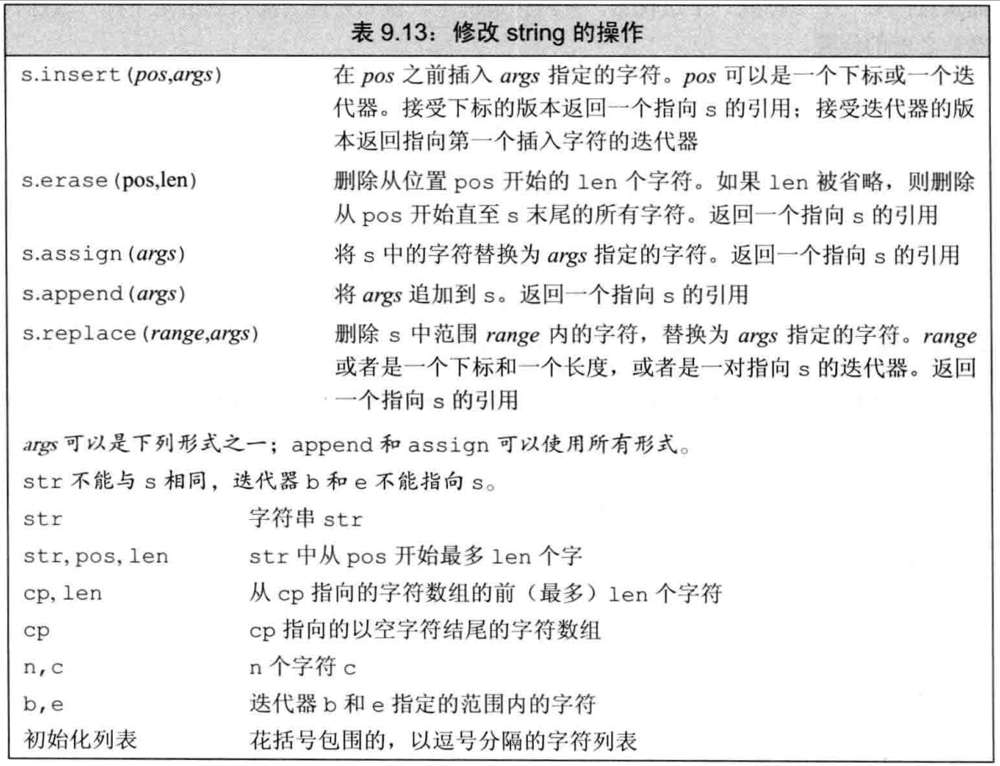
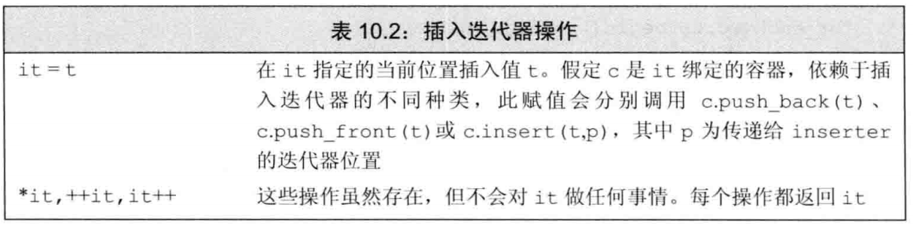
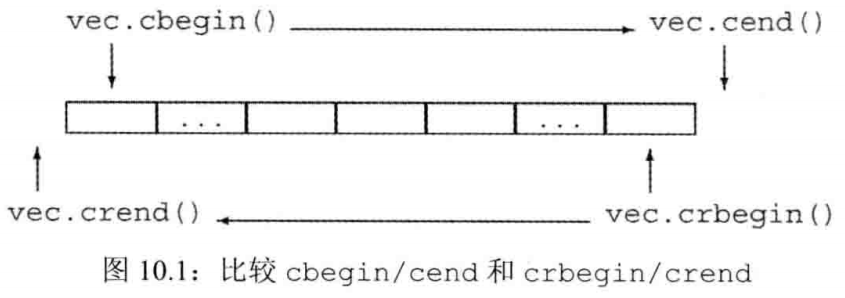

# 第8章 IO库

## 8.1 IO类


- 从上表图可以看出，标准库定义了一组类型和对象来操作`wchar_t`类型的数据，宽字符版本的类型和函数的名字都以一个w开始

#### IO类型间的关系

- 设备类型和字符大小都不会影响我们执行IO操作
- 标准库使我们能忽略这些不同类型的流之间的差异，这是通过继承机制实现的
- 类fstream和stringstream都是继承自类iostream的，输入类都继承自istream，输出类都继承自ostream，因此可以在istream对象上执行的操作，也可以在ifstream和istringstream对象上执行，继承自ostream的输出类也有类型情况（源自本章小结）

### 8.1.1 IO对象无拷贝或赋值

- 不能==拷贝或对IO对象赋值==
- 因此不能将形成或返回类型设置为流类型，通常以==引用==方式传递和返回流
- 读写一个IO对象会改变其状态，因此传递和返回的引用==不能是const==的

### 8.1.2 条件状态


- 一个流一旦发生错误，其上后续的IO操作都会失败，只有当流都处于==无错状态==时，我们才可以从它读取数据，向它写入数据
- 使用一个流之前检查它是否处于==良好状态`while(cin >> word)`==

#### 查询流的状态

- iostate类型听过了表达流状态的完整功能
- IO库定义了4个iostate类型的constexpr值表示特定的位模式，这些值用来表示特定类型的IO条件，可以与位运算符一起使用来一次性检测或设置多个标志位
- ==badbit==表示系统错误，如不可恢复的读写错误
- ==failbit==表示可恢复错误，如希望读取数值却读出一个字符等错误
- ==goodbit==的值为0，表示未发生错误
- ==eofbit==表示遇到文件结束位置，同时也会将failbit置位（设为1）
- badbit、failbit、eofbit任一个被置位，则检测流状态的条件会失败
- 使用good或fail是==确定流的总体状态==的正确方法

#### 管理条件状态

- clear是一个重载的成员
  - 不接受参数的版本：清除（复位，全设为0）==所有错误标志位==
  - 接受一个iostate类型参数的版本：复位单一的条件状态

```C++
//复位failbit和badbit，保持其他标志位不变
cin.clear(cin.rdstate() & ~ cin.failbit & ~cin.badbit);
```

### 8.1.3 管理输出缓冲

- 每个输出流都管理一个==缓冲区==，用来保存程序读写的数据
- 导致缓冲刷新（即数据真正写到输出设备或文件）的原因
  - 程序==正常结束==，作为main函数的return操作的一部分，缓冲刷新被执行。如果程序异常终止，输出缓冲区时不会被刷新的，数据可能停留在缓冲区中等待打印
  - 缓冲区==满时==，需要刷新缓冲
  - 使用endl、flush、ends。其中endl换行后==刷新缓冲区==；flush刷新缓冲区但==不输出任何额外的字符==；ends向缓冲区插入==一个空字符后刷新缓冲区==
  - 每个输出操作之后，可以用==unitbuf==设置流的内部状态，来清空缓冲区。默认情况下，cerr是设置unitbuf的
  - 一个输出流可能被关联到另一个流。在这种情况下，当读写被关联的流时，关联到的流的缓冲区会被刷新。例如，默认情况下，cin和cerr都关联到cout，因此读cin或写cerr都会导致==cout的缓存区被刷新==（被关联的流刷新）

#### unitbuf操作符

```C++
//所有输出操作都会立即刷新缓冲区
cout << unitbuf;  
//回到正常的缓冲方式
cout << nounitbuf
```

#### 关联输入和输出流

- 当一个输入流被关联到一个输出流时，任何试图从输入流读取数据的操作都会先刷新到关联的输出流
- 标准库将cout和cin关联在一起
- tie是流的成员函数，有两个重载版本
  - 不带参数版本：返回指向输出流的指针。如果本对象当前关联到一个输出流，返回指向这个流的指针，如果未关联到流，返回空指针
  - 带接收一个指向ostream指针的版本：将调用该函数的流关联到此ostream，`x.tie(&o)`将流x关联到输出流o
- 可以将istream或ostream关联到另一个ostream

```C++
cin.tie(&cout);  //cin关联到cout，cin调用时，会刷新cout的缓冲区
//old_tie指向当前cin关联到的cin流，没有则会空
//将cin不再与任何流关联
ostream *old_tie = cin.tie(nullptr); 
cin.tie(old_tie); // 重建关联
```

- 每个流同时最多==关联到一个流==，但==多个流可以同时关联到同一个ostream==

------

## 8.2 文件输入输出

- 头文件fstream定义了三个类型来支持文件IO：
  - ifstream从一个给定文件读取数据
  - ofstream向一个给定文件写入数据
  - fstream可以读写给定文件
- 可以使用`<<`、`>>`以及`getline`，除此之外，还支持表8.3的操作


### 8.2.1 使用文件流对象

#### 成员函数open和close

- 如果我们定义了一个空文件流对象，可以随后调用open来将它与文件关联起来

```C++
ifstream in(ifile); //构筑一个ifstream并打开指定文件

ofstream out;  //输出流未与任何文件相关联
out.open(ifile + ".copy");  //打开指定流

if(out)  //检查open是否成功
```

#### 自动构造和析构

- 当一个fstream对象被销毁时，close会自动被调用

### 8.2.2 文件模式

- 每个流都有一个关联的文件模式


- 无论用哪种方式打开文件（open打开或文件名初始化流fstream in fstream(file)），我们都可以指定模式
- 指定文件模式有如下限制
  - 只可以对ofstream或fstream对象设定out模式
  - 只可以对ifstream或fstream对象设定in模式
  - 只有当out也被设定时才可设置trunc模式
  - 只要trunc没被设定，就可以设定app模式。在app模式下，即是没有显示指定out模式，文件也总是以输出方式打开
  - 默认情况下，没有指定trunc，以out打开的文件也会被截断。为了保留out模式下打开的文件的内容，我们必须同时指定app，这样只会将数据追加到文件末尾；或者in模式，即对文件进行对鞋操作
  - ate和binary可以用于任何类型的文件流对象，且可以与其他任何文件模式组合使用
- 默认情况：
  - ifstream:in
  - ofstream:out
  - fstream:in out

#### 以out模式打开文件会丢弃已有数据

- 当我们打开一个ofstream时，文件的内容会被丢弃，阻止ofstream清空指定给定文件的方法是同时指定app（in也可以）：

```C++
//在这几条语句中，file1都被截断
ofstream out("file1"); //隐含以out、trunc模式打开
ofstream out2("file1", ofstream::out); //隐含trunc打开
ofstream out3("file1", ofstream::out | ofstream::trunc);

//为了保留文件内容，必须显示指定app模式
ofstream app("file2", ofstream::app); //隐式out，效果与下句相同
ofstream app2("file2", ofstream::out | ofstream::app);
```

------

## 8.3 string流

- 头文件stringstream定义了三个类型来支持string IO：
  - istringstream从一个给定string读取数据
  - ostringstream向一个给定string写入数据
  - stringstream可以读写给定文件


```C++
getline(cin,line);
//将绑定到刚刚读入的行
istringstream record(line);
```

------

# 第9章 顺序容器

- 关于本章，可以参考[《c++顺序容器》(http://blog.csdn.net/wmz545546/article/details/77750878)]
- 一个容器就是一个特定类型对象的集合。
- 顺序容器为程序员提供了控制元素存储和访问顺序的能力，这种顺序不依赖于元素的值，与元素加入容器时的位置相对应
- 在11章将介绍有序和无序关联容器，则根据关联字的值来存储元素

------

## 9.1 顺序容器概述

- 这些容器在以下方面都有不同的性能折中
  - 向容器添加或从容器删除元素的代价
  - 非顺序访问容器中元素的代价


- string和vector将元素保存在连续的内存空间中。由于元素是连续存储的，由元素的下标计算其地址是非常快速的。但是，在这两种容器的中间位置添加或删除元素就会非常耗时：在第一次插入或删除操作之后，需要移动插入/删除位置之后的所有元素来保持连续存储。而且，添加一个元素有时还需要分配额外的存储空间，在这种情况下，每个元素都必须移动到新的存储空间中

- list和`forward_list`的设计目的是令容器任何位置添加和删除操作都很快速，代价是，这两个容器不支持元素的==随机访问==：为了访问一个元素，需要遍历整个容器。与vector、deque和array相比，==额外的内存开销==也很大

- deque支持快速的随机访问，中间位置添加或删除元素的代价代价（可能）很高，两端添加或删除都是很快的

- ```C++
  forward_list
  ```

  和

  ```
  array
  ```

  是新C++标准添加的类型。

  - 与内置数组相比，array是一种更安全、更容易使用的数组类型，大小固定，不支持添加或删除元素以及改变容器大小的操作
  - `forward_list`的设计目的是达到最好的手写的单向链表数据结构相当的性能，==没有size操作==，因为保持或计算其大小就会比手写链表多出额外的开销

------

## 9.2 容器库概览

- 9.2节将介绍对所有容器都适用的操作
- 每个容器都定义在一个头文件中，文件名与类型名相同
- 容器均定义为模板类，必须提供额外信息来生产特定的容器类型，例如`list`

 

### 9.2.1 迭代器

- 迭代器范围中的元素范围是一种左闭合区间，即`[begin,end)`，即end是一个尾后迭代器，迭代器范围中的元素包含begin至end（但不包含end）

#### 使用左闭合范围蕴含的编程假设

- 使用左闭合范围是因为这种范围有三种方便的性质
  - 如果begin和end相等，则范围为空
  - 如果begin和end不等，则范围至少有一个元素，且begin所指向该范围中的第一个元素
  - 我们可以对begin递增若干次，使得begin==end

### 9.2.2 容器类型成员

- 反向迭代器各种操作的含义都发送了颠倒。例如，对一个方向迭代器执行++，会得到上一个元素

- 通过类型别名，我们可以在不了解容器中元素的情况下使用它。

  - 如果需要元素类型，使用value_type
  - 需要元素类型的一个引用，使用reference或const_reference
  - 将在16章介绍

- 目前来说，为了使用这些类型，我们必须显示使用其类名：

  ```C++
  list<string>::iterator iter;
  vector<int>::difference_type count;
  ```

### 9.2.3 begin和end成员

- begin和end有多个版本
  - 带r的版本返回反向迭代器
  - 带c的版本返回const迭代器
- 实际上有两个名为begin的成员，rbegin、end和rend的情况类似
  - 一个是const成员，返回容器的const_iterator类型
  - 另一个是非常量成员，返回容器的iterator类型

### 9.2.4 容器定义和初始化


#### 将一个容器初始化为另一个容器的拷贝

- `C c1(c2)`和`C c1=c2`
- 当将一个容器初始化为另一个容器的拷贝时，两个容器的==容器类型和元素类型==都必须相同

#### 标准库array具有==固定大小==

- 标准库array的==大小==也是类型的一部分，当定义一个array时，除了指定元素类型，还要指定容器大小

```C++
array<int,42>
array<string,10>

//使用array类型，也需要指定元素类型和大小
array<int,10>::size_type i;
array<int>::size_type j; //错误
```

- 默认构造的array是非空的：它包含了与其大小一样多的元素。这些元素都被默认初始化
- 对array进行列表初始化，初始值的数目必须等于或小于array的大小

```C++
array<int,10> ia1;  //10个默认初始化的int
array<int,10> ia2 = {0,1,2,3,4,5,6,7,8,9}; //列表初始化
array<int,10> ia3 = {42}; //ia3[0]为42，剩余元素为0
```

- 不能对内置数组类型进行拷贝或对象赋值操作，但对array并无此限制

```C++
int digs[10] = {0,1,2,3,4,5,6,7,8,9};
int cpy[10] = digs; //错误
array<int,10> digits = {0,1,2,3,4,5,6,7,8,9}
array<int,10> copy = digits; //正确，只要数组类型（元素类型和长度）匹配即合法
```

### 9.2.5 赋值和swap

- 赋值运算将运算符其左边容器中的全部元素替换为右边容器中元素的拷贝

```C++
c1 = c2; //将c1的内容替换为c2中元素的拷贝
c1 = {a,b,c}; //赋值后c1的大小为3
```

- 第一个赋值运算后，左边容器将与右边容器相等。如果原来两个容器大小不同，则赋值运算后两者的大小都与==右边容器的原大小相同==
- 与内置数组不同，标准库array类型允许赋值。赋值号左右两边的运算对比必须具有相同的类型

```C++
array<int,10> a1 = {1,2,3,4,5,6,7,8,9};
array<int,10> a2 = {0}; //所有元素均为0，在初始化的时候可以使用花括号和遗漏元素，参考表9.3
a1 = a2; //替换a1中的元素
a2 = {0}; //错误，不能将一个花括号列表赋予数组，参考表9.4 
```

- 由于右边运算对象的大小可能与左边运算对象的大小不同，因此array类型不支持assign，也==不允许用花括号包围的值==列表进行赋值


#### 使用assign(仅顺序容器)

- 顺序容器（array除外）还定义了一个名为assign的成员，允许我们从一个不同但**相容**的类型赋值，或者从容器的一个**子序列**赋值。assign操作用参数指定的元素（的拷贝）替换左边容器中的所有元素。例如，我们可以用assign实现将一个vector中的一段char*赋值予一个list中的string

```C++
list<string> names;
vector<const char*> oldstyle;
names = oldstyle;   // 错误：容器类型不匹配
// 正确：可以将const char*转换为string
name.assign(oldstyle.cbegin(), oldstyle.cend());
```

- 由于其旧元素被替换，因此传递给assign的迭代器不能指向调用assign的容器

#### 使用swap

- 除array外，swap不对任何元素进行拷贝、删除或插入操作，因此可以保证在常数时间内完成
- 元素不会被移动的事实意味着，除string外，指向容器的迭代器、引用和指针在swap操作之后都不会失效，它们仍然指向swap操作之前所指向的那些元素。但是，在swap之后，这些元素已经属于不同的容器了。例如，将定iter在swap之前指向svec1[3]的string，那么在swap之后它指向svec3[3]的元素。与其他容器不同，对一个string调用swap会==导致迭代器、引用和指针失效。==
- 与其他容器不同，swap两个array会真正交换它们的元素，因此交换两个array所需的时间与array中元素的数目成正比。对于array，在swap操作之后，指针、引用和迭代器所绑定的元素保持不变，但元素值已经与另一个array中对应元素的值进行了交换。

### 9.2.7 关系运算符

- 关系运算符左右两边的运算对象必须是相同类型的容器，且必须保存相同类型的元素
- 这些运算符的工作方式与string的关系运算类
  - 如果两个容器具有相同大小且所有元素都两两对应相等，则这两个容器相等，否则两个容器不等
  - 如果两个容器大小不同，但较小容器中每个元素都等于较大容器中的对应元素，则较小容器小于较大容器
  - 如果两个容器都不是另一个容器的前缀子序列，则它们的比较结果取决于第一个不相等的元素的比较结果
- 只有当其元素类型也定义了相应的比较运算符时，我们才可以使用关系运算符来比较两个容器

------

## 9.3 顺序容器

- 本节介绍顺序容器所特有的操作

### 9.3.1 向顺序容器添加元素

- 除array外，所有标准库容器都提供灵活用的内容管理


#### 使用push_back

- 当我们用一个对象来初始化容器时，或将一个对象插入到容器中时，实际上放入到容器中的时对象值的一个拷贝，而不是对象本身

#### 插入范围内元素

```C++
//运行时错误：迭代器表示要拷贝的范围，不能指向与目的位置相同的容器，因为迭代器失效的问题
slist.insert(slist.begin(), slist.begin(), slist.end());
```

#### 使用emplace操作

- 当调用push或insert成员函数时，我们将元素类型的对象传递给它们，这些对象被拷贝 到容器中。而当我们调用一个emplace成员函数时，则是将参数传递给元素类型的构造函数，emplace成员使用这些参数在**容器管理的内存**中直接构造元素

```C++
// 在c的末尾构造一个Sales_data对象
// 使用三个参数的Sales_data构造函数
c.emplace_back("9999-99999", 25, 15.99);

// 错误：没有接受三个参数的push_back版本
c.push_back("9999-99999", 25, 15.99);

// 正确：创建一个临时的Sales_data对象传递给push_back，等价于第1句
c.push_back(Sales_data("9999-99999", 25, 15.99);
```

- 调用`emplace_back`时，会在容器管理的内存空间中==直接创建对象==，而调用`push_back`则会创建一个==局部临时对象==，并将其压入容器中
- emplace函数在容器中直接构造元素，传递给emplace函数的参数必须与元素类型的构造函数相匹配

```C++
// iter 指向c 中一个元素，其中保存了Sa1es_data 元素
c.emp1ace_back(); //使用Sales data 的默认构造函数
c.emplace(iter, " 999- 999999999 " ); // 使用Sa1es_data(string)
//使用Sales_data 的接受一个ISBN 、一个count 和一个price 的构造函数
c.emplace_front(" 978 - 0590353403 " , 25 , 15.99);
```

### 9.3.2 访问元素


#### 访问成员函数返回的是引用

- 在容器中访问元素的成员函数（即，front、back、下标和at），返回的元素都是引用

```C++
if(!c.empty()){
    c.front() = 42;
    auto &v = c.back();
    v = 1024;  //改变c中的元素
    auto v2 = c.back; //这里v2不是一个引用
    v2 = 0; //未改变c中的元素
}
```

- 如果我们使用auto变量来保存这些函数的返回值，并且希望使用此变量来改变元素的值，必须记得将变量定义为引用类型

### 9.3.3 删除元素


- 删除元素的成员函数并不检查其参数，在删除元素之前，程序员必须确保它（们）是存在的

#### 删除对个元素

```C++
// 删除两个迭代器表示的范围内的元素
// 返回指向最后一个被删元素之后位置的迭代器
elem1 = slist.erase(elem1, elem2); // 调用后，elem1 == elem2
```

### 9.3.4 特殊的forward_list操作

- 在一个`forward_list`中添加或删除元素的操作是通过改变给定元素之后的元素来完成的，这样我们总是可以访问到被添加或删除操作所影响的元素。由于这些操作与其他容器上的操作的实现方式不同，`forward_list`并未定义insert、emplace和erase，而是定义了名为`insert_after`、`emplace_after`和`erase_after`的操作


### 改变容器大小

- 我们可以用resize 来增大或缩小容器，array不支持resize
- 如果当前大小大于所要求的大小，容器后部地元素会被删除；如果当前大小小于新大小，会将新元素添加到容器后部


### 9.3.6 容器操作可能使迭代器失效

- 向容器中添加元素和从容器中删除元素的操作可能会是指向容器元素的指针、引用或迭代器失效
- 在向容器添加元素后：
  - 如果容器是vector或string，且存储空间被重新分配，则指向容器的迭代器、指针和引用都会失败。如果存储空间未重新分配，指向插入位置之前的元素的迭代器、指针和引用仍有效，但指向插入位置之后元素的迭代器、指针和引用将会失效
  - 对于deque，插入到除首尾位置之外的任何位置都会导致迭代器、指针和引用失效。如果在首尾位置添加元素，迭代器会失效，但指向存在的元素的引用和指针不会失效
  - 对于list和forward_list，指向容器的迭代器（包括尾后迭代器 和首前迭代器 ）、指针和引用仍有效
- 当我们删除一个元素后：
  - 对于vector和string，指向被删除元素之前元素的迭代器、引用和指针仍有效。注意，当我们删除元素时，尾后迭代器总是会失效
  - 对于deque，如果在首尾之外的任何位置删除元素，那么指向被删除元素外其他元素的迭代器、引用或指针也会失效。如果是删除deque的尾元素，则尾后迭代器 也会失效，但其他迭代器、引用和指针不受影响；如果是删除首元素，这些也不会受影响
  - 对于list和 forward_list ，指向容器其他位置的迭代器（包括尾后迭代器 和首前迭代器 ）、引用和指针仍有效
- 使用失效的迭代器、指针或引用是严重的运行时错误
- 由于向迭代器添加元素和从迭代器删除元素的代码可能会使迭代器失效，因此必须保证每次改变容器的操作之后都正确地重新定位迭代器，这个建议对vector 、string 和deque尤为重要

```C++
auto begin = v.begin(), end = v.end();
while(begin != end)  //end有可能失效

while(begin != v.end)  //每次都能获得最新的end
```

- 如果在一个循环中插入/删除deque、string或vector中的元素，不要缓存end返回的迭代器

------

## vector对象是如何增长的

- 为了支持快速随机访问，vector将元素连续存储，每个元素紧挨着前一个元素存储
- 如果没有空间容纳新元素，容器不可能简单地将它添加到内存中其他位置——因为元素必须连续储存。容器必须分配新的内存空间来保存已有元素和新元素，将已有元素从旧元素从久位置移动到新空间中，然后添加新元素，释放存储空间
- 标准库实现者采用来可以减少容器空间重新分配次数的策略。当不得不获取新的内存空间时，vector和string的实现通常会分配比新的空间需求更大的内存空间（即预留空间）

#### 管理容器的成员函数

- vector和sting类型提供来一些成员函数，允许我们与它的实现中内存分配部分互动


- c.reserve()
  - reserve并不改变容器中元素的数量，它仅影响vector预先分配多大的内存空间
  - 只有当内存空间超过当前容量时，reserve调用才会改变vector的容量，如果需求大小大于当前容量，reserve至少分配与需求一样大的内存空间（可能更大）
  - 如果需求大小小于或等于当前容量，reserve什么也不做。特别是，当需求大小小于当前容量时，==容器不会退回内存空间==
  - 在调用reserve之后，capacity将会大于或等于传递给reserve的参数
- resize成员函数 只改变容器中元素的数目，而不是容器的容量。我们同样不能用resize来减少容器预留的内存空间
- 我们可以调用`shrink_to_fit`来要求deque、vector或string退回不需要的内存空间。此函数指出我们不再需要任何多余的内存空间。但是，具体的实现可以选择忽略此请求，也就是说，调用`shrink_to_fit`也并不保证一定退回内存空间

#### capactiy和size

- 容器的size是指它已经保存的元素的数目；而capacity则是在不分配新的内存空间的前提下它最多可以保存多少元素（包括已经保存的元素）
- 只要没有操作需求超出vector的容量，vector就不能重新分配内存空间
- 每个vector实现都可以选择自己的内存分配策略，但必须遵守的一条原则是：只有迫不得已时才可以分配新的内存空间。只有在指向insert操作时size与capacity相等，或者调用resize或reserve时给定的大小超过当前capacity，vector才可能重新分配内存空间。分配多少超过给定容量的额外空间，取决于具体实现

------

## 9.5 额外的string操作

### 9.5.1 构造string的其他方法：

- 除了3.2.1和表9.3的构造方法外，string还支持一下三个构造函数：


```C++
char noNull [] = ( 'H', 'i' );   // 不是以空字符结束
string s3 (noNu11);  // 未定义noNu11 不是以空字符结束
```

- 通常当我们从一个const char*创建string时，指针指向的数组必须以空字符结尾，拷贝操作遇到空字符时停止。如果我们还传递给构造函数一个计数值，数组就==不必以空字符结尾==

#### substr操作

- substr操作返回一个string，它是原始string的一部分或全部的拷贝，可以传递给substr一个可选的开始位置和计数值


### 9.5.2 改变string的其他方法

 

### 9.5.3 string搜索操作

- 每个搜索操作都会返回一个`string::size_type`值（unsigned类型），表示匹配发生位置的下标，如果搜索失败，则返回一个名为string::npos 的static成员。标准库将npos定义为一个const string::size_type类型，并初始化为值-1
- 由于npos是一个unsigned类型，此初始值意味着npos等于任何string最大的可能大小（参见2.1.2）

 

### 9.5.4 compare函数

- 除了关系运算符外，标准库string类型还提供了一组compare函数，与C标准库的==strcmp==函数很相似


### 9.5.5 数值转换

- 数值15如果保存为16位的short类型，则二进制位模式为0000000000001111
- 字符串”15”存在两个Latin-1编码的char，二进制位模式为0011000100110101
- string参数中第一个非空白符必须是
  - 符号（+或-）或数字
  - 也可以以0x或0X开头表示十六进制
  - 对那些将字符串转换为浮点值的函数，也可以以小数点（.）开头，并可以包含E或e表示指数部分
  - 对于那些将字符串转换为整型值的函数，根据基数不同，string参数可以包含字母符，对应大于数字9的数
- 如果string不能转换为一个数值，抛出：invalid_argument异常
- 如果转换得到的数值无法用任何类型表示，抛出：`out_of_range`异常


------

## 9.6 容器适配器

- 标准库定义来三个顺序容器适配器：stack 、queue 和priority_queue
- 适配器 是标准库中的一个通用概念。容器、迭代器和函数都有适配器
- 一个适配器是一种机制，能使某种事物的行为看起来像另外一种事物一样
- 一个容器适配器接受一个已有的容器类型，使其行为看起来像一种不同的类型
- 例如，stack适配器接受一个顺序容器（除array或forward_list外 ），并使其操作起来像一个stack一样
- 所有容器适配器都支持的操作和类型如下：


#### 定义一个适配器

- 每个适配器都定义两个构造函数：
  - 默认构造函数创建一个空对象
  - 接收一个容器的构造函数拷贝该容器来初始化适配器\

```C++
//从deq拷贝元素到stk
stack<unt> stk(deq);
```

- 默认情况下，stack和queue是基于==deque==实现的，`priority_queue`是在==vector==之上实现的
- 我们可以创建一个适配器时将一个命名的顺序容器作为第二个类型参数，来重载默认容器类型（即改变适配器的默认实现方式）

```C++
//改变了stack的实现方式，在vector上实现，这里声明了一个空栈
stack<string,vector<string>> str_stk;
//str_stk2也是在vector上实现，初始化时保存svec的拷贝
stack<string,vector<string>> str_stk2(svec);
```

- 对于一个给定的适配器，可以使用哪些容器是有限制的。所有适配器都要求容器具有添加和删除元素的能力 。因此，适配器不能构造在array之上
- 不能用forward_list来构造适配器，因为所有适配器都要求容器具有添加、删除以及访问尾元素的能力
- 三类适配器可以基于哪些容器实现： - stack只要求`push_back`、`pop_back`和back操作，因此可以使用除array和forward_list 之外的任何容器类型来构造stack - queue适配器要求back、`push_back`、front和`push_front`。因此它可以构造于list或deque之上， 但==不能基于vector==构造 - `priority_queue`除了front，`push_back`和`pop_back`操作之外还要求随机访问能力，因此它可以构造于vector或deque 之上，但不能基于list构造

#### 栈适配器

- stack类型定义在stack头文件中


- 每个容器适配器都基于底层容器类型的操作定义了自己的特殊操作。我们只可以使用适配器操作，而不能使用底层容器类型的操作

#### 队列适配器

- queue和`priority_queue`适配器定义在queue头文件中

 

- 标准库queue使用一种先进先出的存储和访问策略
- `priority_queue`允许我们为队列中的元素建立优先级。新加入的元素会排在所有优先级比它低的已有元素之前。标准库在元素类型上使用`<`运算符来确定相对优先级。将在11.2.2学习如何充值这个默认设置

------

# 第10章 泛型算法

- 这些算法中的大多数都独立于任何指定的容器
- 这些算法是通用的：它们可用于不同类型的容器和不同类型的元素，还能用于其他类型的序列

------

## 10.1 概述

- 大多数算法在头文件`algorithm`，一组数值泛型算法还在头文件`numeric`
- 一般情况下，这些算法并不直接操作容器，而是遍历由两个迭代器指定的一个元素范围来进行操作，对其中每个元素进行一些处理
- 如find函数，它的工作是在一个未排序的元素序列中查找一个特定元素：

```C++
int val = 42;
auto result = find(vec.cbegin(),vec.cend(),val);
//返回指向第一个等于给定值的元素的迭代器
//如果范围中无匹配元素，则find返回第二个参数来表示搜索失败
//可以通过比较返回值和第二个参数来判断是否成功
```

#### 迭代器令算法不依赖于容器，……

- 用迭代器操作来实现
- 如果发现匹配元素，find可以返回指向该元素的迭代器
- find可以返回尾后迭代器来表示未找到给定元素

#### ……，但算法依赖于元素类型的操作

- 大多数算法都适用了一个（或多个）元素类型上的操作、
- 如find使用了==运算符
- 其他算法可能还要求元素类型支持<运算符

#### 算法永远不会执行容器的操作

- 算法永远不会改变底层容器的大小
- 算法可能改变容器中保存的元素的值，也可能在容器内移动元素，但永远==不会直接添加或删除元素==

------

## 10.2 初识泛型算法

### 10.2.1 只读算法

- 一些算法只会读取其范围内的元素，而从不改变元素，如find、accumulate
- accumulate定义在numeric中

#### 算法和元素类型

```C++
//对vec中的元素求和，和的初始值是0
//第3个参数决定使用哪个类型的加法运算以及返回类型
//序列中的元素类型必须与第3个参数匹配或能转换成第3个参数的类型
//这里的0表示使用的是int的+
int sum = accumulate(vec.cbegin(),vec.cend(),0);
//这里的string("")表示使用的是string的+，即string元素连接
string sum = accumulate(v.cbegin(),v.cend(),string(""));
//错误，""会转换成const char*，const char*上没有定义+运算符
string sum = accumulate(v.cbegin(),v.cend(),"");
```

#### 操作两个序列的算法

- equal用于确定两个序列是否保存相同的值

```C++
//rostre2中的元素数目至少与rostre1一样多
equal(rostre1.cbegin(),rostre1.cend(),rostre2.cbegin())
```

- 可以通过equal来比较两个不同类型的容器中的元素。元素类型也不必一样，只要能用==来比较两个元素即可
- 那些只接受一个单一迭代器来表示第二个序列的算法，都假定第二个序列至少与第一个序列一样长

### 10.2.2 写容器元素的算法

- `fill`函数

```C++
fill(vec.begin(),vec.end(),0); //将每个元素重置为0
fill(vec.begin(),vec.begin()+vec.size()/2,10); //将容器的一个子序列设置为10
```

#### 算法不检查写操作

- `fill_n`接受一个单迭代器、一个计数器和一个值
- `fill_n(dst,n,val)` dst指向一个元素，而从dst开始的序列至少包含n个元素，该函数把这n个值设为val

```C++
vector<int> vec; //空vector
//从首元素开始，将size个元素重置为0，由于这里vector为空，那么size为0，该语句正确
fill_n(vec.begin(),vec.size(),0);
//该语句错误，因为vec是个空向量，vec中的10个元素不存在
fill_n(vec.begin(),10,0)
```

#### 介绍back_inserter

- 一种确保算法有足够的==元素空间==存储输出数据的方法是使用插入迭代器
- 插入迭代器是一种向容器中==添加元素的迭代器==
- 当我们通过一个**（普通）迭代器**向容器元素赋值时，值被赋予迭代器指向的元素
- 通过一个==**插入迭代器**==赋值时，一个与赋值号右侧==相等的元素==被添加到容器中
- `back_inserter`，定义在iterator头文件
- `back_inserter`接受一个==指向容器==的引用，返回一个与该容器绑定的插入迭代器

```C++
vector<int> vec; //空vector
auto it = back_inserter(vec); //通过它赋值会将元素添加到vec中
*it = 42; //vec现在有一个元素，值为42

vector<int> vec1; //空vector
//正确，创建的插入迭代器可以用来向vec添加元素，每次赋值都会在vec上调用push_back
fill_n(back_inserter(vec1),10,0)
```

#### 拷贝算法

- 拷贝算法是另一个向目的位置迭代器指向的输出序列中的元素写入数据的算法
- 接收三个迭代器，前两个表示输入范围，第三个表示目的序列的起始位置

```C++
int a1[] = {0,1,2,3,4,5,6,7,8,9};
int a2[sizeof(a1)/sizeof(*a1)];
//ret指向拷贝到a2的尾元素之后的位置即a2[10]
auto ret = copy(begin(a1),end(a1),a2); 
```

- replace算法
- 4个参数：前两个迭代器，表示输入序列，后两个一个是要搜索的值，另一个是新值

```C++
//将所有值为0的元素改为42
replace(ilist.begin(),ilist.end(),0,42);
```

- 如果希望保留原序列不变，可以调用`replace_copy`

```C++
//ilist并未改变
//ivec包含ilist的一份拷贝，不过原来在ilist中值为0的元素在ivec中变为42
replace_copy(ilist.cbegin(),ilist.cend(),back_inserter(ivec),0,42);
```

### 10.2.3 重排容器元素的算法

- sort会重排输入序列中的元素，利用元素类型的<运算符来实现

```C++
//按字典排序words
sort(words.begin(),words.end());
```

- unique算法重排输入序列，将相邻的重复项“消除”
- unique并不真的删除任何元素，它是**覆盖相邻的重复元素**
- unique返回的迭代器向最后一个不重复之后的位置。此位置之后的元素仍然存储，但我们不知道它们的值是什么

```C++
//unique重排输入范围，使得每个单词只出现一次
//排序在范围的前部，返回指向不重复区域之后一个位置的迭代器
auto end_unique = unique(words.begin,words.end());
```

------

## 10.3 定制操作

- 参考[《定制操作(传递函数或lambda表达式)》](https://www.cnblogs.com/wuchanming/p/3918395.html)

### 10.3.1 向算法传递函数

#### 谓词 

- 谓词是一个可调用的表达式，其返回结果是一个能用作条件的值
- 标准库算法所使用的谓词分为两类：一元谓词（意味着它们只接受单一参数）和二元谓词（意味着它们接受两个参数）
- 接受谓词参数的算法对输入序列中的元素调用谓词。因此，元素类型必须能转换为谓词的参数类型

```C++
//接受一个二元谓词参数的sort版本用这个谓词代替<来比较元素
//比较函数，用来比较长度排序单词
bool isShorter(const string &s1,const string &s2)
{
　　return s1.size()<s2.size();
}
//按长度由短至长排序words
sort(words.begin(),words.end(),isShorter);
```

#### 排序算法

- 在我们将words按大小重排的同时，还希望具有相同长度的元素按字典序排列。为了保持相同长度的单词按字典序排列，可以使用stable_sort算法。这种==稳定排序==算法维持相等元素的原有顺序
- 通过调用stable_sort，可以保持等长元素间的==字典序==

```C++
elimDups(words);//将words按字典序重排，并消除重复单词
//按长度重新排序，长度相同的单词维持字典序
stable_sort(words.begin(),words.end(),isShorter);
for(const auto &s:words)
　　cout<<s<<" ";
cout<<endl;
```

### 10.3.2 lambda表达式

- 我们可以使用==标准库find_if==算法来查找第一个具有特定大小的元素
- find_if算法接受一对迭代器，表示一个范围
- `find_if`的第三个参数是一个==谓词==。`find_if`算法对输入序列中的每个元素调用给定的这个谓词
- 它返回第一个使谓词返回非0值的元素，如果不存在这样的元素，则返回尾迭代器

#### 介绍lambda

- 可调用对象：对于一个对象或一个表达式，如果可以对其使用调用运算符，则称它为可调用的
- 可调用对象有：
  - 函数
  - 函数指针
  - 重载了函数调用运算符的类
  - lambda表达式
- 一个lambda表达式表示一个可调用的代码单元。我们可以将其理解为一个==未命名的内联函数==。一个lambda具有一个==返回类型==、一个参数列表和一个函数体。lambda可能定义在==函数内部==
- 一个lambda表达式具有如下形式：

```C++
/* 
@ [capture list]:捕获列表，是一个lambda所在函数中定义的局部变量列表（通常为空）
@ return type、parameter list和function body与任何普通函数一样，分别表示返回类型、参数列表和函数体
@ lambda必须使用尾置返回来指定返回类型
*/
[capture list] (parameter list) ->return type { function body }
//可以忽略参数列表和返回类型，但必须永远包含捕获列表和函数体
auto f=[] {return 42;};

//lambda的调用方式
cout<<f()<<endl; //打印42
```

- 在lambda中忽略括号和参数列表等价于指定一个空参数列表
- 忽略返回类型，则返回类型从返回的表达式的类型==推断而来==
  - 如果函数体只有==一个return语句==，则返回类型从返回的表达式的代码推断出==返回类型==
  - 如果lambda的函数体包含任何单一return语句之外的语句，且==未指定返回类型==，则返回void

#### 向lambda传递参数

- lambda不能有默认参数
- 一个带参数的lambda的例子：

```C++
//一个与isShorter函数完成相同功能的lambda
//空捕获列表表明此lambda不使用它所在函数中的任何局部变量
[] (const string &s1,const string &s2)
    { return s1.size()<s2.size();}
    
//使用此lambda来调用stable_sort
//当stable_sort需要比较两个元素时，它就会调用给定的这个lambda表达式
stable_sort(words.begin(),words.end(),[](const string &s1,const string &s2)
　　　　　　　　　　　　　　　　　　{return s1.size()<s2.size();});
```

#### 使用捕获列表

- 一个lambda可以出现在一个函数中，使用其==局部变量==，但它只能使用那些明确指明的变量
- 一个lambda通过将局部变量包含在其捕获列表中指出将会使用这些变量
- 捕获列表指引lambda在其内部包含访问局部变量所需的信息
- 使用捕获列表的例子：

```C++
//lambda会捕获sz
[sz] (const string &s)
　　{return s.size()>=sz;};

//错误：sz未捕获
[] (const string &s);
　　{ return s.size()>=sz;};
```

- 一个lambda只有在其捕获列表中==捕获一个所在函数中的局部变量==，才能在函数体中使用该变量

#### 调用find_if

```C++
auto wc=find_if(words.begin(),words.end(),
　　　　　　　[sz] (const string &s)
　　　　　　　　{return s.size()>=sz;});
```

#### for_each算法

- for_each算法：此算法接受一个可调用对象，并对输入序列中每个元素调用此对象

```C++
//打印长度大于等于给定值的单词，每个单词后面接一个空格
//其函数体中还是使用了两个名字：s和cout，前者是它自己的参数
//cout不是定义在biggies中的局部名字，而是定义在头文件iostream中。因此，只要在biggies出现的作用域中包含了头文件iostream，我们的lambda就可以使用cout
for_each(wc,words.end(),
　　[](const string &s) {cout<<s<<" ";});
cout<<endl;
```

### 10.3.3 lambda捕获和返回

- 当定义一个lambda时，编译器生成一个与lambda对应的==新的（未命名的）类类型==。将在14.8.1介绍如何生成这种类
- 当向一个函数传递一个lambda时，同时定义了一个==新类型和该类型的一个对象==：传递的参数就是此编译器生成的==类类型的未命名对象==
- 当使用auto定义一个用lambda初始化的变量时，定义了一个从lambda生成的类型的==对象==
- 默认情况下，从lambda生成的类都包含一个对应该==lambda所捕获的变量的数据成员==
- lambda的数据成员在==lambda对象创建时被初始化==

#### 值捕获

- 变量的捕获方式也可以是==值或引用==
- 采用值捕获的前提是==变量可以拷贝==
- 被捕获的变量的值是在lambda==创建时拷贝==，而不是调用时拷贝

```C++
void fcn1()
{
　　size_t v1=42;  //局部变量
　　//将v1拷贝到名为f的可调用对象
　　auto f=[v1] {return v1;};
　　v1=0;
　　auto j=f(); //j为42；f保存了我们创建它时v1的拷贝
}
```

#### 引用捕获

```C++
void fcn2()
{
　　size_t v1=42;
　　//对象f2包含v1的引用
　　auto f2=[&v1] { return v1;};
　　v1=0;
　　auto j=f2();  //j为0；f2保存v1的引用，而非拷贝
}
```

- 如果我们采用引用方式捕获一个变量，就必须确保被引用的对象在lambda执行的时候是存在的
- 我们也可以从一个函数返回lambda，函数可以直接返回一个可调用对象，或者返回一个类对象，该类含有可调用对象的数据成员。如果函数返回一个lambda，则与函数不能返回一个局部变量的引用类似，此lambda也==不能包含引用捕获==。

#### 隐式捕获

- 让编译器根据lambda体中的代码来推断我们要使用哪些变量
- 在捕获列表中写一个&或=
  - &告诉编译器采用==捕获引用==方式
  - =表示采用==值捕获==方式
- 隐式捕获，值捕获方式的例子：

```C++
wc=find_if(words.begin(),words.end(),
　　[=] (const string &s)
　　　　{ return s.size()>=sz; });
```

- 混合使用隐式捕获和显式捕获的例子：

```C++
void biggies(vector<string> &words,vector<string>::size_type sz,ostream &os=cout,char c=' ')
{
　　//os隐式捕获，引用捕获方式；c显式捕获，值捕获方式
　　for_each(words.begin(),words.end(),[&,c](const string &s) {os<<s<<c;});
　　//os显式捕获，引用捕获方式；c隐式捕获，值捕获方式
　　for_each(words.begin(),words.end(),[=,&os](const string &s) {os<<s<<c;});
}
```

- 当我们混合使用隐式捕获和显式捕获时，捕获列表中的第一个元素必须是一个&或=，此符号指定了==默认捕获方式==为引用或值
- 当混合使用隐式捕获和显式捕获时，显式捕获的变量必须使用与隐式捕获不同的方式。即，如果隐式捕获是引用方式（使用了&），则显示捕获命名变量必须采用值方式，因此不能在其名字前使用&。如果隐式捕获采用的是值方式（使用了=），则显式捕获命名变量必须采用引用方式，即，在名字前使用&


#### 可变lambda

- 默认情况下，对于一个值被==拷贝的变量==，lambda不会改变其值。如果我们希望能改变一个捕获的变量的值，就必须在==参数列表首加上关键字mutable==
- 可变lambda能省略参数列表

```C++
void fcn3()
{
　　size_t v1=42; //局部变量
　　//f可以改变它所捕获的变量的值
　　auto f=[v1] () mutable {return ++v1;};
　　v1=0;
　　auto j=f(); //j为43
}
```

- 一个引用捕获的变量是否（如往常一样）可以修改，依赖于此引用指向的是一个const类型还是一个非const类型：

```C++
void fcn4()
{
　　size_t v1=42;  //局部变量
　　//v1是一个非const变量的引用
　　//可以通过f2中的引用来改变它
　　auto f2=[&v1] {return ++v1;};
　　v1=0;
　　auto j=f2(); //j为1
}
```

#### 指定lambda返回类型

- 在不指定返回类型的情况下
  - 如果函数体只有一个return语句，则返回类型从返回的表达式的代码推断出返回类型
  - 如果一个lambda体包含return之外的任何语句，则编译器假定此lambda返回void

```C++
//正确，只有一个return语句，根据返回表达式推断返回类型
transform(vi.begin(),vi.end(),vi.begin(), [] (int i) {return i<0?-i:i;});

//错误，不能推断lambda的返回类型，则返回类型为void，这里返回了int是错误的
transform(vi.begin(),vi.end(),vi.begin(),[] (int i) {if(i<0) return -i; else return i;});
```

- 当我们需要为一个lambda定义返回类型时，必须使用尾置返回类型：

```c++
transform(vi.begin(),vi.end(),vi.begin(),[] (int i)->int  {if(i<0) return -i; else return i;});
```

### 10.3.4 参数绑定

- 参考[《参数绑定》](http://www.cnblogs.com/wuchanming/p/3918403.html)
- 如果lambda的捕获列表为空，通常可以用函数来代替它
- 但是，对于捕获局部变量的lambda，用函数来替换它就不是那么容易了
- 例如，我们用在find_if调用中的lambda比较一个string和一个给定大小。我们可以很容易地编写一个完成同样工作的函数：

```c++
bool check_size(const string &s,string::size_type sz)
{
　　return s.size()>=sz;
}
```

- 但是，我们不能用这个函数作为find_if的一个参数。
- `find_if`接受一个==一元谓词==，因此传递给find_if的可调用对象必须接受单一参数
- binggies传递给`find_if`的lambda使用捕获列表来保存sz。为了用`check_size`来代替此lambda，必须解决如何向sz形参传递一个参数的问题

#### 标准库bind函数

- bind标准库函数，定义在头文件**functional**中，可以将bind函数看作一个通用的函数适配器，它接受一个**可调用对象**，生成一个新的**可调用对象**来“适应”原对象的参数列表
- 调用bind的一般形式：

```
auto newCallable=bind(callable,arg_list);
```

- 当我们调用newCallable时，newCallable会调用callable，并传递给它arg_list中的参数
- `arg_list`中的参数可能包含形如==`_n`==的名字，其中n是一个整数。这些参数是“==占位符==”，表示newCallable的参数。数值n表示生成的可调用对象中参数的位置，`_1`为newCallable的第一个参数，`_2`为第二个参数，以此类推

#### 绑定check_size的sz参数

```c++
//check6是一个可调用对象，接受一个string类型的参数
//并用此string和值6来调用check_size
auto check6=bind(check_size,_1,6);
/*
此bind调用只有一个占位符，表示check6只接受单一参数。
占位符出现在arg_list的第一个位置，表示check6的此参赛对应check_size的第一个参数。此参数是一个const string&。
因此，调用check6必须传递给它一个string类型的参数，check6会将此参数传递给check_size。
*/

string s="hello";
bool b1=check6(s); //check6(s)会调用check_size(s,6)
```

- 使用bind，我们可以将原来基于lambda的`find_if`调用，替换为如下使用`check_size`的版本：

```c++
//基于lambda的find_if
auto wc=find_if(words.begin(),words.end(),[sz](const string &s));
//替换为
auto wc=find_if(words.begin(),words.end(),bind(check_size,_1,sz));
```

- 此bind调用生成一个可调用对象，将check_size的第二个参数绑定到sz的值
- 当`find_if`对words中的string调用这个对象时，这些对象会调用`check_size`，将给定的string和sz传递给它
- 因此，`find_if`可以有效地对输入序列中每个string调用`check_size`，实现string的大小与sz的比较

#### 使用placeholders名字

- 名字_n都定义在一个名为==placeholders==的命名空间中，而这个命名空间本身定义在==std命名空间==中
- placeholders命名空间定义在==functional头文件==中

```c++
using std::placeholders::_1;
```

- 对每个占位符名字，我们都必须提供一个单独的==using声明==。编写这样的声明很烦人。可以这样解决：

```c++
//将在18.2.2介绍
//using namespace namespace_name;
//所有来自namespace_name的名字都可以在我们的程序中直接使用
using namespace std::placeholders;
```

#### bind的参数

- 可以用bind绑定给定可调用对象中的参数或重新安排其顺序

```c++
//g是一个有两个参数的可调用对象
auto g=bind(f,a,b,_2,c,_1);
/*
映射为f(a,b,_2,c,_1)
例如，调用g(X,Y)会调用f(a,b,Y,c,X)
*/
g(_1,_2);
```

#### 用bind重排参数顺序

```c++
//按单词长度由短至长排序
sort(words.begin(),words.end(),isShorter);
//按单词长度由长至短排序
sort(words.begin(),words.end(),bind(isShorter,_2,_1));
```

#### 绑定引用参数

- 为了替换一个引用方式捕获ostream的lambda：

```c++
//os是一个局部变量，引用一个输出流 c是一个局部变量，类型为char
for_each(words.begin,words.end(),[&os,c] (const string &s) { os<<s<<c;});

ostream & print(ostream &os,const string &s,char c)
{
　　os<<s<<c;
}

//错误：不能拷贝os
for_each(words.begin(),words.end(),bind(print,os,_1,' '));
//函数ref返回一个对象，包含给定的引用，此对象是可以拷贝的
for_each(words.begin(),words.end(),bind(print,ref(os),_1,' '));
```

- 除了==ref函数==，还有==cref函数==，生成一个保存const==引用的类==
- 函数ref和cref定义在头文件==functional==中。

------

## 10.4 再探迭代器

- 参考[《再探迭代器（插入迭代器、流迭代器、反向迭代器、移动迭代器）》](http://www.cnblogs.com/wuchanming/p/3918408.html)
- 除了为每个容器定义的迭代器之外，标准库在头文件iterator中还定义了额外几种迭代器。这些迭代器包括以下几种:
  - 插入迭代器：这些迭代器被绑定到一个容器上，可用来向容器==插入元素==
  - 流迭代器：这些迭代器被绑定到==输入或输出==上，可用来遍历所有关联的IO流
  - 反向迭代器：这些迭代器向后而不是向前移动。除了forward_list之外的标准库容器都有==反向迭代器==
  - 移动迭代器：这些专用的迭代器不是拷贝其中的元素，而是==移动它们==。将在13.6.2介绍

### 10.4.1 插入迭代器

- 当我们通过一个迭代器进行赋值时，该迭代器调用容器操作来向给定容器的指定位置插入一个元素



- 插入迭代器有三种类型，差异在于元素插入的位置：
  - `back_inserter`创建一个使用`push_back`的迭代器
  - `front_inserter`创建一个使用`push_front`的迭代器
  - inserter创建一个使用==insert==的迭代器。此函数接受三个参数，这个参数必须是一个指向给定容器的迭代器。元素将被插入到给定迭代器所表示的元素之前。
- 只有在容器支持`push_front`的情况下，我们才可以使用`front_inserter`。类似的，只有在容器支持`push_back`的情况下，我们才能使用back_inserter
- 当调用inserter(c,iter)时，我们得到一个迭代器，接下来使用它时，会将元素插入到iter原来所指的位置之前的位置。

```C++
//如果it是由inserter生成的迭代器
*it=val;
//其效果与下面代码一样
it=c.insert(it,val);//it指向新加入的元素
++it; //递增it使它指向原来的元素
```

- 使用front_inserter时，元素总是插入到容器第一个元素之前，即使我们传递给inserter的位置原来指向第一个元素，只要我们在此元素之前插入一个新元素，此元素就不再是容器的首元素了

```C++
list<int> lst={1,2,3,4};
list<int> lst2,lst3;  //空list
//拷贝完成之后，lst2包含4 3 2 1,调用的是容器的push_front
copy(lst.begin(),lst.end(),front_inserter(lst2));
//拷贝完成之后lst3包含1 2 3 4 
copy(lst.begin(),lst.end(),inserter(lst3,lst3.begin()));
```

### 10.4.2 iostream迭代器

- 虽然iostream类型不是容器，但标准库定义了用于这些IO类型对象的迭代器
  - istream_iterator==读取输入流==
  - ostream_iterator向一个==输出流写数据==
- 通过使用流迭代器，我们可以用泛型算法从流对象读取数据以及向其写入数据

#### istream_iterator操作

- 一个`istream_iterator`使用»来读取流。因此，`istream_iterator`要读取的类型必须定义了==输入运算符==。
- 可以默认初始化迭代器，这样就创建了一个可以当作尾后值使用的迭代器

```C++
istream_iterator<int> int_it(cin); //从cin读取int
istream_iterator<int> int_eof; //尾后迭代器
ifstream in("afile"); 
istream_iterator<string> str_in(in); //从“afile”读取字符串

//下面是一个用istream_iterator从标准输入流读取数据，存入一个vector的例子：
istream_iterator<int> in_iter(cin); //从cin读取int
istream_iterator<int> eof;  //istream尾后迭代器
while(in_iter!=eof)
　　//后置递增运算读取流，返回迭代器的旧值
　　//解引用迭代器，获得从流读取的前一个值
　　vec.push_back(*in_iter++);
```

- 我们可以将程序重写为如下形式，这体现了istream_iterator更有用的地方：

```C++
istream_iterator<int> in_iter(cin),eof; //从cin读取int
vector<int> vec(in_iter,eof);  //从迭代器范围构造vec
```


#### 使用算法操作流迭代器

```C++
istream_iterator<int> in(cin),eof;
cout<<accumulatre(in,eof,0)<<endl;

//若输入为：1 3 7 9 9 
//输出为：29
```

#### istream_iterator允许使用==懒惰求值==

- 当我们将一个istream_iterator绑定到一个流时，标准库并不保证迭代器立即从流读取数据。具体实现可以推迟从中读取数据，直到我们使用迭代器时才真正读取。
- 保证的是，在我们第一次解引用迭代器之前，从流中读取数据的操作已经完成了

#### ostream_iterator操作

- 我们可以对任何输出运算符(«运算符)的类型定义ostream_iterator
- 当创建一个ostream_iterator时，我们可以提供（可选的）第二参数，它是一个字符串，在输出每个元素后都会打印此字符串。此字符串必须是一个C风格字符串（即，一个字符串字面值或者一个指向以空字符结尾的字符数组的指针）


```C++
//使用ostream_iterator来输出值的序列
ostream_iterator<int> out_iter(cout," ");
for(auto e:vec)
　　*out_iter++=e;   //赋值语句实际上将元素写到cout
cout<<endl;

//可以忽略解引用和递增运算，以下写法和上面的写法效果一样
//运算符*和++实际上对ostream_iterator对象不做任何事情
for(auto e:vec)
　　out_iter=e;//赋值语句将元素写道cout
cout<<end;

//可以通过调用copy来打印vec中的元素，这比编写循环更为简单：
copy(vec.begin(),vec.end(),out_iter);
cout<<endl;
```

#### 使用流迭代器处理类类型

- 只要类型有输出运算符(«)，我们就可以为其定义`ostream_iterator`（例如Sales_item）

```C++
istream_iterator<Sales_item> item_iter(cin),eof;
ostream_iterator<Sales_item> out_iter(cout,"\n");
Sales_item sum=*item_iter++;
while(item_iter!=eof)
{
    if(item_iter->isbn()==sum.isbn())
        sum+=*item_iter++;
    else
    {
        out_iter=sum;
        sum=*item_iter++;
    }
}
out_iter=sum;
```

### 10.4.3 反向迭代器

- 反向迭代器就是在容器中从尾元素向首元素反向移动的迭代器。对于反向迭代器，递增（以及递减）操作的含义会颠倒过来。递增一个反向迭代器（++it）会移动到前一个元素；递减一迭代器（–it）会移动到下一个元素
- 除了==forward_list==之外，其他容器都支持反向迭代器
- 调用rbegin、rend、crbegin和crend成员函数来获得反向迭代器
- 这些成员函数返回指向容器尾元素和首元素之前一个位置的迭代器
- 反向迭代器也有const和非const版本



```C++
//按“正常序”排序vec
sort(vec.begin(),vec.end());
//按逆序排序：将最小元素放在vec的末尾
sort(vec.rbegin(),vec.rend());
```

#### 反向迭代器需要递减运算符

- 除了forward_list之外，标准容器上的其他迭代器都既支持递增运算又支持递减运算
- ==流迭代器不支持递减运算==
- 因此，==不可能从一个forward_list或一个流迭代器创建反向迭代器==

#### 反向迭代器与其他迭代器间的关系

```C++
//在一个逗号分隔的列表中查找第一个元素
auto comma=find(line.cbegin(),line.cend(),',');
cout<<string(line.cbegin(),comma)<<endl;

//在一个逗号分隔的列表中查找最后一个元素
auto rcomma=find(line.crbegin(),line.crend(),',');

//错误:将逆序输出单词的字符
//如果我们的输入是:FIRST,MIDOLE,LAST
//则这条语句会打印TSAL
cout<<string(line.crbegin(),rcomma)<<endl;
```

- 我们不能直接使用rcomma。因为它是一个反向迭代器，意味着它会反向朝着string的开始位置移动
- 将rcomma转换回一个普通迭代器，能在line中正向移动
- 通过调用reverse_iterator的base成员函数来完成这一转换，此成员函数会返回其对应的普通迭代器：

```C++
cout<<string(rcomma.base(),line.cend())<<endl;
```


- rcomma和rcomma.base()指向了不同的元素
- 这些不同保证了元素范围无论是正向处理还是反向出来都是相同的
- 普通迭代器与反向迭代器的关系反映了左闭合区间的特征
- 关键点在于[line.crbegin(),rcomma)和[rcomma.base(),line.cend())指向lin e中相同的元素范围

------

## 10.5 泛型算法结构

- 参考[《泛型算法结构》](http://www.cnblogs.com/wuchanming/p/3918411.html)
- 任何算法的最基本的特性是它要求其迭代器提供哪些操作
- 算法所要求的迭代器操作可以分为5个迭代器类别


- 第二种算法分类的方法是按照是否可读、写或是重排序列中的元素来分类，在附录A按照这种分类方法列出了所有算法

### 10.5.1 5类迭代器

#### 迭代器类别

##### 输入迭代器

- 输入迭代器：可以读取序列中的元素。一个输入迭代器必须支持
  - 用于比较两个迭代器的相等和不相等运算符（==、！=）
  - 用于推进迭代器的前置和后置递增运算（++）
  - 用于读取元素的解引用运算符（*）；解引用只会出现在赋值运算符的右侧
  - 箭头运算符（->），等价于（*it）.member，即，解引用迭代器，并提取对象的成员
- 只用于顺序访问
- 不能保证输入迭代器的状态可以保存下来并用来访问元素，因此，输入迭代器只能用于单遍扫描算法
- 算法==find和accumulate==要求输入迭代器
- istream_iterator是一种输入迭代器

##### 输出迭代器

- 输出迭代器：可以看做输入迭代器功能上的补集——只写而不读元素。输出迭代器必须支持
  - 用于推进迭代器的前置和后置递增运算（++）
  - 解引用运算符（*），只能出现在赋值运算符的左侧（向一个已经解引用的输出迭代器赋值，就是将值写入它所指向的元素）
- 只能向一个输出迭代器赋值一次
- 只能用于单遍扫描算法
- 用作目的位置的迭代器通常都是输出迭代器
- copy函数的第三个参数就是输出迭代器
- ostream_iterator类型也是输出迭代器

##### 前向迭代器

- 可以读元素
- 这类迭代器只能在序列中沿一个方向移动
- 支持所有输入和输出迭代器的操作
- 可以多次读写同一个元素，因此，我们可以保存前向迭代器的状态
- 可以对序列进行多遍扫描
- 算法replace要求前向迭代器
- forward_list上的迭代器就是前向迭代器

##### 双向迭代器

- 可以正向/反向读写序列中的元素
- 除了支持所有前向迭代器的操作之外，双向迭代器还支持前置和后置递减运算符（–）
- 算法reverse要求双向迭代器
- 除了forward_list之外，其他标准库都提供符合双向迭代器要求的迭代器

##### 随机迭代器

- 提供在常量时间内访问序列中的任意元素的能力
- 支持==双向迭代器==的所有功能
- 还支持如下的操作（表3.7中的操作）：
  - 用于比较两个迭代器相对位置的关系运算符（<、<=、>和>=）
  - 迭代器和一个整数值的加减运算（+、+=、-和-=），计算结果是迭代器在序列中前进（或后退）给定整数个元素后的位置
  - 用于两个迭代器上的减法运算符（-）得到两个迭代器的距离
  - 下标运算符（iter[n]，与*（iter[n]）等价
- 算法==sort要求随机访问迭代器==
- array、deque、string和vector的迭代器以及用于访问内置数组元素的指针都是==随机访问迭代器==

### 10.5.2 算法形参模式

- 大多数算法具有如下4种形式之一：

```
alg(beg,end,other args);
alg(beg,end,dest,other args);
alg(beg,end,beg2,other args);
alg(beg,end,beg2,end2,other args);
```

### 10.2.3 算法命名规范

#### 一些算法使用重载形式传递一个谓词

- 接受谓词参数来代替<或==运算符的算法，以及哪些不接受额外参数的算法，通常都是重载的函数

```C
//重载函数
unique(beg,end);  //使用==运算符比较元素
unique(beg,end,comp); 　　//使用comp比较运元素
```

- 由于两个版本的函数在参数个数上不相等，因此具体应该调用那个不会产生歧义

#### _if版本的算法

- 接受一个元素值的算法通常有另一个不同名的版本，该版本接受一个谓词代替元素值。接受谓词参数的算法都有附加_if前缀

```C++
find(beg,end,val); //查找输入范围中val第一次出现的位置
find_if(beg,end,pred);  //查找第一个令pred为真的元素
```

- 这两个算法提供了命名上的差异的版本，而非重载版本，因为两个版本的算法都接受相同数目的参数

#### 区分拷贝元素的版本和不拷贝的版本

- 写到额外目的空间的算法都在名字后面附加一个_copy：

```C++
reverse(beg,end); //反转输入范围中元素的顺序
reverse_copy(beg,end,dest); //将元素按逆序拷贝到dest
```

- 一些算法同时提供`_copy`和`_if`版本

```C++
//从v1中删除奇数元素
remove_if(v1.begin(),v1.end(),
　　　　　　　　　　　　[](int i) {return i%2;});
//将偶数元素从v1拷贝到v2；v1不变
remove_copy_if(v1.begin(),v1.end(),back_inserter(v2),
　　　　　　　　　　　　[](int i) {return i%2;});
```

------

## 10.6

- 参考[《特定容器算法》](http://www.cnblogs.com/wuchanming/p/3918418.html)
- 链表类型list与forward_list定义了几个成员函数形式的算法
- 有这些算法的原因：
  - 通用版本的sort要求随机访问迭代器，因此不能用于list和forward_list
  - 链表类型定义的其他算法的通用版本可以用于链表，但代价太高。这些算法需要交换输入序列中的元素。一个链表可以通过改变元素间的链接而不是真正的交换它们的值来传递“交换”元素。因此，这些链表版本的算法的性能比对应的通用版本好很多
- 对于list和forward_list应该优先使用成员函数版本的算法而不是通用算法

 

#### splice成员

- 链表类型还定义了splice算法。此算法是==链表数据结构所特有==的


#### 链表特有的操作会改变容器

- 链表特有版本与通用版本间的一个至关重要的区别是:

  链表版本==会改变底层的容器==

  。例如:

  - remove的链表版本会删除指定的元素。unique的链表版本会删除第二个和后继的重复元素
  - merge和splice会销毁其参数:通用版本的merge将合并的序列写给一个给定的目的迭代器：两个输入序列是不变的；链表版本的merge函数==会销毁给定的链表==，元素从参数指定的链表中删除，被合并到调用merge的链表对象中。在merge之后，来自两个链表中的元素仍然存在，但它们都已在同一个链表中

------

## 小结

- 算法从不会直接改变它们所操作的序列的大小。它们将元素从一个位置拷贝到另一个位置，但不会直接添加或删除元素
- 容器`forward_list`和list对一些通用算法定义了自己的特有的版本。与通用算法不同，==这些链表特有版本会修改给定的链表==

------

# 第11章 关联容器

- 参考[《关联容器概述》](http://www.cnblogs.com/wuchanming/p/3923756.html)
- 关联容器中的元素是按==关键字==来保存和访问的
- 顺序容器中的元素是按它们在容器中的==位置==来顺序保存和访问的
- 两个主要的关联容器类型是==map和set==
  - map中的元素是一些==关键字-值对==
  - set中每个元素包含一个==关键字==
- 标准库提供8个关联容器，这8个容器间的不同体现在三个维度上：
  - 或者是一个==set==，或者是一个==map==
  - 或者要求==不重复的关键字==，或者允许==重复关键字==
  - 按==顺序==保存元素，或==无序==保存
- map和multimap定义在头文件map中
- set和multiset定义在头文件set中
- 无序容器则定义在头文件==`unordered_map`==和==`unordered_set`==中


------

## 11.2 关联容器概述

- 关联容器（有序的和无序的）都支持9.2节中介绍的普通容器操作

 

- 关联容器==不支持顺序容器==的位置相关的操作，例如`push_front`或`push_back`
- 关联容器也不支持构造函数或插入操作这些接受==一个元素值和一个数量值的操作==

### 11.2.1 定义关联容器

- 每个关联容器都定义了一个==默认构造函数==，它创建一个指定类型的空容器
- 我们也可以将关联容器初始化为另一个同类型容器的拷贝，或是从一个值范围来初始化关联容器，只要这些值可以转化为容器中所需类型就可以

```C++
map<string,size_t> word_count ; //空容器
//列表初始化
set<string> exclude={"the","but","and","or","an","a","The","But","And","Or","An","A"};
//三个元素；authors将姓映射到名
map<string,string> autors={ {"Joyce","James"},
　　　　　　　　　　　　  {"Austen","Jane"},
　　　　　　　　　　　　  {"Dickens","Charles"}};
```

#### 初始化multimap或multiset

- 一个map或set中的关键字必须是唯一的
- multimap和multiset没有此限制，它们都允许多个元素具有相同的关键字

### 11.2.2 关键字类型的要求

- 对于有序容器——map、multimap、set以及multiset，关键字类型必须==定义元素比较==的方法。默认情况下，标准库使用关键字类型的<运算符来==比较两个关键字==

#### 有序容器的==关键字类型==

- 所提供的操作必须在关键字类型上定义一个严格弱序。可以将严格弱序看作==“小于等于”==
- 如果两个关键字是等价的（即，任何一个都不“小于等于”另一个），那么容器将它们视作相等来处理。当用作map关键字时，只能有一个元素与这个关键字关联，我们可以用两者中任意一个来访问对应的值

#### 使用关键字的比较函数

- 用来组织一个容器中元素的操作的类型也是容器类型的一部分
- 用尖括号指出要定义哪种类型的容器，自定义的操作类型必须在尖括号中紧跟这元素类型给出
- 当我们创建一个容器（对象）时，才会以构造函数参数的形式提供真正的比较操作（其类型必须与在尖括号中指定的类型相吻合）
- 我们不能直接定义一个==`Sales_data`==的multiset，因为`Sales_data`没有<运算符
- 可以用compareIsbn函数来定义一个==multiset==

```C++
bool compareIsbn(const Sales_data &lhs,const Sales_data &rhs)
{
　　return lhs.isbn()<rhs.isbn();
}

//提供两个类型：关键字类型Sales_data，以及比较操作类型（应该是一种函数指针类型）
//用compareIsbn来初始化bookstore对象，这表示当我们向bookstore添加元素时，通过compareIsbn来为这些元素排序
//也可以是bookstore(&compareIsbn)，因为函数名会自动转换为函数指针
multiset<Sales_data,decltype(compareIsbn)*> bookstore(compareIsbn);
```

### 11.2.3 pair类型

- pair，标准库类型，定义在头文件==utility==
- pair的默认构造函数对数据成员进行值初始化（即int类型初始化为0、string初始化为空字符串等）
- 也可以为每个成员提供初始化器：

```C++
//创建了一个名为author的pair，两个成员被初始化为"James"和"Joyce"。
pair<string,string> author{"James","Joyce"};
```

- pair的数据成员是public的
- 两个成员分别命名为first和second，用普通的成员访问符号来访问它们


#### 创建pair对象的函数

```C++
pair<string,int>
process(vector<string> &v)
{
    //处理v
    if(!v.empty())
        return {v.back(),v.back().size()); // 列表初始化
    else
        return pair<string,int>();  //隐式构造返回值
}

//在较早的C++版本中，不允许用花括号包围的初始化器来返回pair这种类型的对象，必须显示构造返回值：
if(!v.empty())
　　return pair<string,int>(v.back(),v.back().size());

//还可以用make_pair来生成pair对象
if(!v.empty())
　　return make_pair(v.back(),v.back().size());
```

------

## 11.3 关联容器操作

- 参考[《关联容器操作》](http://www.cnblogs.com/wuchanming/p/3923761.html)
- 除了上面的表9.2中提到了类型，关联容器还定义了如下表所示的类型


- 由于我们不能改变一个元素的关键字，因此这些pair的==关键字部分是const==的

### 11.3.1 关联容器迭代器

- 当解引用一个关联容器的迭代器时，我们会得到一个类型为==容器的valued_type的值==的==引用==
- 对map而言，value_type是一个pair类型，它的first即关键字是const的，不能修改

#### set的迭代器是const的

- 虽然set类型同时定义了iterator和const_iterator类型，但两种类型都只允许只读访问set中的元素。一个set中的关键字也是const的

#### 遍历关联容器

- map和set类型都支持表9.2中的begin和end操作

```C++
//获取一个指向首元素的迭代器
auto map_it=word_count.cbegin();
//比较当前迭代器和尾后迭代器
while(map_it!=word_count.cend())
{
    //解引用迭代器，打印关键字-值对
    cout<<map_it->first<<" occurs "<<map_it->second<<" times" <<endl;
    ++map_it; //递增迭代器，移动到下一个元素
}
```

### 11.3.2 添加元素

- 由于map和set（以及对应的无序类型）包含不重复的关键字，因此插入一个已经存在的元素对容器没有任何影响
- insert有两个版本，分别接受一对迭代器，或是一个初始化列表
- 在迭代器和初始化列表中的元素，对于==一个给定的关键字==，只有==第一个带此关键字的元素==才被插入到容器中

```C++
map<string,int> test = { {"abc",1}, {"def",2}, {"abc",3} };
cout << test["abc"] << endl;
//输出为：1
```

#### 向map添加元素

- 向word_count插入word的4种方法

```C++
word_count.insert({word,1});
word_count.insert(make_pair(word,1));
word_count.insert(pair<string,size_t>(word,1));
word_count.inset(map<string,size_t>::value_type(word,1));
```


#### 检测insert的返回值

- 如果关键字已经在容器中，则insert什么事情也不做，且返回值中的bool部分为false；second部分是==匹配到的相同关键字的元素的迭代器==

#### 向multiset或multimap添加元素

- 在这些类型上调用insert总会插入一个元素
- 对允许重复关键字的容器，接受单个元素的insert操作返回一个指向新元素的迭代器

### 11.3.3 删除元素

- 对于保存不重复关键字的容器，erase的返回值总是0或1
- 对允许重复关键字的容器，删除元素的数量可能大于1


### 11.3.4 map的下标操作

- map和unordered_map容器提供了下标运算符和一个对应的at函数
- set类型==不支持下标==，因为set中没有与关键字相关联的“值”
- 不能对一个==multimap和unordered_multimap==进行下标操作，因为这些容器中可能有多个值与一个关键字相关联
- 由于下标运算符可能插入一个新元素，我们只可能对非const的map使用下标操作


#### 使用==下标操作==的返回值

- 通常情况下，解引用一个迭代器所返回的类型与下标运算符返回的类型是一样的
- 但对map则不然，当对一个map进行下标操作时，会获得一个==`mapped_type`==对象；但当解引用一个map迭代器时，会得到一个`value_type`对象，即==pair==

### 11.3.5 访问元素

 

c.lower_bound(k)：返回一个迭代器，指向第一个关键字不小于k的元素

c.lower_bound(k)：返回一个迭代器，指向第一个关键字大于k的元素

c.equal_range(k)：返回一个迭代器pair，表示关键字等于k的元素范围。若k不存在，pair的两个成员均等于c.end()

#### 在multimap和multiset中查找元素

- 如果一个multimap或multiset中有多个元素具有给定关键字，则这些元素在容器中==相邻存储==
- 例如，给定一个从作者到著作题目的映射，我们可能想打印一个特定作者的所有著作。可以用三种不同方法来解决这个问题
  - 最直观的方法:使用find和count
  - 使用`lower_bound`和`upper_bound`
  - 使用`equal_range`

#### 使用find和count

```C++
string search_item("Alain de Botton");    //要查找的作者
auto entries=authors.count(search_item);   //元素的数量
auto iter=authors.find(search_item);　　//此作者的第一本书
while(entries)
{
　　cout<<iter->second<<endl;
　　++iter;
　　--entires;
}
```

#### 使用lower_bound和upper_bound

```C++
for(auto beg=authors.lower_bound(search_item),
        end=authors.upper_bound(search_item) ; beg != end; ++beg)
        cout<<beg->second<<endl;    //打印每个题目
```

- lower_bound返回的迭代器指向第一个具有给定关键字的元素
- upper_bound返回的迭代器指向最后一个匹配给定关键字的元素之后的位置
- 如果元素不在容器中，则`lower_bound`和`upper_bound`会==返回相等的迭代器==——指向一个不影响排序的可插入位置
- 如果我们查找的元素具有容器中最大的关键字，则此关键字的==`upper_bound`==返回尾后迭代器
- 如果关键字不存在，且大于容器中任何关键字，`lower_bound`返回==尾后迭代器==

#### 使用`equal_range`

```C++
//pos保存迭代器，表示与关键字匹配的元素范围
for(auto pos = authors.equal_range(search_item); pos.first != pos.second; ++pos.first)  
{  
    cout << pos.first->second << endl;  
}  
```

------

## 11.4 无序容器

- 参考[《无序容器》](http://www.cnblogs.com/wuchanming/p/3923766.html)
- 4个无序关联容器，这些容器不是使用比较运算符来组织元素，而是使用一个==哈希函数和关键字类型的==运算符

#### 使用无序容器

- 用于map和set的操作也能用于`unordered_map`和`unordered_set`

#### 管理桶

- 无序容器在存储上==组织为一组桶==，每个桶保存==零个或多个元素==
- 无序容器使用一个哈希函数将元素映射到桶
- 为了访问一个元素，容器首先计算元素的哈希值，它指出应该搜索哪个桶
- 容器将具有一个特定哈希值的所有元素都保存在相同的桶中
- 如果容器允许重复关键字，所有具有相同的关键字的元素也都会在同一个桶中
- 无序容器的性能依赖于==哈希函数的质量和桶的数量和大小==
- 将不同关键字的元素映射到相同的桶也是允许的
- 当一个桶保存多个元素时，需要==顺序搜索==这些元素来查找我们想要的那个


#### 无序容器对关键字类型的要求

- 默认情况下，无序容器使用关键字类型的==运算符来比较元素，还使用一个hash类型的对象来生成每个元素的哈希值
- 标准库为以下几个类型提供了内置模板，因此它们可以直接定义为关键字
  - 内置类型（包括指针）
  - string
  - 智能指针类型
- 我们不能直接定义关键字类型为自定义类类型的无序容器。==必须提供我们自己的hash模板版本==，将在16.5介绍如何提供自己的hash模板
- 如果不使用默认的hash，可以用另一种方法创建自定义类类型的无序容器，类似于为有序容器提供关键字类型的默认比较操作
- 为了能将自定义类类型Sales_data用作关键字，我们需要提供函数来替代==运算符和哈希值计算函数。我们从定义这些重载函数开始：

```C++
size_t hasher(const Sales_data &sd)
{
　　return hash<string>()(sd.isbn());
}

bool eqOp(const Sales_data &lhs,const Sales_data &rhs)
{
　　return lhs.isbn()==rhs.isbn();
}

//使用这些函数来定义一个unordered_multiset
using SD_multiset=unordered_multiset<Sales_data,decltypr(hasher)*,decltype(eqOp)*>;
//参数是桶大小、哈希函数指针和相等型判断运算符指针
SD_multiset bookstore(42,hasher,eqOp);

//如果我们的类定义了==运算符，则可以只重载哈希函数
//使用FooHash生成哈希值；Foo必须有==运算符
//参数是桶大小、哈希函数指针
unordered_set<Foo,decltype(FooHash)*> fooset(10,FooHash);
```

------

## 小结

- 有序容器使用比较函数来比较关键字，从而将元素按顺序存储。默认情况下，比较操作是采用关键字类型的<运算符
- 无序容器使用==关键字类型的==运算符和一个==hash类型的对象来组织元素==
- 无论在有序容器还是在无序容器中，具有相同关键字的元素都是相邻存储的

------

# 第12章 动态内存

- 参考[《动态内存和智能指针》](http://www.cnblogs.com/wuchanming/p/4053685.html)

------

##### 静态内存

- 静态内存用来保存
  - 局部static对象
  - 类static数据成员
  - 定义在任何函数之外的变量
- 静态内存中的对象由编译器==自动创建和销毁==
- static对象在使用之前分配，在程序结束时销毁

##### 栈内存

- 栈内存用来保存
  - 函数内的非static对象
- 栈内存中的对象由编译器==自动创建和销毁==
- 栈对象，仅在其定义的程序块运行时才存在

##### 堆

- 每个程序还拥有一个==内存池==。这部分内存被称作自由空间或堆
- 程序用堆来存储动态分配的对象，即程序运行时分配的对象
- 动态对象的生存期由程序来控制，当动态对象不再使用时，我们的==代码必须显式地销毁它们==

------

## 12.1 动态内存和智能指针

- new：在动态内存中为对象分配空间并返回一个指向该对象的指针，我们可以选择对对象进行初始化
- delete：接受一个动态对象的指针，销毁该对象，并释放与之关联的内存
- 动态内存容易出现的问题
  - 内存泄漏：==忘记释放内存==
  - 引用非法内存的指针：引用==非法内存的指针==
- 智能指针：它负责==自动释放所指向的对象==
- 新的标准库提供了两种智能指针类型来管理动态对象，区别在于管理==底层指针的方式==
  - `shared_ptr`：允许==多个指针指向同一对象==
  - `unique_ptr`：==“独占”==所指向的对象
  - `weak_ptr`的伴随类，它是一种==弱引用==，指向shared_ptr所管理的对象

### 12.1.1 shared_ptr类

- 智能指针也是模板

```C++
shared_ptr<string> p1 ; //shared_ptr,可以指向string
shared_ptr<list<int> > p2;  //shared_ptr,可以指向int的list
```

- 默认初始化的智能指针中保存着一个空指针
- 智能指针的使用方式与普通指针类似
- 表12.1列出了`shared_ptr`和`unique_ptr`都支持的操作
- 表12.2列出了shared_ptr独有的操作

 

#### make_shared函数

- 最安全的分配和使用动态内存的方法是调用一个名为make_shared的标准库函数
- 定义在头文件==memory==中

```C++
//指向一个值为42的int的shared_ptr
shared_ptr<int> p3=make_shared<int> (42);
//p4指向一个值为"99999"的string
shared_ptr<string> p4=make_shared<string> (5,'9');
//p5指向一个值初始化的int，即，值为0
shared_ptr<int> p5=make_shared<int> ();

//p6指向一个动态分配的空vector<string>
auto p6=make_shared<vector<string>> ();
```

#### shared_ptr的拷贝和赋值

- 当进行拷贝或赋值时，每个`shared_ptr`都会记录有多少个其他`shared_ptr`指向相同的对象

- 每个`shared_ptr`都有一个==关联的计数器，通常称其为引用计数==

- 无论何时我们拷贝一个`shared_ptr`，计数器都会递增

  - 当用一个`shared_ptr`初始化另一个`shared_ptr`
  - 将它作为参数传递给一个函数
  - 作为函数的返回值

- 当我们给`shared_ptr`赋予一个新值或是`shared_ptr`被销毁 - 局部的shared_ptr离开其作用域时

- 一旦一个shared_ptr的计算器变为0，它就会==自动释放自己所管理的对象==

```C++
auto r=make_shared<int>(42);  //r指向的int只有一个引用者
//给r赋值，令它指向另一个地址
//递增q指向的对象的引用计数
//递减r原来指向的对象的引用计数
//r原来指向的对象已没有引用者，会自动释放
r=q; 
```

- 到底是用一个计数器还是其他数据结构来记录有多少指针共享对象，完全由标准库的具体实现决定

#### shared_ptr自动销毁所管理的对象……

- 当指向一个对象的最后一个`shared_ptr`被销毁时，`shared_ptr`类会自动销毁此对象
- 通过==析构函数完成销毁工作==
- 每个类都有一个==析构函数==，构函数控制此类型的对象销毁时做什么操作。析构函数一般用来释放对象分配的资源

#### ……shared_ptr还会==自动释放相关联的内存==

```C++
void use_factory(T arg)
{
    shared_ptr<Foo> p=factory(arg);
    //使用p
    return p; //当我们返回p时，引用计数进行了递增操作
} //p离开了作用域，但它指向的内存不会被释放
```

- 对于一块内存，`shared_ptr`类保证只要有任何`shared_ptr`对象引用它，它就不会被释放掉
- 如果你忘记了销毁程序不再需要的shared_ptr，程序仍会正确执行，但会浪费内存

#### 使用了动态生存期的资源的类

- 程序使用动态内存处于以下三种原因之一：
  - 程序不知道自己需要使用多少个对象（容器类）
  - 程序不知到所需的准确类型（15章将会介绍）
  - 程序需要在==多个对象间共享数据==（shared_ptr指针）

### 12.1.2 直接管理内存

- 参考[《直接管理内存》](http://www.cnblogs.com/wuchanming/p/4174106.html)
- 自己直接管理内存的类与使用智能指针的类不同，它们不能依赖类对象拷贝、赋值和销毁操作的任何默认定义

#### 使用new动态分配和初始化对象

- 在自由空间分配的内存是无名的
- new无法为其分配的对象命名，而是返回一个执行对象的指针

```C++
int *pi=new int ;// pi指向一个动态分配的、未初始化的无名对象
```

- 动态分配的对象是默认初始化的。内置类型或组合类型的对象的值将是未定义的，而类类型对象将用默认函数进行初始化

```C++
string *ps=new string; //初始化为空string，string类的默认初始化就是空string
int *pi=new int ; // pi指向一个未初始化的int，值未知
```

#### 动态分配对象初始化方式

- 可以使用直接初始化方式或值初始化方式
- 可以使用直接初始化方式（不使用等号就是直接初始化）来初始化一个动态分配的对象
  - 使用传统的构造方式（使用圆括号）
  - 使用列表初始化（使用花括号）

```C++
//直接初始化动态对象的例子
int *pi=new int(1024)  ;//pi的对象的值为1024
string *ps=new string(10,'9') ; //vector有10个元素，值依次从0到9
vector<int> *pv=new vector<int>{0,1,2,3,4,5,6,7,8,9};
```

- 对动态的对象进行值初始化，只需在类型名之后跟一对空括号即可

```C++
//值初始化动态对象的例子
string *ps1=new string;   //默认初始化为空string，string类的默认初始化就是空string
string *ps=new string();  //值初始化为空string
int *pi1=new int; //默认初始化：*pi1的值未定义
int *pi2=new int();   // 值初始化为0 *pi2为0
```

- 对于定义与自己的构造函数的类类型（例如string）来说，要求值初始化是没有意义的；不管采用什么形式，对象都会通过==默认构造函数来初始化==
- 对于内置类型，两种形式的差别就很大了（对于内置类型，默认初始化与值初始化的区别）
  - 值初始化：值初始化的内置类型==对象有着良好定义的值==
  - 默认初始化：默认初始化的对象的==值则是未定义的==
- 对于类中那些依赖于编译器合成的默认构造函数的内置类型成员，如果它们未在类内被初始化，进行的是默认初始化，那么它们的值也是未定义的

------

- 如果我们提供了一个括号包围的初始化器，就可以使用auto从此初始化器来推断我们想要分配的对象的类型
- 只有当括号中仅有==单一初始化器==时才可以使用auto

```C++
auto p1=new auto(obj) ; //p指向一个与obj类型相同的对象
auto p2=new auto(a,b,c) ;  //错误：括号中只能有单个初始化器
```

#### 动态分配的const对象

- 用new分配const对象是合法的
- 一个动态分配的const对象==必须==进行==初始化==
- 对于一个定义了默认构造函数的==类类型==，其const动态对象可以隐式初始化，而其他类型的对象就必须显式初始化

```C++
//分配并初始化一个const int
const int *pci=new const int(1024);
//分配并默认初始化一个const的空string
const string *pcs=new const string;
```

#### 内存耗尽

- 一旦一个程序用光了它所有可用的内存，new表达式就会失败
- 如果new不能分配所要求的内存空间，它就会抛出一个类型为bad_alloc的异常
- 如果分配失败，new返回一个==空指针==

```C++
int *p1=new int ; //如果分配失败，new抛出std::bad_alloc
int *p2=new (nothrow) int ; //如果分配失败，new返回一个空指针
```

- 可以改变使用new的方式来阻止它抛出异常：如上第二句。称这种形式的new为==定位new==
- 定位new表达式允许我们向new传递额外的参数
- 在此例中，我们传递给它一个由标准库定义的名为nothrow的对象，意图是告诉它不能抛出异常
- bad_alloc和nothrow都定义在头文件new中

#### 释放动态内存

- 通过delete表达式来将动态内存归还给系统
- delete表达式接受一个指针，指向我们想要释放的对象。该指针必须指向一个动态分配的对象或是一个空指
- 释放一块并非new分配的内存，或者将相同的指针值释放多次，其行为都是未定义的
- delete包括两个动作
  - 销毁给定的==指针指向的对象==
  - 释放==对应的内存==

```C++
int i,*pi1=&i,*pi2=nullptr;
double *pd=new double(33),*pd2=pd;
delete i;  //错误，i不是一个指针
delete pi1; //未定义：pi1执行一个局部变量
delete pd; //正确
delete pd2;  //未定义，pd2指向的内存已经被释放了
delete pi2;  //正确：释放一个空指针总是没有错误的
```

- 虽然一个const对象的值不能被改变，但它本身是可以被销毁的

```C++
const int *pci=new const int(1024); 
delete pci; //正确：释放一个从const对象
```

#### 动态对象的生存期直到被释放时为止

- 由内置指针（而不是智能指针）管理的动态内存在被显式释放前一直都会存在

```C++
void use_factory(T arg)
{
　　Foo *p=factory(arg);
　　//使用p但不delete它
} //p离开了它的作用域，但它所指向的内存没有被释放
```

#### delete之后重置指针值……

- 当我们delete一个指针后，指针值就变为无效了
- 但指针仍然保存着（已经释放了的）动态内存的地址
- 指针就变成了的空悬指针，即指向一块曾经保存数据对象但现在以及无效的内存的指针
- 如果我们需要保留指针，可以在delete之后将==nullptr赋予指针，这样就不会产生空悬指针==了

#### ……这只是提供了有限的保护

- 可能有多个指针指向相同的内存，在delete内存之后重置指针的方法只对这个指针有效，对其他任何指向（已释放的）内存的指针是没有作用的

```C++
int *p(new int (42));  //p指向动态内存
auto q=p;  //p和q指向相同的内存
delete p; //p和q均变为无效
p=nullptr;  //指出p不再绑定到任何对象，但q仍然是空悬指针
```

### 12.1.3 shared_ptr和new结合使用

```C++
shared_ptr<int> p2(new int(42)); //p2指向一个值为42的int
```

- 接受指针参数的只能指针函数是==explicit==的，因此不能将一个内置指针隐式转换为一个智能指针，==必须使用直接初始化形式==

```C++
shared_ptr<int> p1(new int(42));//正确，使用了直接初始化形式
shared_ptr<int> p2 = new int(1024);//错误，不能将一个内置指针隐式转化为智能指针

shared_ptr<int> clone(int p){
    return new int(p); //错误，这里是隐式转换为shared_ptr<int>
}

shared_ptr<int> clone(int p){
    return shared_ptr<int>(new int(p)); //正确，显示地用int*创建shared_ptr<int>
}
```

 

#### 不要==混合使用==普通指针和智能指针……

```C++
void process(shared_ptr<int> ptr){
    //使用ptr
}//离开作用域，ptr被销毁

shared_ptr<int> p(new int(42));//p的引用计数为1
process(p);//拷贝p，增加的p的引用计数，这时p的引用计数为2
int i = *p;//此时，离开process作用域，p的引用计数减1，变为1

//下面是错误示范

int *x(new int(24));//x是一个普通指针，不是智能指针
process(x);//错误，不能将int*转化为一个shared_ptr
process(shared_ptr<int>(x));//合法的，但是离开process作用域的时候，这个智能指针指向的内存会被释放，因为作为临时的shared_ptr指针，它在x作为实参赋值时，计数为1，离开函数后计数为0，就会释放x指向的内存
int j = *x;//未定义的，因为x是个空悬指针，内存已经被释放了
```

- 当我们将一个`shared_ptr`绑定到一个普通指针时，就将内存管理责任交给了`shared_ptr`。一旦这样做了，我们==就不应该==再使用内置指针来访问`shared_ptr`所指向的内存了
- 使用一个内置指针来访问一个智能指针所负责的对象是很危险的，因为我们无法知道对象何时被销毁

#### ……也不要使用get初始化另一个智能指针或者为智能指针赋值

- 智能指针的get函数返回一个内置指针，指向智能指针管理的对象
- get函数的使用场景：向不能使用智能指针的代码传递一个内置指针
- 使用get返回的指针的代码==不能delete此指针==

```C++
shared_ptr<int> p(new int(42)); //引用计数为1
int *q=p.get();             //正确：但使用q时要注意，不要让它管理的指针被释放
{
//新程序块
//未定义：两个独立的shared_ptr指向相同的内存
    shared_ptr<int>(q);
}//程序块结束，q被销毁，它指向的内存被释放，即p指向的内存被释放了
int foo=*p; //未定义：p指向的内存已经被释放了
```

### 12.1.4 智能指针和异常

- 参考[《C++智能指针》](https://www.2cto.com/kf/201604/497349.html)
- 如果使用智能指针，即使程序块过早结束（如发生异常），智能指针类也能确保在内存不再需要时将其释放
- 在new之后，对应的delete之前发生异常时
  - 内置指针管理的内存，即使用直接管理的内存是不会自动释放的
  - 且异常未被捕获，那么该内置指针指向的内存则永远不会被释放了

------

- 为了正确使用智能指针，我们必须坚持以下基本规范：
  - ==不使用相同的内置指针初始化（或reset）多个智能指针==
  - ==不delete get()返回的指针==
  - 不使用get()初始化或reset另一个智能指针
  - 如果你使用get()返回的指针，记住当最后一个对应的智能指针销毁后，你的指针就变为无效了
  - 如果你用智能指针管理的资源不是new分配的内存，记住传递给它==一个删除器==（例如指向的是一个类对象）

#### 12.1.5 unique_ptr

- 某个时刻只能有一个==`unique_ptr`指向一个给定对象==。当`unique_ptr`被销毁时，它所指向的对象也被销毁
- unique_ptr支持的操作如下表12.1和12.4

 

- 当我们定义一个unique_ptr时，需要将其绑定到一个new返回的指针上
- 初始化`unique_ptr`必须采用直接初始化形式（不使用等号）

```C++
unique_ptr<int> p2(new int(42));//p2指向一个值为42的int
```

- 由于一个`unique_ptr`拥有（且只能它拥有）它指向的对象，因此`unique_ptr`不支持普通的拷贝或赋值操作

```C++
unique_ptr<string> p1(new string("hello"));
unique_ptr<string> p2(q1); //错误，unique_ptr不支持拷贝
unique_ptr<string> p3;
p3 = p2; //错误，unique_ptr不支持赋值
```

- 但可以通过调用release或reset将指针的所有权从一个（非const）`unique_ptr`转义给另一个`unique_ptr`

```C++
//将所有权从p1转移给p2
unique_ptr<string> p2(p1.release());  //release将p1置为空
unique_ptr<string> p3(new string(“Trex”));
//将所有权从p3转移给p2
p2.reset(p3.release());  //reset释放了p2原来指向的内存
```

- release返回的指针通常被用来初始化另一个智能指针或给另一个智能指针赋值
- 如果我们不用另一个智能指针来保存release返回的指针，==我们的程序就要负责资源的释放==

```C++
p2.release(); //错误，p2不会释放内存，而且我们丢失了指针
auto p = p2.release(); //正确，但我们必须记得delete(p)
```

#### 传递unique_ptr参数和返回unique_ptr

- 不能拷贝unique_ptr的规则有一个例外：
  - 我们可以拷贝或赋值一个将要被==销毁的unique_ptr==
  - 最常见的例子是从函数返回一个unique_ptr
- 在此情况下，编译器执行一种特殊的拷贝，将在13.6.2介绍（移动构造函数和移动赋值运算）

```C++
unique_ptr<int> clone(int p){
    //正确
    return unique_ptr<int>(new int(p));
}

//还可以返回一个局部对象的拷贝
unique_ptr<int> clone(int p){
    unique_ptr<int> ret(new int(p))
    return ret;
}
```

#### 向unique_ptr传递删除器

- unique_ptr默认情况使用delete释放它所指向的对象
- 可以重载unique_ptr中默认的删除器
- `unique_ptr`管理删除器的方式与`shared_ptr`不同，原因将在16.1.6介绍
- unique_ptr传入删除器的方法：

```C++
// p指向一个类型为objT的对象,并使用一个类型为delT的对象来释放objT对象;
// 它会调用一个名为fcn的delT类型对象;
//在创建或reset一个这种类型的unique_ptr时，必须提供一个指定类型的可调用对象（删除器）
unique_ptr< objT , delT > p ( new objT, fcn);

//具体的例子
unique_ptr<connection,decltype(end_connection)*> p(&c,end_connection);
```

### 12.1.6 weak_ptr

- weak_ptr是一种不控制所指向对象生成期的智能指针
- `weak_ptr`指向由一个`shared_ptr`管理的对象
- 将一个`weak_ptr`绑定到一个`shared_ptr`不会改变`shared_ptr`的引用计数
- `shared_ptr`被销毁，即使`weak_ptr`指向对象，对象也还是会被释放


- 由于对象可能不存在，不能使用`weak_ptr`直接访问对象，必须调用lock
- lock检查`weak_ptr`所指向的对象是否存在，如果存在，lock返回一个指向共享对象的`shared_ptr`

------

## 12.2 动态数组

- 参考[《C++智能指针》](https://www.2cto.com/kf/201604/497349.html)
- C++语言和标准库提供了两种一次分配一个对象数组的方法
  - 动态数组的new方式
  - allocator类，允许将==分配和初始化==分离
- 使用容器的类可以使用默认版本的拷贝、赋值和析构操作
- 动态数组的类则必须定义自己版本的操作，在拷贝、复制和销毁对象时管理关联的内存

### 12.2.1 new和数组

```C++
int *pia=new int[get_size()];  //pia指向第一个int

//使用类型别名的方式
typedef int arrT[42]; //arrT表示42个int的数组类型
int *p = new arrT; //分配一个42个int的数组；p指向第一个int
//编译器实际上执行的是这样的操作
int *p = new int[42];
```

- 方括号中的大小必须是==整型，但不必是常量==

#### 分配一个数组会得到一个元素类型的指针

- new返回的是一个元素类型的指针，而不是数组
- 由于分配的内存并不是一个数组类型，因此不能对动态数组调用begin或end
- 不能用范围for语句来处理动态数组中的元素
- 动态数组并不是数组类型

#### 初始化动态分配对象的数组

- 初始化动态分配对象的数组的方法：
  - new分配的对象，不管单个分配还是数组中的，都是==默认初始化==的
  - 可以对数组中的元素进行值初始化，方法是在后跟==一对空括号==
  - 提供元素初始化器的括号列表

```C++
int *pia = new int[10];  //10个未初始化的int
int *pia2 = new int[10](); //10个值初始化为0的int
string *psa = new string[10]; //10个空string，因为string类的默认初始化就是空string
string *psa2 = new string[10](); //10个空string，同默认初始化一样，调用的是string的默认构造函数

//初始化器
//10个int分别用列表中对应的初始化器初始化
int *pia3 = new int[10]{0,1,2,3,4,5,6,7,8,9};
//10个string，前4个用给定的初始化器，剩余的进行值初始化
string *psa3 = new string[10]{"a","an","the",string(3,'x')};
```

- 初始化器数目小于元素数目，剩余元素进行值初始化
- 初始化器数目大于元素数目，==new表达式失败，不会分配任何内存==，同时抛出`bad_array_new_length`异常
- 虽然我们用空圆括号对数组中的元素进行值初始化，但不能在圆括号中给出初始器，因此==不能用auto分配数组==（对于单个分配是可以这样的`auto p1 = new auto(obj);`）

#### 动态分配一个空数组是合法的

- 虽然我们不能创建一个大小为0的静态数组对象，但当n等于0时，调用new[n]是合法的
- new返回一个合法的非空指针，此指针保证与new返回的其他任何指针都不相同
- 此指针就像尾后指针一样
- 此指针可以的操作：
  - 向此指针加上（或减去）0
  - 此指针减去自身得到0
- 此指针==不可以的操作：解引用==

```C++
char arr[0]; //错误，不能定义长度为0的内置数组
char *p = new char[0]; //正确，但cp不能解引用
```

#### 释放动态数组

```
delete p;   //p必须指向一个动态分配的对象或为空
delete [] pa;   //pa必须指向一个动态分配的数组或为空
```

- 数组中的元素按==逆序销毁，最后一个元素首先被销毁==
- 如果我们在delete一个指向数组的指针时忽略了方括号（或在delete一个指向单一对象的指针时使用了方括号），其==行为是未定义的==
- 使用类型别名定义的，delete时也需要使用方括号

```C++
typedef int arrT[42];
int *p = new arrT;
delete[] p;
```

#### 智能指针和动态数组

- 标准库提供了可以管理new分配的数组的unique_ptr版本

```C++
//up指向一个包含10个未初始化int的数组
unique_ptr<int[]> up(new int[10]);
up.release();  //自动用delete[]销毁其指针
```

- 该版本的unique_ptr于表12.1、12.4中所使用的那些操作有一些不同


- `shared_ptr`==不能直接管理动态数组==，需要提供==自己定义的删除器==，因为默认情况下`shared_ptr`使用的是delete销毁它所指向的对象，如果此对象是动态数组，对其使用delete所产生的问题与释放一个动态数组时忘记[]产生的问题一样

```C++
//为了使用shared_ptr，必须提供一个删除器
shared_ptr<int> sp(new int[10],[](int *p){delete[] p;});
sp.reset(); //使用我们提供的lambda释放数组，它使用delete[]
```

- `shared_ptr`不直接支持动态数组这一特性会影响我们访问数组中的元素

```C++
//shared_ptr未定义下标运算，并且不支持指针的算术运算
for(size_t i = 0, i != 10; i++)
{
    *(sp.get()+i) = i; //使用get来获得一个内置指针
}
```

### 12.2.2 allocator类

- new存在灵活上的局限性：将==内存分配和对象构造组合==在一起
- delete存在灵活上的局限性：将==对象析构和内存释放组合==在一起
- 将内存分配和对象构造组合在一起==可能导致不必要的浪费==

------

- 希望将内存分配和对象构造分离，可以分配大块内存，但只在真正需要时才真正执行对象的创建操作（同时付出一定的开销）

#### allocator类

- 标准库allocator类定义在头文件==memory==中
- 将==内存分配和对象构造分离开==来
- 它提供一种类型感知的内存分配方法
- 它分配的内存是==原始的、未构造==的
- 当一个allocator对象分配内存时，它会根据给定的对象类型来确定恰当的==内存大小和对齐位置==

```C++
allocator<string> alloc;                //可以分配string的allocator对象
auto const p=alloc.allocate(n);     //分配n个未初始化的string，这里p是个常量指针
```


#### allocator分配未构造的内存

- allocator分配的内存是未构造的，我们按需要在此内存中构造对象

```C++
auto q=p;                   //q指向最后构造的元素之后的位置，这里应该是认为假设的，是指上一个构造的元素之后的内存位置，即一个未构造的内存位置
alloc.construct(q++);           //*q为空字符串，并把q指向下一个未构造的内存位置
alloc.construct(q++,10,`c`);    //*q为cccccccccc，并把q指向下一个未构造的内存位置
alloc.construct(q++,"hi");      //*q为hi！，并把q指向下一个未构造的内存位置
```

- 未构造对象（未construct）的情况下就使用原始内存是错误的

```C++
cout << *p << endl; //正确，使用string的输出运算符
cout << *q <<endl; //错误，q指向未构造的内存
```

- 我们只能对真正构造了的元素（construct过的）进行destroy操作
- 一旦元素被销毁（被destroy之后），可以
  - 重新使用这部分内存来保存其他该类型的元素
  - 可以将内存归还给系统

```C++
alloc.deallocate(p,n);  //将内存归还给系统
```

#### 拷贝和填充未初始化内存的算法


```C++
//分配比vi中元素作战空间大一倍的动态内存
auto p = alloc.allocate(vi.size()*2); //返回类型为指针
//通过拷贝vi中的元素来构造从p开始的元素
auto q = uninitialized_copy(vi.begin(),vi.end,p); //返回值为copy完后的下一个未构造的内存位置的迭代器（指针）
//将剩余元素初始化为42
uninitialized_fill_n(q,vi.size(),42);
```

- uninitialized_copy返回（递增后的）目的迭代器，即返回一个指针，指向==最后一个构造的元素之后的位置==

------