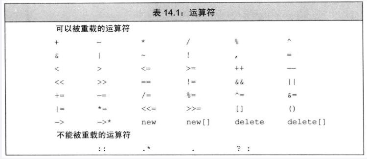
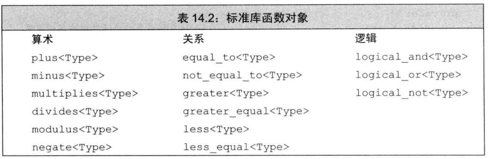
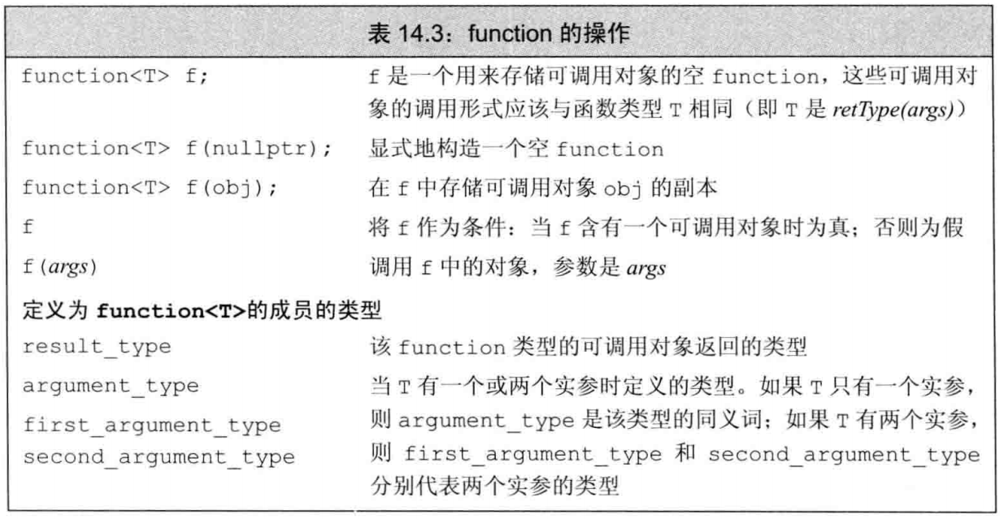
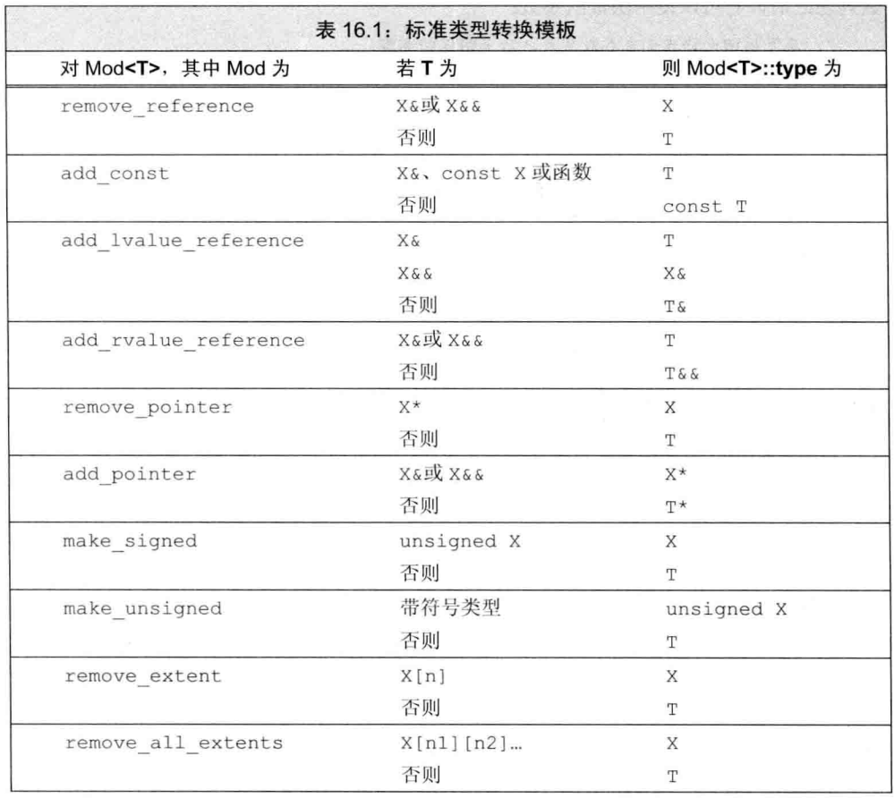

[TOC]

包含第13章到第16章内容

# 第十三章 拷贝控制

- 当定义一个类时，显示地或隐式地指定在此类的对象==拷贝、移动、赋值和销毁==时做什么
- 五种特殊的成员函数来控制这些操作，这些操作称为拷贝控制操作
  1. 拷贝构造函数：定义了当用同类型的另一个对象初始化本对象时做什么
  2. 拷贝赋值运算符：将一个对象赋予同类型的另一个对象时做什么
  3. 移动构造函数：定义了当用同类型的另一个对象初始化本对象时做什么
  4. 移动赋值函数：将一个对象赋予同类型的另一个对象时做什么
  5. 析构函数：定义了当此类型对象销毁时做什么
- 不显示定义这些操作，编译器也会为我们定义，但编译器定义的版本的行为可能并非我们所想

## 13.1 拷贝、赋值与销毁

### 13.1.1 拷贝构造函数

- 如果一个构造函数的第一个参数是==自身类类型的引用==，且任何额外参数都有默认值（即调用时最少只需要传入一个参数），则此构造函数为拷贝构造函数
- 第一个参数必须是一个==引用类型==，虽然可以定义一个接受非const引用的拷贝构造函数，但此参数几乎总是一个==const==的引用
- 拷贝构造函数在很多情况下都会被隐式使用，因此，拷贝构造函数通常==不应该是explicit==的

```c++
class Foo{
public:
    Foo(); //默认构造函数
    Foo(const Foo&); //拷贝构造函数
}
```

#### 合成拷贝构造函数

- 即使我们定义了其他构造函数，但是没有定义拷贝构造函数，那么编译器也会为我们==合成一个默认拷贝构造函数==
- 合成拷贝构造函数的作用有两种（它们是==或关系==）：
  - 用来组织我们拷贝该类的对象
  - 将其参数的成员逐个拷贝到正在创建的对象中，依次将每个==非static成员==拷贝到正在创建的对象中
- 合成拷贝构造函数如何拷贝成员，由==成员的类型==决定：
  - 类类型：使用其拷贝构造函数拷贝
  - 内置类型（除了数组）：直接拷贝
  - 内置数组：逐元素地拷贝

#### 拷贝初始化

区分直接初始化与拷贝初始化：

- ==直接初始化==实际上是要求编译器使用普通的函数匹配来选择最匹配的构造函数创建一个对
- ==拷贝初始化==则是要求编译器将右侧运算对象拷贝到正在创建的对象中（定义时用对象初始化），如果需要的化还要进行类型转换

```c++
string dots(10, '-') //直接初始化
string s(dots);           //直接初始化
string s2=dots;        //拷贝初始化
string null_book="9-999-99999-9";    //拷贝初始化
string nines=string(100,'9');        //拷贝初始化
```

拷贝初始化不仅在我们用=定义变量时会发生，在下列情况下也会发生

- 将一个对象作为实参传递给一个==非引用类型==的形参时
- 从一个函数返回一个==非引用类型==的对象时
- 用==花括号==初始化一个数组中的元素或一个聚合类中的成员时
- 某些类类型还会对它所分配的对象使用拷贝初始化，如初始化标准库容器或是调用其==insert或push==成员，进行的是拷贝初始化；调用==emplace==进行的直接初始化

#### 参数和返回值

- 为什么拷贝构造函数自己的参数必须是==引用类型==：
  - 因为拷贝构造函数被用来初始化非引用类类型参数，如果其参数不是引用类型，则==调用永远不会成功==

### 13.1.2 拷贝赋值运算符

- 类可以控制其对象如何赋值
- 如果类未定义自己的拷贝赋值运算符，那么编译器也会==合成一个默认的拷贝赋值运算符==

#### 重载赋值运算

- 重载运算符将在14章详细介绍，这里先是简单的说一下
- 重载运算符本质上是函数，其函数名由operator关键字后接表示要定义的运算符的符号组成，对于赋值运算符来说就是名为`operator=`的函数
- 重载运算符的参数表示运算符的==运算对象==，某些运算符，包括赋值运算符，必须定义为==成员函数==
- 如果一个运算符是一个成员函数
  - 其左侧运算对象就绑定到==隐式的this参数==
  - 对于一个二元运算符，例如赋值运算，其右侧运算对象作为==显示参数传递==

```
class Foo{
public:
Foo& operator=(const Foo&);    //赋值运算符
}
```

- 赋值运算符通常返回一个指向其左侧运算对象的==引用==，标准库通常要求保存在容器中的类型要具有赋值运算符，且返回值是其左侧对象的引用

#### 合成拷贝赋值运算符

- 合成拷贝赋值运算符的作用有两种（它们是==或==关系）：
  - 用来禁止该类对象的赋值
  - 将右侧运算对象的每个非static成员赋予运算符左侧运算对象的对应成员
- 合成拷贝赋值运算符如何赋值成员，由成员的类型决定：
  - 类类型：使用其拷贝赋值运算符
  - 内置类型（除了数组）：直接赋值
  - 内置数组：逐元素地赋值

```C++
//等价于合成拷贝运算符
Sales_data& Sales_data::operator=(const Sales_data &rhs)
{
	bookNo = rhs.bookNo;          // calls the string::operator=
	units_sold = rhs.units_sold;  // uses the built-in int assignment
	revenue = rhs.revenue;        // uses the built-in double assignment
	return *this;                 // return a reference to this object
}
```

### 13.1.3 析构函数

- 析构函数释放函数对象使用的资源，并且销毁对象的==非static数据成员==
- 析构函数是类的成员函数，其==没有返回值==，也==不接受任何参数==，所以其==不可以被重载==，对一个给定类，只会有一个==唯一的析构函数==
- 函数名由波浪号接类名构成

```C++
class Foo{
public:
    ~Foo(); //析构函数
}
```

#### 析构函数完成什么工作

- 析构函数由一个函数体和析构部分组成
  - 首先执行==函数体==
  - 然后执行析构部分（析构部分是==隐式的==），销毁成员，成员销毁按初始化顺序的==逆序==销毁
- 成员销毁时发生什么完全依赖于成员的类型
  - 类类型：执行==自己的析构函数==（==智能指针==是类类型，具有析构函数，在析构阶段会被自动销毁）
  - 内置类型：==什么也不做==（注意：隐式销毁==内置指针类型==的成员==不会delete==它所指向的对象）

#### 什么时候调用析构函数

- 无论何时一个对象被==销毁==，就会自动调用其析构函数：
  - 变量在离开其作用域时被销毁
  - 当一个对象被销毁，其成员被销毁
  - 容器（标准容器或数组）被销毁时，其元素被销毁
  - 动态分配的对象，当对指向它的指针应用delete时被销毁
  - 对于临时对象，创建它的完整表达式结束时被销毁
- 析构函数是==自动运行==的
- 当指向一个对象的引用或指针离开作用域时，被指向的对象的析构函数不会执行

#### 合成析构函数

- 当类未定义自己的析构函数时，编辑器会自己定义一个==合成析构函数==
  - 对于某些类，合成析构函数被用来阻止该类型的对象被销毁
  - 如果不是以上情况，合成析构函数的函数体就为空。在（空）析构函数执行完毕后，成员会被自动销毁（标准库的类会自动释放，内置类型变量什么也不做，==指针指向的对象==不会被销毁）
- 析构函数自身并不直接销毁成员。成员实在析构函数体之后==隐含的析构阶段==中被销毁的
- 析构函数体是作为成语销毁之外的另一部分而进行的

### 13.1.4 三/五法则

- 如果一个类需要一个==析构函数==，我们几乎可以肯定它也需要一个拷贝构造函数和一个拷贝赋值运算符
- 如果一个类需要一个拷贝构造函数，几乎可以肯定它也需要一个拷贝赋值运算符，反之亦然
- 无论是需要拷贝构造函数还是拷贝赋值运算符都不必然意味着也需要析构函数

```C++
~Sales_data() =default; //显示的要求编译器生成合成的析构函数
```

### 13.1.6 阻止拷贝

- 有时候类必须采取某种机制阻止拷贝和赋值
  - iostream类就阻止了拷贝，以避免多个对象写入或读取相同IO缓冲

#### 定义删除的函数

- 通过将拷贝构造函数和拷贝运算符定义成==删除的函数==来阻止拷贝
- 虽然声明了它们，但==不能以任何方式==使用它们
- 方式是在参数列表后加上=default来指出我们希望将它定义为删除的
- =delete通知编译器（以及代码的读者），我们不希望定义这些成员
- 与=default不同之处
  - =delete必须是在==函数第一次声明==出现的时候
  - 可以对任何函数指定delete（除了==析构函数==）
- 当我们希望引导函数匹配过程时，删除函数有时也是很有用的

```
struct NoCopy{
    ...
    NoCopy(const NoCapy& ) = delete; //阻止拷贝构造函数
    ...
}
```

#### 析构函数不能是删除的成员

- 我们不能定义析构函数是删除函数
- 如果将析构函数定义成删除函数（或是类的某个成员的类型是删除析构函数），我们不能定义该类的变量或临时对象
- 可以定义动态分配这种类型的对象。但是，不能释放这些对象

```
struct NoDtor{
    NoDtor() = default;
    ~NoDtor() = delete;
}

NoDtor nd; //错误，NoDtor的析构函数是删除的 
NoDtor *p = new NoDtor(); //正确
delete p; //错误，NoDtor的析构函数是删除的
```

#### 合成的拷贝控制成员可能是删除的

- 如果一个类有数据成员不能默认构造、拷贝、复制或销毁，则对应的成员函数将被定义为删除的
- 一个成员有删除的或不可访问的析构函数会导致合成的默认和拷贝构造函数被定义为删除的
- 对于具有==引用成员或const成员==的类，编译器不会为其==合成默认构造函数==，也不能使用==合成的拷贝赋值运算符==
  - 原因：试图赋值所有成员，而将一个新值赋予一个const对象是不可能的

#### private拷贝控制

- 在新标准发布之前，类是通过将其拷贝构造函数和拷贝赋值运算符声明为private来阻止拷贝的
- 为了阻止友元和成员函数进行拷贝，我们将这些拷贝控制成员声明为private的，但并不定义它们
- 声明但不定义一个成员函数是==合法的==，对此只有一个例外（将在15.2.1介绍）
  - 试图访问一个==未定义的成员将导致一个链接时错误==
- 通过声明（但不定义）private的拷贝构造函数，可以预先阻止任何拷贝该类型对象的企图
  - 试图拷贝对象的用户代码将在==编译阶段==被标记为错误
  - 成员函数或友元函数中的拷贝操作将导致==链接时错误==

## 13.2 拷贝控制和资源管理

- 拷贝控制和资源管理有两种方式
  - 令类的行为像一个值
  - 令类的行为像一个指针
- 但也有既不像值也不像指针，例如IO类和unique_ptr不允许拷贝和赋值
- 如何拷贝==指针成员==决定了类是具有类值行为还是类指针行为

### 13.2.1 行为像值的类

- 类值的行为，对于类管理的资源，每个对象都应该拥有==一份自己的拷贝==
- 当你编写==赋值运算符==时，需要记住：如果将一个对象赋予它==自身==，赋值运算必须能正确工作（最主要的是赋值和销毁的顺序）。一个好的方法是先将右侧运算对象拷贝到一个局部临时对象中。当拷贝完成后，销毁左侧运算对象的现有成员是安全的。

### 13.2.2 定义行为像指针的类

- 类似指针的类，拷贝指针成员本身而不是它指向的内容
- 仍然需要自己的析构函数来释放指针成员指向的内存，但==不能单方面地释放==，只有当最后一个指向该内存的类的成员销毁时，才可以释放。最好的方法是使用==shared_ptr==

## 13.3 交换操作

- 管理资源的类通常还定义一个名为==swap==的函数
- 如果一个类定义了自己的swap，那么算法将使用类自定义版本；否则算法会使用==标准库中的swap==
- 内置类型是==没有特定版本==的swap的，所以会调用标准库的std::swap；如果一个类的成员有自己类型特定的swap函数，调用==std::swap就是错误==的了
- 如果存在类型特定的swap版本，其匹配程序优于std中定义的版本，不存在时才会调用std::swap

#### 在赋值运算符中使用swap

- 定义swap的类通常用swap来定义它们的赋值运算符，这些运算符使用了一种名为拷贝并交换的技术

```C++
//注意rhs是按值传递的，意味着HasPtr的拷贝构造函数将右侧运算对象拷贝的rhs
HasPtr& HasPtr::operator = (HasPtr rhs) {
    //交换左侧运算对象和局部变量rhs的内容
    swap(*this, rhs); //rhs现在只想本对象曾经使用的内存
    return  *this;  //局部变量rhs离开函数体，它被销毁，从而delete了rhs中的指针
} 
```

## 13.6 对象移动

- 存在对象移动的原因：
  - 在重新分配内存的过程中，从旧内存将元素拷贝到新内存是不必要的，更好的方式是==移动元素==
  - ==IO类或unique_ptr==这样的类，都包含了不能被共享的资源（如指针或IO缓冲），因此这些类的对象==不能拷贝只能移动==

### 13.6.1 ==右值引用==

- 右值引用：必须绑定到==右值==的引用，但只能绑定到一个==将要销毁==的对象，通过&&来获得右值的引用
- 我们可以自由地将一个右值引用的资源“移动”到另一个对象中
- 一个左值表达式表示的是一个==对象的身份==，而一个右值表达式表示的是==对象的值==
- 右值表达式可以绑定到：
  - 要求转换的表达式
  - 字面常量（绑定在字面值时，它会用字面值构造一个临时变量，右值引用再绑定到这个临时变量上）
  - 返回右值的表达式

```C++
int i = 42;
int &r = i; // 正确
int &&rr = i ; // 错误，不能将一个右值引用绑定到一个左值上
int &r2 = i * 42 ; // 错误，i*42是右值
const int &r3 = i*42; // 正确，我们可以将一个 const 的引用绑定到一个右值上
int &&rr2 = i * 42 // 正确
```

- 对比内置类型与自定义类类型的左值引用和右值引用

```C++
Foo f(5);
Foo &&rref = f; //错误，右值引用不能绑定到变量上
Foo &&rref2 = Foo(5); //正确，Foo(5)是一个临时量，是一个右值
Foo(5) = Foo(8); //正确，修改了临时量的值
rref2 = Foo(8); //正确，修改了临时量的值

int i = 5;
int &&rref = i; //错误，右值引用不能绑定到变量上
int &&rref2 = 5; //正确，5是个整型字面值常量，会使用5来创建一个临时量，然后rref2绑定到这个临时变量上
5 = 8; //错误，不能对字面值赋值
rref2 = 8; //正确，相当于修改了rref2绑定在的那个临时量的值
```

- 右值引用或const的左值引用都可以绑定到右值上
- 返回左值的例子：
  - 返回左值引用的函数
  - 赋值运算符
  - 下标运算符
  - 解引用运算符  * 
  - 前置递增/递减运算符
- 返回右值的例子
  - 返回非引用类型的函数
  - 算术运算符
  - 关系运算符
  - 位运算符
  - 后置递增/递减运算符

#### 左值持久，右值短暂

- 左值有持久的状态
- 右值要么是==字面常量==，要么是在表达式求值过程中创建的==临时对象==，都具有==短暂性==
- 由于右值引用只能绑定到临时对象，我们知道
  - 所引用的对象将要被销毁
  - 该对象没有其他用户
- 使用右值引用的代码可以自由地接管所引用的对象的资源
- 变量是左值，因此我们不能将一个右值引用直接绑定到一个变量上，即使这个变量是右值引用类型也不行

```C++
int &&rr1 = 42; //正确，字面值常量是右值
int &&rr2 = rr1; //错误，表达式rr1是左值
```

#### 标准库move函数

- 可以==显式==的将一个左值转换为对应的==右值引用==类型
- 调用move，在头文件==utility==中
- move告诉编译器，我们有一个左值，但我们希望像==右值==一样处理它
- 调用move就意味着承诺：除了对rr1==赋值或销毁==它外，将不再使用它，即对于移后源对象，可以==销毁，可以赋值==，但==不能再使用它的值==

```
int &&rr3 = std::move(rr1); //正确
```

### 13.6.2 移动构造函数和移动赋值运算符

- 移动构造函数和移动赋值运算符从给定的对象==“窃取”资源==而不是拷贝资源
- 移动构造函数的第一个参数是该类类型的一个==右值引用==。与拷贝构造函数一样，任何额外的参数都必须有默认实参
- 一旦资源完成移动，源对象必须==不再指向被移动的资源==，这些资源的所有权已经归属新创建的对象

```C++
//noexcept表示：移动操作不抛出任何异常
//成员初始化其接管s中的资源
StrVec:StrVec(StrVec &&s) noexcept :: elements(s.elements) ,first_free(s.first_free) , cap(s.cap)
{
    //令s中的指针成员为空，对其运行析构函数后，就不会释放之前它指向的资源
    s.elements = s.first_free = s.cap =nullptr;
}
```

#### 移动操作、标准库容器和异常

- 由于移动资源，通常是==不分配任何资源==的，因此通常不会抛出任何异常
- 当编写一个不抛出异常的移动操作时，我们应该告诉标准库，来阻止标准库为了处理抛出异常的可能性而做的一些额外的工作
- 一种通知方法就是使用==noexcept==，必须在==声明和定义==（如果定义在类外）都指定noexcept
- 不抛出异常的移动构造函数和移动赋值运算符必须标记为==noexcept==
- 如果希望在vector重新分配内存，这类情况下对自己定义类型的对象进行移动而不是拷贝，那么就显示的告诉标准库我们的移动构造函数可以安全的使用。通过标记为noexcept来做到

#### 移动赋值运算符

- 移动赋值运算符执行与==析构函数和移动构造函数==相同的工作（析构函数+移动构造函数）

#### 移后源对象必须可解析

- 编写一个移动操作时，必须确保移后源对象进入一个==可解析的状态==（如将指针成员设为nullptr）
- 在移动操作之后，移后==源对象必须保持有效的，可析构==的状态，但是用户不能对其值进行任何假设

#### 合成的移动操作

- 编译器会==合成移动构造函数和移动赋值运算符==
- 如果一个类定义了自己的==拷贝构造函数、拷贝赋值运算符或析构函数==，编译器就不会为它合成移动构造函数和移动赋值运算符
- 如果一个类没有移动操作，通过正常的函数匹配，类会使用对应的==拷贝操作来替代移动==
- 只有当一个类没有定义任何自己版本的拷贝控制成员，且类的每个==非static数据成员都可以移动时==，编辑器才会为他们合成移动构造函数或移动赋值运算符
- 编译器可以移动内置类型成员，还能移动定义了对应移动操作的类

```
struct X hasX{
    X mem; //X有合成的移动操作
}

hasX hx,hx2 = std::move(hx); //使用合成的移动构造函数
```

- 移动操作永远不会隐式地定义为删除的函数
- 如果我们现实第要求编译器生成=default的移动操作，且编译器不能移动所有成员，则编译器会将移动操作定义为删除的函数，例如：如果有类成员是const的或是引用，则类的移动赋值运算符将被定义为删除的
- 定义了一个移动构造函数或移动赋值运算符的类必须也定义自己的拷贝操作。否则，这些成员默认被定义为删除的

#### 移动右值，拷贝左值……

- 如果一个类既有移动构造函数，也有拷贝构造函数，编译器使用普通的函数匹配规则来确定使用哪个构造函数（传左值用拷贝，传右值用移动）

#### ……但如果没有移动构造函数，右值也将被拷贝

- 如果一个类没有移动构造函数，函数匹配则确保该类的对象会被拷贝，即使我们使用move来移动，调用的也是拷贝构造函数
- 以上能成功的原因：可以将一个==&&转换为const &==（即右值引用转换为常量左值引用）
- 用拷贝构造函数代替移动构造函数几乎肯定是安全的（赋值运算的情况类似）

```C++
Foo z(std::move(x)); //调用拷贝构造函数，因为未定义移动构造函数
```

#### 更新三/五法则

- 如果一个类定义了==任何一个拷贝操作==，它就应该定义所有==五个操作==

#### 移动迭代器

- 移动迭代器的解引用生成的是一个==右值引用==
- 通过标准库的`make_move_iterator`函数将一个普通迭代器转换为一个移动迭代器，接受一个迭代器参数，返回一个==移动迭代器==
- 原迭代器的所有除解引用以外的操作都在移动迭代器中照常工作

```c++
//construct将使用移动构造函数来创造元素（该类需要有移动构造函数）
uninitialized_copy(make_move_iterator(begin()),make_move_iterator(end()),first);
```

### 13.6.3 右值引用和成员函数

- 区分移动和拷贝的重载函数
  - 一个版本接受一个指向const的左值引用（拷贝）
  - 一个版本接受指向非const的右值引用（移动）

```
void push_back(const X&); //拷贝：百度到任意类型的X，可以是std::move(x)
void push_back(X&&); //移动：只能帮到到类型X的可修改的右值，此版本对于非const的右值是精确匹配
```

#### 右值和左值引用成员函数

- ==引用限定符==可以是&或&&，分别指出**this可以指向一个左值或右值**
- 引用限定符只能用于（非static）成员函数，且必须同时出现在函数的声明和定义中
- 对于&限定的函数，调用该函数的对象只能是==左值==；对于&&限定的函数，调用该函数的对象只能是==右值==；对于没有限定的函数，调用该函数的对象可以是==左值，也可以是右值==

```
Foo &operator=(const Foo&) &;
Foo &retFoo();  //返回一个引用，retFoo调用是一个左值
Foo retVal(); //返回一个值，retVal调用是一个右值
Foo i,j; //i和j是左值
i = j; //正确，i是左值
retFoo() = j; //正确，retFoo()是一个左值
retVal() = j; //错误，retVal()是一个右值
i = retVal(); //正确，可以将一个右值作为赋值操作的右侧运算对象
```

- 同时使用const和引用限定，引用限定符必须跟随在const限定符之==后==

```C++
Foo anotherMem() const &;  //const表示this是一个指向常量的常指针，而&表示this指向的是一个左值，即调用对象为一个常量左值（其实一个右值也可以调用这个函数）
```

#### 重载和引用函数

- 引用限定符可以用以区分==重载版本==
- 可以综合引用限定符和const来区分一个函数的==重载版本==

```c++
class Foo {
public:
    Foo sorted() &&; //只能用于右值调用对象
    Foo sorted() const &; //可以用于任何类型的Foo（左值、右值），但如果是右值，又存在上一条函数，那么上一条函数为精确匹配

private:
    vector<int> data;
};
//本对象（*this）为右值，因此可以原地址排序
Foo Foo::sorted() &&
{
    sort(data.begin(),data.end());
    return *this;
}
//本对象（*this）是const的一个左值（这里原书有错），因为const所以不能原址排序，需要使用副本
Foo Foo::sorted() const &
{
    Foo ret(*this); //拷贝一个副本  
    sort(ret.data.begin(),ret.data.end()); //排序副本
    return ret; //返回副本
}

retVal().sorted(); //retVal()是一个右值，调用Foo sorted() &&
retFoo().sorted(); //retFoo()是一个左值，调用Foo sorted() const &
```

- 再举一例

```C++
class Foo {
public:
    Foo sorted() &&; //只能用于右值调用对象
    Foo sorted() &; // 只能用于左值调用对象
}

Foo().sorted(); //调用的是Foo sorted() &&
Foo f;
f.sorted(); //调用的是Foo sorted() &
```

- 在const &函数中可以看到，当一个const右值或一个左值执行sorted时，我们不能改变对象，因此需要在排序前拷贝data

------

- 如果一个成员函数有引用限定符，则==具有相同参数列表的所有版本都必须有引用限定符==

------

## 小结

- 拷贝构造函数、移动构造函数、拷贝赋值运算符、移动赋值运算符、析构函数
- 移动构造函数和移动赋值运算符接受一个（通常是非const的）右值引用
- 拷贝构造函数和拷贝赋值运算符接受一个（通常是const的）普通左值引用
- 如果一个类未声明以上五个操作，编译器会自动为其合成。如果这些操作未定义为删除的，它们会逐成员初始化、移动、赋值或销毁对象：合成的操作依次处理每个非static的数据成员，根据成员类型确定如何移动、拷贝、赋值或销毁它
- 一个类需要析构函数，则它肯定也需要定义移动和拷贝构造函数及移动和拷贝赋值运算符

# 第十四章 重载运算与类型转换

## 14.1 基本概念

- 重载的运算符是具有特殊名字的函数
  - 它们的名字由operator加要定义的运算符组成
- 重载运算符的参数数量与该运算符作用的运算对象==一样多==，但就作为类成员的重载运算符函数，调用对象是==隐式的第一个参数==，所以参数列表会比运算符作用的运算对象==少一个==
- 除了重载的函数调用运算符==operator()==之外，其他重载运算符不能含有默认参数
- 运算符函数，参数至少有一个是类类型==（不能全是内置类型）==，即
  - 或者是类的成员函数
  - 或者是至少含有一个类类型的参数的非成员函数

```c++
int operator+(int, int)；//非成员函数，错误，不能为int重定义内置的运算符
```

- 只能重载已有的运算符，不能发明新的运算符号
- `+`、`-`、`*`、`&`既是一元运算符，也是二元运算符
  - 所有这些运算符都能被重载
  - 从参数的数量可以判断定义的是那种运算符
- 重载运算符的优先级和结合律不改变

- 运算符表如下：



#### 直接调用一个重载的运算符函数

- 可以像调用普通函数一样调用运算符函数

```C++
//一个非成员函数的等价调用
data1+data2;
operator+(data1,data2);

//成员函数的等价调用
data1.operator+(data2);
```

#### 某些运算符不应该被重载

- 逻辑与&&、逻辑或||、逗号运算符.因重载版本无法保留求值顺序和/或短路求值属性，因此不建议重载它们
- 通常情况下也不重载取址符号

#### 使用与内置类型一致的含义

- 重载运算符的返回类型通常下应该与内置版本的返回类型兼容

#### 选择作为成员或非成员

- 有的运算符必须作为成员：赋值（`=`）、下标（`[]`）、调用（`()`）、成员访问箭头（`->`）
- 含有类对象的混合类型表达式，运算符必须定义成非成员函数，当我们把这样的运算符定义为成员函数时，它的左侧对象必须是运算符所属的类的一个对象，这样就不能交换运算符两侧的对象了

```C++
string s = "word";
string t = s + "!"; //正确，string类重载了+
string u = "hi" + s; //如果+是string的成员，则错误"hi"是const char* 类型
```

### 14.2.2 重载输入运算符>>

- 第一个形参是运算符将要读取的==流的引用==
- 第二个参数是将要读入到的==非常量对象的引用==
- 返回某个给定==流的引用==
- 必须是==非成员函数===
- 且是==第二个参数类类型==的==友元函数==
- 输入运算符必须处理输入==可能失败的==情况，输出运算符不需要

```C++
istream &operator>>(istream &is, Sales_data &item);
```

- 可能发生的错误：
  - 当流含有错误类型的数据读取操作可能失败
  - 当读取操作到达文件末尾或遇到输入流的其他错误时也会失败

## 14.3 算术和关系运算符

- 算术和关系运算符定义成非成员函数以允许左侧或右侧的运算对象进行转换
- 形参都是==常量的引用==

```C++
Sales_data operator+(const Sales_data &lhs, const Sales_data &rhs);
```

### 14.3.1 相等运算符

- 通常情况下，相等运算符来检验两个对象是否相等，会比较对象的每一个数据成员
- 如果类定义了====，也应该定义!=，==反之亦然

```C++
bool operator==(const Sales_data &lhs, const Sales_data &rhs);

bool operator!=(const Sales_data &lhs, const Sales_data &rhs);
```

### 14.3.2 关系运算符

- 因为关联容器和一些算法要用到小于运算符，所以定义operator<比较有用

## 14.4 赋值运算符

- 运算符接受花括号内的元素列表作为参数

```C++
strVec<string> v;
v = {"a","an","the"};

//这样定义赋值运算符就可以接受元素列表
strVec &operator=(std::initializer_list<std::string>);
```

- 无论形参的类型是什么，赋值运算符必须定义为==成员函数==

#### 复合赋值运算符

```C++
//作为成员函数的二元运算符：左侧对象绑定到隐式的this指针
Sales_data &Sales_data::operator+=(const Sales_data &rhs);
```

## 14.5 下标运算符

- 必须是==成员函数==
- 返回值通常为所访问元素的==引用==，好处是下标运算符可以出现在赋值运算符的任意一端
- 如果一个类包含下标运算符，则它通常会定义两个版本：
  - 返回==普通引用==
  - 是类的常量成员并且返回==常量引用==，用于该类的常量对象的调用

```c++
string& operator[](size_t n);
const string& operator[](size_t n) const;
```

## 14.7 成员访问运算符

- 箭头运算符必须是==类的成员==
- 解引用运算符==通常是类的成员==

```C++
class strBlobPtr {
public:
    string& operator*() const
    {
        auto p = check(curr,"dereference past end");
        return (*p)[curr];  //(*p)是对象所指的vector
    }
    
    string* operator->() const
    {
        //将实际工作委托给解引用运算符
        return & this->operator*();
    }
};

StrBlob a1 = {"hi","bye","now"};
strBlobPtr p(a1); //p指向a1的首元素赋值
/*
给a1的首元素赋值
相当于：
string &temp = (*p)[0]
temp = "okay"
*/
*p = "okay"; 
/*
打印4，即a1首元素的大小
相当于：
string *temp = &((*p)[0])
size_t c = temp.size();
cout << c << endl;
*/
cout << p->size() <<endl;
```

#### 对箭头运算符返回值的限定

- 形如

  ```C++
  point->mem
  ```

  的表达式，point是：

  - 指向类对象的指针
  - 重载了operator->的类的对象

- point->mem分别等价于

```C++
(*point).mem; //point是一个内置的指针类型
point.operator->()mem; //point是类的一个对象
```

- 重载的箭头运算符必须返回：
  - 类的指针
  - 自定义了箭头运算符的某个类的对象

## 14.8 函数调用运算符

- 如果重载了==函数调用运算符==，则可以像使用函数一样使用该类的对象
- 函数调用运算符必须是==成员函数==
- 一个类可以定义多个不同版本的调用运算符，相互之间应该在参数数量或类型上有所区别
- 如果类定义了调用运算符，则==该类的对象称作**函数对象**==

```C++
struct absInt {
    int operator()(int val) const {
        return val < 0 ? -val : val;
    }
};

    int i = -42;
    absInt absObj;             
    unsigned ui = absObj(i);  //将i传递给absObj.operator()(int)
```

### 14.8.1 lambda是函数对象

- 编写已给lambda后，编译器将该表达式翻译成一个未命名类的未命名对象，在lambda表达式产生的类中含有一个重载的函数调用运算符

```C++
stable_sort(words.begin(),word.end(),[](const string&a, const string&b)
                                            { return s1.size() < s2.size(); });
                                            
//其行为类似下面这个类的未命名对象
class shorterString
{
public:
    bool operator()(const string&a, const string&b) const
    { return s1.size() < s2.size(); }
}
```

- 在传入可调用对象的地方传入一个类对象，则会调用该对象的调用运算符

```C++
stable_sort(words.begin(),word.end(),shorterString());
```

#### 表示lambda及相应捕获行为的类

```C++
auto wc = find_if(words.begin(),word.end(),
                    [sz](const string &a)
                        { return a.size() >= sz; } );
                        


//该lambda表达式的类将形如：
class SizeComp{
    SizeComp(size_t n):sz(n){} //该形参对于捕获的变量
    bool operator()(const string &s) const
        { return s.size() >= sz; }
private:
    size_t sz; //该数据成员对应通过值捕获的变量
};

auto wc = find_if(words.begin(),word.end(),SizeComp(sz));
```

- lambda表达式产生的类==不含默认构造函数、赋值运算符、默认析构函数==；是否含有==默认的拷贝/移动构造函数==则通常要视捕获的数据成员的类型而定

### 14.8.2 标准库定义的函数对象

- 标准库定义了一组表示算术运算符、关系运算符、逻辑运算符的类，每个类分别定义了一个指向命令操作的调用运算符
- 这些类都被定义成模板的形式
- 定义在functional头文件中

```C++
plus<int> intAdd;  //可执行int加法的函数对
negate<int> intNegate; //可对int值取反的函数对象
//使用intAdd::operator(int,int)
int sum = intAdd(10,20); // sum = 30;
```



#### 在算法中使用标准库函数对象

```C++
//传入临时的函数对象
//sort比较元素时，不再是使用默认的<运算符，而是调用给定的greater函数对象
sort(svec.begin(),svec.end(),greater<string>());
```

### 14.8.3 可调用对象与function

- 可调用对象：
  - 函数
  - 函数指针
  - lamdba表达式
  - bind创建的对象
  - 重载了函数调用运算符的类
- 可调用对象也有类型
- 两个不同类型的可调用对象却可能共享同一种调用形式
- 调用形式：指明了调用返回的类型以及传递给调用的实参类型
- 一种调用形式对应一个函数类型

```C++
//这是一个函数类型
int(int,int)
```

- 定义一个函数表有两个方法：
  - 使用函数指针
  - 使用标准库function类型

#### 函数指针实现函数表

```
map<string,int(*)(int,int)> binops;
binops.insert("+",add); //add是一个函数名（也是函数的地址）
```

#### 标准库function类型实现函数表

- 定义在functional头文件
- function是一个模板
- function可以用可调用对象来初始化



```C++
function<int(int,int)> f1 = add; //函数指针
function<int(int,int)> f2 = divide(); //函数对象类的对象
function<int(int,int)> f3 = [](int i,int j){ return i*j; }; //lambda

//调用function
f1(4,2);
```

- 使用function实现函数表

```
map<string,function<int(int,int)>> binops;
binops.insert("+",add);
```

#### 重载的函数与function

- 不能（直接）将重载函数的名字存入function类型的对象中，会产生二义性，解决方法有：
  - 传入的是函数指针，而非函数的名字
  - 使用lambda表达式

```C++
//函数指针的方式
int (*fp)(int,int) = add; //指针指向的add是接受两个int的版本
binops.insert({"+",fp}); //正确，fp指向一个正确的add版本

//lambda的方式
binops.insert({"+",[](int a,int b){return add(a,b);}});
```

## 14.9 重载、类型转换与运算符

- **转换构造函数**和**类型转换运算符**共同定义了**类类型转换**，也称为**用户定义的类型转换**

### 14.9.1 类型转换运算符

- 类型转换函数的一般形式:

```
operator type() const;
```

**以下均为类型转换运算符的描述：**

- ==type==表示某种类型
- 只要转换的目标类型可以作为==返回类型==，就允许定义这个类型的转换，因此：
  - 不允许转换成：数组、函数类型
  - 可以转换成：指针（包括数组指针、函数指针）、==引用类型==
- 必须是==类的成员函数==
- 不能声明返回类型，但实际上每个类型转换函数都会返回一个对应类型的值
- 形参列表==必须为空==，因为类型转换运算符是隐式执行的，所以无法给这些函数传递实参，当然也就不能在类型转换运算符的定义中使用任何形参
- 应该是==const==的

```C++
class SmallInt{
public:
    //转换构造函数
    SmallInt(int i=0):val(i)
    {
        if(i<0 || i>255)
            throw std::out_of_range("Bad SmallInt value");
    }
    //类型转换运算符
    operator int() const { return val; }
}

SmallInt si;
si = 4; //首先将4隐式转换为SmallInt（调用转换构造函数），然后调用SmallInt::operator=
si + 3; //首先将si隐式转换成int（调用类型转换运算符），然后执行整数的加法
```

- 编译器一次只能执行==一次用户定义的类型转换==，但是隐式的用户定义类型转换可以置于一个标准（内置）类型转换之前或之后，并与其一起使用
  - 因此可以将任何算术类型（long int、double一类）传递给SmallInt的构造函数
  - 也可以用类型转换运算符将一个SmallInt对象转换成int，再转换成任何其他算术类型

```C++
//内置类型转换将double转为int，再调用SmallInt(int)构造函数
SmallInt si = 3.14; 
//SmallInt转为int（调用类型转换运算符），再内置类型转换将int转为double
si + 3.14
```

#### 显示的类型转换运算符

```C++
class SmallInt{
public:
    //转换构造函数
    SmallInt(int i=0):val(i)
    {
        if(i<0 || i>255)
            throw std::out_of_range("Bad SmallInt value");
    }
    //类型转换运算符，阻止隐式转换
    explicit operator int() const { return val; }
}

SmallInt si = 3; //正确，构造函数可以不是显示的
si + 3; //错误，此处需要隐式类型转换，但类的运算符只能是显示转换
static_cast<int>(si) + 3; //正确，显示地请求类型转换
```

- 该规定存在一个例外，即如果表达式被用作条件，则编译器会将显示的类型转换自动应用于它

### 14.9.2 避免有二义性的类型转换

- 产生多重路径有两种情况：
  - 第一种情况：两个类提供相同的类型转换：例如，当A定义了一个接受B类对象的转换构造函数，同时B类定义了一个转换目标是A类的类型转换运算符，同时存在两种由B获得A的方法，我们就说它们提供了相同的类型转换
  - 第二种情况：如果类定义了一组类型转换，它们的转换源（或者转换目标）类型本身可以通过其他类型转换联系在一起，则同样会产生二义性的问题。最典型的的例子是算术运算符，某个给定的类，最好只定义最多一个与算术类型有关的转换

#### 情况一：两个类提供相同的类型转换

```C++
struct B;

struct A {
    A() = default;
    A(const B&); //把一个B转换成A
    ...
};

struct B {
    operator A() const; //也是一个B转换成A
    ...
};

A f(const A&); //一个函数
B b;
//二义性错误，同时存在两种由B获得A的方法
//含义是f(B::operator A())还是f(A::A(const B&))？
A a = f(b);

//如果显示调用则不会出错
A a1 = f(b.operator A());
A a2 = f(A(b));
```

#### 情况二：二义性与转换目标为内置类型的多重类型转换

```C++
struct A {
    A(int = 0);  //最好不要创建两个转换源都是算术类型的类型转换
    A(double);
    operator int() const; //最好不要创建两个转换对象都是算术类型的转换
    operator double() const;
    ...
};

void f2(long double); //一个函数
A a;
//二义性错误
//含义是f(A::operator int())还是f(A::operator double())
f2(a);

long lg;
//二义性错误
//含义是A::A(int)还是A::A(double)
A a2(lg);
```

- 如果转换过程包含标准类型转换，则==标准类型转换的级别==将决定编译器选择最佳匹配的过程
- 注意“提升”和“转换”的区别

```C++
short s = 42;
//把short提示成int优于short转换成double
//因此调用的是A::A(int)
A a3(s); 
```

#### 重载函数与转换构造函数

- 当几个重载函数分属不同的类类型时，如果这些类恰好定义了同样的转换构造函数，则二义性问题将进一步提升：

```C++
struct C {
    C(int);
    ...
};

struct D {
    D(int);
    ...
};

void manip(const C&);
void manip(const D&);
//二义性错误
//含义是manip(C(10))还是manip(D(10))
manip(10);

//可以显示构造，这样可以消除二义性
manip(C(10));
```

#### 重载函数与用户定义的类型转换

```C++
sturct E {
    E (double);
    ...
};

void manip2(const C&);
void manip2(const E&);

//二义性错误，两个不同的用户定义的类型转换都能用在此处
//含义是manip2(C(10))还是manip2(E(10))
//因为调用重载函数所请求的用户定义的类型转换不止一个且彼此不同，所以该调用具有二义性
manip2(10);
```

- 上例中，即使其中一个调用需要额外的类型标准转换而另一个调用能精确匹配，编译器也会将该调用标示为错误
- 在调用重载函数时，如果需要额外的标准类型转换，则该转换的级别只有当所有可行函数都请求同一个用户定义的类型转换时才有用。如果所需的用户定义的类型转换不止一个，则该调用具有二义性

### 14.9.3 函数匹配与重载运算符

- 如果a是一种类类型，则表达式a sym b可能是：

```C++
a.operator sym(b); //a是一个operator sym()成员函数
operator sym(a,b); //operatorsym()是一个普通函数
```

- 不能通过调用的形式区分开当前调用的是成员函数还是非成员函数
- 使用运算符时有可能调用的是：
  - 内置版本
  - 非成员函数版本
  - 成员函数版本（如果左侧是类对象）
- 当我们调用一个命名的函数时，具有该名字的成员函数和非成员函数不会彼此重载，因为使用的是调用命名函数的语法形式
- 而当我们在表达式中使用重载运算符时，无法判断正在使用的是成员函数还是非成员函数，因此二者都应该在考虑的范围内

```C++
class SmallInt {
    friend SmallInt operator+(const SmallInt&, const SmallInt&);
public:
    SmallInt(int = 0);  //转换源为int的类型转换
    operator int() const{ return val; }; //转换目标为int的类型转换
private:
    std::size_t val;
};

SmallInt s1,s2;
SmallInt s3 = s1 + s2; //使用重载的operator+成员函数
//二义性错误
//含义是把0转换成SmallInt，然后使用重载的operator+成员函数
//还是把s3转换成int，使用执行int内置的加法运算
int i = s3 + 0; 
```

## 小结

- ==赋值、下标、函数调用和箭头运算必须作为类的成员==

# 第十五章 面向对象程序设计

## 15.1 OOP:概述

- 面向对象程序设计的核心思想是：
  - 数据抽象
  - 继承
  - 动态绑定

继承

- 基类：负责定义在层次关系中所有类共同拥有的成员
- 派生类：定义各自持有的成员
- 基类将类型相关的函数与派生类不做直接继承的函数区别对待
  - 基类希望派生类自定义合适自身版本的函数，声明成虚函数

```c++
class Quote
{
public:
    //希望直接继承的函数
    std::string isbn() const;
    //希望派生类自定义的类
    virtual double bet_price(std::size_t n) const;
    	
}
```

- 派生类使用**类派生列表**指出从哪些基类派生而来
- 派生类必须在内部对所有重新定义的虚函数进行声明
  - 使用virtual，但是不必须
  - 使用override：会检查是否正确覆盖虚函数

```c++
class Bult_quote : public Quote{
public:
    virtual double net_price(std::size_t n) const override;
}
```

#### 动态绑定

- 动态绑定可以让我们用同一段代码分别处理基类和派生类的对象
- 动态绑定又称为运行时绑定
- 当我们使用基类的**引用**或**指针**调用一个**虚函数**时发生动态绑定

## 15.2 定义基类和派生类

- 基类通常都应该定义一个==**虚析构函数**==，即使该函数不执行任何实际操作

#### 成员函数与继承

- 基类必须把它的两种成员函数区分：
  - 希望派生类进行覆盖的函数：虚函数，使用virtual
  - 希望派生类直接继承而不改变：普通函数
- 任何构造函数之外的==非静态函数都==可以是虚函数
- virtual关键字只能出现在==类内部的声明语句==中
- 虚函数在派生类中==隐式地==也是虚函数
- 虚函数的==解析过程发生在运行时==
- 成员函数如果没有被声明为虚函数，则其==解析过程发生在编译==时，而非运行时

#### 访问控制与继承

- 派生类==能访问基类的公有成员==
- 派生类==不能访问基类的私有成员==（只能通过基类提供的公有接口访问）
- 受保护的（protected）：基类希望它的==派生类有权访问该成员==，同时禁止其他用户访问

### 15.2.2 定义派生类

- 类派生列表的形式：冒号，后紧跟以逗号分隔的基类列表。每个基类前面，可以有三种访问说明符（public、private、protected）
- 访问说明符的作用是控制派生类从基类继承而来的成员是否对**派生类的用户**可见

```
class Bulk_quote : public Quote {...};
```

#### 派生类中的虚函数

- 基类中的虚函数函数体也可以有内容
- 派生类经常（但不总是）覆盖它继承的虚函数
  - 没覆盖：==直接继承基类的版本==
- 派生类可以在覆盖的虚函数前使用virtual，但不是必须
- 派生类可以显示地注明它使用某个成员函数覆盖了它继承的虚函数
  - 在形参列表、const、引用限定符后面添加一个==override==

#### 派生类对象及派生类向基类的类型转换

- 派生类对象有多个组成部分：
  - 派生类自定义（非静态）成员的子对象
  - 基类对应的子对象（如果有多个基类，则多个子对象）
- C++标准没有明确规定派生类的对象在内存中如何分布，在一个对象中，继承自基类的部分和派生类自定义的部分不一定是连续存储的

- 派生类到基类的类型转换（通常隐式执行）

```C++
Quote item; //基类对象
Bulk_quote bulk; //派生类对象
Quote *p = &item; 
p = &bulk; //p指向bulk的Quote部分
Quote &r = bulk; //r绑定到bulk的Quote部分
```

#### 派生类构造函数

- 派生类也必须使用==基类的构造函数==来初始化它的基类部分
- 派生类构造函数同样是通过构造函数初始化列表来将==实参传递给基类构造函数==的
- 首先初始化==基类的部分==，然后按照==**声明的顺序**==依次初始化派生类的成员

```C++
Bulk_quote(const string& book, double p, size_t qty, double disc) :
        Quote(book, p), min_qty(qty), discount(disc) { }
```

#### 派生类使用基类的成员

- 派生类可以访问基类的公有成员和受保护成员
- 对于派生类来说，它使用基类成员的方式与使用派生类成员的方式没有什么不同

#### 继承与静态成员

- 基类的静态成员：在整个继承体系中只存在==该成员的唯一定义==，既能通过基类使用它，也可以通过派生类使用 它

```C++
//在一个派生类的成员函数中访问基类的静态成员statemen()
Base::statemen(); //使用基类作用域符访问基类静态成员员
Derived::statemen(); //使用派生类作用域符访问基类静态成员
derived_obj.statemen(); //通过派生类对象访问基类静态成员
statement();  //使用this对象访问基类静态成员
```

#### 被用作基类的类

- 如果我们想将某个类用作基类，则该类必须定义过
- 一个类不能派生它本身，因为派生时自己还没定义

```C++
class Quote;  //声明但未定义
class Bulk_quote : public Quote {...}; //错误
```

- 一个类是基类，同时也可以是一个派生类
- 直接基类、间接基类（基类的基类）
- 派生类将包含：
  - 直接基类的子对象
  - 每个间接基类的子对象

#### 防止继承的发生

- 在类名后跟==final==：不能被继承，但可以继承自别其他类

```C++
class NoDerived final {...};
ckass Last final : Base {...};
```

### 15.2.3 类型转换与继承

- 可以将基类的指针（内置指针和智能指针）或引用绑定到派生类对象上

#### 静态类型与动态类型

- 静态类型：变量或表达式（包括指针或引用）声明时的类型，在==编译时确定==
- 动态类型：变量或表达式表示的内存中的对象的类型（指针或引用为指向的对象的类型），直到==运行时才确定==
- 表达式不是引用或指针，则==动态类型永远与静态类型一致==
- 引用或指针的动态类型要看绑定到什么类型的对象上

#### 不存在从基类向派生类的==隐式类型==转换……

- 因为一个基类的对象可能是派生类的一部分，也可能不是，所以不存在从基类向派生类的自动类型转换：

```C++
Quote base;
Bulk_quote* bulkP = &base; //错误，不能将基类转换成派生类
Bulk_quote& bulkRef = base; //错误，不能将基类转换成派生类
```

- 即使一个基类指针或引用绑定在一个派生类对象上，也不能指向从基类向派生类的转换：

```C++
Bull_quote bulk;
Quote *itemP = &bulk;
Bulk_quote *bulkP = itemP; //错误，不能将基类转换成派生类

Bulk_quote *bulkP = dynamic_cast<Bulk_quote *>itemP; //正确
```

- 如果在基类中含有一个或对个虚函数，使用dynamic_cast请求一个类型转换，该类型转换的安全检查将在==运行时执行==
- 已知某个基类向派生类的转换是安全的，可以使用==dynamic_cast==来强制覆盖掉编译器的检查工作

#### ……在对象之间不存在类型转换

- 派生类向基类的自动转换只对指针或引用类型有效，在派生类类型和基类类型之间==不存在这样的转换==
- 当我们用一个派生类对象为一个基类对象初始化或赋值时，只有该派生类对象中的==基类部分会被拷贝、移动或赋值==，它的派生类部分将被忽略

## 15.3 虚函数

- 所有虚函数都必须有==定义（包括基类）==，因为编译器也无法确定到底会使用哪个虚函数

#### 对虚函数的调用可能在==运行时才被解析==

- 直到运行时才能确定应该调用哪个版本的函数，调用的是与动态类型相匹配的那个
- ==动态绑定==只有当我们通过**指针**或**引用**调用**虚函数**时才会发生
- 通过一个具有**普通类型**（非引用非指针）的表达式调用**虚函数**时，在==编译时==就会将调用的版本确定下来
- 对非虚函数的调用（不管是普通类型还是指针或引用）在==编译时==进行绑定
- 当且仅当对通过==指针或引用调用虚函数==时，才会在运行时解析该调用，也只有在这种情况下对象的==动态类型才有可能与静态类型==不同

#### 派生类中的虚函数

- 派生类覆盖了某个继承而来的虚函数，它的==形参类型、返回类型必须与基类函数匹配==（如果不匹配，派生类函数将隐藏基类函数，则派生类中有两个函数）
- 对于返回类型一致，也有一个例外：
  - 当类的虚函数返回类型是类本身的指针或引用时
  - 例如：D由B派生得到，则基类的虚函数返回`B*`而派生类的对应函数可以返回`D*`

#### final和override说明符

- 如果使用override标记了某个函数，但该函数并没有覆盖已经存在的虚函数（在基类中不是虚函数、没有这个虚函数或虚函数形参类型不匹配等），编译器会报错：

```
void f1() const & override;
```

------

- 如果我们把==函数定义为final==，则之后任何（派生类中）尝试覆盖该函数的操作都将引发错误

------

- final和override说明符出现在形参列表、const、引用修饰符和尾至返回类型之后

#### 虚函数与默认参数

- 虚函数也可以拥有默认实参
- 如果通过==基类的引用或指针调用函数==，则使用==基类==中定义的默认实参，即使运行时实际运行的是派生类中的函数版本
- 基类和派生类中定义的==默认实参最好一致==

#### 回避虚函数的机制

- 希望对虚函数的调用不要进行动态绑定，而是强迫其执行虚函数的某个特定版本，使用作用域运算符

```C++
double undiscounted = baseP->Quote::net_price(42);
```

## 15.4 抽象基类

#### 纯虚函数

- 一个纯虚函数无须定义，我们通过在函数体的位置（即在声明语句的分号之前）书写=0就可以将一个虚函数说明为==纯虚函数==，只能出现在==类内部的虚函数声明语句处==
- 可以为纯虚函数提供定义，但函数体必须定义在类的外部。不能在类的内部为一个=0的纯虚函数提供函数体

```
double net_price(size_t) const = 0;
```

#### 含有纯虚函数的类是==抽象基类==

- 含有（或未经覆盖直接继承）纯虚函数的类是抽象基类
- 不能（直接）创建一个抽象基类的对象
- 可以定义抽象基类的派生类的对象，前提是这些派生类覆盖了抽象基类的纯虚函数

#### 重构

- 重构负责重新设计类的体系以便将操作和/或数据从一个类移动到另一个类

## 15.5 访问控制与继承

#### 受保护的成员

- 一个类使用protected关键字来声明那些它希望与派生类分享但不想被其他公共访问使用的成员
- 受保护的成员对于==派生类的成员和友元==来说是可访问的
- 派生类成员或友元只能通过==**派生类对象**==访问基类的受保护成员。派生类对于一个**基类对象**中的受保护成员没有任何访问权限

```C++
class Base {
protected:
    int prot_mem; 
};

class Sneaky : public Base {
    friend void clobber(Sneaky&); //能访问Sneaky::prot_mem
    friend void clobber(Base&); //不能访问Base::prot_mem
    int j; //j默认是private
}
```

#### 公有、私有和受保护继承

#### 派生类向基类转换的可访问性

- 参考

  C/C++ 公有继承、保护继承和私有继承的区别

  ，这里的内容包括书本以下三个部分的内容：

  - “公有、私有和受保护继承”
  - “派生类向基类转换的可访问性”

> 下面为引用上述博客的内容

**公有、私有和受保护继承**

- 某个类对其继承而来的成员的访问权限受到两个因素影响：
  - 基类中该成员的访问说明符
  - 派生类的派生列表中的访问说明符
- 在c++的继承控制中，有三种不同的控制权限，分别是public、protected和private
- 定义派生类时，若不显示加上这三个关键字，就会使用默认的方式
  - struct定义的类是默认public继承
  - class定义的类是默认private继承

------

- 使用

  public继承

  时，派生类内部可以访问基类中==public和protected成员==，但是类外只能通过派生类的对象访问基类的public成员

  - 基类的public成员在派生类中依然是public的
  - 基类中的protected成员在派生类中依然是protected的
  - 基类中的private成员在==派生类中不可访问==

- 使用

  protected继承

  时，派生类内部可以访问基类中==public和protected成员==，并且类外也不能通过派生类的对象访问基类的成员（可以在派生类中添加公有成员函数接口间接访问基类中的public和protected成员）

  - 基类的public成员在派生类中变为protected成员
  - 基类的protected成员在派生类中依然是protected成员
  - 基类中的private成员在派生类中==不可访问==

- 使用private继承时，派生类内部可以访问基类中==public和protected==成员，并且类外也不能通过派生类的对象访问基类的成员（可以在派生类中添加公有成员函数接口间接访问基类中的public和protected成员）

  - 基类的public成员在派生类中变成private成员
  - 基类的protected成员在派生类中变成private成员
  - 基类的private成员在派生类中==不可访问==

------

- 为了便于理解，我们用一个表格来说明这几种控制符使用的情况：

| 派生方式      | 基类的public成员  | 基类的protected成员 | 基类的private成员 |
| :------------ | :---------------- | :------------------ | :---------------- |
| public派生    | 还是public成员    | 还是protected成员   | 不可见            |
| protected派生 | 变成protected成员 | 还是protected成员   | 不可见            |
| private派生   | 变为private成员   | 变成private成员     | 不可见            |

- 下面用代码简单叙述：

```C++
#include <iostream> 
 
class Base { 
public: 
  int public_a; 
  virtual void test() = 0; 
 
protected: 
  int protected_a; 
 
private: 
  int private_a; 
}; 
 
//公有继承 
class PublicDerived : public Base { 
public: 
  virtual void test() { 
    public_a = 1;          //public_a public继承后还是public类型 
    protected_a = 2;        //protected_a 还是protected类型 
    //private_a = 3;         //派生类不可访问基类私有成员 
  } 
}; 
 
//保护继承 
class ProtectedDerived : protected Base { 
public: 
  virtual void test() { 
    public_a = 1;          //public_a protected继承后变为protected类型 
    protected_a = 2;        //protected_a 还是protected类型 
    //private_a = 3;        //派生类不可访问基类私有成员 
  } 
}; 
 
//私有继承 
class PrivateDerived : private Base { 
public: 
  virtual void test() { 
    public_a = 1;          //public_a private继承后变为private类型 
    protected_a = 2;        //protected_a private继承后变为private类型 
    //private_a = 3;        //派生类不可访问基类私有成员 
  } 
}; 
```

**派生类向基类转换的可访问性**

- 在c++中==public继承==是is-a的关系。也就说适用于基类身上的一定也适用于派生类身上，因为每一个派生类对象也都是一个基类对象。派生类对象转换为基类对象在需要的时候是可以==自动转化==的
- protected和private派生后的派生类==不是基类的子类==，因为此派生类不能做基类所能做的所有事情
- 们看看下面的代码：

```C++
#include <iostream> 
 
class Person { 
public: 
  Person(){}; 
 
  void eat() {std::cout << "eat\n";} 
}; 
 
//公有继承 
class PublicStudent : public Person { 
public: 
  PublicStudent() {} 
 
  void study() {std::cout << "study\n";} 
}; 
 
//保护继承 
class ProtectedStudent : protected Person { 
public: 
  ProtectedStudent() {} 
 
  void study() {std::cout << "study\n";} 
}; 
 
//私有继承 
class PrivateStudent : private Person { 
public: 
  PrivateStudent() {} 
 
  void study() {std::cout << "study\n";} 
}; 
 
  
 
void func_test(Person &p) { 
  p.eat(); 
} 
 
int main() { 
 
  PublicStudent public_s; 
  ProtectedStudent protected_s; 
  PrivateStudent private_s; 
 
  func_test(public_s);          //正确，公有继承时，派生类可以做基类的所有事情 
  func_test(protected_s);         //出错，保护继承时，派生类不能做基类的所有事情 
  func_test(private_s);          //出错，私有继承时，派生类不可以做基类的所有事情 
 
  system("pause"); 
 
  return 0; 
} 
```

#### 友元与继承

- 友元关系同样==不能继承==
- 基类的友元在访问派生类成员时==不具有特殊性==
- 派生类的友元也==不能随意访问基类的成员==
- 基类友元可以访问派生类对象的==基类成员==，对基类的访问权限由==基类本身==控制，即使对于派生类的基类部分也是如此
- 若A是一个类，B是A的友元。C是A的派生类，则B不是C的友元（友元关系不能继承）

```C++
class Base {
    friend class Pal;
}

class Pal {
public:
    int f(Base b) { return b.prot_mem; }; //正确
    //错误，j是派生类Sneaky的私有成员，Pal不是Sneaky的友元
    int f2(Sneaky s) { return s.j; }; 
    //正确，prot_mem是基类的成员，Pal是基类的友元
    int f3(Sneaky s) { return s.prot_mem; };
}
```

#### 改变个别成员的可访问性

```C++
class Derived : private Base {
public:
    //Base::size在Base中是protected的，使用了private继承，那么如果不使用using，则size应该是private的
    //这里size的访问权限由所在类的权限声明部分规定，即现在在public声明部分，所以是public的
    using Base::size; 
protectd:
    //
    using Base::n;
}
```

- 通过类的内部使用using声明语句，我们可以将类的直接或间接基类中的==任何可访问成员（例如，非私有成员）标记出来==
- using声明语句中名字的访问权限由该using声明语句之前的==访问说明符==来决定（即例子中派生类中”public:”）
- 如果一条using语句出现在类的==private==部分，则该名字只能被类的成员和友元访问
- 如果一条using语句出现在类的==public==部分，则类的所有用户都能访问它

#### 默认的继承保护级别

- 默认情况下，用struct定义的类是默认==public继承==，class定义的类是默认==private继承==
- struct与class的唯一区别就以下两点，其他所有的特性都一样
  - 默认==成员访问说明符==
  - 默认==派生访问说明符==

## 15.6 继承中的类作用域

- 派生类的作用域嵌套在其基类的作用域之内
- 当派生类对象使用一个类成员时，会在==派生类所在作用域查找==。若找不到，则会到==基类的作用域中查找==

#### 在==编译时==进行名字查找

- 我们能使用哪些成员由静态类型决定，即，若某个成员时在派生类的成员，绑定了派生类对象的==**基类指针**==也不能使用该派生类成员

```C++
//基类：Quote。派生类：Bulk_quote
//discount_policy为Bulk_quote定义
Bulk_quote bulk;
Bulk_quote *bulkP = &bulk;
Quote *itemP = &bulk;
bulkP->discount_policy(); //正确
itemP->discount_policy(); //错误
```

#### 名字冲突与继承

- 派生类的成员将==隐藏同名==的基类成员

#### 通过作用域运算符来使用隐藏的成员

- 可以通过作用域运算符来使用一个==被隐藏的基类成员==：

```C++
Base::mem;
```

#### 名字查找先于类型检查

- 声明在内层作用域的函数并不会重载声明在外层作用域的函数（而是==隐藏==）。因此定义在派生类中的函数也不会重载其基类中的成员（虚函数为==覆盖==，其他成员为==隐藏==，应该说隐藏包含了覆盖）
- 如果派生类（即内层作用域）的成员与基类（即外层作用域）的某个成员同名，则派生类将在其作用域内隐藏掉该基类成员，==即使形参列表不一致==
- 编译器在内层作用域中一旦找到了某个成员，就==不会再往外层查找==

#### 虚函数与作用域

- 假如基类与派生类的==**虚函数**接受的实参==不同，我们就无法通过基类的引用或指针调用派生类的虚函数了
- 对于**虚函数**，若派生类中的同名函数与其基类中的形参列表不一致，则会==隐藏基类中的同名==函数。若形参列表一致，则为==覆盖==。覆盖的情况是==正确情况==，可以动态调用
- 对于**一般成员**，只要派生类中有==同名的==，就会==隐藏基类==的同名成员

```C++
class Base {
public:
    virtual int fcn();
};

class D1 : public Base {
public:
    //隐藏基类的fcn，派生类的fcn不是虚函数
    //D1继承了Base::fcn()的定义
    //也就是说在D1中有D1::fcn(int)和Base::fcn()
    int fnc(int);  //形参列表与Base中的fnc不一致
    virtual void f2(); //是一个新的虚函数，在Base中不存在
};

class D2 : public D1 {
public:
    //非虚函数，隐藏了D1::fcn(int)
    //在D2中有D1::fcn(int)和D2::fcn(int)
    int fcn(int);
    //覆盖了Base的虚函数fcn
    int fcn();
    //覆盖了D1的虚函数
    void f2();
}
```

- 在D1中拥有两个名为fcn的函数
  - D1从Base继承而来的fcn
  - D1自己定义的接受一个int参数的非虚函数fcn

#### 通过基类调用隐藏的虚函数

- 运行时确定使用虚函数的哪个版本，判断的依据是该==指针所绑定对象==的真实类型

- 对虚函数的调用：

  ```c++
  Base bobj;
  D1 d1obj; 
  D2 d2obj;
  
  Base *bp1 = &bobj, *bp2 = &d1obj, *bp3 = &d2obj;
  bp1->fcn();//虚调用，在运行期时，调用Base::fcn  
  bp2->fcn();//注意：虚调用，在运行期时，调用Base::fcn 
  bp3->fcn();//虚调用，在运行期时，调用D2::fcn
  
  D1 *d1p = &d1obj; D2 *d2p = &d2obj; 
  bp2->f2(); //错误，Base没有f2 
  d1p->f2(); //虚调用，在运行期时，调用D1::f2() 
  d2p->f2(); //虚调用，在运行期时，调用D2::f2()
  ```
-  对非虚函数的调用：

  ```c++
Base *p1 = &d2obj; D1 *p2 = &d2obj; D2 *p3 = &d2obj;
p1->fcn(42); //错误，Base没有一个接受int的fcn
p2->fcn(42); //静态绑定，调用D1::fcn(int)
p3->fcn(42); //静态绑定，调用D2::fcn(int)
  ```


- 非虚函数==不会发生动态绑定==，实际调用的函数版本由指针的==**静态类型**==决定

#### 覆盖重载的函数

- 成员函数无论是否是虚函数都能被重载
- 派生类可以覆盖基类重载函数的0个或多个实例
- 如果派生类希望所有的重载版本对它来说都是可见的，那么它就需要覆盖所有的版本，或者一个也不覆盖
- 有时一个类仅覆盖重载集合中的函数，剩下的希望直接继承而不修改，可以为希望直接继承的重载的成员提供一条using语句，这样就无须覆盖基类中的每一个版本
- using声明语句指定一个名字而不指定形参列表，所以一条基类函数的using声明语句就把该函数的所有重载实例添加到派生类的作用域中，派生类只要定义（覆盖）其特有的函数就可以了，而无需为继承而来的其他函数重新定义

## 15.7 构造函数与拷贝控制

### 15.7.1 虚析构函数

- 可能出现指针的静态类型与被删除对象的动态类型不符合的情况
- 通过在基类中将析构函数定义成虚函数以确保执行==正确的析构函数==版本：

```C++
class Quote {
public:
    //如果我们删除的是一个指向派生类对象的基类指针，则需要虚析构函数
    //动态绑定析构函数
    virtual ~Quote() = default; 
}
```

- 析构函数的虚属性也会被继承
- 无论基类的派生类使用合成的析构函数还是自定义的析构函数，都将是==虚析构函数==
- 基类的析构函数不一定需要拷贝和赋值操作

#### 虚析构函数将阻止合成移动操作

- 如果一个类定义了析构函数，即使它通过=default的形式使用了合成的版本，编译器也不会为这个类==合成移动操作==

#### 合成拷贝控制与继承

- 基类或派生类的合成拷贝控制成员的行为与其他合成的构造函数、赋值运算符或析构函数类似：它们对类本身的成员一次进行初始化、赋值或销毁的操作
- 这些合成的成员还负责使用直接基类中对应的操作对一个对象的直接基类部分进行初始化、赋值或销毁的操作
- 对于派生类的析构函数，它除了销毁派生类自己的成员外，还负责销毁派生类的直接基类；该直接基类又销毁自己的直接基类…

#### 派生类中删除的拷贝控制与基类的关系

- 如果基类中的默认构造函数、拷贝构造函数、拷贝赋值运算符、析构函数是被删除的函数或不可访问，则==派生类中对应的成员将是被删除的==
- 如果在基类中有一个不可访问或删除的析构函数
  - 派生类中==合成的默认和拷贝构造函数将是删除的==
  - 派生类的==移动构造函数也是删除的==

### 15.7.3 派生类的拷贝控制成员

- 派生类构造函数在其初始化阶段不但要初始化派生类自己的成员，还负责初始化派生类对象的基类部分
- 派生类的拷贝和移动构造函数在拷贝和移动自由成员的同时，也要拷贝和移动基类部分的成员，赋值运算符也类似
- 析构函数只负责销毁派生类自己分配的资源，派生类对象的基类部分也是自动销毁的

#### 定义派生类的拷贝或移动构造函数

- 当为派生类定义拷贝或移动构造函数时，我们通常使用对应的基类构造函数初始化对象的基类部分

```C++
D(const D& d) : Base(d) {}
D(D&& d) : Base(std::move(d)) {}

//不使用基类构造函数，则基类部分默认初始化
D(const D& d) {}
```

#### 派生类赋值运算符

```C++
D &D::operator=(const D & rhs)
{
    Base::operator==(rhs); //为基类部分赋值
    //为派生类部分赋值，这里省略
    return *this;
}
```

#### 派生类析构函数

- 派生类析构函数只负责销毁由派生类自己分配的资源
- 对象销毁的顺序正好与其创建的顺序相反：
  - 首先执行派生类析构函数
  - 然后是基类的析构函数
  - 然后是基类的基类的析构函数…

#### 在构造函数和析构函数中调用虚函数

- 如果构造函数或析构函数调用了某个虚函数，则我们应该执行与构造函数或析构函数==所属类型==相对应的虚函数版本

### 15.7.4 继承的构造函数

- 一个类只初始化它的直接基类
- 一个类只继承其直接基类的构造函数
- 类不能继承==默认、拷贝和移动构造函数==，如果派生类没有直接定义这些构造函数，则编译器将为派生类合成它们
- 派生类继承基类构造函数的方法是提供一条注明了直接基类名的using声明语句

```C++
class Bulk_quote : public Disc_quote {
public:
    using Disc_quote::Disc_quote; //继承Disc_quote的构造函数
    ...
};
```

- 通常情况下，using声明语句只是令某个名字在当前作用域可见
- 而当用于构造函数时，==using声明语句将令编译器产生代码==
- 对于基类的每个构造函数，编译器都会在派生类中生成一个形参列表完全相同的构造函数，形如：

```
derived(parms) : base(args) {}

//如果派生类有自己的数据成员，这些成员被默认初始化
Bulk_quote(const strting& book, double price, size_t qty, double disc) : Disc_quote(book, price, qty, disc) {} 
```

#### 继承的构造函数的特点

- using不会改变构造函数的访问级别，构造函数的访问级别与基类保持一致
- using不能指定explicit或constexpr，基类中有这些属性将会保留
- 当一个基类构造函数含有默认实参时，这些==实参不会被继承==，派生类将获得多个继承的构造函数，其中每个构造函数分别省略掉一个含有默认实参的形参。例如：
  - 如果基类有一个接受两个形参的构造函数，其中第二个形参含有默认实参，则派生类将获得两个构造函数
  - 一个构造函数接受两个形参（没有默认实参）
  - 另一个构造函数只接受一个形参，它对应于基类中最左侧的那个没有默认值的那个形参
- 如果基类有几个构造函数，大多数时候派生类会继承所有构造函数。有两个例外：
  - 派生类可以继承一部分构造函数，而为其他构造函数定义自己的版本，派生类可以定义形参列表相同的构造函数来做到这一点
  - 默认、拷贝和移动构造函数不会被继承，这些将按照正常规定被合成
- 继承的构造函数不会被用作用户定义的构造函数来使用，因此，如果一个类只含有继承的构造函数，则它也将拥有一个合成的默认构造函数

## 15.8 容器与继承

#### 在容器中放置（智能）指针而非对象

- 当我们希望在容器中存放具有继承关系的对象时，我们实际上存放的通常是==基类的指针==（更好的是智能指针）。这些指针所指向的动态类型可能是基类类型，也可能是派生类类型

```
vector<shared_ptr<Quote>> basket;
basket.push_back(make_shared<Quote>("0-201-82470-1",50));
basket.push_back(make_shared<Bulk_quote>("0-201-82470-1",50,10,.25));
```

------

## 小结

- 当指向派生类的构造、拷贝、移动和赋值操作时，首先，拷贝、移动和赋值其中的基类部分，然后才轮到派生类部分
- 析构函数首先销毁派生类，然后才（隐式）执行基类子对象的析构函数

# 模板与泛型编程

## 16.1 定义模板

- 一个函数模板就是一个公式，可以用来生成针对特定版本的函数版本

```C++
//<typename T>为模板参数列表
template <typename T>
    int compare(const T &v1, const T &v2)
    {
        if (v1 < v2) return -1;
        if (v2 < v1) return 1;
        return 0;
    }
```

- 在运行时，调用者提供实参来初始化形参。模板实参将其自身绑定到模板参数上

#### 实例化函数模板

- 当我们调用compare时，编译器使用实参的类型来确定绑定到模板参数T的类型

```
cout << compare(1,0) << endl; // T为int
```

- 编译器生成的版本通常被称为模板的实例

#### 模板类型参数

- 类型参数可以用来：
  - 指定返回类型
  - 指定函数参数类型
  - 在函数体内用于变量声明
  - 在函数体内用于类型转换
- 类型参数前必须使用关键字class或typename

```C++
//错误，U之前必须加上class或typename
template <typename T, U> T calc(const T&,const U&)
//正确，在模板参数列表中，typename和class没有什么不同
template<typename T,class U> calc(const T&,const U&);
```

#### 非类型模板参数

- 一个非类型参数表示一个值而非一个类型
- 当一个模板被实例化时，非类型参数被一个用户提供的或编译器推断出的值所代替。这些值必须是常量表达式，从而允许编译器在编译时实例化模板

```c++
//N和M就是非类型模板参数
template<unsigned N,unsigned M>
int compare(const char (&p1)[N],const char (&p2)[M])
{
    return strcmp(p1,p2);
}

//编译器会使用字面值常量的大小替代N和M
compare("hi","mom");

//实例化模板为：
int compare(const char (&p1)[3],const char (&p2)[4])
```

- 一个非类型参数可以是：
  - 整数。实参必须是一个常量表达式
  - 指向对象或函数类型的指针或引用。实参必须具有静态的生存期。可以是nullptr或0，但不能用一个普通局部变量或动态对象作为指针或引用作为实参。

#### inline和constexpr的函数模板

- 函数模板可以声明为inline或constexpr，关键字放在模板参数列表之后，返回类型之前

```C++
//inline或constexpr说明符放在模板参数列表之后，返回类型之前
template <typename T> inline T min(const T&,const T&);
```

#### 模板编译

- 只有我们实例化出模板的一个特定版本时，==编译器才会生成代码==
- 模板的头文件通常既==包括声明也包括定义==
- 函数模板和类模板成员函数的==定义通常放在头文件中==

### 16.1.2

- 与函数模板不同之处是，==编译器不能为类模板==推断模板参数类型

#### 定义类模板

```C++
template <typename T> class Blob {
public:
	typedef T value_type;
	//这里的typename告诉编译器size_type是一个类型而不是一个成员，参考下面的链接
	typedef typename std::vector<T>::size_type size_type;
	// constructors
	Blob(); 
    ...
private:
	std::shared_ptr<std::vector<T>> data; 
	// throws msg if data[i] isn't valid
	void check(size_type i, const std::string &msg) const;
};
```

- `typedef typename std::vector::size_type size_type`中typename的作用：[《C++ typedef typename 作用》](http://blog.csdn.net/zhangxiao93/article/details/50569924)

#### 实例化类模板

- 使用显示模板实参列表，它们被绑定到模板参数。编译器使用这些模板实参来实例化出特定的类

```C++
Blob<int> ia; 
```

- 一个类模板的每个实例都形成一个独立的类

#### 在模板作用域中引用模板类型

- 一个类模板中的代码如果使用了另一个模板，通常不将一个实际类型（或值）的名字用作其模板实参。常将模板自己的参数当作被使用模板的实参
- 例如Blob类中data的定义

```C++
//vector是另一个模板
std::shared_ptr<std::vector<T>> data;

//当Blob<string>时，data实例化为
shared_ptr<std::vector<string>> data;
```

#### 模板的成员函数

- 类模板的成员函数具有和模板相同的模板参数。因而，定义在类模板之外的成员函数被必须以关键字template开始，后接类模板参数列表

```C++
template <typename T>
ret-type Blob<T>::member-name(parm-list)
```

#### 类模板成员函数的实例化

- 默认情况下，一个类模板的成员函数只有当程序用到它时才进行==实例化==
- 如果一个成员函数没有被使用，则它==不会被实例化==
- 这一特性使得即使某些类型不能完全符合模板操作的要求，我们仍然能用该类型实例化类

#### 在类代码内简化模板类名的使用

- 在类模板自己的作用域中，我们可以直接使用模板名而不提供实参

```C++
template <typename T> class BlobPtr {
    ...
    BlobPtr& operator++();
    BlobPtr& operator--();
}

//相当于
template <typename T> class BlobPtr {
    ...
    BlobPtr<T>& operator++();
    BlobPtr<T>& operator--();
}
```

- 当处于一个类模板的作用域中时，编译器处理模板自身引用时就好像我们已经提供了与模板参数匹配的实参一样

#### 在类模板外使用类模板名

- 当我们在类模板外定义其成员时，必须记住，我们并不在类的作用域中，直到遇到类名才表示进入类的作用域
- 在下例中，由于返回类型位于类的作用域之外，所以我们必须指出返回类型是一个实例化的BlobPtr
- 在下例中，在函数体内，我们已经进入类的作用域，因此定义ret时无须重复模板实参

```C++
template <typename T>
BlobPtr<T> BlobPtr<T>::operator++(int)
{

    ++*this;     
    return ret;  
}
```

#### 类模板和友元

- 如果一个类模板包含一个非模板友元，则友元被授权可以访问所有模板实例
- 如果友元自身是模板，类可以授权给所有友元模板实例，也可以只授权给特定实例

#### 一对一友好关系

```C++
//首先将BlobPtr和Blob声明为模板
//这里没有T，也许是和函数参数一样，声明时可以不需要参数名
//前置声明，在Blob中声明友元所需要的
template <typename> class BlobPtr;   
template <typename> class Blob; //运算符==中的参数所需要的

template <typename T> 
    bool operator==(const Blob<T>&, const Blob<T>&);

template <typename T> class Blob {
    friend class BlobPtr<T>;
	friend bool operator==<T>
	       (const Blob<T>&, const Blob<T>&);
    ...
};
```

- 该例子中，友好关系限定在同类类型实例化的Blob和BlobPtr相等运算符之间

```C++
//BlobPtr<char>和operator==<char>都是本对象的友元
Blob<char> ca;
```

#### 通用和特定的模板友好关系

- 一个类也可以将另一个模板的每个实例都声明为自己的友元，或者限定特定的实例为友元
- 为了让所有实例成为友元，友元声明中必须使用与类模板本身不同的模板参数
- 普通的非模板类的例子

```C++
//前置声明，在将模板的一个特定实例声明为友元时要用到
template <typename T> class Pal;
//C是一个普通的非模板类
class C {
    friend class Pal<C>; //用类C实例化的Pal是C的一个友元
    //Pal2的所有实例都是C的友元；这种情况无须前置声明
    template <typename T> 
    friend class Pal2;
};
```

- 模板类的例子

```C++
//C2本身是一个类模板
template <typename T> class C2 {
    //C2的每个实例都将相同实例化的Pal声明为友元
    friend class Pal<T>;
    //Pal2的所有实例都是C2的每个实例的友元，不需要前置声明
    template <typename X> 
    friend class Pal2;
    //Pal3是一个非模板类，它是C2所有实例的友元，不需要前置声明
    friend class Pal3; 
    
}
```

#### 令模板自己的类型参数成为友元

- 要新标准中，我们可以将模板类型参数声明为友元

```C++
template <typename Type>
class Bar
{
    //将访问权限授予用来实例化Bar的类型
    friend Type;
    ...
};
```

- Foo将成为Bar的友元；`Sales_data`将成为Bar的友元
- 值得注意的是，虽然友元通常来说应该是一个类或是一个函数，但我们完全可以用一个内置类型来实例化Bar。这种与内置类型的友好关系是允许的，以便我们能用内置类型来实例化Bar这样的类

#### 模板类型别名

- 可以定义一个typedef来引用实例化的类
- 但由于模板不是一个类型，所以不能定义一个typedef引用一个模板

```C++
//正确
typedef Blob<string> strBlob;
//错误，尝试typedef一个模板
typedef Blob<T> TBlob
```

- 但是，新标准允许我们为类模板定义一个类型别名
- 一个模板类型别名是一族类的别名

```C++
template <typename T> 
using twin = pair<T, T>;
twin<string> authors;   // authors是一个pair<string, string>
```

- 当我们定义一个模板类型别名时，可以固定一个或多个模板参数

```C++
template <typename T> 
using partNo = pair<T,unsigned>;
partNo<string> books; //books是一个pair<string,unsigned>;
```

#### 类模板的static成员

- 类模板可以声明static成员

```C++
template <typename T> 
class Foo {
public:
    static std::size_t count() { return ctr };
private:
    //static成员的声明
    static std::size_t ctr;
};
```

- 每个Foo的实例都有==自己的static成员实例==
- 对任意给定类型X，都有一个Foo::ctr和一个Foo::count()成员
- ==所有Foo类型的对象共享相同的ctr对象和count函数==

```C++
//所有三个对象共享相同的Foo<int>::ctr和Foo<int>::count成员
Foo<int> fi,fi2,fi3;
```

- 类模板的static成员数据也需要定义为模板

```C++
template <typename T>
size_t Foo<T>::ctr = 0; //定义并初始化ctr
```

- 使用类模板的static成员

```C++
//实例化Foo<int>类和static数据成员ctr
Foo<int> fi;
//使用实例化Foo<int>调用
auto ct = Foo<int>::count();
//使用对象调用
ct = fi.count();
//错误，使用哪个模板实例的count没有指明
ct = Foo::count();
```

### 16.1.3 模板参数

- 一个模板参数的名字也没有什么内在的含义，我们通常将类型参数命名为T，但实际上可以使用任何名字

#### 模板参数与作用域

- 一个模板参数名的可用范围是在其声明之后，至模板声明或定义结束之前
- 模板参数会隐藏外层作用域中声明的相同名字
- 在模板内不能重用模板参数名

```C++
typedef double A;
template <typename A,typename B> void f(A a,B b)
{
    //temp的类型为模板参数A的类型，而非doublle，因为A的typedef被类型参数A隐藏
    A temp = a;
    //错误，模板内不能重用模板参数名B
    double B;
}
```

- 由于参数名不能重用，所以一个模板参数名在一个特定模板参数列表中只能出现一次

```C++
//错误，非法重用模板参数名V
template <typename V,typename V>
```

#### 模板声明

- 模板==声明必须包含模板参数==

```C++
//声明但不定义comapre和Blob
template <typename T> 
int compare(const T&,const T&);
template <typename T> 
class Blob;
```

- 声明中的模板参数的名字不必与定义中相同，但一个给定模板的每个声明和定义必须有相同数量和种类（类型或非类型）的参数
- 一个特定文件所需要的所有模板的声明通常一起放置在文件开始位置，出现于任何使用这些模板的代码之前

#### 使用类的类型成员

- 默认情况下，C++语言假定通过作用域运算符访问的名字不是类型（类内的类型）。因此，如果我们希望使用一个模板类型参数的的类型成员，就必须显式告诉编译器该名字是一个类型。我们通过使用关键字typename来实例这一点
- 必须使用关键字==typename==，而不能使用class

```C++
template <typename T>
typename T::value_type top(const T& c)
{
    if (!c.empty())
        return c.back();
    else
        //这里指出返回值是一个类型
        return typename T::value_type();
}
```

#### 默认模板实参

- 可以为函数和类模板提供默认实参

```C++
//compare有一个默认模板实参less<T>和一个默认函数实参F()
//F表示可调用对象类型
template <typename T,typename F = less<T>>
int compare(const T &v1,const T &v2,F f = F());

bool i = compare(0,42); //使用less；i为-1

Sales_data item1(cin), item2(cin);
//使用compareIsbn比较，T的类型被推断为Sales_data类型，F被推断为compareIsbn类型
bool j = compare(item1,item2,compareIsbn);
```

- 对于一个模板参数，只有当它右侧的所有参数都有默认实参时，它才可以有默认参数

#### 模板默认实参与类模板

- 如果一个类模板为其所有模板参数都提供了默认实参，且我们希望使用这些默认实参，就必须在模板名之后跟一个空尖括号对

```C++
template< class T = int > 
class Numbers {
    ...    
};

Numbers<> average_precision; //空<>表示我们希望使用默认类型
```

### 16.1.4 成员模板

- 一个类（无论是普通类还是类模板）可以包含本身是模板的成员函数。这种成员被称为成员模板
- 成员模板不能是虚函数

#### 普通（非模板）类的成员模板

```C++
class DebugDelete {
public:
    ...
    //与任何函数模板相同，==T的类型由编译器推断==
    template <typename T> 
    void operator()(T *p) const {...};
    ...
};

//实例化DebugDelete::operatpr()<int>(int *)
unique_ptr<int,DebugDelete> p(new int,DebugDelete());
```

#### 类模板的成员成员模板

- 类和成员各自有自己的、独立的模板参数

```C++
template <typename T> 
class Blob {
    template <typename It> Blob(It b,It e);
    //...
};
```

- 当我们在类模板外定义一个成员模板时，必须同时为类模板和成员模板提供模板参数列表。类模板的参数列表在前，后跟成员自己的模板参数列表

```C++
template <typename T>
template <typename It>
    Blob<T>::Blob(It a,It e):data(std::make_shared<std::vector<T>(b,e)) {}
```

#### 实例化与成员模板

- 为了实例化一个类模板的成员模板，我们必须同时提供类模板和函数模板的实参
- 编译器通常根据传递给成员模板的函数实参来推断它的模板实参

```C++
int ia[] = {0,1,2,3,4,5,6,7,8,9};
//实例化Blob<int>类及其接受两个int*参数的构造函数
Blob<int> a1(begin(ia),end(ia));

//成员模板实例化为：
Blob<int>::Blob(int*,int*);
```

### 16.1.5 控制实例化

- 相同的实例可能出现在多个对象文件中。当两个或多个独立编译的源文件使用了相同的模板，并提供了相同的模板参数时，每个文件中都会有该模板的一个实例
- 在多个文件中实例化相同模板的额外开销可能非常严重。在新标准中，我们可以通过显式实例化来避免这种开销
- 显式实例化有如下形式：

```C++
// 实例化声明
extern template declaration;
// 实例化定义
template declaration;

extern template class Blob<string>; //声明
template int comapre(const int&,const int&); //定义
```

- 当编译器遇到extern模板声明时，它不会在本文件中生成实例化代码
- 将一个实例化声明为extern就表示承诺在程序其他位置有该实例化的一个非extern声明（定义）
- 对于一个给定的实例化版本，可能有多个extern声明，但==必须只有一个定义==
- ==extern声明==必须出现在任何使用此实例化版本的代码之前

```C++
//Application.cc
//这些模板类型必须在程序其他地方实例化，templateBuild.cc中
extern template class Blob<string>;
//实例化会出现在其他位置
Blob<string> sa1,sa2;
//Blob<int>将在本文件中实例化
Blob<int> a1;
//templateBuild.cc
template class Blob<string>; //实例化Blob<string>
```

- 当编译器遇到一个实例化定义（与声明相对）时，它为其生成代码
- 文件templateBuild.o将会包含Blob类的定义，因此当我们编译此应用程序时，必须将件templateBuild.o和Application.o链接到一起
- 对每个实例化声明，在**程序**中某个位置必须有其显示的实例化定义

#### 实例化定义会实例化所有成员

- 与处理类模板的普通实例化不同，一个类模板的实例化定义会实例化该模板的所有成员，包括内联的成员函数
- 即使我们不使用某个成员，它也会被实例化
- 因此，我们用来显式实例化一个类模板的类型时，必须能用于模板的所有成员

### 16.1.6 效率与灵活性

### ==shared_ptr与unique_ptr的区别==

  ```
  shared_ptr
  ```

  与

  ```
  unique_ptr
  ```

  的区别：

  - 管理所保存的指针的策略：前者给予我们共享指针所有权的能力；后者则独占指针
  - 重载默认删除器的方式：前者只要在创建或reset指针时传递给它一个可调用对象即可；后者删除器的类型是其对象的类型的一部分，以显示模板实参的形式提供删除器的类型

#### 在==运行时绑定删除器==

- share_ptr必须能直接访问其删除器，删除器必须保存为一个指针或封装了指针的类（如function）。它不是将删除器直接保存为一个成员，因为删除器的类型直到运行时才会知道。可以随时改变其删除器的类型

#### 在==编译时绑定删除器==

- `unique_ptr`删除器的类型是类类型的一部分。因此删除器的类型在编译时是知道的，从而删除器可以保存在`unque_ptr`对象中
- unuque_ptr避免了间接调用删除器的运行时开销。
- 通过在运行时绑定删除器，`shared_ptr`使用删除器更为方便

------

## 16.2 模板实参推断

- 从函数实参来确定模板实参的过程被称为==模板实参推断==

### 16.2.1 类型转换与模板类型参数

- 如果一个函数形参的类型使用了==模板类型参数==，那么它采用特殊的初始化规则。只有很有限的几种类型转换会自动地应用于这些实参
- 编译器通常不是对实参进行类型转换，而是==生成一个新的模板实例==
- 顶层const无论在形参中还是在实参中，==都会被忽略==

------

**能在调用中应用于函数模板的类型转换包括如下两项：**

- const转换：可以将一个非const对象的引用（或指针）传递给一个const的引用（或指针）形参

- 数组或函数指针转换：如果函数形参

  不是引用类型，则可以对数组或函数类型的实参应用正常的指针转换

  - 数组实参转换为指向其首元素的指针
- 函数实参转换为该函数类型的指针

------

- 其他类型的转换不能应用于函数模板：
  - 算术转换
  - 派生类向基类的转换
  - 用户自定义的转换

```C++
template <typename T> 
T fobj(T,T);
template <typename T> 
T fref(const T&,const T&);

string s1("a value");
const string s2("another value");
fobj(s1,s2); //调用fobj(string,string),s2的const被忽略
fref(s1,s2); //调用fref(const string&,const string&)，将s1转为const的允许的

int a[10],b[42];
fobj(a,b); //调用f(int*,int*)，两个数组转换为指针
fref(a,b); //错误，数组类型不匹配。如果形参是一个引用，则数组不会转换成指针，a和b的类型是不匹配的，因此调用是错误的
```

- 将实参传递给带模板类型的函数形参时，能够自动应用的类型转换只有==const转换及数组或函数到指针==的转换

#### 使用相同模板参数的函数形参

- 除了允许有限的几种类型转换之外，实参必须具有相同的类型。如果推断出的类型不匹配，则调用就是错误的

```c++
long lng;
compare(lng,1024); //错误，不能实例化compare(long,int);
```

- 如果希望对函数实参进行正常的类型转换，可以将模板定义为两个类型参数：

```c++
template <typename A,typename B>
int flexibleCompare(const A& v1,const B& v2) {...}

long lng;
flexibleCompare(lng,1024); //正确，调用flexibleCompare(long,int)
```

- 如果函数参数类型不是模板参数，则对实参进行正常的类型转换

### 16.2.2 函数模板显示实参

#### 指定显示模板实参

```c++
template <typename T1,typename T2,typename T3>
T1 sum(T2,T3);
```

- 例子中，没有任何实参的类型可以用来推断T1的类型，每次调用sum时调用者必须为T1提供一个显示模板参数

```C++
//T1是显示指定的，T2和T3是从函数实参推断而来的，T1为long long
auto val3 = sum<long long>(i,lng); // 返回值为long long，调用long long sum(int,long)
```

- 显示模板实参按由左至右的顺序对应的模板参数匹配
- 只有尾部（最右）参数的显示模板实参才可以忽略，前提是==它们可以从函数参数判断出来==

```C++
template <typename T1,typename T2,typename T3>
T3 sum(T1,T2);

//错误，T3模板无法推算，必须显示指定三个模板参数
auto val3 = sum<long long>(i,lng);
```

#### 正常类型转换应用于显示指定的实参

- 对于模板参数已经显示指定了的函数实参，可以进行正常的类型转换

```C++
long lng;
compare(lng,1024); //错误，模板参数不匹配
compare<long>(lng,1024); //正确，实例化compare(long,long)
compare<int>(lng,1024); //正确，实例化compare(int,int)
```

### 16.2.3 尾置返回类型与类型转换

- 不知道返回结果的准确类型，但知道所需类型是所处理的序列的元素类型，使用尾置返回类型

```C++
//尾置返回类型允许我们在参数列表之后声明返回类型
template <typename It>
auto fcn(It beg,It end) -> decltype(*beg) {//...}
```

#### 进行类中转换的标准库模板类

- 标准库的**类型转换**模板，在头文件type_traits
- 如实例化`remove_reference`，则`typename remove_reference::type`为string



### 16.2.4 函数指针和实参推断

- 当我们用一个函数模板初始化一个函数指针或为一个函数指针赋值时，编译器使用指针的类型来推断模板实参

```C++
template <typename T> int compare(const T&, const T&);

//pf1指向实例int compare(const int&, const int&)
//pf1中参数的类型决定了T的模板实参的类型
int (*pf1)(const int&, const int&) = compare;
```

- 如果不能从函数指针类型确定模板参数，则产生错误：

```C++
void func(int(*)(const string&,const string&));
void func(int(*)(const int&,const int&));

func(compare); //错误，使用compare的哪个实例无法确定

//但可以显示指出实例化哪个compare版本
func(compare<int>); //传递compare(const int&,const int&)
```

### 16.2.5 模板实参推断和引用

#### 从左值引用函数参数推断类型

- 当一个函数参数是模板类型参数的一个普通引用**T&**时，绑定规则告诉我们，只能传递给他一个左值
- 实参可以是const类型，如果实参是const,者T被推断为const类型

```C++
template <typename T> void f1(T&); //实参必须是一个左值
//对f1的调用使用实参所引用的类型作为模板参数类型
f1(i); //i是int，T为int，实例化为void f1<int>(int&)
f1(ci); //ci是const int，T为const int，实例化为void f1<const int>(const int&)
f1(5); //错误，传递给一个&参数的实参必须为一个左值
```

------

- 如果一个函数参数的类型是**const T&**，可以传递给他任何类型的实参（左值、右值）
- 当函数参数本身是const，T的类型推断结构不会是一个const类型，const已经是函数参数类型的一部分，因此，它不会也是模板参数类型的一部分

```C++
template <typename T> void f2(const T&); //可以接受左值或右值
//f2中的参数已经有const，实参中的const已经无关
//在每个调用中，f2的函数参数都被推断为const int&
f1(i); //i是int，T为int，实例化void f2<int>(const int&)
f1(ci); //ci是const int，T仍为int，实例化void f2<int>(const int&)
f1(5); //正确，T是int，实例化void f2<int>(const int&)
```

#### 从右值引用函数参数推断类型

- 当一个函数参数是一个右值引用时可以传递给它一个右值
- 推断出的T的类型是该右值实参的类型

```C++
template <typename T> void f3(T&&);
f3(42); //实参是一个int类型的右值，T为int，实例化void f3<int>(int&&)
```

#### 引用折叠和右值引用参数

**C++在正常绑定规则之外定义了两个例外规则**

- 第一个例外：右值引用的特殊类型判断规则
  - 当们能将一个左值（如i）传递给函数的右值引用参数，且此右值引用指向模板类型参数（T&&）时，编译器推断模板类型参数为实参的左值引用类型（int&）。如f3(i)时，T为int&，实例化f3(int&)
- 第二个例外：引用折叠，下面详细介绍

------

**引用折叠**

- 定义一个引用的引用，可以通过类型别名或通过模板类型参数间接定义
- 间接创建一个引用的引用，会形成“引用折叠”
- 在所有情况下，==引用会折叠成普通的左值引用==。例外：==右值引用的右值引用==，折叠为右值引用，即给定一个类型X，有：
  - `X& &`、`X& &&`、`X&& &`都折叠为`X&`
  - `X&& &&`折叠为`X&&`

```C++
template <typename T> void f3(T&&);

//i为一个左值int，则T为int&
//因此有int& &&为int&
//相当于 void f3<int&>(int& &&)
//所以实例化void f3<int&> (int&)
f3(i);

//ci是一个左值const int，则T为const int&
//因此有const int& &&为const int&
//相当于 void f3<const int&>(const int& &&)
//所以实例化void f3<const int&>(const int&)
f3(ci);

//42是一个右值int，则T为int
//实例化void f3<int>(int&&)
f3(42);
```

------

- 如果一个函数参数是指向模板参数类型的右值引用（T&&），则可以传递给它任意类型的实参。如果将一个左值传递给这样的参数，则函数将被实例化为一个普通的左值引用（T&）

#### 编写接受右值引用参数的模板函数

```C++
template <typename T> void f3(T&& val)
{
    T t = val; //拷贝或绑定一个引用？
    t = fcn(t); //赋值只改变t或改变t和val？
    if(t==val){//...} //若T为引用类型，则一直为true
}
```

- 若f3(42)
  - T为int
  - 实例化void f3(int &&)
  - t为int，通过拷贝val的值来初始化t
  - 当对t赋值时，val不变
- 若f3(i)
  - T为int&
  - 实例化void f3<int&>(int &)
  - t为int&，将t绑定到val
  - 当对t赋值，val改变
  - if判断永远为true

------

- 为了简单，我们左值引用和右值引用的模板应该这样

```C++
template <typename T> void f(T&&); //绑定到非const右值
template <typename T> void f(const T&); //左值和const右值
```

### 16.2.6 理解std::move

- move获得绑定到左值上的右值引用
- move本质上可以接受任何类型的实参，因此它是一个函数模板

#### std::move是如何定义的

- move定义

```C++
//T&& t 可以和任何类型的实参匹配（左值、右值）
template <typename T>
typename remove_reference<T>::type&& move(T&& t)
{
    return static_cast<typename remove_reference<T>::type&&>(t);
}
```

- 使用move

```C++
string s1("hi!"),s2;
//正确，从一个右值移动数据
//实例化string&& move<string>(string&& t)
s2 = std::move(string("bye!"));
//正确，但在赋值后s1的值是不确定的
//实例化string&& move<string&>(string& t)
s2 = std::move(s1);
```

#### 从一个左值static_cast到一个右值引用是允许的

- 可以用static_cast显示地将一个==左值转换为一个右值引用==

------

### 16.2.7 转发

- 某些函数需要将其中一个或多个实参连同类型不变地转发给其他函数
- 我们需要保持转发参数的所有性质：
  - 是否是==const==
  - ==左值还是右值==

```C++
template <typename F,typename T1,typename T2>
void flip1(F f,T1 t1,T2 t2)
{
    f(t2,t1);
}

void f(int v1,int &v2) {//...}
```

- 如果这样使用flip1

```C++
f(42,i); //f改变了实参i
flip1(f,j,42); //通过flip1调用f不会改变j
```

- 通过flip1调用f不会改变j，因为flip1实例化为：

```C++
//j的值拷贝到t1中
//f中的t4绑定到t1中
//修改t4只会改变t1，不会改变j
void flip1(void(*fcn)(int t3,int& t4),int t1,int t2);
```

#### 定义能保持类型信息的函数参数

- 我们需要保持：
  - 左值属性
  - const属性

------

- 通过将一个函数参数定义为一个指向模板类型参数的右值引用，可以保持其对应实参的所有类信息（**左值属性**）
- 使用引用参数（无论左值还是右值）使得我们可以保持**const属性**
- 如果一个函数参数是一个指向模板参数的右值引用（T&&），它对应的实参的const属性和左值/右值属性将得到保持

```C++
template <typename F,typename T1,typename T2>
void flip2(F f,T1 &&t1,T2 &&t2)
{
    f(t2,t1);
}

void f(int v1,int &v2) {//...}
//推断T1为int&,则 int& &&为int&，T2同理
//t1绑定到j上
//v2绑定到t1上，即绑定到j上
flip2(f,j,42);
```

- 但仍然存在问题：flip2不能用于以下函数g
- 因为：t2是一个变量，即一个左值，不能将其实例化int&&

```
void g(int&& i,int& j) {//...}
```

#### 在调用中使用std::forward保持类型信息

- forward能保持原始实参的类型，定义在头文件utility中，需要使用显示模板实参来调用，返回该显示实参类型的==右值引用==，即：
  - forward的返回值为T&&
  - forward<T&>的返回值为T& &&，即T&
- 使用forward传递那些定义为模板类型参数的右值引用的函数参数，通过其返回类型上的引用折叠，可以保持给定实参的左值/右值属性

```C++
//如果实参是一个右值，则Type是一个普通（非引用）类型，forward<Type>返回值为Type
//如果实参是一个左值，则Type是一个左值引用类型，通过折叠，forward<Type>返回值为Type&，即forward<Type&> ---> Type& && ---> Type&
template <typename Type> intermidiary(Type &&agr)
{
    finalFcn(std::forward<Type>(agr));
}
```

- 所以上面调用g函数的flip2可以修改为：

```C++
template <typename F,typename T1,typename T2>
void flip3(F f,T1 &&t1,T2 &&t2)
{
    f(std::forward<T2>(t2),std::forward<T1>(t1));
}

void g(int&& i,int& j) {//...}

//42为int，T2为int，因此forward<T2>为int&&，正确
//i为int,T1为int&,因此forward<T1>为int&，正确
flip3(g,i,42);
```

------

## 16.3 重载与模板

- 如果有多个函数提供同样好的匹配，则：
  - 如果同样好的函数中只有一个是**非模板函数**，则选择此函数
  - 如果同样好的函数中没有非模板函数，而有多个函数模板，且其中一个模板比其他模板**更特例化**，则选择此模板
  - 否则，此调用有歧义

#### 重载模板和类型转换

**讨论C风格字符串指针和字符串字面值常量的模板重载调用情况**

```C++
//"hi world!"为一个const char[10]
cout << debug_rep("hi world!") << endl; //调用debug_rep(T*)
```

- 有三个可行的debug_rep版本
  - debug_rep(const T&),T被绑定到char[10]
  - debug_rep(T*),T被绑定到const char
  - debug_rep(const string&),要求const char*转换到string的类型转换
- 由于T*版本更加==特例化，编译器会选择它==

------

## 16.4 可变参数模板

- 一个可变参数模板就是一个接受**可变数目**参数的模板函数或模板类

- 可变数目的参数被称为

  ==参数包==

  ，存在两种参数包：

  - ==模板==参数包：表示零个或多个模板参数
  - ==函数==参数包：表示零个或多个函数参数

- 使用一个省略号来指出一个模板参数或函数参数表示的是一个**参数包**

- 在一个模板参数列表中，**class…**或**typename…**指出接下来的参数表示零个或多个**类型的列表**

- 一个**类型名**后面跟一个省略号表示零个或多个给定类型的**非类型参数的列表**

- 在**函数参数列表**中，如果一个参数的类型是一个**模板参数包**，则此参数也是一个==**函数参数包**==

```C++
//Args是一个模板参数包，表示零或多个模板类型参数
//rest是一个函数参数包，表示零或对个函数参数
template <typename T,typename... Args>
void foo(const T &t,const Args&... rest);
```

- 编译器从函数的实参推断
  - 模板参数==类型==
  - 对于一个可变参数模板，还会推断包中参数的==数目==

```C++
string s = "how are you?"
foo(s,42,"hi"); //包中有两个参数

//实例化为
void foo(const string &t,const int&,const char[3]&);
```

#### sizeof…运算符

- 当我们需要知道包中有多少元素时，可以使用**sizeof…**==运算符==
- **sizeof…**返回一个==常量表达式==，==不会==对其实参求值

```C++
template <typename ... Args>
void g(Args ... args)
{
    // 类型参数的数目
    cout << sizeof...(Args) << endl;
    // 函数参数的数目
    cout << sizeof...(args) << endl;
}
```

#### 编写可变参数函数的模板

- initializer_list：所有实参必须具有相同的类型（或它们的类型可以转换为同一个公共类型）
- 当不知道想要处理的实参的数目，也不知道它们的类型时，使用**可变参数函数**

### 16.4.2 包扩展

- 扩展一个包就是将它分解为**构成的元素**，对每个元素应用**模式**，获得扩展后的列表
- 模式就是用于每个扩展元素的模式
- 通过在模式右边放一个省略号（…）来触发扩展操作（省略号之前是模式）

```
template <typename T,typename... Args>
//扩展Args，其中`const Args&`为模式，就是对每个元素作用"const 元素 &"
//扩展的结果是一个逗号分隔的零个或多个类型的列表，每个类型都形如const Type&
ostream& print(ostream &os,const T &t,const Args&... rest)
{
    os << t << ", ";
    //扩展rest，其中rest为模式
    //扩展出一个由包中元素组成的、逗号分隔的列表
    //若是下面的那个调用，则扩展后为：return print(os,s,42);
    return print(os,rest...);
}

//调用print
print(count,i,s,42); //包中有两个参数，s的类型和42的类型
//被实例化为
ostream& print(ostream &os,const int &t,const string&,const int&);
```

#### 理解包扩展

- 扩展中的模式会独立地应用于包中的每个元素

```
//在print调用中对每个实参调用debug_rep
template <typename... Args>
ostream &errorMsg(ostream &os,const Arg&... rest)
{
    //相当于print(os,debug_rep(a1),debug_rep(a2)...debug_rep(an))
    return print(os,debug_rep(rest)...);
}

//错误方法
template <typename... Args>
ostream &errorMsg(ostream &os,const Arg&... rest)
{
    //相当于print(os,debug_rep(a1,a2...an)),错误，此调用无匹配函数
    return print(os,debug_rep(rest...));
}
```

### 16.4.3 转发参数包

- 组合使用可变参数模板与forward机制来编写函数，实现将其实参不变地传递给其他函数

```
//fun有零个或多个参数，每个参数都是一个模板参数类型的右值引用
template <typename... Args>
void fun(Args&&... args) //将Args扩展为一个右值引用的列表
{
    //...作用与Args和args，即
    //work的实参既扩展Args又扩展args
    work(std::forword<Args>(agrs)...);
}
```

- fun的参数是右值引用，因此我们可以传递给它任意类型的参数
- 由于使用std::forword传递这些实参，因此它们所有类型信息在调用work时都会得到保持

------

## 16.5 模板特例化

- 可以定义**类或函数模板**的一个特例化版本
- 一个模板特例化版本就是模板的一个独立的定义，在其中一个或多个模板参数被指定为特定的类型

#### 定义函数模板特例化

- 当我们特例化一个函数模板时，必须为原模板中的每个模板参数都提供实参
- 为了指出我们正在实例化一个模板，应使用关键字template后跟一个空尖括号对（<>）。==空尖括号==指出我们将为原模板的所有模板参数提供实参
- 当我们定义一个特例化版本时，函数参数类型必须与一个先前声明的模板中对应的类型匹配
- 为了特例化一个模板，原模板的声明必须在作用域中
- 在任何使用模板实例的代码之前，特例化版本的声明也必须在作用域中
- 模板及其特例化版本应该声明在同一个头文件中。所有同名模板的声明应该放在前面，然后是这些模板的特例化版本

```C++
template <typename T> int compare(const T&, const T&);

//compare的特殊版本，处理字符数组的指针，T为const char*
template <>
int compare(const char* const& p1, const char* const& p2)
{
    return strcmp(p1, p2);
}
```

#### 函数重载与模板特例化

- 当定义函数模板的特例化版本时，为原模板的一个特殊实例提供了定义。一个特例化版本本质上是一个实例，而**非函数名的一个重载版本**。因此，特例化**不影响函数匹配**

#### 类模板特例化

- 默认情况下，无序容器使用hash< key_type >来组织其元素
- 为了让我们自己的数据类型也能使用这种默认组织方式，必须定义hash模板的一个特例化版本
- 在定义特例化版本的hash时，唯一复杂的地方是：必须在原模板定义所在的命名空间中特例化它，使用以下方法，可以向命名空间添加成员：
  - 首先打开命名空间
  - 然后在花括号之间添加定义，这些定义都将成为命名空间的一部分，如下：

```C++
// 打开std命名空间
namespace std {
    //向std命名空间添加定义
} //关闭std命名空间，注意：右花括号之后没有分号
```

- 下面定义一个能处理Sales_data的特例化hash版本

```C++
// 打开std命名空间，以便特例化std::hash
namespace std
{
// 我们正在定义一个特例化版本，模板参数为Sales_Data
template <>
struct hash<Sales_Data>
{
    // 用来散列一个无序容器的类型必须要定义下列类型
    typedef size_t result_type;
    // 默认情况下，此类型需要==
    typedef Sales_Data argument_type;
    size_t operator()(const Sales_Data& s) const;
    // 我们的类使用合成的拷贝控制成员和默认构造函数
};
size_t
hash<Sales_Data>::operator()(const Sales_Data& s) const
{
    return hash<string>()(s.bookNo) ^
           hash<unsigned>()(s.units_sold) ^
           hash<double>()(s.revenue);
}
} //关闭std命名空间，注意：右花括号之后没有分号
```

- 由于`hash`使用`Sale_data`的私有成员，我们必须将它声明为`Sale_data`的友元

```C++
template <class T> class std::hash; //友元声明所需要的
class Sales_data {
    friend class std::hash<Sales_data>;
    ...
}
```

- 为了让`Sales_data`的用户能使用hash的特例化版本，我们应该在`Sales_data`的头文件中定义该特例化版本（即把上面的name space std{}代码写在在`Sales_data`的头文件中）

#### 类模板部分特例化

- 类模板的特例化不必为所有模板提供实参
- 可以只指定一部分而非所有**模板参数**，或是参数的一部分而非全部**特性**
- 一个类模板的部分特例化本身是一个模板，使用它时用户还必须为那些在特例化版本中未指定的模板参数提供实参
- 只能部分特例化类模板，不能部分特例化函数模板

```C++
//最原始的、最通用的版本
template <class T> struct remove_reference {
    typedef T type;
};

//部分特例化版本，将用于左值引用或右值引用
//特例化部分特性，左值引用
template <class T> struct remove_reference<T&> {
    typedef T type;
};
//特例化部分特性，右值引用
template <class T> struct remove_reference<T&&> {
    typedef T type;
};
```

- 部分特例化版本的模板参数列表是原始模板的参数列表的一个子集或者是一个特例化版本
- 在上面的例子中，特例化版本的模板参数的数目与原始版本相同，但类型不同。两个特例化版本分别用于左值引用和右值引用类型，使用如下：

```C++
int i;
//decltype(42)为int，使用原始模板
remove_reference<decltype(42)>::type a;
//decltype(i)为int&，使用第一个（T&）部分特例化版本
remove_reference<decltype(i)>::type b;
//decltype(std::move(i))为int&&，使用第二个（T&&）部分特例化版本
remove_reference<decltype(std::move(i))>::type c;
```

#### 特例化成员而不是类

- 可以只特例化特定成员而不是特例化整个模板

```C++
template <typename T> struct Foo {
    Foo(const T &t = T()):mem(t) {}
    void Bar() {//...}
    T mem;
    //...
};

//正在特例化一个模板
//正在特例化Foo<int>的成员Bar
template<> void Foo<int>::Bar()
{
    //进行应用于int的特例化处理
}
```

- 使用如下：

```C++
//实例化Foo<string>::Foo()
Foo<string> fs;
//实例化Foo<string>::Bar()
fs.Bar();
//实例化Foo<int>::Foo()
Foo<int> fi;
//使用我们特例化版本的Foo<int>::Bar()
fi.Bar();
```

- int之外的任何类型使用Foo时，其成员像往常一样进行实例化
- int使用Foo时，使用Foo的成员Bar，则会使用我们定义的特例化版本

------

## 小结

- ==标准库算法==都是函数模板，==标准库容器==都是类模板
- 对于指定了==显示模板实参==的模板参数，可以应用==正常的类型转换==

