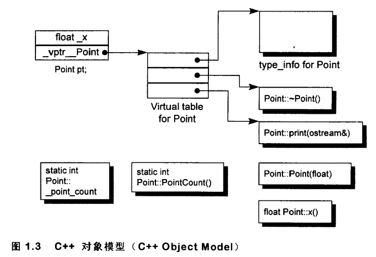
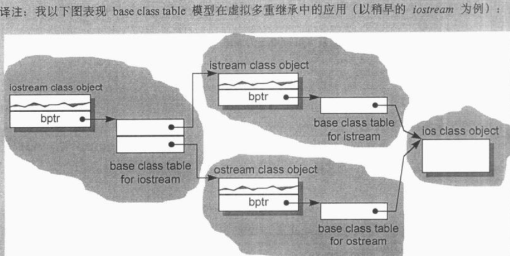

# 深入探索C++对象模型

[TOC]

## 第1章 关于对象

C++在布局以及存取时间上的主要额外负担有virtual引起的：

- 虚函数机制：用以支持一个有效率的”执行期绑定“
- 虚基类：用以实现“多次出现在继承体系中的base class，有一个单一而被共享的实例

### 1.1 C++对象模型

成员分类：

数据成员：static、non-static

成员函数：static、non-static、virtual

每个类有一堆指向虚函数的指针，存放在表格中，这个表格称为**虚函数表**（vtbl），虚函数表的第一个slot中存放的是type_info object，用于动态绑定时的类型识别，支持runtime type identification，RTTI，通常存放在表格的第一个slot

该模型的优点：

- 空间和存取时间效率高

该模型的缺点：

- 类对象的非静态数据成员改变，需要重新编译

**成员，函数放置的位置**：

- 在类对象中：
  - 1.non-static数据对象在每个类对象中
  - 2.**虚函数指针（vptr）**：指向类的虚函数表，其设定和重置由类的构造函数，析构函数和拷贝赋值运算符自动完成
  - 3.**虚基指针（bptr）**：如果有虚继承的话，在**3.4**节深入讨论
- 在对象之外：
  - 1.虚函数表
  - 2.虚基类表
  - 非虚函数：包括static，non-static
  - 静态数据成员

在虚拟继承情况下，base class不管在继承串链中被派生多少次，永远只会存在一个实例

- 优点：
  - 每一个class object中对于继承都有一致的表现方式：每个class object都应该在固定的位置上安放一个base table指针，与base classes的大小和个数无关
  - 无需更改class objects本身，就可以放大缩小，或更改base class table

### 1.3 对象的差异

C++的多态只存在于一个个的public class继承体系中，以以下方法支持多态：

- 1.经由一组隐式的转化操作：把一个派生类的指针转化为一个指向public继承的基类指针
  - `shape *ps = new circle();`
- 2.经由虚函数机制
  - `ps->rotate();`
- 3.经由dynamic_cast和typeid运算符
  - `if( circle *pc = dynamic_cast<circle*>( ps ) )...`