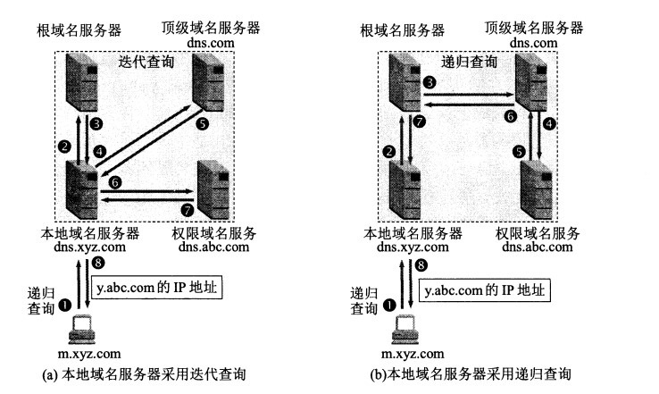
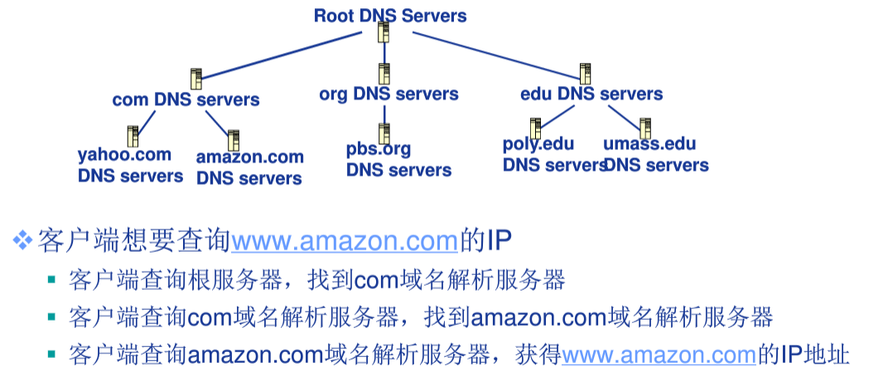
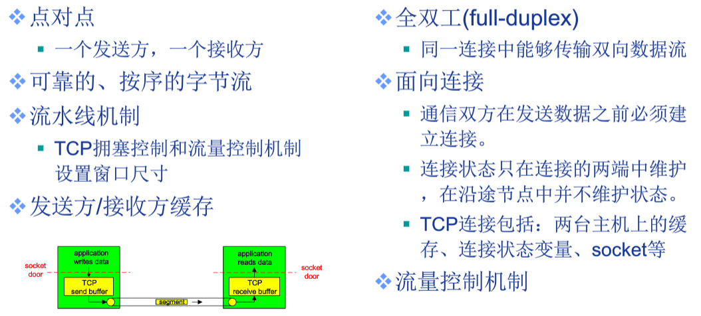
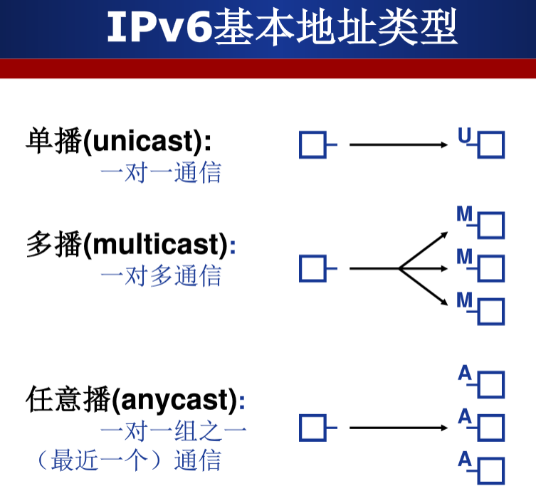
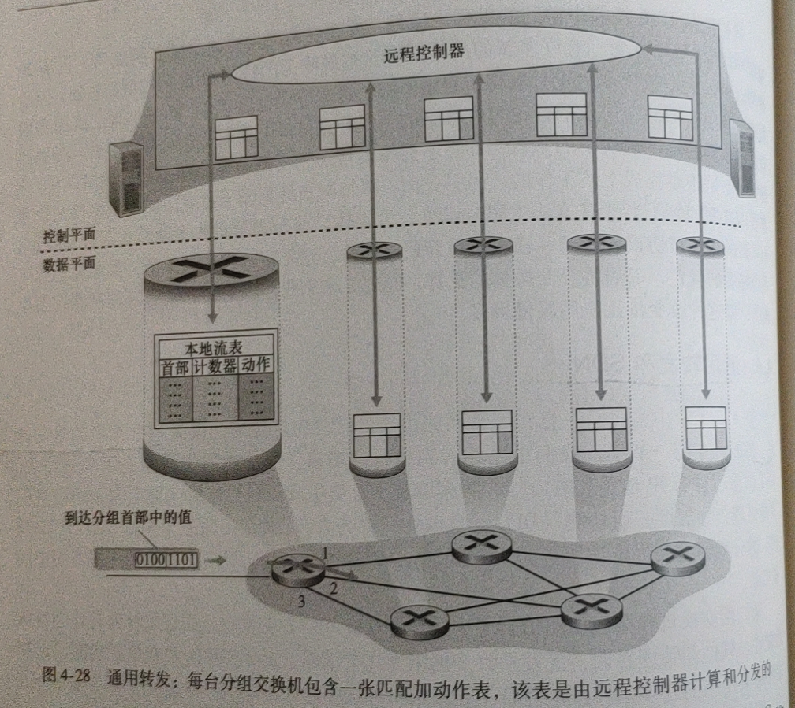
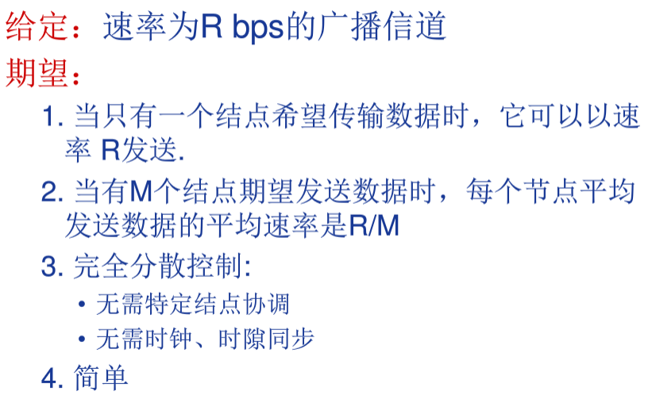
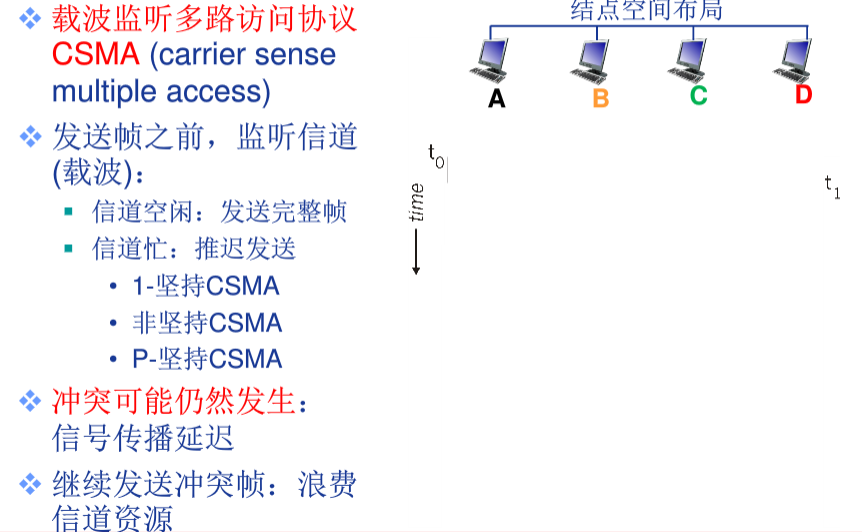
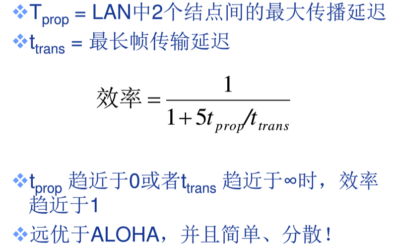

> **TODO**：第8章 计算机网络中的安全
>
> 知识应用串讲：书籍==6.7小节==

> 参考：
>
> 1. 《计算机网络 自顶向下方法》
> 2. 哈工大 计算机网络课程
> 3. arking /note

[TOC]

 

|        |  通信实体  |     通信结构     |
| :----: | :--------: | :--------------: |
| 应用层 | 应用程序间 |  报文(message)   |
| 运输层 |   进程间   | 报文段(segment)  |
| 网络层 |   主机间   | 数据报(datagram) |
| 链路层 | 链路节点间 |    帧(frame)     |

* **MSS(最大报文段长)**：运输层报文段中“应用层数据”的最大大小，受限于MTU。在TCP连接建立过程中，通过SYN报文段中的MSS选项（16位）通告MSS，从而试图避免分片，MSS经常设置成MTU减去IP和TCP首部的固定长度。在以太网中使用IPv4的MSS值为1460，使用IPv6的MSS值为1440
* **MTU(最大传输单元)**：即最大链路层帧长，链路层所能传输的最大帧大小

# 第一章.计算机网络和因特网

端系统通过通信链路和分组交换机连接到一起，组成网络。网络和网络之间通过路由器相连，组成了因特网。因此，因特网是“网络的网络”

**组成细节角度：**计算设备的集合（主机 = 端系统），通信链路（光纤，铜缆，无线电等），分组交换（转发分组，路由器和交换机）

**服务角度：**1）为网络应用提供通信服务的通信基础设施； 2）为网络应用提供应用编程接口（API）

## 1.ISP(因特网服务提供商)

端系统通过ISP接入因特网。每个ISP是一个由多个分组交换机和多段通信链路组成的网络。不同的ISP为端系统提供了各种不同类型的网络接入

为了允许因特网用户之间互相通信，允许用户访问世界范围的因特网内容，这些低层ISP通过国家的、国际的高层ISP互联起来。高层ISP是由通过高速光纤链路互联的高速路由器组成。每个==ISP都是独立管理==的，运行IP协议，遵从一定的命名和地址习惯

* **第一层ISP(主干ISP)**
  * 覆盖国际区域（十几个）
  * 与其它低层次的ISP构成“客户-提供商”的关系
  * 不向任何人付费，可以向区域ISP和接入ISP出售因特网接入
* **(第一层外)的其它ISP**
  - 可以与两个或更多ISP连接，因此，即使它的ISP之一故障，它仍能继续发送和接收分组
  - 相同等级结构层次的邻近一对ISP能够对等，对等ISP不向其对等付费，对等ISP之间的流量直接连接
* **IXP(因特网交换点)**
  - 汇合点，多个ISP能够在此共同对等

## 2. 网络协议

简称==协议==，是为进行网络中==数据交换==而建立的规则、标准或约定；规定了通信实体之间所交换的信息的格式、意义、顺序以及针对收到的信息或发生的事件所采取的动作。

协议的三要素：

1. 语法
2. 语义
3. 时序

## 3. 计算机网络的结构

- 网络边缘

  - 主机（端系统）
    - 位于网络边缘，运行网络应用数据
  - 客户/服务器（c/s）应用模型：客户发送请求，服务器响应请求，如web，FTP
  - 对等应用面模型（P2P）：无专用服务器，通信在对等实体间直接进行，如Skype

- 接入网络，物理介质：将网络边缘接入到核心网络

  - 数字用户链路（DSL）

    - 利用已有的电话线接入中心局的DSLAM
    - 频分复用
    - ==独占==至中心局的接入

  - 电缆网络

    - 频分多路复用：在不同频带上载入不同频道

    - 各设备通过电缆网络->光纤接入ISP路由器，==共享设备==至头端的接入网络

  - 机构（企业）接入网络

  - 无线接入网络

- 网络核心（核心网络）

  - 互联的路由器网络
  - 关键功能：==路由==+==转发==

## 3. 网络核心

互连的路由器网络：数据交换

数据交换的类型：电报交换，报文交换，分组交换

### 3.1 电报交换

- 最典型电路交换网络：电话网络
- 电报交换的三个阶段：
  - 建立连接（呼叫/电路建立）
  - 通信
  - 释放连接（拆除电路）
- 独占资源

电路交换网络如何共享中继线？==多路复用==

#### 多路复用技术

链路或网络资源（如带宽）划分成“资源片

- 将资源片分配给各路呼叫
- 每路呼叫==独占==分配到的资源片进行通信
- 资源片可能==闲置==（无共享）

典型方法：

- 频分多路复用（FDM）

  - 各用户占用不同的带宽资源（这里指频率带宽“Hz”）
  - 用户分配到带宽后，通信过程自始至终占用该带宽资源

- 时分多路复用（TDM）

  - 将时间划分为一段段等长的时间复用帧（TDM帧），每个用户在每个TDM帧中占用固定的序号
  - 所有用户在不同时间占用相同的频带宽度

- 波分多路复用（WDM）

  - 光的频分复用

- 码分多路复用（CDM）

  - 广泛应用于无线链路共享
  - 每个用户分配到唯一的m bit码片序列，0用“-1"表示，”1“用”+1"表示
  - 每个用户使用相同频率载波，利用各自码片序列编码数据

  

### 3.2 报文交换

报文：源（应用）发送信息整体

### 3.3 分组交换

==分组：==报文分拆出来的一系列较小的数据包，需要报文的分拆和重组，产生额外开销

- 统计多路复用：按需共享链路

- ==存储-转发==

  - 报文交换和分组交换均采用存储转发的交换方式
    - 区别
      - 报文交换以完整的报文进行"存储转发"
      - 分组交换以较小的分组进行"存储转发"
    - 哪个好？
      - 分组交换：从传输延迟和路由器所需的最小缓存方面进行考虑

  #### 传输延迟

  

  

  

==分组传输延迟：==T = M / R + (h - 1)L / R = M / R + nL / R

- 分组交换与电路交换？
  - 分组交换允许更多用户同时使用网络--网络资源充分共享
  - 分组交换适合于==突发==数据传输网络
    - 资源充分共享
    - 简单、无需呼叫建立
  - 可能产生阻塞：分组延迟和丢失
    - 需要协议处理可靠数据传输和拥塞控制

## 4. 计算机网络的性能

- 速率，即比特率或数据传输速率
  - 单位时间（s)传输信息的比特量 
  - 计算机网络中最重要的一个性能指标
  - 单位：b/s（或bps）、kb/s、Mb/s等
- 带宽：原本指信号具有的频带带宽，但网络中是数字信道所能传送的==最高数据率==，单位bps

* **时延**

  * 分组交换为什么会发生丢包和时延？

    * 分组在路由器缓存中排队
    * 分组到达速率超出输出链路容量时==丢包
    * 分组排队时，等到输出链路可用==延迟

  * 分类：

    * **处理时延**：检查分组首部，决定将分组导向何处所需的时延
      * 差错检测
      * 确定输出链路
    * **排队时延**：分组在链路上等待传输时，经受的排队时间
      * 取决于路由器的拥堵速度
    * **传输时延**：将分组的所有比特推向链路所需的时间
    * **传播时延**：分组在链路中传播所需的时间

    

* 时延带宽积

  * 传播时延 x 带宽

  

* 丢包率

  * 队列缓存容量有限
  * 分组到达已满队列将被丢弃（丢包）
  * 丢包率 = 丢包数 / 已发分组总数

* 吞吐量/吞吐率

  * 表示在发送端和接收端之间传送数据速率（R）bps
    * 即时吞吐量：给定时刻的速率
    * 平均吞吐量：一段时间的平均速率
    * 瓶颈链路：限制端到端吞吐量的链路

## 5.协议层次和服务模型7

* **五层因特网协议栈**

  

  - **应用层**：任务是通过应用进程间的交互来完成特定网络应用
  - **运输层**：负责向两台主机中进程之间的通信提供数据传输服务
    - 负责==源-目的==（端-端）（进程间）完整报文传输
    - 分段与重组
    - SAP寻址：确保完整报文提交给正确的进程，如端口号
    - 连接控制
    - 流量控制
    - 差错控制
  - **网络层**：负责为分组交换网上的不同主机提供通信服务、选择合适的路由
    - 负责源主机到目的主机数据分组
    - 逻辑寻址：全局唯一逻辑地址，确保数据分组被送达目的主机，如IP地址
    - 路由：路径选择
    - 分组转发
  - **链路层**：将网络层的数据报封装成帧，使用链路层协议在相邻节点间的链路上传输帧
    - 负责结点-结点数据传输（物理链路直接相连的两个设备之间的数据传输）
    - 组帧
    - 物理寻址：在帧头中添加发送端和/或接收端的物理地址标识数据
    - 流量控制：避免淹没接收端
    - 差错控制：检测并重传损坏或丢失帧，并避免重复帧
    - 访问（接入）控制：在任一给定时刻决定哪个设备拥有链路控制使用权
  - **物理层**：将帧中一个个比特从一个节点移动到下一个节点（==比特编码==，单位比特）

  

* **七层OSI参考模型**

  

  - **表示层**：使通信的应用程序能够解释交换数据的含义，提供数据压缩、数据加密等服务
    - 数据表示转化
    - 加密解密
    - 压缩解压缩
  - **会话层**：提供了数据交换的定界和同步功能，包括建立检查点和恢复方案的方法
    - 对话控制：建立，维护
    - 同步：在数据流中插入同步点

* **数据封装**

  * 增加控制信息
    * 构造协议数据单元PDU
  * 控制信息主要包括：
    * 地址：标识发送端和接收端
    * 差错检测编码：用于差错检测和纠正
    * 协议控制：实现协议功能的附加信息，如优先级，服务质量和安全控制

# 第二章.应用层

## 1.应用程序体系结构

1. **客户机/服务器(C/S)体系结构**(主流)

   - 服务器

     - 7*24小时提供服务

     - 永久性访问地址/域名

     - 利用大量服务器实现可扩展性

   - 客户机

     - 与服务器通信，使用服务器提供的服务
     - 间接性接入网络
     - 可能使用动态IP地址
     - 不会与其他客户机直接通信

2. **点对点P2P体系结构**（主流）
- 没有永远在线的服务器
   - 任意端系统/节点之间可以直接通信
   - 节点间接性接入网络
   - 节点可能改变IP地址
   - 优点：高度可伸缩
   - 缺点：难于管理
   
3. **混合结构（Hybrid）**

## 2.进程间通信

进程：主机上运行的程序

同一主机进程间通信：进程间通信机制，操作系统提供

不同主机进程间通信：消息交换

- 客户服务器进程

  - **客户机进程：**发起通信的进程

  - **服务器进程：**等待通信请求的进程

- 进程和计算机网络的接口

  - 进程间通信利用Socket发送和接收消息实现
  - 应用开发者对运输层的控制仅限于：
    - 传输协议的选择
    - 参数的设置

- 进程寻址
  - 不同主机上的进程间通信，那么每个进程必须拥有标识符
  - 寻址主机：IP地址
  - 端口号：为主机上每个需要通信的进程分配一个端口号
  - 进程标识符：==IP地址 + 端口号==

## 3.应用层协议的内容

- 消息的类型：

  - 请求消息
  - 相应消息

- 消息的语法格式

  - 消息中有哪些字段

  - 每个字段如何描述

- 字段的语义

  - 字段中信息的含义

- 规则

  - 进程何时发送/相响应消息
  - 进程如何发送/响应消息

  

## 4.因特网提供的运输服务

- 网络应用对传输服务的需求
  - 数据丢失/可靠性
  - 时间/延迟
  - 带宽

当创建一个新的因特网应用时，首先要做出的决定是选择UDP还是TCP，（==两个运输层协议==）它们能为应用程序提供下列服务：

* **TCP**
  
  * 面向连接的服务：客户机/服务器进程间需要建立连接，全双工
  * 可靠数据传输服务 ：无差错，按适当顺序交付
  
  此外还有：
  
  - 流量控制：发送方不会发送速度过快，超过接收方的处理能力
  - 拥塞控制：当网络负载过重时，限制发送方的发送速度
  - 不提供时间/延迟保证
  - 不提供最小带宽保证
  
* **UDP**
  *  无连接的服务
  *  不可靠数据传输服务（不保证到达，也不保证有序到达）
  
  此外，==不提供：==
  
  - 可靠性保障
  - 流量控制
  - 拥塞控制
  - 延迟保障
  - 带宽保障

除此之外，TCP具有拥塞控制机制，拥塞控制不一定能为应用程序带来直接好处，但能对==整个网络==带来好处。UDP没有拥塞控制

## 5.应用层协议

### 5.1 web应用与HTTP(超文本传输协议)

- 万维网
  - C/S结构
  - HTTP版本：
    - 1.0
    - 1.1
  - 使用TCP传输服务
    - 服务器在80端口等待客户请求
    - 浏览器发起到服务器的TCP链接（创建套接字Socket）
    - 服务器接受来自浏览器的TCP链接
    - 浏览器与web服务器交换HTTP消息
    - 关闭TCP链接
  - 对象的寻址
    - URL：统一资源定位器
    - Scheme://host:port/path

使用**TCP**作为运输层协议

**无状态协议**：服务器向客户机发送被请求的文件时，并不存储任何关于该客户机的状态信息。假如某个特定的客户机在短短的几秒钟内两次请求同一个对象，服务器并不会因为刚刚为该用户提供了该对象就不再做出反应，而是重新发送该对象

* HTTP客户机：web浏览器
* HTTP服务器：web服务器，包含web对象（HTML文件、JPEG文件、java小程序、视频片段等）

连接类型：

* **非持久连接**：每个请求/响应对是经一个单独的TCP连接发送

  * 每个TCP连接最多允许传输一个单独的对象
  * HTTP1.0版本使用非持久性连接

  

  

  ==RTT==：从客户端发送一个很小的数据包到服务器并返回所经历的时间

  ==响应时间==：2RTT+文件发送时间

  				1. 发起，建立TCP连接：1RTT
     				2. 发送HTTP请求消息到HTTP响应消息的前几个字节到达，1RTT
                          				3. 响应消息中所含对象/文件传输时间

  ==存在问题：==

  ​	1.每个对象需要2RTT

  ​	2.操作系统同需要为每个TCP链接开销资源

  ​	3. 浏览器：打开多个并行的TCP连接以获取网页所需对象，对服务器端造成压力

  如果使用非持久连接，将TCP握手第三步与一个HTTP请求报文结合起来发送，服务器接收请求后响应一个对象。因此，传输一个对象消耗2个RTT。（可以同时建立多个连接并行传输）但是，由于TCP连接==会分配缓冲区和变量==，大量使用非持久连接会给==服务器造成压力==

* **持久连接**：所有请求/响应对使用同一个TCP连接发送

  * 每个TCP连接允许传输多个对象
  * HTTP1.1版本默认使用持久性连接
  * 发送响应后，服务器保持TCP连接的打开，后续HTTP消息可以通过这个链接发送
  * 分类：
    * 无流水的持久性连接
      * 客户端只有收到前一个响应后才发送信的请求
      * 每个被引用的对象耗时1RTT
    * 带流水机制的持久性连接
      * HTTP1.1的默认选项
      * 客户端只要遇到一个引用对象就尽快发出请求
      * 理想情况下，收到所有引用对象只需耗时1RTT

如果使用持久连接，则客户机接收到请求对象后服务器不会发送一个TCP连接关闭请求。这个连接服务于所有web对象的传输（流水线发送），如果经过一个时间间隔仍未被使用，则HTTP服务器关闭连接

> * http1.0使用非持久连接
> * http1.1使用持久连接

#### HTTP消息格式

- HTTP协议有两类消息：请求消息，响应消息

##### 1）HTTP报文格式(请求报文)（ASCII：人可以直接读）

“Host”：请求的目标主机  

“Connection:close”：浏览器告诉服务器不希望麻烦地使用持久连接，而是要求服务器在发送完请求后关闭连接

  “User-agent”：用户代理，即向服务器发送请求的浏览器的类型（服务器可以正确地为不同类型的用户代理发送相同对象的不同版本）  

“Accept-language”：用户想得到该对象的语法版本

**方法字段：**

* **GET**：绝大部分HTTP请求报文使用GET方法，输入信息通过request行中的URL字段上传
* **POST**：用户提交表单时（如向搜索引擎提供关键字），但提交表单不一定要用POST方法，在请求消息的消息体中上传客户端的输入
* **HEAD**：类似于GET，区别在于服务器返回的==响应报文中不包含请求对象==（常用于故障跟踪）
* **PUT**：用于向服务器上传对象，将消息体中的文件上传到URL字段指定的路径
* **DELETE**：用于删除服务器上的对象

> [GET与POST的区别与联系](https://github.com/CyC2018/Interview-Notebook/blob/master/notes/HTTP.md#%E5%85%ABget-%E5%92%8C-post-%E7%9A%84%E5%8C%BA%E5%88%AB)

HTTP/1.0：GET, HEAD, POST

HTTP/1.1：GET，POST，HEAD，DELETE， PUT

##### 2）HTTP报文格式(响应报文)

“Connection:close”：告诉客户机在报文发送完后关闭了TCP连接  
“Date”：报文生成、发送时的日期，服务器从它的文件系统中检索到对象，并将该对象插入响应报文，并发送该响应报文的时间。  
“Last-Modified”：web对象最后修改的日期  

**状态信息：**

* **200 OK**：请求成功，信息包含在返回的响应报文中
* **301 Moved Permanently**：请求的对象已经被永久转移了，新的URL定义在响应报文的Location首部中。客户机软件自动用新的URL获取对象
* **304 Not Modified**：条件GET的响应报文中的状态码，web服务器告诉web缓存相应对象未被修改
* **400 Bad Request**：请求不能被服务器理解
* **403 Forbidden**：服务器收到请求，但是拒绝提供服务。服务器通常会在响应报文中给出不提供服务的原因
* **404 Not Found**：被请求的文档不在服务器上
* **505 HTTP Version Not Supported**：服务器不支持请求报文使用的HTTP协议版本

>Telnet：HTTP响应报文查看工具

##### 3）cookie

**用于识别用户，某些网站用于辨别用户身份，进行session跟踪而储存在==用户本地终端上的数据==（通常经过加密）**，可能出于下列意图：

* 服务器想限制用户的访问
* 服务器想把内容与用户身份关联起来

cookie包含4个组成部分：

1. 在HTTP响应报文中有一个Set-cookie首部行
2. 在HTTP请求报文中有一个Cookie首部行
3. 在用户端系统中保留有一个cookie文件，由用户的浏览器管理
4. 在web站点有一个后端数据库

##### 4）web缓存

web缓存器也叫代理服务器，用于缓存web对象。用户可以配置其浏览器，使得所有HTTP请求首先指向web缓存器

如果web缓存器没有请求的对象，会与初始服务器直接建立一条TCP连接，==web缓存器==进一步发送HTTP请求，获取对象，当接收到对象后，首先在本地缓存，然后生成一个HTTP响应报文，发送给客户机（**因此，web缓存器既是客户机，又是服务器**）

web缓存器类似于内存与处理器之间的cache，它能从整体上大大==降低因特网上的web流量，从而改善所有应用的性能==

**条件GET**：web缓存器使用条件GET向web服务器确认某个对象是否已经被修改（不是最新的对象）。如果1)请求报文使用GET方法，2)并且包含一个If-modified-since:首部行，那么这个HTTP请求报文就是一个条件GET

如果相应对象未被修改，web服务器返回一个实体为空的响应报文(也就是说并没有包含请求对象)，状态码为“304 Not Modified”

### 3.2 FTP(文件传输协议)

FTP使用两个并行的TCP连接来传输文件：

1. **控制连接(持久)**：传输控制信息，如用户标识、口令、改变远程目录命令、文件获取上传的命令
2. **数据连接(非持久)**：传输实际文件

FTP客户机发起向FTP服务器的控制连接，然后在该连接上发送用户标识和口令、改变远程目录的命令。FTP服务器收到命令后，发起一个到客户机的数据连接，在该连接上准确地传送一个文件并关闭连接

**有状态的协议**：FTP服务器在整个会话期间保留用户的状态信息。服务器必须把特定的用户账号和控制连接联系起来

### 3.3 电子邮件协议

电子邮件系统有3个主要组成部分：**用户代理、邮件服务器、简单邮件传输协议(SMTP)**

- 用户代理
  - 读写Email消息
  - 与服务器交互，收发Email消息
- 邮件服务器
  - 邮箱：存储转发给该用户的email
  - 消息队列：存储等待发送的email
- SMTP协议
  - 邮件服务器之间传递消息所使用的协议
  - 客户端：发送消息的服务器
  - 服务器：接收消息的服务器

#### SMTP协议

- 使用TCP进行email消息的可靠传输
- 端口25
- 传输过程三个阶段
  - 握手：SMTP客户指示发送方和接收方的邮件地址
  - 消息传输
  - 关闭
- 命令/响应交互模式
  - 命令：ASCII文本
  - 响应：状态代码和语句
- 使用持久性连接
- 要求消息必须由7位ASCII码构成
- SMTP服务器利用CRLF.CRLF确定消息的结束：

* 每个用户在邮件服务器上有一个邮箱，保存该用户发送和接收的邮件
* 如果邮件未发送成功，会保存在邮件服务器上，通常30分钟左右再进行尝试，几天后仍不成功则删除，并以邮件形式通知发送方
* SMTP传输邮件之前，**需要将报文主体编码为ASCII码，传输后需要解码（HTTP传输不需要）**
* SMTP一般不使用中间邮件服务器发送邮件，即使两个邮件服务器位于地球的两端
* SMTP会把邮件中所有对象封装在一个报文中，而HTTP则是每个报文封装一个web对象

#### Email消息格式

SMTP：email消息传输/交换协议

- 头部行
  - To
  - From
  - Subject
- 消息体
  - 消息本身
  - 只能是==7位ASCII码==

##### 多用途因特网邮件扩展/多媒体邮件扩展(MIME)

普通的邮件报文主体为ASCII编码的数据，报文首部适合于发送普通的ASCII文本，但是不能充分满足多媒体报文或携带非ASCII文本格式(非英文字符)的报文需求。需要额外的首部行提供对发送这些文件的支持，**在邮件头部增加额外的行以声明MIME的内容类型

MIME中包含2个支持发送上述文件的首部：

* Content-Transfer-Encoding（数据编码方法）：指出所用编码类型，接收方可以根据这个字段还原
* Content-Type（多媒体数据的类型，子类型以及参数说明）：文件类型，接收方可以根据这个首部采取一些适当动作（如解压）

### 接收方邮件拉取

SMTP是一个”推协议“，不能用于接收方代理从邮件服务器上拉取邮件，拉取邮件需要使用**POP3(第三版的邮局协议)**、**IMAP(因特网邮件访问协议)**或**HTTP**

**POP3(第三版的邮局协议)**：当用户打开一个到邮件服务器端口==110==上的TCP连接后，POP3就开始工作了，包含3个阶段

* 特许：用户发送用户名和口令鉴别身份
* 事务处理：用户代理取回报文（还能标记报文、获取邮件统计信息）
* 更新：客户机发出了quit命令后，结束了POP3会话，邮件服务器会删除被标记为删除的报文

使用POP3拉取时，可以设置为”==拉取并删除“或”拉取并保留==“，POP3是无状态的

**IMAP(因特网邮件访问协议)**：POP3==不能提供远程文件夹功能==，IMAP可以，IMAP服务器把每个报文与一个文件夹联系起来，IMAP为用户提供了创建文件夹以及在文件夹之间移动邮件的命令。除此之外，还提供在远程文件夹中查询邮件、按指定条件查询匹配文件的命令。与POP3不同，IMAP服务器维护了IMAP会话的用户状态信息

IMAP协议另一重要特性它具有允许用户代理获取报文某些部分的命令。

**基于web的电子邮件**：当使用web浏览器发送接收邮件时，推送到邮件服务器和从邮件服务器拉取邮件使用的是HTTP协议

### 3.4 DNS(域名系统)

DNS运行于**UDP**之上，使用**53号端口**，

- 一个由分层的DNS服务器实现的分布式数据库
- 一个使得主机能够查询分布式数据库的的应用层协议

它提供下列服务：

1. **主机名到IP地址的转换(主要)**
2. **主机别名**：有着复杂主机名的主机可以拥有一个或多个别名，应用程序可以调用DNS来获得主机别名对应的规范主机名以及主机的IP地址
3. **邮件服务器别名**：qq.com与foxmail.com，DNS可以解析邮件服务器别名获得规范名和IP地址
4. **负载分配**：繁忙的站点被冗余分布在多台服务器上，这些服务器有不同IP地址，IP地址集合对应于==一个规范主机名==，当客户机通过主机名获取IP地址时，DNS服务器用包含全部这些地址的报文进行回答，但在每个回答中选择这些==地址排放的顺序==，从而将==负载分配到不同服务器==

#### 1）DNS服务器

集中设计(单一DNS服务器)具有下列问题：

* 单点故障
* 通信容量：单个DNS服务器承受所有查询负载
* 远距离的集中式数据库（距离问题）：单个DNS服务器不可能”邻近“所有查询客户机
* 维护性问题

所以DNS服务器使用==分布式设计方案==：

* **根DNS服务器**：因特网上有13个根DNS服务器(标号A到M)，大部分位于北美洲
  * 本地域名解析服务器无法解析域名时，访问根服务器
  * 若不知道映射，访问权威域名服务器
  * 向本地域名服务器返回映射
* **顶级域(TLD)DNS服务器**
  * 负责com，org，edu等顶级域名及cn等国家顶级域名服务器
* **权威DNS服务器**：组织的域名解析服务器，提供组织内部服务器的解析服务
  * 组织负责维护
  * 服务提供商负责维护
* ==本地域名服务器==
  * 不严格属于层级体系
  * 当主机进行DNS查询时，查询被发送到本地域名服务器
    * 作为代理，将查询转发给（层级式）域名解析服务器

除此之外，DNS服务器还有**本地DNS服务器**。严格来说，==本地DNS服务器不属于DNS服务器的层次结构==，但对DNS层次结构很重要。**一台主机具有一台或多台本地DNS服务器的IP地址，本地DNS服务器起着代理的作用，将请求转发到DNS服务器层次结构中**

- 多层命名构成的分布式层次式数据库

#### 2）DNS查询步骤

- 迭代查询
  - 被查询服务器返回域名解析服务器的名字
- 递归查询
  - 将域名解析任务直接交给所联系的服务器
- 查询模式通常遵循：从请求主机到本地服务器是递归的，其余的查询时迭代的。

**DNS缓存**：在查询链中，当一个DNS服务器接收到一个DNS回答时，DNS服务器能将回答中的信息缓存在本地存储，以便加速后序可能的相同查询。由于主机IP和主机名之间的映射不是永久的，DNS服务器会在一段时间后丢弃缓存（本地DNS服务器可以缓存==TLD服务器的IP地址==，因而==允许直接绕过查询链中的根DNS服务器==）

- 只要域名解析服务器获得域名-IP映射，即缓存这一映射
  - 一段时间过后，缓存条目失效（删除）
  - 本地域名服务器一般会缓存顶级域名服务器的映射，因此根域名服务器不经常被访问

#### 3）DNS记录和报文

所有DNS服务器共同存储着**资源记录**，资源记录格式如下：

**(Name,Value,Type,TTL)**

* **Type=A**：此时Name是主机名，Value是对应IP地址
* **Type=NS**：Name是域(如edu.cn)，Value是知道如何获取该域中主机IP地址的权威DNS服务器的==主机名==
* **Type=CNAME**：Name是真实域名的别名，Value是别名为Name的主机对应的规范主机名（真实域名）
* **Type=MX**：Value是别名为Name的邮件服务器的规范主机名

如果一台DNS服务器是某个特定主机名的==权威DNS服务器==，那么会有一条包含该主机名的类型==A记录（==不是权威服务器，也可能在缓存中包含A记录）  
如果DNS服务器不是某个主机名的权威DNS服务器，那么会包含一条类型==NS记录==，还将包含一条类型==A记录==，提供了在NS记录的Value字段中DNS服务器的IP地址

- DNS协议
  - 查询和回复消息
  - 消息格式相同

**DNS报文(查询和响应报文格式相同)**

- 消息头部：
  - 标识符：16位查询编号，回复使用相同的编号
  - 标志：
    - 查询或回复
    - 期望递归
    - 递归可用
    - 权威回答

>nslookup：从主机直接向某些DNS服务器发送DNS查询报文

**注册域名**

因特网名字和地址分配机构(ICANN)向各种注册登记机构授权，可以向这些机构申请注册域名：

1. 提供基本权威DNS服务器和辅助权威服务器的域名和IP
2. 注册登记机构会将NS和A类型的记录输入TLD服务器
3. 确保自身在提供的权威DNS服务器中输入了相应类型的记录

#### 4）（分布式拒绝服务）DDos带宽洪泛攻击

如，攻击者向每个DNS根服务器连续不断地发送大量的分组，从而使得大多数合法的DNS请求得不到回答

DNS根服务器配置分组过滤器可以拦截这些分组，本地DNS服务器缓存了顶级域名服务器的IP地址，也能绕过DNS根服务器，防止攻击

对DNS的潜在更为有效的DDoS攻击是向顶级域名服务器发送大量DNS请求。

### 3.5 P2P应用

不同于C/S架构，P2P架构中，每个主机既是客户机也是服务器，称作==对等方==，由于文件分布存储在多个对等方中，因此文件分发速度更快

* `u`：上传速率
* `d`：下载速率
* `F`：文件（比特）大小
* 分发时间：所有N个对等方得到该文件的副本所需要的时间

假设服务器需要将文件发送到`N`个对等方：

#### 1）如果使用C/S架构：

* 服务器总共需要上传`NF`比特数据，那么至少需要`NF/us`的时间
* 设`dmin`为下载速率最小的对等方，那么该对等方不可能在`F/dmin`内获得文件

那么有：`Dcs ≥ max{NF/us,F/dmin}`，服务器调度传输可使下届作为实际分发时间，即：`Dcs = max{NF/us,F/dmin}`。当N足够大时，==分发时间==取决于`NF/us`，随==对等方数量线性==增加

#### 2） 如果使用P2P架构：

* 刚开始只有服务器拥有文件，为了将文件的所有比特传至网络，需要`F/us`
* 设`dmin`为下载速率最小的对等方，那么该对等方不可能在`F/dmin`内获得文件
* 设`utotal = us + u1 + ... + un`表示系统总上传速率。由于最终每个对等方会有一个文件，那么总共需要上传`NF`比特，那么所有数据的上传时间不可能小于`NF/utotal`

因此又：`Dp2p ≥ max{F/us,F/dmin,NF/utotal}`，如果每个对等方接收到一个比特就重新分发一个比特，可使下届作为实际分发时间，即：`Dp2p = max{F/us,F/dmin,NF/utotal}`。实际上，重新分发的是==文件块==而不是一个个比特

下图展示了在两种架构下分发时间与对等方数量的关系，可以看出使用P2P进行文件==分发速度快==，具有==自我扩展性，具体原因为：对等方除了是比特的消费者之外，还是它们的重新分发者==：

 

#### 3）BitTorrent

- 用于数据分发的一种流行P2P协议。洪流：参与一个特定文件分发的所有对等方的集合。
- 跟踪器：每个节点具有一个基础设施节点。

具体过程：（底层TCP连接）

- 文件划分为256KB的chunk
- 节点加入torrent
  - 没有chunk，但是会逐渐积累
  - 向tracker注册以获得节点清单，有某些节点建立连接
- 下载的同时，节点需要向其他节点上传chunk
- 节点可能加入或离开
- 一旦节点获得完整的文件，它可能离开或留下

==获取chunk：==

- 给定任意时刻，不同节点持有文件不同chunk集合

- 节点（Alice）定期查询每个邻居持有的chunk列表
- 节点发送请求，获得缺失的chunk
  - **最稀缺优先**：针对节点没有的块在它的邻居中决定最稀缺的块，这样，最稀缺的块能够得到更迅速的重新分发，其目标为均衡每个块在洪流中的副本数量

==发送chunk：==

- 节点（Alice）向4个邻居发动chunk：正在向其发送chunk，速率最快的4个
  - 每10s重新评估top4（这4个对等方称为疏通）
- 每30s随机选择一个其他节点，向其发送chunk
  - 新选择的节点可能加入top4

#### 4）**P2P中文件的搜索方式**

P2P系统的索引：信息到节点位置（IP地址+端口号）的映射

* **集中式索引**：使用一个集中式索引服务器存储索引，是一种P2P和C/S混合的体系结构，文件分发是P2P的，搜索是C/S的
  * 内容和文件传输是分布式的，但内容定位是高度集中式的
    * 单点失效问题
    * 性能瓶颈问题
    * 版权问题
* **洪泛式查询**：建立在Gnutella协议基础上，索引全面分布在对等方区域中，对等方向相邻对等方发出文件查询请求，相邻对等方进一步转发查询请求

* **层次覆盖网络**：结合以上两种，与因特网高速连接并具有高可用性的对等方被指派为==超级对等方==，新的对等方与超级对等方之一建立==TCP连接==，将其可供共享的所有文件告诉超级对等方，超级对等方==维护着一个索引==，超级对等方之间通过==TCP连接==，可以转发查询

# 第三章.传输层

- 传输层协议为运行在不同Host上的进程提供了一种逻辑通信机制
- ==端系统==运行传输层协议：
  - 发送方：将应用递交的消息分成一个或多个segment，并向下传给网络层
  - 接收方：将接收到的segment组装成消息，并向上交给应用层
- 传输层可以提供多种协议：
  - Internet上的TCP
  - Internet上的UDP
- 传输层与网络层对比
  - 网络层：提供主机间的通信机制
  - 传输层：提供应用进程之间的逻辑通信机制
    - 位于网络层之上
    - 依赖于网络层服务
    - 对网络层服务可能进行增强
- 两种Internet传输层协议
  - 可靠按序的交付服务TCP
    - 拥塞控制
    - 流量控制
    - 连接建立
  - 不可靠的交付服务UDP
  - 两种服务均不保证：
    - 延迟
    - 带宽

## 1.端口号与套接字(==具体参见专题==，PPT及网络编程)

### 1.1 端口号

**通常在一台主机上能够运行许多网络应用程序。IP地址可以标识一台主机，端口号则是用来标识这台主机上的特定==进程==**

**端口号是一个==16bit==的数字，大小在0\~65535之间，0\~1023范围的端口号称为==周知端口号==，保留给周知的应用层协议**

| 应用层协议 |           端口号           | 运输层协议 |
| :--------: | :------------------------: | :--------: |
|    DNS     |             53             |    UDP     |
|    FTP     | 21(控制连接)，20(数据连接) |    TCP     |
|   TELNET   |             23             |    TCP     |
|    DHCP    |   67(服务器)，68(客户端)   |    UDP     |
|    HTTP    |             80             |    TCP     |
|   HTTPS    |            443             |    TCP     |
|    SMTP    |             25             |    TCP     |
|    POP3    |            110             |    TCP     |
|    IMAP    |            143             |    TCP     |

### 1.2 套接字

网络应用由成对进程组成，进程通过一个称为套接字的软件接口在网络上发生和接收报文

应用编程接口API：应用进程控制权和操作系统控制权进行转换的一个系统调用接口

**套接字是同一台主机内应用层与运输层之间的接口，也可称为应用程序和网络之间的应用程序编程接口**

- 标识通信端点（对外）：IP地址 + 端口号
- 操作系统/进程如何管理套接字（对内）？套接字描述符（小整数）
- Socket抽象
  - 类似于文件抽象
  - 当应用进程创建套接字时，操作系统分配一个数据结构存储该套接字的相关信息
  - 返回套接字描述符
  - 视同TCP/IP协议簇的网络应用程序声明端点地址变量时，使用结构sockaddr_in

#### TCP套接字：(源IP,源端口,目的IP,目的端口)

- 可靠，面向连接，字节流传输（SOCK_STREAM），点对点

#### UDP套接字：(目的IP,目的端口)

- 不可靠，无连接，数据报传输（SOCK_DGRAM)
- SOCK_RAW，面向网络层

**网络字节顺序**：TCP/IP定义了用于协议头中的二进制整数表示

## 2.多路复用与多路分解

* **多路分解**：将运输层报文段中的数据交付到正确的套接字的过程（通过报文段的端口号字段），即不同的进程（==接收端进行多路分用==）

  * 分用如何工作？
    * 主机接收到IP数据报
      * 每个数据报携带源IP地址，目的IP地址
      * 每个数据报携带一个传输层的段
      * 每个段携带源端口号和目的端口号
    * 主机接收到段之后，传输层协议提取IP地址和端口号信息，将报文段导入到相应的套接字
      * TCP做更多的处理
  * 无连接分用
    * 利用端口号创建Socket
    * UDP的Socket用二元组标识
      * （目的IP地址，目的端口号）
    * 主机接收到UDP段
      * 检查段中的目的端口号
      * 将UDP段导向绑定在该端口号的Socket
      * 来自不同源IP地址和源端口号的IP数据报被导向同一个Socket
  * 面向连接的分用
    * TCP的Socket用四元组标识
      * 源IP地址
      * 源端口号
      * 目的IP地址
      * 目的端口号
    * 接收端利用所有四个值将Segment导向合适的Socket
    * 服务器可能同时支持多个TCP Socket
    * web服务器为每个客户端开不同的socket

* **多路复用**：从源主机不同套接字收集数据，并为数据封装上首部信息从而生成报文段，传递到网络层的过程，从多个socket接收数据，为每个数据封装上头部信息，生成报文段，交付给网络层。（==发送端进行多路复用==）

  

## 3.UDP

出于下列原因可能使用UDP：

1. 没有拥塞控制，应用层能更好地控制要==发送的数据和发送时间==（TCP拥塞时会遏制发送方发送）
2. ==无需建立连接==，减少延迟
3. 实现简单，==无连接状态==（TCP需要维护连接状态，包括接收和发送缓存、拥塞控制参数、序号与确认号的参数）
4. 分组==首部开销小==（**每个TCP报文段有20字节的首部开销，而UDP仅有8字节的开销**）

可以在应用程序自身中构建可靠性机制来实现UDP应用的可靠数据传输

UDP能提供运输层最低限度的两个服务：==**差错检测、数据交付**==

- 基于IP协议
  - 复用/分用
  - 简单的错误校验
- Best effort服务，UDP段可能
  - 丢失
  - 非按需到达
- 无连接
  - UDP发送方和接收方之间不需要握手
  - 每个UDP段处理独立于其它段
- 常应用于流媒体应用以及DNS
  - 容忍丢失
  - 速率敏感
- 在UDP上实现可靠数据传输？
  - 在应用层增加可靠性机制
  - 应用特定的错误恢复机制

### 3.1 UDP报文段结构

UDP首部只有4个字段，每个字段2个字节，一共8个字节大小的首部

**校验和**：对报文段中的所有16比特字（包括数据部分，==不包括校验和本身==）的和相加（如有溢出会卷回）的结果==取反==就是校验和。在接收方，会将所有16比特字的和相加，如果分组无差错，这个和会是“1111-1111-1111-1111”（为了方便阅读，使用'-'分隔）

- 发送方
  - 将段的内容是为16bit整数
  - 校验和计算：计算所有整数的和，进位加在和的后面，将得到的值按位求反，得到校验和
  - 发送方将校验和放入校验和字段
- 接收方
  - 计算接收段的校验和
  - 将其余校验和字段进行对比

许多==链路层协议==提供了差错检测，UDP还需提供校验和的原因在于，==不能确保==所有链路都提供了差错检测。此外，即使报文段经链路正确地传输，当其存储在某台路由器的内存中时，也可能==引入比特差错==。既未确保逐段链路的可靠性，也未确保内存中的差错检测，因此UDP必须在==端到端基础==上在运输层提供==差错检测==

> **校验和**方法需要相对小的分组开销。例如，TCP和UDP中的校验和只用了16比特。然而与常用于链路层的CRC(循环冗余检测)相比，他们提供==相对弱的差错保护==。**运输层使用校验和而链路层使用CRC的原因是**：运输层通常在主机中作为==用户操作系统的一部分并用软件实现==，因此采用==简单而快速==（如校验和）的差错检测方案是重要的。另一方面，链路层的差错检测在适配器中用==专业硬件==实现，它能快速地执行更复杂的CRC操作

## 4 可靠数据传输原理

* **rdt**：可靠数据传输

  * 可靠性传输协议

    * 可靠性传输对应用层，传输层，链路层都很重要
    * 信道的不可靠性决定了可靠数据传输协议（rdt）的复杂性
    * 利用状态机FSM刻画传输协议

    

  

* **udt**：不可靠数据传输

### 4.1 完全可靠信道上的可靠数据传输(rdt1.0)

假设底层信道是完全可靠的

- 底层信道完全可靠
- 不会分组丢失
- 发送方和接收方的FSM独立
- 在这个简单的协议汇中，一个单元数据与一个分组没差别。而且所有分组是从发送方流向接收方；有了完全可靠的信道，接收端不需要提供任何反馈信息给发送方

### 4.2 具有比特差错信道上的可靠数据传输(rdt2.0、rdt2.1、rdt2.2) 

更现实的底层信道模型是分组中的比特可能受损，底层信道可能翻转分组中的位

基于重传机制的可靠数据传输协议称为**自动重传请求(ARQ)协议**，ARQ中还需要另外3种协议来处理存在的比特差错：

1. **差错检测**：校验和
2. **接收方反馈**：肯定确认(ACK)和否定确认(NAK)
3. **重传**：接收方收到有差错的分组时，发送方重传

对于发送方，在等待ACK或NAK状态时，不能从上层获得更多的数据，仅当收到ACK并离开该状态时才能发生这样的事件。类似于rdt2.0这种行为的协议被称为**停等协议**

**rdt2.0的问题在于没有考虑到ACK和NAK分组可能受损的情况**

处理受损ACK或NAK的办法是，如果收到受损的ACK或NAK，则重传一次分组，但是这样又无法确认是一次新的分组还是重传的分组。解决办法是在分组中添加一个==序号字段==，接收方只需检查序号即可确定收到的分组是否是一次重传。对于rdt2.0，由于是简单地停等协议，只需==1比特序号即可==，从而得到rdt2.1

如果收到受损的分组，接收方也可以发送一个对上次正确接收分组的ACK，也能实现与NAK一样的效果，也就是rdt2.2

- rdt2.2
  - 与rdt2.1功能相同，但是只是用了ACK
  - 如何实现？
    - 接收方通过ACK告知最后一个被正确的分组
    - 在ACK消息中显式的加入被确认分组的序列号
    - 发送方收到重复的ACK之后，采取与收到NAK消息相同的动作
      - 重传当前分组（发送方接收到对同一分组的两个ACK，就知道接收方没有正确接收跟在被确认两次的分组后面的分组）

### 4.3 具有比特差错的丢包信道上的可靠数据传输(rdt3.0)

现在假定除了**比特受损**外，底层信道还会**丢包**，因此需要引入**时间机制决定何时重传分组**

- 如果没有接收到ACK，重传
- 如果分组或ACK只是延迟而不是丢失
  - 重传会产生重复，序列号机制能够处理
  - 接收方需要在ACK中显式告知所确认的分组
- 需要倒计时定时器
- rdt3.0能够正常工作，但性能很差
- 网络协议限制了物理资源的利用

### 4.4 流水线可靠数据传输

rdt3.0功能正确，但由于是一个==停等协议==，所以性能很差。如果能在收到确认之前发送多个分组，可以大大提升性能

- 允许发送方在收到ACK之前连续发送多个分组
  - 更大的序号范围
  - 发送方和/或节后放需要更大的存储空间以缓存分组
- **滑动窗口协议**
  - 窗口
    - 允许使用的序列号范围
    - 窗口尺寸N：最多有N个等待确认信息
  - 滑动窗口
    - 随着协议的运行，窗口在序列号空间内向前滑动
  - 滑动窗口协议
    - GBN（回退N步），SR（选择重传）

#### 1）回退N步(GBN)

也被称为滑动窗口协议

 * **发送方**

   - 分组头部包含k-bit序列号  
   - 窗口尺寸N，最多允许N个分组未确认
   - 上层的调用：当上层调用rdt_send（）时，发送方检查窗口是否已满，即是否满足N个已发送但未被确认的分组。未满，产生一个分组并将其发送，并更新相应变量；已满，发送方只需将数据返回给上层，隐式地指出该窗口已满。
   - ACK（n）：确认到序列号 n（包含n）的分组均已被正确接收，累计确认机制
     - 可能收到重复的ACK
   - 超时Timeout（n）事件：定时器将再次用于恢复数据和确认分组的丢失。出现超时，发送方将重传所有已发送但还未被确认过的分组。发送方仅使用==一个==定时器，它可被看做最早已发送但未被确认的分组所使用的的定时器。

   
 * **接收方**
   - 每接收到一个有序分组交付到上层，丢弃无序分组
   - 累积确认收到的有序分组

**丢弃无序分组的优点在于接收方缓存简单，需要维护的唯一信息就是下一个按序接收的分组的序号；缺点是对于丢弃的分组，随后重传也许会丢失或出错，因此甚至需要更多的重传**

下图为窗口长度为4个分组的GBN运行情况：

#### 2）选择重传(SR)

一个单个分组的差错就可能引起GBN重传大量分组，许多分组根本没有必要重传。随着信道差错率的增加，流水线可能被这些没有必要重传的分组填满

* **发送方**
  - ==收到ACK==。如果收到的ACK对应一个窗口内的分组，则标记为已接收，序号等于send_base，则移动窗口至具有最小序号的未确认分组处
  - ==从上层收到数据==。如果窗口移动了，并且有序号落在窗口内的未发送分组，则发送这些分组
  - ==超时==。如果发生超时，只能发送1个分组，每个分组必须拥有自己的定时器。
* **接收方**
  - 确认(ACK)一个正确接收到的分组（收到滑动窗口前的分组也要再次确认，因为这种情况通常意味着这个分组的前一次==确认未被发送方收到==）
  - 失序分组会被缓存直到所有丢失分组都被收到，此时将一批分组按序交付给上层

一个SR运行的例子：

>对于SR而言，==接收方窗口长度必须小于等于序号空间大小==的一半，否则可能无法确认一个==分组是重传还是初次传送==

## 5.TCP

TCP是面向连接的，提供全双工的服务：数据流可以双向传输。也是点对点的，即在单个发送方与单个接收方之间的连接

### 5.1 TCP报文段结构

* ==**序号**==：序号建立在传送的字节流之上，而不是建立在传送的报文段的序列之上。表示该报文段数据字段首字节的序号
* ==**确认号**==：TCP使用累积确认，确认号是第一个未收到的字节序号，表示希望接收到的下一个字节
* **首部长度**：**通常==选项字段为空==，所以一般TCP首部的长度是20字节**
* (可选与变长的)**选项字段**：用于发送方与接收方协商MSS(最大报文段长，MSS通常根据最初确定的有本地发送的最大链路帧长度来设置)，或在高速网络环境下用作窗口调节因子
* **标志字段**
  - **ACK**：指示确认字段中的值是有效的
  - **RST,SYN,FIN**：连接建立与拆除
  - **PSH**：指示接收方应立即将数据交给上层
  - **URG**：报文段中存在着(被发送方的上层实体置位)“紧急”的数据
* **接收窗口**：用于流量控制（表示接收方还有多少可用的缓存空间）

TCP RFC并没有规定失序到达的分组应该如何处理，==而是交给程序员==。可以选择丢弃或保留

**TCP可靠数据传输**

如果发生超时，TCP**只重传第一个已发送而未确认的分组**，==超时时间间隔会设置为原来的2倍==，这种形式提供了一个形式受限的拥塞控制。

### 5.2 流量控制

如果应用程序读取数据相当慢，而发送方发送数据太多、太快，会很容易使接收方的接收缓存溢出，流量控制就是用来进行发送速度和接收速度的匹配。发送方维护一个“接收窗口”变量，这个变量表示接收方当前可用的缓存空间

* LastByteRead:接收方应用程序从接收缓存中读取的最后一个字节
* LastByteRcvd:接收方接收到的最后一个字节

要防止缓存溢出，则应该满足如下条件：

LastByteRecv - LastByteRead <= RcvBuffer

接收方可通过下列公式计算RcvWindow:

RcvWindow = RcvBuffer - [LastByteRecv - LastByteRead]

然后将RcvWindow的值记录在==TCP报文段中==，发送给发送方。发送方轮流跟踪两个变量LastByteSent和LastByteAcked，这两个变量之差就是发送到连接中但未被确认的数据量。通过==将其控制在RcvWindow==内，就能实现流量控制:

LastByteSent - LastByteAcked <= RcvWindow

这个方案存在一个问题，当接收方缓存已满时，将RcvWindow=0通告给发送方，并且接收方没有任何数据要发送给发送方，随着接收方应用进程清空缓存，TCP并不向发送方发送带有RcvWindow新值的新报文段；TCP仅在它==有数据或确认要发送时==才会发送报文段。这样，发送方不会知道接收方缓存已经有新的空间，发送方因此被阻塞而不能再发送数据。为解决这个问题，TCP规约中要求：当接收方的接收窗口为0时，==发送方继续发送只有1个字节数据的报文段==。这些报文段将会被接收方确认。最终缓存将开始清空，并且确认报文里将包含一个非0的RcvWindow值

### 5.3 连接管理

#### 3次握手

1. **客户端向服务器发送SYN报文段**（不包含应用层数据，首部的一个标志位(即SYN比特)被置位1，客户端随机化选择(避免攻击)一个起始序号client_isn，并将次序号放入起始的SYN报文段的序号中）
2. 服务器为该TCP连接分配**TCP缓存和变量**，**返回一个SYNACK报文段**（也不包含应用层数据，SYN比特被置为1，ACK为client_isn+1，服务器选择自己的初始序列server_isn）
3. 客户机为该连接分配**缓存和变量**，**返回一个对SYNACK报文段进行确认的报文段**（因为连接已经建立了，所以SYN比特被置为0,将server_isn放入到确认号中，该阶段的报文段负载中携带客户到服务器的数据）

**如果客户端不发送ACK来完成第三次握手，最终(通常是一分钟后)服务器将终止该半开连接并回收已分配的资源（在第三次握手前分配缓存和变量，可能会受到SYN洪泛攻击）**

**如果第二次握手丢包怎么办？第三次呢？**[——知乎车小胖的回答](https://www.zhihu.com/question/24853633)

* **第二个包，即B发给A的SYN +ACK 中途被丢，没有到达A**：B会周期性超时重传，直到收到A的确认 
* **第三个包，即A发给B的ACK 中途被丢，没有到达B**：A发完ACK，单方面认为TCP为 Established状态，而B显然认为TCP为Active状态
  - **假定此时双方都没有数据发送**：B会周期性超时重传，直到收到A的确认，收到之后B的TCP 连接也为Established状态，双向可以发包
  - **假定此时A有数据发送**：B收到A的 Data + ACK，自然会切换为established 状态，并接受A的Data
  - **假定B有数据发送**：数据发送不了，会一直周期性超时重传SYN + ACK，直到收到A的确认才可以发送数据

>SYN洪泛攻击：攻击者发送大量的TCP SYN报文段，而不完成三次握手的第三步。通过从多个源发送SYN能够加大攻击力度，产生==DDos(分布式拒绝服务) SYN洪泛攻击==
>预防：SYN cookies

**SYN cookies预防SYN洪泛攻击**：

* 当服务器接收到一个SYN报文段时，它并不知道该报文段是来自一个合法的用户，还是一个SYN洪泛攻击的一部分。因此服务器==不会为该报文段生成一个半开TCP连接==。相反，服务器生成一个**初始TCP序列号server_isn**，该序列号是SYN报文段的**源和目的IP地址、端口号**以及仅被该服务器所知的**秘密数**的一个散列函数，这种精心制作的初始序列号被称作“cookie”。服务器发送具有这种特殊序列号的SYNACK分组，服务器并不记忆该cookie或任何对应于SYN的其他状态信息
* 如果客户机是合法的，它将返回一个ACK报文段。服务器一旦收到该ACK，需要验证与前面发送的某些SYN对应的ACK。对于一个合法的ACK，确认字段中的值等于SYNACK**序号字段server_isn的值加1**。服务器将使用在ACK报文段中的相同字段和秘密数运行相同的函数。如果该函数的结果加1与确认号相同，服务器就认为该ACK对应于前面发送的SYN报文段，生成一个==具有套接字的全开的连接==
* 如果客户机没有返回一个ACK报文段，则初始化的SYN也没有对该服务器产生危害，因为服务器没有为它分配任何资源

**前两次“握手”不包含有效载荷，第三次“握手”可以承载有效载荷**

> 为什么需要3次握手而不是4次或2次？[——知乎车小胖的回答](https://www.zhihu.com/question/24853633)

#### 4次挥手

TCP连接的两个进程中任意一个都能终止该连接，连接关闭需要4步。假设客户端发起一个关闭请求：

1. **客户端发送一个FIN报文**（首部中的FIN比特被置位1）
2. **服务器返回一个对FIN报文的确认报文**
3. **服务器发送一个FIN报文**（首部中的FIN比特被置位1）
4. **客户端返回一个对FIN报文的确认报文**

**运行在每台主机中的TCP协议在各种TCP状态之间变迁，具体看上图**

**MSL(最长分节生命期)是任何IP数据报能够在因特网中存活的最长时间**（IP数据报中的TTL首部为8位，具有最大TTL，即255的分组，在网络中存在的时间不能超过MSL）。任何TCP实现都必须为MSL选择一个值。RFC 1122的建议值是2分钟，不过源自Berkeley的实现传统上改用30秒。意味着TIME_WAIT状态的持续时间再1分钟到4分钟之间

>四次挥手是因为TCP是全双工的，前2次挥手用于关闭一个方向的数据通道，后两次挥手用于关闭另外一个方向的数据通道

[TIME-WAIT状态的详细说明](http://elf8848.iteye.com/blog/1739571)，主要有2个存在的理由：

* 可靠地实现TCP全双工连接的终止，能够处理四个分节中任意一个分节丢失的状况
* 等待迷途分组在网络中消逝

当一台主机接收到一个TCP报文，其端口号或源IP地址与该主机上进行中的套接字均不匹配时，则该主机向源主机发送一个特殊的重置报文段，将==RST==标志位置为1。

当主机接收到一个UDP分组时，该主机发送一个==ICMP==数据报

>nmap：可以“侦察”打开的TCP接口、UDP接口；还能“侦察”防火墙及其配置；甚至能“侦察”应用程序及操作系统版本

### 5.4 拥塞控制

拥塞控制分类：

* 端到端拥塞控制：网络层没有为运输层（端系统）拥塞控制提供显式支持（**TCP的拥塞控制**）

* 网络辅助的拥塞控制：网络层组件向发送方提供关于网络中拥塞状态的==显式反馈信息==（ATM ABR），指示发送方采取何种速率
  - 直接反馈：路由器通过==阻塞分组==直接通知发送方拥塞
  - 路由器标记或更新从发送方流向接收方的分组中的==某个字段==来指示拥塞，接收方==收到后通知发送方==
  
  
  
  

#### TCP拥塞控制

**拥塞**：非正式定义：太对发送主机发送了太多的数据或发送速度太快，以至于网络无法处理。

由于IP层不向端系统提供显示的网络拥塞反馈，所以TCP必须使用**端到端拥塞控制**，而不是网络辅助拥塞控制，让每一个发送方根据所感知到的网络的拥塞的程度来限制其能向连接发送流量的速率

[拥塞控制与流量控制的区别](https://zhuanlan.zhihu.com/p/37379780)

> 拥塞可控制：拥塞控制作用于网络，它是防止过多的数据注入到网络中 ，避免出现网络负载过大的情况，常用的方法是：（1）慢开始，拥塞避免 （2）快重传，快恢复
>
> 流量控制：流量控制作用于接收者，它是控制发送者的发送速度从而使接收者来得及接收，放置分组丢失的

**TCP连接的两方都记录一个额外的变量：拥塞窗口(CongWin)**，**动态调整**改变发送速率，反应所感知到的网络拥塞。它对一个TCP发送方能向网络中发送流量的速率进行了限制。特别是，在一个发送方中未被确认的数据量不会超过CongWin与RcvWindow中的最小值:

LastByteSent - LastByteAcked <= min{CongWin,RcvWindow}

上述约束限制了发送方中未被确认的数据量啊，因此**间接的限制了发送方的发送速率**

>后面的分析假设TCP接收缓存足够大，因此不受RcvWindow的限制，从而可以只关注拥塞窗口

如何**感知拥塞**？

- 两个**拥塞指示**：
  - **3次冗余ACK**(第一次冗余是第二次收到相同ACK时，所以一共4次)
  - **超时**

TCP发送方如何确定发送速率，或者能够基于本地信息设置它们的发送速率？

- 一个丢失的报文段表意味着拥塞，因此当报文段丢失时应当降低TCP发送方的速率；
- 一个确认的报文段指示该网络正在向接收方交付发送方的报文段，因此，当对先前未确认的报文段的确认到达时，能够增加发送方的速率；
- 带宽探测。

**TCP拥塞控制算法包括三个主要部分**（加性增，乘性减AIMD拥塞控制方式）

慢启动和拥塞避免是TCP的强制部分，两者的差异在于对收到ACK做出反应时增加cwnd的长度。快速恢复是推荐部分，对TCP发送方来说，不是必须的。

1. 慢启动
   - 在慢启动状态，cwnd的值以1个人MSS开始，并且每当传输的报文段首次被确认时就增加一个MSS，因此，TCP的发送速率起始慢，但在慢启动阶段以指数增长。
   - 何时结束指数增长？
     - 第一种方式，存在一个超时指示的丢包事件（拥塞），TCP将cend设置为1并重新开始慢启动过程。同时将第二个状态的变量值ssthresh（慢启动阈值）设置为cwnd/2，既当检测到拥塞时，将ssthresh设置为拥塞窗口值得一半
     - 第二种方式，直接与ssthresh相关联，当检测到拥塞时ssthresh设置为cwnd的一半，当cwnd的值等于ssthresh时，结束慢启动并且TCP转移到拥塞避免模式
     - 第三种模式，当检测到3个冗余ACK，这时TCP执行一种快速重传并进入快速恢复状态。
2. 拥塞避免
   - 一旦进入拥塞避免状态，cwnd的值大约是上次遇到拥塞时的一半。此时，采用一种较为保守的方法，对TCP发送方无论何时到达一个新的确认，就将cwnd增加一个MSS字节。
   - 何时结束拥塞避免的线性增长？
     - 当超时时，与慢启动情况一样，cwnd设为1个MSS，当出现丢包事件时，ssthresh的值被更新为cwnd值的一半。
     - 当丢包事件由3个冗余ACK触发时，网络继续从发送方向接收方交付报文段。TCP将cwnd的值减半（为测量效果更好，计及已收到的3个ACK要加上3个MSS），并且当收到3个冗余ACK，将ssthresh的值记为cwnd值的一半，进入快速恢复状态。
3. 快速恢复
   - 对引起TCP进入快速恢复状态的缺失报文段，对于收到的每个冗余ACK，cwnd增加一个MSS，最终，当丢失报文段的一个ACK到达时，TCP在降低cwnd后进入拥塞避免状态
   - 若出现超时事件时，快速恢复执行与慢启动和拥塞避免相同的动作后，迁移到**慢启动**状态：当丢包事件出现时，cwnd值被置为1个MSS，并将ssthresh置为cwnd的一半。

**TCP性能分析**

- 吞吐率

- 公平性
  - 如果K个TCP Session共享相同的瓶颈带宽R，那么每个Session的平均速率为R/K，公平的

# 第四章.网络层

## 1.网络层功能和服务

网络层的3个重要功能

- **转发与路由**

  1. **转发**：当一个分组到达某路由器的一条输入链路时，路由器将分组移动到适当输出链路的过程
     - 转发表确定在本路由器中如何转发分组
     - 由网络层的数据平面执行的主要功能

  2. **路由**：当分组从发送方传至接收方时，网络层决定这些分组所采用的路由或路径的过程
     - 路由选择算法

  

- **连接建立**：ATM等非因特网的网络层体系结构要求从源到目的地沿着所选的路径建立连接
  - 数据分组传输之前两端的主机首先建立虚拟/逻辑连接
    - 网络设备（如路由器参与连接的建立）
  - 网络层传输层连接的对比
    - 网络层的连接：两个主机之间（路径上的路由器等网络设备参与其中）
    - 传输层的连接：两个应用进程之间（对中间网络设备透明）

> **分组交换机**：一台通用分组交换设备，根据分组首部字段中的值，从输入链路接口到输出链路接口转移分组。
>
> **链路层交换机**：基于链路层帧中的字段值做出转发决定，链路层设备
>
> **路由器**：基于网络层数据包中的首部字段做出转发决定，网络层设备

**网络层服务模型**（主机到主机的服务，网络核心的实现）

**网络服务模型**：定义了在发送与接收端系统之间的端到端的运输特性。因特网的网络层提供一种单一的服务，称为尽力而为的服务。

*分类*：

1. 无连接服务
   - 不事先为系列分组的传输确定传输路径
   - 每个分组独立确定传输路径
   - 不同分组可能传输路径不同
   - **数据包网络**
2. 连接服务
   - 首先为系列分组的传输确定从源到目的经过的路径（建立连接）
   - 然后沿该路径（连接）传输系列分组
   - 系列分组的传输路径相同
   - 传输结束后拆除连接
   - **虚电路网络**

**虚电路和数据报网络**

* **虚电路(VC)网络**：面向连接的，数据按序到达，分组不会丢失，路由器为进行中的连接维持连接状态信息

  * 一条从源主机到目的主机，类似于电路的路径（逻辑连接）
  * 每个分组利用链路全部的带宽
  * 源到目的路径经过的网络层设备共同完成虚电路的功能

  

  - 每条虚电路包括：
    - 从源主机到目的主机的一条路径
    - 虚电路号，沿路每段链路的一个编号
    - 沿路每个网络层设备，**利用转发表记录经过的每条虚电路**
  - 同一条VC，在每段连路上的VICD通常不同
    - 路由器转发分组时，依据依据转发表改写替换虚电路号
  - 应用：ATM，帧中继网络

* **数据报网络**：无连接的，但在转发表中维持了转发状态信息。**因特网是数据报网络**（数据报网络中，通常每1\~5分钟左右更新一次转发表，因为转发表会被修改，所以从一个端系统到另一个端系统发送一系列分组可能在通过网络时走不同的路径，从而无序到达）

  * 网络层无连接
  * 每个分组携带**目的地址**
  * 路由器根据分组的目的地址转发分组
    * 基于路由协议/算法构建转发表
    * 检索每个转发表
    * 每个分组独立选路
  * 数据包转发表：**列表地址范围，聚合转发表入口**
    * 最长前缀匹配优先
      * 在检索转发表时，优先选择与分组目的地址匹配前缀最长的入口

  

## 2.转发

使用**最长前缀匹配**来匹配路由表中的表项，决定转发出口

### 2.1 路由器

路由器由4部分组成：

* **输入端口**
* **交换结构**
* **输出端口**
* **路由选择处理器**：执行控制平面的功能。执行路由选择协议，维护路由选择表与关联链路的状态信息，并执行路由器中的网络管理功能

#### 1）输入端口

* **查找/转发模块**：对于路由器的转发功能是至关重要的。许多路由器中，都是在这确定一个到达的分组经交换结构转发到哪个输出端口。虽然转发表是由路由选择处理器计算的，但通常一份转发表的**影子拷贝**会被存放在每个输入端口，而且会被更新。因此，就可以在每个输入端口本地做出转发决策，而无需调用中央选路处理器，从而可以避免在路由器中的某个单点产生转发处理的瓶颈
* **最长前缀匹配原则**

#### 2）交换结构

一个分组可能会在进入交换结构时暂时阻塞，这是由于来自其它输入端口的分组正在使用该交换结构

* **经内存交换**：分组到达输入端口时，端口会通过中断向选路处理器发出信号，于是分组被拷贝到处理器内存中。选路处理器则从分组首部中取出目的地址，在转发表中找出适当的输出端口，并将分组拷贝到输出端口的缓存中
* **经一根总线交换**：经一根共享总线将分组直接传送到输出端口，不需要选路处理器的干预。因为总线是共享的，故一次只能有一个分组通过总线传送
* **经一个互连网络交换**：到达某个输入端口的分组沿着连到输入端口的水平总线穿行，直至该水平总线与连到所希望的输出端口的垂直总线的交叉点

#### 3）输出端口

输出端口处理取出存放在输出端口内存中的分组并将其传输到输出链路上。当交换结构将分组交付给输出端口的速率超过输出链路速率时，就需要==排队与缓存==管理功能

#### 4）排队

输入端口和输出端口都能形成分组队列，随着队列的增长，路由器的缓存空间将会最终耗尽，出现**丢包**

**输出端口排队**：当所有输入端口的分组发往同一个输出端口并且交换结构速率足够大而输出端口的分组传输速率不高时，分组会在该输出端口排队。排队的后果是，输出端口上的一个==分组调度程序==必须在这些排队的分组中选一个来传送，分组调度程序在提供服务质量保证方面起着关键作用

**输入端口排队**：如果交换结构速率不高，不同输入端口的队首分组需要发往同一个输出端口，此时==交换结构==需要选择其中一个输入端口的分组进行发送。因此，其它输入端口中的分组会阻塞产生排队。在队首分组之后的分组，也会因为队首分组阻塞而被阻塞，即使它们需要转发到的输出端口此时处于空闲。这种现象叫做作**线路前部阻塞(HOL)**

## 3.路由选择算法

路由选择算法：确定去往目的地的最佳路径。

* **第一跳路由器 = 默认路由器 = 源路由器**
* **目的路由器：目的主机的默认路由器**

源主机到目的主机选路的问题可归结为从源路由器到目的路由器的选路问题

**分类**：

- 集中式路由选择算法，用完整的全局的网络知识计算出从源到目的地之间的最低开销路径，即该算法以所有节点之间的连通性及所有链路的开销为输入。具有全局状态信息的算法称为**链路状态算法**（LS），该算法必须知道网络中每条链路的开销
- 分散式路由选择算法，路由器以迭代、分布式的方式计算出最低开销路径。没有节点拥有关于所有网络链路开销的完整信息，仅与其直接相连链路的开销知识即可开始工作。**距离向量算法**（DV），通过相邻路由器之间的报文交换。

### 3.1 全局选路算法(LS算法)

全局选路算法用完整的、全局性的网络信息来计算从源到目的地之间的最低费用路径。由于具有全局状态信息，所以这种算法又常被称为**链路状态算法**，代表是因特网的OSPF路由选择协议。

* **Dijkstra算法**（下图为一个处理过程）

- 算法流程：

- 算法复杂度及可能出现的问题
  - 震荡：链路开销可能是非对称的。
    - 解决办法：确保并非所有的路由器同时运行LS算法。

### 3.2 分布式选路算法(距离向量算法)

以迭代的、分布式，异步的方式计算出最低费用路径。和全局选路算法的区别在于，**没有节点拥有关于所有网络链路费用的完整信息，每个节点仅有与其直接相连链路的费用信息**

* **距离向量算法(DV)**
  - 分布式：每个节点从一个或多个直接相连的邻居接收某些信息，执行计算，然后将计算结果发回邻居
  - 迭代：上述过程持续到邻居之间没有更多的信息要交换为止
  - 异步：不要求所有节点相互之间步伐一致
* **Bellman-Ford方程（动态规划）**

DV使用公式：dx(y) = minv{c(x,v)+dv(y)} 更新x到y的距离（dx(y)是从x到y的最低费用路径的费用，minv是指取遍x的所有邻居）

* 异步迭代
  * 引发每次局部迭代的因素
    * 局部链路费用发生改变
    * 来自邻居的DV更新
* 分布式
  * 每个节点只有当DV发生变化时，才通告邻居
    * 邻居在必要时（其DV更新后发生改变）再通告他们的邻居

1. 距离向量算法：链路开销改变与链路故障

​		==坏消息传播慢---路由选择环路---无穷计数==

2. 距离向量算法：增加毒性逆转
   - 毒性逆转试图解决无穷级数问题
     - 如果一个节点到达某目的地的最小费用路径是通过某个邻居，则：
       - 通告给该邻居节点到达该目的的距离为无穷大
   - ==毒性逆转不能解决无穷级数问题==，设计3个或更多节点的环路问题无法用毒性逆转技术检测到。

### 3.3 因特网中的选路

因特网采用层次路由

随着路由器数目变大，选路信息的计算、存储及通信的开销逐渐高得惊人，数亿台主机中存储选路信息需要巨大容量的内存。在公共因特网上所有路由器上广播LS更新的开销将导致没有剩余带宽供发送数据分组使用。距离向量算法在如此大的路由器中的迭代将肯定永远不会收敛。可以将路由器组织成自治系统(AS)来解决

**自治系统(AS)**：一组处于相同的管理与技术控制下的路由器集合（ISP和AS之间是什么关系？通常一个ISP中的路由器和互连它们的链路构成了单个AS，但许多ISP将它们的网络划分为多个AS）

- 聚合路由器为一个区域
- 同一AS内的路由器运行相同的路由协议（算法）
- 网关路由器
  - 位于AS“边缘”
  - 通过链路连接其他AS的网关路由器

因特网中的选路协议：

* **AS之间**

  * 在因特网中，所有AS通信必须运行相同的AS间路由选择协议，**边界网关协议**（BGP）

  * **边界网关协议(BGP/BGP4)**

    - 任务：

      - 从邻居AS获得前缀的可达性信息。BGP允许每个子网向因特网的其余部分通告它的存在，而BGP确保在因特网中的所有AS知道该子网
      - 确定到该前缀的“最好的”路由。为确定最好的路由，该路由器在本地运行一个BGP路由选择过程（使用它经过相邻的路由器获得的前缀的可达性信息）

    - 通告BGP路由信息
      - 在BGP中，每对路由器对使用179端口的半永久TCP连接交换路由选择信息
      - 每条TCP连接的两台路由器被称为BGP对等方
      - 发送BGP报文的“TCP连接”称为BGP会话（跨越两个AS之间的BGP会话称为外部BGP（eBGP），同一AS中两个路由器间的BGP会话称为内部BGP会话（iBGP））

      

    - 确定最好的路由

      

      - AS-PATH：包含通告已经通过的AS的列表，同时还用来检测和防止通告回路
      - NEXT-PATH属性AS-PATH起始的路由器的接口的IP地址

      - BGP中，目的地是CIDR化的前缀，表示一个子网或子网集合（假设有多个子网与一个AS相连，AS会聚合这些前缀，来向相邻的AS通告聚合后的单一前缀，如果到达相同前缀有多个路由，BGP会使用一些规则消除直到留下一条路由）
      - 路由选择算法：
      - 

* **AS内部**

  AS内部路由协议也称内部网络协议IGP，常见的AS内部路由协议有RIP，OSPF

  * **开放最短路径优先(OSPF)**
    - 直接承载在IP分组中，必须自己实现可靠报文传输、链路状态广播等功能

    - 使用**LS路由算法**，链路费用是由网络管理员配置的

      - 使用**洪泛链路状态信息**和**Dijkstra**最低开销路径算法

    - 通常用于较顶层的ISP中，而RIP通常用于较低层的ISP中

    - 路由器向自治系统内的所有其它路由器广播路由选择信息，而不是仅仅向相邻路由器广播。至少每隔30分钟广播一次链路状态(即使状态未发生改变，发生改变时，立即广播)

    - 优点：

      - 安全，能够鉴别OSPF路由器之间的交换
      - 多条相同开销的路径，当到达某目的地的多条路径具有相同的开销时，OSPF语序使用多条路径
      - 对单播与多播路由的综合支持，多播OSPF协议（MOSPF）与OSPF利用相同的网络拓扑数据

      - 支持在单个AS中的层次结构
        - 能够层次化的配置多个区域，每个区域运行自己的OSPF链路状态路由选择算法，区域内的每台路由器都向该区域内的其它路由器广播其他链路状态
        - 每个区域内，一台或多台区域边界路由器负责为流向该区域以外的分组提供路由选择
        - 在AS中只有一个区域配置成主干区域，为AS中的其他区域之间的流量提供路由选择
  * **路由信息协议(RIP)**

    - 运行于UDP之上的应用层协议
      - RIP路由表利用一个称作route-d的应用层进程管理，应用进程实现
      - 通告报文周期性的通过UDP数据报发送
    - 使用**DV路由算法**，使用跳数作为费用测度，“跳”是从源路由器到目的子网的子网数，一条路径的最大费用被限制为15，从而限制了使用RIP的AS规模。
    - 大约每30秒通过RIP响应报文(也称为RIP通告)交换距离向量信息
    - 如果180s没有收到通告->邻居、链路失效
      - 经过该邻居的路由不可用
        - 重新计算路由
        - 向邻居发送新的通告
        - 邻居再向外依次发送通告（如果转发表改变）
        - 链路失效信息能够快速传播到全网？
          - 可能发生无穷计数问题

  

## 4.IP(网际协议)

### 4.1 网络层三大组件

1. **IP协议**

   - 编址规则
   - 数据报格式
   - 分组处理规则
2. **路由协议**
   - 路径选择
   - RIP，OSPF，BGP
3. **ICMP协议：报告数据报中的差错和对某些网络层信息请求进行响应的设施**
   - 差错报告
   - 路由器“信令”

### 4.2 数据报格式

下图为一个IPv4数据报的格式：

* **版本号**：IP协议的版本，路由器根据版本号确定如何解释剩余部分
* **首部长度**：一个IPV4数据报可包含一些可选项，所以需要用==4比特==确定数据部分实际从哪开始，**大多数IP数据报不包含可选项，==有20字节的首部==**
* **服务类型（TOS）**：可以使不同类型(实时与非实时等)的IP数据报区分开来，一般情况下不使用，00H
* **数据报长度**：IP数据报的总长（**16bit，首部+数据，所以IPv4数据报的最大大小是65535字节**）
* **寿命(TTL)**：8位，用以确保数据报不会永远在网络中循环，每经过一台路由器减1，减为0时丢弃，在网络中可以通过的路由器数（或跳步数）
* **上层协议**：指明了数据部分应该交给哪个运输层协议，6为TCP，17为UDP
* **首部校验和**：首部中每2个字节作为一个数，和的反码存入校验和字段中，计算时该部分字符全置0。路由器一般会丢弃检测出的错误数据报。每台路由器上都必须重新计算并更新校验和，因为TTL及选项字段可能会改变，逐跳计算，逐跳检验
* **选项**：在IPv6中已不再使用

除此之外，首部中的以下3 个字段用于IP数据报==分片的标识==

* **标识**：标识一个IP分组
  * IP协议利用一个计数器，每产生IP分组计数器加1，作为该IP分组的标识
* **标志**：最后一个分片的标志为0，其余分片的标志为1（设置DF位 表示不允许分片，可用于路径MTU发现）
  * 标志位字段占3位，保留字段，DF，MF
  * DF = 1，禁止分片，DF = 0，允许分片
  * MF = 1， 非最后一片，MF = 0，最后一片（或未分片）
* **比特片偏移**：占13位，一个IP分组分片封装原IP分组数据的相对偏移量
  * 片偏移字段以8字节为单位

> IPv4要求的最小链路MTU是68字节，这允许最大IPv4首部(20字节固定长度+最多40字节选项部分)拼接最小的片段（IPv4首部中片段偏移字段以8个字节为单位） 

### 4.3 IP数据报分片

一个链路层帧能承载的最大数据量叫做**最大传输单元(MTU)（以太网可承载不超过1500字节的数据）**，因为每个IP数据报封装在链路层帧中，再从一台路由器运输到下一台路由器，故链路层协议MTU严格地==限制着IP数据报的长度==。发送方与目的地路径上的**每段链路可能使用不同的链路层协议**，**每种协议**可能具有==不同的MTU==，如果转发表查找决定的出链路的MTU比该IP数据报的长度小，则需要对IP数据报进行分片。片在到达目的地运输层以前需要被组装，如果一个或多个片没有到达目的地，则该不完整的数据报被丢弃

分片可以通过4.2中介绍的IP数据报中的==标识、标志、比特片偏移==来识别

### 4.4 IPv4编址

主机与物理链路之间的边界叫做==接口==，一个IP地址在技术上是与一个==接口相关联==的，而不是与包括该接口的主机或路由器相关联的

- 实现网络层的功能
- 路由器通常有多个接口
- 主机通常只有一个或两个接口
- IP地址与每个接口关联

**IP地址**：32比特（IPv4），编号标识主机路由器的接口。

IP地址：网络号-高比特位，主机号-低比特位

IP地址编址格式：**点分十进制**，一个接口的IP地址的组成部分需要由其连接的子网来决定。互连主机的接口与路由器一个接口的网络形成一个**子网**：

IP编址为子网分配一个地址：223.1.1.0/24，其中/24记法称为**子网掩码**，指示32比特中的最左侧24比特定义了子网地址。其它要连到223.1.1.0/24网络的主机都要求其地址形式为223.1.1.xxx

**IP子网：**

- IP地址具有相同的网络号的设备接口
- ==不跨越路由器==（第三及以上层网络设备）可以==彼此物理联通==的接口。

上图对应了下图中3个子网：

除此之外，子网还包括互连路由器接口的网段

#### 1）分类编址/有类编址

在==无类别域间路由选择分配策略==之前，IP地址的分配策略采用==分类编址==，网络分为下面3类

* A类网络：网络部分被限制长度为8比特，0.0.0.0-127.255.255.255，占比50%，0
* B类网络：网络部分被限制长度为16比特，128.0.0.0-191.255.255.255，占比25%，10
* C类网络：网络部分被限制长度为24比特，192.0.0.0-223.255.255.255，占比12.5%，110
* D类网络：32位，224.0.0.0-239.255.255.255，占比6.25%，1110
* E类网络，32位，240.0.0.0-255.255.255.255，占比6.25%，1111

- 私有IP地址，A类，B类，C类存在一定的网络号区间的私有IP地址。

**分类编制的问题在于：对于一个组织，分配一个B类网络可能太大，分配一个C类网络可能太小，这样分配B类网络就会造成地址空间的迅速消耗，以及大量的地址浪费。这个问题类似于操作系统内存管理中固定分区的问题**

#### 2）子网划分

IP地址：

- 网络号-高比特位
- 子网号-原网络主机号的部分比特
- 主机号-低比特位

如何确定是否划分了子网及利用多少位划分子网？子网掩码

如何提取子网地址？

#### 3）无类别域间路由选择(CIDR)（因特网的地址分配策略）

- 消除传统的A类，B类，C类的地址界限

- 融合子网地址与子网掩码，方便子网划分
  - 无类地址格式：a.b.c.d/x，x为前缀的长度
- 优点
  - 提高IPv4地址空间的分配效率
  - 提高路由效率
    - 将多个子网聚合为一个较大的子网
    - 构造超网
  - 路由聚合
    - 层级编址使得路由信息通告更为高效
    - 选用更具体的路由，最长前缀匹配优先

32比特的IP地址被划分为2部分，a.b.c.d/x，前x比特构成了IP地址的网络部分，被称为该地址的==网络前缀==。一个组织通常被分配一块连续的地址，在这种情况下，该组织内部的设备的IP地址将共享共同的前缀（==地址聚合，路由聚合或者路由摘要==）。

组织外部的路由器仅考虑前缀比特x，大大减少了路由器中的转发表的长度。剩余32-x比特用于区分组织内部设备，当组织内部的路由器转发分组时，才会考虑这些比特

>IP地址由因特网名字与号码分配机构(ICANN)管理，非盈利的ICANN不仅分配IP地址，还管理DNS根服务器、解决分配域名与域名纠纷，ICANN向地区性因特网注册机构分配地址，这些机构一起形成了ICANN地址支持组织，处理本地域内的地址分配/管理

### 4.5 DHCP(动态主机配置协议)

一个主机如何获得IP地址？

- 硬编码，静态配置
- 动态主机配置协议（DHCP）

一个组织一旦获得一块地址，就可以为该组织内的主机和路由器接口分配独立的IP地址

DHCP可以提供以下服务：

- 从服务器动态获取：
  - 为主机分配IP地址
  - 获取子网掩码
  - 获取第一跳路由器地址（常称为默认网关）
  - 提供本地DNS服务器名称与地址（记录在/etc/resolv.conf文件中）
- 即插即用

由于DHCP具有能将主机连接进一个网络的自动化网络相关方面的能力，故它又常被称为**即插即用协议**

- 允许地址重用
- 支持在用地址续租
- 支持移动用户加入网络

每个子网拥有一台DHCP服务器，如果某个子网没有DHCP服务器，则需要一个知道用于该网络的一台DHCP服务器地址的DHCP中继代理（通常是一台路由器）

**DHCP协议的4个步骤：**

1. **DHCP服务器发现**：通过使用**DHCP发现报文**来完成，客户端在**==UDP分组==**中向==67端口==发送该发现报文。该UDP分组封装在一个IP数据报中。DHCP客户生成包含DHCP发现报文的IP数据报，其中使用广播目的地址255.255.255.255，并使用本机源IP地址0.0.0.0
   - DHCP协议在==**应用层**==实现
     - 请求报文封装到UDP数据报中
     - IP广播
     - 链路层广播
2. **DHCP服务器提供**：子网中收到DHCP请求报文的DHCP服务器使用**DHCP提供报文**作出响应，该报文向子网的所有节点广播，仍然使用IP广播地址255.255.255。由于子网中可能存在几个DHCP服务器，每个客户也许会发现它能在几个提供者之间进行选择的最优位置。每台服务器提供的报文包含IP地址、网络掩码、IP地址租用期(通常设置为几个小时或几天)
3. **DHCP请求**：客户端从多个服务器的响应中选择一个，并用一个**DHCP请求报文**对选中的服务器进行响应，回显配置参数（这一步目的地址使用广播地址是因为在DHCP服务器提供时，服务器为客户预分配了IP地址，因此，客户有责任通知不采用的服务器，好让它们释放预分配的地址）
4. **DHCP ACK**：服务器用**DHCP ACK报文**对DHCP请求报文进行响应，证实所要求的参数
   - 包括分配给客户的IP地址，子网掩码，默认网关，DNS服务器

>DHCP有不足之处：每当一个节点连到一个新子网时，都要从DHCP得到一个新的IP地址，这样当一个移动节点在子网之间移动时，就不能维持与远程应用之间的连接。移动IP是一种对IP基础设施的扩展，允许移动节点在子网之间移动时能使用其单一永久的地址

### 4.6 NAT(网络地址转换)

NAT适用这样一种场景：由于每个IP使能的设备都需要一个IP地址，如果一个子网已经获得了一块IP地址，当连入设备增加时，IP地址可能不足

- 只需从ISP申请一个IP地址
- 本地网络设备IP地址的变更，无需通告外界网络
- 变更ISP时，无需修改内部网络的IP地址
- 内部网络设备对外部网络不可见，即不可直接寻址（安全）

NAT主要通过**NAT使能路由器**来解决上述问题。同时，地址空间10.0.0.0/8是在RFC 1918中保留的3部分IP地址空间之一，可以用于==专用网络==或==具有专用地址的地域==（具有专用地址的地域是指其地址仅对该网络中的设备有意义的网络），关键问题是：专用地址对于外部网络无效，使用专用地址的设备如何与外部网络通信？为了解决这个问题，NAT使能路由器中保存有一个==NAT转换表==：

NAT使能路由器对外界的行为就像一个具有==单一IP地址的单一设备==，通过端口号来标识一个使用专用地址的设备

* 当专用设备与外界通信时，NAT使能路由器为其生成一个新的源端口号，并使用连入广域网一侧接口的IP地址作为源地址发送数据报，同时会将这个映射关系记录在NAT转换表中
* 当有数据报到达时，NAT使能路由器通过查找NAT转换表中的映射关系，改写目的IP和端口号，向专用网络转发数据报

**私有IP网段：**

* **10.0.0.0 ~ 10.255.255.255**
* **172.16.0.0 ~ 172.31.255.255**
* **192.168.0.0 ~ 192.168.255.255**

>NAT有很多争议：1）端口号是用于编址进程的方法，不是用于编址主机的；2）路由器是第三层（网络层）设备，应该只处理第三层的分组；3）NAT违反了所谓的“端到端原则”，违反主机应当直接彼此对话的这个规则；4）解决IP地址短缺的方法应该是IPv6，而不是像NAT这样一种权宜之计；但是不管喜欢与否，NAT已成为因特网一个重要的组件

**NAT穿透问题：**

- 静态配置NAT

- 利用UPnP

- 中继

### 4.7 ICMP(互联网控制报文协议)

ICMP用于主机和路由器彼此交互网络层信息。最典型的用途是差错报告，但其用途不仅限于此(如源抑制，用于拥塞控制)

- 支持主机或路由器
  - 差错控制
  - 网络探询
- 两类ICMP报文
  - 差错报告报文（5种）
    - 目的不可达
    - 源抑制
    - 超时/超期
    - 参数问题
    - 重定向
  - 网络探询报文（2组）
    - 回声（Echo）请求与应答报文（Reply）
    - 时间戳请求与应答报文

ICMP通常被认为是IP的一部分，但从体系结构上讲，它是位于IP之上，因为ICMP报文==承载在IP分组==中，作为IP有效载荷

ICMP的类型和编码：

- ICMP报文封装在IP数据包中传输

- 应用
  - ping程序发送一个ICMP的类型8编码0的报文到指定主机。看到回显（echo）请求，目的主机发回一个类型0编码0的回显回答
  - Traceroute程序，用来跟踪从一台主机到世界上任一台主机之间的路由

>Traceroute：允许用户跟踪从一台主机到世界上任意一台其他主机之间的路由，使用ICMP报文实现。发送一系列不可达UDP端口号的UDP报文段，每个报文段封装后的数据报TTL字段逐1递增，TTL为n的数据报到达第n跳路由器时，由于TTL过期，路由器会生成ICMP报文响应，由此可以获得第n跳路由器的IP和名字，当一个数据报最终到达目的主机时，由于==UDP端口==不可达，目的主机生成一个ICMP报文，指示此错误信息，从而Traceroute知道不需要再发送探测分组了，因此获得了到达目的主机的==所有路由数量、标识以及RTT==

### 4.8 简单网络管理协议SNMP

一个应用层协议，用于在管理服务器和代表管理服务器执行的代理之间传递网络管理控制信息和信息报文。

- 最常用的是请求响应模式，其中SNMP管理服务器向SNMP代理发送一个请求，代理接收到该请求后，执行某些动作，然后对该请求发送一个回答
- 另一个是代理向管理服务器发送一个非请求报文，该报文称为陷阱报文，陷阱报文用于通知管理服务器，一个异常已经导致MIB对象值改变。
- SNMP PDU通常作为UDP数据报的载荷进行传输。不可靠传输，不能确保被收到。管理服务器使用PDU的请求ID段为它向代理发送请求编号，代理响应请求ID。未响应，管理服务器决定是否重传一个请求。

### 4.8 IPv6

#### 1）IPv6数据报格式

- 扩大地址容量。IPv6将IP地址长度从32bit增加到128bit。除了**单播地址**和**多播地址**，IPv6引入了称为**任播地址**的新地址，这种地址可以使一个数据报能交付给一组主机中的任意一个

- 简化高效的40字节首部。定长的40字节首部允许更快的处理IP数据报
- 流标签。该字段可用于“给属于特殊流的分组加上标签，这些特殊流是发送方要求进行特殊处理的流”。

IPv6中定义的字段：

* **版本号**：IPv6将该字段值设置为6
* **流量类型**：与IPv4中的”服务类型“字段含义相同，区分不同类型数据报（实时/非实时）
* **流标签**：用于标识一条数据报中的流，能够对流中的某些数据给出优先权。
* **有效载荷长度**：数据部分的字节数（**16bit，不包括首部，所以IPv6数据报的最大大小是65535+40=65575字节**）
* **下一个首部**：应该交付给运输层的哪个协议（TCP 或 UDP）
* **跳限制**：同TTL

较IPv4删除的字段：

- 分片/重新组装。**IPv6不允许在中间路由器上进行==分片与重新组装==，这种操作只能在源与目的地上进行**。如果一台路由器收到的IPv6数据报因太大而不能转发到出链路上，则只需丢掉该数据报，并返回一个”分组太大“的ICMP差错报文。因此IPv6中没有IPv4用于分片相关的3个字段

- 首部校验和。IPv6的关注快速处理分组，由于运输层提供了差错检测，IP设计者可能觉得没必要再在网络层进行差错检测，所以去掉了首部校验和字段

- 选项。IPv4中的选项字段并没有作为IPv6的首部字段出现，但其并未消失，而是可能出现在可能出现在首部中由”下一个首部“指出的位置上

> IPv6要求的最小链路MTU为1280字节，IPv6可以运行在MTU小于此最小值的链路上，不过需要特定于链路的分片和重组功能，以使得这些链路看起来具有至少为1280字节的MTU。IPv6只有主机对其产生的数据报分片，IPv6路由器不对其转发的数据报执行分片

#### 2）从IPv4向IPv6迁移

虽然能处理IPv6的系统可做成向后兼容的，即能发送和接收IPv4数据报，但已设置的IPv4使能的系统不能处理IPv6数据报，要解决这个问题可以使用双栈（即IPv6节点也具有完整的IPv4实现，这样的节点在RFC 4213中被称为IPv6/IPv4节点）

一种双栈方法是**建隧道**：

假定2个IPv6节点要使用IPv6通信（图中的B和E），但经由IPv4路由器而互连，将中间IPv4路由器的集合称为一个==隧道==

借助于隧道，在该隧道发送端的IPv6节点可将整个IPv6数据报放在一个IPv4数据报的数据（有效载荷）字段中。于是该IPv4数据报的目的地址设为隧道接收端的IPv6节点（同时具有IPv6和IPv4地址），然后通过隧道传输，隧道接收端的IPv6节点E最终收到该IPv4数据报，并确定IPv4数据报含有一个IPv6数据报（通过观察在IPv4数据报中的协议号字段是**41**），提取出后再为IPv6数据报选路，转发

## 5.通用转发与SDN

由于第二层交换机和第三层路由器等中间盒的剧增，而且每种都有自己特殊的硬件，软件和管理界面。提出一种统一的方法，提供多种网络层功能及某些链路层功能。

- 通用转发，**一张匹配表加动作表**将基于目的地的转发表一般化了，能够使用网络层和链路层源和目的地址做出转发决定，定义为分组转发机。

- **OpenFlow**是一个高度认可和成功的标准。匹配加动作转发表称为**流表**。

- 软件定义网络SDN在数据平面与控制平面作了明确的分割，在一台分离的“控制器”服务中实现了控制平面的功能，该控制器服务于它所控制的路由器的转发组件完全分开并远离。

# 第五章.链路层和局域网

## 1.链路层提供的服务

**术语**：

- 节点：运行链路层协议的任何设备，包括主机，路由器，交换机，WiFi接入点
- 链路：通信路径连接相邻节点的通信信道
- 链路层帧：封装网络层数据报

链路层负责通过一条链路从一个节点向另一个物理链路直接相连的相邻节点传送数据报。

链路层可能提供的服务包括：

* **成帧**：将网络数据报封装成帧，由一个数据字段和若干首部字段组成，其中数据报字段插入在数据字段中
* **链路接入**：媒体访问控制(MAC)协议规定了帧在链路上传输的规则
* **可靠交付**：当链路层协议提供可靠交付服务时，它保证无差错地经链路层移动每个网络层数据报。可靠交付服务通常用于易产生高差错率的链路，如无线链路；对于低比特差错的链路，可靠交付可能被认为是一种不必要的开销，因此不提供此服务
* **流量控制**：协调相邻的发送节点和接收。没有流量控制，可能会造成缓存区溢出
* **差错检测**
  * 信号衰减和噪声导致
  * 接收端检测差错，硬件实现，准确定位位置：
    * 通知发送端重传或直接丢弃帧
* **差错纠正**
  * 接收端纠正差错
* **半双工和全双工**：全双工时，链路两端的节点可以同时传输分组

链路层如何具体实现？

### 1.1 差错检测和纠错技术

在发送节点，为了避免比特差错，使用**差错检测和纠错比特(EDC)**来增强数据D

差错检测和纠正技术有时使接收方检测到已经出现的比特差错，但并非总是这样。即使采用差错检测比特，也还是可能有**未检出比特差错**的情况  

因此，主要是选择一个差错检测方案，使得这种事件发生的概率很小。可以使用下列3种技术进行差错检测：

1. **奇偶校验**：

   - 单比特奇偶校验方案：只需包含1个附加比特。
     - 对于**偶校验**，选择一个值使得所有比特中1出现偶数次

     - 对于**奇校验**，选择一个值使得所有比特中1出现奇数次

       只能检测出奇数个或者偶数个差错
       
   
   - 二维奇偶校验方案
   
     

接收方通过检测1出现的次数判断是否出现差错。如果出现==偶数个比特差错==，则检验不出。可以使用==二维化==的方案（详见教材）进行优化

2. **校验和**：通常更多的应用于运输层。将数据分为多个k比特的序列，相加(可能回滚)后取反，作为校验和。接收方对所有k比特（包括校验和）的序列相加，结果的任意比特如果出现0，则检测为出现比特差错

   - 数据中的字节作为16比特的整数对待并求和，这个和的反码形成了携带在报文段首部的**因特网检验和**。
   - 接收方通过对接收数据（包括校验和）求和并取反码，并检测结果是否为全1比特来检测校验和
   - TCP和UDP的校验和只是用了16比特

   为什么运输层使用校验和而链路层使用CRC呢？

   

3. **循环冗余检测(CRC)**：发送方和接收方协商一个r+1比特的生成多项式(G)，要起其最高比特位为1。发送方通过在d比特的数据后附加r比特，使得整个(d+r)比特的值能够被G整除。接收方用G去除(d+r)比特，如果余数非0，则出现差错（附加r比特的计算详见教材）

- CRC编码也称为**多项式编码**，因为改变吗能够将发送的比特看作为系数为0和1一个多项式。

- 步骤：

  - 发送方和接收方首先必须协商一个r + 1比特模式，称为**生成多项式**，表示为G，要求G的最高有效位的比特为1

  - 对于一个给定的数据段D，发送方要选择r个比特附加为R，并将它们附加到D上，使得得到d + r比特模式用模2算数恰好被G整除

  - 接收方去除接收到的d + r比特。若余数非0，接收方知道出现了差错。

    - 注：CRC计算采用模2算术来做，在加法中不进位，在减法中不借位，意味着加法和减法是相同的，而这两种操作等价于操作数异或

  - 关键问题，如何计算R？

    

- 每个CRC标准都能检测小于r + 1比特的突发差错，每个CRC标准也能检测到任意奇数个比特差错

## 2.多路访问控制(MAC)协议

两种“链路”：

- 点对点链路
  - 拨号接入的PPP
  - 以太网交换机与主机间的点对点链路
- 广播链路（共享介质）
  - 早期的总线以太网
  - HFC的上行链路
  - 802.11无线局域网

### 2.1 点对点协议(PPP)

点对点协议(PPP)用于**点对点链路**，点对点链路由链路一端的单个发送方和链路另一端的单个接收方组成。通常住宅主机拨号链路就是用的PPP，所以它是目前部署最广泛的链路层协议之一

- 一个发送端，一个接收端，一条链路：比广播链路更容易
  - 无需介质访问控制
  - 无需明确的MAC寻址

### 2.2 多路访问协议

单一共享广播信道，两个或者两个以上的节点同时传输：干扰

- 冲突
  
- 节点同时接收到两个或多个信号，接受失败
  
- 理想的**MAC协议**

  

多路访问协议用于**广播链路**，广播链路能够让多个发送和接收节点都连接到相同的、单一的、共享的广播信道上。多路访问协议用于协调多个发送和接收节点对一个共享广播信道的访问

三大类：

- 信道划分MAC协议
  - 多路复用技术
  - TDMA、FDMA、CDMA、WDMA等
- 随机访问MAC协议
  - 信道不充分，允许冲突
  - 采用冲突恢复机制
- 轮转MAC协议
  - 节点轮流使用信道

1. **信道划分协议**
   * **TDM(时分多路复用)**：对于N个节点的信道，传输速率为R bps，TDM将时间划分为时间帧，并进一步划分每个时间帧为N个时隙，每个节点在特定的时隙内传输（消除了碰撞，非常公平；但节点被限制与R/N bps的平均速率，即使只有一个节点有数据要发送）
   * **FDM(频分多路复用)**：在R bps的信道中创建了N个较小的R/N bps信道，每个节点使用一个较小的信道传输（消除了碰撞，公平；但节点被限制与R/N bps的平均速率，即使只有一个节点有数据要发送）
   * **CDMA(码分多址)**：每个节点分配一种不同的编码，每个节点使用其唯一的编码来对发送的数据进行编码（如果精心选择编码，不同节点能同时传输）
   
2. **随机接入协议**

   

   * **ALOHA**：帧到达节点时，立刻传输。如果发生碰撞，节点将立即(在完全传输碰撞帧后)以概率p重传。否则，等待一个帧传输时间，再以概率p重传...（信道有效传输速率实际不是R bps，而是时隙ALOHA的一半，详见教材）

     * 效率

     

   

   * **时隙ALOHA**：时间被划分为时隙，每个节点的时间同步，帧的传输只在时隙的开始时进行。如果发生碰撞，在下一个时隙开始时以概率p重传，否则等待一个时隙再以概率p重传...（信道有效传输速率实际不是R bps，而是0.37R bps，详见教材）

     * 优点：
       * 单个节点活动时，可以连续已全部速率传输数据
       * 高度分散化，只需同步时序
       * 简单
     * 缺点
       * 冲突，浪费时隙
       * 空闲时隙
       * 节点也许能以远小于分组传输时间检测到冲突
       * 时钟同步
     * 效率

     

   

   

   * **CSMA(载波侦听多路访问)**：发送前先侦听信道，如果没有其它节点在使用信道，则传输数据。CSMA没有碰撞检测，即使发生碰撞，也将传输完碰撞帧（由于节点间数据传输存在时延，很可能一个传输正在信道中但是由于还未到达所以检测到信道空闲，此时传输最终会发生碰撞）

   

   * **CSMA/CD(具有碰撞检测的载波侦听多路访问)**：先侦听信道，如果没有其它节点在使用信道，则传输数据。但是有碰撞检测，如果发生碰撞，会停止传输剩下的数据，等待一个随机时间(通常比传输一帧短)后，再进行尝试

   

   

   

3. **轮流协议**

   * **轮询协议**：指定节点之一为主节点。主节点以循环的方式轮询每个节点。告诉每个节点能够传输的最大帧数，然后让节点传输帧，主节点通过观察信道上是否缺乏信号来决定一个节点合适完成了帧的发送（消除了困扰随机接入协议的碰撞和空时隙，效率很高；但引入了轮询延时，同时主节点发生故障将使信道不可用）

   

   * **令牌传递协议**：节点间通过令牌传递信道使用权，如果没有数据发送，立即传递令牌给下一节点（一个节点的故障可能会使整个信道崩溃。或者如果一个节点忘记释放令牌，必须调用某些恢复步骤使令牌返回到循环中来）

## 3.链路层编址

32位IP地址：

- 接口的网络层地址
- 用于标识网络层分组，支持分组转发

MAC地址（或称LAN地址，物理地址，以太网地址）

- 作用：用于局域网内表示一个帧从那个接口发出，到达哪个物理相连的其他接口
- 48位MAC地址（用于大部分LANs），16进制表示，固化在网卡ROM中，有时也可通过软件设置

### 3.1 MAC地址

长度为**6字节，共48比特**，通常用**十六进制表示法**，地址的每个字节被表示为一对十六进制数

适配器具有MAC地址，链路层交换机并不具有它们的接口（这些接口是与路由器和主机相连的）相关联的MAC地址。这是因为链路层交换机的任务是在主机与路由器之间承载数据报，交换机透明的执行该项任务。

* **每个适配器具有一个唯一的MAC地址，不随位置发生变化**（就像人的身份证，而IP则像人的邮政地址）
* **一台路由器的每个接口都有一个ARP模块和一个适配器**
* **MAC广播地址：FF-FF-FF-FF-FF-FF**

**MAC地址分配**：当一个公司要生产适配器时，它支付象征性的费用购买一块MAC地址空间，IEEE分配这块地址时，固定前24比特，让公司自己为每个适配器生成后24比特的唯一组合

### 3.2 ARP(地址解析协议)

**提供将IP地址转换为链路层地址的机制**（ARP只为同一子网上的节点解析IP地址，DNS为因特网中任何地方的主机解析主机名）：

1. 每个节点的ARP模块都在它的RAM中有一个ARP表，包含IP地址到MAC地址的映射关系，每个表项还包含TTL字段，表示表项过期时间（ARP表是自动创建的，如果某节点与子网断开连接，它的表项最终会从留在子网中的节点的表中删除。通常一个表项的过期时间是20分钟）
2. 主机向其ARP模块提供一个IP地址，ARP模块返回IP地址对应的MAC地址

**如果相应表项尚未存在ARP表中**？

1. 查询节点构造**ARP查询分组**，包含有查询节点和目的节点的IP地址，适配器在==链路层帧==中封装这个ARP分组，广播帧
2. 子网中的所有其他适配器接收到帧，将帧中的ARP分组向上传递给ARP模块，每个节点检查自身IP是否与ARP查询分组中的目的IP地址相同，相同的返回一个**ARP响应分组**​​​​​​，标准帧
3. 查询节点接收到ARP分组，获得目的MAC地址，并更新自身的ARP表

**ARP是链路层协议还是网络层协议？**(此处说的包含什么字段，指的并不是在数据部分，而是真的存在具体定义的字段)

- 一个ARP分组封装在链路层帧中，因而体系结构位于链路层之上
- 但是一个ARP分组具有包含链路层地址的字段，可认为是一个链路层协议
- 也包含网络地址，可视为网络层协议
- 跨越链路层和网络层边界的两边协议

**发送数据报到子网以外**？（每个路由器接口对应1个ARP模块，1个IP地址，1个适配器）

假设主机1要向主机2发送数据报，应该使用什么MAC地址？如果使用49-BD-D2-C7-56-2A作为目的MAC地址，由于子网内任何一个适配器的MAC地址都不匹配，所以这个数据报将会死亡。正确的步骤如下：

1. 主机1通过ARP获取==路由器接口==111.111.111.110的MAC地址，将数据报封装成帧，转发
2. 路由器的接口111.111.111.110收到帧，由于MAC地址匹配，适配器获取帧中的数据报上传给网络层
3. 路由器通过查找转发表将数据报通过交换结构转发到输出接口222.222.222.220
4. 输出接口222.222.222.220通过ARP获取子网中主机2的MAC地址
5. 获得主机2的MAC地址后，将数据报传递给适配器，封装成帧，最终发送到主机2

[具体流程示意图](https://www.icourse163.org/learn/HIT-154005?tid=1206679208#/learn/content?type=detail&id=1211458206&cid=1214120417)

## 4.以太网

虽然20世纪80年代和90年代早期，以太网面临着其他LAN技术包括令牌环、FDDI、ATM的挑战，但是至今，以太网仍是最流行的有线局域网技术

所有的以太网技术都向网络层提供**无连接服务**、**不可靠服务**

- 无连接
  - 发送帧的网卡与接收帧的网卡间没有握手的过程
- 不可靠
  - 接收网卡不向发送网卡进行确认
  - 差错帧直接丢弃，丢弃帧中的数据恢复依赖高层协议（如TCP），否则，发生数据丢失
- 以太网的MAC协议：采用**二进制指数退避算法的CSMA/CD**

- 物理拓扑
  - 总线：之前很流行
    - 所有节点在同一冲突域（彼此可能冲突）
  - 星型拓扑：目前主流拓扑
    - 中心交换机
    - 每个节点一个单独的冲突域（节点彼此之间不冲突）

### 4.1 以太网帧结构

* **前同步码**：8字节。以太网帧以一个8字节的前同步码字段开始。前7个字节的值都是10101010，最后一个字节是10101011。前7个字节用于“唤醒”接收适配器，并且将其时钟与发送方的时钟同步，第8个字节的最后两个1告诉接收适配器，“重要的内容”就要来了，因此接收适配器知道接下来的6个字节是目的地址
* **类型**：网络层协议类型
* **数据**：46\~1500字节。承载了IP数据报，以太网的最大传输单元(MTU)是1500字节，IP数据报最小46字节，如果不够会填充（如果填充，在目的端填充也会上传到网络层，通过数据报首部的长度字段去除填充）
* **循环冗余检测(CRC)**：提供差错检测与纠正，具体见1.1。如果校验成果，并不会发送肯定确认。如果校验失败，也不会发生否定确认，只是丢弃该帧
* 

**头信息有14字节，尾部校验和FCS占4字节。因此，一个标准的以太网数据帧大小是1518**

### 4.2 链路层交换机

现代以太网LAN使用了一种星型拓扑，每个节点与中心交换机相连

* 交换机的任务是接收入链路层帧并将它们转发到出链路
* 交换机自身对节点透明：某节点向另一节点寻址一个帧，顺利地将该帧发送进LAN，而不知道这个帧经过了某个交换机的接收与转发

**交换机具有如下性质**：

* **消除碰撞**：交换机缓存帧并且绝不会在网段上同时传输多于一个帧。交换机的最大聚合带宽是所有接口速率之和
* **异质的链路**：交换机将链路彼此隔离，LAN中的不同链路能够以不同的速率运行，并且能够在不同的媒体上运行
* **管理**：交换机易于进行网络管理，如一个适配器工作异常并持续发送以太帧，交换机能够检测到该问题，并在内部断开异常适配器。

#### 1）交换机转发与过滤

* **过滤**：交换机决定一个帧是应该转发还是应该丢弃
* **转发**：决定一个帧应该被导向哪个接口

过滤和转发都借助于**交换机表**：

假设具有目的地址DD-DD-DD-DD-DD-DD的帧从交换机的x接口到达：

* 如果表中没有针对DD-DD-DD-DD-DD-DD的表项，则向除了x的其它所有接口广播帧
* 如果表中有针对DD-DD-DD-DD-DD-DD的表项
  - 1）接口等于x：(说明帧的目的地和帧处于同一子网，意味着该帧已经在包含目的地址的LAN网段广播过了)该帧执行过滤功能
  - 2）接口为y，不等于x：将帧转发到接口y的==输出缓存区==

#### 2）自学习(即插即用)

**交换机表是自动、动态、自治地建立的，没有来自网络管理员或配置协议的任何干预。换句话说，交换机是自学习的**，即插即用设备，交换机也是双工的

1. 交换机表初始为空
2. 源地址为DD-DD-DD-DD-DD-DD的帧从接口x到达时，1）如果不存在则新建一项；2）存在则更新当前时间
3. 如果一段时间后，在x接口没有来自DD-DD-DD-DD-DD-DD的帧，则将该表项删除

> 交换机毒化
>
> 

#### 3）交换机与路由器对比

* **交换机**
  - **优点**
    + 即插即用
    + 相对高的分组过滤、转发速率
  - **缺点**
    + 交换网络的活跃拓扑限制为一棵生成树（为了防止广播帧的循环）
    + 一个大型交换机要求在主机和路由器中有大的ARP表，这将生成客观的ARP流量和管理量。对广播风暴不提供任何保护措施（如果某主机故障，没完没了传输广播帧流，交换机会转发所有这些帧，使得整个以太网崩溃）
* **路由器**
  - **优点**
    + 分组不会被限制在一棵生成树上，从而能用各种拓扑结构来构建因特网
    + 对广播风暴提供了防火墙保护
  - **缺点**
    + 不是即插即用（需要人为配置IP地址）
    + 对分组的处理时间更长（必须处理高达第3层的字段）

>通常，由几百台主机组成的小网络通常有几个LAN网段，对于这些小网络，交换机就足够了，因为它们不要求IP地址的任何配置就能使流量局部化并增加总吞吐量。但是在由几千台主机组成的更大网络中，通常在网络中还包括路由器。路由器提供了更健壮的流量隔离方式和对广播风暴的控制，并在网络的主机之间使用更“智能的”路由

### 4.3 虚拟局域网

虚拟局域网：支持VLAN划分的交换机，可以在一个物理LAN架构上配置多个VLAN

- 基于端口的VLAN：分组交换机端口（通过交换机管理软件），于是，单一的物理交换机...
  - 流量隔离
    - 也可基于MAC地址定义VLAN，而不是交换端口
  - 动态成员
    - 端口可以动态地分配给不同的VLAN
  - 在VLAN间转发
    - 通过路由，就像在独立的交换机之间

