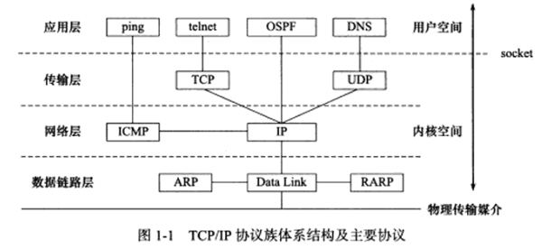

[TOC]

# 第一篇 tcp/ip协议详解

## 1. tcp/ip协议族

### 1.1 TCP/IP协议族体系结构以及主要协议

TCP/IP协议族是一个四层协议系统。每层完成不同的功能，且通过若干协议来实现，上层协议使用下层协议提供的服务。`数据链路层， 网络层， 传输层， 应用层`

#### 1.1.1 数据链路层

数据链路层实现了网卡接口的**网络驱动程序**，以处理数据在物理媒介的传输。隐藏物理网络的细节，为上层协议**提供同一的接口**

常用协议：**ARP协议（地址解析协议）**和**RARP协议（逆地址解析协议）**，实现了IP地址和机器物理地址（通常为MAC地址）之间的转换。

网络层使用IP地址寻址一台机器，数据链路层使用物理地址寻址一台机器，网络层必须先将目标及其的IP地址转换成物理地址，才能使用数据链路层提供的服务，这就是**ARP**协议的用途。

**RARP**协议仅适用于某些无盘工作站，无法记住IP地址，利用网卡物理地址向网络管理者查询自己的IP地址。运行RARP服务的网络管理者通过该网络上所用机器的物理地址映射到IP地址。

#### 1.1.2 网络层

网络层实现**数据包的选路与转发**。对上层协议隐藏了网络拓扑链接的细节信息，从应用层和传输层来看，通讯的双方是直接相连的。

最核心协议**IP协议**。IP协议根据数据包的目的IP地址来解决如何投递它，IP协议使用逐跳的方式确定通信路径。

重要的协议**ICMP协议（因特网控制报文协议）**